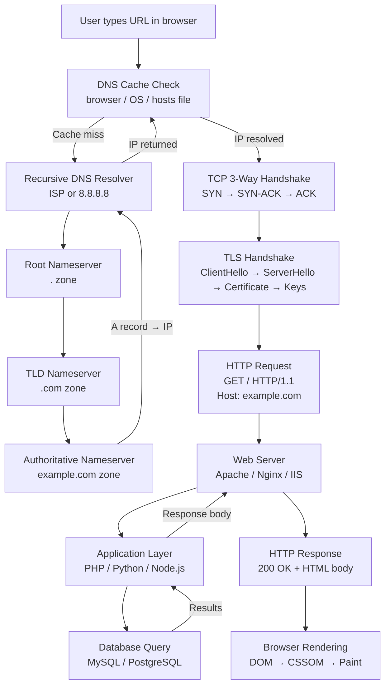

# Internet Architecture

> **The internet is a global network of interconnected computers that communicate using standardized protocols — understanding it is the foundation of web hacking.**

---

## 🧠 What Is It? (Beginner Explanation)

Think of the internet like a global postal system:

| Postal System        | Internet Equivalent                         |
|----------------------|---------------------------------------------|
| Sender               | Your browser                                |
| Address book         | DNS (Domain Name System)                    |
| Post office          | Router / ISP                                |
| Sorting facility     | Core internet routers (BGP backbone)        |
| Delivery truck       | IP packets traveling over TCP               |
| Recipient            | Web server                                  |
| Return address check | SOP / TLS certificate validation            |

When you type `https://example.com` and press Enter, an intricate multi-step process spanning milliseconds launches across the globe. Understanding every step reveals the attack surface.

---

## 🏗️ How It Works — Full URL Request Lifecycle

### Step-by-Step: What Happens When You Visit a URL

1. **Browser parses the URL** — scheme (`https`), hostname (`example.com`), path (`/`), query, fragment
2. **DNS Resolution** — browser checks local cache → OS cache → `/etc/hosts` → recursive resolver → root nameserver → TLD → authoritative nameserver → returns IP
3. **TCP Connection** — 3-way handshake to destination IP on port 443 (SYN → SYN-ACK → ACK)
4. **TLS Handshake** — negotiate cipher suite, exchange certificates, derive session keys
5. **HTTP Request** — browser sends `GET / HTTP/1.1` with headers (Host, User-Agent, Accept, Cookie, etc.)
6. **Server Processing** — web server receives request, routes to application, executes logic, queries DB
7. **HTTP Response** — server sends status code, headers, body (HTML/JSON/etc.)
8. **Browser Rendering** — parse HTML → DOM → CSSOM → Render Tree → Layout → Paint → JavaScript execution

---

## 📊 Diagram — Complete URL Request Lifecycle



---

## 🌐 IP Addressing

### IPv4

- 32-bit addresses: `192.168.1.1` (4 octets, 0-255 each)
- ~4.3 billion total addresses — exhausted, hence IPv6
- Divided into classes (historically) and CIDR notation today

**Private IP Ranges (RFC 1918) — cannot route on public internet:**

| Range                      | CIDR             | Common Use               |
|----------------------------|------------------|--------------------------|
| `10.0.0.0 – 10.255.255.255`  | `10.0.0.0/8`     | Large enterprise networks |
| `172.16.0.0 – 172.31.255.255`| `172.16.0.0/12`  | Docker, cloud internal   |
| `192.168.0.0 – 192.168.255.255` | `192.168.0.0/16` | Home/small office     |
| `127.0.0.0 – 127.255.255.255`| `127.0.0.0/8`    | Loopback (localhost)     |
| `169.254.0.0 – 169.254.255.255` | `169.254.0.0/16` | APIPA / Link-local (SSRF target!) |

> 🔴 **Pentesting Note:** `169.254.169.254` is the AWS EC2 metadata endpoint — a prime SSRF target to steal IAM credentials!

### IPv6

- 128-bit addresses: `2001:0db8:85a3::8a2e:0370:7334`
- `::1` is loopback (equivalent to `127.0.0.1`)
- `fe80::/10` — link-local (not routed)
- Many applications only filter IPv4 — IPv6 bypass is a real attack vector

---

## 🗺️ Routing: How Packets Travel

### BGP (Border Gateway Protocol)
- The routing protocol of the internet
- Autonomous Systems (AS) are networks under one administrative control (e.g., Google = AS15169, Cloudflare = AS13335)
- BGP announcements say "I can reach these IP prefixes"
- **No authentication by default** — leads to BGP hijacking

### How a Packet Travels
```
Your PC → Home Router (NAT) → ISP Edge Router → ISP Core → Peering Point → 
Target ISP → Target Data Center → Load Balancer → Web Server
```

Each router makes a forwarding decision based on the destination IP and its routing table.

---

## 📐 OSI Model — All 7 Layers

| Layer | Name         | Protocol/Technology          | Pentesting Attacks                        |
|-------|--------------|------------------------------|-------------------------------------------|
| 7     | Application  | HTTP, HTTPS, DNS, FTP, SMTP  | SQLi, XSS, IDOR, SSRF, XXE               |
| 6     | Presentation | SSL/TLS, encoding (gzip)     | BEAST, POODLE, HEARTBLEED                 |
| 5     | Session      | Cookies, OAuth tokens        | Session hijacking, fixation               |
| 4     | Transport    | TCP, UDP                     | SYN flood, port scanning, session hijack |
| 3     | Network      | IP, ICMP, BGP                | IP spoofing, ICMP flood, BGP hijack       |
| 2     | Data Link    | Ethernet, ARP, MAC           | ARP poisoning, MAC flooding               |
| 1     | Physical     | Fiber, copper, WiFi          | Physical tap, rogue AP                    |

---

## ⚙️ TCP vs UDP

| Feature             | TCP                              | UDP                               |
|---------------------|----------------------------------|-----------------------------------|
| Connection          | Connection-oriented (handshake)  | Connectionless                    |
| Reliability         | Guaranteed delivery, ordered     | Best-effort, no ordering          |
| Error checking      | Yes — retransmits lost packets   | Minimal                           |
| Speed               | Slower (overhead)                | Faster                            |
| Use cases           | HTTP, HTTPS, SSH, FTP, SMTP      | DNS, QUIC, VoIP, gaming, NTP      |
| Security implication| Session state, SYN floods        | UDP amplification DDoS, DNS spoof |

### Web Ports Reference

| Port  | Protocol   | Service                  | Notes                                     |
|-------|------------|--------------------------|-------------------------------------------|
| 80    | TCP        | HTTP                     | Plaintext web                             |
| 443   | TCP        | HTTPS                    | Encrypted web                             |
| 8080  | TCP        | HTTP alternate           | Dev servers, proxies, Tomcat              |
| 8443  | TCP        | HTTPS alternate          | Dev HTTPS, Tomcat HTTPS                   |
| 8888  | TCP        | HTTP alternate           | Jupyter Notebook default                  |
| 3000  | TCP        | Node.js/React dev        | Common dev server port                    |
| 4000  | TCP        | Various dev servers      | Jekyll, Phoenix, Gatsby                   |
| 9000  | TCP        | PHP-FPM, SonarQube       | Often exposed in misconfig                |
| 5000  | TCP        | Flask, .NET dev          | Python Flask default                      |

---

## ⚙️ Technical Deep Dive

### IP Header Fields (Pentesting Relevance)

```
 0                   1                   2                   3
 0 1 2 3 4 5 6 7 8 9 0 1 2 3 4 5 6 7 8 9 0 1 2 3 4 5 6 7 8 9 0 1
+-+-+-+-+-+-+-+-+-+-+-+-+-+-+-+-+-+-+-+-+-+-+-+-+-+-+-+-+-+-+-+-+
|Version|  IHL  |Type of Service|          Total Length         |
+-+-+-+-+-+-+-+-+-+-+-+-+-+-+-+-+-+-+-+-+-+-+-+-+-+-+-+-+-+-+-+-+
|         Identification        |Flags|      Fragment Offset    |
+-+-+-+-+-+-+-+-+-+-+-+-+-+-+-+-+-+-+-+-+-+-+-+-+-+-+-+-+-+-+-+-+
|  Time to Live |    Protocol   |         Header Checksum       |
+-+-+-+-+-+-+-+-+-+-+-+-+-+-+-+-+-+-+-+-+-+-+-+-+-+-+-+-+-+-+-+-+
|                       Source Address                          |
+-+-+-+-+-+-+-+-+-+-+-+-+-+-+-+-+-+-+-+-+-+-+-+-+-+-+-+-+-+-+-+-+
|                    Destination Address                        |
+-+-+-+-+-+-+-+-+-+-+-+-+-+-+-+-+-+-+-+-+-+-+-+-+-+-+-+-+-+-+-+-+
```

**Key fields for pentesters:**

- **TTL (Time to Live):** Decremented by 1 at each hop. Used for OS fingerprinting:

| Starting TTL | Typical OS                      |
|--------------|---------------------------------|
| 64           | Linux, macOS, FreeBSD           |
| 128          | Windows                         |
| 255          | Cisco IOS, Solaris              |

- **Protocol:** 6=TCP, 17=UDP, 1=ICMP
- **Flags:** DF (Don't Fragment) — path MTU discovery, can be used to infer firewall presence
- **Fragment Offset:** Fragmentation can be used to evade IDS/IPS (fragment scan in nmap)

### MTU and Fragmentation

- **MTU (Maximum Transmission Unit):** Maximum size of a frame. Ethernet = 1500 bytes
- If a packet exceeds MTU, it's fragmented (split) at IP layer
- **Pentest use:** Fragmented packets can bypass stateless firewalls and some IDS signatures
- `nmap --mtu 8` — sends tiny fragments to evade detection

### ICMP (Internet Control Message Protocol)

| ICMP Type | Code | Meaning                  | Pentest Use                           |
|-----------|------|--------------------------|---------------------------------------|
| 0         | 0    | Echo Reply               | Host is up (ping response)            |
| 3         | 0    | Network Unreachable      | Routing issue                         |
| 3         | 3    | Port Unreachable         | UDP port closed                       |
| 3         | 13   | Communication Prohibited | Firewall blocking                     |
| 8         | 0    | Echo Request             | Ping — host discovery                 |
| 11        | 0    | TTL Exceeded             | Traceroute response                   |

### CDNs and Load Balancers

**CDN (Content Delivery Network):**
- Caches content at edge nodes worldwide (Cloudflare, Akamai, Fastly)
- Hides the real origin IP — direct attacks against CDN IPs are ineffective
- SSL termination often happens at CDN edge
- **Attack vectors:** Cache poisoning, bypass via direct IP if found, HTTP request smuggling at CDN/origin boundary

**Load Balancers:**
- Distribute requests across multiple backend servers
- Layer 4 (TCP) or Layer 7 (HTTP) load balancing
- State issues: session might go to different backend — test for session fixation
- May expose backend headers (X-Backend-Server, X-Served-By)

### NAT (Network Address Translation)

- Translates private IPs → public IP for outbound traffic
- Hides internal network topology from outside
- **Pentesting implication:** 
  - From outside: you see only the public IP, not individual internal hosts
  - From inside: may affect reverse shell connections
  - Port forwarding rules may expose internal services

---

## 🔴 Pentesting Relevance

### Finding Real IPs Behind CDN

```bash
# Check DNS history
curl "https://securitytrails.com/domain/example.com/history/a"

# Check certificate transparency for subdomain IPs
curl "https://crt.sh/?q=example.com&output=json" | jq '.[] | .name_value'

# Check if MX records point to origin
dig MX example.com

# Look for direct IP references in JS
curl -s https://example.com | grep -oE '[0-9]{1,3}\.[0-9]{1,3}\.[0-9]{1,3}\.[0-9]{1,3}'

# Test if direct IP responds same as CDN
curl -H "Host: example.com" http://REAL_IP/
```

### BGP Hijacking (Historical Examples)
- **2010 China Telecom incident:** ~15% of internet traffic rerouted through China for 18 minutes via BGP leak
- **2018 MyEtherWallet BGP attack:** Attackers hijacked Amazon Route 53 DNS IPs via BGP to redirect crypto wallet DNS queries
- **2019 Rostelecom:** Accidentally hijacked routes for Google, Amazon, Cloudflare, affecting 8,850 prefixes

### Network-Level MITM Positioning

For an attacker to perform a network MITM they need to be:
1. On the same L2 segment (ARP poisoning)
2. Controlling a router in the path (BGP/routing attack)
3. Controlling DNS (DNS MITM)
4. Performing SSL stripping if TLS is not enforced

### IP Spoofing

- Attacker forges source IP in packets
- Possible for UDP/ICMP (no handshake to verify)
- TCP spoofing very difficult due to 3-way handshake (need to predict ISN)
- Used in: DDoS amplification, blind SSRF obscuring origin

### Traceroute for Network Mapping

```bash
# Linux (ICMP)
traceroute example.com

# Linux (UDP, default)
traceroute -U example.com

# Linux (TCP SYN to port 80 — better firewall traversal)
traceroute -T -p 80 example.com

# Windows
tracert example.com

# MTR — continuous traceroute with stats
mtr --report example.com

# nmap traceroute
nmap --traceroute example.com
```

---

## 🛠️ Tools & Commands

### ping — Host Discovery & Latency

```bash
# Basic ping
ping -c 4 example.com

# Ping with TTL visibility (Linux)
ping -c 1 example.com | grep ttl

# Ping sweep (bash one-liner)
for i in $(seq 1 254); do ping -c1 -W1 192.168.1.$i &>/dev/null && echo "192.168.1.$i is up"; done

# Nmap ping sweep (better)
nmap -sn 192.168.1.0/24
```

### dig — DNS Queries

```bash
# Basic A record lookup
dig example.com A

# Full trace from root
dig +trace example.com

# Reverse lookup (PTR)
dig -x 93.184.216.34

# Query specific nameserver
dig @8.8.8.8 example.com A

# All record types
dig example.com ANY

# Short answer only
dig +short example.com
```

### whois — Domain Registration Info

```bash
# Domain info
whois example.com

# IP ownership
whois 93.184.216.34

# ASN lookup
whois -h whois.radb.net AS15169
```

### curl -v — Full Request Lifecycle Visible

```bash
# Verbose output showing DNS, TCP, TLS, HTTP
curl -v https://example.com

# Include response headers only
curl -I https://example.com

# Follow redirects verbosely
curl -Lv https://example.com

# Show timing breakdown
curl -w "\nDNS: %{time_namelookup}s\nConnect: %{time_connect}s\nTLS: %{time_appconnect}s\nTotal: %{time_total}s\n" -o /dev/null -s https://example.com
```

### Wireshark Display Filters for Web Traffic

```
# HTTP traffic
http

# HTTPS/TLS (can't decrypt without keys)
tls

# DNS queries
dns

# Specific host
ip.addr == 93.184.216.34

# HTTP GET requests only
http.request.method == "GET"

# HTTP 200 responses
http.response.code == 200

# TCP SYN packets (connection attempts)
tcp.flags.syn == 1 && tcp.flags.ack == 0

# Full HTTP conversation filter
http && ip.addr == 93.184.216.34
```

### nmap — Host Discovery & Port Scanning

```bash
# Ping scan (no port scan)
nmap -sn 192.168.1.0/24

# SYN scan (requires root, stealthier)
sudo nmap -sS -p 80,443,8080,8443 example.com

# Service version detection
nmap -sV example.com

# OS detection
sudo nmap -O example.com

# Full scan with scripts
sudo nmap -sV -sC -p- example.com

# Fast scan common ports
nmap -F example.com

# Output to all formats
sudo nmap -sV -oA scan_results example.com
```

---

## 🔍 Detection

- **BGP hijacking detection:** BGPmon, RIPE Stat, Cloudflare BGPStream — monitor for unexpected route announcements
- **ARP poisoning detection:** ARP watches (arpwatch), static ARP entries on critical hosts
- **Unusual TTL values:** IDS rules to flag packets where TTL doesn't match expected values from known hosts
- **Port scanning detection:** Snort/Suricata rules for SYN floods and sequential port probes
- **ICMP abuse:** Rate-limit ICMP; alert on large ICMP data (tunneling indicator)
- **Traceroute blocking:** Most organizations block outbound traceroute at perimeter; log attempts

---

## 🛡️ Mitigation

- **BGP:** Implement RPKI (Resource Public Key Infrastructure) to cryptographically validate BGP announcements
- **IP Spoofing:** Enable BCP38 (ingress filtering) at ISP/router level — drop packets where source IP doesn't match expected subnet
- **CDN origin protection:** Whitelist only CDN IP ranges at origin firewall; use shared secret header (Cloudflare-Auth)
- **Internal network segmentation:** Use VLANs and firewall rules to prevent lateral movement
- **Encrypt all traffic:** TLS everywhere so MITM yields only ciphertext
- **HSTS and certificate pinning:** Prevent TLS downgrade and fraudulent certs
- **Private IP ranges:** Firewall egress to block SSRF to metadata endpoints (`169.254.169.254`, `169.254.170.2`)

---

## 📚 References

- [RFC 791 — Internet Protocol (IPv4)](https://www.rfc-editor.org/rfc/rfc791)
- [RFC 793 — Transmission Control Protocol](https://www.rfc-editor.org/rfc/rfc793)
- [RFC 1918 — Private IP Address Space](https://www.rfc-editor.org/rfc/rfc1918)
- [RFC 4271 — BGP-4](https://www.rfc-editor.org/rfc/rfc4271)
- [OWASP Testing Guide — Network Infrastructure Testing](https://owasp.org/www-project-web-security-testing-guide/)
- [Cloudflare Learning — How the Internet Works](https://www.cloudflare.com/learning/network-layer/how-does-the-internet-work/)
- [nmap.org — Official Documentation](https://nmap.org/book/man.html)
