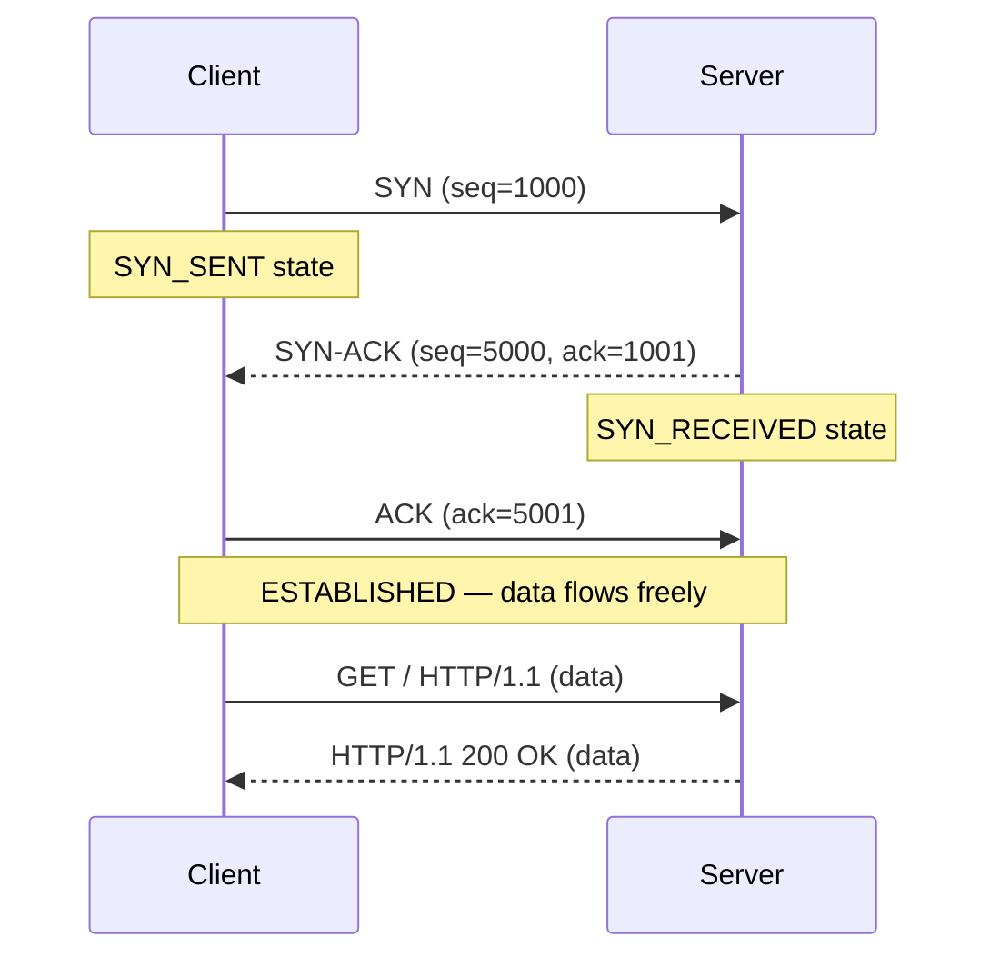
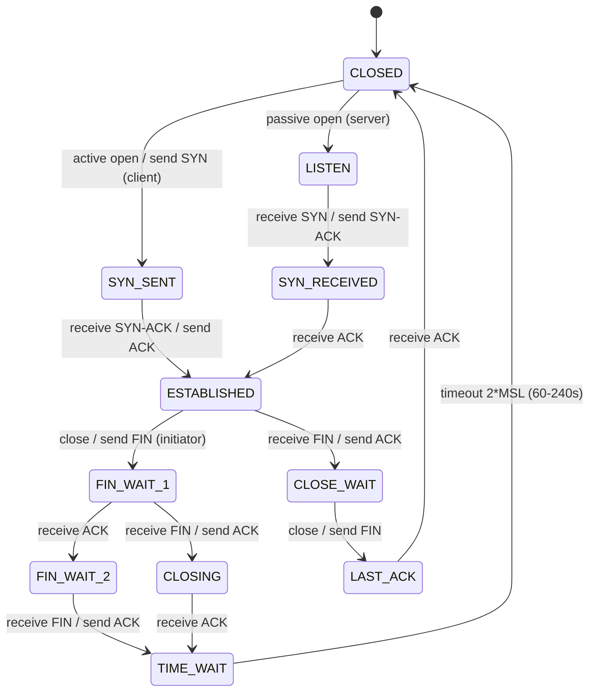

# TCP/IP Stack

> **TCP/IP is the fundamental communication protocol of the internet — every web request rides on it.**

---

## 🧠 What Is It? (Beginner Explanation)

TCP/IP is the suite of rules that governs how data travels across the internet. Think of:
- **IP** as the postal address system — decides *where* to send data
- **TCP** as the delivery service — ensures data *arrives correctly*, in order, without loss

Every HTTP request, every HTTPS connection, every API call rides on top of TCP/IP. Understanding it at the packet level unlocks the ability to:
- Perform stealthy port scans
- Craft custom packets for firewall evasion
- Understand how session hijacking works
- Analyze captured traffic in Wireshark

---

## 🏗️ TCP 3-Way Handshake

Before any data is exchanged, TCP establishes a connection through a **3-way handshake**:

| Step | Direction         | Flag(s)  | Purpose                                    |
|------|-------------------|----------|--------------------------------------------|
| 1    | Client → Server   | SYN      | "I want to connect. My ISN is X"           |
| 2    | Server → Client   | SYN-ACK  | "OK. My ISN is Y. Acknowledge your X+1"   |
| 3    | Client → Server   | ACK      | "Acknowledged. Ready to send data"         |



### ISN — Initial Sequence Number

- Each side picks a random **32-bit ISN** at connection start
- **Why random?** Predictable ISNs allowed **session hijacking** attacks
- CVE: Early TCP implementations used predictable ISNs (Morris Worm, 1988 exploited this)
- Modern OSes use cryptographically random ISNs (RFC 6528)

---

## ⚙️ TCP Flags — Complete Reference

| Flag | Bit   | Name        | Meaning & Pentesting Use                                           |
|------|-------|-------------|--------------------------------------------------------------------|
| SYN  | 0x02  | Synchronize | Initiates connection; used in SYN scans, SYN floods               |
| ACK  | 0x10  | Acknowledge | Acknowledges received data; SYN-ACK response to SYN               |
| FIN  | 0x01  | Finish      | Graceful connection close; used in FIN scans                       |
| RST  | 0x04  | Reset       | Abruptly terminates connection; closed port indicator              |
| PSH  | 0x08  | Push        | Push data to application immediately (no buffering)               |
| URG  | 0x20  | Urgent      | Urgent data pointer active (rarely used legitimately)              |
| ECE  | 0x40  | ECN Echo    | Explicit Congestion Notification (RFC 3168)                        |
| CWR  | 0x80  | Cong Window | Congestion Window Reduced                                          |

### Nmap and TCP Flags

```bash
# SYN scan uses SYN, expects SYN-ACK (open) or RST (closed)
sudo nmap -sS target

# FIN scan sends FIN (no SYN first) — some firewalls don't log non-SYN
sudo nmap -sF target

# NULL scan — no flags set
sudo nmap -sN target

# Xmas scan — FIN+PSH+URG all lit up
sudo nmap -sX target

# ACK scan — tests if port is filtered (firewall drops) vs unfiltered (RST returned)
sudo nmap -sA target
```

---

## 📊 Diagram — TCP Connection Lifecycle



### TCP States Explained

| State         | Meaning                                                    | Pentest Relevance                        |
|---------------|------------------------------------------------------------|------------------------------------------|
| LISTEN        | Server waiting for incoming connections                    | Target for SYN flood                     |
| SYN_SENT      | Client sent SYN, waiting for SYN-ACK                      | Indicates in-progress connection attempt |
| SYN_RECEIVED  | Server received SYN, sent SYN-ACK                         | During half-open scan detection          |
| ESTABLISHED   | Connection active, data flowing                            | Session hijacking target                 |
| FIN_WAIT_1    | Sent FIN, waiting for ACK                                  | Connections in teardown                  |
| TIME_WAIT     | Waiting 2×MSL before full close (prevent stale packets)   | Port reuse attacks; large count = DDoS   |
| CLOSE_WAIT    | Received FIN from peer, app hasn't closed yet              | Application bug if large count           |

```bash
# View TCP connections and states
ss -tnp                              # Linux (modern)
netstat -tnp                         # Linux (classic)
netstat -ano | findstr :443          # Windows

# Count connections per state (server under load analysis)
ss -tan | awk '{print $1}' | sort | uniq -c | sort -rn
```

---

## ⚙️ Nmap Scan Types — Internal Mechanics

### SYN Scan (-sS) — "Half-Open Scan"

```
Client → Server: SYN
Server → Client: SYN-ACK  [PORT IS OPEN]
Client → Server: RST       ← deliberately abort, never complete handshake
```

**Why stealthy?**
- Never completes the TCP handshake — some logging systems only log full connections
- **Requires root** (must craft raw packets)
- Default nmap scan type when run as root

```bash
sudo nmap -sS -p 80,443,8080 192.168.1.0/24
```

### Connect Scan (-sT) — "Full Connect"

```
Client → Server: SYN
Server → Client: SYN-ACK
Client → Server: ACK       ← completes handshake
Client → Server: RST       ← or FIN to close
```

**When to use:**
- When you don't have root/admin privileges (no raw socket access)
- Noisier — logged by most systems
- Works through SOCKS proxies

```bash
nmap -sT -p 80,443 target.com  # no sudo needed
```

### FIN / NULL / Xmas Scans — Firewall Evasion

These exploit RFC 793 behavior: packets with unexpected flags to closed ports return RST; open ports **silently drop** unexpected packets.

```
FIN scan:   Sends FIN
NULL scan:  Sends packet with NO flags (empty)
Xmas scan:  Sends FIN+PSH+URG (lights up like Christmas tree)
```

**Open port:**  No response (silently drops the packet)
**Closed port:** RST returned

**Caveats:**
- **Windows ignores this RFC behavior** — always sends RST regardless of port state
- Some firewalls drop all non-SYN initiating packets
- Useful against Linux/Unix targets with stateless firewalls

```bash
sudo nmap -sF 192.168.1.100   # FIN scan
sudo nmap -sN 192.168.1.100   # NULL scan  
sudo nmap -sX 192.168.1.100   # Xmas scan
```

### UDP Scan (-sU)

**Challenge:** UDP is connectionless — no SYN/ACK. How do you know if port is open?
- **Open/Filtered:** No response (UDP service received packet, processed it silently)
- **Closed:** ICMP "Port Unreachable" (Type 3, Code 3) returned
- **Filtered:** ICMP "Admin Prohibited" or no response

```bash
# UDP scan (slow — rate limiting of ICMP responses)
sudo nmap -sU -p 53,67,68,69,123,161,500 target.com

# Speed up with --min-rate
sudo nmap -sU --min-rate 1000 target.com

# Combine UDP + TCP
sudo nmap -sU -sS target.com
```

### Idle/Zombie Scan (-sI) — Ultimate Stealth

Uses a "zombie" host with predictable IP ID sequence to scan target without revealing your IP.

```bash
sudo nmap -sI zombie.host target.com -p 80
```

---

## 📐 IP Header — Pentesting Details

```
Version(4) | IHL(4) | DSCP(6) | ECN(2) | Total Length(16)
Identification(16)  | Flags(3) | Fragment Offset(13)
TTL(8)    | Protocol(8)        | Header Checksum(16)
Source IP Address(32)
Destination IP Address(32)
Options (0 or 32+ bits)
```

### TTL OS Fingerprinting

When you receive a packet, look at the TTL. Subtract number of hops to estimate the starting TTL:

| Starting TTL | OS                                    |
|--------------|---------------------------------------|
| 255          | Cisco IOS, Solaris, AIX               |
| 128          | Windows (XP/7/8/10/11, Server 2003+)  |
| 64           | Linux (2.6+), macOS, FreeBSD, Android |
| 60           | OpenBSD                               |
| 30           | Older Windows 95/98                   |

```bash
# Check TTL in ping
ping -c 1 192.168.1.1 | grep ttl
# output: 64 bytes from 192.168.1.1: icmp_seq=1 ttl=128 time=1.2 ms
# TTL=128 → Windows!

# nmap OS detection (more reliable)
sudo nmap -O target.com
```

### Protocol Numbers

| Protocol # | Name  | Use                           |
|------------|-------|-------------------------------|
| 1          | ICMP  | Ping, traceroute, errors      |
| 6          | TCP   | HTTP, HTTPS, SSH, FTP...      |
| 17         | UDP   | DNS, DHCP, NTP, QUIC          |
| 47         | GRE   | VPN tunnels                   |
| 50         | ESP   | IPSec encrypted payload       |
| 51         | AH    | IPSec authentication header   |

---

## 🌐 Common Web Ports Reference

| Port  | TCP/UDP | Service                  | Default Credentials / Notes                     |
|-------|---------|--------------------------|--------------------------------------------------|
| 21    | TCP     | FTP                      | Often anonymous login; plaintext                 |
| 22    | TCP     | SSH                      | root/root, admin/admin; brute force target       |
| 23    | TCP     | Telnet                   | Plaintext; legacy devices                        |
| 25    | TCP     | SMTP                     | Email sending; open relay misconfiguration       |
| 53    | UDP/TCP | DNS                      | Zone transfers on TCP; amplification on UDP      |
| 80    | TCP     | HTTP                     | Plaintext web                                    |
| 110   | TCP     | POP3                     | Email retrieval; plaintext                       |
| 143   | TCP     | IMAP                     | Email; plaintext                                 |
| 443   | TCP     | HTTPS                    | TLS-encrypted web                                |
| 445   | TCP     | SMB                      | EternalBlue (MS17-010), file shares              |
| 1433  | TCP     | MSSQL                    | sa/(blank); remote code execution via xp_cmdshell|
| 3306  | TCP     | MySQL                    | root/(blank); often exposed with bad config      |
| 3389  | TCP     | RDP                      | BlueKeep (CVE-2019-0708); brute force            |
| 5432  | TCP     | PostgreSQL               | postgres/postgres                                |
| 6379  | TCP     | Redis                    | No auth by default; RCE via config rewrite       |
| 8080  | TCP     | HTTP alternate           | Tomcat (tomcat/tomcat), Jenkins default          |
| 8443  | TCP     | HTTPS alternate          | Tomcat HTTPS                                     |
| 8888  | TCP     | Jupyter Notebook         | Often no password in dev environments            |
| 9200  | TCP     | Elasticsearch            | No auth by default; full DB access               |
| 27017 | TCP     | MongoDB                  | No auth by default in older versions             |

---

## 💥 TCP-Level Attacks

### SYN Flood (DDoS)

**How it works:**
1. Attacker sends thousands of SYN packets with spoofed source IPs
2. Server responds with SYN-ACK and waits for ACK (stores in `SYN backlog`)
3. No ACK comes (spoofed IP) — half-open connections fill backlog
4. Server's SYN backlog exhausted — legitimate connections refused

```bash
# Testing SYN flood with hping3 (authorized testing only!)
sudo hping3 -S --flood -V -p 80 target.com
```

**Mitigations:** SYN cookies (RFC 4987), rate limiting, firewalls with SYN proxy

### RST Injection (TCP Connection Termination)

**How it works:**
- An attacker on the network path sends a RST packet with a valid sequence number
- Both endpoints think the connection was terminated
- Used to: kill VPN sessions, disrupt connections, used by The Great Firewall of China

**Defense:** IPSec, encrypted tunnels where RST injection is ineffective

### TCP Session Hijacking (Theory)

**Historical attack — requires network position:**
1. Attacker monitors TCP stream, notes sequence numbers
2. Attacker injects packets with correct sequence numbers
3. Server accepts injected commands as legitimate
4. **Prevention:** TLS encryption (sequence numbers still exist but data is encrypted)

---

## 🛠️ Tools & Commands

### nmap — Complete Cheatsheet

```bash
# Discovery scans
nmap -sn 192.168.1.0/24                       # Ping scan (no ports)
nmap -sn -PE -PA80 192.168.1.0/24            # ICMP + ACK probe

# Port scans
sudo nmap -sS -p- target.com                  # SYN scan all 65535 ports
sudo nmap -sS -p 1-1000 target.com            # SYN scan ports 1-1000
nmap -sT -p 22,80,443 target.com             # Connect scan
sudo nmap -sU -p 53,123,161 target.com       # UDP scan
sudo nmap -sF -p 80 target.com               # FIN scan

# Service and version detection
nmap -sV target.com                           # Service version
nmap -sV --version-intensity 9 target.com    # Aggressive version detection
sudo nmap -O target.com                       # OS detection
sudo nmap -A target.com                       # Aggressive: -sV -O -sC --traceroute

# NSE scripts
nmap -sC target.com                           # Default scripts
nmap --script=http-title target.com          # Specific script
nmap --script=http-* target.com              # All HTTP scripts
nmap --script=vuln target.com                # Vulnerability scripts
nmap --script=banner target.com              # Banner grabbing

# Output
nmap -oN output.txt target.com               # Normal output
nmap -oX output.xml target.com               # XML (for import to Metasploit)
nmap -oG output.grep target.com             # Greppable
nmap -oA output target.com                  # All three formats

# Evasion
sudo nmap -sS -f target.com                 # Fragment packets
sudo nmap -sS -D RND:10 target.com          # Use 10 decoys
sudo nmap -sS --source-port 53 target.com   # Spoof source port 53
sudo nmap -sS -T0 target.com                # Paranoid timing (very slow)
sudo nmap -sS --data-length 25 target.com   # Append random data
```

### tcpdump — Packet Capture

```bash
# Capture all traffic on interface
sudo tcpdump -i eth0

# Capture to file (for Wireshark)
sudo tcpdump -i eth0 -w capture.pcap

# HTTP traffic only
sudo tcpdump -i eth0 port 80 or port 443

# Traffic to/from specific host
sudo tcpdump -i eth0 host 192.168.1.100

# TCP SYN packets only (connection attempts)
sudo tcpdump -i eth0 'tcp[tcpflags] & tcp-syn != 0'

# Show packet contents in ASCII
sudo tcpdump -i eth0 -A port 80

# DNS queries
sudo tcpdump -i eth0 -n 'udp port 53'
```

### Wireshark Display Filters for Web Analysis

```
# HTTP traffic
http

# TLS/HTTPS traffic  
tls

# TCP SYN (new connections)
tcp.flags.syn == 1 && tcp.flags.ack == 0

# TCP RST (connection resets — errors, scans, firewall drops)
tcp.flags.reset == 1

# HTTP GET requests
http.request.method == "GET"

# HTTP POST requests
http.request.method == "POST"

# Specific HTTP status codes
http.response.code == 200
http.response.code == 403
http.response.code == 500

# Traffic to/from IP
ip.addr == 192.168.1.100

# Traffic to specific port
tcp.dstport == 443

# Retransmissions (packet loss indicator)
tcp.analysis.retransmission

# TCP conversation stream (right-click → Follow TCP Stream is easier)
tcp.stream == 0

# DNS queries
dns.qry.type == 1  (A records)
dns.qry.name contains "example"

# HTTP Host header
http.host == "example.com"

# HTTP cookie
http.cookie contains "session"

# HTTP Authorization header
http.authorization
```

### netstat / ss — Connection Analysis

```bash
# All TCP connections with PIDs (Linux)
ss -tnp

# Listening ports only
ss -tlnp

# All UDP connections
ss -unp

# Connections to specific port
ss -tn dport :443

# Windows equivalents
netstat -ano                          # All connections with PIDs
netstat -ano | findstr :443           # Filter by port
netstat -ano | findstr ESTABLISHED    # Only established
```

---

## 🔍 Detection

| Attack         | Detection                                                                    |
|----------------|------------------------------------------------------------------------------|
| SYN flood      | Monitor SYN/ACK ratio; alert on >1000 half-open connections; SYN cookie logs |
| Port scanning  | Snort rule: 10+ SYN to different ports within 1s from same source            |
| FIN/NULL/Xmas  | Packet with FIN but no prior connection tracked; flag-combo anomalies         |
| RST injection  | RST without matching connection in firewall state table                       |
| OS fingerprint | Detect nmap -O via characteristic probe patterns (13 specific NMAP packets)   |

---

## 🛡️ Mitigation

| Threat             | Mitigation                                                                      |
|--------------------|---------------------------------------------------------------------------------|
| SYN flood          | SYN cookies (RFC 4987); rate limiting per source IP; DDoS protection services  |
| Port scanning      | Firewall default-deny; port knocking; move services to non-standard ports       |
| Session hijacking  | Mandatory TLS; IPSec for sensitive internal traffic; TCP sequence randomization |
| RST injection      | Encrypted tunnels (TLS, IPSec); QUIC protocol (UDP-based, harder to inject)     |
| Idle/zombie scan   | Ensure zombie hosts don't have predictable IP IDs (Linux uses random IP IDs)   |

---

## 📚 References

- [RFC 793 — Transmission Control Protocol](https://www.rfc-editor.org/rfc/rfc793)
- [RFC 9293 — TCP (updated, 2022)](https://www.rfc-editor.org/rfc/rfc9293)
- [RFC 4987 — TCP SYN Flooding Attacks and Common Mitigations](https://www.rfc-editor.org/rfc/rfc4987)
- [RFC 6528 — Defending Against Sequence Number Attacks](https://www.rfc-editor.org/rfc/rfc6528)
- [nmap Book — Port Scanning Techniques](https://nmap.org/book/man-port-scanning-techniques.html)
- [SANS TCP/IP Poster](https://www.sans.org/security-resources/tcpip.pdf)
- [Wireshark Display Filter Reference](https://www.wireshark.org/docs/dfref/)
