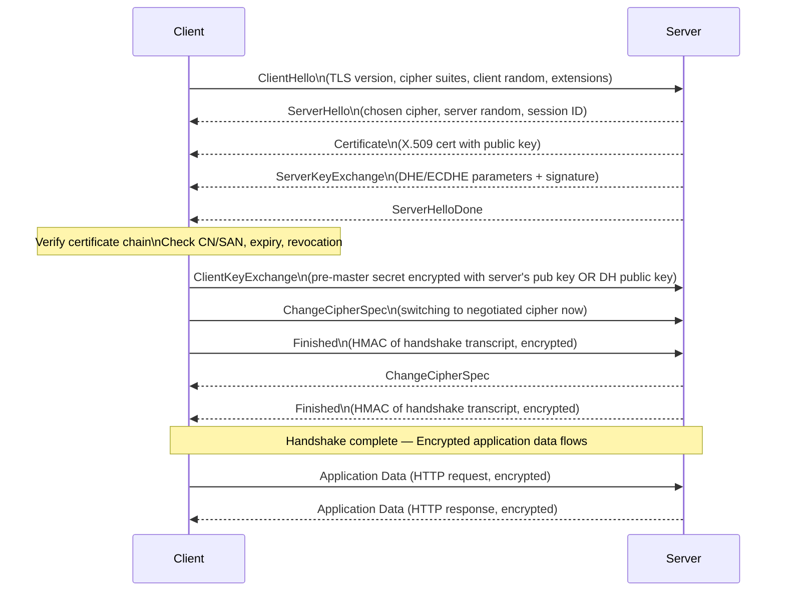
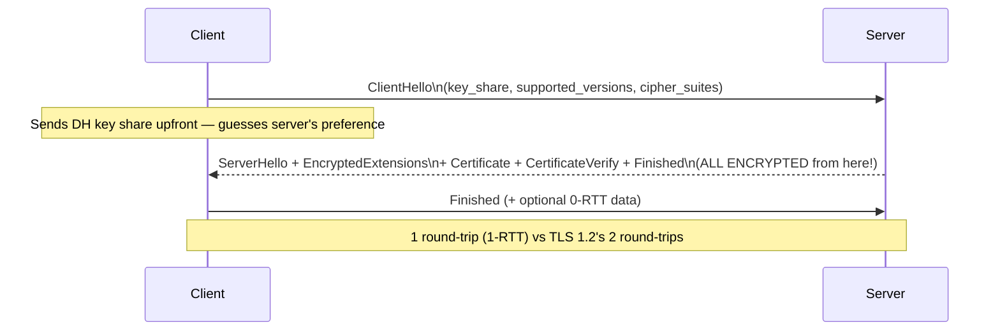
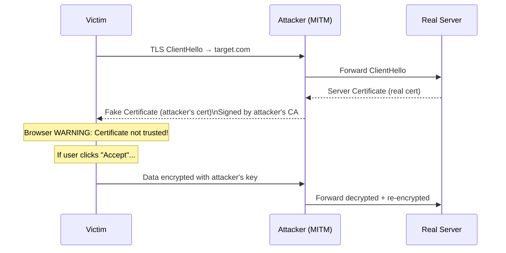

# TLS/SSL — Transport Layer Security

> **TLS encrypts web traffic — but misconfigurations and protocol weaknesses have led to some of the most devastating vulnerabilities in history.**

---

## 🧠 What Is It? (Beginner Explanation)

Without TLS, everything you send over the internet — passwords, credit cards, cookies — travels as **plaintext**. Anyone on your network (or any hop between you and the server) can read it.

TLS (formerly SSL) provides:
1. **Confidentiality** — data is encrypted
2. **Integrity** — data can't be modified in transit
3. **Authentication** — you're talking to the real server, not an impersonator

Every time you see `https://` and the padlock icon, TLS is at work.

---

## 🏗️ Protocol History Timeline

| Version    | Year | Status        | Key Changes / Issues                                              |
|------------|------|---------------|-------------------------------------------------------------------|
| SSL 1.0    | 1994 | Never released| Too many flaws, Netscape kept it internal                         |
| SSL 2.0    | 1995 | Deprecated    | Broken — weak MAC, session renegotiation flaws (DROWN exploits this) |
| SSL 3.0    | 1996 | Deprecated    | Better but still broken — POODLE attack                          |
| TLS 1.0    | 1999 | Deprecated    | Based on SSL 3.0 with fixes; BEAST attack; RFC 2246              |
| TLS 1.1    | 2006 | Deprecated    | BEAST mitigation; RFC 4346; deprecated by RFC 8996 (2021)        |
| TLS 1.2    | 2008 | **Widely used**| GCM ciphers; SHA-256; AEAD; RFC 5246; still secure if configured |
| TLS 1.3    | 2018 | **Current**   | Removed legacy crypto; 1-RTT; 0-RTT; forward secrecy mandatory  |

> ⚠️ **TLS 1.0 and 1.1 are officially deprecated** (RFC 8996, March 2021). PCI-DSS requires TLS 1.2 minimum.

---

## 📊 TLS 1.2 Handshake — Full Step-by-Step



### Key Exchange — How Session Keys Are Derived

**Without Forward Secrecy (RSA Key Exchange):**
```
Client encrypts pre-master secret with server's RSA public key
→ Server decrypts with private key
→ Both derive session keys from pre-master secret + randoms
⚠️ If server private key is later compromised, ALL past sessions can be decrypted!
```

**With Perfect Forward Secrecy (DHE/ECDHE):**
```
Ephemeral DH key pair generated per session
→ DH exchange derives shared secret
→ Session keys derived, DH keys discarded
✅ Server private key compromise cannot decrypt past sessions
```

---

## 📊 TLS 1.3 Improvements



**TLS 1.3 Key Changes:**

| Feature                    | TLS 1.2               | TLS 1.3                          |
|----------------------------|-----------------------|----------------------------------|
| Round trips to establish   | 2-RTT                 | 1-RTT (0-RTT possible)          |
| RSA key exchange           | Allowed               | **Removed**                      |
| Static Diffie-Hellman      | Allowed               | **Removed**                      |
| PFS                        | Optional              | **Mandatory**                    |
| Cipher suites              | Hundreds              | 5 (all AEAD)                     |
| Compression                | Optional (CRIME attack)| **Removed**                     |
| Renegotiation              | Allowed               | **Removed** (used in BEAST)      |
| Certificate in handshake   | Unencrypted           | **Encrypted**                    |
| Session resumption         | Session ID / tickets  | PSK-based                        |

**0-RTT (Zero Round Trip):** Session resumption can send application data immediately with a Pre-Shared Key (PSK). 
⚠️ **0-RTT has replay attack risk** — not safe for non-idempotent operations (POST, payments)

---

## ⚙️ Cipher Suites — How to Read Them

```
TLS_ECDHE_RSA_WITH_AES_256_GCM_SHA384
 │    │      │       │    │   │   │
 │    │      │       │    │   │   └─ MAC/PRF algorithm (SHA-384)
 │    │      │       │    │   └───── Mode (GCM = Galois/Counter Mode, AEAD)
 │    │      │       │    └───────── Key size (256-bit AES)
 │    │      │       └────────────── Bulk encryption algorithm (AES)
 │    │      └────────────────────── Authentication (RSA certificate)
 │    └───────────────────────────── Key exchange (ECDHE = Elliptic Curve DHE)
 └────────────────────────────────── Protocol
```

**Good cipher suites (TLS 1.2):**
```
TLS_ECDHE_RSA_WITH_AES_256_GCM_SHA384   ← Best: ECDHE + AES-GCM (AEAD)
TLS_ECDHE_RSA_WITH_AES_128_GCM_SHA256   ← Good
TLS_ECDHE_ECDSA_WITH_AES_256_GCM_SHA384 ← Good (ECDSA cert)
TLS_DHE_RSA_WITH_AES_256_GCM_SHA384     ← Good: DHE (classical) + AES-GCM
```

**Weak/vulnerable cipher suites (should be disabled):**
```
TLS_RSA_WITH_AES_256_CBC_SHA256   ← No PFS (RSA key exchange)
TLS_RSA_WITH_RC4_128_MD5          ← RC4 is broken
TLS_RSA_EXPORT_*                  ← Export-grade (FREAK attack)
SSL_CK_DES_192_EDE3_CBC_WITH_MD5  ← 3DES (SWEET32 attack)
TLS_DHE_*_EXPORT_*                ← Export DHE (LOGJAM attack)
TLS_*_NULL_*                      ← No encryption!
TLS_*_WITH_RC4_*                  ← RC4 is cryptographically broken
```

**TLS 1.3 cipher suites (5 only, all AEAD):**
```
TLS_AES_256_GCM_SHA384
TLS_CHACHA20_POLY1305_SHA256
TLS_AES_128_GCM_SHA256
TLS_AES_128_CCM_8_SHA256
TLS_AES_128_CCM_SHA256
```

---

## ⚙️ X.509 Certificates

### Certificate Structure

```
Certificate:
  Version: 3
  Serial Number: 14:65:fa:17:...
  Signature Algorithm: sha256WithRSAEncryption
  Issuer: CN=DigiCert TLS RSA SHA256 2020 CA1, O=DigiCert Inc
  Validity:
    Not Before: Jan 15 00:00:00 2024
    Not After:  Jan 14 23:59:59 2025
  Subject: CN=example.com, O=Internet Corporation..., C=US
  Subject Public Key Info:
    Public Key Algorithm: rsaEncryption
    RSA Public Key: (2048 bit)
  X509v3 Extensions:
    Subject Alternative Name:          ← SANs — what the cert is valid for
      DNS:example.com, DNS:www.example.com
    Key Usage: Digital Signature, Key Encipherment
    Extended Key Usage: TLS Web Server Authentication
    Certificate Policies: OID 2.23.140.1.2.1  ← Domain Validation (DV)
    CRL Distribution Points:
      http://crl3.digicert.com/...
    Authority Information Access:
      OCSP: http://ocsp.digicert.com
      CA Issuers: http://cacerts.digicert.com/...
    CT Precertificate SCTs:            ← Certificate Transparency evidence
      Signed Certificate Timestamp...
```

### Certificate Validation Chain

```
Root CA (self-signed, in browser trust store)
  └── Intermediate CA (signed by Root)
        └── Server Certificate (signed by Intermediate)
```

**Browser checks:**
1. Signature chain validates to trusted Root
2. Certificate not expired
3. Certificate not revoked (CRL or OCSP)
4. Hostname matches CN or SAN
5. Key usage allows TLS server auth

### Certificate Transparency (CT Logs)

Every publicly trusted certificate is logged to CT logs — **this is goldmine for recon!**

```bash
# Find all certs for a domain (subdomains exposed!)
curl "https://crt.sh/?q=%.example.com&output=json" | jq -r '.[].name_value' | sort -u

# Quick one-liner for recon
curl -s "https://crt.sh/?q=%25.example.com&output=json" | \
  jq -r '.[].name_value' | \
  sed 's/\*\.//g' | \
  sort -u | \
  grep -v "^#"
```

---

## 💥 TLS Attacks

### BEAST (CVE-2011-3389) — Browser Exploit Against SSL/TLS

**Affected:** TLS 1.0 (CBC cipher suites)
**Attack type:** Chosen plaintext attack against CBC mode

**How it works:**
- TLS 1.0 CBC uses the last ciphertext block as IV for the next record — **predictable IV**
- Attacker in MITM position can do a "blockwise chosen-boundary" attack
- JavaScript in attacker's page sends requests to victim's origin, manipulating what gets encrypted
- By controlling block boundaries, attacker can decrypt the session cookie byte-by-byte

**Mitigation:** Upgrade to TLS 1.2+; 1/n-1 record splitting; RC4 (temporary, now also broken)

---

### POODLE (CVE-2014-3566) — Padding Oracle On Downgraded Legacy Encryption

**Affected:** SSL 3.0 (CBC cipher suites)
**Attack type:** Padding oracle + protocol downgrade

**How it works:**
1. Attacker performs downgrade: force client to use SSL 3.0 by failing TLS handshakes
2. SSL 3.0 CBC padding: last byte of plaintext block specifies padding length; **rest of padding not checked**
3. Attacker can substitute any block for the last block — if padding byte is correct, server accepts
4. 256 requests (on average 128) to decrypt 1 byte → 1,360 requests to steal a 17-byte cookie

**POODLE TLS:** A variant affecting TLS implementations that don't validate CBC padding properly

**Mitigation:** Disable SSL 3.0 completely; TLS_FALLBACK_SCSV to prevent downgrade

```bash
# Test for POODLE with openssl
openssl s_client -ssl3 -connect target.com:443

# Better: use testssl.sh
testssl.sh --poodle target.com
```

---

### DROWN (CVE-2016-0800) — Decrypting RSA with Obsolete and Weakened eNcryption

**Affected:** Any server sharing RSA private key with SSLv2-enabled server
**Attack type:** Cross-protocol attack; Bleichenbacher RSA padding oracle

**How it works:**
1. Server supports SSLv2 (even on a different port/service)
2. SSLv2 export cipher uses only 40-bit RSA key
3. Attacker captures TLS 1.2 RSA handshakes from the target server
4. Uses SSLv2 oracle to decrypt the captured TLS sessions
5. ~1,000,000 SSLv2 oracle queries → decrypt 1 TLS session

**Real impact:** ~33% of HTTPS servers were vulnerable at disclosure (2016)

**Mitigation:** Disable SSLv2 everywhere; never share private keys between services

---

### HEARTBLEED (CVE-2014-0160) — Most Famous TLS Vulnerability

**Affected:** OpenSSL 1.0.1 through 1.0.1f
**Attack type:** Buffer over-read in TLS heartbeat extension

**How the heartbeat extension works (legitimate):**
```
Client: "Heartbeat! Send me back 'HELLO' (5 bytes)"
Server: "HELLO" [keeps connection alive]
```

**How Heartbleed works:**
```
Attacker: "Heartbeat! Send me back 'X' (64,000 bytes)"
OpenSSL: [reads 1 byte from heap, then copies next 63,999 bytes of whatever is in memory]
Attacker receives: Private keys, passwords, session tokens, PII from server memory
```

**There was no length check** — the server trusted the "I want N bytes back" value.

```python
# Heartbleed PoC (educational — simplified concept)
import struct

# TLS heartbeat request:
# Type=1 (request), length=0xffff (65535 bytes requested)
heartbeat_payload = b'\x18\x03\x02\x00\x03\x01\xff\xff'
# Vulnerable server returns up to 64KB of its memory per request
```

```bash
# Test with nmap script
nmap --script ssl-heartbleed target.com -p 443

# Test with testssl.sh
testssl.sh --heartbleed target.com

# Actual CVE scanner
python heartbleed.py target.com
```

**Real impact:**
- Private SSL keys exposed → all encrypted communications compromised
- Session tokens → immediate account takeover
- Passwords → user credential theft
- Estimated 500,000+ servers affected at disclosure (April 2014)

**Mitigation:** Patch OpenSSL; reissue all certificates (keys may be compromised); invalidate all sessions

---

### FREAK (CVE-2015-0204) — Factoring RSA Export Keys

**Affected:** Many SSL/TLS clients including OpenSSL, SecureTransport (iOS/OS X)
**Attack type:** Cipher suite downgrade to export-grade RSA (512-bit)

**How it works:**
1. Client capable of strong crypto; attacker MITM intercepts ClientHello
2. Attacker modifies ClientHello to include only `RSA_EXPORT` cipher suites
3. Server with export support accepts and sends 512-bit RSA key
4. Attacker factors the 512-bit key in ~7 hours for ~$100 (cloud compute)
5. Now attacker can MITM the "encrypted" session

**Mitigation:** Disable all export cipher suites; patch OpenSSL/OS

```bash
testssl.sh --freak target.com
```

---

### LOGJAM (CVE-2015-4000) — Diffie-Hellman Export Downgrade

**Affected:** TLS implementations supporting DHE_EXPORT; virtually all browsers
**Attack type:** DH parameter downgrade to 512-bit "export" keys

**How it works:** Similar to FREAK but targeting DHE:
1. Downgrade DHE parameter to export-grade 512-bit
2. Attacker precomputes a log table for common 512-bit DH primes (~1 week of compute)
3. Per-connection solve becomes seconds
4. Can MITM academic ~20% of HTTPS servers at time of disclosure

**Additional finding:** Many servers use the same 1024-bit DH prime → precompute once, break many

**Nation-state implication:** NSA likely performed this against 1024-bit Diffie-Hellman (Snowden docs referenced)

**Mitigation:** Disable DHE_EXPORT; use 2048-bit+ DH params; prefer ECDHE

```bash
# Generate strong DH params (2048-bit, takes a minute)
openssl dhparam -out /etc/ssl/dhparam.pem 2048

# Test for Logjam
testssl.sh --logjam target.com
```

---

### ROBOT (2017) — Return Of Bleichenbacher's Oracle Threat

**Affected:** Multiple TLS implementations (F5, Cisco ACE, Citrix, Radware, etc.)
**Attack type:** Bleichenbacher RSA padding oracle (PKCS#1 v1.5)

**How it works:**
- Server leaks whether RSA decryption succeeded via different error messages/timing
- 1998 Bleichenbacher attack: ~1,000,000 oracle queries to decrypt RSA ciphertext
- ROBOT found 7 major vendors still vulnerable in 2017 — 19 years after original paper!

```bash
# Test with ROBOT checker
python robot_attack.py target.com 443

testssl.sh --robot target.com
```

---

### Downgrade Attacks and TLS_FALLBACK_SCSV

**The problem:** Attackers can force older protocol versions by causing handshake failures.

**TLS_FALLBACK_SCSV (RFC 7507):** Client includes this special value in fallback connections. If server supports higher protocol version, it sends `inappropriate_fallback` alert — prevents successful downgrade.

```bash
# Check if server sends appropriate_fallback alert
openssl s_client -connect target.com:443 -tls1_1 -fallback_scsv
```

---

### MITM with Self-Signed/Fraudulent Certificates



**Tools:** mitmproxy, Burp Suite, SSLstrip

---

## 🛠️ Tools & Commands

### openssl s_client — Complete Cheatsheet

```bash
# Basic TLS connection
openssl s_client -connect target.com:443

# Show full certificate chain
openssl s_client -connect target.com:443 -showcerts

# Force specific TLS version
openssl s_client -connect target.com:443 -tls1
openssl s_client -connect target.com:443 -tls1_1
openssl s_client -connect target.com:443 -tls1_2
openssl s_client -connect target.com:443 -tls1_3

# Force specific cipher suite
openssl s_client -connect target.com:443 -cipher 'RC4-MD5'

# Test for SSLv2/SSLv3 support (should be rejected)
openssl s_client -connect target.com:443 -ssl2
openssl s_client -connect target.com:443 -ssl3

# Send HTTP request through TLS
echo "GET / HTTP/1.1\r\nHost: target.com\r\n\r\n" | openssl s_client -connect target.com:443 -quiet

# Check OCSP stapling
openssl s_client -connect target.com:443 -status

# View certificate details
openssl s_client -connect target.com:443 2>/dev/null | openssl x509 -text -noout

# Check certificate expiry
echo | openssl s_client -connect target.com:443 2>/dev/null | \
  openssl x509 -noout -dates

# Get certificate fingerprint
echo | openssl s_client -connect target.com:443 2>/dev/null | \
  openssl x509 -fingerprint -sha256 -noout

# Test HSTS header
curl -si https://target.com | grep -i strict-transport
```

### testssl.sh — Comprehensive TLS Testing

```bash
# Full scan
testssl.sh target.com

# Specific vulnerability tests
testssl.sh --heartbleed target.com
testssl.sh --poodle target.com
testssl.sh --freak target.com
testssl.sh --logjam target.com
testssl.sh --beast target.com
testssl.sh --drown target.com
testssl.sh --robot target.com

# Check cipher support
testssl.sh --cipher-per-proto target.com

# Check protocols
testssl.sh --protocols target.com

# Check headers
testssl.sh --headers target.com

# Check certificate
testssl.sh --certinfo target.com

# Output to JSON
testssl.sh --jsonfile output.json target.com

# Batch test from file
testssl.sh --file targets.txt
```

### sslyze — Python TLS Scanner

```bash
# Install
pip install sslyze

# Scan single target
python -m sslyze target.com

# Scan with specific plugins
python -m sslyze --heartbleed --openssl_ccs target.com

# JSON output
python -m sslyze --json_out results.json target.com

# Check certificate pinning
python -m sslyze --certinfo target.com
```

### sslscan — Quick TLS Audit

```bash
# Basic scan
sslscan target.com

# Include verbose cipher info
sslscan --show-ciphers target.com

# Scan non-standard port
sslscan target.com:8443

# XML output
sslscan --xml=output.xml target.com
```

---

## 🔍 Detection

| Attack       | Detection                                                                          |
|--------------|------------------------------------------------------------------------------------|
| HEARTBLEED   | IDS signatures for malformed heartbeat records; monitor OpenSSL version in inventory |
| POODLE/BEAST | Monitor for clients negotiating SSLv3/TLS 1.0; alert on downgrade patterns        |
| LOGJAM/FREAK | Log cipher suites negotiated; alert on export-grade ciphers                       |
| ROBOT        | Monitor for unusually high TLS handshake error rates (oracle queries generate errors)|
| Cert MITM    | Certificate Transparency monitoring; HPKP violations (historical); mismatch alerts |
| Downgrade    | Monitor for TLS_FALLBACK_SCSV without valid reason in logs                         |

---

## 🛡️ Mitigation

### Server Hardening Checklist

```nginx
# Nginx TLS hardening
ssl_protocols TLSv1.2 TLSv1.3;
ssl_ciphers ECDHE-ECDSA-AES128-GCM-SHA256:ECDHE-RSA-AES128-GCM-SHA256:ECDHE-ECDSA-AES256-GCM-SHA384:ECDHE-RSA-AES256-GCM-SHA384:DHE-RSA-AES128-GCM-SHA256:DHE-RSA-AES256-GCM-SHA384;
ssl_prefer_server_ciphers off;  # TLS 1.3 client preference is fine
ssl_dhparam /etc/ssl/dhparam.pem;  # 2048-bit minimum
ssl_session_timeout 1d;
ssl_session_cache shared:SSL:50m;
ssl_stapling on;
ssl_stapling_verify on;

# HSTS
add_header Strict-Transport-Security "max-age=63072000; includeSubDomains; preload" always;
```

```apache
# Apache TLS hardening
SSLProtocol all -SSLv3 -TLSv1 -TLSv1.1
SSLCipherSuite ECDHE-ECDSA-AES128-GCM-SHA256:ECDHE-RSA-AES128-GCM-SHA256...
SSLHonorCipherOrder off
SSLUseStapling on
Header always set Strict-Transport-Security "max-age=63072000; includeSubDomains; preload"
```

### Summary of Mitigations

| Vulnerability | Fix                                                                     |
|---------------|-------------------------------------------------------------------------|
| HEARTBLEED    | Patch OpenSSL ≥1.0.1g; reissue certificates                            |
| BEAST         | Upgrade to TLS 1.2+                                                    |
| POODLE        | Disable SSLv3; enable TLS_FALLBACK_SCSV                                |
| DROWN         | Disable SSLv2 everywhere; don't share keys between services             |
| FREAK         | Disable RSA_EXPORT cipher suites                                        |
| LOGJAM        | Disable DHE_EXPORT; use ≥2048-bit DH params; prefer ECDHE              |
| ROBOT         | Patch TLS stack; use constant-time RSA operations                       |
| General       | Use TLS 1.3; enable PFS; HSTS; certificate pinning for critical apps    |

---

## 📚 References

- [RFC 8446 — TLS 1.3](https://www.rfc-editor.org/rfc/rfc8446)
- [RFC 5246 — TLS 1.2](https://www.rfc-editor.org/rfc/rfc5246)
- [CVE-2014-0160 — HEARTBLEED](https://nvd.nist.gov/vuln/detail/CVE-2014-0160)
- [CVE-2014-3566 — POODLE](https://nvd.nist.gov/vuln/detail/CVE-2014-3566)
- [CVE-2016-0800 — DROWN](https://drownattack.com/)
- [LOGJAM Attack](https://weakdh.org/)
- [ROBOT Attack](https://robotattack.org/)
- [testssl.sh Documentation](https://testssl.sh/)
- [Mozilla SSL Configuration Generator](https://ssl-config.mozilla.org/)
- [SSL Labs — Qualys SSL Test](https://www.ssllabs.com/ssltest/)
