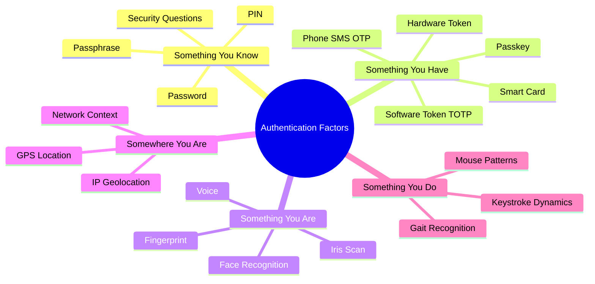

# Authentication Mechanisms

> **Authentication is the process of proving you are who you claim to be — like showing a passport at the border.**

---

## 🧠 What Is It? (Beginner Explanation)

Imagine you walk up to a nightclub. The bouncer needs to verify three things:

1. **Who are you claiming to be?** → You say "I'm John Smith" (Identification)
2. **Can you prove it?** → You show your ID card (Authentication)
3. **Are you allowed in the VIP area?** → The bouncer checks the guest list (Authorization)

These three concepts are often confused but are completely different:

| Concept | Question Answered | Example |
|---|---|---|
| **Identification** | Who are you? | "My username is admin" |
| **Authentication** | Can you prove it? | Providing the correct password |
| **Authorization** | What are you allowed to do? | Admin can delete users; normal user cannot |

In web security, we almost always attack **authentication** because it's the first gate. Once you bypass it, you are "inside" and may inherit whatever privileges that account has.

---

## 🏗️ How It Works (Technical Deep Dive)

### The Three (Plus Two) Factors of Authentication

Authentication factors are categories of evidence you can present to prove your identity.

#### Factor 1: Something You Know (Knowledge)
- **Passwords**: The most common. A secret string only you should know.
- **PINs**: Numeric-only passwords, often 4–6 digits.
- **Security Questions**: "What was your mother's maiden name?" — notoriously weak because the answers are often guessable or publicly findable.
- **Passphrases**: Multiple words strung together (e.g., `correct-horse-battery-staple`).

**Weakness**: Can be stolen, guessed, phished, or found in data breaches.

#### Factor 2: Something You Have (Possession)
- **Hardware tokens**: Physical devices (e.g., RSA SecurID, YubiKey) that generate codes.
- **Software tokens**: Apps like Google Authenticator that generate TOTP codes.
- **Smart cards**: Physical cards with embedded chips (used in government, banking).
- **Mobile phones**: SMS OTP codes are sent to your registered number.
- **Recovery codes**: Backup codes printed or stored by the user.

**Weakness**: Can be stolen, lost, or cloned (in some cases). SIM swapping defeats SMS.

#### Factor 3: Something You Are (Inherence / Biometrics)
- **Fingerprint**: Capacitive or optical scanners read fingerprint ridge patterns.
- **Face recognition**: Infrared or visible-light analysis of facial geometry.
- **Iris scan**: Unique vein patterns in the iris.
- **Voice recognition**: Vocal frequency analysis.
- **Vein patterns**: Near-infrared imaging of hand/finger vein structures.

**Liveness detection**: Modern systems attempt to prevent spoofing (e.g., photo attacks) by checking for:
- Blink detection (face)
- 3D depth mapping (Face ID)
- Temperature sensors (fingerprint liveness)
- Challenge-response (smile, turn head)

**Weakness**: Cannot be revoked if compromised. Fingerprints are left everywhere. False accept/reject rates exist.

#### Factor 4: Somewhere You Are (Location)
- **Geolocation**: IP address-based or GPS-based location checking.
- **Network context**: "Is the user on the corporate VPN?"
- **Impossible travel detection**: Logging in from New York then Tokyo 10 minutes later triggers alerts.

**Weakness**: VPNs, proxies, and Tor easily bypass IP-based geolocation.

#### Factor 5: Something You Do (Behavioral)
- **Typing rhythm (keystroke dynamics)**: The timing between key presses is unique per person.
- **Mouse movement patterns**: How you move a mouse is surprisingly unique.
- **Touchscreen pressure**: The way you swipe has biometric properties.
- **Gait recognition**: How you walk, detected via phone accelerometers.

**Weakness**: Hardest to fake but also hardest to implement reliably. Currently more used for continuous authentication / fraud detection than primary auth.

---

### Authentication Mechanisms In Detail

#### 1. Passwords
**How they work:**
1. User enters username + password.
2. Server looks up the user record.
3. Server hashes the provided password with the stored salt.
4. Server compares computed hash with stored hash.
5. If match → authentication succeeds.

**How passwords are stored (the right way):**
```
stored_value = bcrypt(password + salt, cost_factor=12)
```

**How passwords are transmitted:**
- Over HTTPS: password travels encrypted in the POST body.
- Over HTTP: password is plaintext — trivially intercepted.

**Attack surface**: Phishing, brute force, credential stuffing, weak hashes, password reuse.

#### 2. Tokens

**Hardware Tokens (RSA SecurID):**
- Physical device with a built-in clock and secret seed.
- Generates a new 6-8 digit code every 60 seconds using `TOTP(seed, time)`.
- Server has the same seed and performs the same calculation to verify.

**Software Tokens (TOTP):**
- App (Google Authenticator) stores a secret seed (shared during enrollment via QR code).
- App computes `HOTP(seed, floor(unix_time / 30))` every 30 seconds.
- Same algorithm run server-side for verification.

**Session Tokens:**
- After successful login, server generates a random session ID (e.g., 128-bit random string).
- Stored in a cookie or returned in response.
- On every subsequent request, session ID is sent → server looks up the session → user is identified.

#### 3. Digital Certificates

**PKI (Public Key Infrastructure):**
- Every entity has a key pair: private key (kept secret) + public key (shared freely).
- A Certificate Authority (CA) signs the public key, creating a certificate.
- Others can trust the certificate because they trust the CA.

**Client Certificates (Mutual TLS / mTLS):**
- In normal TLS, only the *server* proves its identity to the client.
- In mTLS, the *client* also presents a certificate to the server.
- Used in corporate environments, API-to-API communication, government systems.

```
Client → sends ClientCertificate message in TLS handshake
Server → verifies certificate chain up to trusted CA
Server → grants access if certificate is valid and trusted
```

#### 4. Biometrics (Technical)

**Fingerprint:**
1. Scanner captures image of fingerprint.
2. Software extracts "minutiae" — ridge endings and bifurcations.
3. Minutiae are converted to a mathematical template.
4. Template is compared against stored template using a matching algorithm.
5. If similarity score > threshold → match.

The template is never an image; it's a vector of features. This makes it harder to reverse but not impossible.

**Face Recognition:**
1. Camera captures image/video.
2. Face detection locates the face region.
3. Facial landmarks (eyes, nose, mouth) are detected.
4. Face is normalized (aligned, scaled).
5. Neural network converts face to an embedding vector (128–512 dimensions).
6. Embedding is compared to stored embedding using cosine similarity.

**False Accept Rate (FAR)** = probability a wrong person is accepted.
**False Reject Rate (FRR)** = probability the right person is rejected.

These are tunable parameters that trade off security vs usability.

#### 5. OTP (One-Time Passwords)

**SMS OTP:**
- Server generates random 4-8 digit code.
- Sends via SMS to registered phone number.
- User enters code within time window.
- Server validates, invalidates code after use.

**Email OTP:**
- Same concept but delivered via email.
- Longer validity window (typically 10-15 minutes).

**Authenticator App OTP (TOTP):**
- See TOTP details in the MFA file.
- Far more secure than SMS — not vulnerable to SIM swapping.

#### 6. Magic Links

- User enters their email address only (no password).
- Server generates a unique, time-limited, single-use token.
- Server emails a link: `https://app.com/auth?token=abc123xyz`
- User clicks link → server validates token → session created → token invalidated.

**Security depends on**:
- Token randomness (should be 128+ bits of entropy)
- Token expiry (usually 15 minutes)
- Single-use enforcement
- Email channel security

#### 7. Passkeys (FIDO2 / WebAuthn Overview)

Passkeys are the modern replacement for passwords, using public-key cryptography.

**Enrollment:**
1. Device generates a key pair for the website.
2. Private key stays on device (in secure enclave — never leaves).
3. Public key is sent to and stored by the website.

**Authentication:**
1. Website sends a random challenge.
2. Device signs the challenge with the private key (after user verification: biometric/PIN).
3. Website verifies the signature with the stored public key.

**Why passkeys are phishing-resistant:**
- The key pair is bound to a specific origin (domain name).
- Even if the user visits `evil-google.com`, the passkey for `google.com` will never be used there.
- No password to steal, phish, or reuse across sites.

#### 8. SSO: SAML vs OAuth vs OIDC

| Protocol | Use Case | Token Type | Based On |
|---|---|---|---|
| **SAML 2.0** | Enterprise SSO (corporate login) | XML Assertion | XML / HTTP-POST |
| **OAuth 2.0** | Delegated authorization ("Login with Google") | Access Token (opaque or JWT) | REST / JSON |
| **OIDC** | Identity layer on top of OAuth | ID Token (JWT) | OAuth 2.0 + JWT |

---

## 📊 Diagram

### Complete Authentication Flow (Web Application)

```mermaid
sequenceDiagram
    participant User
    participant Browser
    participant WebServer
    participant SessionStore
    participant Database

    User->>Browser: Enter username + password
    Browser->>WebServer: POST /login {username, password} over HTTPS
    WebServer->>Database: SELECT hash, salt FROM users WHERE username=?
    Database-->>WebServer: Return stored_hash, salt
    WebServer->>WebServer: compute = hash(password + salt)
    WebServer->>WebServer: compare(compute, stored_hash)

    alt Authentication Succeeds
        WebServer->>SessionStore: CREATE session {user_id, roles, created_at}
        SessionStore-->>WebServer: session_id = "abc123"
        WebServer-->>Browser: Set-Cookie: session=abc123; HttpOnly; Secure; SameSite=Lax
        Browser-->>User: Redirect to /dashboard
    else Authentication Fails
        WebServer-->>Browser: 401 Unauthorized - "Invalid credentials"
        Browser-->>User: Show error message
    end

    Note over Browser,WebServer: Subsequent Requests
    Browser->>WebServer: GET /dashboard Cookie: session=abc123
    WebServer->>SessionStore: LOOKUP session abc123
    SessionStore-->>WebServer: {user_id: 42, roles: ["user"]}
    WebServer-->>Browser: 200 OK - Dashboard HTML
```

### Authentication Factor Hierarchy



---

## ⚙️ Technical Details

### Session-Based vs Token-Based Authentication

| Aspect | Session-Based Auth | Token-Based Auth (JWT) |
|---|---|---|
| **Storage** | Session ID in cookie; data on server | All data encoded in token (client-side) |
| **Statefulness** | Stateful (server stores session data) | Stateless (server needs no storage) |
| **Scalability** | Requires shared session store (Redis) in cluster | Scales horizontally with no shared state |
| **Revocation** | Easy — delete session from store | Hard — token valid until expiry unless using blocklist |
| **Size** | Small cookie (session ID only) | Larger token (all claims encoded) |
| **XSS Risk** | Lower (HttpOnly cookie) | Higher (if stored in localStorage) |
| **CSRF Risk** | Higher (cookie automatically sent) | Lower (token in Authorization header) |
| **Best For** | Traditional web apps | APIs, SPAs, mobile apps, microservices |

### Cookie Security Attributes Reference

| Attribute | Purpose | Effect if Missing |
|---|---|---|
| `HttpOnly` | Prevents JS access to cookie | XSS can steal session cookie |
| `Secure` | Only send over HTTPS | Cookie sent over HTTP — sniffable |
| `SameSite=Strict` | Never sent cross-site | More restrictive than Lax |
| `SameSite=Lax` | Not sent on cross-site POST | CSRF on POST endpoints possible |
| `SameSite=None` | Sent on all cross-site requests | CSRF possible (requires `Secure`) |
| `Domain` | Scope to domain/subdomains | Defaults to exact host |
| `Path` | Scope to path | Cookie sent to all paths |
| `Expires/Max-Age` | Persistent vs session cookie | Session cookie (deleted on browser close) |

---

## 🔴 Attack Surface & Exploitation

### Attack Surface Per Mechanism

| Mechanism | Primary Attacks |
|---|---|
| **Password** | Brute force, phishing, credential stuffing, weak storage, reset poisoning |
| **SMS OTP** | SIM swapping, SS7 interception, phishing real-time relay |
| **TOTP** | Real-time phishing relay, seed theft, brute force (if no rate limiting) |
| **Magic Link** | Predictable tokens, token in URL (Referer leak), email account compromise |
| **Client Certificate** | Private key theft, weak CA trust, certificate not revoked |
| **OAuth** | CSRF on state parameter, redirect_uri bypass, token leakage |
| **SAML** | XML signature wrapping, XXE, assertion replay |
| **Passkey/FIDO2** | Device compromise, malicious authenticator at enrollment |
| **Session** | XSS hijacking, network sniffing (no HTTPS), fixation, prediction |
| **JWT** | alg:none, algorithm confusion, weak secret, kid injection |

### Identification (Username Enumeration) is Authentication-Adjacent

Even before authentication, being able to enumerate valid usernames gives attackers a valuable list to target.

**Common username enumeration vectors:**
- Login page returns "Invalid password" vs "User not found" (different messages)
- Registration page returns "Username already taken"
- Password reset page: "We sent a reset email to john@example.com" (confirms account exists)
- Response time differences (timing attacks): if the server only hashes when user exists, timing leaks existence
- Account lockout: "You have been locked out" only appears for valid accounts

---

## 💥 Payloads & Examples

### Testing Username Enumeration with Timing

```python
import requests
import time

target_url = "https://target.com/login"
test_usernames = ["admin", "administrator", "root", "user", "nonexistent_xyz_abc"]
password = "wrongpassword"

for username in test_usernames:
    start = time.time()
    r = requests.post(target_url, data={
        "username": username,
        "password": password
    })
    elapsed = time.time() - start
    print(f"[{elapsed:.4f}s] {username}: {r.status_code} | {len(r.text)} bytes")
```

Significant timing differences (e.g., 0.05s vs 0.5s) indicate the server is performing a hash operation only for valid users.

### Burp Suite: Testing Different Response Lengths for Enumeration

1. Capture login POST in Burp Proxy.
2. Send to Intruder.
3. Set payload position on username field.
4. Load a username wordlist (SecLists: `Discovery/Web-Content/common-usernames.txt`).
5. Run attack, sort by **Response Length** column.
6. Outliers (shorter or longer responses) often indicate valid vs invalid usernames.

---

## 🛠️ Tools & Commands

```bash
# Burp Suite — intercept, replay, fuzz authentication requests
# Community: free, Pro: paid (recommended for Intruder speed)

# Hydra — credential brute force
hydra -l admin -P /usr/share/wordlists/rockyou.txt target.com http-post-form "/login:username=^USER^&password=^PASS^:Invalid credentials"

# ffuf — fast web fuzzer for auth endpoints
ffuf -w /usr/share/seclists/Usernames/top-usernames-shortlist.txt \
     -u https://target.com/login \
     -X POST \
     -d "username=FUZZ&password=wrongpass" \
     -H "Content-Type: application/x-www-form-urlencoded" \
     -mc 200 -fs 1234

# curl — manual testing
curl -s -X POST https://target.com/login \
     -d "username=admin&password=password" \
     -c cookies.txt -b cookies.txt -L -v

# Python requests session testing
python3 -c "
import requests
s = requests.Session()
r = s.post('https://target.com/login', data={'u':'admin','p':'pass'})
print(r.status_code, r.cookies)
"
```

---

## 🔍 Detection

**Signs of authentication attacks in logs:**
- Multiple failed login attempts from same IP (brute force)
- Multiple failed logins for same username (targeted attack)
- Failed logins distributed across many IPs (password spraying / distributed brute force)
- Successful login from unusual geography
- Login at unusual time for that account
- Rapid sequential logins to many different accounts (credential stuffing)

**What to monitor:**
- Authentication failure rates per IP, per username, per time window
- Successful logins after N previous failures
- Account lockout events
- Password reset request frequency
- MFA failure rates

---

## 🛡️ Mitigation

### Authentication Security Checklist

| Control | Description | Priority |
|---|---|---|
| **Strong password hashing** | Use bcrypt, Argon2id, or scrypt — never MD5/SHA1 | Critical |
| **Multi-factor authentication** | Require 2FA for all accounts, especially privileged | Critical |
| **Account lockout / rate limiting** | Max 5-10 failed attempts before lockout or CAPTCHA | High |
| **Consistent error messages** | "Invalid username or password" — never distinguish | High |
| **HTTPS everywhere** | All auth requests must use TLS 1.2+ | Critical |
| **Secure cookies** | HttpOnly, Secure, SameSite on session cookies | High |
| **Token expiry** | Session tokens expire after inactivity and absolute timeout | High |
| **Logout invalidates session** | Server-side session destruction on logout | High |
| **Re-authentication for sensitive actions** | Confirm password before changing email/password | Medium |
| **Credential stuffing protection** | Check breached password databases (HaveIBeenPwned API) | Medium |
| **Passkeys / FIDO2** | Migrate to phishing-resistant authentication | High |

---

## 📚 References

- [OWASP Authentication Cheat Sheet](https://cheatsheetseries.owasp.org/cheatsheets/Authentication_Cheat_Sheet.html)
- [OWASP Testing Guide: Authentication Testing](https://owasp.org/www-project-web-security-testing-guide/latest/4-Web_Application_Security_Testing/04-Authentication_Testing/)
- [NIST SP 800-63B: Digital Identity Guidelines](https://pages.nist.gov/800-63-3/sp800-63b.html)
- [PortSwigger Web Security Academy: Authentication](https://portswigger.net/web-security/authentication)
- [FIDO Alliance: Passkey Overview](https://fidoalliance.org/passkeys/)
- [RFC 6238: TOTP](https://tools.ietf.org/html/rfc6238)
- [RFC 6749: OAuth 2.0](https://tools.ietf.org/html/rfc6749)
- [OWASP Top 10 A07: Identification and Authentication Failures](https://owasp.org/Top10/A07_2021-Identification_and_Authentication_Failures/)
