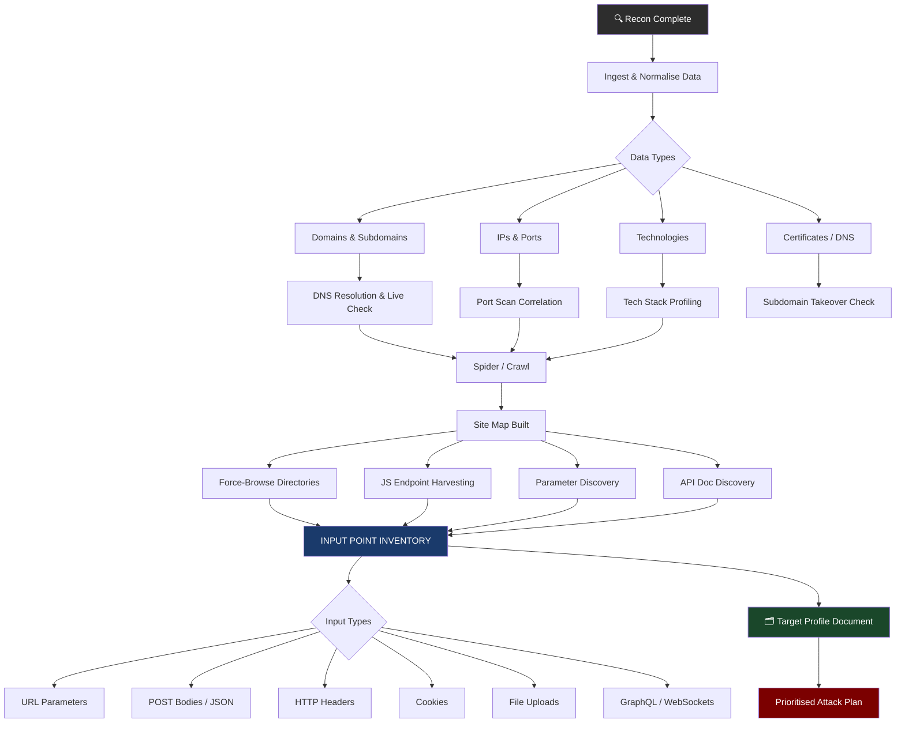
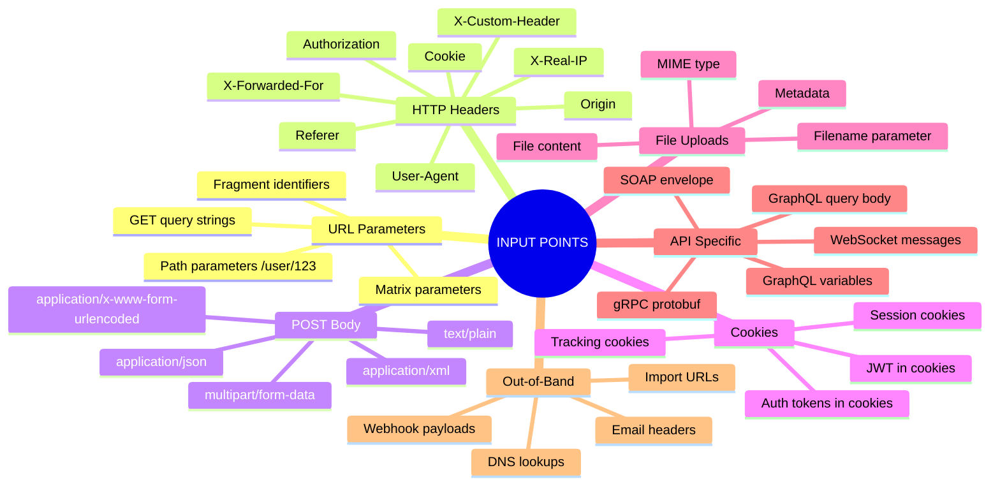

# Mapping the Attack Surface
> **The systematic process of identifying every possible entry point into a target application — turning raw recon data into an actionable map of things to attack**

---

## 🧠 What Is It?

Attack surface mapping is the bridge between **passive recon** (gathering information) and **active exploitation** (finding and using vulnerabilities). It is the discipline of cataloguing every interface, input, endpoint, technology, and integration point that an attacker could interact with.

The attack surface of a web application includes:
- Every URL the server responds to (even with 40x codes)
- Every parameter the application processes
- Every HTTP header the application reads
- Every file/directory that exists on the server
- Every third-party integration and its trust boundary
- Every API endpoint, authenticated or not
- Every JavaScript file loaded by the browser
- Every subdomain pointing at a live service
- Every admin interface, developer tool, or forgotten endpoint

> **Why it matters**: Vulnerabilities only exist within the attack surface. A vulnerability you didn't map is a vulnerability you'll never find. Comprehensive mapping = comprehensive coverage.

---

## 🏗️ How It Works

The mapping process follows a structured pipeline:

1. **Ingest recon data** — All collected domains, IPs, headers, certificates, DNS records, OSINT
2. **Normalise and deduplicate** — Build a clean, unified inventory
3. **Probe for live services** — Determine what's actually running and responding
4. **Crawl and spider** — Discover linked content by following the app itself
5. **Force-browse** — Discover unlinked content by brute-forcing paths
6. **Harvest endpoints** — Extract endpoints from JS, API docs, mobile apps
7. **Identify all input points** — Every place data flows into the application
8. **Profile technologies** — Frameworks, servers, libraries, third parties
9. **Build the target profile** — A structured document capturing everything
10. **Prioritise by attack potential** — Score and rank for exploitation

---

## 📊 Diagram



---

## ⚙️ Technical Details

### The Recon → Mapping Transition

After recon, you will typically have:

| Recon Artifact | What to Do With It |
|---|---|
| Subdomain list (amass, subfinder, etc.) | Resolve to IPs, check HTTP/S, feed to crawler |
| IP ranges / ASN data | Port scan with nmap/masscan, correlate to domains |
| Certificate SANs | Add domains to scope, check each |
| Shodan/Censys results | Add exposed services to inventory |
| Web archive URLs (gau, waybackurls) | Feed to param discovery, check for old endpoints |
| JavaScript files found | Run linkfinder/xnLinkFinder on each |
| HTTP response headers | Tech fingerprint (X-Powered-By, Server, cookies) |
| GitHub dorks results | Check for API keys, hardcoded creds, internal URLs |

The raw data from recon must be **deduplicated, normalised, and enriched** before mapping begins. Tools like `httpx` help by taking a list of domains/IPs and returning live hosts with status codes, titles, tech stacks, and response sizes in one pass.

```bash
# Take all subdomains and probe for live HTTP services
cat all-subdomains.txt | httpx -silent -status-code -title -tech-detect \
  -follow-redirects -o live-hosts.txt

# Output format: https://sub.target.com [200] [Login - MyApp] [nginx,PHP]
```

---

## 💥 Exploitation Step-by-Step

### Phase 1 — Building Your Inventory

An inventory is a structured database (or spreadsheet) of every discovered asset. This is your working document for the entire engagement.

#### Inventory Fields to Track

| Field | Description | Example |
|---|---|---|
| `asset_id` | Unique ID | `T-001` |
| `type` | domain / subdomain / ip / endpoint | `subdomain` |
| `value` | The actual asset | `api.target.com` |
| `ip` | Resolved IP address | `203.0.113.42` |
| `ports` | Open ports | `80,443,8443` |
| `http_status` | Response code | `200` |
| `title` | Page title | `API v2 — Target Corp` |
| `tech_stack` | Detected technologies | `nginx/1.18, Express 4.18, Node 18` |
| `interesting` | Boolean flag | `true` |
| `notes` | Free text | `Swagger UI accessible at /api-docs` |
| `auth_required` | Boolean | `false` |
| `tested` | Boolean | `false` |

```bash
# Use httpx to auto-generate inventory starter
cat subdomains.txt | httpx -silent -status-code -title -tech-detect \
  -follow-redirects -json -o inventory-raw.json

# Parse with jq to build CSV
jq -r '[.url, .status_code, .title, (.technologies // [] | join(";"))] | @csv' \
  inventory-raw.json > inventory.csv
```

---

### Phase 2 — Spider the Web Application with Burp Suite

Burp Suite's crawler (called "Spider" in older versions, "Crawl" in modern versions) discovers content by **following links** the application itself provides — just like a search engine bot.

#### Setting Up Scope (Critical First Step)

Before crawling anything, define your scope to avoid crawling third-party sites or logging out of the application.

1. Open **Target > Scope > Include in scope**
2. Add your target: `https://target.com`
3. Advanced scope control — use regex for precision:

```
# Include pattern (regex in Burp)
^https?://([a-z0-9-]+\.)?target\.com/.*$

# Exclude patterns — prevent logout, destructive actions, external links
^https?://.*\.target\.com/logout.*$
^https?://.*\.target\.com/delete.*$
^https?://.*\.target\.com/unsubscribe.*$
^https?://cdnjs\.cloudflare\.com/.*$
^https?://fonts\.googleapis\.com/.*$
```

4. Go to **Settings > Project > Connections > Hostname Resolution** if you need to point a domain at a specific IP.

#### Configuring the Crawler

In Burp Suite Pro, go to **Dashboard > New scan** or **Target > right-click > Scan**:

| Setting | Recommended Value | Reason |
|---|---|---|
| **Crawl strategy** | `More complete` | Finds more content |
| **Maximum link depth** | `10` | Balances coverage vs time |
| **Maximum unique locations** | `10000` | Prevents runaway crawls |
| **Crawl optimisation** | `Fast` | For initial pass |
| **Login sequence** | Record a macro | Authenticate the crawler |
| **Maximum concurrent requests** | `10` | Polite crawling |
| **Passive crawling** | Always enabled | Zero risk |

#### Passive vs Active Crawling

| Mode | How It Works | Risk | Best For |
|---|---|---|---|
| **Passive** | Observes requests you make manually, extracts links from responses | Zero risk, never sends new requests | Production targets, authenticated content |
| **Active** | Burp sends new requests to discovered links automatically | Sends real HTTP requests | Dev/test environments, comprehensive mapping |

**Best practice**: Always start with **passive crawling** by manually browsing the application yourself. Let Burp observe. This gives you authenticated coverage without automated noise. Then layer active crawling on top.

#### Using Burp's Site Map Effectively

After crawling, go to **Target > Site Map**:

- **Filter by response code**: Show only 200s, or show only 401/403s (those are interesting — they exist but block you)
- **Filter by file extension**: Find all `.js`, `.json`, `.xml`, `.config` files
- **Right-click > Add to scope** on interesting subtrees
- **Right-click > Send to Intruder/Repeater** on interesting endpoints
- **Show only in-scope items** to reduce noise
- Look for **parameters column** — endpoints already harvested with parameters

```
Site Map Tips:
- Sort by "# params" descending → highest input complexity first
- Look for /api/, /v1/, /v2/ prefixes → API endpoints
- Look for .json responses → often structured data leaks
- Look for /admin/, /internal/, /debug/ → access control targets
- Check "Response" tab for hints in error messages
```

---

### Phase 3 — Force-Browsing Directories

Force-browsing (also called directory busting or content discovery) finds content that is **not linked** from anywhere — backup files, admin panels, old API versions, config files, test pages.

#### ffuf — Fast Web Fuzzer (Recommended for Most Cases)

```bash
# Basic directory brute-force
ffuf -w /usr/share/seclists/Discovery/Web-Content/directory-list-2.3-medium.txt \
  -u https://target.com/FUZZ \
  -mc 200,301,302,401,403 \
  -t 50 -c

# With file extensions
ffuf -w /usr/share/seclists/Discovery/Web-Content/directory-list-2.3-medium.txt \
  -u https://target.com/FUZZ \
  -e .php,.html,.txt,.js,.json,.xml,.bak,.old,.zip,.tar.gz \
  -mc 200,301,302,401,403 \
  -t 50 -c -o ffuf-results.json -of json

# Filter by response size (remove false positives)
ffuf -w /usr/share/seclists/Discovery/Web-Content/raft-medium-words.txt \
  -u https://target.com/FUZZ \
  -mc 200,301,302,401,403 \
  -fs 1234 \
  -t 50 -c

# Authenticated scan (with cookie)
ffuf -w /usr/share/seclists/Discovery/Web-Content/directory-list-2.3-medium.txt \
  -u https://target.com/FUZZ \
  -H "Cookie: session=abc123; auth_token=eyJhbGc..." \
  -mc 200,301,302,401,403 \
  -t 50 -c

# Recursive discovery
ffuf -w /usr/share/seclists/Discovery/Web-Content/raft-medium-directories.txt \
  -u https://target.com/FUZZ \
  -recursion -recursion-depth 3 \
  -mc 200,301,302,401,403 \
  -t 30 -c

# POST body fuzzing
ffuf -w /usr/share/seclists/Discovery/Web-Content/burp-parameter-names.txt \
  -u https://target.com/login \
  -X POST \
  -d "FUZZ=test&password=test" \
  -H "Content-Type: application/x-www-form-urlencoded" \
  -mc 200,302
```

#### gobuster — Go-Based Directory Scanner

```bash
# Standard directory scan
gobuster dir \
  -u https://target.com \
  -w /usr/share/seclists/Discovery/Web-Content/common.txt \
  -x php,html,txt,js,json \
  -t 50 \
  -o gobuster-out.txt \
  --timeout 10s

# With authentication headers
gobuster dir \
  -u https://target.com \
  -w /usr/share/seclists/Discovery/Web-Content/directory-list-2.3-medium.txt \
  -H "Authorization: Bearer eyJhbGci..." \
  -t 50 \
  -o gobuster-auth.txt

# DNS subdomain brute-force
gobuster dns \
  -d target.com \
  -w /usr/share/seclists/Discovery/DNS/subdomains-top1million-110000.txt \
  -t 50 \
  -o gobuster-dns.txt

# Virtual host discovery
gobuster vhost \
  -u https://target.com \
  -w /usr/share/seclists/Discovery/DNS/subdomains-top1million-20000.txt \
  --append-domain \
  -t 50

# S3 bucket enumeration
gobuster s3 \
  -w /usr/share/seclists/Discovery/Web-Content/common.txt
```

#### feroxbuster — Recursive Rust-Based Fuzzer (Best for Deep Recursion)

```bash
# Standard recursive scan
feroxbuster \
  -u https://target.com \
  -w /usr/share/seclists/Discovery/Web-Content/raft-medium-words.txt \
  -x php,html,js,json,txt,bak \
  -t 50 \
  --depth 3 \
  -o ferox-out.txt \
  --filter-status 404

# With authentication
feroxbuster \
  -u https://target.com \
  -w /usr/share/seclists/Discovery/Web-Content/raft-medium-words.txt \
  -H "Cookie: session=abc123" \
  -t 50 \
  --depth 4 \
  -o ferox-auth.txt

# Filter by response size (great for custom 404s)
feroxbuster \
  -u https://target.com \
  -w /usr/share/seclists/Discovery/Web-Content/raft-medium-directories.txt \
  --filter-size 1234 \
  -t 50 \
  -o ferox-filtered.txt

# Scan from a list of URLs
feroxbuster \
  --stdin \
  -w /usr/share/seclists/Discovery/Web-Content/common.txt \
  -t 50 < urls.txt

# Collect words from responses for custom wordlist building
feroxbuster \
  -u https://target.com \
  -w /usr/share/seclists/Discovery/Web-Content/common.txt \
  --collect-words \
  -o ferox-wordcollect.txt
```

#### dirsearch — Python-Based, Feature-Rich

```bash
# Basic scan
python3 dirsearch.py \
  -u https://target.com \
  -e php,html,js,txt \
  -t 30

# With exclusion patterns
python3 dirsearch.py \
  -u https://target.com \
  -e php,html,js,txt,bak,zip \
  -t 30 \
  --exclude-status 404,429 \
  -o dirsearch-out.txt

# Multiple extensions with custom wordlist
python3 dirsearch.py \
  -u https://target.com \
  -w /usr/share/seclists/Discovery/Web-Content/directory-list-2.3-big.txt \
  -e php,asp,aspx,jsp,html,js \
  -t 40 \
  --plain-text-report=dirsearch-plain.txt

# Recursive with proxy
python3 dirsearch.py \
  -u https://target.com \
  -e php,html,js \
  -r \
  --proxy http://127.0.0.1:8080
```

#### Wordlist Selection Strategy

| Scenario | Recommended Wordlist |
|---|---|
| Quick initial pass | `common.txt` (4,700 words) |
| Standard engagement | `directory-list-2.3-medium.txt` (220,000 words) |
| Thorough / bug bounty | `raft-medium-words.txt` (63,000 words) |
| API endpoints | `api-endpoints.txt`, `api-wordlist.txt` |
| PHP applications | `PHP.fuzz.txt`, add `.php,.phps,.php7` extensions |
| Backup files | `Extensions/backup.txt`, extensions: `.bak,.old,.backup,.orig` |
| Config files | Add extensions: `.conf,.config,.cfg,.env,.yaml,.yml,.json` |
| Comprehensive | `directory-list-2.3-big.txt` (1.2M words) — slow but thorough |

**Pro tips**:
- Always add common backup extensions: `.bak`, `.old`, `.orig`, `.backup`, `~`, `.swp`
- Run with `.git` extension to find exposed git repos
- Include `.env` files — they often contain secrets
- Try wordlists from CeWL (generated from the target's own content)

```bash
# Generate custom wordlist from target content
cewl https://target.com -d 3 -m 5 -w cewl-wordlist.txt
```

---

### Phase 4 — Parameter Discovery

Hidden parameters are URL query strings, POST body fields, or JSON keys that the application processes but **doesn't expose in its UI**. Finding them can unlock hidden features, debug modes, admin functionality, or injection points.

#### Arjun — HTTP Parameter Discovery

```bash
# Discover GET parameters on a single URL
arjun -u https://target.com/api/v1/users -m GET

# Discover POST parameters
arjun -u https://target.com/login -m POST

# Batch scan from a URL list
arjun -i urls.txt -m GET -o arjun-params.json

# Specify a custom wordlist
arjun -u https://target.com/page \
  -m GET \
  -w /usr/share/seclists/Discovery/Web-Content/burp-parameter-names.txt \
  -o arjun-custom.json

# Scan with delay (rate limiting evasion)
arjun -u https://target.com/api \
  -m GET \
  --delay 2 \
  -o arjun-slow.json

# JSON body parameter discovery
arjun -u https://target.com/api/search \
  -m POST \
  --headers "Content-Type: application/json" \
  --stable \
  -o arjun-json.json

# Concurrent scans with threads
arjun -i urls.txt -m GET -t 5 -o arjun-batch.json
```

#### x8 — Parameter Discovery Tool

```bash
# Basic GET parameter fuzzing
x8 -u "https://target.com/page?FUZZ=1" \
  -w /usr/share/seclists/Discovery/Web-Content/burp-parameter-names.txt

# POST body parameter discovery
x8 -u "https://target.com/api/data" \
  -X POST \
  -w params.txt \
  -b "FUZZ=test"

# JSON parameter discovery
x8 -u "https://target.com/api" \
  -X POST \
  -H "Content-Type: application/json" \
  -b '{"FUZZ":"test"}' \
  -w params.txt

# With authentication cookie
x8 -u "https://target.com/account?FUZZ=1" \
  -w params.txt \
  -H "Cookie: session=abc123"
```

#### Param Miner (Burp Suite Extension)

Param Miner is a Burp extension that discovers hidden parameters passively and actively.

**Installation**: Extender > BApp Store > Param Miner > Install

**Usage**:
1. Browse the target application with Burp proxy active
2. Right-click any request in the Proxy history or Site Map
3. Select **Extensions > Param Miner > Guess (GET/POST/headers)**
4. Param Miner will add discovered parameters to the **Output** tab

**Configuration options**:
- `Add 'fcbz' cachebuster` — adds a cache-busting param to avoid cached responses
- `Only report unique params` — reduces noise
- `Probe identified params` — actively tests discovered params for interesting behaviour
- `Use wordlist` — custom param wordlist

```
Key Param Miner outputs:
- "Found parameter: debug" → likely unlocks debug mode
- "Found parameter: admin" → potential privilege escalation
- "Found parameter: callback" → possible JSONP / open redirect
- "Found parameter: redirect" → open redirect candidate
- "Found parameter: include" → possible LFI
```

#### Building a Parameter Discovery Workflow

```bash
# Step 1: Collect all URLs from various sources
cat live-hosts.txt | gau --threads 5 --subs > gau-urls.txt
cat live-hosts.txt | waybackurls > wayback-urls.txt
cat gau-urls.txt wayback-urls.txt | sort -u > all-urls.txt

# Step 2: Extract URLs with parameters already
grep '?' all-urls.txt > parameterised-urls.txt

# Step 3: Extract unique parameter names from known URLs
cat parameterised-urls.txt | unfurl keys | sort -u > known-params.txt

# Step 4: Deduplicate URLs (same path, different params = one target)
cat all-urls.txt | urldedupe > deduped-urls.txt

# Step 5: Run Arjun on deduplicated URLs
arjun -i deduped-urls.txt -m GET -t 3 -o discovered-params.json
```

---

### Phase 5 — JavaScript Endpoint Harvesting

Modern web applications load much of their logic client-side in JavaScript files. These files often contain:
- API endpoint paths
- Internal service URLs
- S3 bucket URLs
- API keys and secrets hardcoded by developers
- Authentication tokens
- Internal IP addresses
- Feature flags and hidden functionality

#### Manual JS Analysis

```bash
# Download and beautify a JS file
curl -s https://target.com/static/app.js | js-beautify > app-beautiful.js

# Search for API endpoints manually
grep -oP '(?<=["'"'"'`])/api/[^"'"'"'` ]+' app-beautiful.js

# Search for common endpoint patterns
grep -oP '["'"'"'`][/][a-zA-Z0-9/_-]+["'"'"'`]' app-beautiful.js | sort -u

# Search for hardcoded API keys (common patterns)
grep -oP 'api[_-]?key[_-]?\s*[:=]\s*["'"'"'][a-zA-Z0-9_-]{20,}["'"'"']' app-beautiful.js -i
grep -oP 'secret[_-]?\s*[:=]\s*["'"'"'][a-zA-Z0-9_-]{20,}["'"'"']' app-beautiful.js -i
grep -oP 'token[_-]?\s*[:=]\s*["'"'"'][a-zA-Z0-9_.-]{20,}["'"'"']' app-beautiful.js -i
grep -oP 'password[_-]?\s*[:=]\s*["'"'"'][^"'"'"']+["'"'"']' app-beautiful.js -i

# Search for AWS keys
grep -oP 'AKIA[A-Z0-9]{16}' app-beautiful.js

# Search for internal hostnames
grep -oP '[a-zA-Z0-9-]+\.(internal|local|corp|intranet)\b' app-beautiful.js

# Search for S3 buckets
grep -oP '[a-zA-Z0-9-]+\.s3\.amazonaws\.com' app-beautiful.js
```

#### Regex Patterns for Endpoint Extraction

```bash
# URLs and paths
grep -oP '"(/[a-zA-Z0-9_/-]+)"' app.js
grep -oP "'(/[a-zA-Z0-9_/-]+)'" app.js
grep -oP '`(/[a-zA-Z0-9_/-]+)`' app.js
grep -oP 'https?://[^"'"'"'` ]+' app.js

# fetch() / axios / XMLHttpRequest calls
grep -oP 'fetch\(["\'"'"'][^"'"'"']+' app.js
grep -oP 'axios\.(get|post|put|delete|patch)\(["\'"'"'][^"'"'"']+' app.js
grep -oP '\.open\(["\'"'"'][A-Z]+["\'"'"'],\s*["\'"'"'][^"'"'"']+' app.js

# Route definitions (React Router, Vue Router, Angular)
grep -oP 'path:\s*["\'"'"'][^"'"'"']+' app.js
grep -oP 'route\(["\'"'"'][^"'"'"']+' app.js

# GraphQL operations
grep -oP 'query\s+\w+\s*\{[^}]+\}' app.js
```

#### LinkFinder — Automated JS Endpoint Extractor

```bash
# Single JS file
python3 linkfinder.py -i https://target.com/static/app.js -o cli

# Crawl a page and extract JS links from all JS files on it
python3 linkfinder.py -i https://target.com -d -o cli

# Burp Suite file (export from Burp)
python3 linkfinder.py -i burp_export.xml -b -o cli

# Output to HTML report
python3 linkfinder.py -i https://target.com/static/app.js -o results.html
```

#### xnLinkFinder — Improved Multi-Source Version

```bash
# Single URL
python3 xnLinkFinder.py -i https://target.com -sp https://target.com -o links.txt

# Multiple starting URLs
python3 xnLinkFinder.py -i urls.txt -sp https://target.com -o links.txt

# With cookie authentication
python3 xnLinkFinder.py \
  -i https://target.com \
  -sp https://target.com \
  -H "Cookie: session=abc123" \
  -o links.txt \
  -op params.txt

# Increase depth
python3 xnLinkFinder.py \
  -i https://target.com \
  -sp https://target.com \
  --depth 5 \
  -o links.txt
```

#### Bulk JS Harvesting Workflow

```bash
# Step 1: Find all JS files on target
cat live-hosts.txt | gau | grep '\.js$' | sort -u > js-files.txt

# Also find JS files via Burp export or katana
katana -list live-hosts.txt -jc -o katana-output.txt
grep '\.js$' katana-output.txt >> js-files.txt
sort -u js-files.txt -o js-files.txt

# Step 2: Download all JS files
mkdir -p js-files
while IFS= read -r url; do
  filename=$(echo "$url" | md5sum | cut -d' ' -f1).js
  curl -s --max-time 10 "$url" -o "js-files/$filename"
  echo "$filename $url" >> js-map.txt
done < js-files.txt

# Step 3: Beautify all
for f in js-files/*.js; do
  js-beautify "$f" > "${f%.js}-beautiful.js"
done

# Step 4: Extract endpoints from all
grep -rhoP '"(/api/[^"]+)"' js-files/ | sort -u > api-endpoints.txt
grep -rhoP '"(/[a-zA-Z0-9/_-]{3,})"' js-files/ | sort -u >> api-endpoints.txt

# Step 5: Search for secrets
grep -rn 'api.key\|apikey\|api_key\|secret\|password\|token\|credential' \
  js-files/ --include='*-beautiful.js' -i | \
  grep -v '//.*comment' > potential-secrets.txt
```

---

### Phase 6 — API Endpoint Identification

#### REST API Patterns

```bash
# Common REST API base paths to check
/api
/api/v1
/api/v2
/api/v3
/api/latest
/v1
/v2
/rest
/rest/api
/rest/v1
/service
/services
/data
/backend
/internal

# ffuf API endpoint discovery
ffuf -w /usr/share/seclists/Discovery/Web-Content/api/api-endpoints-res.txt \
  -u https://target.com/api/v1/FUZZ \
  -mc 200,201,204,400,401,403 \
  -t 50 -c -o api-fuzz.json -of json

# Try common HTTP methods on discovered endpoints
for method in GET POST PUT DELETE PATCH OPTIONS HEAD; do
  curl -s -o /dev/null -w "%{http_code} $method\n" \
    -X $method https://target.com/api/v1/users \
    -H "Content-Type: application/json"
done
```

#### GraphQL Discovery and Introspection

```bash
# Common GraphQL endpoints
/graphql
/graphiql
/api/graphql
/graphql/console
/v1/graphql
/query

# Check if GraphQL endpoint exists
curl -s -X POST https://target.com/graphql \
  -H "Content-Type: application/json" \
  -d '{"query":"{ __typename }"}' | jq .

# Full schema introspection (fetch everything)
curl -s -X POST https://target.com/graphql \
  -H "Content-Type: application/json" \
  -d '{"query":"{ __schema { queryType { name } mutationType { name } types { name kind fields { name type { name kind } } } } }"}' \
  | jq . > graphql-schema.json

# Introspection query (full, formatted)
curl -s -X POST https://target.com/graphql \
  -H "Content-Type: application/json" \
  -d '{
    "query": "query IntrospectionQuery { __schema { queryType { name } mutationType { name } subscriptionType { name } types { ...FullType } directives { name description locations args { ...InputValue } } } } fragment FullType on __Type { kind name description fields(includeDeprecated: true) { name description args { ...InputValue } type { ...TypeRef } isDeprecated deprecationReason } inputFields { ...InputValue } interfaces { ...TypeRef } enumValues(includeDeprecated: true) { name description isDeprecated deprecationReason } possibleTypes { ...TypeRef } } fragment InputValue on __InputValue { name description type { ...TypeRef } defaultValue } fragment TypeRef on __Type { kind name ofType { kind name ofType { kind name ofType { kind name ofType { kind name ofType { kind name ofType { kind name } } } } } } }"
  }' | jq . > full-schema.json

# Use graphw00f to fingerprint GraphQL engine
python3 graphw00f.py -d -f -t https://target.com/graphql

# InQL Burp extension - install via BApp Store, then:
# Target > right-click > Generate InQL queries
# Or use InQL Scanner tab for automated scanning
```

#### Swagger/OpenAPI Discovery

```bash
# Common Swagger/OpenAPI paths
/swagger.json
/swagger.yaml
/swagger-ui.html
/swagger-ui/
/api-docs
/api-docs/
/api/swagger.json
/api/docs
/docs/
/openapi.json
/openapi.yaml
/v1/swagger.json
/v2/swagger.json
/v3/api-docs
/api/v1/docs
/.well-known/openapi.yaml

# Check all at once
for path in /swagger.json /swagger.yaml /api-docs /openapi.json /swagger-ui/ /v2/api-docs; do
  status=$(curl -s -o /dev/null -w "%{http_code}" "https://target.com$path")
  echo "$status - $path"
done

# Download and parse Swagger spec
curl -s https://target.com/api-docs > swagger.json
# Use swagger-cli to validate
npx swagger-cli validate swagger.json

# Extract all endpoints from Swagger
jq '.paths | keys[]' swagger.json

# Use kiterunner for API route replay against swagger specs
kr scan https://target.com -w routes-large.kite
kr scan https://target.com --spec https://target.com/api-docs
```

#### SOAP / WSDL Discovery

```bash
# Common WSDL paths
/?wsdl
/?WSDL
/service?wsdl
/ws?wsdl
/api?wsdl
/services/endpoint?wsdl
/soap?wsdl

# Check for WSDL
curl -s "https://target.com/service?wsdl" | grep -i 'definitions\|wsdl'

# Parse WSDL for operations
curl -s "https://target.com/service?wsdl" | \
  grep -oP '(?<=name=")[^"]+(?="[^>]*>)' | sort -u
```

---

### Phase 7 — Identifying All Input Fields

#### Complete Input Point Taxonomy



#### HTTP Headers as Input

Many developers forget that HTTP headers are **also** user-controlled input. Applications that process headers without sanitisation are vulnerable to injection.

```bash
# Test for header-based injection
curl -s https://target.com/ \
  -H "X-Forwarded-For: 127.0.0.1' OR 1=1--" \
  -H "User-Agent: Mozilla/5.0 <script>alert(1)</script>"

# Common headers that apps process
X-Forwarded-For       # IP-based access control bypass
X-Real-IP             # Same as above
X-Originating-IP      # Same as above
X-Remote-IP           # Same as above
X-Client-IP           # Same as above
X-Host                # Virtual host confusion
Host                  # Host header injection
Origin                # CORS bypass
Referer               # Log injection, open redirect triggers
User-Agent            # Often logged unsanitised → stored XSS
X-Forwarded-Host      # Cache poisoning
X-Forwarded-Proto     # HTTPS downgrade
X-HTTP-Method-Override # Method override for firewalls
Content-Type          # MIME sniffing attacks
Accept-Language       # SQL injection in language detection
Cookie                # Injection in cookie values
```

#### Identifying All Input on a Page

Manual checklist for every page:

```
□ URL path segments that are variable (/user/[ID]/profile)
□ URL query parameters (?page=1&sort=name&filter=active)
□ Form fields (text, hidden, select, checkbox, radio, textarea)
□ File upload inputs (name, type, content)
□ Search functionality
□ Pagination parameters
□ Sort/filter/order parameters
□ Language/locale selectors
□ Date/time range selectors
□ Import/export URL fields
□ Webhook URL configuration fields
□ Email address fields (SSTI in templates)
□ Username/password fields
□ CAPTCHA response fields
□ Payment amount fields (race conditions, negative amounts)
□ Quantity fields (integer overflow)
```

---

### Phase 8 — File Upload Functionality Discovery

File upload functionality is one of the highest-severity attack surfaces. Finding it is as important as exploiting it.

#### Where to Look

```
Common file upload locations:
/upload
/file-upload
/uploads/
/media/
/attachments/
/import
/documents/
/profile-picture
/avatar
/logo
/image
/files/
/resources/

Common functionality that includes uploads:
- Profile picture / avatar
- Document attachment (support tickets, contracts)
- Import functionality (CSV, XML, JSON imports)
- CMS media upload
- Email attachment forwarding
- Resume/CV upload
- Product image upload
- Logo upload (admin panel)
- Certificate/key upload (SSL management)
- Backup import/restore
- Plugin/extension upload (WordPress, etc.)
```

```bash
# Find upload functionality via ffuf
ffuf -w /usr/share/seclists/Discovery/Web-Content/common.txt \
  -u https://target.com/FUZZ \
  -mc 200,301,302 \
  -fc 404 \
  -t 40 -c | grep -i 'upload\|import\|file\|media\|attach'

# Look for file upload hints in JS
grep -r 'upload\|FileReader\|FormData\|multipart\|enctype' js-files/ | \
  grep -v '\.map:' | sort -u

# Look for file upload forms in HTML source
curl -s https://target.com/ | grep -i 'type="file"\|enctype="multipart'
```

#### What to Record for Each Upload Point

```
Upload Point Profile:
- URL / endpoint
- HTTP method (POST, PUT, PATCH)
- Authentication required? (yes/no)
- Accepted file types (client-side restriction only? server-side?)
- Max file size
- Where is the file stored? (same server, S3, CDN)
- Is the uploaded file accessible via URL?
- What is the URL pattern of uploaded files?
- Is the original filename preserved?
- Is there content-type validation?
```

---

### Phase 9 — Admin Interfaces and Hidden Functionality

#### Common Admin Panel Paths

```bash
# Wordlist of admin paths
/admin
/admin/
/admin/login
/administrator
/administrator/
/adminpanel
/admin-panel
/administration
/manage
/management
/manager
/control
/controlpanel
/cp
/dashboard
/panel
/portal
/backend
/staff
/staff/login
/secure
/hidden
/internal

# CMS-specific
/wp-admin                    # WordPress
/wp-login.php                # WordPress
/wp-admin/admin-ajax.php     # WordPress AJAX
/administrator/index.php     # Joomla
/admin/index.php             # Generic / Joomla
/typo3                       # TYPO3
/umbraco                     # Umbraco
/sitemanager.php             # SiteMaker
/cms/admin                   # Generic CMS

# Framework-specific
/admin/                      # Django admin (default)
/nova                        # Laravel Nova
/horizon                     # Laravel Horizon (queue monitor)
/telescope                   # Laravel Telescope (debug)
/rails/info                  # Rails info
/rails/mailers               # Rails mailers
/sidekiq                     # Sidekiq web UI
/resque                      # Resque web UI
/flower                      # Celery Flower
/kibana                      # Kibana (ELK stack)
/grafana                     # Grafana
/prometheus                  # Prometheus

# Database/Server management
/phpmyadmin
/phpmyadmin/
/pma/
/mysql/
/adminer.php
/dbadmin/
/myadmin/
/phpMyAdmin-latest/
```

```bash
# Bulk check admin paths
ffuf -w /usr/share/seclists/Discovery/Web-Content/CGI-XPlatform.fuzz.txt \
  -u https://target.com/FUZZ \
  -mc 200,301,302,401,403 \
  -t 40 -c

# Nuclei admin panel templates
nuclei -u https://target.com \
  -t ~/nuclei-templates/exposed-panels/ \
  -o nuclei-panels.txt
```

#### Default Credentials Reference

| Application | Default Username | Default Password |
|---|---|---|
| WordPress | `admin` | `admin`, `password`, `wordpress` |
| Joomla | `admin` | `admin` |
| Drupal | `admin` | `admin` |
| Magento | `admin` | `admin123` |
| Jenkins | `admin` | (check `/var/jenkins_home/secrets/initialAdminPassword`) |
| Grafana | `admin` | `admin` |
| Kibana | `elastic` | `changeme` |
| Apache Tomcat | `admin`/`tomcat`/`manager` | `admin`/`tomcat`/`s3cret` |
| JBoss/WildFly | `admin` | `admin` |
| phpMyAdmin | `root` | `` (empty) |
| Adminer | *(uses DB credentials)* | — |
| Router/Network | `admin` | `admin`, `password`, `1234` |
| Cisco | `cisco` | `cisco` |
| MongoDB (no auth) | — | — |

---

### Phase 10 — Identifying Authentication Walls

Mapping authentication is critical — both to understand what's accessible **without** auth and to identify weaknesses in the auth **implementation**.

#### Authentication Types and Their Attack Surface

| Auth Type | How to Identify | Attack Surface |
|---|---|---|
| **Session Cookie** | `Set-Cookie: session=...` in response | Session fixation, prediction, cookie theft |
| **JWT** | Cookie/header starting with `eyJ` | Alg confusion, weak secrets, expired token reuse |
| **Basic Auth** | `WWW-Authenticate: Basic` header | Brute force, plaintext transmission |
| **Bearer Token** | `Authorization: Bearer ...` header | Token leakage, expired token acceptance |
| **API Key** | `X-API-Key`, `api_key` param | Key in URL (logged), key rotation issues |
| **OAuth 2.0** | `/oauth/authorize`, `/callback`, state parameter | CSRF via missing state, token leakage |
| **SAML** | XML assertion, `/saml/login` endpoint | XML signature wrapping attacks |
| **MFA / TOTP** | Second factor prompt after password | MFA bypass, response manipulation |
| **Client Certificate** | `Require SSL` / mutual TLS | Certificate validation bypass |

```bash
# Check what's accessible without authentication
# Spider site as unauthenticated user, then compare with authenticated
# Burp: use two browser tabs with different session states

# Check for authentication bypass in common patterns
curl -s https://target.com/admin/ -o /dev/null -w "%{http_code}\n"
curl -s https://target.com/admin/ -H "X-Forwarded-For: 127.0.0.1" -o /dev/null -w "%{http_code}\n"
curl -s https://target.com/admin/ -H "X-Original-URL: /public" -o /dev/null -w "%{http_code}\n"
```

---

### Phase 11 — Third-Party Services and Integrations

Third-party integrations extend the attack surface beyond the target's own code. Each integration is a trust boundary and potential vulnerability source.

#### Identifying Third-Party Services

```bash
# Check response headers
curl -sI https://target.com | grep -i 'cf-ray\|x-cache\|via\|server'

# Check page source for third-party scripts
curl -s https://target.com | grep -oP 'src="https?://[^"]+' | \
  grep -v 'target\.com' | sort -u

# Check page source for third-party iframes
curl -s https://target.com | grep -oP 'iframe.*src="[^"]+"' | sort -u

# Identify CDN
dig target.com | grep CNAME
curl -sI https://target.com | grep -i 'cf-ray'         # Cloudflare
curl -sI https://target.com | grep -i 'x-amz-cf-id'    # AWS CloudFront
curl -sI https://target.com | grep -i 'via.*akamai'     # Akamai
curl -sI https://target.com | grep -i 'x-fastly'        # Fastly
```

#### Third-Party Attack Surface Matrix

| Service Type | Examples | Attack Surface |
|---|---|---|
| **CDN** | Cloudflare, Fastly, Akamai | Cache poisoning, bypass to origin, IP leak |
| **Payment** | Stripe, PayPal, Braintree | Price manipulation, webhook bypass, test cards |
| **Analytics** | Google Analytics, Mixpanel | Data leakage, tracking bypass |
| **Auth Provider** | Auth0, Okta, Cognito | OAuth misconfig, tenant confusion |
| **Email** | SendGrid, Mailchimp, SES | Email header injection, SPF bypass |
| **Cloud Storage** | AWS S3, GCS, Azure Blob | Public bucket, signed URL bypass |
| **Webhooks** | Slack, Discord, Zapier | SSRF via webhook URL, content injection |
| **Maps** | Google Maps, Mapbox | API key theft (JS), quota abuse |
| **Chat/Support** | Intercom, Zendesk | XSS via support chat, info disclosure |
| **Search** | Algolia, Elasticsearch | Data exposure if misconfigured |

---

### Phase 12 — Mobile Endpoints

Mobile applications often expose a **different and larger attack surface** than the web interface:
- Older, less-hardened API versions (v1 still active while web uses v3)
- Debug endpoints left in production
- Different authentication flows
- Certificate pinning (can be bypassed)
- Hardcoded credentials and API keys in APK/IPA

#### Finding Mobile API Endpoints

```bash
# Decompile APK with jadx
jadx -d output-dir/ target.apk

# Search for API URLs in decompiled code
grep -r "https://api\.target\.com" output-dir/ -rn
grep -r "BuildConfig\|BASE_URL\|API_URL\|ENDPOINT" output-dir/ -rn

# Use apkleaks for automated secret/endpoint extraction
python3 apkleaks.py -f target.apk -o apkleaks-results.txt

# Extract strings from APK
unzip target.apk
strings classes.dex | grep -E 'https?://[^ ]+target' | sort -u

# MobSF static analysis (run as service)
docker run -it --rm -p 8000:8000 opensecurity/mobile-security-framework-mobsf

# iOS IPA analysis
unzip target.ipa
strings Payload/Target.app/Target | grep -E 'https?://[^ ]+'

# Compare mobile vs web API surface
diff <(sort web-endpoints.txt) <(sort mobile-endpoints.txt)
```

#### Mobile-Specific Attack Surface Considerations

```
Mobile-specific patterns to look for:
- /api/v1/mobile/*         Different mobile API routes
- /api/mobile/             Mobile-specific base path
- /push/                   Push notification endpoints
- /device/register         Device registration → mass assignment
- /app/update              Update check → version disclosure
- /api/internal/           Internal routes exposed to mobile
- x-device-id header       Device fingerprinting bypass
- x-app-version header     Version-based feature flags
- x-platform: android/ios  Platform-specific behaviour
```

---

### Phase 13 — Subdomain Takeover Checks

A subdomain takeover occurs when a DNS CNAME record points to a third-party service that the organisation **no longer controls**. An attacker can register the abandoned service and serve malicious content from the legitimate subdomain.

#### How It Works

```
1. target.com created: staging.target.com → CNAME → my-app.heroku.com
2. target.com later deletes their Heroku app
3. The CNAME DNS record still exists, pointing at Heroku
4. Heroku shows "No such app" but the subdomain is DANGLING
5. Attacker registers my-app on Heroku
6. staging.target.com now serves attacker content
7. Users trust staging.target.com because it's the real domain
```

#### Subdomain Takeover Tools

```bash
# subjack — Go-based takeover scanner
subjack \
  -w subdomains.txt \
  -t 100 \
  -timeout 30 \
  -o takeover-results.txt \
  -ssl

# With verbose output and fingerprint file
subjack \
  -w subdomains.txt \
  -t 100 \
  -timeout 30 \
  -o takeover-results.txt \
  -ssl \
  -v \
  -c /usr/local/share/subjack/fingerprints.json

# nuclei subdomain takeover templates
nuclei \
  -l subdomains.txt \
  -t ~/nuclei-templates/takeovers/ \
  -o nuclei-takeover.txt \
  -c 50

# nuclei with all severity levels
nuclei \
  -l subdomains.txt \
  -t ~/nuclei-templates/takeovers/ \
  -severity medium,high,critical \
  -o nuclei-takeover-critical.txt

# dnsx — check CNAME chains
cat subdomains.txt | dnsx -cname -resp -silent -o cname-results.txt

# Manual CNAME check
dig CNAME staging.target.com +short
# If output is my-app.heroku.com, and that app doesn't exist → vulnerable

# httpx check for common takeover fingerprints
cat subdomains.txt | httpx -silent -title -status-code | \
  grep -i "there's nothing here\|no such app\|404 not found\|repository not found"
```

#### Vulnerable Service Fingerprints

| Service | CNAME Pattern | Takeover Fingerprint |
|---|---|---|
| Heroku | `*.herokudns.com` | "No such app" |
| GitHub Pages | `*.github.io` | "There isn't a GitHub Pages site here" |
| Fastly | `*.fastly.net` | "Fastly error: unknown domain" |
| AWS S3 | `*.s3.amazonaws.com` | "NoSuchBucket" |
| AWS CloudFront | `*.cloudfront.net` | "ERROR: The request could not be satisfied" |
| Azure | `*.azurewebsites.net` | "404 Web Site not found" |
| Shopify | `*.myshopify.com` | "Sorry, this shop is currently unavailable" |
| Tumblr | `*.tumblr.com` | "There's nothing here" |
| Unbounce | `*.unbouncepages.com` | "The requested URL was not found" |
| Ghost | `*.ghost.io` | "The thing you were looking for is no longer here" |
| Netlify | `*.netlify.app` | "Not Found" with Netlify signature |
| Surge.sh | `*.surge.sh` | "project not found" |
| Zendesk | `*.zendesk.com` | "Help Center Closed" |
| Sendgrid | — | "The CNAME record could not be found" |

> **Reference**: [can-i-take-over-xyz](https://github.com/EdOverflow/can-i-take-over-xyz) — Comprehensive list of services and their takeover status

---

### Phase 14 — Building the Target Profile Document

A target profile document is your **master reference** for the entire engagement. It should be a living document updated continuously.

#### Target Profile Template

```markdown
# Target Profile: [Organization Name]
**Date**: YYYY-MM-DD  
**Engagement Type**: Bug Bounty / Pentest / Red Team  
**Scope**: [Link to scope document]  
**Tester**: [Your handle]

---

## 1. Scope Summary
- **In Scope**: *.target.com, 203.0.113.0/24, mobile apps
- **Out of Scope**: mail.target.com, legacy-app.target.com
- **Allowed**: Automated scanning, credential testing, social engineering (if authorised)
- **Not Allowed**: DDoS, physical, production data extraction

---

## 2. Asset Inventory

### Domains & Subdomains
| Subdomain | IP | Status | Tech Stack | Notes |
|---|---|---|---|---|
| target.com | 203.0.113.1 | 200 | nginx/1.18, React 18 | Main marketing site |
| api.target.com | 203.0.113.2 | 200 | nginx, Node/Express | REST API v1-v3 |
| admin.target.com | 203.0.113.1 | 302→/login | Apache, PHP/Laravel | Admin panel |
| staging.target.com | 203.0.113.5 | 200 | nginx, React | STAGING - less hardened |
| old.target.com | 203.0.113.10 | 200 | Apache 2.2, PHP 5.6 | Legacy! EOL software |

### Open Ports by Host
| IP | Ports | Services |
|---|---|---|
| 203.0.113.1 | 80, 443, 8443 | HTTP, HTTPS, Alt-HTTPS |
| 203.0.113.2 | 80, 443, 3000 | HTTP, HTTPS, Node direct |

---

## 3. Technology Stack
- **Frontend**: React 18, TypeScript, Webpack 5
- **Backend**: Node.js 18, Express 4.18
- **Database**: PostgreSQL 14 (inferred from error messages)
- **Cache**: Redis (X-Cache headers)
- **CDN**: Cloudflare (cf-ray header)
- **Auth**: JWT (RS256 algorithm, eyJhbGci...)
- **Payment**: Stripe (stripe.js loaded)
- **Analytics**: Google Analytics, Mixpanel
- **Hosting**: AWS (EC2 instances, CloudFront, S3)

---

## 4. API Inventory
| Endpoint | Method | Auth | Description | Notes |
|---|---|---|---|---|
| /api/v1/users | GET | Bearer | List users | Returns full user objects |
| /api/v1/users/{id} | GET/PUT/DELETE | Bearer | User CRUD | IDOR candidate |
| /api/v2/search | GET | None | Public search | No auth! |
| /api/v1/admin/users | GET | Bearer+Admin | Admin user list | 403 without admin role |
| /graphql | POST | Optional | GraphQL endpoint | Introspection enabled! |

---

## 5. Input Points Summary
| Point | Type | Auth | Notes |
|---|---|---|---|
| /search?q= | GET param | No | Reflected in page |
| /login | POST form | No | username/password |
| /api/v1/import | File upload | Yes | CSV import |
| /profile (avatar) | File upload | Yes | Image upload |
| User-Agent header | HTTP header | No | Logged in /admin/logs |
| GraphQL variables | JSON | Optional | Multiple injection points |

---

## 6. Interesting Findings (Pre-Exploit)
- [ ] Swagger UI at /api-docs (no auth)
- [ ] GraphQL introspection enabled
- [ ] Legacy PHP app on old.target.com running PHP 5.6 (EOL)
- [ ] staging.target.com returns verbose error messages
- [ ] /server-status (Apache mod_status) accessible
- [ ] .git directory returns 403 (gittools for contents)
- [ ] X-Powered-By: Express 4.18.2 header exposed

---

## 7. Authentication Map
| Surface | Auth Type | Notes |
|---|---|---|
| Main app | JWT (RS256) | 15 min expiry |
| API | Bearer JWT | Same JWT |
| Admin panel | Session cookie | Separate auth |
| API v1 internal | API Key header | X-API-Key |
| Staging | HTTP Basic + JWT | Basic: admin/staging |

---

## 8. Priority Attack Targets
1. 🔴 **HIGH**: GraphQL introspection → schema dump → find sensitive mutations
2. 🔴 **HIGH**: File upload at /api/v1/import → no content-type check (tested)
3. 🟠 **MEDIUM**: /api/v2/search unauthenticated → potential data exposure
4. 🟠 **MEDIUM**: IDOR on /api/v1/users/{id} → increment ID
5. 🟡 **LOW**: Verbose errors on staging → info disclosure
```

---

## 🛠️ Tools

### Full Attack Surface Mapping Toolkit

| Category | Tool | Purpose | Install |
|---|---|---|---|
| **HTTP Probing** | `httpx` | Bulk host status/tech detection | `go install github.com/projectdiscovery/httpx/cmd/httpx@latest` |
| **Crawling** | Burp Suite Pro | Authenticated deep crawl | Burp Suite download |
| **Crawling** | `katana` | Fast CLI crawler | `go install github.com/projectdiscovery/katana/cmd/katana@latest` |
| **Crawling** | `gospider` | Fast web spider | `go install github.com/jaeles-project/gospider@latest` |
| **Dir Busting** | `ffuf` | Fast fuzzer | `go install github.com/ffuf/ffuf/v2@latest` |
| **Dir Busting** | `feroxbuster` | Recursive Rust fuzzer | `apt install feroxbuster` |
| **Dir Busting** | `gobuster` | Go directory scanner | `go install github.com/OJ/gobuster/v3@latest` |
| **Dir Busting** | `dirsearch` | Python scanner | `git clone https://github.com/maurosoria/dirsearch` |
| **Param Discovery** | `arjun` | HTTP parameter finder | `pip3 install arjun` |
| **Param Discovery** | `x8` | Parameter discovery | `cargo install x8` |
| **Param Discovery** | Param Miner | Burp extension | Burp BApp Store |
| **JS Analysis** | `linkfinder` | JS endpoint extractor | `pip3 install linkfinder` |
| **JS Analysis** | `xnLinkFinder` | Enhanced link finder | `pip3 install xnlinkfinder` |
| **JS Analysis** | `js-beautify` | Minified JS formatter | `npm install -g js-beautify` |
| **JS Analysis** | `secretfinder` | Secrets in JS | `pip3 install secretfinder` |
| **API Discovery** | `kiterunner` | API route discovery | Download from GitHub |
| **GraphQL** | `graphw00f` | GraphQL fingerprinting | `pip3 install graphw00f` |
| **GraphQL** | InQL | Burp GraphQL scanner | Burp BApp Store |
| **URL Harvesting** | `gau` | Get all URLs | `go install github.com/lc/gau/v2/cmd/gau@latest` |
| **URL Harvesting** | `waybackurls` | Wayback Machine URLs | `go install github.com/tomnomnom/waybackurls@latest` |
| **URL Processing** | `unfurl` | URL component extractor | `go install github.com/tomnomnom/unfurl@latest` |
| **URL Dedup** | `urldedupe` | Deduplicate URLs | `go install github.com/iamj4ck/urldedupe@latest` |
| **Takeover** | `subjack` | Subdomain takeover scanner | `go install github.com/haccer/subjack@latest` |
| **Takeover** | `nuclei` | Template-based scanner | `go install github.com/projectdiscovery/nuclei/v3/cmd/nuclei@latest` |
| **Mobile** | `apkleaks` | APK secret/endpoint extractor | `pip3 install apkleaks` |
| **Mobile** | `jadx` | APK decompiler | `apt install jadx` |
| **Wordlists** | SecLists | Comprehensive wordlist collection | `apt install seclists` |

### Complete Workflow Commands

```bash
# ── STEP 1: Ingest and probe all subdomains ──────────────────────────────
cat subdomains.txt | httpx -silent -status-code -title -tech-detect \
  -follow-redirects -json -o httpx-results.json

# ── STEP 2: Crawl all live hosts ─────────────────────────────────────────
katana -list live-hosts.txt \
  -jc \                          # Extract from JS files
  -d 5 \                         # Depth 5
  -c 50 \                        # 50 concurrent
  -o katana-output.txt

# ── STEP 3: Collect historical URLs ──────────────────────────────────────
cat live-hosts.txt | gau --threads 5 --subs > gau-urls.txt
cat live-hosts.txt | waybackurls > wayback-urls.txt

# ── STEP 4: Combine and deduplicate ──────────────────────────────────────
cat katana-output.txt gau-urls.txt wayback-urls.txt | \
  sort -u | urldedupe > all-urls-dedup.txt

# ── STEP 5: Directory bruteforce top targets ─────────────────────────────
while IFS= read -r host; do
  ffuf -w /usr/share/seclists/Discovery/Web-Content/directory-list-2.3-medium.txt \
    -u "${host}/FUZZ" \
    -mc 200,201,301,302,401,403 \
    -t 40 -c -s \
    -o "ffuf-${host//\//_}.json" -of json
done < top-targets.txt

# ── STEP 6: Harvest JS endpoints ─────────────────────────────────────────
grep '\.js$\|\.js?' all-urls-dedup.txt | sort -u > js-files.txt
python3 xnLinkFinder.py -i js-files.txt -sf target.com \
  -o js-endpoints.txt -op js-params.txt

# ── STEP 7: Parameter discovery ──────────────────────────────────────────
grep '?' all-urls-dedup.txt > parameterised-urls.txt
arjun -i parameterised-urls.txt -m GET -t 3 -o arjun-results.json

# ── STEP 8: API discovery ─────────────────────────────────────────────────
ffuf -w /usr/share/seclists/Discovery/Web-Content/api/api-endpoints-res.txt \
  -u https://target.com/FUZZ \
  -mc 200,201,204,400,401,403 -t 40 -c \
  -o api-discovery.json -of json

# ── STEP 9: Subdomain takeover check ─────────────────────────────────────
subjack -w subdomains.txt -t 100 -timeout 30 -o takeover-results.txt -ssl
nuclei -l subdomains.txt -t ~/nuclei-templates/takeovers/ -o nuclei-takeover.txt

# ── STEP 10: Compile full inventory ──────────────────────────────────────
jq -r '[.url, .status_code, .title, (.technologies // [] | join(";"))] | @csv' \
  httpx-results.json > final-inventory.csv
```

---

## 🔍 Detection

From a **defensive / blue team** perspective, attack surface mapping activities generate distinctive signals:

| Activity | Detection Signal | Log Source |
|---|---|---|
| Directory bruteforce | High rate of 404s from single IP | Web server / WAF logs |
| Directory bruteforce | Sequential URL patterns | Access logs |
| Crawler | User-Agent: `Googlebot`, `python-requests`, `ffuf`, `gobuster` | Web server logs |
| JS harvesting | Bulk `.js` file downloads | CDN / access logs |
| Parameter discovery | Unusual query string patterns | Application logs |
| GraphQL introspection | `__schema` or `__type` in POST body | Application logs |
| Swagger enumeration | Access to `/api-docs`, `/swagger-ui` | Access logs |
| Subdomain probing | DNS query volume spike | DNS resolver logs |
| Header injection probes | Malformed header values | WAF / IDS logs |

**Defensive countermeasures**:
- Rate limit requests per IP (WAF rule)
- Alert on User-Agent strings of known scanners
- Disable GraphQL introspection in production
- Remove Swagger UI from production
- Monitor for subdomain CNAME changes (tools: dnstwist, cloudflare alerts)
- Implement honeypot endpoints (canary tokens in fake endpoints)

---

## 🛡️ Mitigation

For **defenders** looking to reduce attack surface based on these findings:

### Inventory & Asset Management
- Maintain a real-time asset inventory (use tools like Shodan Monitor, Censys Monitor)
- Implement DNS monitoring — alert on new subdomains and CNAME changes
- Decommission unused subdomains and services immediately
- Use a subdomain register — document every CNAME pointing to third-party services

### Crawling & Directory Discovery
- Remove backup files, test files, and development artifacts from production
- Use `.htaccess` / nginx `deny` rules for sensitive directories
- Implement WAF rate limiting for 404-heavy request patterns
- Remove server version headers (`Server:`, `X-Powered-By:`)
- Use security headers: `X-Robots-Tag: noindex, nofollow`

### Parameter Security
- Validate and whitelist all input parameters server-side
- Remove undocumented/debug parameters from production code
- Implement input validation at the API gateway layer

### JavaScript Security
- Remove hardcoded API keys, secrets, internal URLs from JS before building
- Use environment variables for all secrets
- Implement Content Security Policy (CSP) to limit JS sources
- Use source maps only in development, never serve them in production
- Regularly audit JS bundles for leaked secrets (gitleaks, trufflehog in CI/CD)

### API Security
- Disable GraphQL introspection in production: `introspection: false`
- Remove or authenticate Swagger/OpenAPI docs in production
- Implement API versioning deprecation policy — remove old versions
- Use API gateway with authentication enforcement

### File Uploads
- Validate file types server-side (magic bytes, not just extension)
- Store uploaded files outside the web root
- Use a separate domain for user-uploaded content (sandbox)
- Implement antivirus scanning on upload

### Admin Interfaces
- Change default admin paths
- Restrict admin interfaces by IP allowlist
- Enforce MFA on all admin accounts
- Change all default credentials immediately after deployment

### Subdomain Takeover Prevention
- Audit all CNAME records before deprovisioning any service
- Remove DNS records **before** deleting the service, not after
- Use automated monitoring: `subjack` in CI/CD, Cloudflare alerts
- Implement CAA records to restrict certificate issuance

---

## 📚 References

### Official Documentation
- [Burp Suite Documentation — Scanning](https://portswigger.net/burp/documentation/desktop/scanning)
- [Burp Suite — Target Scope](https://portswigger.net/burp/documentation/desktop/settings/scope)
- [OWASP Web Security Testing Guide — OTG-INFO](https://owasp.org/www-project-web-security-testing-guide/stable/4-Web_Application_Security_Testing/01-Information_Gathering/)
- [OWASP Attack Surface Analysis Cheat Sheet](https://cheatsheetseries.owasp.org/cheatsheets/Attack_Surface_Analysis_Cheat_Sheet.html)

### Tools
- [ffuf](https://github.com/ffuf/ffuf) — Fast web fuzzer
- [feroxbuster](https://github.com/epi052/feroxbuster) — Recursive content discovery
- [gobuster](https://github.com/OJ/gobuster) — Directory/DNS/vhost busting
- [arjun](https://github.com/s0md3v/Arjun) — HTTP parameter discovery
- [x8](https://github.com/Sh1Yo/x8) — Hidden parameter finder
- [linkfinder](https://github.com/GerbenJavado/LinkFinder) — JS endpoint extractor
- [xnLinkFinder](https://github.com/xnl-h4ck3r/xnLinkFinder) — Enhanced link finder
- [subjack](https://github.com/haccer/subjack) — Subdomain takeover finder
- [nuclei templates](https://github.com/projectdiscovery/nuclei-templates) — Takeover templates
- [can-i-take-over-xyz](https://github.com/EdOverflow/can-i-take-over-xyz) — Takeover fingerprints
- [katana](https://github.com/projectdiscovery/katana) — Next-gen web crawler
- [httpx](https://github.com/projectdiscovery/httpx) — Fast HTTP probing
- [gau](https://github.com/lc/gau) — Get all URLs
- [kiterunner](https://github.com/assetnote/kiterunner) — API route brute-forcer
- [graphw00f](https://github.com/dolevf/graphw00f) — GraphQL engine fingerprinting
- [SecLists](https://github.com/danielmiessler/SecLists) — Security wordlists

### Learning Resources
- [PortSwigger Web Security Academy — Recon](https://portswigger.net/web-security)
- [Bug Bounty Bootcamp by Vickie Li](https://nostarch.com/bug-bounty-bootcamp) — Chapter on Recon
- [HackTricks — Web Reconnaissance](https://book.hacktricks.xyz/pentesting-web/web-vulnerabilities-methodology)
- [PayloadsAllTheThings](https://github.com/swisskyrepo/PayloadsAllTheThings) — Payload collections
- [Jason Haddix — Bug Hunter's Methodology](https://github.com/jhaddix/tbhm) — The Bug Hunter's Methodology
- [TomNomNom's talks](https://github.com/tomnomnom) — Recon and tooling
- [Assetnote Blog](https://blog.assetnote.io/) — Advanced recon techniques
- [nahamsec — Recon playlist](https://www.youtube.com/c/nahamsec) — Bug bounty recon videos

### Wordlists
- [SecLists Discovery](https://github.com/danielmiessler/SecLists/tree/master/Discovery) — Web content wordlists
- [Assetnote Wordlists](https://wordlists.assetnote.io/) — High-quality contextual wordlists
- [fuzz.db](https://github.com/fuzzdb-project/fuzzdb) — Attack patterns and primitives
