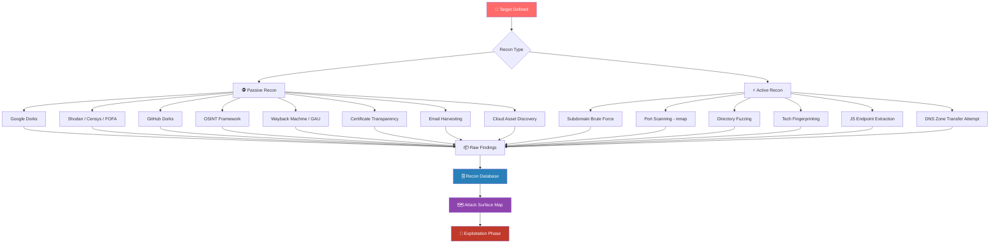

# Reconnaissance
> **The art of gathering information about a target before attacking — legally and stealthily, the smarter you recon, the less you hack blindly.**

---

## 🧠 What Is It?

Reconnaissance (recon) is **Phase 1** of every penetration test and bug bounty engagement. It is the systematic process of collecting as much information as possible about a target — its infrastructure, technologies, employees, exposed assets, and attack surface — **before** touching a single endpoint with a scanner or exploit.

Think of it like a heist movie: the crew doesn't walk into the bank on day one. They spend weeks watching shift changes, mapping the building layout, identifying guard blind spots, and cloning key fobs. Recon is that preparation phase.

**Two major categories:**

| Category | Definition |
|---|---|
| **Passive Recon** | Gathering data without directly interacting with the target's systems. Uses third-party sources, public records, cached data. |
| **Active Recon** | Directly interacting with target systems: port scans, DNS queries, HTTP requests, service probing. |

---

## 🏗️ How It Works

Recon flows from **broad to narrow**:

1. **Scope definition** — What's in scope? Domains, IP ranges, cloud accounts?
2. **Passive collection** — OSINT, dorks, archive crawling, certificate transparency
3. **Asset discovery** — Subdomains, IPs, cloud buckets, GitHub repos
4. **Technology fingerprinting** — What stack is running? What versions?
5. **Active probing** — Port scanning, service detection, directory brute-force
6. **Data aggregation** — Feed everything into a structured database
7. **Attack surface mapping** — Identify juicy targets for exploitation phases

---

## 📊 Diagram



---

## ⚙️ Technical Details

### Passive vs Active Recon — Deep Comparison

| Attribute | Passive Recon | Active Recon |
|---|---|---|
| **Target interaction** | None (uses third parties) | Direct packets to target |
| **Detectability** | Nearly undetectable | Logged in firewalls, IDS, WAF |
| **Legal risk** | Very low (public data) | Higher — may trigger alerts |
| **Data richness** | Broad, sometimes stale | Fresh, precise, technical |
| **Speed** | Slower (manual research) | Faster (automated tools) |
| **Best for** | Bug bounties, stealth engagements | Pentest with written scope |
| **Tools** | Shodan, Google, GitHub, WHOIS | Nmap, ffuf, Gobuster, Nikto |
| **IDS trigger risk** | ❌ None | ✅ High |
| **Auth required** | ❌ No | Sometimes ✅ |
| **Data freshness** | May be months old | Real-time |

### Legal Considerations

> ⚠️ **ALWAYS have written authorization before active recon.**

- **Passive recon**: Generally legal — you're querying public data. However, some jurisdictions have data protection laws (GDPR) that limit how personal data (emails, names) can be used.
- **Active recon**: Even port scanning can violate the Computer Fraud and Abuse Act (CFAA) in the US if performed without authorization. In the UK, the Computer Misuse Act applies.
- **Bug bounties**: Read the program scope carefully. Many programs have restrictions: no automated scanning, no DoS, no out-of-scope domains.
- **Golden rule**: When in doubt, stay passive. If active is needed, get it in writing.

---

## 💥 Exploitation Step-by-Step

> This section covers the *recon methodology* as an exploitable process — meaning how to extract maximum signal from each phase before moving to actual exploitation.

### Step 1 — Define Your Scope

```bash
# Document your target
TARGET="target.com"
ORG="Target Corp"
SCOPE_FILE="scope.txt"

echo "$TARGET" > $SCOPE_FILE
echo "*.${TARGET}" >> $SCOPE_FILE
echo "api.${TARGET}" >> $SCOPE_FILE
```

### Step 2 — Passive Recon First (Always)

Before touching the target, exhaust all passive sources. This reduces risk and sometimes reveals everything you need.

---

# OSINT for Web Targets

> **Open Source Intelligence (OSINT) is intelligence collected from publicly available sources — the internet, databases, social media, public records.**

## 🧠 What Is It?

OSINT is the backbone of passive recon. For web targets, OSINT means finding:
- Infrastructure details (IPs, ASNs, hosting providers)
- Technology stack (what software runs the site)
- Employees and credentials (leaked data, LinkedIn)
- Historical data (old endpoints, deprecated APIs)
- Code leaks (GitHub, GitLab, Bitbucket)
- Cloud assets (S3 buckets, Azure blobs, GCP storage)

## 🏗️ How It Works

The **OSINT Framework** (osintframework.com) organizes hundreds of tools and techniques by category. For web targets, the most valuable branches are:

```
OSINT Framework
├── Domain / IP Research
│   ├── WHOIS (whois.domaintools.com)
│   ├── Reverse WHOIS
│   ├── DNS History (viewdns.info)
│   ├── ASN Lookup (bgp.he.net)
│   └── Certificate Transparency (crt.sh)
├── Search Engines
│   ├── Google Dorks
│   ├── Bing Dorks  
│   ├── DuckDuckGo
│   └── Yandex
├── Social Media
│   ├── LinkedIn (employee enumeration)
│   ├── Twitter/X (mentions, leaked data)
│   └── Pastebin / GitHub Gist
├── Data Breaches
│   ├── HaveIBeenPwned API
│   ├── IntelX
│   └── Dehashed
└── Code Repositories
    ├── GitHub Dorks
    ├── GitLab Search
    └── Bitbucket
```

## ⚙️ Technical Details

### WHOIS & DNS Fundamentals

```bash
# WHOIS lookup — registrar, registration dates, nameservers
whois target.com

# DNS enumeration — all record types
dig target.com ANY +noall +answer
dig target.com NS
dig target.com MX
dig target.com TXT  # SPF, DKIM, DMARC, sometimes juicy metadata
dig target.com AAAA

# Reverse DNS
dig -x 93.184.216.34

# Zone transfer attempt (almost always blocked, but try)
dig axfr @ns1.target.com target.com

# Historical DNS — use online tools
# https://viewdns.info/iphistory/
# https://securitytrails.com/domain/target.com/history/a

# ASN lookup
whois -h whois.radb.net -- '-i origin AS12345'
curl https://api.bgpview.io/asn/12345/prefixes | jq '.data.ipv4_prefixes[].prefix'
```

### Certificate Transparency Logs

CT logs are public — every SSL cert ever issued is there. This is gold for subdomain discovery.

```bash
# crt.sh query for all certs issued to target.com
curl -s "https://crt.sh/?q=%.target.com&output=json" | jq -r '.[].name_value' | sort -u

# More aggressive — include expired certs
curl -s "https://crt.sh/?q=%.target.com&output=json&expired=true" | \
    jq -r '.[].name_value' | \
    sed 's/\*\.//g' | \
    sort -u | \
    grep -v "^$"

# Facebook CT API (faster, more complete)
curl -s "https://transparencyreport.google.com/transparencyreport/api/v3/httpsreport/ct/certsearch?include_subdomains=true&domain=target.com" 2>/dev/null
```

---

# Google Dorks Masterclass

> **Google Dorking uses advanced search operators to find sensitive information indexed by Google that targets never intended to expose publicly.**

## 🧠 What Is It?

Google indexes billions of pages including configuration files, error messages, admin panels, login pages, and accidentally exposed databases. Google dorks are crafted search queries using special operators to find this information with surgical precision.

This technique is also called **Google Hacking**, popularized by Johnny Long's book "Google Hacking for Penetration Testers" and the **Google Hacking Database (GHDB)** at exploit-db.com/google-hacking-database.

## 🏗️ How It Works

Google operators are combined to narrow searches to specific file types, URL patterns, page titles, and body text on a target domain. No direct interaction with the target occurs — you're querying Google's index.

## ⚙️ Technical Details — 30+ Real Dorks

### Core Operators Reference

| Operator | What It Does | Example |
|---|---|---|
| `site:` | Restrict to domain | `site:target.com` |
| `filetype:` / `ext:` | Filter by file extension | `filetype:pdf` |
| `inurl:` | Match in URL | `inurl:admin` |
| `intitle:` | Match in page title | `intitle:"login"` |
| `intext:` | Match in page body | `intext:"password"` |
| `cache:` | Google's cached version | `cache:target.com` |
| `before:` / `after:` | Date filtering | `before:2023-01-01` |
| `-` | Exclude term | `-inurl:www` |
| `"..."` | Exact phrase match | `"index of /"` |
| `OR` | Either term | `filetype:log OR filetype:txt` |

---

### 📁 File Exposure Dorks

```
# PDF documents — presentations, reports, whitepapers
site:target.com filetype:pdf

# Excel spreadsheets — often contain emails, credentials, internal data
site:target.com filetype:xls
site:target.com filetype:xlsx
"@target.com" filetype:xls

# Word documents
site:target.com filetype:doc
site:target.com filetype:docx

# Log files — error logs, access logs, debug logs
site:target.com ext:log
site:target.com filetype:log "error"

# Backup files — often contain full app source or database dumps
site:target.com ext:bak
site:target.com ext:old
site:target.com ext:backup
site:target.com ext:swp

# Environment files — API keys, database passwords
site:target.com ext:env
site:target.com filename:.env

# SQL files — database dumps, schema files
site:target.com ext:sql
site:target.com filetype:sql "INSERT INTO"

# Configuration files
site:target.com ext:conf
site:target.com ext:config
site:target.com ext:yml -inurl:node_modules
site:target.com filetype:xml "password"

# PHP source with errors exposed
site:target.com ext:php "Fatal error"
site:target.com ext:php "Warning: include"
```

### 🔐 Credential & Sensitive Data Dorks

```
# Password files
site:target.com "password" filetype:txt
site:target.com intext:"password" ext:log
site:target.com "passwd" filetype:txt

# Database connection strings  
site:target.com intext:"DB_PASSWORD"
site:target.com intext:"mysql://.*:.*@"
site:target.com intext:"mongodb+srv://"

# API keys in pages
site:target.com intext:"api_key"
site:target.com intext:"SECRET_KEY"
site:target.com intext:"Authorization: Bearer"

# AWS credentials
site:target.com intext:"AKIA" filetype:txt
site:target.com intext:"aws_secret_access_key"
```

### 🚪 Admin & Login Panel Dorks

```
# Admin panels
site:target.com inurl:admin
site:target.com inurl:administrator
site:target.com inurl:/wp-admin
site:target.com inurl:dashboard
site:target.com inurl:manage
site:target.com inurl:controlpanel
site:target.com intitle:"admin panel"

# Login pages
site:target.com inurl:login
site:target.com inurl:signin
site:target.com intitle:"Login"
site:target.com inurl:/auth/login

# CMS-specific
inurl:"wp-content" site:target.com
site:target.com inurl:"wp-login.php"
site:target.com inurl:"/administrator/index.php"  # Joomla
site:target.com inurl:"/user/login"              # Drupal
```

### 🕳️ Vulnerability-Hinting Dorks

```
# SQL error messages — potential SQLi
site:target.com intext:"sql syntax"
site:target.com intext:"mysql_fetch_array"
site:target.com intext:"ORA-01756"
site:target.com intext:"Microsoft OLE DB Provider"
site:target.com intext:"Unclosed quotation mark"

# URL parameters — potential injection points
site:target.com inurl:?id=
site:target.com inurl:?page=
site:target.com inurl:?file=
site:target.com inurl:?path=
site:target.com inurl:?redirect=
site:target.com inurl:?url=
site:target.com inurl:?include=

# Directory listings
intitle:"index of" site:target.com
intitle:"index of /" site:target.com
intitle:"Directory Listing" site:target.com

# phpinfo exposure
site:target.com intitle:"phpinfo()"
site:target.com inurl:phpinfo.php

# Git repository exposed
site:target.com inurl:"/.git/"
site:target.com intitle:"index of /.git"
```

### 🕰️ Historical & Cache Dorks

```
# Google's cached version of a page (useful if page was removed)
cache:target.com
cache:target.com/admin

# Pages indexed before a certain date (find old admin panels, etc.)
before:2023-01-01 site:target.com
before:2022-01-01 site:target.com inurl:admin

# Pages indexed after a date (recent deployments)
after:2024-01-01 site:target.com inurl:api
```

### 🔧 Technology-Specific Dorks

```
# WordPress
site:target.com inurl:wp-content/uploads
site:target.com inurl:wp-json/wp/v2/users

# Jenkins (CI/CD exposure)
site:target.com intitle:"Dashboard [Jenkins]"
site:target.com inurl:/jenkins/

# Kibana / Elasticsearch
site:target.com intitle:"Kibana"
site:target.com inurl:":9200/_cat"

# Grafana
site:target.com intitle:"Grafana"

# Exposed .git
site:target.com inurl:"/.git/config"

# Swagger/API documentation
site:target.com inurl:/swagger-ui.html
site:target.com inurl:/api-docs
site:target.com intitle:"Swagger UI"
```

### 📚 Google Hacking Database (GHDB)

The **GHDB** at `https://www.exploit-db.com/google-hacking-database` catalogs thousands of dorks categorized by:
- **Footholds** — Login pages, admin panels
- **Files containing passwords** — Config files, log files
- **Sensitive directories** — Exposed directories
- **Web server detection** — Banner grabbing via Google
- **Vulnerable files** — Known-bad file paths
- **Error messages** — Stack traces, SQL errors
- **Advisories and vulnerabilities** — Pages confirming vulnerable versions

```bash
# Automate Google dorking with pagodo
git clone https://github.com/opsdisk/pagodo.git
cd pagodo
pip3 install -r requirements.txt

# Download GHDB dorks
python3 ghdb_scraper.py -j -s

# Run all GHDB dorks against a domain
python3 pagodo.py -d target.com -g dorks/google_dorks_2024.txt -l 50 -s -e 35.0 -j 1.1
```

---

# Shodan Queries

> **Shodan is a search engine for internet-connected devices — it continuously scans the internet and indexes banners, certificates, and response data from every reachable port.**

## 🧠 What Is It?

Shodan crawls the internet like Google crawls websites, but instead of indexing web pages, it indexes **service banners** — the data servers send back when you connect. This lets you find exposed services, vulnerable software versions, misconfigured devices, and organization infrastructure without ever touching the target.

## 🏗️ How It Works

Shodan's scanners probe every routable IPv4 address on common ports, collect the response, and index it with metadata including:
- IP address, port, protocol
- HTTP response headers and body
- SSL/TLS certificate details
- Organization (via ASN/WHOIS data)
- Geographic location
- Open vulnerabilities (via CVE matching)

## ⚙️ Technical Details — 20+ Real Shodan Queries

### Organization & Domain Queries

```
# Find all assets for an organization
org:"Target Corp"

# Find assets by domain from SSL certificate
ssl.cert.subject.cn:"target.com"
ssl:"target.com"

# Find subdomains in SSL certs
ssl.cert.subject.cn:"*.target.com"

# Find assets by hostname
hostname:"target.com"

# Combine: org assets on specific port
org:"Target Corp" port:443

# Find all IPs with specific title
http.title:"Dashboard" org:"Target Corp"
```

### Technology & Version Queries

```
# Find vulnerable Apache 2.4.49 (CVE-2021-41773 — Path Traversal)
product:"Apache httpd" version:"2.4.49"

# PHP version exposure
http.html:"X-Powered-By: PHP/5"
http.html:"X-Powered-By: PHP/7.0"
http.html:"X-Powered-By: PHP/7.1"

# Old IIS versions
product:"Microsoft IIS" version:"6.0"
product:"Microsoft IIS" version:"7.5"

# Nginx versions
product:"nginx" version:"1.14"

# Tomcat default page
http.title:"Apache Tomcat" port:8080
```

### Exposed Services & Panels

```
# Jenkins CI — critical RCE exposure risk
port:8080 http.title:"Dashboard [Jenkins]"
port:8080 http.title:"Jenkins"

# Kibana — exposed Elasticsearch data
http.title:"Kibana" port:5601

# Grafana dashboards
http.title:"Grafana" port:3000

# Exposed phpMyAdmin
http.title:"phpMyAdmin" port:80

# Exposed MongoDB (no auth)
port:27017 product:"MongoDB"

# Exposed Redis (no auth)
port:6379 product:"Redis" -auth

# Exposed Elasticsearch
port:9200 product:"Elastic"

# Exposed Docker API
port:2375 product:"Docker"

# Exposed Kubernetes API
port:8080 http.title:"Kubernetes Dashboard"
port:6443 product:"Kubernetes"
```

### Vulnerability-Specific Queries

```
# Log4Shell vulnerable systems
vuln:CVE-2021-44228

# Spring4Shell
vuln:CVE-2022-22965

# ProxyShell (Exchange)
vuln:CVE-2021-34473

# Heartbleed
vuln:CVE-2014-0160

# EternalBlue (SMB)
vuln:CVE-2017-0144

# Find by favicon hash (identify hidden infrastructure)
# Get hash: python3 -c "import mmh3,base64,requests; r=requests.get('https://target.com/favicon.ico'); print(mmh3.hash(base64.b64encode(r.content)))"
http.favicon.hash:-297069466

# Find specific service by banner content
http.html:"Powered by vBulletin"
http.html:"Powered by Invision"
```

### SSL/TLS Queries

```
# Find expired SSL certs
ssl.cert.expired:true org:"Target Corp"

# Self-signed certificates (potential internal/dev exposure)
ssl.cert.issuer.cn:"Target Corp" ssl.cert.subject.cn:"Target Corp"

# Weak cipher suites
ssl.cipher.version:"TLSv1.0"
ssl.cipher.version:"SSLv3"

# Find by certificate serial
ssl.cert.serial:"abc123..."

# Find all wildcard certs
ssl.cert.subject.cn:"*"  org:"Target Corp"
```

### Shodan CLI Usage

```bash
# Install Shodan CLI
pip3 install shodan

# Initialize with API key
shodan init YOUR_API_KEY

# Search and save to JSON
shodan search --fields ip_str,port,org,hostnames "ssl.cert.subject.cn:target.com" > shodan-results.txt

# Host lookup
shodan host 93.184.216.34

# Get full details for an IP
shodan host 93.184.216.34 --format json | jq '.'

# Count results for a query
shodan count "org:\"Target Corp\""

# Download results (requires paid plan)
shodan download target-certs "ssl.cert.subject.cn:\"*.target.com\""
shodan parse --fields ip_str,port target-certs.json.gz

# Alert on new assets (monitoring)
shodan alert create target-monitor "org:\"Target Corp\""
shodan alert list
```

---

# Censys Queries

> **Censys is a security-focused internet scanner that provides structured, searchable data about every internet-connected host, with rich certificate and protocol data.**

## 🧠 What Is It?

Censys scans the entire IPv4 internet and indexes results in a structured database queryable via a powerful API and web interface. Unlike Shodan, Censys has a stronger focus on certificates and uses a more structured query language (SQL-like).

## ⚙️ Technical Details

### Censys Search Syntax (v2 API)

```
# Find hosts by organization (requires verified account)
services.tls.certificates.leaf_data.subject.organization="Target Corp"

# Find by domain in certificate
services.tls.certificates.leaf_data.subject.common_name="target.com"

# Find subdomains via wildcard certs
services.tls.certificates.leaf_data.subject.common_name="*.target.com"

# Find all certs for a domain
services.tls.certificates.leaf_data.names="target.com"

# Find by HTTP title
services.http.response.html_title="Dashboard"

# Find by specific port and title
services.port=8080 and services.http.response.html_title="Jenkins"

# Find hosts running specific software
services.software.product="Apache httpd" and services.software.version="2.4.49"

# Find by ASN
autonomous_system.asn=12345

# Find by country
location.country_code="US" and services.http.response.html_title="admin"

# Find open MongoDB
services.port=27017 and services.mongodb.is_auth_enabled=false

# Find Elasticsearch with no auth
services.port=9200 and not services.elasticsearch.is_auth_enabled=true
```

### Censys CLI

```bash
# Install Censys Python library
pip3 install censys

# Configure with API credentials
censys config

# Search for hosts
censys search "services.tls.certificates.leaf_data.names:target.com" --index-type HOSTS

# View a specific host
censys view 93.184.216.34 --index-type HOSTS

# Certificate search
censys search "parsed.names:target.com" --index-type CERTS

# Export results to JSON
censys search "services.tls.certificates.leaf_data.names:target.com" \
    --index-type HOSTS \
    --output-format json > censys-results.json
```

---

# FOFA Queries

> **FOFA (Fingerprint of All — developed by Baiduanquan) is a Chinese cyberspace search engine similar to Shodan with excellent coverage of Asian infrastructure and unique fingerprinting capabilities.**

## 🧠 What Is It?

FOFA indexes internet assets with a focus on web fingerprinting. It supports a rich set of operators and has strong coverage of Asian IPs. Many bug bounty hunters use FOFA in combination with Shodan/Censys for complete coverage.

## ⚙️ Technical Details

### FOFA Query Syntax

```
# Find by domain
domain="target.com"

# Find subdomains
domain="target.com" && type="subdomain"

# Find by host
host="admin.target.com"

# Find by certificate
cert="target.com"
cert.subject="target.com"
cert.issuer="Let's Encrypt"

# Find by page title
title="Dashboard" && domain="target.com"
title="Jenkins" && title="Dashboard"

# Find by page content
body="Powered by vBulletin"
body="X-Powered-By: PHP/5"
body="wp-content/themes"

# Find by server header
header="Apache/2.4.49"
header="X-Powered-By: PHP/7"

# Find by IP range
ip="93.184.0.0/16"

# Find by ASN
asn="AS12345"

# Find by country
country="US" && title="admin"

# Find by port
port="8080" && title="Jenkins"

# Combine conditions
domain="target.com" && port="443" && title!="404"

# Find specific technologies
app="WordPress"
app="Joomla"
app="Drupal"
app="Spring Boot"

# Find exposed panels
title="phpMyAdmin" && country="US"
title="Kibana" && port="5601"
```

### FOFA API Usage

```bash
# Install fofa-go CLI
go install github.com/wgpsec/fofa-go@latest

# Or use the API directly
FOFA_EMAIL="your@email.com"
FOFA_KEY="your-api-key"

# Base64-encode query
QUERY=$(echo -n 'domain="target.com"' | base64)

# Query the API
curl "https://fofa.info/api/v1/search/all?email=${FOFA_EMAIL}&key=${FOFA_KEY}&qbase64=${QUERY}&fields=ip,port,host,title,domain&size=100"

# Using fofa-py
pip3 install fofa
python3 -c "
import fofa
client = fofa.Client('your@email.com', 'your-api-key')
results = client.get_all('domain=\"target.com\"', fields='ip,port,host,title')
for result in results:
    print(result)
"
```

---

# Subdomain Enumeration

> **Subdomain enumeration discovers all hostnames under a target domain — each subdomain is a potential attack surface with its own services, technologies, and vulnerabilities.**

## 🧠 What Is It?

Modern organizations have dozens to hundreds of subdomains. Each one may be:
- Running a different application with its own vulnerabilities
- An older, unmaintained service (forgotten dev/staging environments)
- Misconfigured (subdomain takeover opportunity)
- Exposing internal tools accidentally

## 🏗️ How It Works

Subdomain discovery uses multiple techniques:
1. **Passive**: Certificate transparency, DNS datasets, search engines
2. **Active brute-force**: Trying common names against DNS resolvers
3. **Permutation**: Generating variations of found subdomains
4. **Scraping**: Extracting from JavaScript, HTML, APIs

## ⚙️ Technical Details

### Complete Subdomain Enumeration Workflow

```bash
TARGET="target.com"
WORDLIST="/usr/share/seclists/Discovery/DNS/subdomains-top1million-110000.txt"

# ─────────────────────────────────────────────────
# STEP 1: Passive subdomain discovery
# ─────────────────────────────────────────────────

# subfinder — multi-source passive subdomain discovery
# Sources: crt.sh, VirusTotal, Shodan, SecurityTrails, etc.
subfinder -d $TARGET -all -recursive -o subfinder-out.txt -v

# Amass passive mode — extremely comprehensive
amass enum -passive -d $TARGET -o amass-passive.txt

# assetfinder — quick passive discovery
assetfinder --subs-only $TARGET | tee assetfinder-out.txt

# theHarvester — search engines + OSINT sources
theHarvester -d $TARGET -b all -l 500

# crt.sh certificate transparency
curl -s "https://crt.sh/?q=%.${TARGET}&output=json" | \
    jq -r '.[].name_value' | \
    sed 's/\*\.//g' | \
    sort -u | \
    grep -v "^$" > crt-sh-out.txt

# DNS Dumpster (web scraping)
# Visit: https://dnsdumpster.com

# Merge all passive results
cat subfinder-out.txt amass-passive.txt assetfinder-out.txt crt-sh-out.txt | \
    sort -u > all-passive-subdomains.txt

echo "[+] Found $(wc -l < all-passive-subdomains.txt) unique subdomains (passive)"

# ─────────────────────────────────────────────────
# STEP 2: Active brute-force enumeration
# ─────────────────────────────────────────────────

# Amass active with brute force
amass enum -active -brute -d $TARGET \
    -w $WORDLIST \
    -o amass-active.txt

# puredns — fast DNS brute-force with wildcard filtering
# First download a public resolver list
wget https://raw.githubusercontent.com/trickest/resolvers/main/resolvers.txt -O resolvers.txt

puredns bruteforce $WORDLIST $TARGET \
    -r resolvers.txt \
    --wildcard-tests 30 \
    -o puredns-out.txt

# shuffledns — massdns wrapper for large wordlists
shuffledns -d $TARGET -w $WORDLIST \
    -r resolvers.txt \
    -o shuffledns-out.txt \
    -massdns /usr/bin/massdns

# dnsx — DNS resolution and validation
cat all-passive-subdomains.txt | \
    dnsx -a -aaaa -cname -mx -txt -resp -o dnsx-resolved.txt

echo "[+] Resolved $(wc -l < dnsx-resolved.txt) subdomains"

# ─────────────────────────────────────────────────
# STEP 3: Permutation & Alteration
# ─────────────────────────────────────────────────

# alterx — AI-powered subdomain permutation
alterx -l all-passive-subdomains.txt \
    -enrich \
    -o alterx-permutations.txt

# Resolve permutations
puredns resolve alterx-permutations.txt \
    -r resolvers.txt \
    -o alterx-resolved.txt

# gotator — another permutation tool
gotator -sub all-passive-subdomains.txt \
    -perm /usr/share/seclists/Discovery/DNS/subdomains-top1million-5000.txt \
    -depth 1 -numbers 3 -nd | \
    puredns resolve -r resolvers.txt -o gotator-resolved.txt

# ─────────────────────────────────────────────────
# STEP 4: HTTP probing — find live web services
# ─────────────────────────────────────────────────

# Merge all found subdomains
cat all-passive-subdomains.txt puredns-out.txt \
    alterx-resolved.txt gotator-resolved.txt | \
    sort -u > all-subdomains-total.txt

# httpx — probe for live HTTP/HTTPS services
cat all-subdomains-total.txt | \
    httpx -ports 80,443,8080,8443,8888,9000 \
    -title \
    -status-code \
    -tech-detect \
    -web-server \
    -ip \
    -cdn \
    -follow-redirects \
    -threads 50 \
    -json \
    -o httpx-live.json

# Extract just the live URLs
cat httpx-live.json | jq -r '.url' > live-subdomains.txt

echo "[+] Found $(wc -l < live-subdomains.txt) live web services"

# ─────────────────────────────────────────────────
# STEP 5: Screenshot all live hosts
# ─────────────────────────────────────────────────

# gowitness — screenshot all live URLs
gowitness file -f live-subdomains.txt \
    --screenshot-path ./screenshots \
    --log-level warn

# aquatone — screenshot + report
cat live-subdomains.txt | \
    aquatone -out ./aquatone-report \
    -screenshot-timeout 30000 \
    -threads 10
```

### Subdomain Takeover Detection

```bash
# subjack — detect dangling CNAME records
subjack -w all-subdomains-total.txt \
    -t 100 \
    -timeout 30 \
    -o subjack-results.txt \
    -v

# nuclei subdomain takeover templates
nuclei -l all-subdomains-total.txt \
    -t ~/nuclei-templates/takeovers/ \
    -o nuclei-takeovers.txt

# subzy — fast subdomain takeover checker
subzy run --targets all-subdomains-total.txt \
    --concurrency 100 \
    --hide_fails

# Manual check — look for CNAME pointing to dead services
# Common vulnerable fingerprints:
# AWS: NoSuchBucket, no-such-bucket
# GitHub: There isn't a GitHub Pages site here
# Heroku: No such app
# Shopify: Sorry, this shop is currently unavailable
# Fastly: Fastly error: unknown domain
```

---

# GitHub Dorks

> **GitHub contains billions of lines of code — including secrets, credentials, API keys, internal configs, and sensitive infrastructure information developers accidentally committed.**

## 🧠 What Is It?

When developers commit code, they sometimes include secrets: API keys, database passwords, private certificates, internal hostnames, and cloud credentials. Even after deletion, Git history preserves these. GitHub's search allows finding these with targeted queries.

## 🏗️ How It Works

GitHub indexes repository content, file names, commit messages, and user/org information. Search operators allow targeting specific organizations and file types.

## ⚙️ Technical Details — 30+ Real GitHub Dorks

### Core Credential Leaks

```
# Generic passwords in org repos
org:targetcorp password
org:targetcorp "password ="
org:targetcorp "pwd ="
org:targetcorp "passwd"

# API keys and tokens
org:targetcorp "api_key"
org:targetcorp "api_secret"
org:targetcorp "apikey"
org:targetcorp "access_token"
org:targetcorp "auth_token"
org:targetcorp "client_secret"
org:targetcorp "consumer_key"
org:targetcorp "consumer_secret"

# AWS credentials
org:targetcorp "AWS_SECRET_ACCESS_KEY"
org:targetcorp "AWS_ACCESS_KEY_ID"
org:targetcorp "AKIA"
org:targetcorp aws_secret
org:targetcorp "s3.amazonaws.com" AND "key"

# Database credentials
org:targetcorp DB_PASSWORD
org:targetcorp "database_password"
org:targetcorp "DB_PASS"
org:targetcorp "MYSQL_PASSWORD"
org:targetcorp "POSTGRES_PASSWORD"
org:targetcorp "mongodb+srv://"

# Private keys
org:targetcorp "BEGIN RSA PRIVATE KEY"
org:targetcorp "BEGIN OPENSSH PRIVATE KEY"
org:targetcorp "BEGIN DSA PRIVATE KEY"
org:targetcorp "BEGIN EC PRIVATE KEY"
org:targetcorp "BEGIN PGP PRIVATE KEY"

# Email/SMTP credentials
org:targetcorp "smtp_password"
org:targetcorp "MAIL_PASSWORD"
org:targetcorp "smtp://.*:.*@"
org:targetcorp "SENDGRID_API_KEY"
org:targetcorp "MAILGUN_API_KEY"

# Service-specific secrets
org:targetcorp "STRIPE_SECRET"
org:targetcorp "TWILIO_AUTH_TOKEN"
org:targetcorp "SLACK_TOKEN"
org:targetcorp "GITHUB_TOKEN"
org:targetcorp "GITLAB_TOKEN"
org:targetcorp "HEROKU_API_KEY"
org:targetcorp "DOCKER_PASSWORD"
org:targetcorp "NPM_TOKEN"
```

### Configuration & Environment Files

```
# .env files — the holy grail
org:targetcorp filename:.env
org:targetcorp filename:.env.local
org:targetcorp filename:.env.production
org:targetcorp filename:.env.staging
org:targetcorp filename:.env.development
org:targetcorp filename:.env.backup

# Config files
org:targetcorp filename:config.yml password
org:targetcorp filename:config.json "password"
org:targetcorp filename:settings.py "SECRET_KEY"
org:targetcorp filename:database.yml password
org:targetcorp filename:wp-config.php
org:targetcorp filename:web.config "password"
org:targetcorp filename:application.yml password

# Docker and K8s
org:targetcorp filename:docker-compose.yml password
org:targetcorp filename:.dockerenv
org:targetcorp filename:kubeconfig

# CI/CD pipeline configs with secrets
org:targetcorp filename:.travis.yml env.global
org:targetcorp filename:.circleci/config.yml password
org:targetcorp filename:Jenkinsfile password
org:targetcorp filename:.github/workflows "secret"
```

### Infrastructure & Internal Info

```
# Internal hostnames and endpoints
org:targetcorp "internal.target.com"
org:targetcorp "staging."
org:targetcorp "dev."
org:targetcorp "prod."

# Private IP ranges in configs
org:targetcorp "192.168."
org:targetcorp "10.0."
org:targetcorp "172.16."

# JWT secrets
org:targetcorp "JWT_SECRET"
org:targetcorp "jwt_secret_key"

# SSH config
org:targetcorp filename:id_rsa
org:targetcorp filename:id_ed25519
org:targetcorp filename:.ssh/config
```

## 🛠️ Automated GitHub Secret Scanning Tools

```bash
# ─────────────────────────────────────────────────
# TruffleHog v3 — entropy-based + regex secret detection
# ─────────────────────────────────────────────────

# Install
pip3 install trufflehog3
# OR
curl -sSfL https://raw.githubusercontent.com/trufflesecurity/trufflehog/main/scripts/install.sh | sh

# Scan an entire GitHub organization
trufflehog github --org=targetcorp \
    --token=ghp_YOUR_GITHUB_TOKEN \
    --json > trufflehog-results.json

# Scan a specific repo
trufflehog github --repo=https://github.com/targetcorp/webapp \
    --only-verified \
    --json

# Scan including Git history
trufflehog git https://github.com/targetcorp/webapp \
    --since-commit main~100 \
    --json

# Scan local repo
trufflehog git file://./local-repo --json

# ─────────────────────────────────────────────────
# Gitleaks — fast secret scanning
# ─────────────────────────────────────────────────

# Install
brew install gitleaks
# OR
go install github.com/zricethezav/gitleaks/v8@latest

# Scan a repo
gitleaks detect --source . --report-format json --report-path gitleaks-report.json

# Scan specific repo from GitHub
git clone https://github.com/targetcorp/webapp && \
    cd webapp && \
    gitleaks detect --report-format json --report-path ../webapp-leaks.json

# Scan entire Git history
gitleaks detect --log-opts="--all" --report-format json --report-path all-history.json

# ─────────────────────────────────────────────────
# gitrob — reconnaissance for GitHub organizations
# ─────────────────────────────────────────────────

# Install
go install github.com/michenriksen/gitrob@latest

# Scan org
gitrob analyze targetcorp --github-access-token ghp_YOUR_TOKEN

# ─────────────────────────────────────────────────
# gh-dork — GitHub dorking via CLI
# ─────────────────────────────────────────────────

pip3 install gh-dork

# Run specific dork
gh-dork -q 'org:targetcorp "api_key"' -t ghp_YOUR_TOKEN

# Run from dorks file
gh-dork -f my-dorks.txt -t ghp_YOUR_TOKEN

# ─────────────────────────────────────────────────
# gitallsecrets — all-in-one repo scanning
# ─────────────────────────────────────────────────

docker run --rm \
    -e GITTOKEN=ghp_YOUR_TOKEN \
    -e ORG=targetcorp \
    abhartiya/tools_gitallsecrets:v3

# ─────────────────────────────────────────────────
# SecretScanner — Deepfence deep secret scanning
# ─────────────────────────────────────────────────

docker run -it --rm \
    -v /path/to/cloned/repo:/tmp/SecretScanner \
    deepfenceio/secretscanner \
    --local /tmp/SecretScanner --output json
```

---

# Wayback Machine & URL Discovery

> **Historical URL databases contain endpoints, parameters, and paths that have been removed from current navigation but may still be accessible — often revealing forgotten admin panels, deprecated APIs, and old vulnerable endpoints.**

## 🧠 What Is It?

The Wayback Machine (archive.org) and other URL aggregators (Common Crawl, OTX, URLScan) have crawled and stored billions of URLs. For a target, this means you can discover:
- Old endpoints that still respond (forgotten, un-maintained)
- Parameters that expose injection points
- Removed sensitive files (sometimes still accessible)
- API versioning history
- Third-party integrations

## ⚙️ Technical Details

```bash
TARGET="target.com"

# ─────────────────────────────────────────────────
# GAU (GetAllUrls) — aggregates from multiple sources
# Sources: Wayback Machine, Common Crawl, OTX, URLScan
# ─────────────────────────────────────────────────

# Install
go install github.com/lc/gau/v2/cmd/gau@latest

# Basic usage
gau $TARGET | tee gau-urls.txt

# Specify providers
gau --providers wayback,commoncrawl,otx,urlscan $TARGET

# Include subdomains
gau --subs $TARGET | tee gau-subs.txt

# Filter by file extension  
gau $TARGET --ft php,asp,aspx,jsp,json,xml,config,bak,old,sql,log,env

# Blacklist certain extensions
gau $TARGET --blacklist png,gif,jpg,jpeg,css,svg,ico

# ─────────────────────────────────────────────────
# Waybackurls — focused Wayback Machine crawler
# ─────────────────────────────────────────────────

go install github.com/tomnomnom/waybackurls@latest
waybackurls $TARGET | tee wayback-urls.txt

# Include subdomains
waybackurls -dates $TARGET | tee wayback-with-dates.txt

# ─────────────────────────────────────────────────
# Katana — next-generation URL crawler
# ─────────────────────────────────────────────────

go install github.com/projectdiscovery/katana/cmd/katana@latest

# Passive mode (from APIs)
katana -u $TARGET -passive -o katana-passive.txt

# Active crawl with headless browser
katana -u https://$TARGET \
    -headless \
    -depth 3 \
    -js-crawl \
    -known-files all \
    -form-extraction \
    -jc \
    -o katana-active.txt

# ─────────────────────────────────────────────────
# URLScan.io API
# ─────────────────────────────────────────────────

curl "https://urlscan.io/api/v1/search/?q=domain:$TARGET&size=100" | \
    jq -r '.results[].page.url' | \
    sort -u > urlscan-urls.txt

# ─────────────────────────────────────────────────
# Combine and analyze all URLs
# ─────────────────────────────────────────────────

# Merge all sources
cat gau-urls.txt wayback-urls.txt katana-passive.txt urlscan-urls.txt | \
    sort -u > all-urls.txt

echo "[+] Total unique URLs: $(wc -l < all-urls.txt)"

# ─────────────────────────────────────────────────
# URL Analysis & Filtering
# ─────────────────────────────────────────────────

# Find URLs with parameters (potential injection points)
grep "?" all-urls.txt | sort -u > urls-with-params.txt
echo "[+] URLs with parameters: $(wc -l < urls-with-params.txt)"

# Filter by file extension — find interesting file types
cat all-urls.txt | grep -E "\.(php|asp|aspx|jsp|cfm)(\?|$)" > dynamic-pages.txt
cat all-urls.txt | grep -E "\.(json|xml|yaml|yml)(\?|$)" > api-files.txt
cat all-urls.txt | grep -E "\.(log|txt|csv|bak|old|backup|sql|db)(\?|$)" > sensitive-files.txt
cat all-urls.txt | grep -E "\.(js|jsx|ts|tsx)(\?|$)" > js-files.txt
cat all-urls.txt | grep -E "\.(conf|config|cfg|ini|env)(\?|$)" > config-files.txt

# Find admin/sensitive paths
cat all-urls.txt | grep -iE "(admin|dashboard|manage|control|panel|portal)" > admin-urls.txt
cat all-urls.txt | grep -iE "(api|graphql|rest|v1|v2|v3)" > api-urls.txt
cat all-urls.txt | grep -iE "(debug|test|dev|staging|uat|qa)" > dev-urls.txt
cat all-urls.txt | grep -iE "(login|signin|auth|oauth|sso|saml)" > auth-urls.txt
cat all-urls.txt | grep -iE "(upload|file|document|download|attachment)" > file-upload-urls.txt
cat all-urls.txt | grep -iE "(config|setup|install|install\.php|setup\.php)" > setup-urls.txt

# Extract unique parameter names
cat urls-with-params.txt | \
    grep -oP "[\?&][^=&]+" | \
    sed 's/^[?&]//' | \
    sort | uniq -c | sort -rn | \
    head -50 > common-params.txt

# Find potential redirect parameters (open redirect hunting)
cat urls-with-params.txt | \
    grep -iE "[\?&](url|redirect|return|next|goto|redir|returnUrl|redirectUri|returnTo)=" > redirect-params.txt

# Find potential SSRF parameters
cat urls-with-params.txt | \
    grep -iE "[\?&](url|uri|path|host|server|endpoint|target|src|source|fetch|load|proxy)=" > ssrf-params.txt

# Check live URLs with httpx
cat sensitive-files.txt admin-urls.txt | httpx -mc 200,301,302,403 -o live-interesting.txt

# ─────────────────────────────────────────────────
# Fetch and analyze specific archived pages
# ─────────────────────────────────────────────────

# Get all snapshots of a specific URL
curl "http://archive.org/wayback/available?url=target.com/admin" | jq '.'

# Download an archived page
curl "https://web.archive.org/web/20220101000000*/target.com/admin.php"

# Get CDX API data (all snapshots with metadata)
curl "http://web.archive.org/cdx/search/cdx?url=*.target.com&output=json&fl=original,statuscode,timestamp&filter=statuscode:200&collapse=urlkey" | \
    python3 -m json.tool | grep original | grep -v "^$" | \
    sed 's/.*"original": "\(.*\)".*/\1/' > archived-200-urls.txt
```

---

# JavaScript Endpoint Extraction

> **JavaScript files often contain hardcoded API endpoints, internal hostnames, secret keys, and functionality not exposed in the UI — a goldmine for bug hunters.**

## 🧠 What Is It?

Modern web apps load most of their logic client-side via JavaScript. These JS files expose:
- API endpoints (often undocumented, unprotected)
- Authentication flows and token handling
- Internal service URLs
- Hardcoded credentials (development remnants)
- Feature flags revealing hidden functionality
- Business logic that can be reverse-engineered

## ⚙️ Technical Details

```bash
TARGET="target.com"
BASE_URL="https://${TARGET}"

# ─────────────────────────────────────────────────
# STEP 1: Collect all JavaScript file URLs
# ─────────────────────────────────────────────────

# From GAU historical data
cat gau-urls.txt | grep -E "\.js(\?|$)" | sort -u > js-files.txt

# From Katana active crawl
katana -u $BASE_URL -js-crawl -jc -o katana-js.txt
cat katana-js.txt | grep -E "\.js(\?|$)" >> js-files.txt

# From GoSpider
gospider -s $BASE_URL -o ./gospider-out -c 10 -d 2 --blacklist ".(gif|jpg|jpeg|png|css|svg)"
cat gospider-out/${TARGET}.txt | grep -oP "https?://[^\s\"]+" | grep "\.js$" >> js-files.txt

# Deduplicate
sort -u js-files.txt -o js-files.txt
echo "[+] Found $(wc -l < js-files.txt) unique JS files"

# ─────────────────────────────────────────────────
# STEP 2: LinkFinder — extract endpoints from JS
# ─────────────────────────────────────────────────

# Install
git clone https://github.com/GerbenJavado/LinkFinder.git
cd LinkFinder && pip3 install -r requirements.txt

# Analyze single JS file
python3 linkfinder.py -i https://target.com/static/app.js -o cli

# Analyze entire domain (crawl all found JS)
python3 linkfinder.py -i https://target.com -d -o results.html

# Process a list of JS files
while IFS= read -r url; do
    echo "[*] Analyzing: $url"
    python3 linkfinder.py -i "$url" -o cli 2>/dev/null
done < js-files.txt | sort -u > linkfinder-endpoints.txt

# ─────────────────────────────────────────────────
# STEP 3: SecretFinder — find secrets in JS files
# ─────────────────────────────────────────────────

git clone https://github.com/m4ll0k/SecretFinder.git
cd SecretFinder && pip3 install -r requirements.txt

# Scan single JS file for secrets
python3 SecretFinder.py -i https://target.com/static/app.js -o cli

# Scan multiple JS files
while IFS= read -r url; do
    python3 SecretFinder.py -i "$url" -o cli 2>/dev/null
done < js-files.txt > secretfinder-results.txt

# SecretFinder detects: Google API keys, Stripe keys, AWS keys,
# Mailgun, Twilio, GitHub tokens, JWT tokens, Azure AD tokens, etc.

# ─────────────────────────────────────────────────
# STEP 4: getJS — fast JS URL extraction
# ─────────────────────────────────────────────────

go install github.com/003random/getJS@latest

# Get all JS URLs from a host
getJS --url https://target.com --complete --output js-from-getjs.txt

# Process from list of URLs
getJS --input live-subdomains.txt --complete --output all-js-urls.txt

# ─────────────────────────────────────────────────
# STEP 5: JSParser & Custom Analysis
# ─────────────────────────────────────────────────

# Download and beautify JS for manual review
npm install -g js-beautify

wget https://target.com/static/bundle.js -O bundle.js
js-beautify bundle.js -o bundle-beautified.js

# grep for interesting patterns in JS source
grep -r "api_key\|apiKey\|api_secret\|secret_key\|access_token\|auth_token" bundle-beautified.js
grep -r "http://\|https://" bundle-beautified.js | grep -v "cdn\|jquery\|bootstrap"
grep -r "\.get(\|\.post(\|\.put(\|\.delete(" bundle-beautified.js  # API calls
grep -r "localStorage\|sessionStorage" bundle-beautified.js        # Token storage
grep -r "Authorization:\|Bearer \|Basic " bundle-beautified.js     # Auth headers
grep -r "graphql\|query\|mutation" bundle-beautified.js            # GraphQL endpoints

# ─────────────────────────────────────────────────
# STEP 6: nuclei for JS analysis
# ─────────────────────────────────────────────────

# Use nuclei templates to find secrets in JS
nuclei -l js-files.txt \
    -t ~/nuclei-templates/exposures/tokens/ \
    -t ~/nuclei-templates/exposures/apis/ \
    -o nuclei-js-secrets.txt

# ─────────────────────────────────────────────────
# STEP 7: Webpack/bundled app analysis
# ─────────────────────────────────────────────────

# webpackDevTool — extract source maps (if available)
# Source maps reveal original unminified source code!
curl https://target.com/static/app.js.map -o app.js.map

# Check if source map is referenced in the JS file
grep "sourceMappingURL" bundle.js

# Extract source from source map
npm install -g source-map-cli
source-map-cli extract app.js.map ./extracted-source/

# WebpackExpose — another source map extractor
wget https://raw.githubusercontent.com/nicowillis/webpackexpose/main/webpackexpose.py
python3 webpackexpose.py -u https://target.com/static/app.js -o ./extracted/
```

---

# Cloud Asset Discovery

> **Modern organizations store data in S3 buckets, Azure Blobs, and GCP Storage — misconfigured cloud storage is one of the most common causes of data breaches.**

## 🧠 What Is It?

Cloud storage services are publicly accessible by default unless explicitly secured. Misconfigured buckets allow:
- Listing all files (directory traversal equivalent)
- Reading sensitive files (source code, backups, customer data)
- Writing files (potential for backdoor or cache poisoning)

## ⚙️ Technical Details

### AWS S3 Bucket Discovery & Exploitation

```bash
TARGET="target"  # Company name / brand
DOMAIN="target.com"

# ─────────────────────────────────────────────────
# Naming convention brute force
# Common patterns: target, target-backup, target-prod, target-dev,
# target-staging, target-assets, target-static, target-media,
# target-logs, target-deploy, target-uploads, target-images
# ─────────────────────────────────────────────────

# s3scanner — fast S3 bucket scanner
pip3 install s3scanner

# Scan a list of bucket names
cat << EOF > bucket-wordlist.txt
${TARGET}
${TARGET}-backup
${TARGET}-prod
${TARGET}-dev
${TARGET}-staging
${TARGET}-assets
${TARGET}-static
${TARGET}-media
${TARGET}-logs
${TARGET}-uploads
${TARGET}-images
${TARGET}-files
${TARGET}-data
${TARGET}-public
${TARGET}-private
${TARGET}-website
${TARGET}-web
${TARGET}-app
${TARGET}-api
${TARGET}-cdn
${TARGET}-storage
${TARGET}backup
${TARGET}assets
${TARGET}static
${TARGET}dev
${TARGET}prod
www.${DOMAIN}
assets.${DOMAIN}
static.${DOMAIN}
media.${DOMAIN}
backup.${DOMAIN}
EOF

s3scanner scan --bucket-file bucket-wordlist.txt

# Manual bucket check
aws s3 ls s3://${TARGET}-backup --no-sign-request 2>/dev/null && \
    echo "[!] BUCKET OPEN: ${TARGET}-backup"

# Download contents of an open bucket
aws s3 sync s3://${TARGET}-backup ./loot/${TARGET}-backup --no-sign-request

# lazys3 — threaded S3 bucket brute force
git clone https://github.com/nahamsec/lazys3.git
cd lazys3
ruby lazys3.rb $TARGET

# bucket-stream — live stream of newly-created public buckets from CT logs
git clone https://github.com/eth0izzle/bucket-stream.git
cd bucket-stream
pip3 install -r requirements.txt
python3 bucket-stream.py --only-interesting

# Enumerate all objects in a bucket
aws s3 ls s3://BUCKET-NAME --no-sign-request --recursive | \
    sort -k1,2 | \
    grep -iE "\.(sql|bak|backup|zip|tar|gz|env|conf|config|log|csv|xls|xlsx|key|pem|crt)"

# Check bucket ACL/policy
aws s3api get-bucket-acl --bucket BUCKET-NAME --no-sign-request
aws s3api get-bucket-policy --bucket BUCKET-NAME --no-sign-request

# Test write access
echo "test" | aws s3 cp - s3://BUCKET-NAME/test-write.txt --no-sign-request
```

### Azure Blob Storage Discovery

```bash
# Azure blob naming patterns
# Format: https://ACCOUNT_NAME.blob.core.windows.net/CONTAINER_NAME/BLOB_NAME

ACCOUNT="${TARGET}"  # or target, targetcorp, targetprod, etc.

# Common container names
CONTAINERS=(
    "\$web" "public" "static" "assets" "media" "backup" "logs"
    "uploads" "documents" "files" "images" "data" "private"
)

# Check if storage account exists
for account in ${TARGET} ${TARGET}prod ${TARGET}dev ${TARGET}staging ${TARGET}backup; do
    status=$(curl -s -o /dev/null -w "%{http_code}" "https://${account}.blob.core.windows.net/")
    echo "[${status}] https://${account}.blob.core.windows.net/"
done

# If account found, enumerate containers
curl -s "https://${ACCOUNT}.blob.core.windows.net/?comp=list" | \
    grep -oP "(?<=<Name>)[^<]+"

# List blobs in a container
curl -s "https://${ACCOUNT}.blob.core.windows.net/public?restype=container&comp=list" | \
    grep -oP "(?<=<Name>)[^<]+"

# MicroBurst — Azure enumeration toolkit
git clone https://github.com/NetSPI/MicroBurst.git
cd MicroBurst
Import-Module ./MicroBurst.psm1  # PowerShell
Invoke-EnumerateAzureBlobs -Base $TARGET

# blobhunter — Azure blob scanner
pip3 install blobhunter
blobhunter -a STORAGE_ACCOUNT_NAME -c CONTAINER_NAME
```

### GCP Cloud Storage Discovery

```bash
# GCP bucket naming: https://storage.googleapis.com/BUCKET_NAME/
# Buckets must have globally unique names

# Check if bucket exists and is public
gsutil ls gs://${TARGET} 2>/dev/null && echo "[!] GCP Bucket found: ${TARGET}"
gsutil ls gs://${TARGET}-backup 2>/dev/null
gsutil ls gs://${TARGET}-prod 2>/dev/null

# Without gcloud credentials
curl -s "https://storage.googleapis.com/${TARGET}/" | grep -i "ListBucketResult\|Contents\|Key"

# List objects if public
gsutil ls -r gs://${TARGET}/

# GCPBucketBrute — automated GCP bucket enumeration
git clone https://github.com/RhinoSecurityLabs/GCPBucketBrute.git
cd GCPBucketBrute
pip3 install -r requirements.txt
python3 gcpbucketbrute.py -k $TARGET -u

# Check bucket IAM policy
gsutil iam get gs://${TARGET}
```

### Cloud Credential Exposure Check

```bash
# Check if cloud metadata service is accessible (from target's server)
# AWS
curl -s http://169.254.169.254/latest/meta-data/
curl -s http://169.254.169.254/latest/meta-data/iam/security-credentials/

# Azure
curl -s -H "Metadata:true" "http://169.254.169.254/metadata/identity/oauth2/token?api-version=2018-02-01&resource=https%3A%2F%2Fmanagement.azure.com%2F"

# GCP
curl -s -H "Metadata-Flavor: Google" "http://metadata.google.internal/computeMetadata/v1/instance/service-accounts/default/token"
```

---

# Email Harvesting

> **Email harvesting collects valid email addresses for a target organization — useful for identifying employees, guessing credentials, and performing phishing simulations.**

## 🧠 What Is It?

Email addresses leaked through job postings, conference talks, breach databases, WHOIS records, and code repositories can be used to:
- Map organizational structure
- Test credential stuffing (with breach data)
- Identify high-value targets for social engineering
- Enumerate valid usernames for auth testing

## ⚙️ Technical Details

```bash
TARGET_DOMAIN="target.com"

# ─────────────────────────────────────────────────
# theHarvester — comprehensive OSINT email harvesting
# ─────────────────────────────────────────────────

# Install
pip3 install theHarvester

# Full harvest from all sources
theHarvester -d $TARGET_DOMAIN \
    -b all \
    -l 500 \
    -f harvester-out \
    --screenshot screenshots/

# Specific sources
theHarvester -d $TARGET_DOMAIN -b google -l 200
theHarvester -d $TARGET_DOMAIN -b bing -l 200
theHarvester -d $TARGET_DOMAIN -b linkedin -l 200
theHarvester -d $TARGET_DOMAIN -b shodan -l 100
theHarvester -d $TARGET_DOMAIN -b hunter -l 500

# ─────────────────────────────────────────────────
# Hunter.io — professional email finder
# ─────────────────────────────────────────────────

# API usage (free tier: 25 searches/month)
HUNTER_API="your-api-key"

# Domain search — find all emails for a domain
curl "https://api.hunter.io/v2/domain-search?domain=${TARGET_DOMAIN}&api_key=${HUNTER_API}" | \
    jq -r '.data.emails[].value' > hunter-emails.txt

# Email finder — find specific person's email
curl "https://api.hunter.io/v2/email-finder?domain=${TARGET_DOMAIN}&first_name=John&last_name=Smith&api_key=${HUNTER_API}" | \
    jq -r '.data.email'

# Email verifier — check if an email exists
curl "https://api.hunter.io/v2/email-verifier?email=john.smith@${TARGET_DOMAIN}&api_key=${HUNTER_API}" | \
    jq -r '.data.status'

# ─────────────────────────────────────────────────
# Phonebook.cz — email and domain intelligence
# ─────────────────────────────────────────────────

# Use via API or web interface
curl "https://phonebook.cz/query/?term=${TARGET_DOMAIN}&type=email&page=1" 2>/dev/null

# ─────────────────────────────────────────────────
# IntelX (Intelligence X) — breach data + dark web
# ─────────────────────────────────────────────────

pip3 install intelx

# Search for domain in leaks
intelx search ${TARGET_DOMAIN} --api-key YOUR_INTELX_KEY --limit 100

# Search for specific email
intelx search ceo@${TARGET_DOMAIN} --api-key YOUR_INTELX_KEY

# ─────────────────────────────────────────────────
# HaveIBeenPwned API — check breach status
# ─────────────────────────────────────────────────

HIBP_API="your-hibp-api-key"

# Check all breaches for a domain (paid API)
curl -H "hibp-api-key: ${HIBP_API}" \
    "https://haveibeenpwned.com/api/v3/breacheddomain/${TARGET_DOMAIN}"

# ─────────────────────────────────────────────────
# Dehashed — breach database search
# ─────────────────────────────────────────────────

curl -H "Authorization: Basic $(echo -n 'email:api_key' | base64)" \
    "https://api.dehashed.com/search?query=domain:${TARGET_DOMAIN}&size=100" | \
    jq -r '.entries[].email' | sort -u > dehashed-emails.txt

# ─────────────────────────────────────────────────
# Email format discovery
# ─────────────────────────────────────────────────

# Determine email format from known emails
# Common patterns:
# firstname.lastname@domain.com
# f.lastname@domain.com
# firstname@domain.com
# flastname@domain.com

# Once format is known, combine with LinkedIn employee names
# LinkedIn scraping tool
python3 -c "
names = [
    ('John', 'Smith'),
    ('Jane', 'Doe'),
    ('Bob', 'Johnson'),
]
domain = '${TARGET_DOMAIN}'
# Generate common email formats
for first, last in names:
    print(f'{first.lower()}.{last.lower()}@{domain}')
    print(f'{first[0].lower()}{last.lower()}@{domain}')
    print(f'{first.lower()}{last[0].lower()}@{domain}')
    print(f'{first.lower()}@{domain}')
" > generated-emails.txt

# Validate emails without sending
# Use smtp-user-enum
smtp-user-enum -M VRFY -U generated-emails.txt -t mail.${TARGET_DOMAIN}
smtp-user-enum -M RCPT -U generated-emails.txt -t mail.${TARGET_DOMAIN}
```

---

# Technology Fingerprinting

> **Knowing what technologies a target runs — web server, CMS, frameworks, languages, CDN — lets you look up known CVEs and tailor your attack vectors precisely.**

## 🧠 What Is It?

Technology fingerprinting identifies:
- **Web server**: Apache, Nginx, IIS, Tomcat, Caddy
- **Language/runtime**: PHP, Python, Ruby, Node.js, Java
- **Framework**: Laravel, Django, Rails, Spring, Express
- **CMS**: WordPress, Joomla, Drupal, Shopify
- **CDN**: Cloudflare, Akamai, Fastly, CloudFront
- **Security controls**: WAF type, DDoS protection
- **Frontend**: React, Angular, Vue, jQuery, Bootstrap

## ⚙️ Technical Details

```bash
TARGET_URL="https://target.com"
TARGETS_FILE="live-subdomains.txt"

# ─────────────────────────────────────────────────
# WhatWeb — comprehensive CMS and tech detection
# ─────────────────────────────────────────────────

# Install
apt install whatweb  # or: gem install whatweb

# Basic scan
whatweb $TARGET_URL

# Aggressive scan (more requests, more info)
whatweb $TARGET_URL -a 3 -v

# Maximum aggression (all plugins, follow redirects)
whatweb $TARGET_URL -a 4 --log-json=whatweb-results.json

# Scan multiple targets
whatweb --input-file=$TARGETS_FILE -a 3 --log-json=whatweb-all.json

# Filter for specific tech
whatweb --input-file=$TARGETS_FILE -a 3 | grep -i "WordPress\|Joomla\|Drupal"

# ─────────────────────────────────────────────────
# httpx — fast multi-feature HTTP probing
# ─────────────────────────────────────────────────

# Probe with tech detection
cat $TARGETS_FILE | \
    httpx \
    -tech-detect \
    -web-server \
    -status-code \
    -title \
    -content-length \
    -ip \
    -cdn \
    -location \
    -cname \
    -json \
    -o httpx-tech-full.json

# Parse results
cat httpx-tech-full.json | jq -r '[.url, .title, .webserver, (.technologies // [] | join(","))] | @tsv'

# Find specific tech
cat httpx-tech-full.json | jq -r 'select(.technologies[]? | contains("WordPress")) | .url'

# ─────────────────────────────────────────────────
# Wappalyzer CLI
# ─────────────────────────────────────────────────

npm install -g wappalyzer-cli

# Analyze a single URL
wappalyzer $TARGET_URL --pretty

# Output as JSON
wappalyzer $TARGET_URL --output=json > wappalyzer-result.json

# ─────────────────────────────────────────────────
# BuiltWith API
# ─────────────────────────────────────────────────

BUILTWITH_API="your-api-key"
curl "https://api.builtwith.com/v20/api.json?KEY=${BUILTWITH_API}&LOOKUP=target.com" | \
    jq '.Results[].Result.Paths[].Technologies[].Name' | sort -u

# ─────────────────────────────────────────────────
# Fingerprinting via HTTP Headers
# ─────────────────────────────────────────────────

# Manual header analysis
curl -I -s $TARGET_URL

# Key headers to examine:
# Server: Apache/2.4.29 (Ubuntu) → exact version!
# X-Powered-By: PHP/7.4.3 → PHP version
# X-Generator: Drupal 9 → CMS
# X-AspNet-Version: 4.0.30319 → .NET
# X-WordPress-Core: 6.2 → WordPress
# Via: 1.1 varnish (Varnish) → Varnish cache
# CF-RAY: → Cloudflare
# X-Cache: → CDN cache indicator

# Check for WAF fingerprinting
wafw00f $TARGET_URL -v
wafw00f -i $TARGETS_FILE -o wafw00f-results.txt

# ─────────────────────────────────────────────────
# CMS-specific detection
# ─────────────────────────────────────────────────

# WordPress version
curl -s ${TARGET_URL}/wp-includes/version.php | grep "wp_version ="
curl -s ${TARGET_URL}/readme.html | grep -i "version"

# WordPress user enumeration
curl -s "${TARGET_URL}/wp-json/wp/v2/users" | jq '.[].name'
curl -s "${TARGET_URL}/?author=1" -L | grep -i "author/"

# Joomla version
curl -s ${TARGET_URL}/administrator/manifests/files/joomla.xml | grep -i version

# Drupal version
curl -s ${TARGET_URL}/CHANGELOG.txt | head -5
curl -s ${TARGET_URL}/core/CHANGELOG.txt | head -5

# ─────────────────────────────────────────────────
# Nuclei technology detection templates
# ─────────────────────────────────────────────────

nuclei -u $TARGET_URL \
    -t ~/nuclei-templates/technologies/ \
    -o nuclei-tech-detect.txt \
    -v
```

---

# Full Methodology Walkthrough

> **A complete, ordered recon workflow for a real engagement — every command in the order you'd run them.**

## 🏗️ How It Works

```bash
# ═══════════════════════════════════════════════════════════
# FULL RECON METHODOLOGY — TARGET: target.com
# ═══════════════════════════════════════════════════════════

TARGET="target.com"
ORG="Target Corp"
OUTPUT_DIR="./recon-${TARGET}"
RESOLVERS="$OUTPUT_DIR/resolvers.txt"
WORDLIST="/usr/share/seclists/Discovery/DNS/subdomains-top1million-110000.txt"

# ─── Setup ────────────────────────────────────────────────
mkdir -p $OUTPUT_DIR/{subdomains,urls,js,screenshots,cloud,github,tech,emails}
cd $OUTPUT_DIR

# Download fresh resolver list
wget -q https://raw.githubusercontent.com/trickest/resolvers/main/resolvers.txt -O $RESOLVERS

echo "═══════════════════════════════════════"
echo " PHASE 1: PASSIVE RECON"
echo "═══════════════════════════════════════"

# ─── 1.1 Certificate Transparency ─────────────────────────
echo "[*] Querying certificate transparency logs..."
curl -s "https://crt.sh/?q=%.${TARGET}&output=json" | \
    jq -r '.[].name_value' | sed 's/\*\.//g' | \
    sort -u > subdomains/crt-sh.txt
echo "[+] crt.sh: $(wc -l < subdomains/crt-sh.txt) subdomains"

# ─── 1.2 Passive subdomain enumeration ────────────────────
echo "[*] Running subfinder (passive)..."
subfinder -d $TARGET -all -o subdomains/subfinder.txt -silent

echo "[*] Running amass (passive)..."
amass enum -passive -d $TARGET -o subdomains/amass-passive.txt 2>/dev/null

echo "[*] Running assetfinder..."
assetfinder --subs-only $TARGET > subdomains/assetfinder.txt

echo "[*] Merging passive subdomains..."
cat subdomains/*.txt | sort -u > subdomains/all-passive.txt
echo "[+] Total passive subdomains: $(wc -l < subdomains/all-passive.txt)"

# ─── 1.3 WHOIS & DNS baseline ─────────────────────────────
echo "[*] WHOIS & DNS..."
whois $TARGET > whois.txt
dig $TARGET ANY +noall +answer > dns-records.txt
dig $TARGET MX +short >> dns-records.txt
dig $TARGET TXT +short >> dns-records.txt
dig $TARGET NS +short >> dns-records.txt

# ─── 1.4 Shodan recon ─────────────────────────────────────
echo "[*] Querying Shodan..."
shodan search "ssl.cert.subject.cn:${TARGET}" --fields ip_str,port,org,hostnames \
    > shodan-results.txt 2>/dev/null || echo "[!] Shodan CLI not configured, skip"

# ─── 1.5 Google Dorking (manual, log queries to check) ────
cat << 'EOF' > google-dorks.txt
# Check these manually in Google:
site:target.com filetype:pdf
site:target.com ext:env OR ext:bak OR ext:sql OR ext:log
site:target.com inurl:admin OR inurl:dashboard
site:target.com intext:"sql syntax"
site:target.com inurl:?id=
intitle:"index of" site:target.com
"@target.com" filetype:xls
site:target.com "password" filetype:txt
cache:target.com
before:2023-01-01 site:target.com inurl:admin
inurl:"wp-content" site:target.com
site:target.com inurl:"/api/"
site:target.com inurl:swagger
EOF
echo "[+] Google dorks saved to google-dorks.txt (run manually)"

# ─── 1.6 GitHub dorks (run via gh search or browser) ──────
cat << 'EOF' > github-dorks.txt
org:targetcorp "api_key"
org:targetcorp filename:.env
org:targetcorp "BEGIN RSA PRIVATE KEY"
org:targetcorp AWS_SECRET
org:targetcorp DB_PASSWORD
org:targetcorp "access_token"
org:targetcorp "smtp_password"
org:targetcorp filename:config.yml password
org:targetcorp "secret_key"
EOF
echo "[+] GitHub dorks saved (run manually or with gh-dork)"

# ─── 1.7 Historical URL collection ────────────────────────
echo "[*] Collecting historical URLs from GAU..."
gau --providers wayback,commoncrawl,otx $TARGET \
    --blacklist png,gif,jpg,jpeg,css,svg,ico,woff,woff2,ttf \
    > urls/gau-all.txt 2>/dev/null
echo "[+] GAU URLs: $(wc -l < urls/gau-all.txt)"

echo "═══════════════════════════════════════"
echo " PHASE 2: ACTIVE RECON"
echo "═══════════════════════════════════════"

# ─── 2.1 Active subdomain brute-force ─────────────────────
echo "[*] Running puredns brute-force..."
puredns bruteforce $WORDLIST $TARGET \
    -r $RESOLVERS \
    --wildcard-tests 30 \
    -o subdomains/puredns-brute.txt 2>/dev/null

# ─── 2.2 Subdomain permutations ───────────────────────────
echo "[*] Generating subdomain permutations with alterx..."
alterx -l subdomains/all-passive.txt -enrich -o subdomains/alterx-perms.txt 2>/dev/null
puredns resolve subdomains/alterx-perms.txt -r $RESOLVERS -o subdomains/alterx-resolved.txt 2>/dev/null

# ─── 2.3 Merge all subdomains ─────────────────────────────
cat subdomains/*.txt | sort -u > subdomains/ALL-SUBDOMAINS.txt
echo "[+] TOTAL unique subdomains: $(wc -l < subdomains/ALL-SUBDOMAINS.txt)"

# ─── 2.4 DNS resolution ───────────────────────────────────
echo "[*] Resolving all subdomains with dnsx..."
dnsx -l subdomains/ALL-SUBDOMAINS.txt \
    -a -aaaa -cname -mx \
    -resp \
    -o subdomains/dnsx-resolved.json \
    -json 2>/dev/null

cat subdomains/dnsx-resolved.json | jq -r '.host' > subdomains/LIVE-DNS.txt
echo "[+] Resolved: $(wc -l < subdomains/LIVE-DNS.txt)"

# ─── 2.5 HTTP probing ─────────────────────────────────────
echo "[*] Probing live HTTP services with httpx..."
cat subdomains/LIVE-DNS.txt | \
    httpx -ports 80,443,8080,8443,8888,9000,9090,3000,4000,5000 \
    -title -status-code -tech-detect -web-server \
    -ip -cdn -follow-redirects \
    -threads 50 -silent \
    -json > tech/httpx-full.json

cat tech/httpx-full.json | jq -r '.url' > LIVE-URLS.txt
echo "[+] Live web services: $(wc -l < LIVE-URLS.txt)"

# ─── 2.6 Technology fingerprinting ────────────────────────
echo "[*] Running WhatWeb on live targets..."
whatweb --input-file=LIVE-URLS.txt -a 3 \
    --log-json=tech/whatweb-results.json 2>/dev/null

# ─── 2.7 Screenshots ──────────────────────────────────────
echo "[*] Taking screenshots with gowitness..."
gowitness file -f LIVE-URLS.txt \
    --screenshot-path ./screenshots \
    --log-level warn 2>/dev/null &

# ─── 2.8 JS endpoint extraction ───────────────────────────
echo "[*] Extracting JS endpoints..."
cat urls/gau-all.txt | grep -E "\.js(\?|$)" | sort -u > js/js-files.txt
echo "[+] JS files found: $(wc -l < js/js-files.txt)"

# Run LinkFinder on all JS files
while IFS= read -r url; do
    python3 ~/tools/LinkFinder/linkfinder.py -i "$url" -o cli 2>/dev/null
done < <(head -200 js/js-files.txt) | sort -u > js/all-endpoints.txt
echo "[+] JS endpoints extracted: $(wc -l < js/all-endpoints.txt)"

# ─── 2.9 URL analysis ─────────────────────────────────────
echo "[*] Analyzing collected URLs..."
cat urls/gau-all.txt | grep "?" | sort -u > urls/urls-with-params.txt
cat urls/gau-all.txt | grep -iE "(admin|dashboard|manage|api)" | sort -u > urls/admin-api-urls.txt
cat urls/gau-all.txt | grep -iE "\.(bak|old|backup|sql|log|env|conf)$" > urls/sensitive-ext.txt
echo "[+] URLs with params: $(wc -l < urls/urls-with-params.txt)"

# ─── 2.10 Subdomain takeover check ────────────────────────
echo "[*] Checking subdomain takeovers..."
subjack -w subdomains/ALL-SUBDOMAINS.txt \
    -t 100 -timeout 30 \
    -o subdomains/takeover-candidates.txt 2>/dev/null

# ─── 2.11 Cloud asset discovery ───────────────────────────
echo "[*] Checking cloud buckets..."
COMPANY=$(echo $ORG | tr '[:upper:]' '[:lower:]' | tr ' ' '-')
s3scanner scan --bucket-file <(echo -e "${COMPANY}\n${COMPANY}-backup\n${COMPANY}-prod\n${COMPANY}-dev\n${COMPANY}-assets") 2>/dev/null > cloud/s3-results.txt

echo "═══════════════════════════════════════"
echo " PHASE 3: CONSOLIDATION"
echo "═══════════════════════════════════════"

# ─── Summary report ───────────────────────────────────────
cat << EOF > RECON-SUMMARY.md
# Recon Summary: ${TARGET}
Date: $(date)

## Subdomains
- Total found: $(wc -l < subdomains/ALL-SUBDOMAINS.txt)
- Live DNS: $(wc -l < subdomains/LIVE-DNS.txt)
- Live web services: $(wc -l < LIVE-URLS.txt)

## URLs
- Historical URLs: $(wc -l < urls/gau-all.txt)
- URLs with parameters: $(wc -l < urls/urls-with-params.txt)
- Admin/API URLs: $(wc -l < urls/admin-api-urls.txt)
- Sensitive file extensions: $(wc -l < urls/sensitive-ext.txt)

## JavaScript
- JS files: $(wc -l < js/js-files.txt)
- Extracted endpoints: $(wc -l < js/all-endpoints.txt)

## Next Steps
- [ ] Manual review of screenshots
- [ ] Check takeover candidates
- [ ] Google/GitHub dorks (manual)
- [ ] Review sensitive URLs
- [ ] Technology-specific CVE lookup
EOF

echo "[+] Recon complete! Summary saved to RECON-SUMMARY.md"
cat RECON-SUMMARY.md
```

---

# Building a Recon Database

> **Structured storage of recon findings prevents duplicates, enables querying patterns, and lets you track what's been tested — essential for large programs.**

## 🧠 What Is It?

As recon data grows (thousands of subdomains, URLs, parameters), you need a structured way to store, query, and track it. Options range from SQLite scripts to full platforms like Notion or Obsidian.

## ⚙️ Technical Details

### SQLite Recon Database

```bash
# ─────────────────────────────────────────────────
# Initialize SQLite recon database
# ─────────────────────────────────────────────────

DB="recon.db"

sqlite3 $DB << 'EOF'
-- Domains and subdomains
CREATE TABLE IF NOT EXISTS subdomains (
    id INTEGER PRIMARY KEY AUTOINCREMENT,
    domain TEXT NOT NULL,
    subdomain TEXT NOT NULL UNIQUE,
    ip TEXT,
    cname TEXT,
    status_code INTEGER,
    title TEXT,
    webserver TEXT,
    technologies TEXT,
    cdn TEXT,
    screenshot_path TEXT,
    takeover_vuln INTEGER DEFAULT 0,
    in_scope INTEGER DEFAULT 1,
    first_seen TIMESTAMP DEFAULT CURRENT_TIMESTAMP,
    last_seen TIMESTAMP DEFAULT CURRENT_TIMESTAMP
);

-- All discovered URLs
CREATE TABLE IF NOT EXISTS urls (
    id INTEGER PRIMARY KEY AUTOINCREMENT,
    subdomain TEXT,
    url TEXT NOT NULL UNIQUE,
    method TEXT DEFAULT 'GET',
    status_code INTEGER,
    content_length INTEGER,
    content_type TEXT,
    has_params INTEGER DEFAULT 0,
    params TEXT,
    source TEXT,  -- gau, katana, wayback, etc.
    interesting INTEGER DEFAULT 0,
    notes TEXT,
    first_seen TIMESTAMP DEFAULT CURRENT_TIMESTAMP
);

-- Parameters across URLs
CREATE TABLE IF NOT EXISTS parameters (
    id INTEGER PRIMARY KEY AUTOINCREMENT,
    url_id INTEGER REFERENCES urls(id),
    param_name TEXT,
    param_value TEXT,
    potential_vuln TEXT  -- sqli, xss, ssrf, redirect, etc.
);

-- JavaScript files
CREATE TABLE IF NOT EXISTS js_files (
    id INTEGER PRIMARY KEY AUTOINCREMENT,
    subdomain TEXT,
    url TEXT UNIQUE,
    analyzed INTEGER DEFAULT 0,
    endpoints_found INTEGER DEFAULT 0,
    secrets_found INTEGER DEFAULT 0,
    notes TEXT
);

-- Cloud assets
CREATE TABLE IF NOT EXISTS cloud_assets (
    id INTEGER PRIMARY KEY AUTOINCREMENT,
    provider TEXT,  -- aws, azure, gcp
    asset_type TEXT,  -- bucket, blob, storage
    asset_name TEXT,
    public_accessible INTEGER DEFAULT 0,
    writable INTEGER DEFAULT 0,
    contents_count INTEGER,
    notes TEXT
);

-- Findings
CREATE TABLE IF NOT EXISTS findings (
    id INTEGER PRIMARY KEY AUTOINCREMENT,
    type TEXT,  -- takeover, exposed_file, secret_leak, etc.
    severity TEXT,  -- critical, high, medium, low, info
    url TEXT,
    subdomain TEXT,
    description TEXT,
    evidence TEXT,
    cvss_score REAL,
    status TEXT DEFAULT 'new',  -- new, triaged, reported, resolved
    reported_date TIMESTAMP,
    created_at TIMESTAMP DEFAULT CURRENT_TIMESTAMP
);

-- Create indexes for common queries
CREATE INDEX IF NOT EXISTS idx_subdomains_domain ON subdomains(domain);
CREATE INDEX IF NOT EXISTS idx_urls_subdomain ON urls(subdomain);
CREATE INDEX IF NOT EXISTS idx_findings_severity ON findings(severity);
CREATE INDEX IF NOT EXISTS idx_findings_status ON findings(status);
EOF

echo "[+] Database initialized: $DB"

# ─────────────────────────────────────────────────
# Import recon data into database
# ─────────────────────────────────────────────────

# Import subdomains from httpx JSON output
python3 << 'PYEOF'
import json
import sqlite3

db = sqlite3.connect('recon.db')
cursor = db.cursor()

with open('tech/httpx-full.json') as f:
    for line in f:
        try:
            entry = json.loads(line.strip())
            cursor.execute("""
                INSERT OR REPLACE INTO subdomains 
                (subdomain, ip, status_code, title, webserver, technologies, cdn)
                VALUES (?, ?, ?, ?, ?, ?, ?)
            """, (
                entry.get('host', ''),
                entry.get('host-ips', [''])[0] if entry.get('host-ips') else '',
                entry.get('status-code', 0),
                entry.get('title', ''),
                entry.get('webserver', ''),
                ','.join(entry.get('technologies', [])),
                '1' if entry.get('cdn') else '0'
            ))
        except (json.JSONDecodeError, KeyError):
            continue

db.commit()
print(f"[+] Imported {cursor.rowcount} records")
db.close()
PYEOF

# Import URLs
python3 << 'PYEOF'
import sqlite3

db = sqlite3.connect('recon.db')
cursor = db.cursor()

with open('urls/gau-all.txt') as f:
    for line in f:
        url = line.strip()
        if not url:
            continue
        has_params = 1 if '?' in url else 0
        params = ''
        if has_params:
            try:
                from urllib.parse import urlparse, parse_qs
                parsed = urlparse(url)
                params = ','.join(parse_qs(parsed.query).keys())
            except Exception:
                pass
        try:
            cursor.execute("""
                INSERT OR IGNORE INTO urls (url, has_params, params, source)
                VALUES (?, ?, ?, 'gau')
            """, (url, has_params, params))
        except Exception:
            continue

db.commit()
print(f"[+] Imported URLs")
db.close()
PYEOF

# ─────────────────────────────────────────────────
# Useful queries for analysis
# ─────────────────────────────────────────────────

# Find all high-value subdomains
sqlite3 $DB "SELECT subdomain, status_code, title, technologies FROM subdomains WHERE status_code = 200 ORDER BY subdomain;"

# Find URLs with interesting parameters
sqlite3 $DB "SELECT url, params FROM urls WHERE has_params = 1 AND params LIKE '%id%' OR params LIKE '%file%' OR params LIKE '%url%' LIMIT 50;"

# Summary stats
sqlite3 $DB << 'EOF'
SELECT '--- RECON STATS ---' as info;
SELECT 'Total subdomains:' as metric, COUNT(*) as value FROM subdomains;
SELECT 'Live web services:' as metric, COUNT(*) as value FROM subdomains WHERE status_code BETWEEN 200 AND 399;
SELECT 'Total URLs:' as metric, COUNT(*) as value FROM urls;
SELECT 'URLs with params:' as metric, COUNT(*) as value FROM urls WHERE has_params = 1;
SELECT 'Open cloud buckets:' as metric, COUNT(*) as value FROM cloud_assets WHERE public_accessible = 1;
SELECT 'Findings (new):' as metric, COUNT(*) as value FROM findings WHERE status = 'new';
EOF
```

### Obsidian / Notion Integration

```bash
# Export recon data to Markdown for Obsidian
python3 << 'PYEOF'
import sqlite3

db = sqlite3.connect('recon.db')
cursor = db.cursor()

# Generate Obsidian vault notes
with open('obsidian/00-Overview.md', 'w') as f:
    f.write("# Recon Overview\n\n")
    for row in cursor.execute("SELECT subdomain, status_code, title, technologies FROM subdomains WHERE status_code = 200 LIMIT 100"):
        f.write(f"- [[{row[0]}]] — {row[1]} — {row[2]} — `{row[3]}`\n")

print("[+] Obsidian notes exported")
db.close()
PYEOF
```

---

## 🛠️ Tools

### Complete Recon Toolkit

| Tool | Category | Install | Purpose |
|---|---|---|---|
| **subfinder** | Subdomain | `go install -v github.com/projectdiscovery/subfinder/v2/cmd/subfinder@latest` | Passive subdomain discovery |
| **amass** | Subdomain | `go install -v github.com/owasp-amass/amass/v4/...@master` | Comprehensive subdomain enum |
| **assetfinder** | Subdomain | `go install github.com/tomnomnom/assetfinder@latest` | Fast passive subdomain |
| **puredns** | DNS | `go install github.com/d3mondev/puredns/v2@latest` | DNS brute-force + wildcard filter |
| **shuffledns** | DNS | `go install -v github.com/projectdiscovery/shuffledns/cmd/shuffledns@latest` | MassDNS wrapper |
| **dnsx** | DNS | `go install -v github.com/projectdiscovery/dnsx/cmd/dnsx@latest` | DNS resolution + query |
| **alterx** | Permutation | `go install github.com/projectdiscovery/alterx/cmd/alterx@latest` | Subdomain permutation |
| **httpx** | Probing | `go install -v github.com/projectdiscovery/httpx/cmd/httpx@latest` | HTTP probing + fingerprint |
| **katana** | Crawling | `go install github.com/projectdiscovery/katana/cmd/katana@latest` | Next-gen web crawler |
| **gau** | URL | `go install github.com/lc/gau/v2/cmd/gau@latest` | Historical URL aggregation |
| **waybackurls** | URL | `go install github.com/tomnomnom/waybackurls@latest` | Wayback Machine URLs |
| **gowitness** | Screenshot | `go install github.com/sensepost/gowitness@latest` | Web screenshot tool |
| **nuclei** | Scanning | `go install -v github.com/projectdiscovery/nuclei/v3/cmd/nuclei@latest` | Template-based scanner |
| **subjack** | Takeover | `go install github.com/haccer/subjack@latest` | Subdomain takeover detection |
| **trufflehog** | Secrets | `pip3 install trufflehog3` | Git secret scanning |
| **gitleaks** | Secrets | `go install github.com/zricethezav/gitleaks/v8@latest` | Fast secret detection |
| **theHarvester** | OSINT | `pip3 install theHarvester` | Email/domain OSINT |
| **whatweb** | Fingerprint | `apt install whatweb` | CMS/tech detection |
| **wafw00f** | WAF | `pip3 install wafw00f` | WAF fingerprinting |
| **linkfinder** | JS | `git clone https://github.com/GerbenJavado/LinkFinder` | JS endpoint extraction |
| **secretfinder** | JS | `git clone https://github.com/m4ll0k/SecretFinder` | JS secret detection |
| **s3scanner** | Cloud | `pip3 install s3scanner` | S3 bucket scanning |
| **shodan CLI** | OSINT | `pip3 install shodan` | Shodan API queries |
| **getJS** | JS | `go install github.com/003random/getJS@latest` | JS URL extraction |

### Automated Recon Frameworks

```bash
# ReconFTW — comprehensive automated recon
git clone https://github.com/six2dez/reconftw.git
cd reconftw
./install.sh
./reconftw.sh -d target.com -r  # Full recon
./reconftw.sh -d target.com -s  # Subdomains only
./reconftw.sh -d target.com -p  # Passive only

# Recon-ng — modular recon framework
pip3 install recon-ng
recon-ng
# Inside recon-ng:
# > marketplace install all
# > workspaces create target-com
# > modules load recon/domains-hosts/brute_hosts
# > options set SOURCE target.com
# > run

# SpiderFoot — automated OSINT platform
pip3 install spiderfoot
spiderfoot -l 127.0.0.1:5001
# Then open browser: http://127.0.0.1:5001

# BBOT (Bighuge Bug Bounty Tool) — modern all-in-one
pip3 install bbot
bbot -t target.com -f subdomain-enum
bbot -t target.com -f email-enum
bbot -t target.com -p --list-modules
```

---

## 🔍 Detection

### How Organizations Detect Reconnaissance

| Recon Technique | Detection Method | Indicators |
|---|---|---|
| **Google Dorking** | Cannot be detected | N/A — purely passive |
| **Shodan/Censys** | Cannot be detected | N/A — their own scans |
| **Subdomain brute-force** | DNS server logs | High volume DNS queries from single IP |
| **Port scanning** | IDS/IPS rules, firewall logs | SYN packets to multiple ports |
| **HTTP crawling** | Web server access logs, WAF | High request rate, unusual user-agents |
| **Directory fuzzing** | WAF, rate limiting, SIEM | 404/403 spike from single IP |
| **GitHub scanning** | GitHub audit logs | Automated search patterns |
| **SSL cert queries** | None (public logs) | N/A |

### Evasion Techniques (For Authorized Testing Only)

```bash
# Rate limiting — slow down requests
subfinder -d target.com -rate-limit 5  # 5 req/sec
httpx -l targets.txt -rate-limit 10
nuclei -l targets.txt -rate-limit 10 -bulk-size 5

# Rotate DNS resolvers to avoid blocking
puredns bruteforce wordlist.txt target.com \
    -r resolvers.txt \
    --resolver-threads 200

# Use Tor for HTTP requests (very slow)
proxychains4 whatweb https://target.com

# Spread out over time
gau target.com --retries 3 --timeout 30

# Custom user-agent
httpx -l targets.txt -H "User-Agent: Mozilla/5.0 (compatible; Googlebot/2.1)"
```

---

## 🛡️ Mitigation

### Defensive Recommendations for Organizations

**Reduce OSINT exposure:**

| Attack Vector | Defensive Control |
|---|---|
| **Google Dorks** | `robots.txt` disallow sensitive paths; remove sensitive files from web root; use `noindex` meta tags on admin pages |
| **Shodan/Censys** | Don't expose unnecessary ports publicly; use firewall rules; remove verbose server headers (`ServerTokens Prod` for Apache) |
| **Certificate Transparency** | Accept that CT is public — use wildcard certs to reduce subdomain visibility |
| **Subdomain enumeration** | Use split-horizon DNS; take down unused subdomains; register common typosquats |
| **GitHub leaks** | Use `git-secrets` pre-commit hook; rotate any exposed credentials immediately; use GitHub secret scanning alerts |
| **Cloud bucket exposure** | Enable S3 Block Public Access; audit bucket policies quarterly; use CloudTrail for access monitoring |
| **Email harvesting** | Use contact forms instead of exposing addresses; implement DMARC/DKIM/SPF; train employees on phishing |
| **Technology fingerprinting** | Remove `Server`, `X-Powered-By` headers; use generic error pages; keep software updated |

**Hardening commands:**

```bash
# Apache — remove version from headers
# /etc/apache2/apache2.conf or /etc/httpd/conf/httpd.conf
ServerTokens Prod
ServerSignature Off

# Nginx — remove version
# /etc/nginx/nginx.conf
server_tokens off;

# Remove X-Powered-By in PHP
# /etc/php/7.4/apache2/php.ini
expose_php = Off

# Add security headers
# (in Apache/Nginx config)
Header always set X-Content-Type-Options nosniff
Header always set X-Frame-Options DENY
Header always set X-XSS-Protection "1; mode=block"
Header always set Strict-Transport-Security "max-age=31536000; includeSubDomains"
Header always unset X-Powered-By
Header always unset Server

# Prevent git exposure
# .htaccess or Nginx config
RedirectMatch 404 /\.git

# S3 Block Public Access (AWS CLI)
aws s3api put-public-access-block \
    --bucket YOUR-BUCKET \
    --public-access-block-configuration \
    "BlockPublicAcls=true,IgnorePublicAcls=true,BlockPublicPolicy=true,RestrictPublicBuckets=true"

# Install git-secrets pre-commit hook
git clone https://github.com/awslabs/git-secrets.git
cd git-secrets && make install
git secrets --install ~/.git-templates/git-secrets
git config --global init.templateDir ~/.git-templates/git-secrets
git secrets --register-aws --global
```

---

## 📚 References

### Tools & Frameworks
- [ProjectDiscovery Tools](https://github.com/projectdiscovery) — subfinder, httpx, dnsx, nuclei, katana, alterx
- [OWASP Amass](https://github.com/owasp-amass/amass) — comprehensive ASM
- [tomnomnom's tools](https://github.com/tomnomnom) — anew, waybackurls, gf, httprobe
- [ReconFTW](https://github.com/six2dez/reconftw) — automated recon framework
- [Chaos (ProjectDiscovery)](https://chaos.projectdiscovery.io/) — public bug bounty subdomain dataset

### Search Engines & OSINT
- [Shodan](https://shodan.io) — internet device search engine
- [Censys](https://search.censys.io) — internet host search
- [FOFA](https://fofa.info) — Chinese cyberspace search engine
- [GreyNoise](https://viz.greynoise.io) — internet noise analysis
- [BinaryEdge](https://app.binaryedge.io) — internet threat intelligence
- [ZoomEye](https://www.zoomeye.org) — another internet search engine
- [Google Hacking Database (GHDB)](https://www.exploit-db.com/google-hacking-database)
- [crt.sh](https://crt.sh) — certificate transparency log search
- [VirusTotal](https://virustotal.com) — domain/IP intel

### Learning Resources
- [Bug Bounty Hunter's Guide](https://github.com/nahamsec/Resources-for-Beginner-Bug-Bounty-Hunters)
- [HackerOne Hacktivity](https://hackerone.com/hacktivity) — real bug bounty reports
- [OSINT Framework](https://osintframework.com)
- [TryHackMe — Passive Recon Room](https://tryhackme.com/room/passiverecon)
- [TryHackMe — Active Recon Room](https://tryhackme.com/room/activerecon)
- [TCM Security — Bug Bounty Course](https://academy.tcm-sec.com)
- [PortSwigger Web Security Academy](https://portswigger.net/web-security)

### Books
- *The Web Application Hacker's Handbook* — Stuttard & Pinto
- *Google Hacking for Penetration Testers* — Johnny Long
- *OSINT Techniques* — Michael Bazzell
- *The Bug Hunter's Methodology* — Jason Haddix (YouTube talks)

### Wordlists
- [SecLists](https://github.com/danielmiessler/SecLists) — all-in-one security wordlists
- [Commonspeak2](https://github.com/assetnote/commonspeak2-wordlists) — Assetnote's DNS wordlists
- [dns-wordlists](https://github.com/trickest/wordlists) — Trickest DNS wordlists
- [Bug Bounty wordlists](https://github.com/assetnote/wordlists) — Assetnote full wordlist collection

---

*Last updated: 2024 | Category: Web Pentesting > Methodology > Reconnaissance*
